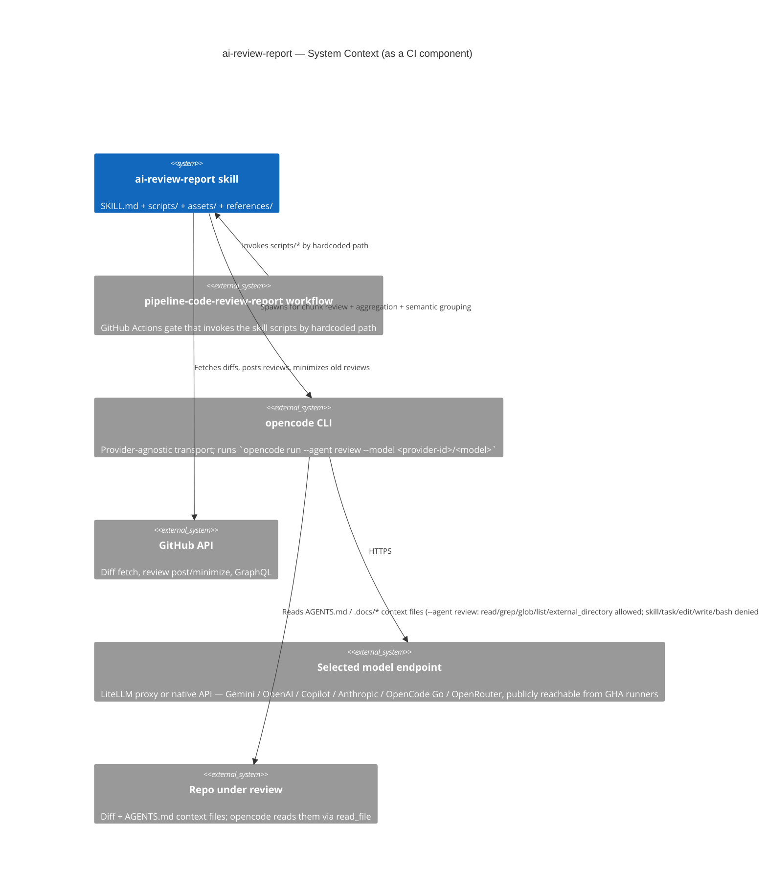

# ai-review-report — Editor's Context

## TL;DR

`ai-review-report` is the **generator** half of the PR code-review skill pair (paired with `/ai-review`, the consumer). It runs as a GitHub Actions gate (`.github/workflows/pipeline-code-review-report.yml`), reviews PRs in chunks via the `opencode` CLI transport, and posts a structured review. SKILL.md is the runtime contract the review model follows; this file is the edit-time companion — LADR history, env-var provenance, confirmed-FP PR references, and the skill layout the gate resolves via `$REVIEW_SKILL_DIR`.

## Non-Negotiables

- **Workflow ↔ script paths are coupled.** Every script invocation in the gate goes through `$REVIEW_SKILL_DIR` (LADR-037), which resolves to the literal `.agents/skills/ai-review-report` when the skill is in the checkout, else to the `.smooth-ai-review-tools/` side checkout. Moving or renaming a script, the skill folder, or the workflow file (`pipeline-code-review-report.yml`) silently breaks the gate in all modes. Change the workflow YAML and the scripts in the same commit.
- **Skill frontmatter is required for skill activation.** `SKILL.md`'s YAML frontmatter (`name` + `description`, plus repo-standard invocation metadata such as `switches`) is what Claude Code / Codex / Copilot read to decide *when* and *how* to load the skill. Don't strip the frontmatter to "clean up markdown"; the `description` field is the activation trigger and `switches` documents supported entrypoints.
- **Agent Skills format is the same across all three loaders.** The skill is a directory containing `SKILL.md` (frontmatter + body) and optional `assets/`, `references/`, `scripts/` subfolders — per [agentskills.io](https://agentskills.io). Keep runtime behavior in the body/scripts rather than loader-specific frontmatter; what differs is *where* the skill folder lives, not how it's authored.
- **History of decisions lives in references/CHANGELOG.md**, not here. This file is the **narrative** of why current behaviour looks the way it does (LADRs, FP PR refs, supersede chains); references/CHANGELOG.md is the **dated audit trail** of every commit. Don't duplicate it.
- **`AGENTS.md` per-skill is a Claude Code / Codex / Copilot project-doc convention**, not an Agent Skills field. The Agent Skills spec does not define an `AGENTS.md` file inside a skill — the convention this repo adopts is that a sibling `AGENTS.md` is loaded by Claude Code's `AGENTS.md` discovery, by Codex's `AGENTS.md` discovery, and by Copilot's `.github/instructions/*.instructions.md` discovery. Keep that in mind if the Agent Skills spec ever diverges.

## System Context

`ai-review-report` is a CI gate that, when triggered, fetches the PR diff, splits it into chunks, dispatches each chunk to the selected provider's model through the `opencode` CLI transport, then aggregates the per-chunk reviews into a single posted PR review. The model is selected by `OPENCODE_REVIEW_REPORT_PROVIDER` (`GEMINI` / `COPILOT` / `OPENAI` / `ANTHROPIC` / `OPENCODE-GO-OPENAI` / `OPENCODE-GO-ANTHROPIC` / `OPENCODE-GO-RESPONSES` / `OPEN_ROUTER`). The scripts under `scripts/` are the only entry points the workflow calls; the `assets/` folder holds runtime config the scripts install; the `references/` folder holds edit-time docs (this file, CHANGELOG.md, and the quality standards).



## Skill Layout

The skill folder is **referenced by hardcoded path** from the workflow and the scripts themselves. Don't reorganize it without a paired workflow change.

| Path | Type | Loaded by | Purpose |
|------|------|-----------|---------|
| `SKILL.md` | runtime | Claude Code / Codex / Copilot skill loader (frontmatter `description`); also read by the reviewer model via opencode's read tools | The runtime contract — frontmatter, what the model must do, current Decision + Consequences of every accepted LADR, Key Behaviors, decision matrix. |
| `AGENTS.md` (this file) | edit-time | Claude Code / Codex / Copilot project-doc loader | The editor's companion — LADR history with full Context, env-var provenance, confirmed-FP PR refs, supersede chains, skill layout, what the model doesn't need to read every review. |
| `assets/opencode.json` | runtime | `lib/prepare-opencode-config.sh` copies it to the run-local `OPENCODE_CONFIG` path | Provider config — `gemini`, `github-copilot`, `openai`, `anthropic`, `go-openai`, `go-anthropic`, `go-responses`, `openrouter`; locked-down `review` agent (LADR-029); `permission.external_directory: allow` (LADR-025). |
| `scripts/` | runtime | The workflow invokes these by hardcoded path | Shell: `review-in-chunks.sh`, `aggregate-reviews.sh`, `find-context-files.sh`, `filter-excluded-files.sh`, `minimize-previous-reviews.sh`, `local-review.sh`, `validate-agents-md.sh`, `test-minimize-reviews.sh`, `test-review-chunk-threshold.sh`, `test-chunk-prompt-budget.sh`, `test-balance-fences.sh`, `test-validate-agents-md-disable.sh`, plus `eval/` (LADR-033) and `lib/` helpers (`balance-fences.sh`, `count-changed-files.sh`, `extract-ai-analyse-scope.sh`, `intersect-changed-files.sh`, `resolve-diff-base.sh`, `resolve-provider.sh`, `prepare-opencode-config.sh`, `opencode-with-fallback.sh`, `opencode-health.sh`, `gh-retry.sh`). |
| `references/CHANGELOG.md` | edit-time | Coder reading history | **Dated audit trail** of every commit to the skill. Load when updating the skill or auditing past decisions; not needed for routine execution. Contains the imported history pre-2026-06-01 (legacy names like `.ai/`, `gemini-code-review`, `manual-gemini-cli-code-review.yml` — these do not exist in this repo, preserved as record). |
| `references/knowledge-conventional-contexts-quality.instructions.md` | edit-time | Coder authoring or updating `*_AGENTS.md` files | The repo-wide AGENTS.md quality standards the review/validation prompts apply. |

## Environment Variables — Provenance

The full env-var table the model must follow is in SKILL.md. **What lives here is the provenance and the *why* of the renaming rules** — the per-Variable rules that govern how to add a new provider or change a key.

**Variables vs Secrets — the iron rule.** Gateway **API keys** are credentials → GitHub **Secrets** (never Variables — Variables are plaintext and printable in logs). Gateway **URLs**, the `OPENCODE_REVIEW_REPORT_PROVIDER` selector, the `OPENCODE_REVIEW_REPORT_MODEL_*` ids, the `OPENCODE_REVIEW_REPORT_HEALTH_TIMEOUT`, `OPENCODE_REVIEW_REPORT_MAX_FILE_COUNT`, and `OPENCODE_REVIEW_REPORT_DISABLE_AGENTS_MD_CHECK` are non-sensitive config → **Variables**, so they can be retuned without editing the workflow. The exceptions that prove the rule: **OpenCode Go's fixed public base `https://opencode.ai/zen/go/v1`** (LADR-027), **OpenRouter's fixed public base `https://openrouter.ai/api/v1`** (LADR-039), and **Anthropic's fixed public base `https://api.anthropic.com`** (LADR-040) are hardcoded in `opencode.json` — all three are single SaaS endpoints with no per-deployment URL to retune, so there is no `OPENCODE_GO_*_URL`, `OPENCODE_REVIEW_REPORT_OPENROUTER_URL`, or `OPENCODE_REVIEW_REPORT_ANTHROPIC_URL` Variable. The API-key Secrets (`OPENCODE_GO_OPENAI_API_KEY`, `OPENCODE_GO_ANTHROPIC_API_KEY`, `OPENCODE_OPENROUTER_API_KEY`, `OPENCODE_ANTHROPIC_API_KEY`) remain env-injected. Each env-driven provider's gateway URL is **consumed at install time**: `lib/prepare-opencode-config.sh` injects `OPENCODE_REVIEW_REPORT_<P>_URL` (when set) as that provider's `options.baseURL` in the run-local `opencode.json` (LADR-034) — the committed config carries no `baseURL`, and an unset URL leaves the provider on its native SDK base. (The generic derived `OPENCODE_REVIEW_REPORT_GATEWAY_URL` below is a separate copy used only for the credential presence check.)

**Renaming rule — the LADR-032 `OPENCODE_*` → `OPENCODE_REVIEW_REPORT_*` rename.** A non-key config var uses the `OPENCODE_REVIEW_REPORT_` prefix. API-key Secrets keep their `OPENCODE_<PROVIDER>_API_KEY` names — they're provider credentials, not review-report config. When adding a new non-key Variable, the prefix is mandatory; when the repo's GitHub Variables aren't renamed to match, the gate reads them empty and falls back to defaults (Secrets are unaffected). Historical changelog/LADR mentions of old/removed var names are left intact as record.

**Derived Variables.** Two Variables are **derived at runtime** by `lib/resolve-provider.sh` and not user-set: `OPENCODE_REVIEW_REPORT_PROVIDER_ID` (the opencode.json provider key prefixed onto the model — `gemini` / `github-copilot` / `openai` / `anthropic` / `go-openai` / `go-anthropic` / `go-responses` / `openrouter`) and `OPENCODE_REVIEW_REPORT_GATEWAY_URL` / `OPENCODE_GATEWAY_API_KEY` (the selected provider's creds copied to generic names for the credential presence check — note the API-key Secret name does **not** take the `OPENCODE_REVIEW_REPORT_` prefix because it stays a Secret). The provider-agnostic OpenCode v2 health check uses `opencode api get /api/info` (LADR-087), not per-provider gateway probes.

**`OPENCODE_REVIEW_REPORT_DISABLE_CLAUDE_CODE` and `OPENCODE_DISABLE_CLAUDE_CODE`.** The first is a GitHub Variable; the second is derived from it. They disable all `.claude` support in opencode to prevent conflicts with Claude Code's `.claude` directory features. Default `1` (disabled). Set `OPENCODE_REVIEW_REPORT_DISABLE_CLAUDE_CODE=0` to re-enable `.claude` support.

**`OPENCODE_REVIEW_REPORT_ENABLE_GH_RETRY` (LADR-078).** A Variable, default `1`, declared in **both** `pipeline-code-review-report.yml`'s job `env:` and `.docs/examples/code-review-local.yml`'s step `env:`. Gates the one-retry-after-30s wrapper around every `gh` call that can abort the run. Falsy restores the pre-LADR-078 single-attempt behaviour exactly. Note the deliberate divergence from `build-code-graph.sh` / `install-rtk.sh`, where the **caller** decides whether to invoke the lib at all: `lib/gh-retry.sh` reads this toggle itself, because the `gh` call must always happen and only the retry is optional. The 30s delay is **not** a Variable — it is a constant, and `GH_RETRY_DELAY_SECONDS` exists solely so `test-gh-retry.sh` does not sleep 30s per case.

**`workflow_dispatch` overrides.** The `model_preset` `choice` input and the free-text `model` input both live in the workflow `env:` block. `model_preset` is the **first `||` term** in each expression so it wins over the free-text `model` input and the `OPENCODE_REVIEW_REPORT_*` Variables. Adding/renaming a `model_preset` option requires editing both the `options:` list and the five `env:` expressions (PROVIDER, PROVIDER_ID, three model tiers) in the same commit — they are coupled by the literal option strings — plus the duplicated `model_preset` dropdown in `.docs/examples/code-review-caller.yml` (reusable-workflow callers own their own `choice` list). The dropdown currently has nine non-default options (GPT-5.5, four OpenCode Go, four OpenRouter).

**Local runs.** Bare skill-level `--local` is fully specified: run `scripts/local-review.sh` with no extra arguments, reviewing HEAD/current branch against `main`, not posting, using `OPENCODE_REVIEW_REPORT_PROVIDER` if set and otherwise `OPENAI`, and using script model defaults unless explicit overrides are supplied. `local-review.sh` harvests every provider's credentials from shell rc files, including shared Zen key `OPENCODE_GO_OPENAI_API_KEY` for Chat Completions and Responses surfaces.

## Architecture Decisions (LADRs)

The LADRs are the **decisions an AI coder would plausibly re-litigate if they didn't read them**. Full Date/Status/Context/Decision/Consequences for each; what survives in SKILL.md is the *Decision + Consequences* in compressed form, with the *Context* stripped because the model doesn't need it at runtime. LADR numbering is append-only — superseded entries (LADR-008, 014, 017, 018) and partially-superseded entries (LADR-023, 024) stay in this file with their full Date/Status/Context/Decision/Consequences/Supersede-by chain. Don't renumber.

### LADR-001: Chunked Review Processing

- **Date**: 2025-10-28
- **Status**: Accepted
- **Context**: Large PRs caused JavaScript heap exhaustion and EventEmitter memory leaks in Gemini CLI.
- **Decision**: Split diffs into chunks (<100KB each) grouped by directory, each as a separate model API call, with final aggregation.
- **Consequences**: Memory-efficient and scalable; multiple API calls increase cost; needs cross-chunk holistic analysis (now runs for every PR per LADR-030).
- **See also**: LADR-010 (adaptive split on large dirs), LADR-011 (semantic grouping for 15+ files), LADR-030 (holistic aggregation now unconditional).

### LADR-002: Two-Tier Review Model Chain

- **Date**: 2025-12-19 (Updated: 2026-05-29)
- **Status**: Accepted
- **Context**: Gemini models may be unavailable due to quota exhaustion, rate limits, or regional issues. Deep chunk review needs a capable model; cheap orchestration (grouping/summary) is split out to its own model (LADR-022).
- **Decision**: Deep chunk-review chain is two-tier: `OPENCODE_REVIEW_REPORT_MODEL_PRIMARY` (default `gemini-3.1-pro-preview`) → `OPENCODE_REVIEW_REPORT_MODEL_SECONDARY` (default `gemini-2.5-pro`). No third tier — the old `auto`/Flash last-resort reviewer was removed; a degraded Flash review is worse than an honest "models down". If BOTH review models fail the startup probe, soft-fail per LADR-021. Models come from GitHub **Variables** (literal defaults); `workflow_dispatch` input overrides the primary. The startup probe tests only these two review models (the orchestrator is not probed — LADR-022). Error detection includes quota/rate-limit patterns.
- **Consequences**: High reliability for the substantive review; slightly longer startup due to model testing. Independent of the orchestrator tier, which can be retuned without touching the review chain.

### LADR-003: Context-Aware Review with On-Demand File Access

- **Date**: 2025-11-15
- **Status**: Accepted
- **Context**: Including full `*AGENTS.md` contents in prompts caused size bloat and false positives (Gemini flagged issues without seeing full context).
- **Decision**: Use `--yolo` flag (legacy: gemini-cli) → now realized as the `review` agent's read/grep/glob/list/external_directory allow-list (LADR-025/029). Pass file paths only, instruct Gemini to READ files before flagging Critical/High issues.
- **Consequences**: No prompt size increase; reduced false positives; slightly slower when many files need verification.

### LADR-004: Incremental Reviews Must Never Approve

- **Date**: 2025-11-20
- **Status**: Accepted
- **Context**: Bug where incremental reviews approved PRs, bypassing blocking states from full reviews (PR #3946 — the original confirmed-FP incident).
- **Decision**: Incremental reviews MUST always use `--comment`, never `--approve`. Only full reviews can approve.
- **Consequences**: Prevents bypassing unresolved Critical/High issues; requires manual approval when incremental finds no new issues.
- **Confirmed false positive if violated**: PR #3946.

### LADR-005: Two-Part Aggregation Output

- **Date**: 2025-11-28
- **Status**: Accepted
- **Context**: Single aggregation mixed executive summary with detailed analysis, creating visual clutter.
- **Decision**: Split using `DETAILED_SECTION_MARKER` delimiter. Part 1 = executive summary (always visible). Part 2 = holistic cross-chunk analysis (collapsible with chunk details).
- **Consequences**: Clean overview for decision-makers; requires the model to follow the two-part format.

### LADR-006: Test File Pairing with Implementation Files

- **Date**: 2025-12-05
- **Status**: Accepted
- **Context**: Tests and implementation reviewed in separate chunks, making coverage verification difficult.
- **Decision**: Map test files to implementation files (`.NET: *Test.cs→*.cs`, `Frontend: *.spec.ts→*.ts`) and group them in the same chunk.
- **Consequences**: Tests reviewed alongside code they validate; slightly larger chunks.

### LADR-007: Markdown-Based Separator Instead of JSON

- **Date**: 2025-12-01
- **Status**: Accepted
- **Context**: JSON output from the model frequently had schema violations (unescaped quotes, trailing commas).
- **Decision**: Use markdown with `DETAILED_SECTION_MARKER` delimiter, parsed with `sed`/`grep`.
- **Consequences**: Reliable parsing; less structured than JSON but works well for LLM outputs.

### LADR-008: Unified Concurrency Group (Superseded)

- **Date**: 2026-01-02
- **Status**: **Superseded by LADR-009**.
- **Context**: Race condition where manual and automated reviews ran concurrently on the same commit.
- **Decision**: All events use the same concurrency group.
- **Why superseded**: Caused `/ai-review` comments to cancel in-progress automated reviews.

### LADR-009: Selective Concurrency

- **Date**: 2026-01-02
- **Status**: Accepted
- **Context**: LADR-008 caused reviews to be cancelled mid-execution.
- **Decision**: Only `pull_request` events share concurrency group `ai-review-{pr_number}`. Other events (`issue_comment`, `workflow_dispatch`) use unique `{run_id}-{run_attempt}` per run. `pull_request_target` trigger was removed (caused duplicate runs on PR creation).
- **Consequences**: Automated reviews always complete; manual triggers run independently; rapid commits still cancel each other.

### LADR-010: Adaptive Chunk Splitting by Directory Depth

- **Date**: 2026-02-17
- **Status**: Accepted
- **Context**: Large directories (e.g., ProsmarBunkering.Web with 13 files, ~130KB diff) exceeded Gemini API limits. `MAX_CHUNK_SIZE` was declared but never enforced.
- **Decision**: After initial grouping, calculate cumulative diff size per group. If exceeding 100KB, re-group by next directory level, up to 5 iterations. Single-file groups kept as-is.
- **Consequences**: Prevents API failures on large groups; uses natural directory structure; adds minor `git diff | wc -c` overhead.

### LADR-011: Semantic Business Context Grouping via LLM

- **Date**: 2026-02-17 (Threshold raised 2026-05-28)
- **Status**: Accepted
- **Context**: Directory-based chunking splits cross-cutting features into isolated chunks (e.g., IMOS change across 3 directories reviewed separately). Threshold was raised from 8 → 15 on 2026-05-28 after PR #5326 (10 files) over-split into 6 chunks with tiny per-chunk output, hitting GitHub's 65KB review-body limit.
- **Decision**: LLM pre-processing groups files by business context for PRs with 15+ files. 60-second timeout, strict validation (every file exactly once), falls back to directory grouping on failure. Includes "logic moved" detection: when code is removed from one file and similar code added in another, both are grouped together.
- **Consequences**: Cross-cutting features reviewed together for medium-to-large PRs; small PRs (<15 files) skip the extra semantic-grouping API call (~10-30s saved) and use cheaper directory grouping. Non-deterministic grouping above the threshold; LADR-010 applies as safety net.
- **Confirmed false positive if threshold is too low**: PR #5326 (10 files, 6 tiny chunks).

### LADR-012: Confidence Tagging and Verification-Incomplete Suppression

- **Date**: 2026-03-10
- **Status**: Accepted
- **Context**: The model frequently flagged test coverage or implementation concerns for files it never received in its chunk, producing false positives. Downstream tooling (`/ai-review:analyse`) had no way to distinguish verified findings from speculative ones.
- **Decision**: (1) Chunk prompts instruct the model to suppress findings for files not in the chunk at Critical/High/Medium — only Low (informational) allowed. (2) Every finding must be tagged `[VERIFIED]` (code seen in diff or via `read_file`) or `[SPECULATIVE]` (inferred from partial context). (3) Aggregation prompt preserves tags and prevents elevating speculative findings.
- **Consequences**: Reduces false positives from partial-context inference; enables downstream auto-downgrading of speculative findings; adds ~2 tokens per finding for the tag.
- **Grammar reference** (used by the eval harness, LADR-033): only `[VERIFIED]` Critical/High/Medium count; `[SPECULATIVE]` and "None found" never count.

### LADR-013: Migration/Schema Chunk Detection

- **Date**: 2026-03-11
- **Status**: Accepted
- **Context**: EF Core migration files and raw SQL scripts have fundamentally different review concerns than application code (reversibility, existing data handling, nullable column safety, index locking) — but previously received the standard code review prompt, causing the model to focus on correctness and security instead of migration-specific risks.
- **Decision**: Detect chunks containing `*.sql`, `*_Migration.cs`, or `*/Migrations/*.cs` files and route them to a migration-focused prompt. Migration detection takes priority over doc-only detection in the three-way branch.
- **Consequences**: Migration PRs get actionable feedback on rollback paths and data safety. Standard code review items (performance, security, test coverage) are intentionally replaced — if a chunk mixes migration and application code, migration review applies.

### LADR-014: RTK Token Optimization for Gemini CLI

- **Date**: 2026-03-24
- **Status**: **Superseded by LADR-023** (RTK Gemini hook is specific to `@google/gemini-cli`; opencode transport is incompatible with it). **Re-adopted by LADR-054** via RTK's OpenCode plugin (`rtk init --opencode`), which closes the incompatibility this entry describes — the Gemini-CLI hook itself is still dead, but RTK is back in the pipeline through a different mechanism.
- **Context**: Gemini CLI `--yolo` mode reads files via tool calls that return full uncompressed content, consuming tokens on large files. RTK proxies these tool outputs through intelligent filtering and compression.
- **Decision**: Install RTK in CI pipeline and configure the Gemini hook (`rtk init -g --gemini --auto-patch --hook-only`). RTK intercepts Gemini's `read_file` and shell tool calls, compressing outputs before they reach the model context.
- **Consequences** (at the time): 60-90% token reduction on tool outputs; adds ~5s install overhead; single Rust binary with zero runtime dependencies; transparent to review scripts.
- **Why superseded**: After the LADR-023 transport migration the workflow no longer invokes `@google/gemini-cli`. RTK's Gemini hook only intercepts that binary's tool I/O — opencode handles its own tool calls outside RTK's interception path. The chunked architecture (LADR-001) already bounds prompt size to <100KB per chunk, which is what RTK's compression was protecting; per-PR token cost is monitored after the migration to confirm spend stays bounded.

### LADR-015: Strengthened Critical/High Verification and Diff Integrity Checks

- **Date**: 2026-03-23
- **Status**: Accepted (extended 2026-06-11 to cover claim-correctness for external platform/framework semantics — see DR-015)
- **Context**: PR #4787 review produced false positives: (1) corrupted/large diff caused the model to flag "review blocked" as Critical, (2) the model flagged a symbol as still present despite it being removed in an earlier commit on the same branch — `read_file` would have shown its absence. Extended after PR #36 review 4473891333: the gate hallucinated 2 Criticals + 1 High about GitHub Actions `workflow_call` semantics (`github.event_name` and `github.event.pull_request.*` are never empty in a reusable workflow — the caller's context is inherited) and a third about regex-escaping dots in `on.push.tags` (GHA filters are globs, not regex). The original LADR-015 only covered *symbol existence*; seeing `github.event.*` in the diff was enough to earn `[VERIFIED]` even when the *claim about the platform* was wrong.
- **Decision**: Two changes: (a) Chunk prompt now requires Critical/High verification to confirm the flagged symbol exists in the **current file state** via `read_file`, not just in the diff hunk. (b) Per-file diff integrity check warns the model when a file's diff exceeds `MAX_CHUNK_SIZE`, instructing it not to raise Critical/High without `read_file` verification. Additionally, `/ai-review:analyse` auto-recommends skip for `[SPECULATIVE]`-tagged findings. Extension (DR-015): the same `[VERIFIED]` discipline is applied to **platform/framework-behavior claims** — if a finding depends on a claim about how GitHub Actions contexts/triggers, npm/registry, git, or SDK contracts behave (not just on the diff code), that claim must itself be verified via `webfetch` of official docs or downgraded to `[SPECULATIVE]`. Seeing the code in the diff does NOT verify the platform claim. Locked in by eval fixture `DR-015-gha-workflow-call-context` (must-not-flag, zero-tolerance at Crit/High/Med).
- **Consequences**: Reduces false positives from stale diff context, large/truncated diffs, and fabricated platform semantics; adds minor per-file size check overhead and one `webfetch` round-trip on the uncommon path where the model wants to flag Critical/High on a platform-behavior basis (the model can always downgrade to `[SPECULATIVE]` at no cost); speculative findings no longer require manual triage.
- **Confirmed false positive if violated**: PR #4787 (symbol-existence class); PR #36 (platform-semantics class).

### LADR-016: Release Branch Sync Review Mode

- **Date**: 2026-04-07
- **Status**: Accepted
- **Context**: Release branch sync PRs (`chore/bnk[uir]-001-sync-*`) aggregate already-reviewed code from multiple PRs. Standard review flagged style, test coverage, and performance on code that was already reviewed — generating noise and wasting reviewer time.
- **Decision**: Detect sync branches by head ref prefix (case-insensitive). Pass `REVIEW_MODE=sync` to chunk and aggregation scripts. Sync mode narrows chunk prompts to merge conflict errors, cross-PR breaking combinations, config drift, and migration ordering conflicts. Aggregation holistic analysis is similarly narrowed. Severity threshold raised: only Critical and High used, everything else is Low (informational).
- **Consequences**: Sync PRs get focused, actionable reviews instead of noise. Trade-off: genuine issues in already-reviewed code won't be caught (acceptable because original PR review should have caught them).

### LADR-017: Single-Chunk Aggregation Short-Circuit

- **Date**: 2026-05-12
- **Status**: **Superseded by LADR-030** (the holistic aggregation now runs for every PR, including single-chunk ones).
- **Context**: For PRs that produce a single chunk, the aggregation step still ran the full "Holistic Cross-Chunk Analysis" call — a Pro-tier model with `--yolo` `read_file` access and a ~430-line prompt template. Observed cost on PR #5179 (1 chunk): chunk review 8 min, aggregation 15 min (total 25 min). With one chunk there is by definition no *cross-chunk* surface to analyse, so the holistic pass is pure overhead and re-derives findings that already exist in the chunk review.
- **Decision**: When `TOTAL_CHUNKS=1`, skip the full holistic-aggregation call. Instead: (1) parse `🔴 [VERIFIED] Critical:` and `🟠 [VERIFIED] High Priority:` lines from the chunk review to determine the decision programmatically; (2) make one small targeted call on the ORCHESTRATOR model (LADR-022) — with a minimal prompt asking for 2-3 sentences describing what the PR changes and why. This fills `## 📋 Overall Summary` with a real narrative instead of a canned message. If the targeted call fails, fall back to the canned message. Placeholder filter uses case-insensitive regex that handles quoted, bolded, and period-terminated "None found" variants. Only `[VERIFIED]` findings can block — `[SPECULATIVE]` cannot promote to a blocking decision (consistent with LADR-012/LADR-015). LADR-004 enforcement preserved: incremental reviews always resolve to `COMMENT`, never `APPROVE`.
- **Consequences** (at the time): Eliminated the ~15-min holistic call for single-chunk PRs while preserving the readable summary.
- **Why superseded**: The cost premise no longer held once LADR-022 moved aggregation onto the cheap orchestrator/Flash model (~30 s, not 15 min on Pro), and skipping the holistic pass left small PRs without the aggregated Overall Summary / Issues Summary / Suggested Fixes high-level report users expected. See LADR-030.
- **Confirmed false positive if reverted**: PR #5179 (cost); PR #10 (3 files → single chunk via `OPENCODE_REVIEW_MIN_FILE_COUNT_BEFORE_CHUNCKING=10` produced placeholders only).

### LADR-018: Flash Model for Aggregation Step

- **Date**: 2026-05-12
- **Status**: **Superseded by LADR-022** (aggregation now uses the explicit `OPENCODE_REVIEW_REPORT_MODEL_ORCHESTRATOR`).
- **Context**: LADR-002 specifies a Pro-tier model for the review job. The same model was used for both chunk reviews (analytical) and the aggregation summary (summarisation). Aggregation is summarising chunk reviews into a PR-level overview and emitting a recommendation — not deep analysis. Pro-tier latency on the aggregation step (~15 min observed) is wasted on a task a Flash model can do in 2-3 min.
- **Decision**: Derive an `AGGREGATION_MODEL_ID` from `OPENCODE_MODEL_ID` inside `aggregate-reviews.sh`: `gemini-3*-pro*` → `gemini-3-flash-preview`, `gemini-2.5-pro*` → `gemini-2.5-flash`, anything else → pass-through. Chunk-review model selection (LADR-002 fallback chain) is unchanged. The `**Model:**` field in the posted review comment continues to show the chunk-review model (Pro), since chunk reviews drive the substantive findings — the Flash aggregation model is an implementation detail.
- **Consequences** (at the time): ~3-5× faster aggregation on multi-chunk PRs. No quality loss because aggregation is structured summarisation, not analysis. If the Flash variant is not available the LADR-002 fallback chain doesn't apply at the aggregation step — failure hits the `❌ Summary generation failed - using fallback` path.
- **Why superseded**: The `auto` derivation was replaced by an explicit, independently-tunable orchestrator Variable; the proxy-router dependency was removed.

### LADR-019: No `read_file` Access at Aggregation Step

- **Date**: 2026-05-12
- **Status**: Accepted
- **Context**: LADR-003 grants `read_file` access to *all* model calls. The aggregation prompt invited the model to `read_file` during the holistic pass to "verify concerns before flagging" and to "upgrade `[SPECULATIVE]` tags to `[VERIFIED]`". In practice this caused duplicate file reads: chunk reviews already performed `read_file` verification for every Critical/High finding (per Key Behavior "Critical/High symbol verification"), so the aggregation re-reads the same files to re-check the same findings. Multiple tool-call round-trips at Pro-tier latency contributed substantially to the 15-min aggregation time.
- **Decision**: Strip `read_file` invitations from the aggregation prompt template. The prompt instructs the model that file-system verification is not its job. Confidence-tag promotion (`[SPECULATIVE]` → `[VERIFIED]`) is removed from the aggregation responsibilities — chunk reviews own it.
- **Consequences**: Fewer agentic round-trips at aggregation. Quality preserved because the *verification* layer is unchanged — chunk reviews still do the file-state checks per LADR-015. Trade-off: if a chunk review missed a verification opportunity, the aggregation can no longer rescue it. Acceptable: missing verification at chunk level is a chunk-review prompt bug to fix at that layer, not papered over downstream.

### LADR-020: Skip Integration / DI / Test-Coverage Sections on Small PRs

- **Date**: 2026-05-12
- **Status**: Accepted
- **Context**: The holistic aggregation prompt unconditionally requested Integration, Dependency Injection Analysis, and Test Coverage Analysis sections for `full` reviews. These are intra-chunk concerns — chunk-review prompts already evaluate them per chunk for the changed files. Asking the aggregation model to re-derive them for 1-2 chunk PRs is duplicate work with low marginal value.
- **Decision**: Gate the Integration / DI / Test Coverage sections of the holistic prompt on `REVIEW_TYPE=full AND TOTAL_CHUNKS > 2`. Combined into a single guarded block (previously two adjacent `if` statements with identical condition).
- **Consequences**: Smaller prompt and faster aggregation on small PRs. For 3+ chunk PRs the sections still run, because cross-chunk integration/DI consistency is a genuine concern when changes span many files. No loss of coverage on 1-2 chunk PRs because the underlying chunk review already evaluated those concerns on the changed files.

### LADR-021: All-Models-Failed Posts Request-Changes Instead of Failing Workflow

- **Date**: 2026-05-25
- **Status**: Accepted
- **Context**: When both review models (primary + secondary per LADR-002) failed during the startup probe — typically due to upstream token quota exhaustion, key/billing problems, or a regional outage — the workflow exited with `exit 1`. The resulting red ❌ gate check blocked merges even though the failure was infrastructure-side, not a code defect. Observed in run 26387093767: every model returned a quota/auth error and the job failed with no review posted.
- **Decision**: On all-models-failed, the model-test step sets `all_models_failed=true` (and `selected_model=none`) and completes successfully. A new step `Post Request Changes - All Gemini Models Failed`, gated on `steps.gemini_model_test.outputs.all_models_failed == 'true'`, posts a `--request-changes` review naming the failed models and pointing to the workflow logs. All downstream side-effect steps (`Validate AGENTS.md`, `Block PR if AGENTS.md Validation Failed`, `Skip Review Due to Blocking Review`, `Review PR in Chunks`, `Aggregate Reviews`, `Minimize Previous Gemini Reviews`, `Post Review Comment`, `Post Error Comment`) are gated with `steps.gemini_model_test.outputs.all_models_failed != 'true'` so they no-op on this path. The job exits green.
- **Consequences**: Quota / API-key incidents surface as a request-changes review (the existing "Failed → request-changes" branch of the decision matrix in Key Behaviors) rather than a red workflow check. Re-running once the upstream issue is resolved (via `/ai-review`) clears the request-changes state through a fresh full review. Trade-off: a green workflow check no longer guarantees a Gemini review ran — reviewers must read the posted review body to see whether substantive findings or an infrastructure failure produced the request-changes verdict.
- **Confirmed run**: 26387093767.

### LADR-022: Explicit Orchestrator Model for Non-Analytical Calls

- **Date**: 2026-05-26 (Updated: 2026-05-29)
- **Status**: Accepted (supersedes LADR-018)
- **Context**: Every PR runs two non-analytical calls — semantic grouping (`review-in-chunks.sh`) and aggregation/summary (`aggregate-reviews.sh`). Both are classification/summarisation, not code analysis, so they belong on a cheap model. The original design used an `auto` logical label derived from the review model via `get_aggregation_model()`, which hid the actual model behind proxy-router behaviour and coupled the cheap tier to the review tier.
- **Decision**: Replace the `auto` derivation with an explicit, independently-tunable `OPENCODE_REVIEW_REPORT_MODEL_ORCHESTRATOR` (default `gemini-3-flash-preview`, a GitHub Variable). All non-chunk-review calls run on it. Its fallback is the **resolved review model** (the chunk chain's winner), so if the orchestrator is down the summary still runs on a known-healthy model. The orchestrator is intentionally **not** probed at startup (its fallback is already proven by the LADR-002 probe). Removed: the `auto` logical name, `resolve_model()`'s `auto`→flash mapping, and `get_aggregation_model()`.
- **Consequences**: Lower per-PR cost without changing review quality (analysis stays on the Pro review chain). The `**Model:**` field shows the resolved review model. Deterministic — no reliance on a proxy router to interpret `auto`. Orchestrator and review tiers tune independently.

### LADR-023: opencode as Transport for Gemini Models

- **Date**: 2026-05-28
- **Status**: Accepted (now partially superseded by LADR-029 — chunk review now passes `--agent review` rather than the default `build` agent)
- **Context**: Google's public-tier Gemini CLI (`@google/gemini-cli`) stops serving Pro/Ultra/free accounts on 2026-06-18. Enterprise Gemini Code Assist licences are exempt; we use the public-tier endpoint behind an internal LiteLLM proxy, so the deadline applies to us. Antigravity CLI (Google's official replacement) is OAuth-only with no `--model` flag in print mode — not viable for headless CI on self-hosted runners. Pi (`@earendil-works/pi-coding-agent`) was viable but smaller ecosystem. opencode (`opencode-ai`, MIT, 166k stars, 900 contributors) was chosen.
- **Decision**: Use `opencode` as the CLI transport. Gemini *models* unchanged — LADR-002 two-tier review chain and LADR-022 (explicit orchestrator) preserved at the call-site level. The provider was originally declared in `assets/opencode.json` with a static `baseURL={env:OPENCODE_REVIEW_REPORT_GEMINI_URL}` placeholder + `apiKey={env:OPENCODE_GEMINI_API_KEY}`; the `litellm-gemini` name was later renamed to `gemini` (BNKI-001 PR #1) and the static `baseURL` placeholders removed. **Current state (LADR-034):** the committed config carries **no** `baseURL` (DR-009); the gateway `baseURL` is injected at install time from `OPENCODE_REVIEW_REPORT_GEMINI_URL` when set, else the native API base is used. Originally passed NO `--agent` flag — that stance was superseded by LADR-029 (custom `review` agent with no pinned `model` field, so `--model` still wins). The `gemini` provider registers four physical model ids (`gemini-3.1-pro-preview`, `gemini-2.5-pro`, `gemini-3-flash-preview`, `gemini-2.5-flash`). The old `auto` logical name and its `resolve_model()` mapping were removed (LADR-022) — every call site now passes an explicit model id.
- **Consequences**: Unblocks the 2026-06-18 EOL deadline. Posted review still surfaces the chunk-review model id in `**Model:**`. The workflow filename is `pipeline-code-review-report.yml` (the comment trigger is `/ai-review`). LADR-015 file-state verification works via the `review` agent's read tool.

### LADR-024: Single Gateway Provider + Local Reachability Preflight

- **Date**: 2026-05-29
- **Status**: **Partially superseded by LADR-026 (single-provider → env-based selection) and LADR-028 (the local gateway reachability preflight is replaced by the opencode-server health check)**. Only the `timeout`-shim part remains in force.
- **Context**: Both CI and local reviews originally ran through the internal LiteLLM gateway (`litellm-gemini` provider) on `OPENCODE_REVIEW_REPORT_GEMINI_URL` + `OPENCODE_GEMINI_API_KEY`. The gateway is on a private network: off-VPN, every `opencode run` hung indefinitely (the macOS `timeout` shim killed only the bash wrapper, orphaning opencode) — a silent multi-minute "deadlock".
- **Decision**: One provider everywhere — `litellm-gemini`. `local-review.sh` (a) harvested `OPENCODE_GEMINI_*` from the shell rc files, and (b) ran an 8s gateway `/health` preflight before any review work, aborting with a "connect to VPN" message if unreachable. The `timeout` shim was rewritten to run each call in its own process group and `kill -KILL` the group on expiry, so genuine hangs are bounded (60s grouping / 300s chunk) and no orphans leak.
- **Consequences** (still in force for the `timeout`-shim half): Local runs need network access to the resolved endpoint. Genuine hangs are bounded; no process orphans.
- **Why partially superseded**: The "one provider everywhere" stance was reversed by LADR-026 — the provider is now env-selectable and the endpoint can be a LiteLLM proxy *or* a provider's native API. The per-provider reachability preflight was itself later removed by LADR-028 in favour of the provider-agnostic opencode-server `/global/health` check (which does **not** pre-empt a private-network/VPN hang — the process-group `timeout` shim still bounds any hang during the actual model calls).

### LADR-025: Allow `external_directory` reads (headless `--yolo` equivalent)

- **Date**: 2026-06-01
- **Status**: Accepted
- **Context**: Chunks intermittently failed with `## ⚠️ Review Failed for Chunk`. The chunk prompt lists context-file paths and instructs the model to `read_file` each; context includes in-repo dot-paths (`.github/*AGENTS.md`, `.docs/nfr/*`, `.agents/rules-scoped/*`). opencode's `read` permission defaults to `allow`, but **`external_directory` defaults to `ask`** — and in non-interactive `opencode run` there is no responder, so opencode **auto-rejects** those reads → the model call errors/empties → the chunk is marked failed → the fail-closed net forces REQUEST_CHANGES even on clean PRs. The old `@google/gemini-cli` used `--yolo` (unconditional FS access) and had no such gate — this regressed in LADR-023.
- **Decision**: Add a top-level `"permission": { "external_directory": "allow" }` block to `assets/opencode.json` — the headless equivalent of `--yolo` for the one gate that was failing. Applies to the default `build` agent used in `run` mode. `setup-opencode-config.sh`'s self-heal `is_ours` predicate was widened to treat `permission` as part of our managed-config shape. The review pipeline only reads — never edits or runs bash — so allowing reads is safe.
- **Consequences**: Chunks reliably load context files; LADR-015 verification reads work; clean PRs can resolve to APPROVE again (as pre-migration). Trade-off: the model may read any in-repo path during a review — acceptable (same effective access as the prior `--yolo`).
- **Update (LADR-029)**: `external_directory: allow` is now ALSO set on a read-only `review` agent (`--agent review`) that additionally denies skill/task/edit/bash. The original "tighter scoping later" suggestion was realized.

### LADR-026: Env-Selected Provider (GEMINI / COPILOT / OPENAI)

- **Date**: 2026-06-06
- **Status**: Accepted (supersedes the single-provider stance of LADR-024; extended by LADR-027 for OpenCode Go)
- **Context**: `assets/opencode.json` already *declared* three providers (`litellm-gemini`, `github-copilot`, `openai`) but only `litellm-gemini` was ever routed to. Teams wanted to retarget the gate at Copilot/OpenAI gateways — or at a provider's native API rather than a LiteLLM proxy — without editing the workflow.
- **Decision**: Promote the providers from config-only to runtime-selectable via the `OPENCODE_REVIEW_REPORT_PROVIDER` Variable (default `GEMINI`). `lib/resolve-provider.sh` is the single source of truth: it maps the selector → `OPENCODE_REVIEW_REPORT_PROVIDER_ID` (the opencode provider key prefixed onto the model), copies the selected provider's URL/key into generic `OPENCODE_REVIEW_REPORT_GATEWAY_URL`/`_API_KEY` (for the credential presence check), and **fails fast** when the selected provider's creds are missing or the `OPENCODE_REVIEW_REPORT_MODEL_*` chain doesn't match the provider's model family (GEMINI → `gemini-*`, others → `gpt-*`). (Health checking was later moved out of the resolver to the provider-agnostic opencode server — LADR-028.) All call sites prefix `${OPENCODE_REVIEW_REPORT_PROVIDER_ID}/<model>`; the workflow exports all three credential pairs at job scope; `local-review.sh` harvests all three pairs and sources the same resolver.
- **Consequences**: One gate, provider-family selectable by Variables/Secrets and model Variables — no workflow edit. opencode is genuinely provider-agnostic transport: the endpoint may be a LiteLLM proxy, a provider-native API, or a fixed public SaaS endpoint. Trade-off: the model-chain defaults are Gemini IDs, so a non-GEMINI run MUST set `OPENCODE_REVIEW_REPORT_MODEL_*` to that provider's models or the resolver aborts (intentional, prevents confusing downstream `opencode run` failures).
- **See also**: LADR-027 for OpenCode Go (three SDK surfaces, hardcoded base URL).

### LADR-027: OpenCode Go Providers — split by SDK surface

- **Date**: 2026-06-06
- **Status**: Accepted (extends LADR-026)
- **Context**: OpenCode Go exposes models across three incompatible SDK surfaces: OpenAI Chat Completions (`@ai-sdk/openai-compatible`), Anthropic Messages (`@ai-sdk/anthropic`), and OpenAI Responses (`@ai-sdk/openai`). One `opencode.json` provider block can pin only one `npm`, so each surface needs its own provider entry.
- **Decision**: Split OpenCode Go by SDK surface. `go-openai` uses `@ai-sdk/openai-compatible` for `/chat/completions`; `go-anthropic` uses `@ai-sdk/anthropic` for `/messages`; `go-responses` uses `@ai-sdk/openai` for `/responses`. All use hardcoded base `https://opencode.ai/zen/go/v1`. `go-openai` and `go-responses` share `OPENCODE_GO_OPENAI_API_KEY`; `go-anthropic` uses `OPENCODE_GO_ANTHROPIC_API_KEY`. Current endpoint-table rosters live in `assets/opencode.json` and SKILL.md.

- **2026-09-18 amendment**: Added missing endpoint-table models. Chat Completions gained `glm-5.3-flash`, `glm-5.3`, `longcat-2.0`, `deepseek-v4.1-flash`, `deepseek-v4-flash-vision-exp`, `hy4-preview`; Messages gained `qwen3.8-flash`; new Responses provider gained `grok-4.6`, `gpt-5.6-luna`, `muse-spark-1.3-contributor`, `muse-spark-1.2-contributor`. New models remain reachable through free-text model input / model Variables; preset dropdown remains intentionally non-exhaustive.

- **Consequences**: Three switchable providers cover all documented OpenCode Go endpoints. Run picks one surface; model chain must stay on that surface. No URL Variable needed.

### LADR-028: Health via the opencode server (`/global/health`), not per-provider gateway probes

- **Date**: 2026-06-06
- **Status**: **Superseded by LADR-087 for OpenCode v2** (historically superseded the per-provider health derivation in LADR-026 and the reachability-preflight half of LADR-024)
- **Context**: Health was checked by probing each provider's gateway endpoint — a per-surface path (`/v1/models`, `/v1beta/models`, `/models`, `<baseURL>/models`) with a per-surface auth header (Bearer vs `x-goog-api-key`), plus an `OPENCODE_API_HEALTH_OVERRIDE` escape hatch. That logic was duplicated in three places (the workflow's pre-checkout bootstrap, `lib/resolve-provider.sh`, and `local-review.sh`) and had to grow a new branch for every provider/surface added. It was also brittle: a healthy `/models` on one surface didn't guarantee the surface opencode actually calls.
- **Decision**: Replace all per-provider gateway probes with a single provider-agnostic check against opencode itself. New `lib/opencode-health.sh` runs `opencode serve` (which prints `opencode server listening on http://127.0.0.1:<port>`), parses that URL, polls `<url>/global/health` until 200, then tears the server down. Identical for every provider, so `resolve-provider.sh` no longer derives `OPENCODE_GATEWAY_HEALTH_URL` / `OPENCODE_GATEWAY_AUTH_STYLE`, and `OPENCODE_API_HEALTH_OVERRIDE` is removed. Wired in: the workflow runs it as a non-blocking step (`|| true`) right after opencode is installed + configured; `local-review.sh` runs it (fatal) after `setup-opencode-config.sh`. The resolver still resolves + presence-checks the provider's URL/key (`OPENCODE_REVIEW_REPORT_GATEWAY_URL`/`_API_KEY`).
- **Consequences**: One health path for all providers; adding a provider/surface needs no health-branch edit. Trade-off: `/global/health` confirms opencode is up but does NOT validate the upstream gateway's reachability or the API key — so (a) the local preflight no longer pre-empts a private-network/VPN hang (the process-group `timeout` shim still bounds hangs during real calls, LADR-024), and (b) a present-but-invalid key surfaces only at the real model call ("Assert Review Model Selection Works" in CI). Both are acceptable: the health step is a smoke test, and the functional model-call gate is unchanged.

### LADR-029: Run chunk review on a locked-down `review` agent (`--agent review`)

- **Date**: 2026-06-07
- **Status**: Accepted (realizes the read-only `review` agent anticipated by LADR-025; supersedes the "pass NO `--agent` flag" stance of LADR-023 and LADR-025)
- **Context**: On a PR that touched this gate's own files, chunk #2 (`.github/workflows/pipeline-code-review-report.yml`, 1 file) came back as `## ⚠️ Review Failed` with **0 bytes** while chunks #0/#1 succeeded on the same model (`qwen3.7-plus`). The marker blamed "silent provider failure", but the chunk stderr told the real story: `> build · qwen3.7-plus` → `→ Skill "ai-review-report"` → `→ Read .github/workflows/pipeline-code-review-report.yml` → end-of-turn, empty stdout. opencode's default **`build`** agent auto-discovers repo skills and exposes them as tools; the skill's own activation description ("use when modifying the `pipeline-code-review-report` workflow") matched the chunk *being reviewed*, so the model **executed the skill instead of writing a review** and spent its turn on tool calls. This only bites when the gate reviews its own repo (or a repo that vendors this skill), but it forces a fail-closed REQUEST_CHANGES every time. Compounding it: `opencode-with-fallback.sh` keyed its fallback chain on exit code only — opencode exited 0 with empty output, so the secondary model was never tried.
- **Decision**: Stop using the default `build` agent for reviews. Define a custom **`review`** agent in `assets/opencode.json` (`mode: primary`, **no `model` field** so `--model` still wins — verified: `--agent review --model X` reports `> review · X`, the precedence trap LADR-023 hit with `build`'s pinned model does not apply) with `skill`/`task`/`edit`/`write`/`bash` disabled (both via the deprecated `tools` map *and* `permission: deny`, belt-and-suspenders) and `read`/`grep`/`glob`/`list`/`external_directory`/`webfetch`/`websearch` allowed (LADR-025 access preserved). `bash` is denied specifically so a prompt-injected PR diff cannot run arbitrary commands on the runner; `webfetch`/`websearch` stay enabled so the review model can verify references during review. `opencode-with-fallback.sh` now passes `--agent review` and, additionally, captures stdout and **returns non-zero when output is < 200 bytes**, so an exit-0-but-empty result advances the fallback chain (matching the empty-output floor in `review-in-chunks.sh`) instead of short-circuiting as a hollow success. The empty-chunk failure marker wording was corrected to name agent tool-misfire as a cause, not only provider failure.
- **Consequences**: The review model can no longer self-activate this (or any vendored) skill — the `.github` chunk reviews as text. Reviews remain read-only (no new write/bash/skill surface; arguably *tighter* than `build`). Aggregation also runs through `--agent review` (it only reads stdin + markdown). Trade-off: `assets/opencode.json` now carries a managed `agent` block — `setup-opencode-config.sh`'s `is_ours` self-heal predicate already keys on provider shape, so a personal config without `review` will be left intact with the standard warning (CI always overwrites). Reviewing this repo's own PRs is the canonical trigger, so keeping the `review` agent is required for the gate to certify its own changes.
- **Confirmed trigger PR**: #5 (0-byte `.github` chunk → fail-closed REQUEST_CHANGES).
- **Self-referential class**: also LADR-031 (a different self-referential failure: the `## ⚠️ Review Failed` marker string in repo docs is quoted by the chunk model, grep'd by the fail-closed net, and overrides APPROVE → REQUEST_CHANGES — observed on PR #15).

### LADR-030: Holistic Aggregation Runs for Every PR (incl. Single-Chunk)

- **Date**: 2026-06-07
- **Status**: Accepted (supersedes LADR-017)
- **Context**: LADR-017 short-circuited the holistic aggregation for `TOTAL_CHUNKS=1`, emitting placeholder text ("No cross-chunk aggregation applies — this PR was reviewed as a single unit." / "Holistic Cross-Chunk Analysis: Not applicable"). Because LADR-010's default threshold (`OPENCODE_REVIEW_MIN_FILE_COUNT_BEFORE_CHUNCKING=10`, PR #10) routes most small PRs into a single chunk, the *common* case lost the high-level report entirely — users saw only raw per-file chunk findings and a programmatic decision. LADR-017's cost rationale (a ~15-min Pro-tier pass) was stale: LADR-022 already moved aggregation onto the cheap orchestrator/Flash model (~30 s).
- **Decision**: Remove the single-chunk short-circuit from `aggregate-reviews.sh`. The holistic / high-level aggregation LLM call now runs for every PR regardless of chunk count, producing the full `## 📋 Overall Summary`, `## ✅ Positive Highlights`, `## 🔍 Issues Summary`, `## 📝 Suggested Fixes`, `## 🎯 Recommendation`, and `## 🔄 Holistic Cross-Chunk Analysis` sections. The prompt phrasing adapts to chunk count (a 1-chunk PR is described as "reviewed in a single chunk", not "multiple chunks"). The two safety properties the short-circuit used to enforce are unchanged because they already live downstream and are chunk-count-agnostic: (1) the fail-closed net (per LADR-031, an out-of-band `chunk_<n>.failed` flag file) catches any chunk that could not be reviewed; (2) the workflow forces incremental reviews to `--comment`/never-`APPROVE` (LADR-004). The empty/tiny-output aggregation fail-safe (REQUEST_CHANGES on <50-byte summary) also applies to single-chunk PRs. The LADR-020 guard (skip Integration/DI/Test-Coverage holistic sections when `TOTAL_CHUNKS <= 2`) still suppresses cross-chunk-only sections that add nothing for one chunk.
- **Consequences**: Every PR — including the common small/single-chunk case — now gets a real aggregated high-level report. Cost is a single extra Flash-tier call (~30 s) per single-chunk PR; acceptable given LADR-022. The deterministic programmatic decision of the short-circuit is replaced by the LLM's policy-driven recommendation, identical to how multi-chunk PRs already resolve — with the same fail-closed and incremental guards intact.
- **Confirmed FP if reverted**: PR #10 (3 files → single chunk via the default `OPENCODE_REVIEW_MIN_FILE_COUNT_BEFORE_CHUNCKING=10` → placeholders only).

### LADR-031: Out-of-Band Chunk-Failure Signal (flag file, not marker-text grep)

- **Date**: 2026-06-07
- **Status**: Accepted
- **Context**: The fail-closed net in `aggregate-reviews.sh` decided "a chunk failed → force REQUEST_CHANGES" by grepping the **combined review text** for the literal marker `## ⚠️ Review Failed`. That marker string is *documented* in this repo's own files (SKILL.md LADRs, `aggregate-reviews.sh` comments). When the gate reviews its own repo (or a repo vendoring this skill) and the diff touches those files, the chunk-review model **quotes the marker back** in its review body — e.g. PR #15's clean review contained *"the `## ⚠️ Review Failed` check in `aggregate-reviews.sh`"*. The grep matched the quote, concluded a chunk had failed, and **overrode a genuine `APPROVE` to REQUEST_CHANGES** (run log: `A chunk failed to review — forcing REQUEST_CHANGES (fail-closed), overriding 'approve'`). The PR showed CHANGES_REQUESTED despite 0 findings. Same self-referential class as LADR-029: the gate tripping its own mechanism by reviewing the file that documents it. Deriving a control-flow decision from free-text review *content* is the root flaw — any text grep can be defeated by content that quotes the pattern.
- **Decision**: Signal chunk failure **out-of-band**. `review-in-chunks.sh` writes a zero-importance flag file `ci_temp/reviews/chunk_<n>.failed` (alongside `chunk_<n>.md`) at both failure sites (empty/tiny <200-byte output, and non-zero/timeout exit). `aggregate-reviews.sh` fail-closes on the **existence of any `chunk_*.failed` flag** (`ls ci_temp/reviews/chunk_*.failed`), never on grepping review text. The human-readable `## ⚠️ Review Failed for Chunk:` marker is still written into the chunk body so failures remain visible in the posted review — but it is presentation only, not the control signal. A flag file cannot be quoted into existence by review content, so doc/skill files may mention the marker string freely. Per-chunk flag files (not a shared append) keep the parallel chunk loop race-free.
- **Consequences**: The gate can review its own repo without false REQUEST_CHANGES from quoted markers. The signal is robust to any review content. Trade-off: the failure marker and the flag are now two separate writes that must stay in sync — both failure branches in `review-in-chunks.sh` must drop the flag (covered; a missing flag would silently *under*-report a failure, so the marker write and flag write sit adjacent at each site). Flag files live only in `ci_temp/` and never reach the posted review or git.
- **Confirmed FP if reverted**: PR #15 (LADR-030 PR — clean APPROVE overridden to REQUEST_CHANGES by the quoted marker).
- **Self-referential class**: also LADR-029 (skill self-activation).

### LADR-032: Max-file-count gate + `OPENCODE_*` → `OPENCODE_REVIEW_REPORT_*` env rename

- **Date**: 2026-06-07
- **Status**: Accepted
- **Context**: (a) A PR touching a very large number of files is too big to review reliably — the chunked review still runs, burns model budget, and returns low-signal findings on an unreviewable changeset. There was no upper bound. (b) The pipeline's configurable env vars used a bare `OPENCODE_` prefix, which collides namespace-wise with anything else keyed on the opencode CLI and doesn't signal that these are the *review-report* gate's settings.
- **Decision**: (a) Add an upper file-count bound. A new **Block PR if Too Many Files Changed** step runs right after **Generate PR Diff**: if the post-exclusion `files_changed` exceeds `OPENCODE_REVIEW_REPORT_MAX_FILE_COUNT` (repo/org **Variable**, default `100`; invalid/non-positive values fall back to 100), it posts a `--request-changes` review ("too many files to review — split the PR / raise the Variable") and emits `exceeded=true`. Every review-chain step (`Validate`-block, `Skip Review Due to Blocking`, chunked review, aggregation, minimize, post-review) gains `&& steps.file_count_gate.outputs.exceeded != 'true'`, so the gate short-circuits without double-posting or fail-closing. `initialize_opencode` runs before the diff is known, so opencode still installs — accepted as minor. (b) Rename every non-key config var `OPENCODE_*` → `OPENCODE_REVIEW_REPORT_*` (provider selector, model chain, gateway URLs, CLI version, health timeout, chunking threshold, derived provider-id/gateway-url). **API-key Secrets keep their names** (`OPENCODE_*_API_KEY`) — they're provider credentials, not review-report-specific config — as does the derived `OPENCODE_GATEWAY_API_KEY`.
- **Consequences**: Oversized PRs fail fast with actionable guidance instead of a costly low-quality review; the limit is tunable per repo. Operational cost of the rename: the repo/org GitHub **Variables** must be renamed to the `OPENCODE_REVIEW_REPORT_*` names or the gate reads them empty and falls back to defaults (Secrets unaffected). Historical changelog/LADR references to old/removed var names are left intact as record.

### LADR-033: Eval Harness for the Chunk-Review Model (Precision + Recall vs a Labeled Corpus)

- **Date**: 2026-06-07
- **Status**: Accepted
- **Context**: The chunk-review call (`review-in-chunks.sh`) produces the blocking findings. Its quality was only ever defended reactively — every recurring false positive became a new DR (DR-001…DR-014), and there was no way to know whether a prompt edit, a model swap, or a new LADR re-introduced a previously-killed false positive or weakened genuine-defect detection. The only model-touching check in CI was the startup "Say OK" liveness probe (not a quality signal). Each DR carries a concrete confirmed-FP PR reference, so the DR list is itself a ready-made "must-NOT-flag" golden set.
- **Decision**: Add an opt-in eval harness under `scripts/eval/` that scores the chunk-review LLM on two axes against a labeled corpus, driving the **real** `review-in-chunks.sh` per fixture (so prompt/LADR/model changes are regression-tested, not a reimplemented prompt) and reusing the CI transport verbatim (`lib/resolve-provider.sh` + `lib/setup-opencode-config.sh` + `lib/opencode-health.sh` + the two-tier `lib/opencode-with-fallback.sh` — **no new transport**).
  - **Precision (must-NOT-flag)**: one+ fixture per DR-001…DR-014. The reviewer must not re-raise a known false positive at Critical/High/Medium (Low/none allowed). **Zero tolerance** — any such flag fails the run, because every DR is a confirmed FP. This bar is intentionally **stricter than the production gate's blocking threshold** (the gate blocks only on `[VERIFIED]` Critical/High — LADR-012/LADR-015): a re-raised DR at Medium is still review noise on a confirmed FP, so the eval fails on it too. Fixtures are kept minimal (only the intentional pattern, plus an inline "do NOT flag" steering comment) so any blocking flag is unambiguously the DR re-raise and not an unrelated defect — a fixture must not itself contain a real bug (e.g. get-only auto-props set in an object initializer won't compile, so DR-001 uses `init` accessors).
  - **Recall (must-catch)**: synthesized fixtures with a seeded real defect (the legitimate inverses of the DRs + classic security/data-safety bugs) the reviewer should flag at ≥ its labeled severity; the run fails below a configurable catch-rate threshold (`EVAL_RECALL_THRESHOLD`, default 80%). Real PRs the DRs reference live in a separate product repo, so must-catch fixtures are **synthesized** with severity in a sidecar `manifest.json`.
  - Output is parsed with the pipeline's own grammar (LADR-012): only `[VERIFIED]` Critical/High/Medium count; `[SPECULATIVE]` and "None found" never count. Each fixture runs in a throwaway git sandbox (before→after commits) with the canonical DR standards (`.github/instructions/code-review-standards.instructions.md` + a DR-012…014 supplement) placed at their production dot-paths so the reviewer reads the **same** context production injects via `MANDATORY_CONTEXT_FILES`.
  - **Triggers** (real paid calls): `eval/local-evals.sh` locally; `workflow_dispatch`; and **`pull_request` as a required status check** (opened / synchronize / reopened / ready_for_review — draft and fork PRs skip via the job `if:`). The former post-merge canary (`push` to `main`, path-filtered) was removed once the PR gate covered the same paths: every same-repo change is scored before merge, so the canary re-ran the identical diff for a second paid bill. Relevance lives in the job's `Scope check` (an in-job diff, because a `paths:` filter on a required check wedges every PR it skips), so an arbitrary PR that does not touch the review pipeline costs one checkout and a `git diff`, not a paid run. **Never in the default bash-test path.** The default-path-safe test is `eval/test-evals.sh` (stubbed model via the `EVAL_SELFTEST` seam — corpus walk, scoring, gating, exit codes; no calls). `EVAL_SAMPLES>1` runs each fixture N times and **both** precision and recall use a majority rule (LADR-069); at the default of 1 that is a single strict run.
  - **Triage archive**: the per-fixture git sandbox + `WORK_ROOT` are wiped on exit, so a precision FAIL otherwise leaves no record of WHAT the model flagged. When `EVAL_ARTIFACT_DIR` is set, `run-evals.sh` copies each fixture's concatenated review to `<id>.review.md` (and infra-fail run logs to `<fixture>.lastlog`); the CI workflow sets it under `ci_temp/eval-artifacts/` and uploads it via `actions/upload-artifact` with `if: always()` (the eval step exits non-zero on a regression). Inspect those reviews to confirm a FAIL is a genuine model re-raise vs a fixture-hygiene artifact.
- **Consequences**: Prompt/model/LADR changes can be regression-tested before they reach production instead of being caught by adding yet another DR. Workflow↔script path coupling now also covers `scripts/eval/` (the dispatch workflow invokes it by hardcoded path). Cost is bounded by being manual/opt-in. **Out of scope** (possible follow-up): evals for the orchestrator-tier calls (semantic grouping, aggregation summary — LADR-022), which are classification/cosmetic, not blocking.

### LADR-034: Per-Provider Gateway `baseURL` Injected at Install Time

- **Date**: 2026-06-09
- **Status**: Accepted
- **Context**: The 2026-06-06 BNKI-001 change removed all `baseURL` placeholders from `assets/opencode.json` so each `@ai-sdk/*` provider uses its native API base. But `lib/resolve-provider.sh` still reads + presence-checks `OPENCODE_REVIEW_REPORT_<P>_URL`, and the workflow exports it at job scope — yet **nothing fed that URL into `opencode.json`**. Net effect: a deployment fronting Gemini with a LiteLLM proxy (`OPENCODE_REVIEW_REPORT_GEMINI_URL` set, `OPENCODE_GEMINI_API_KEY` holding a *proxy* key) sent every request to Google's native `generativelanguage.googleapis.com`, which rejected the proxy key → `Primary review 'gemini-2.5-pro' not available … API key error` → all-models-failed REQUEST_CHANGES (observed installing this gate into a consuming repo; failing run 27186819544 vs the working `.ai` prototype run 27186819521). The `/global/health` smoke (LADR-028) does not validate the key/endpoint, so it passed and the misroute surfaced only at the real model call.
- **Decision**: `lib/prepare-opencode-config.sh` injects configurable base URLs for Gemini/Copilot/OpenAI into run-local config. All three OpenCode Go providers, OpenRouter, and direct Anthropic keep fixed public bases hardcoded in `opencode.json`.
- **Consequences**: Setting `OPENCODE_REVIEW_REPORT_<P>_URL` now actually routes that env-driven provider through the gateway — no `opencode.json` edit, no Secret/Variable rename. **Restores the design DR-009 already presumes** (the `.ai` prototype's `litellm-gemini` block carried this `baseURL`; BNKI-001 dropped it). Clearing the Variable reverts to native on the next run; proxy-fronting works uniformly for Gemini/Copilot/OpenAI. Fixed-base providers are tuned with API-key Secrets and model Variables only. Trade-off: on local repeat runs the `cmp` "already current" branch never matches post-injection, so the script re-copies + re-injects each run (cosmetic "refreshed" message); CI is ephemeral so unaffected. DR-009 was reworded to add guard (b): do not flag the deliberately-absent `baseURL` in `opencode.json` as a missing-config/broken-proxy bug.
- **See also**: LADR-027 (OpenCode Go's fixed Zen base, never injected), LADR-028 (health does not validate the gateway/key), DR-009 (the false-positive guard this restores).

### LADR-035: Hard Chunk-Prompt Size Enforcement

- **Date**: 2026-06-10
- **Status**: Accepted (hardens LADR-010; extends LADR-015's integrity warning)
- **Context**: Bunker-procurement PR #5404 (49 files, mostly HLD docs + investigation artifacts) was stuck `CHANGES_REQUESTED` despite two human approvals. Workflow run 27259917266 showed chunk #1 — **17 files all in ONE directory** — built a **90,298,822-byte prompt**, hit the 300s `timeout` (exit 124), and dropped a `chunk_1.failed` flag (LADR-031), forcing fail-closed REQUEST_CHANGES on every run. Three size controls all failed to bound it: (a) the LADR-010 adaptive split regroups by *deeper directory level* — when every file in an oversized group shares one directory the regroup yields the identical group each iteration, the 5-iteration loop exhausts, and the group survives intact; (b) a per-file diff exceeding `MAX_CHUNK_SIZE` got the LADR-015 integrity *warning* — and then the full diff was appended anyway; (c) the 250KB prompt-size check only echoed a warning.
- **Decision**: Three layered controls in `review-in-chunks.sh`: (1) `_process_chunk_group` computes the proposed deeper-directory regroup first and counts distinct new groups — if ≤1 (split is a no-op: all files in one directory, or one semantic group), it **halves** the file list into `${group}@1`/`${group}@2` instead, converging under the existing 5-iteration loop (up to 2⁵ subgroups; `@` is safe — downstream parsing splits on `::` only — and the fallback applies equally to semantic group names like `imos-integration`). (2) Each file's diff inside a chunk prompt is capped at `MAX_FILE_DIFF_SIZE` (= `MAX_CHUNK_SIZE`, 100KB), bounded further by what remains of (3) the chunk-wide `MAX_PROMPT_DIFF_SIZE` (200KB) diff budget — an over-cap diff is TRUNCATED (the LADR-015 warning reworded to say so, with an inline omitted-bytes marker); once the budget is exhausted, remaining files get a DIFF OMITTED paragraph directing the model to `read_file` and forbidding unverified Critical/High. The single-file "cannot split further" branch and the 250KB log warning are unchanged.
- **Consequences**: Reproducing PR #5404's shape can no longer produce a >250KB chunk prompt — no timeout, no `.failed` flag, no forced block. Safe degradation: the `review` agent has read access (LADR-025/029) and Critical/High already mandates `read_file` verification (LADR-015), so a truncated/omitted diff degrades to partial inline context + on-demand reading — strictly better than the previous outcome (no review at all + forced block), never a blocked PR. `FORCE_SINGLE_CHUNK` mode (≤10 files) skips adaptive splitting but still gets the prompt-builder caps — they live in `review_chunk`, which runs for every chunk. Regression-tested by `scripts/test-chunk-prompt-budget.sh`.
- **Confirmed FP if reverted**: bunker-procurement PR #5404 / run 27259917266 (90MB single-directory prompt → timeout → fail-closed block).

### LADR-036: Review-Coverage Gaps Never Block + Visible Fail-Closed Override

- **Date**: 2026-06-10
- **Status**: Accepted (enforces LADR-012's suppression intent at the aggregation layer; makes LADR-031's override transparent)
- **Context**: Same incident — the two proximate false-block mechanisms downstream of the LADR-035 chunk failure, both on bunker-procurement PR #5404. Review **4465417128**: the aggregation model promoted *"the author requested an execution-readiness check on `impl/IMPLEMENTATION_PLAN.md`, but this file was not present in any review chunk"* to `🟠 [VERIFIED - Holistic] High Priority` → 1 High → REQUEST_CHANGES by the decision rule. The *chunk* prompt classifies exactly that observation 🔵 `[SPECULATIVE]` (Verification-Incomplete Suppression, LADR-012) — but the *aggregation* prompt had no equivalent rule — its existing "missing integration" prohibitions were scoped to *incremental* reviews, and the FULL-review "Missing implementations" holistic bullet actively invited the promotion. Review **4465489664**: the model's verdict was a clean APPROVE (`MACHINE_READABLE_ACTION: APPROVE`, 0 Critical/High, visible in the posted body), but the fail-closed override flipped the posted state to CHANGES_REQUESTED *after* the body was assembled — an APPROVE-worded body posted as a blocking review with no explanation.
- **Decision**: Three changes in `aggregate-reviews.sh`. (1) A MANDATORY **"Review-Coverage Gaps Are NOT Code Issues"** block in the aggregation prompt, immediately after the Confidence-Tag-Handling block: a file absent from every chunk, a failed/timed-out chunk, or an unverifiable PR-author focus area is a coverage gap — 🔵 Low `[SPECULATIVE]` only (the model has not seen the code, so it can never be `[VERIFIED]`), never Critical/High/Medium, never counted in the Recommendation's Step-1 issue counts (LADR-031 handles failed chunks mechanically; re-flagging double-counts), even when the author's AI Review Notes ask for focus there. (2) The FULL-review "Missing implementations" bullet scoped to "based ONLY on the diffs the chunk reviews actually saw". (3) `FAILED_CHUNK_COUNT` computed from the LADR-031 `chunk_*.failed` flag files (existence only — never review-text grep, the PR #15 lesson) **before** `final_review.md` is assembled; when >0 a "**Review coverage incomplete:** N of M chunks failed … posted as REQUEST CHANGES (fail-closed) regardless of the Recommendation section" banner is inserted after the `**Model:**` header line, and the end-of-script override reuses the same count. **Override semantics unchanged** — any failed chunk still forces `request_changes`; auto-dismissing stale bot reviews was explicitly NOT chosen.
- **Consequences**: Coverage gaps can no longer block a PR through the aggregation model, and a fail-closed override is never invisible — body and posted state always agree (banner and override read the same flag-file count). The fail-closed stance is deliberately unweakened: LADR-035 makes the override *rarer* (the timeout class is gone), LADR-036 makes it *visible*. Smoke-tested in `scripts/test-chunk-prompt-budget.sh` (failed flag → request_changes + banner; clean → approve, no banner).
- **Confirmed FP if reverted**: bunker-procurement PR #5404 reviews 4465417128 (coverage-gap promotion to High) and 4465489664 (APPROVE body posted as unexplained CHANGES_REQUESTED).

### LADR-037: Reusable-Workflow Channel via `$REVIEW_SKILL_DIR` Indirection

- **Date**: 2026-06-10
- **Status**: Accepted (extends the workflow↔script path coupling rule to three consumption modes)
- **Context**: The only way to consume the gate was the README copy-installer — 1,400 lines of workflow plus two skill trees vendored into every consuming repo, upgraded by re-running the installer. GitHub's `workflow_call` lets a consumer pin `uses: generic-automation-and-it/smooth-ai-report-review/.github/workflows/pipeline-code-review-report.yml@v1` instead, but the gate invoked its scripts by the hardcoded literal `.agents/skills/ai-review-report/scripts/…`, which does not exist in a caller repo that never ran the installer.
- **Decision**: One canonical workflow file serves all modes. (1) `on.workflow_call` added with string inputs `pr_number`/`model`/`model_preset` (workflow_call forbids `type: choice`; the caller template owns the dropdown), `runner` (default `ubuntu-latest`), `tools_ref`, and `mandatory_context_files`/`agents_md_exempt_paths` env overrides; every `github.event.inputs.*` expression became `inputs.*` (identical semantics for dispatch, and now also populated for call). (2) All nine script invocations route through `$REVIEW_SKILL_DIR`, resolved by a "Locate review skill scripts" step: if `.agents/skills/ai-review-report/scripts/review-in-chunks.sh` exists in the checkout (in-repo / copy-install) that literal wins — it is also the README installer's perl-rewrite anchor and must stay literal; otherwise a side `actions/checkout` of this repo lands at `.smooth-ai-review-tools/` pinned to `inputs.tools_ref || github.job_workflow_sha || 'v1'` (`github.job_workflow_sha` = the called workflow's commit in this repo, so scripts version-lock to the workflow tag; on GHES the property is absent, so the fallback or `tools_ref` applies). It must be `job_workflow_sha` and not `workflow_sha` — the latter is the **caller's** workflow commit in reusable mode, which does not exist in this repo, and using it made every cross-repo consumer fail on `upload-pack: not our ref`. (3) No script changes were needed: every internal reference already resolves via `$BASH_SOURCE` (assets, lib sourcing, sibling calls), and CWD-dependent paths (`ci_temp/`, MANDATORY_CONTEXT_FILES) intentionally resolve against the workspace under review. (4) The installer's perl rewrite gained `unless m{\.smooth-ai-review-tools}` so it cannot corrupt the side-checkout literal in copied workflows. (5) `on.workflow_call.secrets` declares all seven canonical `OPENCODE_*_API_KEY` names (`required: false`) so callers can pass them by `secrets: inherit` (same-org only) **or** by explicit mapping (required cross-org — GitHub rejects cross-org `inherit` at startup as a "workflow file issue"); the caller template maps them explicitly so it works in either case. `vars.*` resolves against the caller repo/org natively.
- **Consequences**: Consumers choose vendored (copy-install) or referenced (`@v1` + automatic script fetch) without forking behavior — the locate step makes the local skill tree always win, so a repo with both gets the vendored scripts. The caller template `.docs/examples/code-review-caller.yml` duplicates the `model_preset` dropdown options; the preset mapping lives only in the callee — extend both when adding a preset. Trade-off: reusable mode adds one shallow checkout (~seconds) per run, and `runs-on` becomes `${{ inputs.runner || 'ubuntu-latest' }}` (single-label input; matrix-style multi-label runners need the copy-install channel).
- **See also**: LADR-032 (Secret-name asymmetry that `secrets: inherit` relies on), LADR-034 (baseURL injection — unchanged, runs from wherever `$REVIEW_SKILL_DIR` points), the repo root `AGENTS.md` Non-Negotiable on path coupling.

### LADR-038: npm/opencode Plugin Channel — Skills Linked into `.agents/skills/` at Startup

- **Date**: 2026-06-11
- **Status**: Accepted; V1 entrypoint superseded by LADR-087 for package major v2
- **Context**: opencode users had no no-vendor channel for the skills. opencode discovers `SKILL.md` skills only from fixed directories (`.opencode/skills/`, `.claude/skills/`, `.agents/skills/` — project-local or global) with no config option for extra search paths and no marketplace; but it does auto-install npm packages listed under `"plugin"` in `opencode.json` (`bun install` at startup, cached in `~/.cache/opencode/`) and runs each package's named-export async functions at session init.
- **Decision**: Publish the repo root as npm package `@generic-automation-and-it/smooth-ai-review` (`package.json` `files` whitelist: `opencode-plugin.js` + `.agents/skills/` minus `scripts/eval/`). `opencode-plugin.js` exports `SmoothAiReviewSkills`, which at startup links each of the three skills into the consuming worktree's `.agents/skills/<name>` — the *same* path the CI gate's locate step and every SKILL.md doc reference, so one path contract serves all channels. Links are created with `fs.symlinkSync(..., "junction")` (directory links without admin rights on Windows; plain dir symlinks on POSIX). Precedence: a real directory at the destination (copy-install/vendored) is never touched; an existing symlink is re-pointed only if stale (package cache moved on update). Link paths are appended idempotently to `.git/info/exclude` (local-only) so the consumer's tree and `.gitignore` stay clean. Everything is wrapped in try/catch — materialization failure warns but never breaks opencode startup. The package is published to the **GitHub Packages npm registry** (`publishConfig.registry` + a root `.npmrc` scope mapping), chosen over npmjs.com because publishing needs only the run-scoped `GITHUB_TOKEN` with `packages: write` — no npm.com org and no long-lived `NPM_TOKEN` Secret to rotate. Accepted trade-off: GitHub Packages requires consumers to authenticate even for public packages, so each developer does a one-time `read:packages` PAT setup in their user `~/.npmrc` (Bun, which opencode uses for plugin installs, honors it). Publishing runs on every push to `main`, by manual dispatch, and on semver tags (`v[0-9]+.[0-9]+.[0-9]+` only — the floating `v1` reusable-workflow tag can never re-publish). There is deliberately **no `paths` filter**. The guard first asserts checked-in `package.json` == `.claude-plugin/plugin.json`; semver tags must match and publish that exact version. Non-tag runs patch both manifests at workflow runtime to `major.minor.${GITHUB_RUN_NUMBER}` before the duplicate-version check and publish, so main/manual runs do not keep trying `1.0.0` and do not require committed version bumps. Versions already present in GitHub Packages are skipped because npm cannot republish them. GitHub Packages supports neither `--provenance` nor `--access public` — the first publish lands private and must be flipped to public once in the org's Packages settings.
- **Consequences**: opencode consumers add one `opencode.json` line (plus the one-time PAT `~/.npmrc` setup) and vendor nothing; skill-doc paths (`.agents/skills/...`) resolve verbatim. The eval harness (224KB of C# fixtures) is excluded from the package — eval work requires a clone. The npm package and the Claude Code plugin version in lockstep by CI guard. First-session caveat: links are created at session init, so skills may only be discovered from the next session — documented as "restart opencode once after first install". Verified on opencode 1.16.2: plugin loads at session init (not bare `opencode serve`), links + excludes created, vendored-dir precedence and stale-relink behavior confirmed from the packed tarball.
- **See also**: LADR-037 (the reusable-workflow channel this complements — neither plugin channel installs the CI gate), LADR-033 (eval harness — the part deliberately excluded from the package).
- **Update (LADR-087)**: OpenCode v2 does not execute the named-export V1 function described above. Package major v2 default-exports the v2 contract `{ id: "smooth-ai-review.skills", setup(ctx) }` as a plain object, reads `ctx.location.directory`, and is enabled through the plural `plugins` config key. It stays **dependency-free**: `@opencode/plugin`'s `Plugin.define` is the TS-facing helper for that exact object and is `plugin => plugin` at runtime, so depending on it would add a failable install (`effect` at an RC, `zod`, `@ai-sdk/provider`, four optional peers) whose only possible effect on a package that creates four symlinks is to stop it loading. This package distributes skills; the consumer installs the opencode CLI. This is a deliberate, recorded deviation: the [plugin migration guide](https://opencode.ai/v2/docs/build/plugins/migrate-v1/) says published plugins *should* depend on a compatible `@opencode/plugin` — sound advice for a plugin that uses the context API, and inapplicable here because `setup` touches nothing beyond `ctx.location.directory`. Verified against 2.0.11 that the plain object loads identically. Revisit the moment this plugin calls a `ctx` domain method. The published entry file is `index.js` (a thin re-export of `opencode-plugin.js`), because v2 resolves a plugin package by that filename and ignores `main`/`exports`. The linking/exclude behavior is unchanged. Verified end-to-end on opencode 2.0.11 from the packed tarball: the plugin appears in `opencode plugin list`, links all four skills, and maintains `.git/info/exclude`. The GitHub Packages hop still works — v2 installs plugin packages itself and honours the consumer `.npmrc` scope mapping (a missing PAT surfaces as a `401 ... authentication token not provided` in `~/.local/share/opencode/log/opencode.log`, not as a silent skip).

### LADR-039: OpenRouter provider (`openrouter`) — aggregator with a hardcoded base

- **Date**: 2026-06-14
- **Status**: Accepted
- **Context**: Five providers existed (GEMINI / COPILOT / OPENAI / OPENCODE-GO-OPENAI / OPENCODE-GO-ANTHROPIC). [OpenRouter](https://openrouter.ai/) is a model aggregator that fronts many vendors (DeepSeek, Qwen, Z.ai/GLM, MiniMax, Xiaomi, Tencent, StepFun, NVIDIA, …) behind one API key and one base URL — attractive because a single Secret unlocks the whole catalogue without per-vendor accounts. opencode exposes it via the `@openrouter/ai-sdk-provider` npm. OpenRouter's own docs push the interactive `/connect` flow (key stored in `~/.local/share/opencode/auth.json`), which is wrong for a headless CI gate — but the gate already injects every provider's key via `{env:OPENCODE_<P>_API_KEY}` in the committed `opencode.json`, and the OpenRouter SDK factory accepts an `apiKey` option, so the existing mechanism applies unchanged.
- **Decision**: Add `openrouter` as the sixth provider, selected by `OPENCODE_REVIEW_REPORT_PROVIDER=OPEN_ROUTER`. `assets/opencode.json` declares it with `npm: "@openrouter/ai-sdk-provider"`, `baseURL: "https://openrouter.ai/api/v1"` (**hardcoded**), `apiKey={env:OPENCODE_OPENROUTER_API_KEY}`. Like OpenCode Go (LADR-027), OpenRouter is a single public aggregator with no per-deployment URL, so there is **no `OPENCODE_REVIEW_REPORT_OPENROUTER_URL` Variable** and it is **not** added to `_inject_base_urls` (LADR-034). Wired into the same touchpoints every provider needs: `resolve-provider.sh` case (`_rp_url_fixed` shape, key `OPENCODE_OPENROUTER_API_KEY`); `setup-opencode-config.sh`'s `is_ours` provider-key set (now `["gemini","github-copilot","go-anthropic","go-openai","openai","openrouter"]`, jq-sorted) + personal-config warning text; the workflow `env:` key, the `OPENCODE_REVIEW_REPORT_PROVIDER`/`_PROVIDER_ID` maps, and the Install-Dependencies bootstrap `case` (fixed `GW_URL`); `local-review.sh` + `eval/local-evals.sh` cred harvest; `aggregate-reviews.sh` display name. The model set is real OpenRouter slugs (researched from the programming collection + the Qwen/Z.ai listings), all carrying a `vendor/` prefix; **Anthropic and OpenAI models are intentionally excluded** — those have dedicated providers. opencode prefixes the provider-id and splits on the first `/` only, so `openrouter/deepseek/deepseek-v4-pro` resolves (provider=`openrouter`, model=`deepseek/deepseek-v4-pro`); the resolver's gemini-guard keys on a `gemini*` prefix, which vendor-prefixed slugs never match. Four `model_preset` dropdown options (DeepSeek V4 Pro, Qwen3.7 Plus, GLM-5.1, MiniMax M3) route to it, mirroring the OpenCode Go preset set; the caller template `.docs/examples/code-review-caller.yml` duplicates them.
- **Consequences**: One key, a broad multi-vendor catalogue, no per-vendor accounts. The "fixed public base hardcoded in `opencode.json`" exception list grows from one (OpenCode Go) to two — the root `AGENTS.md` Non-Negotiable wording was updated. Default model chain is `deepseek/deepseek-v4-pro` (primary) / `qwen/qwen3.7-plus` (secondary) / `deepseek/deepseek-v4-flash` (orchestrator); as with every non-GEMINI provider, the Gemini-default model chain means a run that forgets to set the three `OPENCODE_REVIEW_REPORT_MODEL_*` Variables (or pick a preset) fails fast in `resolve-provider.sh`.
- **See also**: LADR-027 (the other hardcoded-base provider), LADR-034 (why OpenRouter is excluded from baseURL injection), LADR-026 (the env-selected-provider mechanism it extends).

### LADR-040: Direct Anthropic provider (`anthropic`) — Claude models with a hardcoded base

- **Date**: 2026-06-26
- **Status**: Accepted
- **Context**: Six providers existed (GEMINI / COPILOT / OPENAI / OPENCODE-GO-OPENAI / OPENCODE-GO-ANTHROPIC / OPEN_ROUTER). None served real Claude models: `go-anthropic` uses the same `@ai-sdk/anthropic` SDK but routes through the OpenCode Go Zen gateway, which serves Anthropic-*compatible* models from other vendors (MiniMax, Qwen) — not actual Claude. Users wanting Claude Opus/Sonnet/Haiku had to go through OpenRouter (which intentionally excludes Anthropic models — LADR-039) or through a LiteLLM proxy fronting the Anthropic API. opencode exposes the Anthropic API via `@ai-sdk/anthropic` (same SDK surface as `go-anthropic`) with a fixed public base at `https://api.anthropic.com` — a single SaaS endpoint with no per-deployment URL to retune.
- **Decision**: Add `anthropic` as the seventh provider, selected by `OPENCODE_REVIEW_REPORT_PROVIDER=ANTHROPIC`. `assets/opencode.json` declares it with `npm: "@ai-sdk/anthropic"`, `baseURL: "https://api.anthropic.com"` (**hardcoded**), `apiKey={env:OPENCODE_ANTHROPIC_API_KEY}`. Like OpenCode Go (LADR-027) and OpenRouter (LADR-039), Anthropic is a single public SaaS API with no per-deployment URL, so there is **no `OPENCODE_REVIEW_REPORT_ANTHROPIC_URL` Variable** and it is **not** added to `_inject_base_urls` (LADR-034). Wired into the same touchpoints every provider needs: `resolve-provider.sh` case (`_rp_url_fixed` shape, key `OPENCODE_ANTHROPIC_API_KEY`) + **extended model-family fail-fast** (a new `claude*` check: `ANTHROPIC` requires `claude*` ids; every other provider now also rejects `claude*` ids alongside `gemini*`); `setup-opencode-config.sh`'s `is_ours` provider-key set (now `["anthropic","gemini","github-copilot","go-anthropic","go-openai","openai","openrouter"]`, jq-sorted) + personal-config warning text; the workflow `env:` key, the `OPENCODE_REVIEW_REPORT_PROVIDER`/`_PROVIDER_ID` maps, and the Install-Dependencies bootstrap `case` (fixed `GW_URL`); `local-review.sh` cred harvest + help text. Three models declared (`claude-opus-4-8`, `claude-sonnet-4-6`, `claude-haiku-4-5`) — Claude Opus/Sonnet/Haiku, the current Anthropic model family. Three `model_preset` dropdown options (*Anthropic Claude Opus 4.8*, *Anthropic Claude Sonnet 4.6*, *Anthropic Claude Haiku 4.5*) route to it; the caller template duplicates them.
- **Consequences**: A direct path to real Claude models without a proxy or aggregator in the middle. The "fixed public base hardcoded in `opencode.json`" exception list grows from two (OpenCode Go + OpenRouter) to three — the root `AGENTS.md` Non-Negotiable and the SKILL.md opencode-transport LADR list were updated. The model-family fail-fast gains a `claude*` dimension: non-ANTHROPIC providers now reject both `gemini*` and `claude*` ids, preventing a leftover Claude model from silently routing to a gateway that can't serve it. As with every non-GEMINI provider, the Gemini-default model chain means a run that forgets to set the three `OPENCODE_REVIEW_REPORT_MODEL_*` Variables (or pick a preset) fails fast in `resolve-provider.sh`.
- **See also**: LADR-027 (OpenCode Go, the first hardcoded-base provider), LADR-039 (OpenRouter, the second; also `@ai-sdk/anthropic` surface but for non-Claude models), LADR-034 (why Anthropic is excluded from baseURL injection), LADR-026 (the env-selected-provider mechanism it extends).

### LADR-041: Disable opencode session sharing — `"share": "disabled"` in `opencode.json`

- **Date**: 2026-06-29
- **Status**: Accepted
- **Context**: opencode's `share` feature allows sessions (including the full conversation and diff content reviewed) to be shared via a public URL. The default behaviour is `"manual"`, but there was no explicit opt-out in the committed config, leaving the gate one accidental keypress (or a future default change) away from leaking PR diff content to a public URL.
- **Decision**: Add `"share": "disabled"` at the root of `assets/opencode.json`. The opencode config schema accepts three values — `"manual"`, `"auto"`, `"disabled"` — and `"disabled"` blocks both manual and automatic sharing. `setup-opencode-config.sh`'s `is_ours` predicate (which governs whether a local `~/.config/opencode/opencode.json` is recognised as our managed config and eligible for self-heal) was updated to add `"share"` to the allowed top-level key set: `["$schema","provider","permission","agent","share"]`.
- **Consequences**: Session sharing is unconditionally off for every runner (CI and local) that installs the managed config. Developers who maintain a personal `opencode.json` that we do not overwrite (the hand-rolled path) should manually add `"share": "disabled"` to their config. No workflow, environment-variable, or caller-template changes are needed — this is a one-line config-file change.
- **See also**: LADR-029 (locked-down `review` agent, the broader prompt-injection / data-leakage hardening this builds on).

### LADR-042: Autonomous low/medium auto-fix loop (`pipeline-ai-analyse.yml` + `ai-analyse`)

- **Date**: 2026-06-30
- **Status**: Accepted
- **Context**: The gate already produced structured reviews with severity sections and suggested fixes, but every finding required a human to invoke `/ai-review` even when the remaining work was mechanical low/medium cleanup. Using `pull_request_review` plus a PAT would create broader credential exposure and recursion risks. `workflow_run` can observe the existing gate completion with the repository `GITHUB_TOKEN`, but it is coupled to the gate's workflow `name:` string and runs from the default-branch workflow copy.
- **Decision**: Add `.github/workflows/pipeline-ai-analyse.yml`, triggered by `workflow_run.workflows: ["OpenCode Review Report"]` (gated on the gate run's `conclusion == 'success'`) or manually via `workflow_dispatch` (`pr_number` required, `max_incremental` optional cap override), plus a standalone `.agents/skills/ai-analyse` skill. The guard derives the PR number (dispatch input → `workflow_run` payload → head-SHA/branch lookup), skips fork PRs entirely, builds a unified descending timeline of gate-authored artifacts from both formal PR reviews (`pulls/{pr}/reviews`) and PR issue comments (`issues/{pr}/comments`) using paginated `gh api` calls, and selects the latest artifact through `scripts/lib/select-ai-analyse-artifact.sh`. Actionable artifacts are full/incremental reports carrying `## 🔍 Issues Summary`; non-actionable "Skipping incremental review - Existing blocking review..." comments are recognized as cycle artifacts. If the latest artifact is a skip-incremental comment the guard stops; if it is an actionable report the guard extracts only the 🟡 Medium and 🔵 Low sections plus suggested fixes through `scripts/lib/extract-ai-analyse-scope.sh`, and bounds the loop with `OPENCODE_ANALYSE_MAX_INCREMENTAL` (default `3`) by counting consecutive incremental reports and skip-incremental comments until the latest full review. The loop bound is the cap alone — there is intentionally **no** `[ai-analyse]` head-commit sentinel, because a sentinel would stop after one cycle and make the cap unreachable; a cycle that produces no edits ends the loop early (no push → no new review). When the cap is reached, it posts a house-style limit comment and stops. The analyse job checks out the same-repo PR head, reuses `setup-opencode-config.sh`, `resolve-provider.sh`, `opencode-health.sh`, and `opencode-with-fallback.sh`, inlines `ai-analyse/SKILL.md`, runs the new edit-only `analyse` agent, and supports an analyse-specific primary model: when `OPENCODE_ANALYSE_MODEL` is set, `OPENCODE_ANALYSE_PROVIDER` is required and the primary target is `${OPENCODE_ANALYSE_PROVIDER_ID}/${OPENCODE_ANALYSE_MODEL}`, while fallbacks stay on the review provider's primary/secondary models. It commits any real repo edits as `fix: apply AI review low/medium auto-fixes [ai-analyse]` with no `/ai-review` while excluding `ci_temp`, `.context`, and `.smooth-ai-review-tools`, rebases that commit onto `origin/<head_ref>` before pushing, prefers the optional `OPENCODE_ANALYSE_GH_TOKEN` Secret for the push, retries with `GITHUB_TOKEN` only for non-workflow-path edits when the PAT is missing or rejected, records `push_skipped` when generated fixes touch `.github/workflows/**` but no working workflow-scoped PAT is available, and posts a new summary via `ai-review/scripts/copilot-review.sh summary`.
- **`skip_reason` values** (degrade to `push_skipped` summary, not red):
  | reason | trigger |
  | --- | --- |
  | `rebase-conflict-or-fetch-failure` | `git fetch` or `git rebase` non-zero exit |
  | `workflow-paths-require-pat-with-workflow-scope` | staged diff touches `.github/workflows/**` and `OPENCODE_ANALYSE_GH_TOKEN` is unset / lacks `workflow` scope |
- **Consequences**: Low/medium cleanup can be automated without giving the model bash, web, task, or skill tools; git side effects stay deterministic in the workflow. Critical/high findings remain human-owned. Existing installs with no analyse-specific model keep inheriting the review provider/model; custom analyse-model installs fail fast unless the matching analyse provider is set, and mixed analyse/review providers no longer force the whole fallback chain onto one provider id. Repositories that set `OPENCODE_ANALYSE_GH_TOKEN` get user-token-authored auto-fix pushes, while repos that omit it keep the previous `GITHUB_TOKEN` fallback for ordinary files. Rebasing before push avoids losing good auto-fix edits when the PR branch advances mid-run; conflicts degrade to a no-push summary rather than a destructive update. Workflow-path edits are the one exception to the fallback story: GitHub rejects `GITHUB_TOKEN` pushes to `.github/workflows/**`, so those runs now downgrade to a documented `push_skipped` summary instead of failing red unless the PAT has workflow scope. The workflow is not rename-resilient: changing the gate `name:` requires changing `pipeline-ai-analyse.yml` and running actionlint in the same commit. Consumers using the reusable review gate must still copy the analyse workflow into their own repo if they want this loop, because `workflow_run` must live where the observed gate run occurs. When a new full review is posted, `minimize-previous-reviews.sh` also minimizes previous ai-analyse auto-fix summary and limit-exceeded issue comments using the same `minimizeComment(... OUTDATED)` GraphQL pass — the body-marker regex in that script is coupled to the comment text posted by this workflow; see the Key Behavior below.
- **See also**: LADR-029 (locked-down agents), LADR-037 (script path indirection), `.agents/skills/ai-analyse/AGENTS.md`.

### LADR-043: Privileged trigger hardening and trusted tooling

- **Date**: 2026-07-04
- **Status**: Accepted
- **Context**: The reusable caller template and the main gate both supported `/ai-review` through `issue_comment`. That event runs from the base repository workflow context, with the caller's mapped secrets and write-capable PR-review token available. The gate then checked out the PR head and, by design from LADR-037, preferred `.agents/skills/ai-review-report` from the checked-out repository when present. In a consuming repo that vendors the skill tree, a fork PR could modify that tree and a maintainer's `/ai-review` comment would execute attacker-controlled shell scripts with privileged credentials. The autonomous analyse workflow has the same privileged-trigger shape (`workflow_run`), and CodeQL flags PR-head checkouts followed by possible execution in that context.
- **Decision**: Treat `issue_comment` and `workflow_run` as privileged triggers. Accept `/ai-review` comments only from `OWNER`, `MEMBER`, or `COLLABORATOR` commenters in both the reusable caller template and the canonical workflow. For fork PRs (`head.repo.full_name != base.repo.full_name`), the review workflow checks out the PR head for review input but forces `Locate review skill scripts` to fetch `.smooth-ai-review-tools` from the pinned trusted tooling ref instead of using any in-checkout skill tree. Same-repo review PRs keep local-tooling precedence so this repo can self-review gate changes and copy-installed consumers can intentionally validate local customizations before merge. The analyse job mirrors that precedence for same-repo PRs (fork PRs and reusable-workflow callers always fetch), checks out the PR head only for diff/context, never runs scripts from the PR-checkout path, disables persisted checkout credentials, and pushes only in the deterministic commit step with an explicit masked remote. Tooling fetches use `SMOOTH_AI_REVIEW_TOOLS_REF` (default floating major tag `v1`) for the analyse job and `inputs.tools_ref || github.job_workflow_sha || 'v1'` for the review gate. The "pinned trusted tooling ref" this hardening depends on is only actually pinned if that middle term is `job_workflow_sha` — with `workflow_sha` it resolved to the caller's own commit, i.e. to nothing fetchable.
- **Consequences**: Untrusted commenters cannot start paid/privileged review runs, and fork PR authors cannot swap the bash scripts that run with secrets. Maintainers can still review fork PR contents because the model agent is read-only and the executable scripts come from the trusted tooling ref. The `workflow_run` auto-fix path edits PR files using trusted tooling rather than executing PR-supplied scripts; its push step prefers an optional `OPENCODE_ANALYSE_GH_TOKEN` PAT and falls back to `GITHUB_TOKEN` only for non-workflow-path edits, because GitHub rejects `GITHUB_TOKEN` pushes to `.github/workflows/**`. The cost is that fork PRs and reusable-workflow callers cannot validate changes to the review pipeline itself through privileged paths; those changes need a same-repo review run or a trusted tooling update path.
- **See also**: LADR-029 (locked-down review agent), LADR-037 (side-checkout tooling), GitHub Actions secure-use guidance on privileged workflows and untrusted PR content.

### LADR-045: "Test in the loop" — autonomous fixes may not edit tests by default

- **Date**: 2026-07-24
- **Status**: Accepted
- **Context**: The autonomous `ai-analyse` loop (LADR-042) applies mechanical low/medium fixes and pushes them. The test suite is what proves a fix did not break anything — but nothing stopped the fixer from also editing tests. A wrong fix could rewrite the very unit/component/integration/e2e test that would have caught it and still go green, silently erasing the safety net. The desired behavior is "test in the loop": the fix must satisfy the existing tests, not adapt the tests to the fix.
- **Decision**: Add a GitHub **Variable** `OPENCODE_ANALYSE_ALLOW_TEST_SELF_FIX`, **off by default**; only a truthy value (`1`/`true`/`yes`/`on`) permits the fixer to touch tests or the test framework. Because the `analyse` agent is untrusted (LADR-029, edit-only), enforcement is **deterministic in the workflow**, not the prompt: `pipeline-ai-analyse.yml`'s Commit step runs `.agents/skills/ai-analyse/scripts/lib/filter-test-self-fix.sh` (resolved via `$ANALYSE_SKILL_DIR`) *before* staging. When the switch is off it reverts every test/test-framework edit — tracked files via `git checkout HEAD -- <path>` (fail-closed: an obstructed checkout, e.g. the file replaced by a directory/symlink, is removed and retried; only a still-failing retry aborts the step — it never "warns and continues", which would let the edit through), new untracked test files/dirs via `rm -rf` — while leaving non-test edits intact; a tests-only run then collapses to "no file changes". Matching combines a case-insensitive rule (test dirs `__tests__`/`__mocks__`/`test(s)`/`spec(s)`/`e2e`/`cypress`/`playwright`/`.storybook`; `*.test.*`/`*.spec.*`; `test_*.py`; `*_test.*`; framework configs `jest`/`vitest`/`playwright`/`cypress`/`karma`/`wdio`, `conftest.py`, `pytest.ini`, `tox.ini`, `phpunit.xml`, `.mocharc*`, `.rspec`) with a case-sensitive rule for JVM/.NET capitalized suffixes (`*Test`/`*Tests`/`*Spec`/`*IT`/`*ITCase` on `.java`/`.kt`/`.scala`/`.groovy`/`.cs`/…). The workflow also inlines the switch state into the analyse prompt (soft guard + a `SKIP` reason for test-only findings) and lists reverted paths in the PR summary comment. Regression coverage: `.agents/skills/ai-analyse/scripts/test-filter-test-self-fix.sh`.
- **Consequences**: The suite stays an independent oracle — a self-fix can no longer green itself by editing tests, and coupled breakage surfaces as a failing (unchanged) test in the loop. Test-only findings are skipped by default until a maintainer opts in. The matcher fails safe toward protecting tests, so a directory literally named `test/`/`spec/` is treated as tests even if it holds non-test code; repos that want autonomous test edits flip the Variable. This is a fourth analyse-scoped Variable (`OPENCODE_ANALYSE_PROVIDER`/`_MODEL`/`_MAX_INCREMENTAL`/`_ALLOW_TEST_SELF_FIX`) and introduces `ai-analyse/scripts/lib/` as a script location resolved through `$ANALYSE_SKILL_DIR` — moving it breaks the guard in all workflow modes (path coupling).
- **See also**: LADR-042 (the loop this guards), LADR-029 (why enforcement is deterministic, not model-trusted), `.agents/skills/ai-analyse/AGENTS.md`.

### LADR-046: Document drift severity cap — Medium at most

- **Date**: 2026-07-25
- **Status**: Accepted
- **Context**: The "AGENTS.md drift detection" Key Behavior (SKILL.md) previously instructed the model to flag stale `*_AGENTS.md` documentation as **High** — i.e., when a PR changes behavior documented in a nearby `*_AGENTS.md` file but does not update that file, the reviewer would produce a 🟠 High finding. In practice, documentation staleness rarely has the same blast radius as a code correctness or security defect: it affects AI-coder guidance quality rather than causing data corruption, security breaches, or downtime. Blocking a PR with a High finding for a documentation update the author chose to defer was disproportionate, and the high-severity label caused friction without matching the actual risk. The doc-only chunk detection (Key Behavior) already raised the severity threshold differently — only factual inaccuracies causing incorrect AI-generated code warrant Critical/High — creating an inconsistency between the dedicated drift rule (HIGH) and the doc-chunk regime.
- **Decision**: Cap all documentation drift findings at **🟡 Medium** — never 🟠 High or 🔴 Critical — regardless of chunk type (code chunk, doc-only chunk, or aggregation) and regardless of which documentation file is stale (AGENTS.md, README, HLDs, ADRs, LADRs, NFRs). Update the SKILL.md Key Behavior ("Documentation drift detection"), the doc-only chunk prompt, and the shared signal-to-noise guideline block in `review-in-chunks.sh` to enforce this cap explicitly.
- **Consequences**: Stale documentation is still surfaced to PR authors as a Medium finding (🟡 actionable, not noise), but it can no longer block a PR solely on documentation drift at High. Authors can address it immediately or defer to a follow-up PR without the gate holding the PR hostage. The consistency gap between the drift rule and the doc-chunk regime is closed — both are now Medium-capped. Real code correctness and security findings remain unaffected.

### LADR-047: Overridable opencode.json source path

- **Date**: 2026-07-30
- **Status**: Accepted
- **Context**: `setup-opencode-config.sh` installed the committed `.agents/skills/ai-review-report/assets/opencode.json` into `~/.config/opencode/opencode.json`, deriving the source path solely from the script's own location. A reusable-workflow consumer whose gate fetches the tooling into `.smooth-ai-review-tools/` therefore always got *this repo's* provider config — with no seam to substitute a customized provider block (extra provider entries, tuned options, an internal gateway definition) short of forking the tooling repo. Callers such as `generic-automation-and-it/smooth-llm-imposter` need to ship their own `opencode.json` from their own repo while still consuming the gate as a reusable workflow.
- **Decision**: Add an `opencode_config` input (both `workflow_dispatch` and `workflow_call`) wired to the job-scoped `OPENCODE_REVIEW_REPORT_CONFIG` env var, with precedence `opencode_config` input → `OPENCODE_REVIEW_REPORT_CONFIG` Variable → the committed default. `setup-opencode-config.sh` reads that var: when non-empty it becomes the install `SRC`, resolved as a **repo-relative** path against `GITHUB_WORKSPACE` (the repo under review), failing fast if the file is missing. The override **must not contain `..` segments** (rejected up front by the script) and **must not be an absolute path** — the caller's config only exists inside its own checkout, so a leading `/` is stripped and the path is still resolved inside the repo; together these two guards confine the override to the checkout rather than letting it read an arbitrary host file. Blank preserves the existing location-derived default exactly, so every current consumer is unaffected. The override still flows through the same managed-config install + `_inject_base_urls` path, so baseURL injection and CI-refresh semantics are unchanged.
- **Consequences**: Reusable-workflow callers can point the gate at a custom `opencode.json` in their own checkout without forking the tooling. The credentials Non-Negotiable still holds — a custom config MUST keep `{env:OPENCODE_*}` credential placeholders (never a committed key/URL); this is documented on the input and in the script header but is not machine-enforced, so a caller that hardcodes a secret owns that risk. Because the override resolves against `GITHUB_WORKSPACE`, it targets the repo under review, not the side-checkout tooling tree; local (`local-review.sh`) runs leave the var unset and keep the committed default.

### LADR-048: Shared `install-opencode.sh` lib + version-pin parity

- **Date**: 2026-07-31
- **Status**: Accepted
- **Context**: `OPENCODE_CLI_VERSION` is a GitHub Variable that pins the opencode CLI to a specific release. It was wired correctly through the main review gate (`pipeline-code-review-report.yml` → `run-review.sh`) and the eval harness, but two install paths ignored it entirely: `pipeline-ai-analyse.yml` (always installed `latest`) and `.docs/examples/npm-review-report-gha.yml` (bare `curl | bash` with no pin, so consumers copying it silently inherited `latest`). Each workflow had its own inline install block; duplicating the install logic silently reintroduced the pin-parity gap whenever a new path was added. SHA256 integrity verification was originally scoped in but dropped — OpenCode releases are immutable (a version tag always points to the same binary), so the version pin alone is sufficient integrity.
- **Decision**: Extract the install logic into a single shared lib `.agents/skills/ai-review-report/scripts/lib/install-opencode.sh` (alongside 8 existing `lib/` helpers) that all four install paths delegate to: the gate (`run-review.sh`), `pipeline-ai-analyse.yml`, `llm-eval-harness.yml`, and the npm consumer template. Each caller sets `OPENCODE_CLI_VERSION` in its env before the call; the lib handles version resolution (strip `v`, blank → `latest`), cache-hit skip, install (`--version` CLI arg when pinned via `bash -s -- --version`, bare when latest), PATH repair within its own subshell (post-install export of `$HOME/.opencode/bin` for the lib's `command -v` verification + `$GITHUB_PATH` append for subsequent workflow steps), and post-install version-mismatch hard fail. The caller is responsible for re-exporting `$HOME/.opencode/bin` to its own PATH for in-step `opencode` invocations (single-bash-script callers like `run-review.sh`); workflow-step consumers (analyse, eval) rely on `$GITHUB_PATH` propagation across step boundaries. The dead `CACHE_KEY` var in `run-review.sh` (assigned but never consumed) is dropped. The `pipeline-ai-analyse.yml` env block gains `OPENCODE_CLI_VERSION: ${{ vars.OPENCODE_CLI_VERSION || '' }}`. The npm example gains both the env injection and the delegate. The README gets a prominent "Recommended: pin the opencode version" callout near the top of the Requirements section (not buried in the env-var table), and the two env-var table rows flag "unset = latest" as the weak default. The caller template (`code-review-caller.yml`) gets a block comment explaining the pin; the local-job template's existing line-46 comment is expanded to the same effect. Root `AGENTS.md` (symlinked as `CLAUDE.md`) gets a Non-Negotiables bullet: `install-opencode.sh` is the single install source of truth.
- **Consequences**: Every install path in this repo now honours `OPENCODE_CLI_VERSION` through one implementation — adding a new install path (including consumer-facing examples) requires delegating to the shared lib, not inlining another `curl | bash`. The `ai-analyse` prerequisite gap (always pulling `latest` regardless of the pin) is closed. `pipeline-ai-analyse.yml` now has the version pin wired in its env block, matching the gate. The README callout makes the pin a first-class recommendation rather than a buried optional setting. The shared lib lives in `lib/` alongside 8 sibling helpers — natural home, no new directory. The dead `CACHE_KEY` var is gone (assigned but never consumed since the `run-review.sh` extraction).

### LADR-049: Code graph analysis, enabled by default (Phase 1)

- **Date**: 2026-07-31
- **Status**: Accepted
- **Context**: The chunked review pipeline groups files by directory or semantic LLM and sends each chunk with blanket context files (ancestor `*AGENTS.md`, mandatory context). There is no structural awareness of function-level risk, caller/callee relationships, execution flows, or test coverage gaps. `code-review-graph` (https://github.com/tirth8205/code-review-graph) provides Tree-sitter-based SQLite knowledge graphs with `detect-changes` for risk-scored function-level analysis, claiming ~82x token reduction via graph-guided context selection. Integration with the review gate can improve chunk grouping accuracy, per-chunk context relevance, and test gap visibility.
- **Decision**: Add two shared libs under `scripts/lib/` following the LADR-048 single-source-of-truth pattern: `build-code-graph.sh` (installs `code-review-graph` via pipx for PEP 668 compatibility on Ubuntu 24.04+, builds/updates the SQLite graph DB, verifies output) and `detect-changes-graph.sh` (runs `detect-changes` — no `--format` flag exists on this subcommand; the bare invocation's stdout is the JSON contract — parses risk scores, produces three output files). Wire into `run-review.sh` as Step 13.5 (between context file discovery and AGENTS.md validation), gated by `OPENCODE_REVIEW_REPORT_ENABLE_GRAPH_ANALYSIS` (truthy `1/true/yes/on`, case-insensitive, default `1` — set to a falsy value `0/false/no/off` to disable). `OPENCODE_TOOL_CODE_REVIEW_GRAPH_VERSION` pins the package version for supply-chain hygiene. Both scripts degrade gracefully on failure — the review proceeds without graph enrichment. Add `actions/cache` for `.code-review-graph/` in both workflow packagings (reusable + local-job), keyed on source-tree hashes + lockfile hashes + schema version. The cache step's `if:` condition uses `contains()` to match the wider truthy set accepted by `run-review.sh`. Phase 1 produces `ci_temp/graph_detect_changes.json`, `ci_temp/graph_risk_summary.md`, and `ci_temp/graph_file_risks.txt` for downstream consumption. The CLI reports **absolute** paths; `detect-changes-graph.sh` relativizes them against the repo root before rendering, so the two derived artifacts carry **repo-relative** paths — that is the contract LADR-051 joins against `git diff --name-only`. Per-chunk context injection (LADR-050), graph-aware chunk grouping (LADR-051), and aggregation enrichment (LADR-052) are deferred.
- **Consequences**: Graph analysis runs by default for all consumers without requiring manual configuration, with a documented opt-out. The `build-code-graph.sh` lib is the single install source of truth for `code-review-graph` (Non-Negotiable in root `AGENTS.md`). PEP 668 compatibility is handled via pipx. Version pinning prevents supply-chain injection. The cache key includes source-tree hashes (not just lockfiles) so the graph invalidates when code changes. Graceful degradation ensures the review never blocks on graph failures. Phase 2-4 consumers will read the three output files to enrich chunk prompts, improve grouping, and add risk context to aggregation.

### LADR-053: Version-update notices in the review header

- **Date**: 2026-07-31
- **Status**: Accepted (amended twice, same day — second amendment adds rtk, LADR-054)
- **Context**: `OPENCODE_CLI_VERSION` (LADR-048), `OPENCODE_TOOL_CODE_REVIEW_GRAPH_VERSION` (LADR-049), and `OPENCODE_TOOL_RTK_VERSION` (LADR-054) pin three installed tools, but nothing surfaced when a pin went stale. The first implementation (`04adef5`) was inert in three ways, each rendering nothing while looking like it worked: it queried `registry.npmjs.org/opencode`, which 404s (the CLI publishes as **`opencode-ai`**), so the header printed `✅` while an update existed (installed `1.18.9`, latest `1.18.10`); the `aggregate-reviews.sh` footer read version vars never exported to it — the aggregator is a child process — making the block dead code, silent rather than fatal (`set -e` without `-u`); and it checked the provider's npm SDK, which is compiled into the opencode binary and has no installed version to diff. A false `✅` is worse than no notice: it asserts precisely what the feature exists to detect. The second amendment (this one) added `rtk` to the same check once LADR-054 re-adopted it — rtk has no npm/PyPI package, so pin staleness had no signal at all until this point.
- **Decision (amended)**: The provider-SDK check was replaced with `code-review-graph`, a real installed tool with a genuine current-vs-latest diff. `lib/check-versions.sh` is sourced **after Step 13.5** (graph analysis) **and after rtk install (step 5c-bis)**, not after provider resolution, so `code-review-graph --version` / `rtk --version` reflect what `build-code-graph.sh` / `install-rtk.sh` actually installed; when either tool is off/absent or its install failed, that tool's version is empty and its line is omitted rather than rendered stale. It produces `OPENCODE_VERSION_INFO` (header block, between the **Model** line and the coverage banner) and `OPENCODE_VERSION_FOOTER`, both passed **positionally** to `aggregate-reviews.sh` as `$9`/`$10`, never via the environment. The CLI name is the constant `OPENCODE_CLI_NPM_PACKAGE=opencode-ai` so the 404-ing bare name cannot creep back; `code-review-graph` resolves via PyPI's JSON API (`.info.version`); `rtk` has no package registry at all — it's a GitHub-released Rust binary, so its latest version comes from the GitHub Releases API (`GET /repos/rtk-ai/rtk/releases/latest`, `.tag_name` with the leading `v` stripped), which requires a `User-Agent` header or GitHub 403s the request. All three installed versions use the same parse as their install libs. `sort -V` (not `!=`) means a pin *ahead* of the registry renders no bogus update. Status is emoji, not ANSI colour — the report is Markdown — and each update line names the Variable to bump plus a releases link. Every lookup is `curl -sf --max-time 5` and best-effort; empty renders the report byte-identically to pre-feature. Footer ownership is single-slot and priority-ordered CLI → graph → rtk: whichever tool's "behind" notice is written first keeps the footer; a later tool only claims it if the footer is still empty or holds only the CLI's "current" message — so at most one tool's arrow appears in the one-line footer even when several are behind. `test-check-versions.sh` covers it offline with stubbed binaries and fixture registries/APIs: requested URL/endpoint per tool, pin-ahead, absent-tool (no line, no network call), degradation, shell hygiene, footer takeover, and the after-graph/after-rtk-install ordering.
- **Consequences**: Stale CLI, graph, and rtk pins now surface with the Variable to bump — the feedback loop LADR-048/049/054 lacked. Any future aggregator input from `check-versions.sh` must be added as a positional argument in **both** `run-review.sh`'s step-18 call and `aggregate-reviews.sh`'s argument block in the same commit; reading it from the environment renders nothing, which is how the original footer bug survived review. npm, PyPI, and the GitHub REST API become soft runtime dependencies — bounded, never fatal; a runner without egress just shows the installed version(s). The CLI/graph notices wait on graph analysis and the rtk notice waits on rtk install, acceptable since both are themselves best-effort and fast relative to the chunked review. A fourth installed tool would extend the same three-part shape (current-version probe, `_cv_*_latest` lookup, render block) — see `install-rtk.sh`'s block as the template for a registry-less, GitHub-Releases-based tool.
- **See also**: LADR-048 (CLI pin), LADR-049 (graph feature and its pin), LADR-054 (rtk feature and its pin, added to this check in a later amendment), LADR-034/047 (`opencode.json` as provider source of truth — no longer read by this check).

### LADR-054: RTK Re-adopted via OpenCode Plugin (re-adoption of LADR-014, closes the LADR-023 supersession gap)

- **Date**: 2026-07-31
- **Status**: Accepted (amended same day — pinned installs were silently 404ing, see Decision)
- **Context**: LADR-014 (2026-03-24) installed `rtk-ai/rtk` in CI as a `@google/gemini-cli` tool-call hook (`rtk init -g --gemini --auto-patch --hook-only`) to compress large `read_file`/shell tool outputs before they reached the model context. It was marked **Superseded by LADR-023** once the pipeline moved its transport to `opencode`: RTK's interception mechanism at the time only hooked `@google/gemini-cli`'s tool I/O, and opencode handles its own tool calls outside that interception path — installing RTK the old way would have been a no-op dependency, paying install cost for zero effect. Checked directly against `rtk-ai/rtk` at commit `8a24ce2` (`docs/guide/resources/troubleshooting.md`): RTK now ships a first-class **OpenCode plugin** — `rtk init -g --opencode` installs it (verified via `rtk init --show` reporting `"OpenCode: plugin installed"`), distinct from the old Gemini-CLI-only hook. This closes the exact gap LADR-023 identified, so re-adopting RTK — wired to the plugin surface instead of the dead hook — is no longer blocked by the reason it was dropped.
- **Decision**: Mirror the LADR-048/049 shared-lib pattern with a new `scripts/lib/install-rtk.sh`: installs `rtk-ai/rtk` via its upstream `install.sh` (which pins through the `RTK_VERSION` env var — there is no `--version` CLI flag, unlike opencode's installer), then runs `rtk init -g --opencode --auto-patch --hook-only` to wire the OpenCode plugin non-interactively (`--hook-only` skips writing the human-facing `RTK.md` instructions file, which nothing reads on an ephemeral runner). Wired into `run-review.sh` as step `5c-bis`, immediately after opencode itself is installed and on PATH (the plugin init targets opencode's config surface, so opencode must exist first) and before `setup-opencode-config.sh`. Gated by `OPENCODE_REVIEW_REPORT_ENABLE_RTK` (truthy `1/true/yes/on`, case-insensitive, default `1` — enabled by default, matching LADR-049's stance for code-review-graph) using the same tokenized truthy check as the graph-analysis gate. `OPENCODE_TOOL_RTK_VERSION` pins the binary version (blank → latest). Unlike `install-opencode.sh`'s hard-fail contract, `install-rtk.sh` degrades gracefully on any failure (install or plugin init) — RTK is a token-optimization enhancement, not a review-correctness dependency, so its absence must never fail the gate; a failed/missing install-rtk.sh only logs a warning and the review proceeds without it. Per explicit request, the version pin is additionally exposed as a real workflow input (`rtk_version`) on both `workflow_dispatch` and `workflow_call` in `pipeline-code-review-report.yml`, following the exact `opencode_config` input shape and precedence (`inputs.rtk_version || vars.OPENCODE_TOOL_RTK_VERSION || ''`) — this is a deliberate divergence from LADR-048/049's Variable-only version pins, which have no matching dispatch input. The local-job packaging (`.docs/examples/code-review-local.yml`) mirrors the env vars Variable-only, matching its existing treatment of `OPENCODE_REVIEW_REPORT_CONFIG`, `OPENCODE_CLI_VERSION`, and `OPENCODE_TOOL_CODE_REVIEW_GRAPH_VERSION`.
- **Amendment (same day) — pinned installs were silently failing**: PR #100's own CI run (job `91252702249`) pinned `OPENCODE_TOOL_RTK_VERSION=0.44.1` and the install 404'd: `install-rtk.sh` strips the leading `v` from that Variable for its internal `REQUESTED_VERSION` (used to compare against `rtk --version`'s bare-digit output), but was then passing that same stripped value straight through as the upstream installer's `RTK_VERSION` — and rtk's install.sh uses `RTK_VERSION` verbatim to build the release download URL. rtk's GitHub tags carry the `v` (`v0.44.1`, not `0.44.1`); confirmed directly with `curl -I`: the bare-digit URL 404s, the `v`-prefixed one 302s. The failure was silent by design (LADR-054's own graceful-degradation contract): the review posted normally, just missing the `rtk` line from `check-versions.sh`'s `📦 Versions` block, with nothing failing loudly enough to notice without diffing the CI logs against the report. Fixed by re-adding `v` only on the value handed to the installer (`RTK_VERSION="v${REQUESTED_VERSION}"`), leaving `REQUESTED_VERSION` itself bare everywhere else. Unpinned (`latest`) installs were never affected — they let rtk's installer resolve its own `/releases/latest` redirect, which already carries the `v`. New `test-install-rtk.sh` (offline-stubbed `curl`) asserts the upstream installer always receives a `v`-prefixed tag, pinned or not, and that unpinned installs leave `RTK_VERSION` unset entirely.
- **Consequences**: RTK installs and initializes by default in every review run without requiring manual configuration, with a documented opt-out (`OPENCODE_REVIEW_REPORT_ENABLE_RTK=0`) and a documented version pin (Variable or workflow input). `install-rtk.sh` is the single install source of truth — any new install path must delegate to it, not inline another `curl | sh`. Because the plugin mechanism (not the review pipeline's own scripts) is what actually intercepts opencode's tool calls, this repo has no direct way to verify token savings from inside `run-review.sh` — the benefit is opaque to the gate the same way LADR-014 described it as "transparent to review scripts". What the gate *can* and does verify is staleness of the pin itself: `lib/check-versions.sh` was amended (LADR-053) to look up `rtk`'s latest GitHub release and surface an update notice the same way it does for the CLI and code-review-graph — see LADR-053's amended entry for the mechanism. If RTK's OpenCode plugin interface changes shape again in a future rtk release, re-check `docs/guide/resources/troubleshooting.md` (or the equivalent doc at whatever ref is current) before assuming the plugin still installs the same way `install-rtk.sh` expects.
- **Why this is not a LADR-014 revert**: LADR-014's reasoning was correct at the time it was superseded — the Gemini-CLI hook genuinely had no opencode equivalent, and installing it anyway would have been dead weight. This LADR does not dispute that; it re-adopts RTK through a different, opencode-native mechanism that did not exist when LADR-023 was written.
- **See also**: LADR-014 (original adoption, then superseded), LADR-023 (the opencode transport migration that superseded it), LADR-048/049 (the shared-lib install pattern this mirrors).

### LADR-055: Structured findings — a JSON sidecar alongside the markdown, deterministic cross-chunk merge, and a mechanical quote-the-line gate

- **Date**: 2026-08-02
- **Status**: Accepted
- **Context**: Everything downstream of a chunk review reads emoji-markdown. `lib/extract-ai-analyse-scope.sh:35` scrapes `^### 🟡 Medium Priority Issues` out of a **posted PR comment body** to decide what the autonomous fixer may touch; `scripts/eval/lib/score-review.sh` keys on `[VERIFIED]` plus a severity keyword; `/ai-review` asks a human to say "skip finding 3" about a list that has no numbers and is re-rendered on every run. Three consequences followed from that one seam. (1) **No cross-chunk dedup existed at all** — `grep -i dedup aggregate-reviews.sh` returned nothing relevant. The same defect surfacing in three chunks appeared three times in the posted review, and the *only* thing asked to notice was the Flash-tier orchestrator, the cheapest model in the chain (LADR-022). (2) **LADR-012's confidence tagging is binary.** `[VERIFIED]` / `[SPECULATIVE]` cannot express "I read the code, it is real, and it is a nitpick" — that lands as `[VERIFIED] Medium` and reads as blocking. (3) **LADR-015's verification rule is advisory.** "Use `read_file` and confirm the symbol exists before flagging Critical/High" is unverifiable after the fact and unenforceable; DR-013 and DR-015 exist because the "symbol doesn't exist" false-positive class keeps getting patched case by case rather than closed. The design is adapted from `EveryInc/compound-engineering-plugin`, `skills/ce-code-review` @ `a5cd949` (MIT) — specifically `references/findings-schema.json`, `scripts/findings-mechanics.py`, and the confidence rubric and quote-the-line gate in `references/subagent-template.md`. Their runtime is an interactive agent skill decomposing one diff by reviewer persona; ours is a headless CI gate decomposing by file group. The mechanisms transfer; almost none of the shape does.
- **Decision**: Add a **second transport alongside the markdown, never instead of it**. Each chunk appends a sentinel-delimited JSON block (`<!-- FINDINGS_JSON_BEGIN -->` … `<!-- FINDINGS_JSON_END -->`, HTML comments so a leaked one renders invisibly) conforming to the new `assets/findings-schema.json`. `lib/extract-findings-json.sh` pulls it into `ci_temp/reviews/chunk_<n>.findings.json` and **strips the sentinel range from `chunk_<n>.md` inclusive, whether or not the JSON parsed** — the posted body is byte-identical to pre-feature either way, which is the contract that lets everything else be additive. The range is the **last complete `begin`…`end` pair** (END is prefix-matched — LADR-079; BEGIN stays exact), never the first `begin`: this repo reviews its own PRs, six of its tracked files carry the literal sentinel, and the review model is instructed to quote the code it flags, so first-`begin` anchoring let review prose forge the channel — the quoted line swallowed the rest of the review, took the real sidecar with it, and could push the body under the 200-byte empty-output floor into a fail-closed REQUEST_CHANGES on a chunk that reviewed fine. An unterminated `begin` is left in place, because "cut off mid-JSON" and "quoted the sentinel and emitted no sidecar" are indistinguishable and only the second is expensive to get wrong. `lib/merge-findings.sh` (interpreter resolution + file collection) drives `lib/merge-findings.py` (pure stdin→stdout, no filesystem, no network) through seven ordered operations: validate and count malformed input; exact fingerprint dedup on `(file, line, title)` normalised; conservative route merge (most severe severity wins, `autofix_class`/`owner` take the more conservative value, `requires_verification` and `verified` OR, `pre_existing` survives only on unanimity, contributing chunk numbers recorded); **mechanical demotion of any confidence ≥ 75 with no `first_evidence` down to 50**; confidence gate suppressing everything below 75 that is not `critical`; partition into findings / pre-existing / suppressed; deterministic sort and stable `#` numbering. `lib/render-findings-summary.sh` renders Part 1's `## 🔍 Issues Summary` from the merged document — same headers, same emoji, same `[VERIFIED]`/`[SPECULATIVE]` grammar, plus a stable `#` and a chunk back-reference on every finding — and appends a `### 📊 Coverage` block that always renders, because suppression nobody can see is suppression nobody should trust. The chunk prompt gains the five behavioural confidence anchors (`0/25/50/75/100`, anchors and severity stated as independent axes, the anchor-75 discriminator sentence kept verbatim) and the quote-the-line gate with all four worked shapes and the framework carve-out. Gated by `OPENCODE_REVIEW_REPORT_ENABLE_STRUCTURED_FINDINGS` (default `1`, same tokenized truthy test as LADR-049/054), present in **both** workflow packagings.
- **Why additive dual-emit rather than JSON-first**: A JSON-first design — model emits structured findings, the pipeline renders all markdown from them — is the cleaner end state and is wrong to build in one step here. Four consumers parse today's markdown (`score-review.sh`, `extract-ai-analyse-scope.sh`, `select-ai-analyse-artifact.sh`, and a human reading the PR), and the gate ships to consumers on pinned tags who upgrade on their own schedule. More decisively, **the model is the least reliable component in the chain**: a chunk that ignores the sidecar instruction, or emits malformed JSON, or is truncated mid-block, must still produce a complete, correct review. Under dual-emit every one of those is a no-op that falls back to the exact pre-feature path; under JSON-first each is a silently degraded or empty review. The markdown stays the source of truth for what gets posted, and JSON earns its way in.
- **Where this improves on the upstream prototype rather than mirroring it**: (1) **Chunk boundaries as the dedup axis.** Upstream's source identity is a reviewer persona and their dedup axis is "which lens saw it"; ours is the chunk, which is a deterministic partition of the diff — so a merged finding can carry a back-reference (`chunks #2, #5`) naming a section that actually exists on the posted page. Upstream has no equivalent because personas do not map to document sections. (2) **Our severity vocabulary, not theirs.** Upstream's `P0`–`P3` exists so sixteen personas with different internal rubrics normalise on emit; we have one reviewer and an established `critical`/`high`/`medium`/`low` grammar that four consumers parse, so a second vocabulary would be pure tax. Their P0-always-survives escape is kept, mapped onto `critical`. (3) **The `verified` mirror.** Upstream has no analogue of LADR-012's tags; carrying `verified` in the JSON means the two views of the same finding cannot disagree, and it ORs across a group in the same direction as the fail-closed rule (`[VERIFIED]` is the tag that can block). (4) **The coverage precondition.** Aggregation renders from the merged set only when **every non-failed chunk** contributed a sidecar; partial coverage falls all the way back. Upstream cannot have this problem — one diff, one reviewer set — but for us a partial render would silently drop entire chunks from the decision surface while the review still posted green. (5) **`graph_evidence`.** Defined but deliberately unwired: we ship a symbol index (`code-review-graph`, LADR-049) that upstream's "Evidence Tools" tier list exists precisely because most harnesses lack, so the schema hook for call-site/reachability evidence costs nothing now and saves a migration when LADR-050 lands. **Dropped as workarounds for constraints we do not have**: `settled_conflict` (their plan-settlement feature, no analogue), the `independence_verified` / two-independent-reviewers confidence promotion (that is Tier 1 item 7, and half-implementing it here would let same-model agreement masquerade as corroboration), and the whole persona fan-out (`chunks × personas` multiplies calls against LADR-001's memory constraint, which has not gone away).
- **Consequences**: Duplicate suppression is mechanical rather than a hope placed on the cheapest model in the chain, and `/ai-review` finally has a stable `#` to refer to. The quote-the-line gate converts LADR-015's "please be diligent" into a checkable artifact with a mechanical penalty — a finding that cannot quote its motivating line cannot claim 75+, full stop. The 50-anchor gives the pipeline the state LADR-012 could not express, and suppression below it is counted and printed rather than silent. **Body↔state agreement (issue #125)**: when the Issues Summary is rendered from the merged set, `lib/sync-recommendation-from-findings.sh` rewrites Recommendation counts, rationale, and `MACHINE_READABLE_ACTION` from that same document so severity lists and the posted review state cannot disagree. Holistic Critical/High (no per-chunk sidecar) still force `request_changes`; failed chunks still fail-closed. The older one-directional-only escalation remains as a fallback when the summary was applied but the sync did not run — deliberately on partial coverage, and when an orchestrator-summary failure coincides with an unresolved chunk failure. A summary-only failure with complete chunk and sidecar coverage now syncs from deterministic findings (LADR-085). **`requires_verification` is soft-defaulted**: absent → `false` (same conservative reading as `verified`); a missing unconsumed routing field must not discard an otherwise complete finding — that was the production failure on issue #125. **The autonomous fixer's input changes shape without changing format**: `extract-ai-analyse-scope.sh` still reads the same Medium/Low sections, but those sections no longer contain findings the confidence gate suppressed, so `ai-analyse` will act on strictly fewer, better-evidenced items. That is the intent, and it is the one consequence to watch after the first production runs — if the model anchors real actionable mediums at 50 rather than 75, `ai-analyse` goes quiet, and the fix is the anchor prose, not the gate. The chunk prompt grows ~8 KB (measured: 8,182 bytes of heredoc text across the two `structured_findings_enabled` blocks — an autonomous ai-analyse pass revised this to ~4-5 KB on PR #106 acting on an unvalidated Medium finding; the original figure was correct), well inside LADR-035's budgets (which bound diff bytes, not instructions) and the 250 KB timeout warning. Python becomes a **soft** dependency, resolved defensively (`python3` → `python` → `py -3`) and degrading to "no merged document" exactly as `build-code-graph.sh` and `install-rtk.sh` treat their own tools. Items 5 (route-based `ai-analyse` selection), 6 (independent validator pass), and 7 (cross-model adversarial peer) are explicitly **not** implemented; the schema carries `autofix_class`/`owner`/`requires_verification` unconsumed so none of them needs a second migration.
- **Eval evidence, and its limits**: measured with `scripts/eval/local-evals.sh` over the full corpus (14 `must-not-flag` + 6 `must-catch`, `EVAL_SAMPLES=1`), run twice with the toggle off then on so the "before" side is the pre-LADR-055 prompt byte-for-byte. Precision **71% → 85%** (10/14 → 12/14 clean; `DR-003-component-test-coverage` and `DR-007-sequential-dbcontext` both stopped being re-raised), recall **100% → 100%** (6/6). **Zero fixtures regressed in either direction.** The direction of the two fixes is what the rubric predicts — both are "I would have written this differently" / "could not verify from the diff alone" shapes that the anchor-75 discriminator pushes down to 50. **Caveat, and it is a real one**: this ran on `deepseek/deepseek-v4-pro` via `OPEN_ROUTER`. The harness reported FAILED on **both** sides, because that model re-raises `DR-002` and `DR-009` with or without this change; that is the model's baseline, not a regression. The absolute numbers are therefore not a production baseline. **The production model is MiniMax M3, not the `gemini-3.1-pro-preview` the `vars.*` defaults name** — the Gemini ids in `OPENCODE_REVIEW_REPORT_MODEL_*` are literal fallbacks, not what this gate is actually run with, so a "re-run it on GEMINI" instruction would validate a pair nobody uses. Re-run both sides on the deployed pair (MiniMax M3) before trusting the precision claim. A follow-up A/B on that pair against this repo's own LADR-055 diff is recorded below.
- **See also**: LADR-005 (the two-part output this must preserve), LADR-012 (the `[VERIFIED]`/`[SPECULATIVE]` grammar the anchors extend), LADR-015 (the advisory verification rule the quote gate makes mechanical), LADR-019 (no `read_file` at aggregation — unchanged), LADR-031/036 (the fail-closed channel this must not become a second copy of), LADR-033 (the eval harness that measures the anchors' effect), LADR-042/045 (the `ai-analyse` contract whose input this narrows), LADR-049 (the graph, and `graph_evidence`'s future), LADR-079 (END prefix-match — BEGIN stays exact), DR-012 (the same framework carve-out seen from the evidence side).

### LADR-056: Failing tests are signals, not defects — autonomous fixer must not make them green

- **Date**: 2026-08-02
- **Status**: Accepted
- **Context**: The `ai-analyse` autonomous fixer was silently resolving the disagreement between deliberate code changes and stale tests — either by editing production code to satisfy a red test, or by rewriting the test to match the change. Both directions destroy the only evidence that the disagreement existed, which is precisely what a human needs to see. The existing "test in the loop" guard (LADR-045) prevents the fixer from editing test files, but says nothing about editing production code to make a failing test pass. These are distinct policies with distinct enforcement needs.
- **Decision**: Two-layer guard, mirroring LADR-045's pattern. **(1) Deterministic filter** — `scripts/lib/filter-failing-test-findings.sh` reads the Medium/Low section text on stdin and withholds any bullet whose first line matches a failure signature. The matcher is **two-tier**, and the tiering is load-bearing rather than cosmetic. *Tier 1* signatures name a test explicitly or are phrases no ordinary review sentence produces (`failing test`, `test fails`, `test failure`, `broken test`, `test is red`, `assertion failed`, `expected … but got`) and are sufficient alone. *Tier 2* signatures (`is failing`, `are failing`, `does not pass`, `doesn't pass`, `fails to pass`) are ordinary code-review English and only count when the same line also names a test (`test`/`spec`/`suite`/`fixture`). A flat single-tier regex was implemented first and silently withheld three perfectly ordinary findings in testing — "resolve_provider **does not pass** the scope flag to the resolver", "the retry loop **is failing** to back off between attempts", "validate_input **does not pass** NULL through to the caller" — which is exactly the silent scope loss this filter exists to prevent, arriving through the filter itself. Withheld bullets are reported on stderr and to a file the workflow surfaces in the summary comment so the filtering is auditable. The filter runs regardless of the `OPENCODE_ANALYSE_ALLOW_TEST_SELF_FIX` toggle — the new rule is unconditional. **(2) Prompt rule** — the SKILL.md gains a Decision Rule and a Guardrail stating that a failing test is a signal, not a defect, and the autonomous fixer must never make it green by any route. The rule is emitted unconditionally in the workflow prompt (a third block after the test-toggle `esac`), not nested inside either toggle branch. The same block also closes the **Suggested Fixes hole**: that section is passed unfiltered and its entries carry no severity, so a withheld finding's fix can still appear there — the prompt therefore forbids applying any suggested fix whose finding is absent from the (filtered) Medium/Low sections, the same way Critical/High entries in Suggested Fixes are already excluded by rule rather than by filtering.
- **Consequences**: The autonomous fixer can no longer silently resolve red-test disagreements in either direction. A finding about a failing test is withheld from the model entirely (stronger than a prompt-only guard, consistent with the repo's stance that the model is untrusted), and the human sees it in the summary comment to decide which is right. The absence of a gating Variable (`OPENCODE_ANALYSE_ALLOW_FAILING_TEST_FIX`) is deliberate — such a Variable would mean "please silence red tests automatically", which directly contradicts the stated intent. LADR-045's toggle already covers the legitimate operator case of allowing test-file edits. **No new Variable was added** — the filter and the prompt rule are unconditional. **The residual risk to watch is over-matching, not under-matching**: a withheld finding is invisible to the fixer, and while the summary comment reports it, nobody is required to read that. If real findings start disappearing, the fix is to tighten the tier-2 list or demand a stronger test anchor — never to widen it. `test-filter-failing-test-findings.sh` pins the three known over-match shapes as must-survive cases for that reason.
- **See also**: LADR-045 ("test in the loop" — distinct policy: don't edit test files; this is don't make red tests green), LADR-055 (structured findings — the `ai-analyse` input shape this narrows), LADR-042 (the `ai-analyse` contract this guard extends).

### LADR-057: Test gate for ai-analyse before push

- **Date**: 2026-08-02
- **Status**: Accepted
- **Context**: `pipeline-ai-analyse.yml` — the autonomous low/medium auto-fixer — ran zero tests between the model's edits and `git push`. Commit `af74df1` applied five fixes; one of them (adding an intermediate `_chunk_timeout` variable to validate `OPENCODE_REVIEW_REPORT_CHUNK_TIMEOUT`) broke `test-review-chunk-threshold.sh`, whose assertion pinned the literal call-site string. The red suite was committed and pushed to the PR head and stayed there until a human ran the tests by hand. The repair commit `1530bbc` says it plainly: "The autonomous fixer's af74df1 correctly implemented the CHUNK_TIMEOUT validation SKILL.md had always documented, and in doing so broke test-review-chunk-threshold.sh — **which nothing caught, because pipeline-ai-analyse.yml runs no tests before it commits and pushes.**" `filter-test-self-fix.sh` stops the fixer *editing* tests; nothing checks whether it *broke* them.
- **Decision**: Add a deterministic test gate in the `Commit fixes` step of `pipeline-ai-analyse.yml`, immediately after `filter-test-self-fix.sh` and before `changed_paths=`, so it validates the post-revert tree — the tree that would actually be committed. On a blocking result: `changed=false`, `push_skipped=true`, `skip_reason=test-suite-failed`, `exit 0` (a red suite is a *finding*, not an infrastructure error — the job must not fail). Three new Variables, all forwarded explicitly in the step's `env:` block because a bare `run:` shell cannot see `vars.*`: `OPENCODE_ANALYSE_TEST_COMMAND` (explicit shell command, overrides auto-detect), `OPENCODE_ANALYSE_TEST_TIMEOUT` (whole-gate budget, default 600s, non-integer/≤0 falls back), `OPENCODE_ANALYSE_TEST_LOG_LINES` (default 40). Auto-detect runs tracked `test-*.sh` files at HEAD in `LC_ALL=C sort` order; no suites detected and no explicit command → no gate, plus an actionable log line. Only tracked-at-HEAD scripts are executed (security: `git ls-tree -r HEAD --name-only`, never a filesystem glob — the model that just edited this tree could otherwise drop in a `test-evil.sh` and have the gate run it with the job's tokens in scope).
- **Gating is regression-relative, not absolute.** Every failing suite is re-run in a pristine `git worktree` checked out at HEAD. Passes at HEAD + fails after the edits → **regression**, blocking. Fails in both → **pre-existing**, reported via `PREEXISTING_SUITE=` and not blocking. Absolute gating was tried first and rejected: this repo already carries suites that are red for environment reasons, so absolute gating would have disabled the autonomous loop permanently the moment it landed. Two exceptions fail closed — a timeout is never excused as pre-existing (it means safety could not be established, so an introduced infinite loop must not read as "already slow"), and a suite whose HEAD baseline cannot be produced is treated as a regression. **"Cannot be produced" includes the asymmetric case**, which the first implementation got wrong and shipped: the suite completes inside the budget and fails honestly with exit 1 — so the timeout branch never fires — but by the time its baseline runs the whole-gate budget is gone, the baseline returns 124 without running anything, and a non-zero baseline reads as "already failing at HEAD". That silently excused a real regression. A `git worktree add` failure and an unrunnable baseline are the same condition and must classify the same way; `test-run-test-gate.sh` case 11 pins it, and fails against the pre-fix script.
- **Summary rendering**: the `Post ai-analyse summary` step renders regressed suite names, any pre-existing failures separately, the last `OPENCODE_ANALYSE_TEST_LOG_LINES` lines of each failure inside fences, and the `git diff` of the unpushed fixes inside `<details>` + a ```` ```diff ```` fence. Two non-obvious requirements: the diff **must** be fenced (a bare diff is parsed as markdown — `-` lines become bullets, `+++`/`---` become headings — and is useless to whoever applies it by hand), and truncation is by **whole lines** under a 30 000-byte cap rather than `head -c`, because `head -c` can split a multi-byte character and this repo's output is full of emoji; invalid UTF-8 makes the GitHub API reject the entire comment, turning a caught regression back into a silent one.
- **Consequences**: The autonomous fixer is now constrained by the project's own test suites. A breaking fix is caught before it reaches the PR head. The `filter-test-self-fix.sh` LADR-045 matcher is extended to cover `test-` prefix scripts (LADR-057 companion change), closing the hole where every one of this repo's own `test-*.sh` suites was unguarded — the matcher covered `__tests__/`, `*.test.*`, `test_*.py`, `*_test.*` and JVM/.NET class suffixes, but not a `test-` prefix, which is this repo's entire convention. The gate is opt-out via Mode 3 (no suites + no explicit command → today's behaviour).
- **Confirmed FP if reverted**: The `af74df1` → `1530bbc` regression cycle would recur.
- **Self-referential class**: The gate runs in the same workflow that `filter-test-self-fix.sh` protects; the gate's own script (`run-test-gate.sh`) is tracked at HEAD and covered by the extended LADR-045 matcher.

### LADR-058: Prompt-level precision — non-findings catalogue, advisory test, three-tier diff classification, soft-bucket routing

- **Date**: 2026-08-02
- **Status**: Accepted
- **Context**: LADR-055 gave the gate a structured-findings contract with fields — `pre_existing`, `residual_risks`, `testing_gaps`, `autofix_class` — and the merge, partition and render machinery to act on them. It did not give the chunk reviewer any instruction on how to *populate* them. In practice `residual_risks` and `testing_gaps` were always empty and `pre_existing` was always false, so three of the LADR-055 render paths were dead code. Separately, the gate's precision instructions were a mix of one taste sentence ("Be precise, not pedantic… 3 actionable findings > 15 nitpicks") and the DR-001…015 catalogue — a blacklist of specific false positives, each paid for with a bad review, but with no taxonomy that catches a *new* false-positive shape before it earns its own DR. Design origin for the mechanisms adopted here: [`EveryInc/compound-engineering-plugin`](https://github.com/EveryInc/compound-engineering-plugin/tree/a5cd949c501685d7b18605537cea652aa9246d03/skills/ce-code-review) at commit `a5cd949`, MIT — read as a reference implementation for a differently-shaped runtime (interactive persona fan-out), not vendored.
- **Decision**: Nine prompt-level rules across the chunk prompt (`review-in-chunks.sh`) and the aggregation prompt (`aggregate-reviews.sh`), plus a coverage-ledger extension in `lib/render-findings-summary.sh`. **(1) Non-findings catalogue** — nine generic suppression *shapes* stated as non-findings at any anchor, appended to (never replacing) DR-001…015. Two have no local equivalent: code carrying an explicit lint-disable comment, and code-quality concerns with no rule in the loaded context files behind them. **(2) Advisory test with explicit precedence** — "what actually breaks if we do not fix this?"; "nothing breaks, but…" means advisory, capped at 🔵 Low. The precedence sentence is what makes it safe: the non-findings catalogue is *stricter*, so a catalogue shape is suppressed entirely and never re-routed to advisory. This replaces the taste sentence rather than sitting beside it. **(3) Finding-description rules** with a weak-vs-strong worked pair — lead with observable behaviour, cite the parallel pattern already in the repo at `file:line`, 2–4 sentences as one paragraph, never empty. **(4) Anti-punt rule for suggested fixes** — imperfect information is not grounds for omission; propose the most defensible default and name the assumption, with three worked imperfect-info examples. **(5) Three-tier diff classification** — Primary (changed lines), Secondary (unchanged code in the same block that a changed line makes newly relevant), Pre-existing (untouched, uninteracting), with the discriminator *"would you flag this on an identical diff without the surrounding file?"* and a conservative default toward Secondary. **(6) Soft-bucket routing** — testing advisories to `testing_gaps`, maintainability/reliability/adversarial advisories to `residual_risks`, one umbrella coverage finding per subsystem, no demotion of a current Critical/High, and a deployment-topology rule. **(7) Exhaustive-coverage honesty rule** — a claim resting on exhaustive coverage ("unused", "nothing else calls this", "safe to change") must record the unresolved boundary in `residual_risks` or step down when the evidence is text-search-only. **(8) Aggregation completion gate and formatting rules** — four required sections, never substitute a count for the actionable list, ASCII-safe decorative characters with the severity emoji grammar explicitly exempt. **(9) Coverage ledger extension** — failed/timed-out chunks (read from the LADR-031 flag files, never from the merged JSON), pre-existing count, and soft-bucket counts.
- **Consequences**: The LADR-055 soft buckets and pre-existing partition become live rather than structurally-present-but-never-populated, which is the bulk of the observable change. **The dominant failure mode found while landing this was not a wrong rule but a pair of individually-reasonable rules that cannot both be obeyed** — a prompt addition is never purely additive, it is also an edit to every rule already present, and a model resolves the conflict silently while the review still posts green. Three such pairs had to be reconciled. **(a)** The non-findings catalogue's "pre-existing issues are non-findings" versus the three-tier rule's "report pre-existing items under **Pre-existing (informational)**" — and the advisory-precedence sentence, which says the catalogue is stricter, resolved it *against* the partition. The catalogue entry now forbids giving a pre-existing item a severity **under Issues Found** and names the Pre-existing section as its one legal home, rather than forbidding the observation outright. **(b)** Soft-bucket routing's "advisories go to `residual_risks`/`testing_gaps` rather than `findings`" versus the sidecar's "everything under **Issues Found** belongs in `findings`" versus the advisory rule's "record it as 🔵 Low". Resolved by splitting on the property the schema already encodes — **location**: an advisory with a `file:line` stays a 🔵 Low entry *and* a `findings` object carrying `autofix_class: "advisory"`; an advisory with no single location (systemic risk, subsystem-wide coverage gap, operating-condition caveat) goes to the soft bucket **only** and is listed nowhere else. `residual_risks`/`testing_gaps` are bare strings with no location, severity or confidence, so a located advisory never belonged in them, and the split also removes a double-reporting path that would have shown one item as both a 🔵 Low finding and a 🟡 untagged bullet in the same summary. **(c)** The pre-existing/`findings` inversion described below. Two further coupling rules are pinned by `test-chunk-prompt-guards.sh`. First, **anything naming a findings-schema field must sit inside the `structured_findings_enabled` guard** — `OPENCODE_REVIEW_REPORT_ENABLE_STRUCTURED_FINDINGS` can be set falsy, and a prompt that then tells the model to set `pre_existing: true` for a JSON block it was never asked to emit is an instruction it cannot follow, failing silently while the review still posts. The behavioural rules are therefore written field-agnostically in the unconditional prose and mapped onto field names only inside the guard. Second, **pre-existing items must still be emitted into the `findings` array with `pre_existing: true`** — the merge partitions them out of the verdict on that flag, so omitting them from the sidecar is what makes them vanish, not what keeps them out of the blocking count; an earlier draft told the reviewer to report them only in a separate markdown section, which left `pre_existing_findings` permanently empty and the render path dead. **Upstream's P0–P3 vocabulary is not adopted anywhere** — this repo has one reviewer and an established critical/high/medium/low grammar that three parsers depend on; the guard test fails on any P-scale mention other than the sidecar rule forbidding it. Prompt-instruction growth is ~+7.9 KB on the chunk prompt (24.6 KB → 32.6 KB of prose across all heredocs) and ~+1.7 KB on the summary prompt; the 250 KB per-chunk ceiling is unaffected (the diff dominates it), but the attention cost of a 32% larger instruction block on top of LADR-055's own ~8 KB is the thing to watch if precision moves. **Verdict safety is unchanged and was verified rather than assumed**: `aggregate-reviews.sh`'s blocking count reads `.findings` only, and the text-parsing fallback keys on the `### 🔴 Critical Issues` / `### 🟠 High Priority Issues` headings, which the `### 🗂️ Pre-existing` heading terminates — so a pre-existing Critical cannot force `request_changes` by either route. That is correct, and it is also the abuse surface: a reviewer that mislabels a real regression as pre-existing silently disarms the gate, which is why the prompt states the consequence and defaults to Secondary when unsure. Two items were deliberately not taken: **table-cell `|` escaping** (upstream's rule assumes a table-based report; ours is bullet-based and no model-authored table reaches a parsed surface) and **"removable surface"** in the coverage ledger (no schema field carries it, and adding one for a signal upstream itself flags as non-actionable is not worth a migration). One known limitation is handed forward: `render-findings-summary.sh` runs **only on full sidecar coverage**, so the extended Coverage ledger disappears in exactly the partial-coverage case a reader most needs it — closing that means rendering a Coverage block on the orchestrator fallback path too, which is separate work.
- **See also**: LADR-055 (the structured-findings contract these rules populate), LADR-046 (documentation-drift cap — the advisory test must not be read as loosening it), LADR-049 (the code graph that makes the exhaustive-coverage rule answerable rather than merely honest; wiring it in is LADR-050), LADR-033 (the eval harness that is the only instrument able to see a prompt regression), DR-001…015 (the specific-FP blacklist this taxonomy sits alongside).

### LADR-059: Trivial-PR skip — deterministic precondition, model veto, fail-open

- **Date**: 2026-08-02
- **Status**: Accepted
- **Context**: LADR-032 gave the gate an **upper** bound (`OPENCODE_REVIEW_REPORT_MAX_FILE_COUNT`) and no lower one. A Dependabot lockfile bump got the full treatment: opencode install, rtk install, code-graph build, chunked review, holistic aggregation. On a repo with active dependency automation this is the single largest cost line. Design origin: `ce-code-review`'s Stage-0 triage (`SKILL.md:262`), read as reference, not vendored.
- **Decision**: A new Step 12.5 in `run-review.sh`, delegating to `lib/detect-trivial-pr.sh`. **Two stages, deterministic first.** Stage 1: every changed path must match a conservative lockfile/manifest allowlist — one file outside it disqualifies the whole PR, no model call is made. Stage 2, only if stage 1 passes: one orchestrator-tier call receives title, capped body and paths, and answers `yes`/`no` under upstream's asymmetric bias quoted verbatim ("when in doubt, answer no — false negatives are more costly than false positives"). **Anything that is not an exact case-insensitive `yes` — prose, empty output, timeout, exhausted model chain, non-zero exit — proceeds with the review.** The gate fails open, never closed. Placed after Step 10 so a 300-file "trivial" changeset cannot route around the max-file gate. Human overrides bypass the step entirely via the existing `force_full_review` flag, which is already true for exactly the two explicit-request shapes (`issue_comment` carrying `/ai-review`, and `workflow_dispatch`). Toggle: `OPENCODE_REVIEW_REPORT_ENABLE_TRIVIAL_SKIP`, default on, in both workflow packagings.
- **The single-token call needs `OPENCODE_MIN_OUTPUT_BYTES=1`.** `lib/opencode-with-fallback.sh` defaults it to 200 and treats shorter stdout as a model failure. A three-byte `yes` is therefore scored as a failure, the whole chain falls through, and the detector can never return `trivial` — a permanent, silent no-op with no error anywhere. The first implementation described this in a comment and did not set the variable, so the feature was dead on arrival. Any future short-answer classification call has the same trap.
- **Interaction with `ai-analyse` (verified, not assumed)**: the skip comment carries the gate header but no `## 🔍 Issues Summary`, so `lib/select-ai-analyse-artifact.sh` does not classify it as an artifact and the older actionable review stays `latest`. That is safe **because** `pipeline-ai-analyse.yml` then declines it via the existing `artifact_ts < run_created_at` guard ("no new review was posted") — the same path already used by the no-changes, too-many-files and blocked-incremental skips. `test-select-ai-analyse-artifact.sh` case 11 pins both halves, asserting on `artifact_ts` specifically because that is the field the guard reads.
- **Consequences**: Dependency-automation PRs cost one cheap call instead of a full run. The blast radius of a wrong `yes` is bounded by stage 1: the model is never consulted about a changeset that contains a single line of source. `minimize-previous-reviews.sh` is deliberately unchanged — its selector matches the ai-analyse summary shape, and the skip comment is a cheap cycle artifact that the next full review supersedes.
- **See also**: LADR-032 (the upper bound), LADR-043 (privileged-trigger hardening — the `force_full_review` bypass must stay tied to author-association-checked events), LADR-062 (`skip_reason` in the run metadata).

### LADR-060: Silent-pass verification lens — fidelity, not blast radius

- **Date**: 2026-08-02
- **Status**: Accepted
- **Context**: When the changed code *is* a verification mechanism — CI/CD gating, merge-blocking checks, build/deploy steps, coverage/lint gates, test harness — its risk is not blast radius but **fidelity**: it can go green while the real thing is red. This repo's own PRs are almost entirely that shape; the deliverable here *is* a review gate. Worse than "no lens": `*.yml`/`*.yaml` sit in the `is_doc_only` allowlist, so a chunk containing only `.github/workflows/*.yml` was routed to the **documentation** prompt — the one that opens "Documentation PRs have inherently lower risk" and caps drift at 🟡 Medium under LADR-046. A ten-line edit that silently greens a broken gate was being reviewed as prose.
- **Decision**: A fourth chunk-type branch, `is_verification`, with any-file semantics over CI config, skill scripts, and test-harness config. **Chain position is load-bearing: after `is_migration`, before `is_doc_only`.** Behind `is_doc_only` the branch is a no-op for every YAML-only chunk, which is the majority of what it exists for. The prompt states the selection question ("if this mechanism is wrong, does it fail loudly or silently pass?"), that fidelity risk warrants full attention **regardless of changed-line count**, and a scope guard confining it to the *mechanism* rather than ordinary per-feature test assertions. It also states explicitly that the LADR-046 drift cap does not apply to a CI config — without that sentence the two rules contradict each other and the model resolves it silently.
- **A static ordering assertion is necessary but not sufficient.** The detection matches path *prefixes*, and until the grouping-split fix below every chunk path arrived carrying a stray leading `:`, against which no prefix glob can match. A correctly ordered branch that never fires is indistinguishable from one that works. `test-verification-lens.sh` therefore runs the real `review-in-chunks.sh` over sandbox repos and asserts on the produced prompt — both that a workflow-only chunk gets the lens, and that a markdown-only chunk still gets the documentation lens (an over-firing lens is as wrong as a dead one, and harder to notice).
- **Consequences**: Gate-shaped changes are reviewed for fidelity. The documentation lens keeps its own cases. `test-chunk-prompt-guards.sh` pins the branch order statically and `test-verification-lens.sh` pins the behaviour dynamically.
- **See also**: LADR-013 (the doc-only/migration branch chain this extends), LADR-046 (drift cap, explicitly scoped out here), LADR-031 (the flag-file design that exists because a silent-pass bug shipped once already).

### LADR-061: Precomputed blame provenance — the model reads, bash runs git

- **Date**: 2026-08-02
- **Status**: Accepted
- **Context**: LADR-015 states the problem exactly: multi-commit PRs show removals in diff context that earlier commits on the same branch already applied. The existing answer — "read the current file state" — says *whether* a symbol exists, not *when it changed or why*. Blame on the cited line answers that deterministically, and is the same evidence an independent validator would need for "was this introduced by THIS diff?".
- **Decision**: `lib/build-blame-digest.sh` blames the changed line ranges **at the head SHA** (a line added by this PR blames to this PR's commit, which is the answer to the introduced-by-this-diff question) and reduces the result to a deduplicated one-row-per-commit digest, capped at 40 commits. `review-in-chunks.sh` writes the full digest to `ci_temp/chunk_<n>_blame.md` and inlines a ≤4 KB extract into the prompt, with the spec's three guards: provenance is **additional** to the quote-the-line item, is **omitted** when the finding is justified from the diff alone ("no blame theater on diff-local bugs"), and full-file blame is never requested. **The block is emitted only when a digest exists** — emitted unconditionally it tells the model to cite "the digest below" with nothing below it, on every chunk, charged against the LADR-035 budget.
- **LADR-029 is not relaxed.** The `review` agent stays `bash`-denied so a prompt-injected diff cannot reach a shell holding the workflow's secrets. This is the precompute shape that constraint implies: bash gathers, the model reads. Inlining (rather than pointing the model at a `ci_temp/` path for on-demand `read_file`) is deliberate — the agent's ability to read an untracked working-directory path is not exercised anywhere in this repo and could not be verified offline, and a feature that depends on an unverified capability is a feature that silently does nothing.
- **Three failure modes that all produce an empty digest and no error.** All three were present in the first implementation and none was visible to a static check: (1) `git blame` accepts one range per `-L` and the ranges were joined into a single argument; (2) the hunk-count regex was BRE with unescaped `+`/`(` so it never matched and every hunk was blamed as one line; (3) SHAs were matched as 40 hex characters against default `git blame` output, which abbreviates — `--line-porcelain` is required. The lesson is in the test shape: `test-blame-digest.sh` now includes a two-hunk fixture (a single-hunk fixture cannot distinguish "found one commit" from "the range argument was malformed") and an integration case that runs the real chunk script and greps the generated prompt.
- **Consequences**: History-dependent claims carry one line of provenance. Degradation is total and silent-by-design: shallow clone, deleted file, missing object, or timeout produces no digest, no prompt block, and no chunk failure — it must never write a `chunk_<n>.failed` flag (LADR-031 owns that channel). `fetch-depth: 0` in the gate workflow is now load-bearing for this feature.
- **See also**: LADR-015 (the staleness problem), LADR-029 (bash denial — the reason for the precompute shape), LADR-035 (the budget the 4 KB cap answers to).

### LADR-062: Per-run artifacts — assembled by an EXIT trap, uploaded, not yet consumed

- **Date**: 2026-08-02
- **Status**: Accepted (phase 1 of 2)
- **Context**: The posted PR comment is the only durable record of a production run. That is why `lib/select-ai-analyse-artifact.sh` has to paginate the review + issue-comment timeline and pattern-match gate-authored bodies, and why reproducing "why did the gate miss this" from a merged PR means re-reading rendered markdown. `ci_temp/` holds everything worth keeping and the cleanup step deletes it.
- **Decision**: `run-review.sh` assembles `ci_temp/run/` — `report.md` (the posted body byte-for-byte, so format and numbering stay auditable), the per-chunk reviews, `findings.merged.json` when it exists, and `metadata.json` (`run_id`, `pr_number`, `branch`, `head_sha`, `base_sha`, `review_type`, `verdict`, `total_chunks`, `failed_chunks`, `provider`, `model`, `skip_reason`, `completed_at`) — and both workflow packagings upload it with `if: always()` and `if-no-files-found: ignore`, positioned between the gate and the cleanup step. `branch`/`head_sha` come from `pr_info`, captured at dispatch.
- **Assembly is an EXIT trap, not an inline step after aggregation.** The gate has five exits that never reach aggregation — too many files, no changes, trivial skip (LADR-059), blocked incremental, and any hard failure. An inline call means the runs you most want to explain afterwards are exactly the ones that leave no record. The trap restores the original exit status and runs with `set +e`, so a broken artifact can never change a review's outcome; every field is defaulted because at the earliest covered exit most of them are still unset. `skip_reason` is a JSON `null` when the run was not skipped — not the string `"null"`, which every consumer would have to special-case.
- **Explicitly not done: the consumer migration.** `select-ai-analyse-artifact.sh` still reads the PR timeline. Moving it onto downloaded artifacts changes LADR-042's documented selection contract and needs its own decision — in particular, a `workflow_run` job downloading from the triggering run needs `actions: read` and the triggering run id. Writing the artifact and consuming it are separate risks and are kept separate.
- **Consequences**: Post-hoc debuggability for every run, including skipped and failed ones. Retention is 30 days. `OPENCODE_REVIEW_REPORT_ENABLE_RUN_ARTIFACTS` (default on) is present in **both** workflow packagings — a variable read by the entrypoint and declared in only one of them is a parity break, and this one shipped that way before review.
- **See also**: LADR-042 (the selection contract phase 2 would amend), LADR-055 (`findings.merged.json`, the most useful thing in the bundle), LADR-031 (`failed_chunks` counts the flag files, and nothing here may write one).

### LADR-063: Every posted item is addressable — class-prefixed numbering for soft buckets, pre-existing and holistic items

- **Date**: 2026-08-02
- **Status**: Accepted
- **Context**: LADR-055 gave findings stable `#N` numbers and LADR-058 made the soft buckets live, so a review now carries four classes of item — findings, residual risks, testing gaps, pre-existing findings — plus the orchestrator holistic cross-chunk items. **Only the first class was numbered.** Observed on PR #110: three `🟡 Residual risk:` bullets and every holistic item posted with no identifier at all. The cost is not cosmetic. A fix/skip decision is recorded by quoting an identifier — `ai-review` writes skipped items into the PR body Skip Areas bullets, and the next run reads those bullets to decide whether a finding is intentional. An item with no identifier cannot be quoted, so it cannot be skipped, so it is raised again every round and the reader learns to scroll past the whole class.
- **Decision**: Number every item, each class in **its own sequence with a class prefix**: `#N` findings (unchanged, assigned by `merge-findings.py`), `#T` testing gaps, `#R` residual risks, `#P` pre-existing (all three assigned by array index in `lib/render-findings-summary.sh`), and `#H` holistic cross-chunk items (assigned by the new `lib/number-holistic-items.sh`). **Separate sequences, not one continuous one.** A shared sequence would mean that adding a single finding renumbers every soft-bucket and holistic item below it — and because the cross-round reference lives in a PR body bullet written on a previous run, that silently rebinds an existing skip to a different item. It also keeps the `#N` namespace byte-identical for consumers that map a number onto an entry in the findings array; nothing matching `**#1**` can match `**#R1**`.
- **The holistic numbering is deterministic post-processing, not a prompt rule.** The section is model prose, and a model asked to number its own bullets produces numbers that are plausible rather than sequential — duplicated, restarted per subsection, or skipped — with nothing downstream able to tell. `number-holistic-items.sh` numbers top-level bullets **only after the `**Cross-Chunk Issues Found:**` anchor** (both the standard and sync templates emit it; the bullets above it are the template What-we-looked-for checklist), skipping placeholders (`None found`, `N/A`, `Not applicable`, including as the payload of an `**Analysis:** N/A` line), indented continuations, fenced blocks, and already-numbered lines. It runs **after `balance_fences`**, because the fence-skipping logic needs balanced fences to know what is inside one. Every failure path — missing file, missing anchor, awk error, a rewrite whose line count does not match the input — leaves the file untouched and exits 0. An unnumbered holistic section is a cosmetic loss; a truncated one destroys the only durable record of the run.
- **Two grammar invariants that constrain the change.** The soft bullets still carry **no `[VERIFIED]` tag and no severity keyword in the label**, so `eval/lib/score-review.sh` still does not count them as flags — DR precision over the eval corpus is zero-tolerance, and a numbered honest note must not fail a must-not-flag fixture (`test-merge-findings.sh` 13h and 8g pin this for soft and pre-existing items respectively). And the bullet still begins at column 0 with `- `, which is what `lib/extract-ai-analyse-scope.sh` slices and what LADR-056 `filter-failing-test-findings.sh` treats as a finding boundary.
- **Consequences**: Every item in the posted review can be named in a fix/skip decision, which is the precondition for the Skip Areas routing channel working for anything other than findings. Both consumers are told to quote the identifiers verbatim: `ai-analyse/SKILL.md` for the autonomous path, and `ai-review/SKILL.md` for the human-gated one — the latter matters more, because it is the flow that actually **writes** the Skip Areas bullets, and identifiers that no writer quotes are decoration. Its skip-bullet format now leads with the identifier, and its fix/skip table reuses it rather than renumbering. Items with no `file:line` (`#R`/`#T`/`#H` carry none by design) get a bullet anchored on the identifier plus the affected area. A legend is emitted in two places, deliberately: the Issues Summary note (rendered only on full sidecar coverage) and a conditional one-line legend above the holistic section, so the fallback path cannot present `#H3` with nothing anywhere explaining it. **Not done: numbering the orchestrator free-text Issues Summary on the partial-coverage fallback path** — those findings have no `#N` either, and giving them one means numbering model prose that the verdict parser also reads. That is a separate change with a verdict-safety question attached.
- **Editing note**: the jq program in `render-findings-summary.sh` is a single-quoted shell string. An apostrophe anywhere inside it — including in a comment — terminates the string and the script dies with a shell syntax error. This was hit while writing this LADR.
- **See also**: LADR-055 (`#N` and the soft buckets), LADR-058 (which made the buckets populated rather than structurally-present-and-empty), LADR-042 (the Skip Areas routing channel the identifiers feed), LADR-033 (the eval scorer whose flag grammar the soft bullets must keep failing to match).

### LADR-064: The sidecar is emitted last, so it must be small — and partial coverage is rendered, loudly

- **Date**: 2026-08-03
- **Status**: Accepted (amends LADR-055's coverage precondition)
- **Context**: LADR-055's rendered Issues Summary was gated on **full** sidecar coverage: every reviewed chunk had to contribute a parseable document, else aggregation fell back to the orchestrator's free-text summary. The hazard that guarded is real — a partial render drops whole chunks from the deduplicated view. But it was all-or-nothing, and it collided with a structural property of the design: **the sidecar is emitted last**, after the entire markdown review, so it is the first thing lost when a model's output is cut short. The two interact perversely — the chunk that finds the most writes the most markdown and is therefore the likeliest to truncate its own sidecar. Measured in production twice: PR #106 run 30756015689 lost the merged summary at 5/6 chunks, PR #111 run 30786473904 at 4/5, both to a single truncated block, both times the largest chunk (8,769 B of markdown against a 4,692 B runner-up). **The feature was disabled by truncation more often than it rendered** — 2 of the 3 observed multi-chunk runs. A guard that fires on two-thirds of real runs is not protecting the decision surface, it is removing it.
- **Decision**: Two changes, addressing cause and consequence. **(1) Shrink the sidecar.** The `evidence` array is no longer requested and is no longer required by the schema or `merge-findings.py` — nothing in the merge ever read it, it duplicated quotes already present in the markdown a human reads, and `first_evidence` alone carries the quote-the-line gate. The prompt additionally asks for **compact** JSON, one line per finding. Together that is ~32% off the per-finding cost (1,334 B → 898 B on the worked example). A present `evidence` array is still accepted and still validated (non-empty list of non-empty strings) so older producers and any caller that wants the full set keep working. **(2) Render partial coverage, loudly.** Aggregation now renders whenever the merge ingested at least one chunk. `render-findings-summary.sh` takes a fourth argument — the numbers of reviewed chunks that contributed nothing — and prints a blockquote warning at the **top** of the Coverage block naming them and pointing at the `### Chunk #N` section that still holds their findings verbatim, plus a matching ledger line. The run log distinguishes the two cases (`✅ … rendered` vs `⚠️ … rendered from PARTIAL`).
- **Why this does not reopen the hazard**: the hazard was never "partial", it was "**silently** partial". Nothing is lost from the *document* — Part 2 carries every missing chunk's review verbatim (LADR-005) — only from the deduplicated view, and the reader is told which chunks and where to look. **Verdict safety after issue #125**: on **full** coverage, Recommendation counts and `MACHINE_READABLE_ACTION` are rewritten from the same post-validation set the Issues Summary came from, so the two cannot disagree. On **partial** coverage that sync is deliberately skipped — the merged set is missing a reviewed chunk's findings, so "no Critical/High here" is not evidence about the PR — and counts plus the posted state stay with the orchestrator summary, which saw every chunk, with the one-directional escalation still able to force `request_changes` on top of it. That asymmetry is the whole point: a partial render may show the reader fewer deduplicated findings, but it must never post a greener state than a complete one would. Holistic Critical/High (still only in the detailed section) and failed chunks still force `request_changes`. The worst case for the reader is fewer deduplicated findings than exist in Part 2, which the warning exists to prevent, against a previous worst case of seeing no deduplicated findings at all.
- **Consequences**: The LADR-055 machinery now degrades proportionally instead of all-or-nothing. `merged_chunks` remains the only coverage source — never sidecar files on disk. The root `AGENTS.md` Non-Negotiable that stated the full-coverage rule is amended accordingly; **do not re-tighten it to all-or-nothing without also fixing what truncates the sidecar**, or the feature returns to being disabled by its own success. The truncation cause is reduced, not eliminated: a sufficiently long review will still cut its sidecar, and the next lever if that recurs is moving the block **before** the markdown rather than after it — rejected here only because it would put a wall of JSON at the top of every raw chunk file the strip must then remove, trading a rare loss for a permanent fragility. `test-merge-findings.sh` pins evidence-optionality (17a–17h, including that dropping the array did not open a hole in the quote gate) and partial-coverage rendering (18a–18f); `test-chunk-prompt-guards.sh` pins that the sidecar example never regrows an `evidence` array.
- **See also**: LADR-055 (the contract this amends), LADR-005 (the two-part output that makes partial rendering safe), LADR-031/036 (the fail-closed channel this does not touch), LADR-063 (the numbering the Coverage block carries), LADR-079 (a complete JSON block whose closer is mangled is a different failure class — not truncation).

### LADR-065: The chunk budget scales with the prompt — a fixed clock against variable work fail-closes honest chunks

- **Date**: 2026-08-03
- **Status**: Accepted (supersedes LADR-002's fixed-budget calibration; the deadlock-detector rationale survives as the ceiling)
- **Context**: The per-chunk review budget was a constant 450 s, chosen by measurement — "the slowest chunk that has ever succeeded took 209 s, so 450 is >2x". That calibration was taken when a chunk prompt was ~88 KB. Since then the *instructions* grew by roughly 33 KB (LADR-055 ~+8 KB, LADR-058 ~+7.9 KB, plus the rest), and they ride on top of a diff the chunker already allows up to `MAX_CHUNK_SIZE` (100 KB) — so the same 100 KB of code now ships as a 135 KB prompt against the same clock. PR #111 run 30792984316 lost **4 of 6 chunks to exit 124 at exactly 450 s**, forcing a fail-closed `request_changes` on a PR whose reviewed chunks were clean. The trend across runs on that branch is unambiguous and monotonic in prompt size, not in model or luck: 88 KB → 0 timeouts, ~107 KB → 1, 135 KB → 4. Two of the failing chunks carried the two largest prompts in the run. **The mismatch is structural: the work is proportional to the prompt, the budget was not.** Raising the constant would only move the cliff, because `MAX_PROMPT_DIFF_SIZE` permits a prompt near 233 KB.
- **Decision**: `lib/validate-chunk-timeout.sh` takes an optional prompt-size argument and resolves a budget that is bounded at both ends: the existing Variable becomes the **floor** (unchanged for small chunks), a slope of **+6 s per KB above a 64 KB free allowance** scales it, and a new `OPENCODE_REVIEW_REPORT_CHUNK_TIMEOUT_MAX` (default 1200 s) is the **ceiling**. The slope comes from the same failing run's *successful* chunks — 43 KB → 113 s (2.6 s/KB) and 68 KB → 299 s (4.4 s/KB), both under 6-way concurrency — so 6 s/KB is ~1.4x the worst observed rate rather than a guess. The call site passes `$prompt_size`, which it already computes for the oversize warning. **Calling the validator with no argument is byte-identical to the old behaviour**, so every existing caller and test is unaffected by construction. A ceiling below the floor is ignored: fail-closing an honest chunk is the worse outcome. Both packagings declare the new Variable (env-var parity).
- **Consequences**: A 135 KB prompt now gets 876 s instead of 450 s; a prompt at the LADR-035 maximum clamps at 1200 s. **The deadlock-detector property is preserved by the ceiling, not abandoned** — that was the real content of the 450 s, and it survives at 1200 s. Worst-case job wall clock rises (a stuck chunk now holds for up to 20 min against the job's 360 min default, so there is ample headroom), which is the price of not fail-closing chunks that would have reviewed fine. **What this does not fix**: the underlying growth. Instructions are ~33 KB per chunk and every future prompt rule adds to that; if timeouts return, the next levers are lowering `MAX_CHUNK_SIZE` so the diff share shrinks, or trimming the instruction block — raising the ceiling again would be treating the symptom a second time. `MAX_PARALLEL` (10, so all 6 chunks ran concurrently) is a plausible contributor via provider contention and was deliberately **not** changed here: the evidence for it is suggestive rather than conclusive, and lowering it trades one wall-clock problem for another. Revisit it with measurements if scaling proves insufficient.
- **See also**: LADR-002 (the two-tier chain the budget wraps — a timeout still means the secondary never ran), LADR-031/036 (the fail-closed path these timeouts were triggering), LADR-035 (the prompt-size budgets that bound the input), LADR-055/058 (the instruction growth that made the fixed budget stale).

### LADR-066: The orchestrator is probed in the background, and orchestrator-call budgets are split across the chain — plus two latency cleanups

- **Date**: 2026-08-03
- **Status**: Accepted (amends LADR-022's "not probed" decision; LADR-022's model-selection rationale is unchanged)
- **Context**: LADR-022 deliberately left the orchestrator unprobed — "its fallback is already proven by the review probe". That reasoning missed where the cost lands: the fallback is proven to *work*, but reaching it costs the caller's own timeout budget first, and two of the orchestrator's call sites wrap **one** `timeout` around the **whole** fallback chain. On run 30817404772 (58 files, `deepseek-v4-flash` orchestrator) the semantic-grouping call hung on the orchestrator, consumed its entire 60 s budget, and the review-model fallback never ran — grouping silently degraded to directory grouping, which then produced a 124 KB chunk that adaptive splitting had to halve, and the uneven chunks stretched the review tail. One dead model, three costs: 60 s of wall time, a worse grouping, a longer tail.
- **Decision**: Three changes. **(1) Probe the orchestrator, in the background.** `run-review.sh` step 5g-bis launches the same `Say 'OK'` probe used for the review chain as a detached background job (output to `/dev/null` so an orphan can never hold the workflow step's log pipe open) and collects it at Step 17, immediately before the chunked review — by which point the graph install and diff generation have covered its latency, so it costs no wall time. A failed or empty probe rewrites `OPENCODE_REVIEW_REPORT_MODEL_ORCHESTRATOR` to the resolved review model, so every downstream orchestrator call (semantic grouping, aggregation summary) starts on a model that is known to answer. Deliberately **not** collected before the Step 12.5 trivial-PR veto: that veto runs seconds after the probe launches, fails open on timeout (LADR-059), and fires only on all-lockfile PRs — serializing the probe onto every run's critical path to protect a rare 30 s worst case is the wrong trade. **(2) Split the grouping budget across the chain.** The semantic-grouping call is now 35 s orchestrator-only, then 25 s review-model-only (total unchanged at ≤60 s), instead of one 60 s wrap — the same wrapping-timeout flaw LADR-065 documents for chunks, fixed at the call site here because grouping's budget is small enough to split without starving either stage. When the orchestrator already *is* the review model (post-rewrite), the second stage is skipped. **(3) Two latency cleanups in the same change:** the `code-review-graph` pipx venv is cached in both workflow packagings (keyed on OS + Python minor + the version-pin Variable, gated on the pin being set so `latest` never freezes; `build-code-graph.sh` gained a pre-check PATH repair, without which the restored venv is invisible to `command -v` and `pipx install --force` defeats the cache every run), and `minimize-previous-reviews.sh` minimizes with bounded parallelism (window of 4, results tallied via files because each mutation runs in a subshell) instead of one mutation plus a 0.5 s sleep per node — 15 stale reviews cost ~16 s sequentially and the list grows with PR age.
- **Consequences**: A dead or cold orchestrator now costs nothing observable: grouping and aggregation start on a live model, and the probe's own latency is hidden behind work that must happen anyway. Grouping can still fail (both stages timing out) and the directory fallback is unchanged. The probe result is advisory — it can reroute calls but can never fail the run, preserving LADR-021's invariant that only the two review models gate the job. Cache staleness degrades to the pre-cache behaviour by construction: a venv broken by a runner-image Python bump fails `build-code-graph.sh`'s version check and reinstalls. Measured target: ~60 s (grouping) + ~13 s (pipx) + ~14 s (minimization) off a large-PR run, plus whatever the better grouping saves in the chunk tail.
- **See also**: LADR-022 (the model-selection decision this amends), LADR-011 (semantic grouping), LADR-065 (the same wrapping-timeout structure, fixed for chunks by scaling instead of splitting), LADR-081 (which finally applies **this** LADR's split to the chunk chain, where the wrap was costing whole reviews), LADR-048/049 (the shared-lib install pattern the cache rides on), LADR-021 (soft-fail — unaffected).

### LADR-067: Item identifiers are `1)`, not `#1` — the bare-number namespace belongs to GitHub

- **Date**: 2026-08-03
- **Status**: Accepted (amends the identifier shape chosen in LADR-055 and LADR-063; the namespace-separation rationale in both is unchanged)
- **Context**: LADR-055 numbered merged findings `#1`, `#2`, … and LADR-063 extended that to four prefixed classes (`#R`/`#T`/`#P`/`#H`) so adding an item to one class could never renumber another. Both reasoned about collisions *between our own sequences* and missed the collision with the host. GitHub Flavored Markdown autolinks `#` followed by digits to an issue or PR in the repository the comment is posted on, and `**` does not suppress it. On a consuming repo, `- **#1** 🟡 [VERIFIED] Medium Priority: …` rendered as a **link carrying issue #1's title**, so the bullet read `chore: Initialize projects and folders with basic structure and configuration #1 🟡 [VERIFIED] Medium Priority: …`. Three costs, in increasing order of severity: the identifier is unreadable; every posted review leaves a permanent cross-reference on the low-numbered issues of the repo under review, one per run; and the identifier that `ai-review`'s Skip Areas bullets and `ai-analyse`'s FIX/SKIP table match on is no longer present as literal text, which is the channel the next round's gate reads to tell an intentional skip from an unread finding. `(chunk #3)` and the `### Chunk #3` detail headings carried the same defect. `#R1`/`#T1`/`#P1`/`#H1` never autolinked — only `#`+digits does — so findings were the one class still in the namespace GitHub owns.
- **Decision**: Move all five sequences to a trailing paren and drop the sigil: `1)` findings, `R1)` residual risks, `T1)` testing gaps, `P1)` pre-existing, `H1)` holistic. Chunk back-references become `(chunk 3)` / `(chunks 2, 5)` and the detail heading becomes `### Chunk 3` — the heading **slug is unchanged**, because GitHub strips `#` when slugifying, so `#chunk-3` still anchors. The prefixed classes moved with the findings even though they were already safe, so that no consumer has to remember which of the five is safe to write bare in prose. Two rules follow and are stated in every emitter and both consumer skills: never write `#` before a number anywhere that reaches a posted body, and always emit the identifier **bolded** at the head of a bullet — `1)` is also a CommonMark ordered-list marker, so `- 1) foo` parses as a nested ordered list, swallows the number into list markup and restarts at 1 on every bullet. Backticking the old identifier (`` `#1` ``) was rejected: it suppresses the autolink at the emitter but the identifier travels through two skills into PR bodies and tables, so its safety would depend on every hop remembering to quote it — a prompt rule where this repo's standing position (LADR-045/056, `number-holistic-items.sh`'s own header) is that the model is untrusted for anything a script can decide. `number-holistic-items.sh`'s idempotence guard accepts the old `**#H1**` shape as "already numbered" so a replayed or mid-rollout artifact is not double-numbered.
- **Consequences**: Posted reviews no longer link or cross-reference anything they did not mean to, and the identifier survives every hop as literal text. The eval scorer is unaffected — `score-review.sh` reads `[VERIFIED]` plus a severity keyword from the label, both of which sit after the identifier. Cross-round skip matching degrades gracefully through the rollout: `review-in-chunks.sh` feeds Skip Areas bullets to the model as prose and matches semantically, not on an exact identifier, so one transitional round with mixed `#1`/`1)` bullets re-raises nothing. `test-merge-findings.sh` test 19 pins the invariant bluntly — **no `#<digit>` sequence anywhere in a rendered summary**, whatever produced it — rather than one regex per class, because a narrower assertion would pass while a new emitter reintroduced the collision elsewhere; 19f pins the bolding rule.
- **See also**: LADR-055 (the merge and the findings sequence this renames), LADR-063 (the four prefixed classes), LADR-064 (its partial-coverage warning names `### Chunk N` and moved with this change), LADR-045/056 (the "deterministic over model-trusted" argument used to reject backticking), LADR-068 (which supersedes the findings half of this identifier shape).

### LADR-068: Findings are an ordered list — `1.`, not `- **1)**` — and that is safe only because numbering follows severity

- **Date**: 2026-08-03
- **Status**: Accepted (supersedes the findings identifier shape from LADR-067; the four prefixed classes and the no-`#` rule are unchanged)
- **Context**: LADR-067 left every item as `- **N)** …` — a bullet *and* a number, which is redundant markup for what is simply an enumerated list. The reader sees a bullet glyph followed by a number that means something different from the glyph. Markdown already has a construct for this.
- **Decision**: Findings render as a plain ordered list — `1. 🟡 [VERIFIED] Medium Priority: …` — with the `why_it_matters` continuation indented **3** spaces to the ordered-item content column rather than 2. The four prefixed classes stay `- **R1)** …` bullets: a letter-prefixed token cannot be a list marker, so they cannot participate in the `<ol>` without losing their class prefix, and keeping them bolded means the "is this token a list marker" question never has to be asked twice. **This is safe for exactly one reason, and it is not local to the renderer:** CommonMark takes the start number of an ordered list from its FIRST item and *disregards* every subsequent number, so a severity section holding a non-contiguous subset (findings 2 and 5) would render "2." and "3." — silently rebinding an identifier, the precise failure stable numbering exists to prevent. It cannot happen because `merge-findings.py` sorts on `SEVERITIES.index` **first** and assigns `1..N` only **after** suppression and pre-existing partitioning, so each section is a strictly contiguous run. Two consumers moved with the change: `filter-failing-test-findings.sh`'s item-start regex (it matched `- ` only, so ordered findings collapsed into a single item and the LADR-056 failing-test guard silently became a no-op) and its test, which now extracts that regex from the helper rather than restating it.
- **Consequences**: The posted summary is materially cleaner and is idiomatic markdown. The cost is a **cross-file coupling**: the renderer is now correct only while the sort key in `merge-findings.py` leads with severity. Reordering it to group by file reads like a harmless improvement and would silently renumber every identifier in the posted review with no error anywhere. `test-merge-findings.sh` test 21c pins it — driving the **real** merge over deliberately scrambled input whose file names sort *differently* from their severities, so a file-first sort both reorders sections (21c3) and opens a gap inside one (21c2). An earlier version of that fixture named the critical finding `a.sh` and the low one `z.sh`, which made the two sort orders coincide and the test passed against a deliberately broken sort — the fixture design is the test. If a non-contiguous sequence is ever needed, revert findings to bold literal `**N)**` text rather than trying to make the ordered list cope.
- **See also**: LADR-067 (the `#`→paren rename this builds on), LADR-055 (the numbering and the sort key it depends on), LADR-056 (the guard the analyse-filter regex enforces).

### LADR-069: Eval precision is a majority of samples, judged per sample — a single draw is measurement, not a verdict

- **Date**: 2026-08-04
- **Status**: Accepted (amends the sampling semantics of LADR-033; the zero-tolerance precision bar itself is unchanged)
- **Context**: The `llm-evals` required check failed on run 30891074256 with `DR-002-hybrid-storage` re-raising a known false positive and `MC-003` missing its seeded defect. **Both flipped to clean on a rerun of the same commit with the same model** (`glm-5.2`), so neither was a regression — they were a noisier draw at `EVAL_SAMPLES: 1`. Recall already tolerated this via `majority()`; precision did not, and failed on ANY sample. Raising the sample count was the obvious fix and would have made things **worse in two different directions**, because multi-sample precision was quietly broken: the verdict was computed after the loop from the LAST sample only, so for the 13 of 14 fixtures carrying a `forbidden_claim`, re-raising the DR in samples 1 and 2 and coming back clean in sample 3 reported **PASS** and discarded a real regression; meanwhile the one fixture with no claim pattern (`DR-014`) genuinely tripped on ANY sample and so grew flakier with every sample added. The header comment claiming precision fails if flagged in ANY was therefore true of exactly one fixture.
- **Decision**: Three changes. **(1) Judge the claim per sample.** The `forbidden_claim` match moves inside the sample loop and accumulates `dr_hit_count`; the triage artifact is the **first offending** sample rather than whatever ran last, so a failure ships an artifact that actually contains the finding it is about. **(2) Precision fails on a majority**, symmetric with recall. Zero-tolerance still means any Critical/High/Medium re-raise of the DR counts, with no grading on a curve; it no longer also means one unlucky draw fails the build. At `EVAL_SAMPLES=1`, `majority(1)=1` and behaviour is byte-identical to before, so this is inert until samples are raised. **(3) A minority re-raise passes but reports itself** as a flaky PASS naming the hit count: the majority rule exists to absorb noise, not hide it, and a fixture drifting toward failure must be visible before the day it crosses the threshold. `EVAL_SAMPLES` also now reads a `vars.EVAL_SAMPLES` Variable (matching `EVAL_PARALLEL`), so the count is retunable without a commit. The default stays **1** deliberately: cost is linear in samples (~3x the paid corpus at 3), so turning it on is a decision with a bill attached, not a silent default change.
- **Consequences**: Raising `EVAL_SAMPLES` is now safe and does what it appears to do. Until someone sets the Variable, nothing changes and nothing costs more — the flake remains, and a rerun remains the workaround. The self-test gained a `selftest-review.<N>.md` seam for per-sample variation, without which the majority rule is untestable; that absence is precisely how the last-sample bug survived. The discriminating test is a **2-of-3** re-raise with a clean final sample — a 1-of-3 test passes under both the old and new code and proves nothing — and the bug was reproduced in isolation (seam present, last-sample verdict restored) to confirm it was real rather than inferred.
- **See also**: LADR-033 (the eval harness and its zero-tolerance precision bar), LADR-012/015 (the review grammar `score-review.sh` parses).

### LADR-070: `.agents/rules/*.md` is injected by opencode's own `instructions` field, not by the context-file channel

- **Date**: 2026-08-05
- **Status**: Accepted
- **Context**: A consuming repo with a `.agents/rules/` tree got none of it into a review. The gate has exactly two context sources, both in `find-context-files.sh`: discovered `*AGENTS.md` (walking up from each changed file's directory) and the explicit `MANDATORY_CONTEXT_FILES` list. Neither globs, and the default list names two `.agents/rules-scoped/backend/*.instructions.md` files by exact path — so an unlisted sibling in the same directory was invisible. Extending `MANDATORY_CONTEXT_FILES` was the obvious fix and is the wrong shape twice over: the value is word-split, so it cannot hold a glob and every rule file would have to be enumerated in **both** workflow packagings (`test-run-review.sh` 7b asserts the two defaults match), and the channel supplies *paths* with a prompt instruction to call `read_file` — model-trusted, so a lazy model silently reviews without the rules and the run still reports success.
- **Decision**: Use opencode's own mechanism. `assets/opencode.json` gains a top-level `"instructions": [".agents/rules/*.md"]`; opencode expands the glob, reads each match, and prepends `Instructions from: <path>\n<content>` to the system prompt of every call. Deterministic rather than model-trusted, a glob rather than an enumeration, and no change to either workflow packaging. Verified against opencode's resolver (`session/instruction.ts`) before adopting, because the config is installed to the **global** location (`~/.config/opencode/opencode.json`, per `setup-opencode-config.sh`) and a config-relative glob would have resolved to `~/.config/opencode/.agents/rules/*.md` and quietly matched nothing: a relative `instructions` entry goes through `globUp(entry, ctx.directory, ctx.worktree)` — the project directory walking up to the worktree root — with no origin tracking that would make a global-config entry resolve differently. (Only `{file:…}` substitution is config-relative; the published docs do not state the `instructions` rule either way, which is why this was read from source rather than assumed.) Every failure path in that resolver is `Effect.catch(() => [])`, so a repo with no `.agents/rules/` gets a silent empty list, never an error.
- **Consequences**: A consuming repo drops rules into `.agents/rules/*.md` and they are loaded, with no workflow edit. The cost is per-call tokens on every chunk, paid by whoever populates the directory — a repo that wants out overrides the whole config via `OPENCODE_REVIEW_REPORT_CONFIG` (LADR-047) and omits the key. One coupling is load-bearing and not obvious: `setup-opencode-config.sh`'s `is_ours` jq guard enumerates permitted top-level keys, so shipping a new one without adding it there makes the managed config unrecognizable — and the failure is **local-only and silent-ish**, because CI copies the config unconditionally while a developer's machine takes the "personal config, not overwriting" branch, loses self-heal, and skips `_inject_base_urls` (`dest_managed` stays false) so gateway baseURLs stop being injected. Nothing else in the gate reads `.agents/rules/`; `find-context-files.sh` is untouched and the two channels stay independent. **Update (LADR-071):** the `is_ours` guard coupling described above is gone — the config is no longer installed globally, so there is no guard to maintain. **Update (2026-09-13):** the array now also lists `.github/instructions/*.instructions.md`, `.github/instructions/AGENTS.md`, `docs/ADR/AGENTS.md` and `docs/hlds/AGENTS.md`, lifted from a consumer's own `opencode_config` override (LADR-047) so the same files load without one. Those paths deliberately break this repo's `.agents/`-only prefix convention: they are the pre-`.agents/` layout still in use downstream, and a non-matching entry is a silent no-op, so listing them costs a repo that lacks them nothing. One caveat for a consumer whose `.agents/rules` is a **symlink** to `.github/instructions` (as `LEGO/gf-recipe-editor`'s is): both entries then resolve to the same files, and unless opencode dedupes by resolved path the content is prepended twice — pay the tokens or drop one entry via an `OPENCODE_REVIEW_REPORT_CONFIG` override. **Update (LADR-080):** the array's globs were all single-level and the channel is v1-only — `**` companions added, `.agents/rules-scoped/**/*.instructions.md` added, and a v2-inert warning added to `prepare-opencode-config.sh`. The same double-load applies **without** a symlink when a chunk's changed files sit under `docs/ADR/`, `docs/hlds/` or `.github/instructions/`: those three entries are `*AGENTS.md`-shaped, so `find-context-files.sh`'s upward walk also lists them as context paths for the chunk prompt while the `instructions` array already prepends their content to every call. The channels are intentionally independent (the walk still does not glob and still does not know about `.agents/rules/`), and the duplication is bounded to chunks whose changed files sit under those directories — duplicated tokens per affected chunk, no correctness impact.
- **See also**: LADR-047 (the `OPENCODE_REVIEW_REPORT_CONFIG` override that is the opt-out), LADR-025 (`permission.external_directory: allow`, why in-repo dot-paths are readable at all), LADR-034 (`_inject_base_urls`, the second casualty of a stale `is_ours` guard), LADR-023 (config install ordering).

### LADR-071: The managed opencode config is delivered via `OPENCODE_CONFIG`, not installed to `~/.config/opencode/`

- **Date**: 2026-08-05
- **Status**: Accepted
- **Context**: `setup-opencode-config.sh` installed the committed config to the global location and spent ~200 lines protecting that shared path: CI always-refresh, an `is_ours` jq discriminator so a developer's personal config was never clobbered, self-heal for stale managed copies, and a standing rule that every new top-level `opencode.json` key be added to the guard in the same commit — a rule whose failure mode was silent, local-only loss of self-heal and LADR-034 baseURL injection. opencode natively supports `OPENCODE_CONFIG`, a custom config path loaded between global and project config (configs merge per-key; later sources win on conflicts).
- **Decision**: `prepare-opencode-config.sh` (sourced, never exec'd — the export must reach the caller's shell) resolves the source (LADR-047 override, else the committed asset), copies it to a run-local path (`ci_temp/opencode.resolved.json` in CI; mktemp before `ci_temp` exists), applies LADR-034 baseURL injection to the copy, exports `OPENCODE_CONFIG` as an absolute path, and appends it to `$GITHUB_ENV` under GitHub Actions so the value survives step boundaries — `pipeline-ai-analyse.yml` sources the lib in "Initialize OPENCODE" and runs opencode in later steps, where a plain export is already dead and, with no global install left on disk, opencode would otherwise find NO provider config at all. Nothing is ever written to `~/.config/opencode/`. A stale managed global config from the old flow is detected by the exact old `is_ours` shape and moved to `*.pre-ladr-071.bak` once: opencode's per-key merge would otherwise let a stale LADR-034-injected baseURL in that file survive underneath ours whenever the current run injects none, silently rerouting a native-endpoint deployment to a dead gateway. Personal global configs are left untouched and merge below ours (ours wins on every conflicting key) instead of blocking the install with a provider-not-found failure.
- **Consequences**: New top-level config keys need no guard bookkeeping, and local runs work even when a personal global config exists. A consumer repo's own project `opencode.json` still merges ABOVE ours — the same relative order as the global-install era — and it loads from the untrusted PR head, so a malicious PR can override the `review` agent's permission lockdown; that exposure predates this change (LADR-025/029) and a candidate mitigation is re-pinning agent permissions via `OPENCODE_CONFIG_CONTENT`, which merges above project config. A pre-set `OPENCODE_CONFIG` in the environment is replaced for the run, with a loud warning — the supported customization channels are LADR-047 and a project config. One hazard is specific to the sourced shape and already fired once: the first shipped version set file-scope `SCRIPT_DIR`/`REPO_ROOT`, which shadowed `run-review.sh`'s own `SCRIPT_DIR` — every later `"$SCRIPT_DIR/<script>.sh"` call resolved into `scripts/lib/` and the gate died with exit 127 at `find-context-files.sh` (run 31011726946), after `filter-excluded-files.sh` had already failed *silently* under its `|| true`. The lib therefore keeps every variable inside `local`-scoped functions and unsets them after running; `test-run-review.sh`'s source-safety tests pin this (sentinel caller vars must survive sourcing, and a failure must still propagate under `set -e`).
- **See also**: LADR-047 (config override, validation unchanged), LADR-034 (baseURL injection, now into the resolved copy), LADR-070 (instructions glob — resolution is project-relative, unaffected by the config path move), LADR-023 (install-after-checkout ordering, now moot).

### LADR-072: A dropped finding reports the rule it broke, not just that one was dropped

- **Date**: 2026-08-06
- **Status**: Accepted (amends LADR-055's Coverage block)
- **Context**: A consumer review posted `### 🔵 Low Priority / Nitpicks` → **None found** while its own `## 🎯 Recommendation` counted one Low issue and `## 📝 Suggested Fixes` printed it in full. Nothing was actually lost — LADR-055's whole point is that the markdown is the transport of record and the sidecar rides alongside it — but the two transports had visibly disagreed inside one posted body, and the only reconciliation on offer was one line reading `Malformed and dropped: 1 finding(s), 0 chunk document(s)`. That line names the loss and nothing else: not which finding, not which field, not which rule. `merge-findings.py` knew the answer at the moment of rejection (`confidence: 70`, off-anchor) and threw it away, incrementing a counter. Recovering it meant downloading the LADR-062 run artifact and diffing the raw sidecar against `valid_finding` by eye — for a defect whose dominant cause is a model rounding a discrete anchor, and whose fix is one sentence of prompt or one schema loosening, *once you can see it*.
- **Decision**: The two boolean predicates become `finding_defect` / `return_defect`, returning `None` when the value is usable and a short reason string when it is not; `main` counts them into `malformed_reasons` / `malformed_return_reasons`, keyed on **(field, rule)** so a Counter over them aggregates to one entry per *cause* rather than one per rejected finding. `render-findings-summary.sh` emits them as sub-bullets under the existing count bullet, and `merge-findings.sh` logs the same set (uncapped) to CI. Three properties are load-bearing rather than incidental. **(1)** The parent count bullet is byte-identical to before — sub-bullets are purely additive, and the Coverage block sits after the Low section so `extract-ai-analyse-scope.sh` cannot capture them as findings. **(2)** Reason text reaches a *posted body*, so LADR-067 binds it: `safe_value` strips `#` before a digit, collapses whitespace, and caps at 32 characters, because the enum reasons quote a value a model wrote. **(3)** Quoting that value is what makes the line actionable and is also the one thing that leaves the key space open, so the renderer caps the list at six causes (most frequent first, total ordering on ties) with an explicit `…and N further causes` — a chunk emitting fifty findings at fifty distinct off-anchor confidences must not put fifty sub-bullets into a body GitHub truncates at 65,536 characters.
- **Consequences**: The counts, the validation rules, and every merged document are unchanged — this only adds two keys and reads them back, so a stale artifact or eval fixture with no reasons key still renders (`// {}`). Rejection stops being a dead end for whoever maintains the prompt: the next occurrence says `confidence: 70 is not an anchor` and points straight at the fix. The wider lesson is the one the original report made concrete — a mechanically correct drop that a reader cannot explain looks exactly like a bug, and costs the same in trust; LADR-055 already learned this once when it went from discarding a whole summary on partial coverage to rendering it **loudly**. Determinism is preserved (sorted keys, `sort_keys=True`, total sort in jq), which the eval harness depends on. Covered by `test-merge-findings.sh` test 23 (a–r): reason vocabulary, aggregation, singular/plural, the six-cause cap and its overflow line, byte-identical repeat runs, a legacy document with no reasons key, an autolink/newline/over-length smuggling attempt through `severity`, and the `ai-analyse` scope boundary.
- **See also**: LADR-055 (the sidecar this reports on, and the "silently partial is the hazard, not partial" precedent), LADR-067 (the autolink rule the reason strings must obey), LADR-062 (the run artifact this makes it unnecessary to download for the common case), LADR-058 (the chunk-prompt anchors a reported cause sends you back to).

### LADR-073: Incremental reviews are a bare delta — no header banner, no Versions block, no narrative overview

- **Date**: 2026-08-10
- **Status**: Accepted
- **Context**: An incremental review re-reviews only the changes since the last full review, but the posted body carried the full-PR recap anyway: the OpenCode ASCII banner, the `📦 Versions` update notice (LADR-053), the `**Model:**`/`**Files Excluded:**` header lines, and the `## 📋 Overall Summary` and `## ✅ Positive Highlights` narrative sections. For a review whose entire point is "what changed, not the whole PR", that recap is noise that pushes the actual delta lower and costs a reader the one thing the incremental is for. Every other section earns its place in an incremental: `## 🔍 Issues Summary` and `## 🔄 Holistic Cross-Chunk Analysis` name the concrete findings, `## 📝 Suggested Fixes` and `## 🎯 Recommendation` tell the author what to do next.
- **Decision**: In `aggregate-reviews.sh`, gate six emissions on `REVIEW_TYPE != "incremental"` so an incremental header is just `## 🤖 OpenCode CLI Code Review - Commit:` → `**Review Type:** INCREMENTAL` → `**Changes Since:**` → `**Files Changed:**` → `**Reviewed in:**`. Dropped: the ASCII banner (no longer embedded in the opening heredoc, emitted separately and only for full), the `**Files Excluded:**` line, the `**Model:**` line (but **not** `**Reviewed in:**` — see below), the `OPENCODE_VERSION_INFO` block (LADR-053), and — from `pr_summary_main.md` — the `## 📋 Overall Summary` and `## ✅ Positive Highlights` sections, deleted by level-2-heading range (from the named heading up to the next `## ` heading, so nested `###`/`####` sub-headings inside a dropped section are suppressed too). The aggregation LLM call still runs for every PR (LADR-030 unchanged); this only edits the rendered body after the fact. The strip is tolerant: a summary missing either heading (LLM omission, the LADR-055 splice path, or the empty-summary fallback) simply has nothing removed, and `## 🔍 Issues Summary`, `## 📝 Suggested Fixes`, and `## 🎯 Recommendation` are never touched. The heading scan is **fence-aware**, mirroring `lib/balance-fences.sh` (0-3 leading spaces, ` ``` ` or `~~~`, closing run at least as long, same char) — and that is load-bearing, not fussy. The aggregation prompt tells the model its report must contain the literal string `## 📋 Overall Summary`, so a review that quotes the contract inside a code block is expected prose; a fence-blind scan opens a strip range on that quoted line and deletes every line up to the next real `## `, silently eating part of Suggested Fixes. The mirror hazard is a fenced `## ` inside a section being dropped, which closes the range early and leaks the recap the strip exists to remove. Fence tracking is reliable at this point because `balance_fences` has already run on `pr_summary_main.md`, so every fence is paired. The strip is additionally gated on `agg_ok`: when the orchestrator's summary call failed, the fallback template's `## 📋 Overall Summary` is not a narrative recap but the only place the body says summary generation broke and the reader should go read the per-chunk sections — stripping it there deletes the diagnosis and leaves an incremental body that jumps from the header straight to a REQUEST CHANGES with no visible cause. Suppress noise on the healthy path; keep the explanation on the degraded one. **`**Reviewed in:** N chunks` is emitted for both review types**, and the distinction is the rule for anything added to this header later: it is *coverage* information, not recap — it answers "how much of my delta actually got reviewed", and it is the one header line an incremental reader cannot reconstruct from anywhere else, because the coverage banner only prints when a chunk failed, so a healthy incremental would otherwise state no chunk count at all. `**Model:**` sits on the other side of that line: which model ran is recap, and it stays full-only. The two lines are adjacent and were originally one guarded heredoc, so `test-incremental-body.sh` test 7 asserts on the source that `**Reviewed in:**` is *not* behind the full-only guard and `**Model:**` still is — a later edit re-merging them would otherwise silently take the chunk count back out.
- **Consequences**: Incremental bodies are a lean delta; full-review bodies are byte-identical to before (the banner now sits in its own quoted heredoc but still renders in the same position). Three load-bearing channels are explicitly preserved. **(1)** `## 🔍 Issues Summary` is untouched — `select-ai-analyse-artifact.sh` (LADR-042) classifies actionable artifacts on `.body | test("## 🔍 Issues Summary")`, so `ai-analyse` continues to auto-fix incrementals; dropping that section would have silently decommissioned the incremental auto-fix loop. **(2)** The `## 🎯 Recommendation` / `MACHINE_READABLE_ACTION` decision path and the fail-closed REQUEST_CHANGES override are unchanged. **(3)** The `📦 Versions` / `**Model:**` / banner lines for full reviews are unchanged; only incrementals no longer carry them. The LADR-067 rule (no `#` before a digit) is unaffected — the strip removes whole sections, it never rewrites text. `test-incremental-body.sh` pins the shape: it **extracts** the awk program from `aggregate-reviews.sh` rather than re-typing it (a mirrored copy drifts the moment a clause is added, which is the class of change the test exists to catch) and asserts the two overview sections and their nested sub-headings are gone, the three load-bearing sections survive, a fenced heading neither opens nor closes a range, `~~~` fences count, a summary lacking both headings passes through byte-identical, and the strip is still guarded on `REVIEW_TYPE = "incremental"` so full bodies cannot regress.

### LADR-074: The startup model probe matches generic server errors, so a dead gateway posts `all_models_failed`, not "N of N chunks failed"

- **Date**: 2026-08-10
- **Status**: Accepted
- **Context**: The two-tier startup probe (Step 5g, LADR-002) decides whether the primary/secondary review models are usable by grepping the probe's output for `ERROR_PATTERN`. A consumer repo's gate review posted `Review coverage incomplete: 4 of 4 chunks failed to review` and fail-closed REQUEST_CHANGES twice in the same hour (PR #110 on `generic-automation-and-it/smooth-llm-imposter`, runs 31389552206 and 31388689391), and both times the probe had reported `✓ Primary review 'glm-5.2' works correctly`. The probe's actual response body was a gateway 500: `UnknownError: Unexpected server error. Check server logs for details.` — a generic server error that shares no token with the probe's vocabulary (quota/exhausted/rate.limit/40x/auth/model-not-found). So the probe passed, the real chunk calls hit the same 500, and all four chunks failed at the model layer — not at the code layer, and not from anything the PR author did. The cost was worse than a wrong probe result: the fail-closed review is *safe* (no false approval) but it is **misleading**, hiding an upstream outage behind a "chunks failed" message the author reads as "my diff broke the pipeline", and it defeats the probe's entire purpose — fail fast and report clearly when the provider is down.
- **Decision**: Add `UnknownError|Unexpected server error` to `ERROR_PATTERN` in `run-review.sh`. The two review-tier greps (Step 5g) and the background orchestrator probe (Step 5g-bis) all share this one variable, so a single-line change covers every probe. When a gateway 500s, the probe now falls through to the secondary, and if that fails too sets `all_models_failed=true` → the LADR-021 soft-fail posts a request-changes review and exits green, naming the real cause instead of letting every chunk fail independently.
- **Consequences**: **Fail direction unchanged.** The pattern is only consulted to *widen* the set of outputs classified as "model unavailable"; a model that genuinely returns OK still passes, and a gateway that errors now fails the probe as it always should have. No valid run changes behaviour — the only runs affected are those where the gateway was already returning a server error on every call, which were failing all chunks anyway. The soft-fail review (`all_models_failed`) does not auto-retry; the author still re-runs `/ai-review` once the provider recovers, but the posted review now says the provider is down instead of implying the PR broke the chunks. The error vocabulary is open-ended — providers return new 5xx shapes (this generic `UnknownError` itself was not covered) — so the pattern should be widened again if a new server-error text appears; the one to watch for is **any `error`-typed response whose `name`/`message` carries no auth/quota/404 token but did not return a usable model answer**.
- **See also**: LADR-002 (the two-tier chain this probe guards), LADR-021 (the soft-fail path a matched probe routes to), LADR-031 (the unrelated chunk `failed` channel that must not overlap with probe logic).

### LADR-075: Diff scope degrades loudly, never silently — a guessed base is worse than no review

- **Date**: 2026-08-10
- **Status**: Accepted
- **Context**: Reported by a consumer against v1 (`b4033e8`, upstream #120), reproduced on `LEGO/gf-recipe-editor` PR #197 (review `4897240072`, head `190a991`). A 4-file documentation PR was reviewed as **34 files** and got four High-priority findings, every one of them about an already-merged PR the branch never touched. `run-review.sh` resolved its diff base with the same two-line idiom at four sites: `git fetch upstream "${base_ref}" --depth=1` then `git merge-base … 2>/dev/null || echo "$base_sha"`, feeding a **two-dot** `git diff`. Three faults compound. (1) `--depth=1` writes a shallow graft into `.git/shallow` *even when the repository was previously complete* — and the gate checks out with `fetch-depth: 0`, so the fetch destroyed ancestry the runner already had. (2) `git merge-base` cannot walk past that graft, exits non-zero, and the `||` fallback substitutes `pull_request.base.sha` — the base branch **tip**, which stops being an ancestor of head the moment the base advances after the branch point. (3) `A..B` equals `A...B` only when A is an ancestor of B; with the tip on the left the range spans the divergence in **both** directions, so every commit the base gained enters review scope with its changes **inverted**. The inversion was visible in the review's own prose — "the current diff **disables** both version-read use cases", "the **removed** draft-fork behavior" — reading another PR's additions backwards. It normally passes because when the branch is up to date the base tip *is* the merge-base; the bug needs only a PR left open while something else merges, which is the common case on an active repo. The wrong base propagated into everything downstream: `feature_branch_files.txt` → `changed_files.txt`, the `pr_diff.txt` body fed to the model, `review-in-chunks.sh`'s chunk count and boundaries (6 chunks for a 4-file PR), `validate-agents-md.sh` via `BASE_SHA_FOR_VALIDATION`, and `detect-changes-graph.sh`'s `--base` risk scoring. **The cost is not that the review was wrong — it is that no reader could tell.** The model reads the working tree, so every quoted line is real; only the attribution is false, and attribution is the one thing a posted review never shows its evidence for.
- **Decision**: All four sites route through `resolve_diff_base` in the new `lib/resolve-diff-base.sh` (sourced at the top of Step 8, after Step 7 has pointed `upstream` at the base repo). It fetches the base ref **with ancestry** — never `--depth=1` — repairs a pre-existing graft with `--unshallow`, falls back to `--deepen` at 100/1000/10000 against both `upstream` and `origin`, re-testing `merge-base` after each pass, and memoises the result. On exhaustion it emits a `::error::` naming the cause and the operator fix, and **returns 1**; every call site is `… || exit 1`. Two corrections to the reporter's proposed patch, both load-bearing: **(a) dropping `--depth=1` from the base fetches is not sufficient**, because a plain fetch does *not* repair an already-shallow repository — only `--unshallow`/`--deepen` do — and Step 6 shallow-fetches the PR **head** on every `issue_comment`/`workflow_dispatch` run, so every `/ai-review` re-run arrives at Step 8 already grafted regardless of how the base is fetched. That head fetch is kept (it needs the tree, not the ancestry) and the graft is repaired downstream instead. **(b) Widening to a three-dot range is not a safe degradation**: on a shallow repository `git diff A...B` fails with `fatal: no merge base`, and the `2>/dev/null || true` on the `pr_diff.txt` build would swallow that into an **empty** diff — a review of nothing, dressed as a review of something, which is a strictly worse failure than the one being fixed. There is no correct range to fall back to when no merge-base exists, so the gate hard-fails, matching `local-review.sh`'s existing strictness rather than the silent substitution the CI path had.
- **Consequences**: A base-resolution failure now stops the run with a named cause instead of producing a confident review of foreign code. The failure direction is safe: `resolve_diff_base` only ever returns a *true* ancestor or nothing, so no scope can widen silently. The added fetch cost is bounded — full history for one branch, and only on the graft-repair path. The trade the reporter's §10 workaround describes (merge the base into the PR branch first) is no longer needed and is no longer load-bearing for correctness. `test-diff-base.sh` (15 assertions, no network, local file remotes) pins the whole chain: Test 2 reproduces the **old** broken behaviour so the fixture is proven to exercise the bug rather than a benign case, Test 4 is the oracle (scope is exactly `mine.txt` where the old code returned two files and said nothing), Test 12 pins *why* three-dot was rejected, and Tests 13–15 are structural greps over `run-review.sh` with comment lines stripped — no site may reintroduce `merge-base … || echo "$base_sha"`, no site may `--depth=1` the base ref, and all four resolutions must call the helper **and propagate its failure**. The structural guards exist because the defect was a two-line idiom copy-pasted four times; a behavioural test on one site would not have caught the fifth. **Not in scope, verified separately**: the reporter's secondary finding about `copilot-review.sh:203` (`body_file: unbound variable` in a `describe` subcommand's EXIT trap) does not reproduce here — this repo's copy is 145 lines with no `describe` subcommand and no such identifier, so that consumer is running a divergent fork of the `ai-review` skill.
- **See also**: LADR-021 (don't silently swallow a broken provider — the same principle applied to the model layer), LADR-055 (partial structured coverage renders, but *loudly* — the same principle applied to coverage), LADR-031 (the chunk `failed` channel, likewise a control signal that must not be forgeable or silent).

### LADR-076: Bounded exploration — webfetch fail-fast and a tool-call budget in the chunk prompt

- **Date**: 2026-09-12
- **Status**: Accepted (amended same day — the fetch cap was rescoped from 3 webfetch calls per review to 3 webfetch/websearch calls per chunk (this review session) and the budget tool list widened to include `websearch`, matching the prompt wording; amended again 2026-09-13 with a **zero-match glob fail-fast** rule after the same failure recurred through a third route — see LADR-077)
- **Context**: Two consecutive full-review runs on `generic-automation-and-it/smooth-ai-product-context-memory` PR 17 each lost one chunk to exit 124 (the whole `OPENCODE_REVIEW_REPORT_CHUNK_TIMEOUT` budget consumed, so the LADR-002 secondary was never invoked — the timeout wraps the entire chain), forcing fail-closed REQUEST_CHANGES on a PR whose reviewed chunks were clean. Both failures were the review model (glm-5.2) exploring until killed, via two distinct routes. Run 34707977945, chunk `.agents`: the model spotted token-like strings in test fixtures and went researching secret/token formats via `webfetch` of GitHub docs — two 404s, alternate-URL retries, follow-up greps — and never wrote the review. Run 34710614711, chunk `context-docs` (zero webfetch): ~35 local tool calls cross-verifying every doc claim against the entire `src/` tree, again never reaching "write the review". The prompt *mandated* webfetch verification for platform claims (DR-015/LADR-015) but set no failure budget and no exploration budget of any kind; LADR-065's prompt-size scaling cannot help because the work here is proportional to the model's curiosity, not to the prompt.
- **Decision**: Two prompt-level rules in `review-in-chunks.sh`, no script or workflow changes. **(1) Webfetch fail-fast (MANDATORY)**: a failed fetch (4xx/5xx/timeout/unreachable) is never retried and never rerouted to alternate URLs — the dependent finding is tagged `[SPECULATIVE]` and the model moves on; hard cap of 3 webfetch/websearch calls total per chunk (this review session); external docs are never fetched to research secret/token formats or scanning patterns (suspected secrets are verified with local `grep`/`read_file` only). The Critical/High mandatory-workflow step 4 restates it as "one fetch attempt per claim". **(2) Exploration budget (MANDATORY)**: total tool calls (read/grep/glob/list/webfetch/websearch) kept to roughly 20; at the budget the model stops exploring and writes the review with the evidence in hand, tagging unverified items `[SPECULATIVE]`, with the priority stated plainly — a complete review carrying a few `[SPECULATIVE]` tags beats an exhaustive investigation that never produces a review. Both rules are zero-cost escapes: the model can always downgrade to `[SPECULATIVE]` (LADR-012/015 grammar), so nothing is blocked, only the research loop is capped.
- **Consequences**: The two observed timeout routes are addressed at the prompt layer; DR-015's verification mandate is preserved but bounded. Prompt growth is small (~1 KB) against LADR-065's budgets. **What this does not fix**: the structural issue that a chunk timeout denies the fallback model its turn (a single `timeout` wrapped the whole chain — **closed by LADR-081**, which splits the chunk budget across the chain the way LADR-066 did for grouping; the prompt rules here remain the first line of defence, since a budget split rescues a starved secondary but does not stop the primary wasting its own turn). Still open is the recurring sidecar-truncation on glm-5.2 (LADR-064's next-lever note applies). Prompt rules are model-trusted, unlike this repo's preferred deterministic guards — accepted here because the failure is the model's *allocation of its own turn*, which no wrapper script can see until the budget is already spent; if timeouts persist, the deterministic lever is the budget split, not more prose.
- **Confirmed trigger runs**: 34707977945 (webfetch 404 loop, chunk `.agents`) and 34710614711 (local exploration sprawl, chunk `context-docs`), both on smooth-ai-product-context-memory PR 17.
- **See also**: LADR-015/DR-015 (the webfetch verification mandate this bounds), LADR-065 (prompt-size-scaled budgets — orthogonal: that scales the clock, this caps the work), LADR-066 (budget splitting across a chain, the deterministic follow-up if prompt rules prove insufficient), LADR-002 (the fallback chain a timeout starves).

### LADR-077: Narration is not a review — and a rejected sidecar keeps its evidence

- **Date**: 2026-09-13
- **Status**: Accepted (extends LADR-031's fail-closed floor; diagnostic amendment to LADR-064)
- **Context**: Consumer run 34745786660 (`smooth-ai-product-context-memory` PR 18, glm-5.2 via `OPENCODE-GO-OPENAI`, 34 files, 6 directory chunks) produced a review that was correct but degraded in three places at once, and only one of the three was visible in the posted output. **(a)** Chunk 1 (`.agents`) returned 733 bytes of pure between-tool narration — *"Let me verify the actual `.docs` structure"*, *"Let me check for naming consistency"* — and stopped without ever writing a review. That is over the 200-byte floor, so the chunk was logged `✅ Chunk 1 review completed`, counted in `total_chunks`, left `failed_chunks: 0`, was denied the LADR-002 fallback, and had its narration posted verbatim as the report's `### Chunk 1` section. A whole top-level directory of the PR went unreviewed and **nothing in the run or the report said so**. **(b)** Chunks 2 (`.docs`) and 3 (`.github`) both logged `findings sidecar was truncated mid-block` → `not valid JSON`, taking coverage to 3/6; LADR-064's partial-render path handled that correctly and loudly, but the rejected payload was discarded, so the artifact could not answer whether the JSON was genuinely cut off or closed in a shape the anchoring awk does not accept. **(c)** All three affected chunks were exactly the three **documentation-only** chunks, and all three stderr logs show the same dead end first: `Glob ".docs/hlds/**" 0 matches`, `Glob ".docs/**" 0 matches`, `Glob ".docs/**/*" 0 matches`, `Glob ".docs/adrs/*" 0 matches`, `Glob ".github/instructions/**/*.instructions.md" 0 matches` — the glob tool not matching dot-prefixed directories that exist and that the model then read successfully. LADR-076's exploration budget made them explore *less*; it did not stop them re-globbing the same dead end until the turn was gone.
- **Decision**: Three changes, one per finding above. **(1) A shape check beside the byte floor.** `chunk_review_has_shape()` in `review-in-chunks.sh` asks whether the chunk markdown contains *any* review shape — a severity emoji, `… Priority` wording, `None found`, or a markdown heading. Output that has none takes the same LADR-031 fail-closed path as an empty one: failure marker in the body, `chunk_<n>.failed` flag (now carrying which of the two reasons fired), sidecar dropped. The matcher is deliberately generous, because the flag forces `REQUEST_CHANGES` and a false positive blocks an honest PR; across the trigger run's six chunks the five real reviews scored 2–22 on every marker and the narration-only one scored 0 on all of them. **(2) Rejected sidecars keep their payload.** `extract-findings-json.sh` writes the block it refused to `chunk_<n>.findings.rejected.txt` (capped at 16 KB) with the reject reason and the resolved sentinel state. It sits in `ci_temp/reviews/`, so LADR-062's `cp -r` ships it with no change there, and its name is outside `merge-findings.sh`'s `chunk_*.findings.json` glob, so it can never be mistaken for a document to merge. It is diagnostic only — nothing reads it, and it is **not** a failure flag. **(3) Zero-match glob fail-fast (MANDATORY prompt rule)**, next to LADR-076's budget: a `glob` returning 0 matches is the answer, never retried with variants, with the dot-path trap named explicitly and existence confirmed once by reading the directory.
- **Why the shape check is not "grading the review"**: it answers one question — *did the model reach the output template at all* — and nothing about quality. Every real review carries a severity marker or a heading because the mandated output format has severity sections and `None found` placeholders for the empty ones. A partially-written review (heading present, sections thin) deliberately still passes: that is a poor review, which the verdict machinery is entitled to act on, not a chunk that was never reviewed.
- **Consequences**: A chunk that spends its turn exploring is now visible in the run log, in `failed_chunks`, and in the verdict, instead of being counted as reviewed. `report-error-log.sh`'s label for this path becomes `chunk_<n>_<dir>_no_review` (was `_empty`), which nothing matches on. The next LADR-064 sidecar truncation is diagnosable from the artifact alone. What this does **not** do: it does not recover the lost review — a flagged chunk still fails, and the fallback model still does not get its turn, because the failure is detected after the chain has already returned success (the deterministic fix for that remains LADR-066's budget split). The glob rule is model-trusted, like the rest of LADR-076, and the doc-only/dot-path correlation was observed once, on one model — if it recurs with the rule in place, the next lever is deterministic: pre-supply the chunk's directory listing in the prompt so there is nothing to glob for. `test-review-chunk-threshold.sh` pins the shape check (narration-only flagged, honest review untouched, severity emoji alone sufficient) and `test-merge-findings.sh` 10o1/10q1–10q4 pin the rejected-payload file, including that a clean extraction writes none.
- **Confirmed trigger run**: 34745786660 (PR 18, `smooth-ai-product-context-memory`): chunk 1 narration-only at 733 B, chunks 2 and 3 truncated sidecars, 3/6 merged coverage, posted verdict `request_changes`.
- **See also**: LADR-031 (the fail-closed flag channel this extends), LADR-076 (the exploration bounds this amends), LADR-064 (the partial-coverage render whose reject path now leaves evidence), LADR-062 (the artifact that carries it), LADR-002/066 (the fallback the late detection still cannot reach), LADR-079 (the diagnostic split this asked for — truncated vs mangled closer — plus recovery of the latter).

### LADR-078: One bounded retry — a transient GitHub 5xx must not discard a completed review

- **Date**: 2026-09-13
- **Status**: Accepted
- **Context**: GitHub's write path degraded for roughly 40 minutes on 2026-09-13 and never appeared on its status page (the page's `updated_at` stayed at 07:44 through every failure; `incidents/unresolved.json` returned `[]` throughout). Four failures across two repos, all on writes, none with a usable error message. `smooth-ai-product-context-memory` PR 18 at 08:48: six consecutive `minimizeComment` GraphQL mutations returned `Something went wrong while executing your query`, then `gh pr review` returned `non-200 OK status code: 502 Bad Gateway body: "<html>…nginx…"`. This repo's PR 129 at 09:10 and again at 09:19: `gh pr review` returned `GraphQL: Something went wrong while executing your query` (refs `1C04:238DB6:17E2E3F:4DA1E11:6AA66894` and `AC42:6FB4A:176543E:4C4F5B6:6AA66A9F`). Each of the three review-create failures killed a run that had **already finished reviewing** — chunks reviewed, body assembled, verdict computed (`APPROVE`, 12,616 chars at 09:19), LADR-062 artifact uploaded — so roughly 25 minutes of model spend was discarded by a single unretried mutation, three times, on work that was complete. The failure was GitHub's; the amplification was ours: `run-review.sh` runs under `set -euo pipefail` (L80) and **every** `gh` call was unguarded — no `|| true`, no `if` test, no `$( )` capture — so one 5xx aborted the run. Reads stayed healthy the entire time (probed clean 3/3 and 5/5 during the window, and the CodeQL code-quality upload in the same window succeeded on a late internal retry after ~20s), which is what makes a retry the right lever rather than a fallback or a queue. Two prior LADRs had already paid for this hazard without naming it: LADR-062's artifact exists precisely because runs die after doing the work, and `minimize-previous-reviews.sh` was already made triple-tolerant (`|| { … return 1 }`, backgrounded subshell, `wait || true`, unconditional `exit 0`) for the same class of failure on a channel nobody wanted to lose a run to.
- **Decision**: A sourced `lib/gh-retry.sh` wrapping all 12 previously-unguarded GitHub calls — nine in `run-review.sh` (seven writes: the primary post plus the six early-exit `gh pr review`/`gh pr comment` sites that each sit immediately before an `exit 0`, where a 5xx converted an intended clean skip into a red run with no feedback; and two idempotent `PR_JSON` reads, where a 500 killed the run in Step 3 before any model spend) and three in `local-review.sh`. **Exactly one retry after a fixed 30s delay, then fail as before** — no exponential backoff, no ramp, deliberately not a general resilience layer. Three properties carry the design. **(1) A retry ALLOWLIST, not a 4xx denylist**: only HTTP-status *phrasing* and network signatures retry (`non-200 OK status code: 5`, `HTTP 5xx`, `Bad Gateway`, `Something went wrong while executing your query`, timeouts, resets, TLS/DNS), so an unrecognised error behaves byte-identically to pre-LADR-078 and a `422 body too large` or `403` still fails fast. Bare numerics are deliberately excluded from the pattern: a literal `500` would match the `per_page=500` in the review-history read's own URL if gh echoed it back and spuriously retry a genuine 404. **(2) Writes verify before retrying.** A 5xx does not say whether the mutation committed — GitHub may have applied it and lost the response — so each write passes a counter (`gh_count_gate_reviews` / `gh_count_gate_comments`); the count is snapshotted before attempt 1 and re-read after the failure, and a delta means the call landed and must not be re-posted. A **count delta** is used rather than a `submitted_at >= $since` window because a delta has no spurious-"landed" mode, and that is the only dangerous direction: a false "landed" skips the retry and loses the review silently, whereas a false "not landed" merely retries. For the same reason both counters return non-zero when **their own** read fails, which the wrapper treats as "cannot verify" and retries anyway — a duplicate review is visible, cosmetic, and self-healing via `minimize-previous-reviews.sh`, while a missing one is none of those. The match shape is lifted from the existing filter at `run-review.sh:766-773` (author `github-actions[bot]` plus the `🤖 … Code Review` header that all seven posted bodies share); **no new body marker was introduced**, because `LOGS_URL`/`GITHUB_RUN_ID` appear only in the truncation branches so they are not reliably present, and injecting a marker would touch posted output and have to clear LADR-067's `#`-plus-digits rule. **(3) `OPENCODE_REVIEW_REPORT_ENABLE_GH_RETRY`** (default `1`) is declared in **both** workflow packagings. The 30s delay is a constant, not operator config — the `GH_RETRY_DELAY_SECONDS` seam exists only so the suite does not sleep 30s per case, and is deliberately unwired from any `env:` block.
- **Consequences**: A transient GitHub 5xx costs 30 seconds instead of a whole run. Final failure still propagates non-zero, so a genuinely dead endpoint fails exactly as before and the LADR-062 EXIT trap still assembles and uploads the artifact with the status preserved. Two editing traps are pinned by tests rather than left to reviewer vigilance: the lib **must not** use the variable name `_rc` (`run-review.sh:463`'s EXIT trap owns that unscoped global, and shadowing it would corrupt the run's exit status), and lowercasing goes through `tr`, **not** `${v,,}` — `run-review.sh` guards for Bash >= 4 but `local-review.sh` does not, and on macOS's Bash 3.2 `${v,,}` is a hard "bad substitution" whose failure made the enable-check return non-zero, i.e. read as "retry disabled". That bug was caught in development and is the nastiest available: the feature would have been silently dead on every macOS local run while the tests still looked plausible. What this does **not** do: it does not retry `minimize-previous-reviews.sh` (already tolerant by design — a lost minimize is cosmetic and LADR-078 must not turn it into a 30s stall per node), does not touch the `ai-review`/`ai-analyse` skills' own writes, and cannot help the CodeQL code-quality upload, which is GitHub default setup (`dynamic/github-code-quality/codeql`) with no config in this repo and no API retry path. It also does not make a duplicate review impossible — only unlikely, and deliberately preferred over silence. `test-gh-retry.sh` pins it with 34 assertions, offline via a stubbed `gh` on PATH: the two-attempt ceiling (3/3b — no third attempt even when the script would succeed), allowlist-not-denylist (5/5b), today's exact GraphQL-500 signature (4), verify-suppresses-repost (6/6b), unverifiable-still-retries (7/7b/7c), kill-switch passthrough including that it costs no verifier read (8/8b/8c), stdout passthrough for the capture sites (9), `set -e` propagation via a separate bash process (10/10b — a `( set -e; … ) || x=y` probe proves nothing, since errexit is ignored for any command of an AND-OR list other than the last and bash propagates that suppression into the subshell), plus structural greps that no unwrapped `gh pr review`/`gh pr comment`/`PR_JSON` site survives (12/12b/13), the 9+3 site counts (14/14b), absence of backoff arithmetic (15b), the `_rc` collision guard (17), and the both-packagings env declaration (18).
- **Confirmed trigger runs**: 34748824725 and 34749107099 (this repo, PR 129 — artifacts `review-run-34748824725` at 13,311 B and `review-run-34749107099` at 8,961 B preserve the two reviews that were never posted), and the 08:48 window on `smooth-ai-product-context-memory` PR 18.
- **See also**: LADR-062 (the artifact that already survived these deaths, and whose EXIT trap this must not disturb), LADR-067 (why no run-id body marker was added), LADR-031 (the fail-closed floor the early-exit sites sit above), LADR-048/049/054 (the shared-lib pattern this follows).

### LADR-079: A mangled END sentinel is not truncation — prefix-match the closer, keep BEGIN exact

- **Date**: 2026-09-13
- **Status**: Accepted (amends LADR-055's END-match; diagnostic split LADR-077 asked for)
- **Context**: Consumer run 34764534601 (`smooth-ai-product-context-memory` PR 38, glm-5.2 via `OPENCODE-GO-OPENAI`) lost **all 3 sidecars**. Not LADR-064 truncation — every payload was complete, valid JSON. The model "normalized" the HTML-comment closer: chunk 0 closed with `<!-- FINDINGS_JSON_END →` (U+2192 instead of `-->`); chunks 1 and 2 with `<!-- FINDINGS_JSON_END>` (dropped `--`). `extract-findings-json.sh`'s awk exact-matched `line == e`, never fired, classified "unterminated begin", logged the misleading `⚠️ truncated mid-block`, stripped to EOF (markdown correctly cleaned), then handed jq a payload whose last line was the mangled sentinel → `⚠️ not valid JSON` → sidecar dropped. 0/3 coverage, merge skipped, no structured Issues Summary, no dedup, no stable numbering. A High finding in chunk 1 vanished from the merged view (still in Part 2; verdict unaffected — orchestrator path held). Verified offline from the LADR-077 `chunk_{0,1,2}.findings.rejected.txt` files: removing that one trailing line made all three parse (2 / 3 / 3 findings). 3/3 in one run, so systematic for this model, not a one-off typo. LADR-077's rejected.txt existed precisely so this class could be told apart from genuine cut-off; the extractor still collapsed both into one log line.
- **Decision**: Two changes in `lib/extract-findings-json.sh`, plus the diagnostic split. **(1) Tolerant END.** After whitespace trim, any line that **starts with** `<!-- FINDINGS_JSON_END` is an END delimiter. BEGIN stays **exact-match** — the LADR-055 forgeability contract hangs on BEGIN anchoring (last complete pair wins); fuzzing it would let a quoted `<!-- FINDINGS_JSON_BEGIN` open a block. The alone-on-its-line discriminator is unchanged: an inline mid-sentence mention is prose, never a delimiter. Preference order is unchanged (last complete pair beats earlier pairs; a later unterminated-but-JSON-shaped begin beats a complete pair). The genuine-truncation branch (no END-ish line, JSON-shaped follow-on → strip to EOF) stays. **(2) Trailing-comment sanitation, last-lines-only.** After peeling fences, drop trailing lines matching `^[[:space:]]*<!--` from the payload before jq. Belt for closer shapes the prefix match misses; never mid-payload, never a JSON repair. **(3) Diagnostics split.** An END-ish line present but malformed is `end sentinel present but malformed (matched by prefix)` in both the log and `persist_rejected_payload`'s `sentinel_state`; a genuinely unterminated block (no END-ish line) keeps `truncated mid-block` / `unterminated begin, stripped to EOF`. jq remains the final gate — a prefix-closed but still-invalid payload takes the same reject path as today.
- **Why this does not reopen forgeability**: END fuzzing only moves the termination of an already-opened real block. A review that quotes `<!-- FINDINGS_JSON_END` inline is still prose (alone-on-line rule). Residual: a fenced, alone-on-line quoted closer in a self-review chunk *while a BEGIN is already open* may terminate that block early — equal to today's exact-match behaviour on a well-formed closer, bounded, test-pinned (10y). The markdown body must never lose the prose after such a quote when the quote sits *before* the real block (cand unset → inert). Worst outcome of any bug here remains "no merged summary", which is today's steady state; the sidecar still never writes `chunk_<n>.failed`.
- **Consequences**: glm-5.2's systematic closer-mangle recovers the sidecar instead of discarding a complete document. The LADR-077 rejected.txt now actually distinguishes the two reject shapes it was added to tell apart. No new env var, no workflow edit, no Python, Bash 3.2 compatible (`local-review.sh` on macOS). `test-merge-findings.sh` 10t–10z pin both observed mangled shapes, genuine truncation, the diagnostic split, inline END quotes, the fenced self-review quote, and trailing-comment peeling. Existing 10j–10s stay green.
- **Confirmed trigger run**: 34764534601 (PR 38, `smooth-ai-product-context-memory`): 3/3 sidecars lost to mangled END, JSON complete in every rejected.txt.
- **See also**: LADR-055 (BEGIN exactness and last-complete-pair anchoring this must not relax), LADR-064 (genuine truncation — a different failure class), LADR-077 (the rejected.txt this finally labels correctly), LADR-031 (the fail-closed channel this still must not write).

### LADR-080: The `instructions` array is v1-only — widen its globs, and warn when a v2 binary makes it inert

- **Date**: 2026-09-13
- **Status**: **Superseded by LADR-087 for the v2 runtime** (historically amended LADR-070)
- **Context**: Two defects in the LADR-070 channel, found by reading opencode's own docs against the shipped array. **(1) Every glob was single-level.** `.agents/rules/*.md` and `.github/instructions/*.instructions.md` match one directory deep, so a consumer that splits its rules by area (`.github/instructions/backend/*.instructions.md`, `.agents/rules/frontend/…`) had those files silently unloaded — and `.agents/rules-scoped/` was absent from the array entirely even though this repo's own default `MANDATORY_CONTEXT_FILES` points at `.agents/rules-scoped/backend/*.instructions.md`, i.e. the gate asked the *model* to read files it could have prepended deterministically. **(2) The whole channel is opencode v1 behaviour.** v1's `/docs/rules` documents `instructions` as resolved (paths, globs, remote URLs, "combined with your AGENTS.md files"). v2's `/v2/docs/instructions` states the opposite verbatim: "The V2 config schema accepts an `instructions` array, but V2 does not currently resolve its files, glob patterns, or URLs." The key stays schema-valid, so a bump of `OPENCODE_CLI_VERSION` to any v2 release kills LADR-070 with **no error and no log line** — the LADR-053 false-`✅` shape, where the feature asserts precisely what it fails to do. A related question ("do we still need `find-context-files.sh` now that opencode loads AGENTS.md itself?") resolves **no** on v1: v1's precedence is "local files by traversing up from the current directory… the first matching file wins", and the gate's cwd is the repo root, so v1 loads the **root** `AGENTS.md` and nothing nested. v2's lazy per-read discovery would help, but only for files the model actually reads, and the gate feeds diffs in the prompt.
- **Decision**: Add `**` companions rather than replacing the single-level entries — `.agents/rules/**/*.md`, `.github/instructions/**/*.instructions.md`, and the previously-missing `.agents/rules-scoped/**/*.instructions.md`. Both shapes are kept because `**` is not documented for v1's glob engine: if it resolves, the nested files load; if it does not, a non-matching entry is a silent no-op and the single-level entry still works. Duplicate matches are a token cost, never a correctness one. Add `_poc_warn_v2_instructions_inert` to `lib/prepare-opencode-config.sh`: parse the installed `opencode --version`, and when the major is ≥ 2 **and** the resolved config carries a non-empty `instructions` array, print a four-line warning naming the ref and both fixes (pin back to 1.x, or migrate the rules into per-directory `AGENTS.md` files). Warn, never fail — the review is still correct on v2, only less informed, and that trade is the caller's to make. `find-context-files.sh` is untouched: it stays load-bearing for the nested and `*AGENTS.md`-suffixed files, and for the **per-chunk scoping** (`review-in-chunks.sh`'s ancestor filter) that a global `instructions` array structurally cannot express.
- **Consequences**: A consumer nesting rules by area gets them loaded with no config override. `.agents/rules-scoped/` moves from "the prompt asks the model to read this" to "opencode prepends it", which is the stronger guarantee — its `MANDATORY_CONTEXT_FILES` entries stay as-is and are now belt-and-braces. The v2 hazard is no longer silent. Two costs. **Tokens**: `instructions` prepends the full content of every match to **every** call, so a `**` over a large rules tree multiplies per-chunk prompt size by the chunk count — widen deliberately, and a repo that wants out overrides the whole config via `OPENCODE_REVIEW_REPORT_CONFIG` (LADR-047). **Bash 3.2**: the new function is sourced by `local-review.sh`, which does not guard for Bash ≥ 4, so it must never use `${var,,}` (the same trap LADR-078 pinned for `lib/gh-retry.sh`). It is silent when opencode is absent from PATH (`local-review.sh` sources this lib before install) and when a LADR-047 override ships no `instructions` key at all — nothing is being dropped in either case.
- **See also**: LADR-070 (the channel this widens), LADR-071 (the sourced lib this adds to, and its no-file-scope-variables rule), LADR-047 (the override that opts out), LADR-053 (the false-`✅` failure shape this avoids repeating), LADR-078 (the same Bash 3.2 `${var,,}` trap), LADR-025/029 (the independent `MANDATORY_CONTEXT_FILES` channel, unchanged).

### LADR-081: The chunk budget is split across the review chain, so a timeout stops starving the fallback

- **Date**: 2026-09-16
- **Status**: Accepted (completes for the chunk chain what LADR-066 did for the grouping call; LADR-065's prompt-size scaling is unchanged and composes with this)
- **Context**: Three separate LADRs have now written down that a chunk timeout denies the LADR-002 secondary its turn — LADR-065 while scaling the clock, LADR-076 while capping exploration, LADR-077 while rejecting narration — and all three named the budget split as the deterministic follow-up rather than doing it. The cost kept landing. Consumer PR 65 run 35011956699 lost 2 of 5 chunks to exit 124 with a healthy `deepseek-v4-pro` secondary configured and **never called**, fail-closing a PR whose three reviewed chunks were clean and whose own recommendation was APPROVE; PR 63 run 34961934908 lost 2 of 9 the same way. Two details make the diagnosis unambiguous. The `.github` chunk was **54 KB across 2 files** and still burned its entire 700 s — against a measured envelope where 43 KB took 113 s and 68 KB took 299 s, that is a stuck model, not a slow one, so more clock would not have helped but a *different model* very plausibly would. And LADR-066 had already fixed precisely this shape one call site over, splitting grouping's 60 s into 35 s + 25 s after a hung orchestrator ate the lot; the chunk chain simply never got the same treatment, even though that is where a wasted turn costs a whole review instead of a grouping heuristic. A third defect surfaced while reading the evidence: the 124 marker interpolated the **unscaled base** Variable, so a chunk killed at its scaled 850 s reported ">700s" and advised raising a number the run had already grown past.
- **Decision**: Split the budget rather than wrap it. `lib/split-chunk-budget.sh` takes the total that `lib/validate-chunk-timeout.sh` resolved and prints `<primary> <secondary>`; `review-in-chunks.sh` runs stage 1 bounded by the primary share, and on failure runs stage 2 on the secondary bounded by **what is left of the total** (`total - elapsed`). That one subtraction gives both behaviours for free and is the crux of the design: a primary that *times out* has consumed exactly its share, so the remainder **is** the reserve; a primary that fails *fast* (API error, empty output) leaves nearly the whole budget, so the secondary is no worse off than under the old single wrap. Total wall clock is unchanged — `elapsed + (total - elapsed) = total` — so the outer guarantee and the ceiling's deadlock-detector property both survive untouched. When splitting, stage 1 passes an **empty** in-chain fallback: otherwise one budget would fund two attempts at the model stage 2 already owns. **The split is conditional, and refusing to split is a feature, not a shortfall.** A plain percentage would have been wrong: the slowest chunk *measured* to succeed took 563 s (run 35081703390), so shaving the primary under that trades a rarely-rescued chunk for a commonly-broken one. Hence a floor on each stage — 600 s primary, 150 s secondary, 35% nominal share — and when both cannot be funded, **no split at all**, byte-identical to the pre-split gate. The arithmetic puts the switch-on point at 750 s, which means the **default 450 s configuration does not change** and even the 700 s base that motivated this LADR correctly refuses to split (see the recalibration note below). The 124 marker now interpolates the resolved budget and picks one of two branches, so it can no longer claim the fallback was starved when it was not.
- **Consequences**: A stuck primary costs one chunk's primary share instead of the chunk. The failure marker becomes diagnostic rather than misleading: its two branches distinguish "both tiers ran out" from "this budget cannot fund a second tier", and the second branch tells the reader that raising the base past 750 s buys a rescue tier — a genuinely actionable instruction, unlike the old advice to raise a Variable the run had already scaled beyond. **What this does not fix**: the primary still wastes its own turn — LADR-076's prompt rules remain the only lever on *that*, and this LADR deliberately does not touch them, because a rescue tier and a cheaper turn are complements, not substitutes. Nor does it help a chunk whose *secondary* is the same model as its primary (the stage-2 guard skips that case, exactly as LADR-066's does), or a provider degradation broad enough to take both tiers down — run 35011956699 also logged `Grouping model calls failed`, and no split rescues a dead endpoint. The rescue does clear the LADR-031 flag, which matters more than it looks: a chunk recovered by the secondary must **not** leave the fail-closed marker behind, or the fix buys nothing at the verdict level. Two hazards for a future editor. **`timeout 0s` imposes no limit at all**, so the lib prints `0 0` on junk input rather than guessing, and the call site guards a non-integer primary back to the validated budget — a "no split" signal and a "no timeout" signal must never be confusable. And the floors are **measurements, not taste**: raising the secondary's share to make rescues more likely lowers the primary under the envelope in which chunks are known to pass, which converts working reviews into rescued ones and is a net loss. If timeouts persist with the split in place, the next lever is less work per chunk (`MAX_CHUNK_SIZE`, prompt trim), not a thinner primary.
- **Known defect (fixed 2026-09-16)**: `PRIMARY_MIN_SECONDS` originally shipped at **330**, justified by "the 299 s slowest observed success" — a figure copied from this repo's own older comments rather than measured from a current run, and **stale by ~1.9x**. Consumer run 35081703390 (base 700 s, 4 chunks, `max 7 parallel`) has chunks succeeding at **550 s and 563 s**; at that base the 330 floor yielded a 455 s primary, so both would have been killed on the primary and handed a 245 s secondary with a full review to restart, turning a 1-failure run into a 3-failure one — and the bad floor was **released** (PR #134 merged as `f68ed42`, the `v1` tag moved onto it minutes later). The floor is now **600 s**, derived from that run's 563 s measured ceiling with headroom. Consequence, accepted deliberately: at a 700 s base `split-chunk-budget.sh` now correctly *refuses* to split (700 − 600 < 150) — the lib was built to refuse rather than starve a stage — which leaves LADR-081 inert at common budgets and makes LADR-082's retry pass the primary rescue mechanism. Every derived "switches on at" claim moved with the floor (480 s → 750 s: this section, the Key Behavior, `SKILL.md`'s `CHUNK_TIMEOUT` row, the 124 marker, and the split-point assertions in `test-review-chunk-threshold.sh`). The wider lesson is the one LADR-082 records: a timing constant copied from prose instead of measured from a run is a guess wearing a citation.
- **See also**: LADR-066 (the same split, one call site over — this is its follow-through), LADR-002 (the two-tier chain a timeout used to starve), LADR-065 (prompt-size scaling — orthogonal: that decides how much clock, this decides who spends it), LADR-076/077 (the prompt-layer defences that named this as the deterministic follow-up), LADR-031 (the fail-closed flag a rescued chunk must clear), `OPENCODE_REVIEW_REPORT_MAX_PARALLEL` (endpoint contention — a different cause of the same symptom, and the reason run 35011956699 still timed out after the parallel cap dropped 10 → 7), LADR-082 (the chunk-level retry pass, which rescues what this cannot and which the calibration defect above promotes to the primary mechanism).

### LADR-082: A failed chunk gets exactly one retry before the report is built

- **Date**: 2026-09-16
- **Status**: Accepted (implemented 2026-09-16 in `review-in-chunks.sh`, between the wait-for-all-chunks loop and the summary block, before the per-chunk context-file merge so a rescued chunk's context files are collected; runtime coverage in `test-review-chunk-threshold.sh`'s retry-sweep section)
- **Context**: Any unreviewed chunk forces the whole review to post fail-closed as REQUEST CHANGES, and there has never been a **chunk-level** second attempt. LADR-002's two-tier chain is per-*call*, and LADR-081 only reallocates one chunk's existing budget between two models — neither gives a failed chunk another go. So the user's only recourse has been to re-run `/ai-review` and hope, which is a treadmill rather than a mechanism: consumer PR 63 run 34961934908 lost 2 of 9, PR 65 run 35011956699 lost 2 of 5, and the `/ai-review` re-run of the latter (run 35081703390) **still lost 1 of 4** — a re-run is strictly more work than a retry and it did not converge. Run 35081703390 also produced the measurement that reframes the whole problem. All four chunks launched together at a 700 s base: 89 KB finished in **209 s**, 52 KB in **550 s**, 60 KB in **563 s**, and the 84 KB chunk died at exactly its scaled 820 s. Two things follow. **Prompt size barely predicts duration** (89 KB was the *fastest*), so LADR-065's `+6s/KB` model is weakly correlated and a chunk dying at its budget is often merely *marginal* rather than stuck — distinct from the earlier 54 KB / 2-file chunk that burned a full 700 s and genuinely was stuck. And **the slowest successful chunk is now 563 s, not the 299 s** every nearby comment cites, which is exactly how LADR-081 acquired the calibration defect recorded in its own section. That is the deeper argument for retry: it is **robust to mis-calibration**, because nobody has to know the correct budget number for it to work.
- **Decision**: After the parallel chunk loop completes and **before** the report is assembled, sweep the failures once. **Select on `ci_temp/reviews/chunk_<n>.failed`, never on exit codes.** That flag is LADR-031's out-of-band channel and the *same thing aggregation counts* (`aggregate-reviews.sh` globs `chunk_*.failed`), so clearing it on a rescue is precisely what makes the coverage block read `0 failed`; whereas `FAILED_CHUNKS` is unusable because `review_chunk` never returns non-zero, so every subshell exits 0 and that counter is effectively dead. Selecting on the flag also covers every failure mode for free — 124 timeouts, non-124 API errors, and the LADR-031/077 no-review rejections (empty/tiny output, narration-only), which are today the **worst**-served class: they exit 0, so the chain reports success and not even LADR-081's secondary is reached. Five settled parameters: **one** retry per chunk; **ascending chunk index**; **max 2 concurrent, hardcoded** (no Variable, so no workflow YAML changes and the both-packagings Non-Negotiable does not apply); the **same budget** as the first attempt (a fresh prompt-scaled `_chunk_timeout` — escalating the retry to `CHUNK_TIMEOUT_MAX` was considered and rejected); and **no sweep at all when every chunk failed *and there was more than one chunk***, because a total failure means a dead endpoint and retrying only doubles a doomed run. That second condition is not a detail: the dead-endpoint inference is statistical — "all of them failed" is evidence only when there were enough of them for that to be improbable — and at one chunk "all failed" is merely "it failed". Single-chunk mode is the **default** for any PR at or under `OPENCODE_REVIEW_REPORT_MIN_FILE_COUNT_BEFORE_CHUNCKING` (10) files whose diff fits `MAX_CHUNK_SIZE`: it groups everything as one `all-changes` chunk and still reaches the sweep, so without the guard the feature was **inert for most small PRs** — the cheapest and likeliest-to-succeed retries there are. Two-chunk runs keep the skip, where "both failed" is at least weak evidence. The concurrency cap is `min(2, MAX_PARALLEL)` rather than a flat 2: a consumer who set `OPENCODE_REVIEW_REPORT_MAX_PARALLEL=1` did it to stop hammering a contended endpoint, and a sweep that ignored that would reintroduce exactly the contention LADR-081's motivating runs died of. The retry **re-invokes `review_chunk` itself** rather than extracting the model call: `CHUNK_DIRS[]` and `CHUNK_FILE_LISTS[]` are still in scope and the function reads its index from the global `CHUNK_NUM`, so no refactor is needed and the retried chunk provably gets the identical LADR-055 sidecar extraction, LADR-077 shape validation and LADR-081 chain handling. Duplicating that logic is how the two paths drift.
- **Consequences**: A transient or marginal failure stops fail-closing a clean PR, and it does so without anyone tuning a number. **The trap that would make this ship as a silent no-op**: `review_chunk`'s success path never *removes* a pre-existing `.failed` flag — it only writes one on failure — so a rescued chunk would keep attempt 1's flag and still fail-close the review, with logs that look correct and a verdict that never changed. The sweep must delete the flag, the stale `chunk_<n>.md` failure marker, and any stale `findings.json` / `findings.rejected.txt` before re-invoking, and that specific defect gets its own assertion. The LADR-031/077 no-review class gains its **first-ever** second attempt — it exits 0, so the chain reports success and even LADR-081's secondary never runs — and `test-review-chunk-threshold.sh` pins that from both sides: a narration chunk is retried and, when the retry narrates too, still fail-closes. **What this does not fix**: a same-budget retry cannot help a chunk that is *systematically* under-budgeted — if the true need is 900 s against an 820 s budget, the retry spends another 820 s and fails identically, so this is a rescue for transient and marginal failures and **not** a substitute for calibration. It also does nothing about the primary wasting its own turn (LADR-076's prompt rules own that), and it cannot rescue a dead endpoint, which is what the all-failed skip encodes. Cost is bounded and paid only on failure: at most one extra full budget per failed chunk, two at a time. Because LADR-081's floor correction leaves that split inert at common budgets, this pass becomes the **primary** rescue mechanism, so its tests carry more weight than their size suggests — in particular that a twice-failed chunk preserves today's fail-closed behaviour byte-for-byte, and that a chunk which passed first time is never retried.
- **See also**: LADR-031 (the `.failed` flag this selects on and must clear), LADR-081 (per-chunk budget split — complementary, and its calibration defect promotes this to the main rescue), LADR-077 (narration rejection — the class this finally gives a second attempt), LADR-065 (prompt-size scaling, whose weak size↔duration correlation this partly compensates for), LADR-002 (the per-call chain, which is not a chunk-level retry), LADR-078 (the "exactly one bounded retry" precedent this follows).

### LADR-083: Skip Areas bullets reach the model, because the channel the docs call load-bearing was inert

- **Date**: 2026-09-18
- **Status**: Accepted (implemented 2026-09-18 in `lib/extract-review-notes.sh`, called by `review-in-chunks.sh` and `aggregate-reviews.sh`; coverage in `test-review-notes-extraction.sh` parts 1-2)
- **Context**: This repo's Non-Negotiables state that `/ai-review execute` **must** write every skipped finding into the PR description's "Skip Areas / Known Issues" bullets because "the chunked review gate reads those bullets, not the table, to decide whether a previously-raised finding is intentional", and that a skip whose rationale sits only in the summary table "is a no-op". The code did the exact opposite, and had done since the notes channel was written. Both consumers carried the same one-liner — `awk '/^## AI Review Notes/{flag=1; next} /^## /{flag=0} flag'` — which captures **only** the `## AI Review Notes` section. `## Skip Areas / Known Issues` is a **sibling `##` section**, so it terminated the capture rather than being included, and no prompt in the gate ever contained it. Meanwhile `review-in-chunks.sh` told the reviewer that "any items listed under **Skip Areas** MUST be treated as out-of-scope for 🔴 Critical, 🟠 High, and 🟡 Medium" — a rule naming a section that was not in the prompt. Verified against consumer PR #72: extracting that PR's live body with the shipped awk yields **zero** occurrences of its skip bullet. The reason this never presented as a total failure is an accident: `ai-review` appends its `### AI Review Response` table at `###` level *inside* the notes section, so the table **was** captured. The two channels were therefore precisely inverted relative to the documentation — the human-facing artifact was load-bearing, and the load-bearing channel was dead code. The failure mode is the silent kind: a skip appears to be honoured for as long as the table happens to carry it, and stops being honoured the moment a consumer writes bullets without a table, or `ai-review` moves the table, or a body puts Skip Areas after the notes section.
- **Decision**: Extract in a lib, not at the call sites. `lib/extract-review-notes.sh` is pure stdin→stdout, always exits 0, and captures `## AI Review Notes` **and** `## Skip Areas` (bare or `/ Known Issues`), in either body order. Three properties are load-bearing rather than cosmetic. The Skip Areas body is emitted **with a heading that still contains the literal string `Skip Areas`** — the prompt rule matches on that string, so a heading-stripped extraction reintroduces the dangling-rule defect in a form no grep would catch. The heading is **demoted to `###`** so it nests under the prompt's own `## 📝 AI REVIEW NOTES` block instead of appearing to close it. And it is emitted **last**, adjacent to the rule that names it, because a section referenced by a rule forty lines earlier is easy for a model to lose track of. Comment-stripping and blank-line squeezing are carried over verbatim, so a body **without** a Skip Areas section produces byte-identical output to the pre-LADR-083 awk — the test asserts that against the old expression directly rather than against a fixture. The same lib is wired into `aggregate-reviews.sh`, and the aggregation prompt gains the out-of-scope rule the chunk prompt already had: a **holistic** 🔴/🟠 has no per-chunk sidecar to demote it and blocks on its own, so re-raising a documented skip there is strictly worse than doing it in a chunk.
- **Consequences**: The channel the Non-Negotiables describe now exists. A secondary win is that the old code required an `## AI Review Notes` section to be present at all — a PR with bullets but no notes section got nothing; the lib delivers bullets alone. **What this does not change**: suppression remains **model-trusted prose**, not deterministic filtering. Nothing mechanically prevents a reviewer from re-raising a documented skip; the rule only makes it instructable, which is the same posture as `MANDATORY_CONTEXT_FILES` and unlike LADR-070's `instructions` channel. If re-raises persist after this, the next lever is a deterministic post-filter over the merged findings keyed on the bullets, which is a separate decision with its own false-negative risk. Two hazards for a future editor. The lib is deliberately **Bash 3.2-safe** — no `${v,,}`, no arrays, no `mapfile` — because `local-review.sh` reaches both call sites and, unlike `run-review.sh`, has no Bash ≥ 4 guard; the same trap LADR-078 records for `lib/gh-retry.sh`. And both call sites are pinned by grep assertions in the test **as well as** behavioural ones, because the defect this LADR fixes is exactly the kind that reappears as a "simplification" back to a local one-liner.
- **See also**: the repo Non-Negotiable on `/ai-review execute` writing skip bullets (the contract this makes true), LADR-055 (structured findings — the merged set a re-raised skip pollutes), LADR-070 (`instructions`, the deterministic sibling channel — contrast: that one does not depend on the model choosing to comply), LADR-067 (why identifiers in posted bodies must survive round-trips at all), LADR-078 (the Bash 3.2 trap on a shared lib reachable from `local-review.sh`).

### LADR-084: The retry attempt drops the budget split, because a retry that cannot differ is not a retry

- **Date**: 2026-09-18
- **Status**: Accepted (implemented 2026-09-18 in `review-in-chunks.sh` via `CHUNK_RETRY_ATTEMPT`; coverage in `test-review-notes-extraction.sh` part 3, which evaluates the collapse block cut out of the shipped source)
- **Context**: LADR-082 settled "the **same budget** as the first attempt", explicitly rejecting escalation to `CHUNK_TIMEOUT_MAX`, and its own Consequences already conceded the hole: "a same-budget retry cannot help a chunk that is *systematically* under-budgeted — if the true need is 900 s against an 820 s budget, the retry spends another 820 s and fails identically". Consumer PR #72 run 35316140325 is that sentence happening. Ten chunks; chunks 2 and 3 (`.agents/skills@1` at 94 KB, `@2` at 84 KB) timed out with budgets split `600 s primary / 268 s` and `600 s primary / 208 s`; the sweep re-ran **both prompts under both identical splits** and both failed at exit 124 again, byte-for-byte. Two chunks of ten were lost and the review posted fail-closed REQUEST CHANGES over a merged set of **0 Critical / 0 High / 1 Medium / 2 Low** whose own synced recommendation was APPROVE. Note what the retry cost: a full second budget per chunk, spent to reproduce a known result. The diagnostic logs add the mechanism. On the retry, chunk 2's primary managed **four** tool calls in its whole 600 s, against roughly twenty-four on attempt 1 — so the dominant cost is provider latency per turn, not exploration volume, and more clock for the *primary* is the only variable that plausibly helps. Two amplifiers showed up in the same logs and are recorded here rather than fixed: opencode's `Glob` returns **0 matches** for single-level patterns under dot-directories (`.agents/skills/.../scripts/*.py` → 0, while `Read` opens those exact files, and `**/*mcp*` found only root-level `.mcp.json`), which costs an extra directory-`Read` round trip per miss in a repo that standardises everything under `.agents/`; and `Grouping model calls failed` meant directory fallback halved `.agents/skills` (104517 bytes, 17 files, single directory so no deeper split) into precisely the two chunks that then died.
- **Decision**: On the LADR-082 retry only, **do not split**. `review-in-chunks.sh` exports `CHUNK_RETRY_ATTEMPT=1` around the sweep and `review_chunk` reads it to set `_primary_budget=$_chunk_timeout, _secondary_budget=0` — which is not a new code path but the pre-LADR-081 single-wrap shape that `lib/split-chunk-budget.sh` already documents as its acceptable degenerate case, so the secondary returns as an **in-chain** fallback for fast primary failures. On the PR #72 chunks the primary goes from 600 s to 868 s, **+45%**, without raising any Variable or moving the `CHUNK_TIMEOUT_MAX` ceiling, so total wall clock per chunk is unchanged and the ceiling's deadlock-detector property survives. The flag is `unset` immediately after the sweep so no later stage can observe a stale retry mode. It is a global rather than an argument because `review_chunk`'s signature is `<dir> <files...>`, every caller is in the one file, and LADR-082 deliberately re-invokes the whole function rather than extracting the model call.
- **Consequences**: The retry is now a *different* experiment, which is the minimum bar for calling it one, and it targets the exact class LADR-082 named as out of scope. **The trade looks like a regression and is not**: a primary that times out at the full budget never reaches the secondary — but attempt 1 already gave the secondary its reserve and the secondary already failed, so there is nothing left to lose, while the primary gains the only clock that could matter. This also does not contradict LADR-081's floors, which govern **attempt 1** and remain untouched; part 3 of the test asserts the normal-mode split is left at `600 268` precisely so a future editor cannot mistake this for a floor change. **What this does not fix**: `PRIMARY_MIN_SECONDS = 600` was measured on a run with **four** chunks actually concurrent (35081703390) while the shipped default `OPENCODE_REVIEW_REPORT_MAX_PARALLEL` is **7** — the floor is calibrated for less contention than the default produces, and that coupling is a live defect this LADR does not resolve because lowering the default trades wall-clock for every consumer and is a product decision, not a bug fix. Nor does it address the `Glob` dot-directory blindness (upstream opencode behaviour) or the grouping-call failure that produced the bad chunk shapes. Cost is unchanged from LADR-082: at most one extra budget per failed chunk, two at a time, paid only on failure. Hazard for a future editor: the collapse must zero `_secondary_budget`, because a non-zero reserve silently re-imposes the split it exists to remove — mutation-tested, and both the grep and the behavioural assertion fail if it is dropped.
- **See also**: LADR-082 (the retry sweep this modifies, and whose Consequences named this gap), LADR-081 (the split this collapses for attempt 2 only; its floors and its `timeout 0s` hazard are unchanged), LADR-065 (prompt-size scaling — this spends the scaled total instead of a share of it), LADR-031 (the fail-closed flag the sweep must still clear on rescue), LADR-076/077 (prompt-layer levers on wasted turns — complements, since more clock and cheaper turns are not substitutes), `OPENCODE_REVIEW_REPORT_MAX_PARALLEL` (the contention the 600 s floor was not calibrated against).

### LADR-085: Summary generation failure does not override complete chunk evidence

- **Date**: 2026-09-19
- **Status**: Accepted
- **Context**: Consumer PR 79 review `5255179276` had complete review coverage after the retry sweep recovered its initial failures: `0 of 5` failed chunks and `5/5` valid structured sidecars. The merged findings contained no Critical or High issue. The separate aggregation-summary call then returned failed/empty after roughly five minutes, so `aggregate-reviews.sh` installed its fallback `REQUEST_CHANGES` template. Although the deterministic Issues Summary was subsequently rendered from all five sidecars, the recommendation sync refused to run solely because `agg_ok=false`; the PR was blocked for failed summary prose, not for an unreviewed chunk or a blocking finding. The workflow remained green, making the infrastructure-only block especially easy to mistake for a code verdict.
- **Decision**: A failed aggregation summary is enrichment loss, not review-coverage loss. When every chunk completed (`FAILED_CHUNK_COUNT=0`) and every reviewed chunk contributed to the merged structured document (no `MISSING_SIDECAR_CHUNKS`), run `sync-recommendation-from-findings.sh` even when `agg_ok=false`. The deterministic merged findings then own counts and verdict: Critical/High still request changes; Medium/Low-only results approve (or preserve an original `COMMENT`). Keep the visible summary-generation warning and detailed chunk reviews. Continue skipping the sync on partial sidecar coverage, and when summary failure coincides with any failed chunk; those paths cannot prove blocker absence and remain fail-closed. The final LADR-031 failed-chunk override remains unchanged.
- **Consequences**: A recovered chunk failure is genuinely recovered through verdict calculation, and an unavailable summarizer cannot manufacture a code-level blocker over complete validated chunk evidence. Partial structured coverage and unresolved chunk failures remain conservative. A summary-only failure loses holistic cross-chunk prose; that loss is disclosed in the report rather than represented as `CHANGES_REQUESTED`. Regression coverage lives in `test-merge-findings.sh` Test 26: the helper already proves a fallback `REQUEST_CHANGES` softens from the merged set, while caller-source assertions pin that summary failure alone does not suppress the sync and summary-plus-chunk failure still does.
- **See also**: LADR-055 (structured findings and recommendation sync), LADR-031/036 (failed chunks remain fail-closed), LADR-082/084 (retry recovery clears the failure flag this decision trusts), issue #125 (body/state agreement).

### LADR-086: The default provider is OPENAI / `gpt-5.6-sol`, and the default no longer carries a free gateway URL

- **Date**: 2026-09-19
- **Status**: Accepted
- **Context**: `GEMINI` had been the unset-Variable default since LADR-023 promoted the provider to runtime-selectable, with the model chain defaulting to `gemini-3.1-pro-preview` / `gemini-2.5-pro` / `gemini-3-flash-preview`. The default was expressed as a literal in **nine** places — `run-review.sh`, `lib/resolve-provider.sh` (twice: the review scope and the analyse scope's inherited default), `aggregate-reviews.sh`, `review-in-chunks.sh`, `lib/detect-trivial-pr.sh`, `local-review.sh`, `eval/local-evals.sh`, all three workflows and `.docs/examples/code-review-local.yml` — plus a mirror of the four literals inside `test-run-review.sh`'s precedence harness. It is **not** in `assets/opencode.json`, which declares providers and models but pins no default.
- **Decision**: The unset-Variable default becomes `OPENAI` with the chain `gpt-5.6-sol` (primary) / `gpt-5.5` (secondary) / `gpt-5.6-terra` (orchestrator). All nine literals and the test mirror move together; `GEMINI` stays a fully supported selector and its models stay declared. The **fail-fast direction inverts**: `_rp_model_family_ok`'s `*)` branch already rejects a `gemini*` id under a non-GEMINI provider, so a repo that had set only `OPENCODE_REVIEW_REPORT_MODEL_*` (Gemini ids) and relied on the default provider now aborts at preflight with a clear message rather than misrouting.
- **The URL Variable was deliberately left required.** `OPENAI` reads `OPENCODE_REVIEW_REPORT_OPENAI_URL` and has no `_rp_url_fixed`, unlike `ANTHROPIC` / the OpenCode Go surfaces / `OPEN_ROUTER`. Making it the default therefore means an unconfigured consumer fails preflight on the URL, not just the key. Adding `https://api.openai.com/v1` as a fourth hardcoded base was considered and rejected: the OpenAI slot exists as the LiteLLM-proxy relay point (LADR-034), a hardcoded base would silently send a proxy key to `api.openai.com` — which is the exact failure LADR-034 was written about — and the root `AGENTS.md` Non-Negotiable enumerates exactly three permitted fixed bases. The consequence is that `OPENAI` needs **two** Variables/Secrets to work where `ANTHROPIC` needs one, and that asymmetry is now stated in the README and SKILL.md instead of being implied.
- **Consequences**: A fresh install reaches a working review with an OpenAI key plus the URL Variable and no model tuning. The docs had claimed a `https://api.openai.com/v1` *default* for that Variable — untrue before this change and load-bearing after it, so the README/SKILL.md rows now read "required, no fallback"; the same correction was applied to the Gemini URL row, which had the identical false-default claim. LADR-002/022/023's narratives are left naming the Gemini literals: they record what was decided then, and rewriting them would erase why the fail-fast is shaped the way it is. `test-run-review.sh` mirrors `run-review.sh`'s four `${VAR:-literal}` lines by hand, so it must be edited in the same commit or the precedence suite fails on the old expectations.
- **See also**: LADR-023 (runtime provider selection + model-family fail-fast), LADR-034 (gateway URL injection, the proxy-key misroute), LADR-040/039/027 (the three permitted hardcoded bases), root `AGENTS.md` Non-Negotiable on credentials.

### LADR-087: OpenCode v2 migration — native AGENTS scope, explicit GitHub rules, v2 plugins and diagnostics

- **Date**: 2026-09-20
- **Status**: Accepted (supersedes LADR-028's health endpoint and LADR-080's v1 runtime posture; amends LADR-048/053/054/070)
- **Context**: OpenCode v2 is an intentional breaking line. Its installer moved to `/v2/install`; standard `AGENTS.md` gained root-to-workspace and lazy nested discovery; its service is authenticated, making the old unauthenticated `/global/health` probe invalid; and V1 npm plugins do not execute. Two superficially-attractive migrations are silent regressions. First, v2 still accepts the config `instructions` array but explicitly resolves none of its paths, globs, or URLs, so replacing chunk context with that array would drop every GitHub instruction without an error. Second, RTK's released `rtk init --opencode` emits a V1 plugin importing `@opencode-ai/plugin`, so installing it under v2 reports success while providing no interception. The repo's own npm consumption channel also used a V1 named-export plugin and therefore had to move in lockstep. Because these behavior changes affect every consumer, this is the v2 major release rather than an in-place v1 update.
- **Decision**: (1) `install-opencode.sh` uses `https://opencode.ai/v2/install`, rejects configured pins outside `2.x`, and all user-facing install text names v2. `package.json` and `.claude-plugin/plugin.json` move together to `2.0.0`; reusable workflow examples and fallback tooling refs move to `v2`. (2) Keep the committed provider/agent config in its supported V1 syntax: the official migration contract says v2 normalizes supported V1 fields in memory, so a full nested provider/permission rewrite is optional and adds no behavior. The `instructions` array carries `.agents/rules/{*,**/*}.md` plus `.github/instructions/{*,**/*}.instructions.md`, accurately documented as declarative/inert, with `.agents/rules-scoped/**` deliberately dropped in favour of `MANDATORY_CONTEXT_FILES`. `find-context-files.sh` is the active compatibility path: it enumerates that tree globally, keeps ancestor-scoped custom `*_AGENTS.md`, and excludes exact basename `AGENTS.md` even when mandatory so v2's native scope is not duplicated. (3) Replace `opencode serve` + curl `/global/health` with the supported `opencode api get /api/info`; validate the returned `{version,pid}` JSON and bound it portably without GNU `timeout`. (4) `check-versions.sh` reads the v2 update metadata endpoint used by the installer, not the removed V1 `opencode-ai` package assumption. (5) Port `opencode-plugin.js` to the v2 default-export contract `{ id, setup(ctx) }` — as a **plain object**, keeping the package dependency-free (see LADR-038's v2 update for why `@opencode/plugin` is deliberately not a dependency) — rename consumer config `plugin` → `plugins`, and add a root **`index.js`** that re-exports it, because v2 loads `<package>/index.js` and ignores `main`/`exports`, so without that file the npm channel is skipped in silence. (6) Detect opencode major ≥2 in `install-rtk.sh` and skip before install/init with a loud non-fatal warning. RTK remains unavailable, not active, until upstream ships a documented v2 plugin path. (7) Lowercase every `--log-level` value: v2 validates the flag against `all|trace|debug|info|warn|warning|error|fatal|none` and rejects the v1-era `WARN` with an `InvalidValue` CliError *before* the model call. (8) Stop any leftover background service immediately after `prepare-opencode-config.sh` in every CI entrypoint, and verify the binding in `opencode-health.sh` — v2 resolves a shared service's config once, when that service starts. The binding test is **exact-path membership** in the `debug config` sources document (jq equality, or the path as a complete JSON string without jq), never a substring: `grep -F` on the managed path also matched `<managed>.bak` and any longer path containing it (review 5263417133, finding 1). (9) Decide "was this chunk reviewed?" on **structure, not length**, with ONE predicate — `lib/review-has-shape.sh` — asked by both gates: `review-in-chunks.sh` (0 bytes keeps its own reason) and `lib/opencode-with-fallback.sh` via the opt-in `OPENCODE_OUTPUT_SHAPE_CHECK`, supplied by the two chunk-review invocations only. (10) Give `opencode-health.sh` a **three-valued exit** — 0 healthy, 1 liveness (advisory in CI per LADR-028, fatal locally), 3 managed config not confirmed (fatal everywhere) — and act on 3 in both CI entrypoints; "could not read the binding" counts as not confirmed **except** when the `/api/info` liveness probe also failed in the same run: that is one fault, already reported as exit 1, and stays advisory — a service that cannot answer `/api/info` cannot answer `opencode debug config` either, and making that fatal would undo LADR-028 on every transient outage. A confirmed-foreign binding is exit 3 regardless of liveness. (11) Require a **v2 major** in `install-opencode.sh` both when accepting a cached binary and when verifying after install: v1 and v2 share the `opencode` command name and are no longer installed side by side, so neither a cached 1.x nor a package-managed 1.x shadowing the install may pass as success.
- **Consequences**: Consumers must set `OPENCODE_CLI_VERSION` to a 2.x release (or leave it blank to accept any v2 binary already on `PATH` and install the latest v2 only when none is available — a blank pin is not an upgrade request) and upgrade reusable callers/npm consumers to major `v2`. Standard AGENTS guidance is no longer repeated in every chunk prompt, reducing prompt size while preserving v2's scoped behavior. Custom `*_AGENTS.md`, `.agents/rules/**` and `.github/instructions/**` remain available through explicit model-trusted reads; the warning makes arbitrary custom `instructions` entries' inertness visible. The health check follows v2 auth/discovery instead of parsing server logs. The npm plugin channel continues to materialize skills. RTK token optimization is temporarily absent and reviews proceed unchanged. Focused offline tests cover installer URL/pin rejection, the v1/v2 binary-name collision (cached and shadowing), `/api/info`, context inclusion/exclusion, version metadata, v2 plugin setup, RTK skip, the lowercase `--log-level` contract, and the managed-config binding check. Audited against the official [migrate-from-V1 guide](https://opencode.ai/v2/docs/migrate-v1/): `assets/opencode.json` contains **zero** of the accepted-but-unsupported fields v2 ignores-and-warns on (no `logLevel`, `server`, top-level `subagent_depth`, `compaction.tail_turns`/`prune`, agent `name`, provider `id`/`whitelist`/`blacklist`, or the seven deprecated provider-model fields), every field it does use is in the supported-V1 set the guide promises to normalize, and each nested provider/agent entry is wholly in one format — the guide recognises mixed V1/V2 members only at the top level and inside `mcp`/`compaction`/`experimental`, never inside an individual agent, provider, command or model. Verified against a real `opencode v2.0.11` binary: `--log-level WARN` is rejected while `warn` is accepted, `opencode run` still takes its prompt on stdin, the committed V1-shaped `provider`/`agent`/`permission` blocks normalize into v2 `providers`/`agents`/`permissions` (`bash`→`shell`, `task`→`subagent`) with our rules appended last so last-match-wins keeps the LADR-029 lockdown and the LADR-025 `external_directory: allow`, and `OPENCODE_CONFIG` is honoured — but only by the process that starts the service.
- **See also**: LADR-003 (paths/on-demand reads), LADR-028 (superseded health transport), LADR-038 (npm plugin channel), LADR-048 (shared installer), LADR-053 (version notices), LADR-054 (RTK v1 plugin), LADR-070/080 (historical instructions channel), LADR-071 (`OPENCODE_CONFIG`).


## Key Behaviors

These are the "I would have gotten this wrong" warnings — the things an AI coder editing this skill must know to avoid breaking the gate. They are the editing-time counterpart to SKILL.md's runtime Key Behaviors.

- **`github.workflow_sha` is the CALLER's commit; `github.job_workflow_sha` is ours.** The reusable workflow's side checkout must resolve from `job_workflow_sha` — `workflow_sha` in a reusable call is the caller's workflow commit in the caller's repo, so `actions/checkout` is handed a SHA this repo does not have and dies on `upload-pack: not our ref`. This is invisible from inside this repo: the `hashFiles` guard means our own PRs take the in-repo skill tree and never execute the step, so the gate can be 100% broken for every external consumer while every run here is green.

- **Escape every backtick you write into a chunk-prompt heredoc.** The prompt is assembled with `cat >> ... << EOF` — **unquoted**, because the body interpolates shell variables. That also makes every backtick a command substitution, and prompt prose is markdown, so it is full of `` `code spans` ``. An unescaped one is executed by the runner and replaced with its (empty) output: the text is deleted from the prompt the model actually receives. This fails **silently in the direction of a weaker review** — the run stays green, the review still posts, the rule is just quieter than the file says it is. Observed on run 30808166239, where LADR-064's praise rule shipped `` `IFS` `` and `` `🟠 [VERIFIED] High Priority` `` unescaped and the non-findings catalogue shipped five lint-disable examples the same way; the runner logged `IFS: command not found` and `//: Is a directory` and carried on. Write `` \` `` in these heredocs, or use a quoted delimiter (`<< 'EOF'`) when the body needs no interpolation. `test-chunk-prompt-guards.sh` fails the build on any unescaped backtick inside an unquoted heredoc.
- **Version notices are best-effort and must never block**: `check-versions.sh` bounds each lookup at 5s; failure leaves the header/footer empty (or just omits the graph line), never blocking the review. A missing notice is acceptable; a wrong one is not — see LADR-053 on the `opencode-ai` package name.
- **Schema field names never appear in unguarded prompt prose (LADR-058)**: `OPENCODE_REVIEW_REPORT_ENABLE_STRUCTURED_FINDINGS` can be falsy, and in that state the sidecar instruction, the schema and the JSON block are all absent — so prose telling the reviewer to "set `pre_existing: true`" or "route it to `residual_risks`" is an instruction it cannot act on, and the failure is silent (the review still posts, it is just worse). Behavioural rules are written field-agnostically in the unconditional heredocs; the mapping onto field names lives inside `if structured_findings_enabled`. `test-chunk-prompt-guards.sh` fails the build on any leak.
- **Pre-existing findings are emitted, then partitioned — not withheld (LADR-058)**: an item classified Pre-existing still belongs in the sidecar's `findings` array with `pre_existing: true`. `merge-findings.py` moves it into `pre_existing_findings`, which is what keeps it out of the blocking count. Telling the reviewer to report it only in a markdown section leaves `pre_existing_findings` permanently empty and the render path dead. The flip side is the abuse surface: a mislabelled regression silently disarms the gate, so the prompt states that consequence and defaults to **Secondary** when the call is close.
- **Advisory is capped, and the non-findings catalogue outranks it (LADR-058)**: "nothing breaks, but…" caps an item at 🔵 Low. The precedence sentence is load-bearing — without it the predictable failure is that suppressed shapes reappear one tier down as advisories, and the noise returns under a new name. But precedence cuts both ways: because the catalogue outranks everything, a catalogue entry phrased as "never emit X" *deletes* any later rule that says "report X here". The pre-existing entry is therefore scoped to "never give it a severity under **Issues Found**", not "never observe it".
- **Advisories route by location, not by severity (LADR-058)**: an advisory with a `file:line` stays a 🔵 Low entry under **Issues Found** *and* a `findings` object with `autofix_class: "advisory"`. An advisory with no single location — systemic risk, subsystem-wide coverage gap, operating-condition caveat — goes to `residual_risks`/`testing_gaps` **only** and is listed nowhere else. `residual_risks`/`testing_gaps` are bare strings with no location, severity or confidence, so a located advisory never belonged there; routing one into a soft bucket while also listing it under Issues Found double-reports it and breaks the sidecar's completeness rule.
- **A prompt addition is an edit to every rule already in the prompt (LADR-058)**: the three defects that nearly shipped were all pairs of individually-reasonable instructions that cannot both be obeyed. No test sees this — the model picks one silently and the review still posts. When adding a rule, grep the prompt for the concept it governs and reconcile every hit, rather than appending and moving on.
- **Eval harness — regression-test the chunk-review model (LADR-033)**: `scripts/eval/` scores the chunk-review LLM on precision (must-NOT-flag = DR-001…014, zero-tolerance) + recall (must-catch = seeded defects, configurable catch-rate threshold) by driving the **real** `review-in-chunks.sh` per fixture and reusing the CI transport (no new transport). A "flag" = a `[VERIFIED]` Critical/High (Medium for precision) finding; `[SPECULATIVE]`/"None found" never count (LADR-012 grammar). Each fixture is a git sandbox with the canonical DR standards placed at their production dot-paths so the reviewer sees the same context production injects. **Paid calls** (`eval/local-evals.sh`, `workflow_dispatch`, or the `pull_request` required check — scope-checked in-job so only review-pipeline changes pay; the post-merge push-to-main canary was retired in favour of the PR gate). The default-path-safe test is `eval/test-evals.sh` (stubbed via the `EVAL_SELFTEST` seam). Orchestrator-tier evals are out of scope (follow-up).
- **The `OPENCODE_ANALYSE_*` Variables belong to the sibling skill.** They are read only by `pipeline-ai-analyse.yml`, never by the gate: `OPENCODE_ANALYSE_PROVIDER` / `_MODEL` (a custom analyse model requires the provider; unset means analyse inherits the review pair), `_MAX_INCREMENTAL` (default `3`, the sole loop bound), `_ALLOW_TEST_SELF_FIX` (LADR-045, off by default), `_TEST_COMMAND` / `_TEST_TIMEOUT` (default `600`, whole gate not per suite) / `_TEST_LOG_LINES` (default `40`) for the LADR-057 test gate, and the optional `_GH_TOKEN` Secret for the auto-fix push. They were moved out of `SKILL.md`'s runtime env table because nothing in the review path reads them.
- **A `model_preset` option is coupled to five `env:` expressions and a second file.** Adding or renaming one means editing the `options` list AND all five expressions (`PROVIDER`, `PROVIDER_ID`, the three model tiers) in the same commit — they are joined only by the literal option string — plus the duplicated dropdown in `.docs/examples/code-review-caller.yml`. No new step is involved: `resolve-provider.sh` and every consumer just read the resulting job-scope env vars, and its model-family fail-fast already accepts every preset id.
- **OpenCode v2 latest metadata comes from its update API, not a fixed npm package** (LADR-087). The v2 installer selects scoped, platform-specific packages from `https://opencode.ai/update/api/latest/cli/npm`; `check-versions.sh` queries that same endpoint. Reintroducing the V1 `opencode-ai/latest` lookup silently reports a stale or missing latest version. `test-check-versions.sh` asserts the endpoint.
- **Never `--depth=1` a ref you need ancestry from, and never substitute a tip for a merge-base** (LADR-075). `git fetch --depth=1` writes a shallow graft into a repository that was previously **complete** — the gate checks out with `fetch-depth: 0`, so the fetch destroys ancestry the runner already had, and `git merge-base` then fails. The old `|| echo "$base_sha"` fallback put the base **tip** on the left of a **two-dot** range, which is only equivalent to three-dot when the left side is an ancestor of the right; once the base advances past the branch point it isn't, and the range picks up every foreign commit with its changes inverted. Two non-obvious consequences an editor will get wrong: **a plain re-fetch does not un-shallow a repository** (only `--unshallow`/`--deepen` do), so removing `--depth=1` from the base fetches fixes nothing while Step 6 still shallow-fetches the head on every `/ai-review` re-run; and **three-dot is not a safe fallback** — `git diff A...B` errors on a shallow repo, and `pr_diff.txt`'s `2>/dev/null || true` turns that into an empty diff, i.e. a review of nothing that still posts. Route every resolution through `lib/resolve-diff-base.sh` and let it hard-fail. `test-diff-base.sh` 13–15 grep the source for the idiom.
- **`aggregate-reviews.sh` is a child process — pass arguments, not environment** (LADR-053). A variable set by a lib sourced into `run-review.sh` is invisible there unless exported; the version header/footer travel as positional `$9`/`$10`. An aggregator block reading `OPENCODE_*` version vars from the environment is dead code that renders nothing and never errors (`set -e` without `-u`). Extend the positional contract in both files in the same commit.
- **`check-versions.sh` must run after graph analysis AND after rtk install, not before** (LADR-053, extended by the rtk amendment). It is sourced right after Step 13.5 (graph) and step `5c-bis` (rtk, LADR-054) so `code-review-graph --version` / `rtk --version` see what `build-code-graph.sh` / `install-rtk.sh` actually installed. Moving it earlier leaves that tool's line permanently empty even when its install succeeded — the binary isn't on PATH yet at that point. `rtk` has no npm/PyPI package; its latest-version lookup is a GitHub Releases API call (`_cv_github_latest_tag`), not `_cv_npm_latest`/`_cv_pypi_latest` — don't reuse the wrong helper when adding a fourth tool.
- **The version-check footer is a single slot, priority-ordered CLI → graph → rtk** (LADR-053). Only one tool's "behind" notice can own `OPENCODE_VERSION_FOOTER` at a time. A later tool's block only takes it over if the footer is still empty or holds only the CLI's "current" message (a literal string comparison) — if an earlier tool is already behind, its footer message wins and a later tool's own update still only shows in the header, not the footer. Extending this to a fourth tool means adding one more `if [ -z "$OPENCODE_VERSION_FOOTER" ] || [ "$OPENCODE_VERSION_FOOTER" = "*opencode CLI: v${OPENCODE_CLI_CURRENT_VERSION}*" ]` guard, in the same relative order.
- **There is no provider → npm version check** (LADR-053, amended). An earlier revision read `.provider[<id>].npm` from the installed `opencode.json` to show the active provider's SDK package version — removed because that SDK is compiled into the opencode binary, so there was no real installed version to diff against, only a latest-available reference that could never say "you are behind". Do not reintroduce it; if opencode ever exposes its bundled SDK versions at runtime, that would justify revisiting this.
- **The managed config reaches opencode via `OPENCODE_CONFIG`, never a global install (LADR-071).** `prepare-opencode-config.sh` copies the committed (or LADR-047-overridden) config to a run-local path, injects LADR-034 baseURLs into that copy, exports `OPENCODE_CONFIG` as an absolute path, and — in GitHub Actions — appends it to `$GITHUB_ENV`, because the analyse workflow sources the lib in one step and runs opencode in later steps where a plain `export` is already dead. The lib must be **sourced**, never exec'd — and BECAUSE it is sourced, it keeps every variable function-`local` and unsets its functions on exit: a file-scope `SCRIPT_DIR` in it shadowed `run-review.sh`'s and killed run 31011726946 with exit 127 (see LADR-071). LADR-070's `is_ours` guard duty is gone: new top-level `opencode.json` keys need no guard edit. A personal `~/.config/opencode/opencode.json` merges BELOW ours (ours wins on conflicting keys); a stale pre-LADR-071 managed global config is detected by its exact old shape and moved to `*.pre-ladr-071.bak` once.
- **On v2, `instructions` is inert and `find-context-files.sh` is the compatibility loader (LADR-087).** The committed array declares `.agents/rules/{*,**/*}.md` and `.github/instructions/{*,**/*}.instructions.md` — and deliberately not `.agents/rules-scoped/**`, which comes in through `MANDATORY_CONTEXT_FILES` so a consuming repo scopes it per run instead of paying for the whole tree in every chunk. v2 resolves none of them. The finder enumerates both trees explicitly (one recursive `find` each, because the `*`/`**` pair is a v1 glob-engine artifact rather than two file sets) and keeps ancestor-scoped custom `*_AGENTS.md`; it excludes every exact `AGENTS.md`, which v2 loads natively by scope. The warning remains because a custom config can add entries the explicit loader does not know about. Do not delete the finder on the theory that the schema key is active, and do not re-add standard AGENTS paths to chunk prompts.
- **RTK is deliberately inactive on OpenCode v2 (LADR-087).** Released `rtk init --opencode` writes a V1 plugin and v2 does not execute V1 implementations. `install-rtk.sh` must detect v2 and exit zero with a warning before downloading or initializing RTK. A green install line is not evidence of optimization; re-enable only against a released/documented v2 integration and update LADR-054/087 plus the guard test.
- **Every `--log-level` value must be lowercase on v2 (LADR-087).** v2 validates the flag against `all|trace|debug|info|warn|warning|error|fatal|none` and rejects `WARN` with `~effect/cli/CliError/InvalidValue` before any model is contacted — so the v1 spelling fails the chunk probes, the orchestrator probe and every chunk review at once, while printing a stack trace that reads like a provider problem. `test-run-review.sh` greps the gate's sources for any non-member value.
- **A cached or shadowing `opencode` v1 must never satisfy the installer (LADR-087).** v1 and v2 share the `opencode` command name and are [no longer installed side by side](https://opencode.ai/v2/docs/migrate-v1/) — the v2 installer replaces the v1 binary. `install-opencode.sh` therefore requires a **major >= 2** in two places, and both were green-passing holes before: the cached-binary short-circuit accepted *any* version when `OPENCODE_CLI_VERSION` was unset (which is the documented default, so a self-hosted runner or a developer box carrying v1 printed `✓ opencode found on PATH (version: 1.18.31)` and ran the whole v2 gate on a v1 binary), and the post-install verify only compared against an explicit pin, so a **package-managed** v1 (brew/npm) sitting earlier on PATH than `$HOME/.opencode/bin` still shadowed a successful v2 install. The guide's instruction is to remove that installation first; this lib cannot, so it fails loudly and names the guide rather than reviewing on v1. `test-install-opencode.sh` pins both directions plus the no-needless-reinstall case.
- **Custom context discovery matches `*_AGENTS.md`; the underscore is the exclusion (LADR-087).** It looks like a naming preference and is not. In `find(1)` a leading `*` matches **zero** characters, so `-name "*AGENTS.md"` also matches the exact `AGENTS.md` basename — and v2 loads every `AGENTS.md` natively by scope, so the broader pattern injects the same file into the prompt twice, which is the duplication LADR-087 set out to remove. The pattern was briefly widened to `*AGENTS.md ! -name "AGENTS.md"` to support hypothetical consumer names like `FooAGENTS.md`; that works but carries the exclusion in a companion predicate a later edit can silently drop. Expressing it in the pattern itself cannot regress that way. Accepted cost, stated plainly: a consumer whose context file has no separator before `AGENTS.md` is **not** discovered and must rename it or list it in `MANDATORY_CONTEXT_FILES`. `test-find-context-files.sh` pins both directions and is mutation-tested — widening the pattern turns it red on the duplicate-injection assertion, not on a naming one.
- **The npm plugin's published entry file must be `index.js` (LADR-087).** opencode v2 resolves a plugin package directory by loading `<package>/index.js`; it ignores `main` and `exports`. With the entry named `opencode-plugin.js` and both fields pointing at it, v2 skipped the package with **no error and no log line** — `opencode plugin list` reported "No plugins found" — so the whole npm consumption channel would have shipped dead. The root `index.js` re-exports `opencode-plugin.js` (which keeps the implementation and whose `import.meta.url` still resolves to the package root); it is in `files` and is `main`. `test-opencode-v2-plugin.sh` drives materialization through `index.js` and asserts all three.
- **A v2 background service binds its config when it STARTS (LADR-087, amending LADR-071).** opencode v2 runs one shared service per user; the service resolves `OPENCODE_CONFIG` from the environment of whichever client started it, and every later client's value is ignored *in silence* — verified on 2.0.11. Left alone that means the managed provider, model ids and the `review` agent's permission lockdown are simply absent, with nothing in the log. So every CI entrypoint runs `opencode service stop` right after `prepare-opencode-config.sh` and before the first real invocation (`run-review.sh` step 5e, `pipeline-ai-analyse.yml`'s Initialize OPENCODE, `eval/run-evals.sh` — the eval **workflow** warms `opencode stats` before the harness prepares anything, so the stop is what makes that path correct), and `lib/opencode-health.sh` then checks `opencode debug config` actually lists `$OPENCODE_CONFIG`. That binding check is fatal for a foreign binding or an unreadable config-source list when the service is otherwise live. When both liveness and config inspection fail, retain the advisory transport failure because the binding cannot be classified reliably.
- **The binding check is three-valued, and a caller that collapses it re-opens the hole (LADR-087).** `lib/opencode-health.sh` exits **0** healthy, **1** liveness-only (advisory in CI — LADR-028 deliberately made `/api/info` non-blocking because it says nothing about review correctness — and fatal in `local-review.sh` / `eval/run-evals.sh`), and **3** when the managed config is not confirmed. Exit 3 is fatal **everywhere including CI**: `run-review.sh` step 5e and `pipeline-ai-analyse.yml` both test for it explicitly. The first version wrapped the whole call in `|| true`, which discarded the mismatch along with the blip — real detection wired to a channel that threw the result away, so CI would keep reviewing under a foreign provider, model chain and, worst, with no LADR-029 permission lockdown over untrusted PR code, while `local-review.sh` aborted on the identical condition. **"Could not read the binding" exits 3 too**, not 1: the caller cannot distinguish it from "wrong" by its consequences, and exit 1 is advisory in CI, which would re-open the hole for that path alone. One carve-out, and only one: when the `/api/info` probe **also** failed, the service is simply not answering — that is a single fault, already reported, and the run dies at its first model call anyway, so it stays exit 1 rather than converting every liveness blip into a hard abort and undoing LADR-028. Liveness is therefore **recorded, not acted on**, and the binding question is asked whatever the probe said; an early `exit 1` on the probe used to skip the binding check entirely, which meant one flaky probe was enough for CI to proceed with the managed config never verified. Do not invert these tests into "any non-zero is fatal" either — that would make a liveness blip block a correct review. `test-run-review.sh` greps both call sites (mutation-tested) and `test-opencode-health.sh` pins all three codes.
- **A short review is not a failed review — structure decides, never length (LADR-087, amending LADR-029/077).** The 200-byte floor was a proxy for "the model produced nothing", and it was silently calibrated against **v1**, which leaked the model's between-tool narration onto **stdout**. v2 routes that to stderr, so every response lost a few hundred bytes of padding and correct reviews of clean files started landing under the floor. Eval run 35525187790 lost DR-004, DR-012 and DR-013 to this: DR-013's v1 output was 446 bytes, of which **308 were narration**, leaving a review byte-identical in length to the 138-byte v2 one the floor then discarded — and the earlier run 35523655319 lost a *different* fixture (DR-015, 249 bytes), because the failing set is stochastic while the failing class is not. In the gate the same rejection sets the LADR-031 fail-closed flag, so the cleaner the chunk the likelier it blocked a good PR, after burning the whole LADR-002 chain and an LADR-082 retry re-asking for the review it already had. `review-in-chunks.sh` now gates on `chunk_review_has_shape` — which already encoded the right predicate and was merely running *second* — with 0 bytes keeping its own diagnosis, and the hardcoded `200` is gone rather than re-tuned. `lib/opencode-with-fallback.sh` supports `OPENCODE_OUTPUT_SHAPE_CHECK`, which invokes the shared `lib/review-has-shape.sh` predicate (through `bash`, so a lost exec bit cannot disable it). When set, the predicate is **authoritative in both directions** — its verdict replaces the length threshold rather than exempting short output from it. The first cut got that half wrong: a passing predicate rescued short reviews, but a failing one fell through to the floor, so a narration-only answer of 733 bytes was still accepted at the transport, spent the LADR-002 fallback, and was then rejected by the chunk gate with the secondary model never run (review 5261655825, finding 1). It is declared by the two chunk-review invocations only, so the summary, semantic-grouping, trivial-PR and analyse callers keep the pure byte floor and are byte-identical to before; a set-but-missing predicate path warns and degrades to the floor rather than failing every model in the chain. Do not re-tune the floor instead: any number is another line for the next terseness shift to cross, and the shared shape check is what actually distinguishes a completed template from narration. **Three rules the first cuts got wrong, all now pinned by test.** (a) The predicate must prove the template was *completed*, never merely opened — it was briefly the literal `### 📄 File:`, the template's FIRST line, so a response truncated straight after it matched while containing no review: an unreviewed chunk aggregated as clean with zero findings, the one outcome this gate exists to prevent. (b) `chunk_review_has_shape` lost its heading-only clause for the same reason — a bare heading was defensible evidence while 200 bytes were also required, and became the accept-a-truncation clause once they were not. (c) **The two gates must ask the SAME question.** A single literal could not express the real condition (a completed section ends in EITHER a severity line OR the `None found.` placeholder — one of which is a regex), so the transport accepted `**Issues Found:**`-truncated output that the chunk gate then rejected. That is not a harmless disagreement: accepting at the transport **spends the LADR-002 fallback**, so the secondary model never runs and the chunk fail-closes with rescue capacity unused. Hence one shared `lib/review-has-shape.sh`, and a test that greps both call sites. (d) **Two independent signals, because prefix-detection is unwinnable.** Four rounds each found a longer prefix that still looked complete — a bare emoji, then the emoji plus `[VERIFIED] High Priority:` — and a fifth candidate regex still accepted both. The template emits its parts in order, so EVERY truncation point leaves a valid-looking prefix; no amount of tuning closes that family. The predicate now requires a severity/priority marker **and** a `file:line` anchor, with only the `None found.` placeholder exempt (a clean review has no location to cite). The anchor's path token must contain a letter or a slash and need **not** carry an extension: the first cut demanded `.ext`, which rejected every complete finding on `Dockerfile`, `Makefile` or `LICENSE` as incomplete and fail-closed the chunk (review 5264629523, finding 2), while `12:30` and `3:1` still must not count. The anchor works because of WHERE it sits — at the end of the finding, after the description — so a response cut off in the scaffolding never reaches it, and the two signals are orthogonal: narration can name a file, a truncated finding can carry a marker, neither produces both. Accepted cost, stated because it is a real fail-closed risk: a finding written with no `file:line` is rejected and takes the retry + fail-closed path; that shape is already off-contract, since LADR-055 routes location-less items to `residual_risks`/`testing_gaps`. Do not go back to tuning the marker regex — that is the approach that failed four times. (e) **Priority wording alone is not evidence.** The predicate's three clauses were lifted verbatim from LADR-077, where they sat *behind* the 200-byte floor; promoting them to the sole gate changed what guards them, and `(critical|high|medium|low).{0,12}priority` matches ordinary prose — `"Let me check the high priority areas before reviewing."` is 55 bytes of narration that passed as a completed review. That clause now requires the mandated `Issues Found` marker to co-occur. Severity emoji and the `None found.` placeholder stay standalone, because narration emits neither and LADR-077 chose a generous matcher deliberately: the flag forces `REQUEST_CHANGES`, so a false positive blocks an honest PR. `Issues Found` is **not** promoted to a standalone clause — it is emitted before any content, so that would re-admit the truncation in (c). Lifting a predicate into a new context means re-auditing every clause against its new neighbours; "it was pre-existing" is not a safety argument. Every *complete* section satisfies one of the three surviving clauses, because the template mandates `**Issues Found:**` followed by findings (severity emoji or priority wording) or the literal "None found." placeholder — so a heading with none of them is a response that stopped partway, and fail-closed is correct. (f) **The predicate cleans up only what it created.** It accepts a path or stdin; in path mode the path is the caller's file — for the chunk gate, `chunk_<n>.md` itself. A one-line leak fix that put `$_rhs_src` into the EXIT trap unconditionally deleted every chunk review the moment it was validated: the log still printed "completed", aggregation found no chunk files, and eval run 35535795942 went INFRA on all 20 fixtures while the chunk stage looked healthy. Ownership lives in a separate variable and `test-opencode-with-fallback-targets.sh` pins both directions — a passed file survives, a piped call leaves nothing in `TMPDIR`. (g) **`None found` is a template shape, not a substring.** The placeholder clause was `grep -qiF 'none found'`, and "none found" is ordinary prose — "checked the callers, none found so far" was accepted as a completed clean review, the same hole (e) closed for priority wording (review 5263305644, finding 1). The clause now requires the `Issues Found` marker in the last section **and** the placeholder written as the template writes it: a list item ending in `None found` (plain or per-severity, `- 🔴 [VERIFIED] Critical: None found`) or inline after the marker (`**Issues Found:** None found.`) — both forms ending the line, and both looked for **inside the `Issues Found` subsection only** (marker to the next bold `**Label:**` line or heading): the template's `**Pre-existing (informational):**` carries its own `- None found`, and an empty Issues Found followed by it read as a clean review (review 5264530992, finding 1). The predicate also **strips the LADR-055 sidecar before judging anything**: the transport asks it about raw model output, sidecar included, while the chunk gate asks after `extract-findings-json.sh` has removed it — and a JSON block can carry priority wording, a `file:line` in an evidence string, even "Issues Found" in a title, so narration plus a sidecar passed the transport, spent the fallback, and was rejected downstream with the secondary never run (review 5265814254, finding 2). The strip follows the extractor's rules exactly — the **last complete** BEGIN…END pair (END prefix-matched, LADR-079) or a later unterminated JSON-looking block, never every quoted pair, so a review that merely quotes the sentinels keeps its prose and both gates see identical text — and the inventory check runs on the stripped text too, so a file named only in the JSON is not "mentioned". (h) **Omission is invisible to scoping, so the caller supplies the inventory.** The last-section rule catches a review cut off inside file B; it cannot catch one that never mentions file B, because file A's complete section is then the last. `review_chunk` now hands the chunk's file list to the predicate as `OPENCODE_EXPECTED_CHUNK_FILES` at all three places it is asked (two transport calls, the chunk gate), and with two or more files each must be **mentioned** somewhere in the body — in a heading or a finding's `file:line`, matched on the **shortest trailing path that is unique among the chunk's files**: the basename when it is unique, `api/index.ts` when two files share `index.ts`, longer only if the parents collide too (review 5263417133, finding 3 — a plain basename let one `index.ts` vouch for the other), and matched as a **whole token**: path characters on either side disqualify, so `app.js.map` and `myapp.js` are not mentions of `app.js` while `src/app.js:12` is (review 5263727118, finding 3). Mentioned, not headed, because models abbreviate directories and consolidate sections, and a full-path or heading requirement would fail-close honest reviews; a model that skipped a file has no reason to name it. Single-file chunks keep LADR-077's heading-free acceptance. `test-opencode-with-fallback-targets.sh` greps all three call sites, so a new invocation that forgets the inventory fails the build. (i) **The two signals must come from the same finding block; any anchored block accepts.** Emoji and anchor were tested independently over the whole last section, so narration carrying a location ("Reading auth.cs:12 next.") followed by a finding truncated at its severity label satisfied both (review 5264172516, finding 1) — the same cross-fragment hole as (e), one level down. A finding is now a block from a severity-emoji or priority-wording line to the next such line or heading, and the anchor must sit inside a block. Any anchored block accepts, deliberately not only the last: an honest review may end with a location-less advisory, the chunk-threshold suite's honest-review control is exactly that shape, and a "last block decides" cut fail-closed it — LADR-031 makes that the more expensive error. The residual gap (a complete finding followed by one truncated at its label) is the prefix-truncation family (d) already accepts. Continuation lines need not be indented — models put the evidence line at column 0 often enough that demanding indentation would fail-close honest reviews.

- **Completion-predicate summary** (LADR-087). `lib/review-has-shape.sh` decides completeness in two steps, and the **first** one is the part that keeps getting forgotten. **(1) Scope.** Only the **last** per-file section counts. A chunk is almost always multi-file, so an earlier complete section says nothing about whether the model finished — a body reporting `None found.` for file A and cut off part-way through file B is not a completed review, yet every earlier version searched the whole body and let file A vouch for file B. A body with no `File:` heading is its own single section, which preserves LADR-077's acceptance of findings written without the template scaffolding. **(2) Signals, within that section.** `None found.` is sufficient without a `file:line` anchor only when the section also contains the `Issues Found` marker and the placeholder has the template shape accepted by `review-has-shape.sh`. Otherwise a `file:line` anchor is **required**, plus either a severity emoji, or priority wording **together with** the `Issues Found` marker. The asymmetry is deliberate: priority wording matches ordinary prose, and prose can carry a location too — "check the high priority areas in `run-review.sh:1196`" satisfies both signals while containing no review — whereas narration does not emit severity emoji. Keep this paragraph in step with the code: it has been wrong twice, once claiming `Issues Found` was required for every finding and once claiming it was required for none.
- **The findings ordered list is coupled to the sort key in a different file** (LADR-068). Findings render as `1.`, `2.` — a real markdown `<ol>`, not literal text. CommonMark takes the start number from the FIRST item and disregards the rest, so this is correct only while each severity section holds a **contiguous** run, which holds only because `merge-findings.py` sorts on `SEVERITIES.index` first and numbers after suppression/partitioning. Reordering that sort key to group by file looks like a tidy-up and silently renumbers every identifier in the posted review — no error, no failed step, and the Skip Areas bullets from the previous round now point at different findings. `test-merge-findings.sh` 21c is the only guard; its fixture deliberately gives high-severity findings filenames that sort *before* the critical one, because an earlier fixture where filename order matched severity order passed against a deliberately broken sort. When touching either file, run that test and read what it asserts before trusting it.
- **The startup model probe must match generic server errors, not just the auth/quota/40x vocabulary** (LADR-074). `ERROR_PATTERN` is a single variable shared by both review-tier greps and the background orchestrator probe; it must include `UnknownError|Unexpected server error`. The failure that motivates it is a gateway 500 — `UnknownError: Unexpected server error` — which shares no token with quota/exhausted/rate.limit/40x/auth/model-not-found, so an un-extended pattern let the probe print `✓ works correctly` and then every chunk died on the same 500, posting a misleading `N of N chunks failed` REQUEST_CHANGES. When you widen the vocabulary, err on the side of "any `error`-typed 5xx that did not return a usable model answer", because providers keep minting new 5xx shapes. A matched probe falls through to the secondary and, on double failure, to `all_models_failed` (LADR-021 soft-fail) — which names the real cause instead of implying the PR broke the chunks.

- **Never write `#` before a number into anything that reaches a posted body** (LADR-067). GFM autolinks `#`+digits to an issue/PR in the repo under review, so `**#1**` posts as a link carrying that issue's title and leaves a cross-reference on it — a review that mentions `#12` three times pings issue 12 three times, forever. This is invisible from inside this repo when reading the raw markdown; it only appears once GitHub renders it. Item identifiers are `1)` / `R1)` / `T1)` / `P1)` / `H1)`, chunk back-references are `(chunk 3)`, and the detail heading is `### Chunk 3` (same anchor slug — GitHub strips `#` when slugifying). The companion rule is that every identifier is emitted **bolded** at a bullet's head: `1)` is a CommonMark ordered-list marker, so `- 1) foo` becomes a nested list and the number vanishes from the rendered text. `test-merge-findings.sh` test 19 asserts no `#<digit>` survives anywhere in a rendered summary — deliberately blunt, so a new emitter cannot reintroduce the collision through a class the narrower assertions don't cover.
- **The findings sidecar is a second transport, never a second control signal** (LADR-055). `lib/extract-findings-json.sh` must never write a `chunk_<n>.failed` flag and no caller may treat its warnings as a chunk failure — LADR-031 owns that channel, and a malformed JSON block means "no structured data for this chunk", not "this chunk was not reviewed". The two are routed through entirely separate files precisely so a model's formatting mistake can never masquerade as a coverage gap and force a fail-closed `request_changes`.
- **The sentinel range is stripped whether or not the JSON parsed** (LADR-055). Extraction's first duty is that the posted markdown is byte-identical to pre-feature; leaving a malformed block in would post a wall of JSON to the PR. It follows that "did the sidecar parse" and "is the markdown clean" are independent outcomes — do not couple them by making the strip conditional on the parse.
- **…but the range is the LAST COMPLETE pair, and an unterminated `begin` is never stripped** (LADR-055). The two rules are not in tension: the first governs *what happens to a block we identified*, the second governs *which block we identify*. Anchoring on the first `begin` makes the channel forgeable by review content — the same defect class as LADR-031, and reachable here on any self-review of the six tracked files containing the sentinel. If you ever need to relax this, the question to answer is "can a chunk review that quotes this string lose the prose after it?", and the answer must stay no. Covered by `test-merge-findings.sh` tests 10j–10o.
- **END is prefix-matched; BEGIN stays exact** (LADR-079). glm-5.2 "normalizes" `-->` to `→` or `>` on the closer (run 34764534601, 3/3 chunks, JSON complete every time). Any trimmed line starting `<!-- FINDINGS_JSON_END` terminates an already-opened block; fuzzing BEGIN would let a quoted opener forge the channel. Trailing `^[[:space:]]*<!--` lines are peeled last-lines-only before jq — never mid-payload, never a JSON repair. A genuinely unterminated block (no END-ish line) still logs `truncated mid-block`; a mangled closer that then fails jq logs `end sentinel present but malformed (matched by prefix)`. jq stays the final gate. Covered by tests 10t–10z.
- **Soft buckets render into the Medium tier, untagged** (LADR-055). `residual_risks` and `testing_gaps` are deduplicated across chunks (`soft_key`, the same normalisation as the title leg of `fingerprint()`) and rendered as 🟡 `Testing gap:` / `Residual risk:` bullets inside `### 🟡 Medium Priority Issues`. They carry **no `[VERIFIED]` tag and no `file:line`**, and both omissions are load-bearing: `eval/lib/score-review.sh` counts a line as a flag only when its label carries the tag *and* a severity keyword, and DR precision is zero-tolerance — tagging them would let an honest "no test covers the new branch" note fail a must-not-flag fixture. Untagged they are still visible to a reader and to `extract-ai-analyse-scope.sh`, which only needs a non-empty, non-"None found" line. They are not located defects; inventing a `file:line` for them would be worse than omitting it. Covered by tests 13a–13i.
- **A failure that names a log path must also print it** (`lib/report-error-log.sh`). The gate's cleanup step runs `rm -rf ci_temp` under `if: always()` and the gate uploads no artifact, so `📋 Stderr log: ci_temp/reviews/chunk_1_stderr.log` pointed at a file that no longer existed by the time anyone opened the run — PR #106 run 30756015689 lost the only evidence of why two chunks failed with exit 1, and the cause had to be inferred from the shape of the failures. Every failure path now routes through the shared helper, which copies to `ci_temp_logs/` (a **sibling** of `ci_temp`, so the cleanup cannot reach it) and prints a bounded tail inside a `::group::` — the console is the only channel that outlives the runner. It is bounded because a CLI failure can emit megabytes of retry spam, and it always exits 0 because a diagnostic helper that can abort an already-failing run is worse than no diagnostic. Wired into three sites: both chunk-failure branches (non-zero exit **and** empty/tiny output — the quieter one) and summary generation. Printing CLI stderr is also why the gate's credentials must stay **Secrets** rather than Variables: Actions masks registered secret values in log output. Never widen this to print a prompt file or an environment dump; neither is masked. Covered by tests 15a–15i.
- **A chunk timeout no longer denies the fallback — but only when the budget is big enough to split.** `review-in-chunks.sh` used to wrap `lib/opencode-with-fallback.sh` in a single `timeout`, and that helper has no internal per-model budget, so an exit 124 meant the primary consumed the whole allowance and the LADR-002 secondary was **never invoked** — the two-tier chain exists to rescue exactly the case a timeout produces, and the wrap silently switched it off. LADR-081 splits the budget instead: `lib/split-chunk-budget.sh` reserves the secondary a share, stage 2 receives whatever is **left** of the total (so a primary that fails fast still hands over nearly everything, and a primary that times out hands over exactly the reserve), and total wall clock is unchanged because `elapsed + (total - elapsed) = total`. The split is **conditional and that is deliberate**: it needs ~600 s for the primary (above the 563 s slowest chunk *measured* to succeed — run 35081703390; the earlier 330 s floor was built on a stale 299 s figure and was recalibrated before it could hurt a run) and ~150 s for the secondary, so it switches on at 750 s and above. At the **default 450 s the gate is unchanged**, and even the 700 s base that motivated the LADR now correctly refuses to split — the chunk-level retry sweep (LADR-082) is the rescue mechanism at those budgets. So when reading a 124 marker, the question is which branch it printed: "the budget was split … both tiers were tried and exhausted" means the chain genuinely ran out, while "too small to split … the secondary was not reached" means you are still in the old regime and raising `OPENCODE_REVIEW_REPORT_CHUNK_TIMEOUT` past 750 buys you a rescue tier. `OPENCODE_REVIEW_REPORT_CHUNK_TIMEOUT` (default 450) is set from measurement, not caution, and doubles as a **deadlock detector** — past roughly that point a chunk is not slow, it is stuck (hung connection, retry loop, a model that will never return), and waiting it out buys nothing while holding the job open. An initial 900 was walked back for exactly that reason. The original hardcoded 300 predates LADR-055 roughly tripling per-chunk output; chunks run in parallel, so the wall-clock cost of the ceiling is bounded by the slowest chunk, not their sum. If chunks legitimately need more, the fix is still less output per chunk rather than a higher ceiling — the split buys a second attempt, not a licence to grow the prompt.
- **The retry sweep selects on the `.failed` flag and MUST clear stale attempt-1 artifacts first (LADR-082).** The sweep in `review-in-chunks.sh` (between the wait loop and the summary block) re-invokes `review_chunk` once per chunk whose `ci_temp/reviews/chunk_<n>.failed` exists — never on exit codes, because `review_chunk` always exits 0 (the `FAILED_CHUNKS` counter from `wait` is dead code; do not build on it). Two invariants an editor will get wrong. **(1) The flag-clearing trap**: `review_chunk`'s success path only *writes* the flag on failure and never removes a pre-existing one, so a retry that skips the pre-delete of `chunk_<n>.failed`, `chunk_<n>.md`, `findings.json` and `findings.rejected.txt` ships a silent no-op — the rescued chunk keeps attempt 1's flag, still fail-closes the verdict, and the logs look correct throughout. **(2) Reuse `review_chunk`, never extract the model call**: `CHUNK_DIRS[]`/`CHUNK_FILE_LISTS[]` stay in scope after the wait loop and the function reads its index from the global `CHUNK_NUM`, which is what guarantees a retried chunk gets identical LADR-055 extraction, LADR-077 shape validation and LADR-081 chain handling — duplicating that logic is how the two paths drift. The parameters are settled (one retry, ascending index, max 2 concurrent hardcoded, same budget, all-failed → skip and log the skip) and the sweep runs before the per-chunk context-file merge so a rescued chunk's context files are collected; `FAILED_CHUNKS` is recomputed from the flags afterwards. Pinned by `test-review-chunk-threshold.sh`'s retry-sweep runtime harness. Two conditions on the skip are load-bearing and easy to get wrong. It fires only when **every** chunk failed **and `TOTAL_CHUNKS > 1`** — single-chunk mode is the default for any PR at or under the 10-file threshold, it still reaches this sweep, and treating its one failure as "all chunks failed" made the feature inert for most small PRs (probed: one invocation, flag kept, sweep skipped). And the concurrency cap is `min(2, MAX_PARALLEL)`, so a consumer who lowered `OPENCODE_REVIEW_REPORT_MAX_PARALLEL` to protect a contended endpoint is not overridden by the sweep.
- **Exploration is prompt-bounded — the webfetch fail-fast and the ~20-tool-call budget are load-bearing, not advice** (LADR-076). Both live in the chunk-prompt heredocs of `review-in-chunks.sh` (the fail-fast rule in an **unquoted** heredoc — escape backticks; the budget block in a quoted `<< 'EOF'` one). Removing or softening either reopens the exit-124 class where a model spends the whole chunk budget researching (404-retry loops, whole-tree cross-verification) and the fallback never runs. If DR-015's webfetch mandate is ever extended, reconcile it against the fail-fast rule in the same edit — they govern the same tool and a model resolves a conflict silently.
- **The rendered Issues Summary must always have a home, including when the orchestrator's summary failed** (LADR-055). `aggregate-reviews.sh` splices the merged findings into Part 1 three ways: replace an existing `## 🔍 Issues Summary`, insert before `## 🎯 Recommendation` when there is none, else append. Requiring a section to *replace* was a real defect — when the summary LLM call fails, aggregation substitutes a fallback template with no such heading, so a healthy merged document was discarded exactly when it was most valuable. Observed on PR #106 run 30756015689: 5 findings merged and gated, 0 reached the posted review, and `ai-analyse` saw `has_low_medium=false` because the section it parses did not exist. A failed orchestrator is the case deterministic findings exist *for*. Covered by tests 14a–14e.
- **A rejected finding reports the rule it broke** (LADR-072). `finding_defect`/`return_defect` return a reason string rather than a boolean, and the Coverage block renders one sub-bullet per *cause* under the existing count. Three constraints when editing them: the reason key must stay keyed on (field, rule) so a Counter aggregates it; any value quoted into a reason goes through `safe_value` because that text reaches a posted body and LADR-067 binds it; and the rendered list stays capped at six causes with an explicit overflow line, because the enum reasons quote a model-authored value and the key space is therefore not closed. The parent count bullet is byte-identical to pre-LADR-072 on purpose — sub-bullets are additive, and a merged document predating the feature must still render (`// {}`). Covered by tests 23a–23r.
- **Coverage is counted from `merged_chunks`, never from sidecar files on disk** (LADR-055). `merge-findings.py` reports which chunks it actually ingested; a file that exists but was rejected at the slurp or as a malformed document is *not* covered. Counting files instead would satisfy aggregation's full-coverage precondition with a chunk missing from the rendered summary — the precise failure that precondition exists to prevent, reached through a side door. Covered by tests 11b2–11b3.
- **Extraction runs before the zero-byte and structural output checks** (LADR-055). Extraction must happen first so those checks measure the markdown a human will read. Moving extraction after them would let a chunk that returned nothing but a JSON block contribute an empty review that looks successful.
- **Aggregation renders from merged findings on partial sidecar coverage too, but must say so loudly** (LADR-055, as amended). This bullet used to demand full coverage (`sidecar_count == TOTAL_CHUNKS - FAILED_CHUNK_COUNT`) and that cost more than it saved: the sidecar is emitted last, so it is the first casualty of truncated output, and one truncated block discarded the merged summary for the whole PR twice in production. The hazard was never "partial", it was "*silently* partial". The coverage figure is `merge-findings.py`'s own `merged_chunks`, every reviewed chunk absent from it is named in a warning at the top of the Coverage block, the verdict is computed from the orchestrator summary (which saw every chunk), and the merged-findings escalation is one-directional — it may force `request_changes`, never soften one. The Recommendation sync (`lib/sync-recommendation-from-findings.sh`) is the only path allowed to soften, and only on full coverage with no unresolved chunk failure. Do not re-tighten this to all-or-nothing without also fixing what truncates the sidecar, and do not let a partial render become a quiet one.
- **Recommendation is synced from the post-validation set when the Issues Summary is** (issue #125, amends LADR-055). Severity lists, count lines, rationale, and `MACHINE_READABLE_ACTION` must share one finding set — never half-include a finding that gates but does not render (or the reverse). Softening the orchestrator's `REQUEST_CHANGES` is allowed only when the Issues Summary was replaced from merged findings, sidecar coverage is **full**, no chunk remains failed when the orchestrator summary also failed, and neither the merged set nor the available Holistic Critical/High section carries a blocker. These coverage preconditions live in `aggregate-reviews.sh` because the sync script cannot see them. On **partial** coverage a truncated sidecar (the most common structured-findings failure, and the reason LADR-064 exists) leaves a real Critical absent from the merged document while it sits verbatim in Part 2 — softening there posts an APPROVE over a blocker the reader can see. A failed summary alone is no longer treated as missing review coverage: if every chunk completed and every sidecar was ingested, deterministic merged findings own the verdict while the report keeps a visible summary-unavailable warning (LADR-085). Summary failure plus any failed chunk remains fail-closed. A deliberate `COMMENT` is preserved as `COMMENT` (`SYNC_ORIGINAL_ACTION`): removing a block is sanctioned, manufacturing an `APPROVE` — a state that can satisfy branch protection — is not, and "no Critical/High" is not the same claim as "I approve this PR". Holistic cross-chunk findings (no per-chunk sidecar) still force `request_changes`, and the holistic scan treats a **list item as content, never as a subsection header**: the first cut matched `🔴`+`Critical` before checking for a bullet marker, so a model writing `- **H1)** 🔴 Critical: …` instead of using the template's heading had every blocking bullet consumed as a heading and counted zero. The one-directional escalate-only path remains as a fallback whenever the summary was applied but the sync did not run.
- **`merge-findings.py` takes stdin and writes stdout — no filesystem, no arguments** (LADR-055). Interpreter resolution and file collection live in `merge-findings.sh` so there is exactly one place that knows how to find a Python, and so the algorithm stays a pure function a test can drive from a heredoc. Adding a file read to the `.py` breaks both properties at once.
- **Determinism in the merge is a contract, not a style preference** (LADR-055). Same input must produce byte-identical output including the `#` assignment; the eval harness and any future run-to-run diffing depend on it. Every sort key is total (note the `line` key's `(is_text, number, text)` tuple, which exists so an int is never compared with a str) and output uses `sort_keys=True`. A "nicer" sort that ties on file+severity alone would reorder findings between runs and silently renumber them.
- **Critical survives the confidence gate; nothing else does** (LADR-055). `confidence < 75 and severity != "critical" → suppressed`. This is upstream's P0 escape, and it is the one place where a false positive is cheaper than a miss. Do not "clean this up" into a uniform rule.
- **The framework carve-out in the quote-the-line gate protects true positives on ORM-heavy code** (LADR-055, DR-012). When a symbol is generated by EF Core fluent config, a migration snapshot, a decorator, or a source generator, quoting the *generating construct* satisfies the gate and a failed `grep` for the literal name does not. Weakening this to "quote the symbol's declaration" suppresses real findings across most of the .NET corpus this gate reviews.
- **Three skills, distinct directions.** `ai-review-report` (this skill) *generates* the review (CI gate, or locally via `scripts/local-review.sh`). `ai-review` (invoked `/ai-review`) lets a human consume a posted review and apply fix/skip decisions. `ai-analyse` is the autonomous CI sibling that consumes only low/medium findings and edits without committing. Don't conflate them or merge their scripts.
- **Passing checks are not findings.** Chunk reviews and aggregation must not list confirmations like "No issue", "consistent", "verified for consistency", or "flagging only because checked" under Issues or count them in the recommendation; useful confirmations belong in Positive Highlights.
- **`pipeline-ai-analyse.yml` is name-coupled to the gate.** Its `workflow_run.workflows` list names `OpenCode Review Report`, the gate's `name:` string. Renaming the gate or copying only one workflow breaks the autonomous loop.
- **Commit-message `/ai-review` is head-only.** The gate checks only the current head commit message for `/ai-review`; scanning the whole PR history would make any older trigger commit keep forcing full reviews after `ai-analyse` pushes a clean follow-up commit.
- **Privileged triggers are not normal PR events.** `/ai-review` comments must stay limited to `OWNER`/`MEMBER`/`COLLABORATOR`, fork PRs must use the fetched `.smooth-ai-review-tools` scripts even when the PR contains `.agents/skills/ai-review-report`, and `workflow_run` analyse must always use fetched tooling after PR checkout. Do not "simplify" either path back to unconditional local-tooling precedence.
- **`ai-analyse` summary ordering is intentional.** The auto-fix workflow posts its summary with `if: always()` and only then turns the job red for a merge conflict. Do not inline the hard-fail into the rebase step unless you also preserve the summary comment path.
- **Tests are off-limits to autonomous fixes by default (LADR-045).** `pipeline-ai-analyse.yml`'s Commit step runs `ai-analyse/scripts/lib/filter-test-self-fix.sh` before staging and reverts any test/test-framework edit unless `OPENCODE_ANALYSE_ALLOW_TEST_SELF_FIX` is truthy. Enforcement is deterministic in the workflow because the model is untrusted — don't downgrade it to a prompt-only guard, and keep the script under `$ANALYSE_SKILL_DIR` (path-coupled to the workflow like every other script).
- **`ai-analyse` comment markers are coupled across two files.** `minimize-previous-reviews.sh`'s `minimize_previous_analyse_comments` matches issue comments using the regex `^#+ ai-analyse auto-fix (summary|limit exceeded)`. Those strings are the opening headings of the summary and limit-exceeded comments posted by `pipeline-ai-analyse.yml`. Changing either the comment text or the regex without updating the other silently prevents stale summaries from being hidden on the next full review. `test-minimize-reviews.sh` Test 5 extracts the regex from the script source as its single source of truth — if the regex drifts, that test fails. Always change the comment heading, the regex, and (if needed) the test extractor pattern in the same commit.
- **opencode's `PermissionConfig` defines a fixed key set** (DR-011). The keys are `bash`, `edit`, `read`, `grep`, `glob`, `list`, `task`, `skill`, `external_directory`, `webfetch`, `websearch`, `lsp`, `todowrite`, `question`, `doom_loop` — and there is **no `write` key** (verified against `https://opencode.ai/config.json`). opencode silently ignores unknown permission keys, so a `permission.write: deny` suggestion is a no-op that only *looks* like a guard. Write protection is enforced via `permission.edit:deny` (and `permission.bash:deny` for command execution).
- **Don't re-introduce the `litellm-gemini` provider name.** It was renamed to `gemini` (PR #1, BNKI-001). Current provider set includes `go-responses`; pre-LADR-071 migration matcher intentionally keeps old seven-provider shape so it recognizes stale historical configs.
- **`opencode.json` ships no `baseURL` on env-driven providers by design** (LADR-034, DR-009). `prepare-opencode-config.sh` injects configurable URLs into run-local config. Three OpenCode Go providers, OpenRouter, and direct Anthropic stay out because their public bases are hardcoded.
- **`scripts/lib/` is the only place shared helpers live.** Cross-script imports go through `source "$(dirname "$0")/lib/<helper>.sh"`. Don't reach into a sibling skill's `lib/` — the cross-skill dependency is not in the path coupling and is fragile.
- **The `--agent review` precedence trap is subtle** (LADR-029). `--agent review` does **not** override `--model` because the `review` agent has no `model` field set — opencode's docs say agent-level `model` is only used when `--model` is absent. Verified: `--agent review --model X` reports `> review · X`. Adding a `model` field to the `review` agent would silently break `--model` overrides and lock the gate to a single model.
- **`--yolo` is gone** (LADR-023). The old gemini-cli flag is now realized as the `review` agent's read/grep/glob/list/external_directory allow-list. Don't grep for `--yolo` in scripts — it was never carried over to opencode.
- **RTK is inactive on OpenCode v2** (LADR-087). `install-rtk.sh` exits successfully before installation because the released OpenCode integration targets V1. Re-enable initialization only after RTK releases a documented v2-compatible plugin.
- **`REQUESTED_VERSION` in `install-rtk.sh` must stay bare, but the upstream installer needs the `v` back** (LADR-054, amended). `rtk`'s GitHub release tags are `vX.Y.Z`, and its `install.sh` builds the release download URL from `RTK_VERSION` verbatim — but `REQUESTED_VERSION` is deliberately `v`-stripped so it matches `rtk --version`'s bare-digit output for the cache-hit and post-install-verify comparisons. Passing the bare value straight through to the installer 404s every pinned install; the fix re-prefixes `v` only at that one call site (`RTK_VERSION="v${REQUESTED_VERSION}"`). This class of bug is silent: `install-rtk.sh` degrades gracefully by design, so a broken pin just quietly drops the `rtk` line from the review's `📦 Versions` block instead of erroring anywhere visible. `test-install-rtk.sh` exists specifically to catch this — don't remove the `v`-prefix assertion without replacing it with an equivalent check.
- **`OPENCODE_*` API-key Secrets keep their names** (LADR-032). When adding a new provider, its API key is `OPENCODE_<PROVIDER>_API_KEY` (Secret), even though every non-key config var uses the `OPENCODE_REVIEW_REPORT_` prefix. The asymmetry is intentional — Secrets are provider credentials, not review-report config.
- **Workflow↔script path coupling is a hard rule** (root `AGENTS.md` Non-Negotiables). Every script the gate invokes routes through `$REVIEW_SKILL_DIR` (LADR-037), which resolves to `.agents/skills/ai-review-report` (in-repo / copy-install) or the `.smooth-ai-review-tools/` side checkout (reusable mode) — so a rename under `scripts/` breaks all three consumption modes at once. The eval harness (LADR-033) added a second hardcoded path: `.github/workflows/llm-eval-harness.yml` invokes `scripts/eval/run-evals.sh` by hardcoded path. Renaming any of these without a paired workflow edit is a silent break.
- **The env-var rename of LADR-032 affects Variables only**, not Secrets. Repo/org GitHub Variables must be renamed to the `OPENCODE_REVIEW_REPORT_*` names or the gate reads them empty and falls back to defaults; Secrets are unaffected. Verify after the rename by running a full review on a test PR with a non-default Variable value.
- **The `local-review.sh` timeout shim is non-negotiable on macOS** (LADR-024). The `gsed` + process-group-killing `timeout` shim is provided automatically. Don't try to simplify it; the previous `perl -e 'alarm; exec bash …'` shim never worked — bash traps SIGALRM and the `opencode` grandchild was orphaned.
- **`MANDATORY_CONTEXT_FILES` paths warn-and-skip when absent** (root `AGENTS.md` Key Behaviors). They are intentional for cross-repo reuse — do not "fix" them by deleting or repointing.
- **DR-014 in `.agents/skills/code-review-standards/SKILL.md`**: the chosen approach documented in an LADR is by definition intentional; flagging it as wrong is a confirmed FP. PR #5258 (BNKI-1190) flagged `Secondary.Enabled: true` in prod as High×14 because PR-body text said "off in prod" — that wording was superseded by commit `e7083c3` and the kill-switch LADR-10 explicitly allows the flip.
- **Confirmed false-positive PRs to keep in mind when reviewing FP reports** (not exhaustive — see references/CHANGELOG.md for full provenance):
  - **PR #3946** (BNKI-001) — incremental review approved PR (LADR-004 invariant).
  - **PR #4787** (BNKI-001) — corrupted/large diff + stale-symbol flag (LADR-015 invariant).
  - **PR #4992** (BNKI-1066) — primary-constructor suggested for class already using primary constructors; also a `FtpHelper.cs` "swallowed exceptions regression" where a deleted `if (!config.ContinueWorking) throw;` was unreachable in the surviving mode (DR-013).
  - **PR #5179** — single-chunk aggregation cost (LADR-017 cost basis).
  - **PR #5258** (BNKI-1190) — PR-body wording ("off in prod", "missing type-name discriminator") overriding LADR-10's chosen approach (DR-014). Mass-flagged at High×14.
  - **PR #5326** — semantic-grouping threshold of 8 over-split 10 files into 6 tiny chunks (raised to 15, LADR-011).
  - **PR #5** — 0-byte `.github` chunk from skill self-activation (LADR-029 invariant).
  - **PR #15** — clean APPROVE overridden to REQUEST_CHANGES by quoted `## ⚠️ Review Failed` marker (LADR-031 invariant).
  - **PR #10** — 3-file single-chunk PR showed placeholders only (LADR-030 / LADR-017 invariant).
  - **Run 26387093767** — all-models-failed left as red workflow check (LADR-021 invariant).
  - **Bunker-procurement PR #5404 / run 27259917266 / reviews 4465417128 + 4465489664** — 17-file single-directory group built a 90MB prompt → timeout → fail-closed block; aggregation promoted a coverage gap to blocking High; APPROVE-worded body posted as unexplained CHANGES_REQUESTED (LADR-035/LADR-036 invariants).
  - **PR #36 (this repo) / review 4473891333** — new FP class: *fabricated platform/framework semantics*. Two hallucinated Criticals claimed `github.event_name == 'workflow_call'` and `github.event.pull_request.*` empty in a reusable workflow (both wrong — the caller's `github` context propagates to the callee, and `github.event_name` is never `"workflow_call"`); a High suggested regex-escaping dots in `on.push.tags` (GHA filters are globs). All three tagged `[VERIFIED]` and produced a wrong REQUEST_CHANGES. LADR-015 + DR-015 are the guardrail.

- **`lib/extract-review-notes.sh` is the only place the PR body is parsed for author guidance (LADR-083).** Both `review-in-chunks.sh` and `aggregate-reviews.sh` call it; neither may re-grow a local `awk '/^## AI Review Notes/…'`. That one-liner is why the `## Skip Areas / Known Issues` bullets — the channel this repo's Non-Negotiables call load-bearing — reached **no** prompt for the whole life of the feature while the chunk prompt told the model to honour them: Skip Areas is a *sibling* `##` section, so the narrow awk terminated on it. It only ever looked like it worked because `ai-review` appends its `### AI Review Response` table at `###` level *inside* the notes section. Three properties are load-bearing, not cosmetic: the emitted Skip Areas heading must still contain the literal string `Skip Areas` (the prompt rule matches on it), it must be `###` so it nests rather than closing the prompt's own `## 📝 AI REVIEW NOTES` block, and it must come **last** so it sits beside the rule naming it. The lib is deliberately Bash 3.2-safe — no `${v,,}`, no arrays, no `mapfile` — because `local-review.sh` reaches both call sites and, unlike `run-review.sh`, has no Bash >= 4 guard (same trap LADR-078 records for `lib/gh-retry.sh`). `test-review-notes-extraction.sh` greps both call sites so a "simplification" back to a local one-liner fails the build.
- **The LADR-082 retry must not reuse attempt 1's budget split (LADR-084).** `review-in-chunks.sh` exports `CHUNK_RETRY_ATTEMPT=1` around the sweep; `review_chunk` reads it and sets `_primary_budget=$_chunk_timeout, _secondary_budget=0`. Zeroing the secondary is the part that matters — leave it non-zero and the split it exists to remove is silently back. Without this the sweep re-ran identical prompts under identical `600s/268s` and `600s/208s` splits and lost the same two chunks twice (consumer PR #72 run 35316140325), fail-closing a review whose merged set was 0 Critical / 0 High. LADR-081's floors govern **attempt 1 only** and are untouched; the test pins normal mode at `600 268` so this is not mistaken for a floor change. Related live defect, deliberately not fixed there: `PRIMARY_MIN_SECONDS = 600` was measured with **four** chunks actually concurrent while the shipped `OPENCODE_REVIEW_REPORT_MAX_PARALLEL` default is **7**.


## Test References

The skill's "tests" are the eval fixtures under `scripts/eval/corpus/` (per LADR-033). There is no `*UnitTest` / `*ComponentTest` / `*IntegrationTest` project in the backend sense.

| Tier | Sub-folder | Purpose |
|------|-----------|---------|
| Structural self-test | `scripts/eval/test-evals.sh` | Corpus walk + scoring + gating + exit codes; stubbed model via `EVAL_SELFTEST` seam; default-path-safe (no paid calls). |
| Self-test for the reviewer itself | `scripts/test-minimize-reviews.sh` | BDD-style test of the minimize-previous-reviews step: AI-review marker matching, exclusion of the current review, ai-analyse comment marker extraction and regex validation (Test 5 — single-source-of-truth check that keeps the regex coupled to `pipeline-ai-analyse.yml`). |
| Self-test for the chunk threshold | `scripts/test-review-chunk-threshold.sh` (3.3K) | Verifies the `OPENCODE_REVIEW_REPORT_MIN_FILE_COUNT_BEFORE_CHUNCKING` single-chunk threshold (default → 1 chunk; override → directory chunks). |
| Self-test for prompt bounding + fail-closed visibility | `scripts/test-chunk-prompt-budget.sh` | LADR-035/036 regression harness (stubbed transport, no paid calls): single-directory halving convergence, per-file truncation, ≤250KB prompt ceiling, zero `.failed` flags; aggregation smoke test (failed flag → request_changes + coverage banner; clean → approve, no banner; prompt carries the coverage-gaps block). |
| Self-test for markdown fence hygiene | `scripts/test-balance-fences.sh` | Exercises `scripts/lib/balance-fences.sh` so unbalanced model output cannot swallow the posted review details wrapper. |
| Self-test for AGENTS.md validation disable flag | `scripts/test-validate-agents-md-disable.sh` | Verifies `OPENCODE_REVIEW_REPORT_DISABLE_AGENTS_MD_CHECK` skips validation cleanly when explicitly enabled. |
| Self-test for diff-base resolution | `scripts/test-diff-base.sh` | LADR-075 regression harness (15 assertions, no network — local file remotes). Builds a base-advanced-after-branch-point fixture, reproduces the **old** broken two-dot scope (Test 2) so the fixture is proven to exercise the bug, then asserts `resolve_diff_base` returns the true merge-base and the scope is exactly the PR's own files (Test 4, the oracle). Also pins the hard-fail path (8–11), why three-dot was rejected (12), and three structural greps over `run-review.sh` (13–15) that forbid reintroducing `merge-base … \|\| echo "$base_sha"` or `--depth=1` on the base ref. |
| Self-test for the bounded GitHub retry | `scripts/test-gh-retry.sh` | LADR-078 regression harness (34 assertions, offline — `gh` is a stub on `PATH` replaying a scripted response sequence, `GH_RETRY_DELAY_SECONDS=0`). The oracles are Test 3/3b (two attempts, **never** a third, even when the script would succeed) and Test 5/5b (a `422` fails fast — the classifier is an allowlist, not a 4xx denylist). Also pins today's exact GraphQL-500 signature (4), verify-suppresses-repost (6), unverifiable-still-retries (7/7c), kill-switch passthrough and its zero verifier cost (8–8c), stdout passthrough for the `$( )` read sites (9), `set -e` propagation via a **separate bash process** (10 — a `( set -e; … ) \|\| x=y` probe would prove nothing, since errexit is ignored for any command of an AND-OR list other than the last and bash propagates that suppression into the subshell), and structural greps that no unwrapped `gh pr review` / `gh pr comment` / `PR_JSON` site survives, the 9+3 site counts, absence of backoff arithmetic, the `_rc` collision guard, and the both-packagings env declaration (12–18). |
| Live eval | `scripts/eval/local-evals.sh` | Local entrypoint: cred harvest + macOS `timeout` shim, then `run-evals.sh`. Paid calls. |
| Workflow eval | `.github/workflows/llm-eval-harness.yml` | `workflow_dispatch` + `pull_request` required check (in-job scope check decides relevance). No `push`-to-`main` canary. |
| Validation | `scripts/validate-agents-md.sh` (20.7K) | Validates `*_AGENTS.md` files in the reviewed repo against the quality standards (`references/knowledge-conventional-contexts-quality.instructions.md`). Runs as a workflow step. |

When adding a new eval fixture, follow the patterns in `scripts/eval/corpus/`: the fixture is a git sandbox (before→after commits), with the canonical DR standards (`.github/instructions/code-review-standards.instructions.md` + a DR-012…014 supplement) placed at their production dot-paths, and a sidecar `manifest.json` for the must-catch recall label.

## Quality Constraints

Skill-specific non-functional requirements that go beyond the project-wide baseline. The project-wide NFRs are in `.agents/rules/non-functional-requirements.instructions.md`.

- **Skill prompt is bounded — by hard enforcement, not convention.** Chunk diffs target <100KB per call (LADR-001/LADR-010), and LADR-035 enforces it: per-file diffs cap at `MAX_FILE_DIFF_SIZE` (truncate), the chunk prompt's total diff caps at `MAX_PROMPT_DIFF_SIZE` (omit + `read_file` guidance), and single-directory groups halve when the directory regroup is a no-op. Any new path that appends diff content to a chunk prompt MUST go through (or replicate) these caps — an unbounded append is the PR #5404 90MB-timeout regression. Aggregation prompt size adapts to chunk count (LADR-020/LADR-030); adding a new section to the holistic prompt must come with a guard or it re-bloats small-PR aggregation.
- **Skill is provider-agnostic at the call-site.** All call sites prefix `${OPENCODE_REVIEW_REPORT_PROVIDER_ID}/<model>`. Adding a hardcoded provider prefix (e.g. `gemini/`) in a new call site is a regression — the gate should still work when `OPENCODE_REVIEW_REPORT_PROVIDER=OPENAI`.
- **Skill is read-only at the model level.** The `review` agent denies `skill`/`task`/`edit`/`write`/`bash` (LADR-029). Any change to the agent that re-enables a write tool is a regression — the model will start self-activating the skill or modifying the repo.
- **Skill has zero new transport.** Every script reuses `lib/resolve-provider.sh` + `lib/prepare-opencode-config.sh` + `lib/opencode-health.sh` + `lib/opencode-with-fallback.sh`. Adding a new way to call the model (e.g. shelling out to `curl` directly) is a regression — the eval harness (LADR-033) explicitly cites "no new transport" as a design property.
- **Skill is race-safe in the parallel chunk loop.** Per-chunk state lives in per-chunk files (`chunk_<n>.md`, `chunk_<n>.failed` — LADR-031). Don't introduce a shared append-only file or shared counter — the chunk loop runs in parallel and any shared mutable state needs a `flock`.
- **Skill survives a "review its own repo" cycle.** The `review` agent (LADR-029) and the out-of-band failure flag (LADR-031) exist because the gate tripping on its own SKILL.md / workflow YAML was a confirmed failure mode. Any new prompt that contains the literal string `## ⚠️ Review Failed` will be picked up by the grep-fail-closed net (now only in the chunk body, not the control path) — fine for visibility, but new control decisions must stay out of review text.

## Migration Plans

- **LADR numbering is append-only.** Superseded entries (LADR-008, 014, 017, 018) and partially-superseded entries (LADR-023, 024) stay in this file with their full Date/Status/Context/Decision/Consequences/Supersede-by chain. When adding LADR-N+1, do not renumber.
- **The env-var prefix migration (LADR-032) is the most recent cross-cutting rename.** Repo/org GitHub **Variables** must be renamed to the `OPENCODE_REVIEW_REPORT_*` names; Secrets are unaffected. New Variables follow the new prefix by default. The legacy `OPENCODE_*` prefix is reserved for Secrets only.
- **The provider name `litellm-gemini` was renamed to `gemini` (PR #1).** New code uses `gemini`. The old name appears in dated changelog and LADR histories as record; do not change those.
- **The comment trigger `/gemini-review` was retired in favour of `/ai-review`.** PRs that document `/gemini-review` as a re-run mechanism need to be updated; the workflow no longer matches the old string. Dated changelog references are historical record only.
- **The `auto` logical model name and `get_aggregation_model()` derivation were removed in LADR-022.** New code passes an explicit model id; the orchestrator Variable is the single source of truth.
- **The `OPENCODE_API_HEALTH_OVERRIDE` Variable was removed in LADR-028.** Current OpenCode v2 health code uses `opencode api get /api/info` (LADR-087) — there is no per-provider escape hatch.

## See also

- **SKILL.md** — the runtime contract (frontmatter, what the model must do, current Decision + Consequences of every accepted LADR, Key Behaviors, decision matrix). Loaded by Claude Code / Codex / Copilot when the skill is invoked; the model reads it via opencode's read tools at review time.
- **references/CHANGELOG.md** — the dated audit trail of every commit to the skill. Load when updating the skill or auditing past decisions; not needed for routine execution. Contains the imported history pre-2026-06-01 (legacy names like `.ai/`, `gemini-code-review`, `manual-gemini-cli-code-review.yml` — these do not exist in this repo, preserved as record).
- **references/knowledge-conventional-contexts-quality.instructions.md** — the repo-wide AGENTS.md quality standards the review/validation prompts apply.
- **`.github/workflows/pipeline-code-review-report.yml`** — the gate. Workflow↔script path coupling: every script under `scripts/` is invoked by hardcoded path from this workflow. Workflow↔`model_preset` options coupling: adding/renaming a `model_preset` option requires editing both the `options:` list and the five `env:` expressions in the same commit.
- **`.github/instructions/code-review-standards.instructions.md`** — the DR list the chunk-review model follows. DR-001…DR-014 are the "must-NOT-flag" golden set for the eval harness (LADR-033).
- **`.github/workflows/llm-eval-harness.yml`** — the workflow that runs the eval harness. `workflow_dispatch` + `pull_request` required check (draft/fork PRs skip via the job `if:`; the in-job `Scope check` skips the paid steps when the PR does not touch the review pipeline). The post-merge `push`-to-`main` canary was retired — the PR gate scores the same diff before merge.

## Self-Review — Known Intentional Patterns (do NOT flag)

> **AI review note: this section IS review context, not loading-skippable.** This file is loaded into the chunk prompt whenever a PR touches `.agents/skills/ai-review-report/` (the per-chunk `*AGENTS.md` walk discovers it). When this repo's own gate self-reviews, the rows below are **confirmed-intentional design decisions** of the gate itself — do NOT raise them as findings at any priority (Critical/High/Medium/Low). They are the durable, machine-independent equivalent of a `/ai-review` `skip` decision: recording them here makes the self-review verdict reproducible on any clone, not just via per-PR `skip` args. The DR-001…DR-015 "must-NOT-flag" set ([references above]) generalises across all reviewed repos; this set is specific to **this gate's own source**. Each row cites the review that raised the false positive.

| Pattern (do NOT flag) | Where | Why it is intentional | Confirmed FP |
|:--|:--|:--|:--|
| Any "Confirmed FP" column value (e.g. `PR #44 review 4491689018`) whose PR number does not exist in this repo | This self-review table | The Confirmed FP column records the **downstream consuming-repo** PR that originally raised the false positive — it is an audit-trail reference, not a claim that the PR exists in THIS repo. See the row below for the general rule. This row exists because the reviewer itself flagged the column values as "forward references" in the review that prompted this fix. | PR #149 review 4491773662 |
| Bare `PR #<n>` / `PR #<n> review <id>` provenance references whose number ≠ the local PR | `references/CHANGELOG.md` rows | Cross-repo reference to the **downstream consuming repo** where the template was copy-installed and self-reviewed — NOT a mistyped local PR number. The 2026-06-13 row's "PR #149" is downstream PR #149 review `4491592670`; rewriting it to the local PR number would corrupt the audit trail. | PR #44 review 4491689018 |
| `trap '... rm -f "$tmp" "$next_tmp"' EXIT` over `local` vars in `cmd_threads` | `.agents/skills/ai-review/scripts/copilot-review.sh` | Deliberate early-exit temp cleanup (commit 089b85b). The explicit `rm` also runs on the normal path; if the trap fires after the function returns, `rm -f ""` is a harmless no-op (two empty-string args is **not** `missing operand`, which needs zero args). Removing the trap reintroduces a temp-file leak on early exit. | PR #44 review 4491689018 |
| `tail -1` + `^`-anchored `grep`/`sed` parse of `**MACHINE_READABLE_ACTION:**` | `scripts/aggregate-reviews.sh` | Pragmatic decision parse: the aggregation prompt emits the decision as a single end-of-output line; `^` anchor + `tail -1` is sufficient. An out-of-band flag file (cf. LADR-031) is a noted future option, not a required change. The `^.*` greediness in the `sed` is irrelevant on these short strings. | PR #44 review 4491689018 |
| One-line changelog rows that omit run numbers / review IDs / per-incident narrative | root `AGENTS.md`, this file, `references/CHANGELOG.md` summary rows | Intentional layering (and the 2026-06-13 "minimal token footprint" pass): operational provenance lives in the dated `references/CHANGELOG.md` body and the LADRs, deliberately not re-inlined into one-line summary rows. | PR #44 review 4491689018 |
| `$GITHUB_OUTPUT` written / `ci_temp/` assumed to exist without a standalone-invocation guard | `aggregate-reviews.sh`, `find-context-files.sh`, `filter-excluded-files.sh` | These run **only** inside `pipeline-code-review-report.yml` (and the eval sandbox, which creates `ci_temp/` first). The workflow never invokes them bare, so guarding for "run outside Actions / `ci_temp` missing" is dead defensiveness, not a fix. | PR #149 review 4492632984 |
| GNU/bash-only shell constructs — `sed` `\{0,1\}` intervals, bash `${@: -1}` array slice | `aggregate-reviews.sh`, `test-review-chunk-threshold.sh` | The gate runs on `ubuntu-latest` (GNU coreutils) with `#!/usr/bin/env bash`; the macOS path goes exclusively through `local-review.sh`, which installs GNU `timeout`/`sed` shims. "Not POSIX/BSD-portable" is not a defect for this runtime. | PR #149 review 4492632984 |
| Unquoted word-split of `$MANDATORY_CONTEXT_FILES` in the `for` loop | `find-context-files.sh` | The variable is a deliberately **space-separated path list**; unquoted expansion IS the iteration mechanism. Paths containing spaces are unsupported by design, not an oversight. | PR #149 review 4492632984 |
| `MANDATORY_CONTEXT_FILES` default list references `.agents/rules-scoped/…` paths absent here / not matching a `.github/instructions/` + symlink topology | `pipeline-code-review-report.yml` `env:` | These resolve against the **consuming product repo** and warn-and-skip when absent (cross-repo reuse design); the `.github/instructions/` symlink topology is the product repo's, not the gate's. Repointing or deleting them breaks reuse — see CLAUDE.md Non-Negotiables. | PR #149 review 4492632984 |
| `cd "$sandbox" \|\| exit 90` + `[ "$rc" -eq 90 ]` INFRA_FAIL sentinel allegedly maskable by nearby `\|\| true` | `scripts/eval/run-evals.sh` | The exit-90 sentinel is correct as written; the adjacent `\|\| true` guards sit on unrelated statements and do not mask it. "Could break if refactored" is speculative, not a current defect. | PR #149 review 4492632984 |
| MC-002 fixture note references `DR-007` and reviewer claims it "should be DR-008" | `scripts/eval/corpus/must-catch/MC-002-*/manifest.json` | `DR-007` IS the sequential-DbContext must-not-flag fixture (DbContext thread-safety); `DR-008` is `no-langversion`. The cross-reference is **correct** — the flag is a reviewer mis-numbering. | PR #149 review 4492632984 |
| `_serve_pid=$!`→`trap` ordering "race" and no pre-probe `curl`/`opencode` existence check | `scripts/lib/opencode-health.sh` | `_serve_pid=$!` immediately precedes the EXIT trap and the trap is null-guarded (`[ -n "${_serve_pid:-}" ]`); the two-statement window is not a real orphan risk. `curl`/`opencode` presence is guaranteed by the workflow's install steps before this runs. | PR #149 review 4492632984 |
| Vendored standards copy "may drift" from canonical | `references/knowledge-conventional-contexts-quality.instructions.md` | Intentional offline snapshot so review/validation prompts have the AGENTS.md quality standards without a cross-repo fetch; the in-file header already documents it as a copy. Drift is accepted and re-synced deliberately. | PR #149 review 4492632984 |
| Legacy `.ai/`, `gemini-code-review`, `manual-gemini-cli-code-review.yml` names in the imported-history preamble | `references/CHANGELOG.md` | Preserved verbatim as the pre-2026-06-01 origin record; these paths intentionally do not exist in this repo. Rewriting them to current names would falsify the audit trail. | PR #149 review 4492632984 |

When `/ai-review` skips a finding that is a genuine, recurring design decision of this gate (not a one-off), add a row here in the same commit so future self-reviews on any machine inherit the decision.

## Changelog

> AI loading note: Skip this section during routine task execution. Use it only when updating this file.

Full dated audit trail: `references/CHANGELOG.md`.

- **An autonomous `ai-analyse` pass can apply a false positive, and did** (LADR-055, PR #106). The gate raised a `[VERIFIED]` 🟡 Medium claiming the documented "~8 KB" chunk-prompt growth was really ~4-5 KB; `ai-analyse` applied it and pushed. The measured figure is **8,182 bytes** — the finding was wrong and the fix made the doc wrong. Nothing in the current pipeline could have caught it: LADR-042 selects on **severity** alone, so a `[VERIFIED]` Medium with a quoted line is indistinguishable from a correct one. This is the concrete argument for the two unimplemented Tier 1 items — route metadata (`autofix_class`/`owner`, already in `assets/findings-schema.json` but unconsumed) as the autonomy predicate instead of severity, and an independent validator pass before a finding reaches the fixer. Until one of those lands, treat `[ai-analyse]` commits touching **factual claims** (measurements, counts, version numbers) as needing a human read; mechanical edits remain safe.
