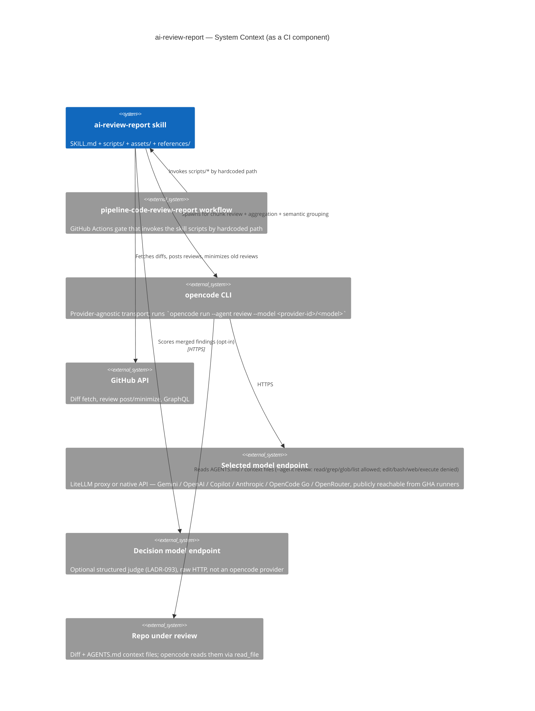

# ai-review-report — Editor's Context

## TL;DR

The **generator** half of the review skill pair (`/ai-review` consumes it): a GitHub Actions gate (`pipeline-code-review-report.yml`) that reviews PRs in chunks through the `opencode` CLI and posts one structured review. SKILL.md is the runtime contract; this file holds the decisions (LADRs) and the rules behind them. The dated audit trail is `references/CHANGELOG.md`; AGENTS.md authoring rules are `references/knowledge-conventional-contexts-quality.instructions.md`.

## Non-Negotiables

- **Workflow ↔ script paths are coupled.** The gate runs the skill from the literal `.agents/skills/ai-review-report` in-repo, else from the `.smooth-ai-review-tools/` side checkout (LADR-037); callers outside that shape pass `$REVIEW_SKILL_DIR` to `run-review.sh`. Moving or renaming a script, this folder or the workflow silently breaks every mode — change YAML and scripts in the same commit.
- **SKILL.md frontmatter is the activation trigger.** `name`, `description` (when to load) and `switches` (entrypoints) are what Claude Code / Codex / Copilot read; never strip them as "markdown cleanup". The skill follows the Agent Skills layout (`SKILL.md` + `assets/`, `references/`, `scripts/`); keep behaviour in the body and scripts, not loader-specific frontmatter.
- **This `AGENTS.md` is a project-doc convention, not an Agent Skills field** — it is found by the loaders' AGENTS.md discovery. Narrative lives here, the dated audit trail in `references/CHANGELOG.md`; don't duplicate one into the other.

## System Context

When triggered, the gate fetches the PR diff, splits it into chunks, sends each chunk to the provider selected by `OPENCODE_REVIEW_REPORT_PROVIDER` through `opencode run --agent review`, then aggregates the chunk reviews into one posted PR review. `scripts/` holds the only entry points the workflow calls, `assets/` the runtime config they install, `references/` edit-time docs.


```mermaid
C4Context
    title ai-review-report — System Context (as a CI component)

    System(skill, "ai-review-report skill", "SKILL.md + scripts/ + assets/ + references/")
    System_Ext(workflow, "pipeline-code-review-report workflow", "GitHub Actions gate that invokes the skill scripts by hardcoded path")
    System_Ext(opencode, "opencode CLI", "Provider-agnostic transport; runs `opencode run --agent review --model <provider-id>/<model>`")
    System_Ext(github, "GitHub API", "Diff fetch, review post/minimize, GraphQL")
    System_Ext(provider, "Selected model endpoint", "LiteLLM proxy or native API — Gemini / OpenAI / Copilot / Anthropic / OpenCode Go / OpenRouter, publicly reachable from GHA runners")
    System_Ext(decisions, "Decision model endpoint", "Optional structured judge (LADR-093), raw HTTP, not an opencode provider")
    System_Ext(reporeview, "Repo under review", "Diff + AGENTS.md context files; opencode reads them via read_file")

    Rel(workflow, skill, "Invokes scripts/* by hardcoded path")
    Rel(skill, opencode, "Spawns for chunk review + aggregation + semantic grouping")
    Rel(skill, github, "Fetches diffs, posts reviews, minimizes old reviews")
    Rel(skill, decisions, "Scores merged findings (opt-in)", "HTTPS")
    Rel(opencode, provider, "HTTPS")
    Rel(opencode, reporeview, "Reads AGENTS.md / context files (--agent review: read/grep/glob/list allowed; edit/bash/web/execute denied)")
```

## Architecture Decisions (LADRs)

Decisions an AI coder would plausibly re-litigate without them. Numbering is append-only and never reused — code and docs cite the numbers — so superseded LADRs stay as one-line stubs pointing at their successor. SKILL.md carries the runtime form of the accepted decisions.

### LADR-001: Chunked Review Processing

- **Date**: 2025-10-28
- **Status**: Accepted
- **Context**: Large PRs caused heap exhaustion and EventEmitter leaks in Gemini CLI.
- **Decision**: Split diffs into <100KB chunks grouped by directory, one model call each, then aggregate.
- **Consequences**: More calls, more cost; holistic cross-chunk analysis runs for every PR (LADR-030).
- **See also**: LADR-010, LADR-011, LADR-030.
### LADR-002: Two-Tier Review Model Chain

- **Date**: 2025-12-19 (Updated: 2026-05-29)
- **Status**: Accepted
- **Context**: Models go unavailable (quota, rate limits, outages); deep review needs a capable model, orchestration has its own (LADR-022).
- **Decision**:
  - `OPENCODE_REVIEW_REPORT_MODEL_PRIMARY` (default `gemini-3.1-pro-preview`) → `OPENCODE_REVIEW_REPORT_MODEL_SECONDARY` (default `gemini-2.5-pro`); Variables with literal defaults; `workflow_dispatch` input overrides the primary.
  - **No third tier** — the `auto`/Flash last resort was removed: a degraded Flash review is worse than an honest "models down".
  - The startup probe tests only these two (never the orchestrator) and detects quota/rate-limit errors; both failing → LADR-021 soft-fail.
### LADR-003: Context-Aware Review with On-Demand File Access

- **Date**: 2025-11-15
- **Status**: Accepted
- **Context**: Inlining full `*AGENTS.md` contents bloated prompts and still caused partial-context false positives.
- **Decision**: Pass file paths only; the model must READ files before flagging Critical/High. Access was gemini-cli `--yolo`, now the `review` agent's read/grep/glob/list/external_directory allow-list (LADR-025/029).
### LADR-004: Incremental Reviews Must Never Approve

- **Date**: 2025-11-20
- **Status**: Accepted
- **Context**: Incremental reviews once approved PRs, bypassing blocking states left by full reviews.
- **Decision**: Incremental reviews MUST post `--comment`, never `--approve`; only full reviews approve.
- **Consequences**: A clean incremental still needs a manual approval.
### LADR-005: Two-Part Aggregation Output

- **Date**: 2025-11-28
- **Status**: Accepted; the two-part split retired by LADR-100 (no Part 2 — the details hold only chunk reviews)
- **Context**: One aggregation mixed executive summary and detailed analysis.
- **Decision**: Split on `DETAILED_SECTION_MARKER`: Part 1 executive summary (always visible), Part 2 holistic analysis (collapsible, with chunk details). The model must follow the two-part format.
### LADR-006: Test File Pairing with Implementation Files

- **Date**: 2025-12-05
- **Status**: Accepted
- **Context**: Tests and implementation landed in separate chunks, hiding coverage.
- **Decision**: Pair test files with implementation files (`.NET: *Test.cs→*.cs`, `Frontend: *.spec.ts→*.ts`) in the same chunk.
### LADR-007: Markdown-Based Separator Instead of JSON

- **Date**: 2025-12-01
- **Status**: Accepted
- **Context**: Model JSON output often broke the schema (unescaped quotes, trailing commas).
- **Decision**: Markdown with the `DETAILED_SECTION_MARKER` delimiter, parsed with `sed`/`grep`.
### LADR-008: Unified Concurrency Group (Superseded)

- **Date**: 2026-01-02
- **Status**: **Superseded by LADR-009**.
- **Why superseded**: One concurrency group for all events made `/ai-review` comments cancel in-progress automated reviews.
### LADR-009: Selective Concurrency

- **Date**: 2026-01-02
- **Status**: Accepted
- **Context**: LADR-008 cancelled reviews mid-run.
- **Decision**: Only `pull_request` shares group `ai-review-{pr_number}`; `issue_comment`/`workflow_dispatch` use unique `{run_id}-{run_attempt}`. `pull_request_target` removed (duplicate runs on PR creation).
- **Consequences**: Rapid commits still cancel each other.
### LADR-010: Adaptive Chunk Splitting by Directory Depth

- **Date**: 2026-02-17
- **Status**: Accepted
- **Context**: Large directories exceeded API limits; `MAX_CHUNK_SIZE` was declared but not enforced.
- **Decision**: A group whose summed diff exceeds 100KB is re-grouped by the next directory level, up to 5 iterations; single-file groups stay. A no-op split (one directory) is handled by LADR-035.
### LADR-011: Semantic Business Context Grouping via LLM

- **Date**: 2026-02-17 (Threshold raised 2026-05-28)
- **Status**: Accepted
- **Context**: Directory chunking isolates cross-cutting features. The threshold went 8 → 15 because a 10-file PR over-split into 6 tiny chunks and hit GitHub's 65KB review-body limit — do not lower it back.
- **Decision**: 15+ files → LLM grouping by business context: 60 s timeout, strict validation (every file exactly once), fallback to directory grouping; "logic moved" (removed here, similar code added there) is grouped together.
- **Consequences**: Non-deterministic above the threshold; LADR-010 stays the safety net.
### LADR-012: Confidence Tagging and Verification-Incomplete Suppression

- **Date**: 2026-03-10
- **Status**: Accepted
- **Context**: The model flagged files it never received; downstream could not tell verified from speculative findings.
- **Decision**:
  - Findings about files not in the chunk: Low only, never Critical/High/Medium.
  - Every finding is `[VERIFIED]` (seen in diff or via `read_file`) or `[SPECULATIVE]` (inferred).
  - Aggregation preserves tags and must not elevate speculative findings.
- **Grammar reference** (eval harness, LADR-033): only `[VERIFIED]` Critical/High/Medium count; `[SPECULATIVE]` and "None found" never count.
### LADR-013: Migration/Schema Chunk Detection

- **Date**: 2026-03-11
- **Status**: Accepted
- **Context**: Migrations need reversibility, existing-data, nullable-column and index-locking review, not the standard code prompt.
- **Decision**: Chunks containing `*.sql`, `*_Migration.cs` or `*/Migrations/*.cs` get the migration prompt; migration detection beats doc-only detection in the three-way branch. Standard items (performance, security, test coverage) are intentionally replaced, including in mixed chunks.
### LADR-014: RTK Token Optimization for Gemini CLI

- **Date**: 2026-03-24
- **Status**: **Superseded by LADR-023** (RTK Gemini hook is specific to `@google/gemini-cli`; opencode transport is incompatible with it). **Re-adopted by LADR-054** via RTK's OpenCode plugin (`rtk init --opencode`) — the Gemini-CLI hook itself is still dead.
- **Why superseded**: The hook (`rtk init -g --gemini --auto-patch --hook-only`) intercepts only gemini-cli's tool I/O, which opencode bypasses; chunking already bounds prompt size.
### LADR-015: Strengthened Critical/High Verification and Diff Integrity Checks

- **Date**: 2026-03-23
- **Status**: Accepted (extended 2026-06-11 to cover claim-correctness for external platform/framework semantics — see DR-015; **amended by LADR-094**: web access is off by default, so a platform claim is verified from the repository or tagged `[SPECULATIVE]` — `webfetch` verification applies only when a custom config re-enables it)
- **Context**: False positives from oversized/corrupted diffs, from symbols flagged as present though removed earlier on the branch, and from wrong platform semantics (e.g. `github.event.*` "empty" in `workflow_call`, tag filters treated as regex). Seeing code in the diff earned `[VERIFIED]` even when the platform claim was wrong.
- **Decision**:
  - Critical/High must confirm the symbol in the **current file state** via `read_file`, not just the diff hunk.
  - A file diff over `MAX_CHUNK_SIZE` carries an integrity warning: no Critical/High without `read_file` (LADR-035 now truncates it).
  - `/ai-review:analyse` auto-recommends skip for `[SPECULATIVE]`.
  - A finding resting on GitHub Actions, npm/registry, git or SDK behaviour needs that claim verified, else `[SPECULATIVE]`; diff code never verifies a platform claim. Locked by eval fixture `DR-015-gha-workflow-call-context` (zero tolerance at Critical/High/Medium).
### LADR-016: Release Branch Sync Review Mode

- **Date**: 2026-04-07
- **Status**: Accepted
- **Context**: Release sync PRs (`chore/bnk[uir]-001-sync-*`) carry already-reviewed code; standard review is noise.
- **Decision**: Head-ref prefix match (case-insensitive) sets `REVIEW_MODE=sync` for chunk and aggregation scripts: focus narrows to merge-conflict errors, cross-PR breaking combinations, config drift and migration ordering; only Critical/High are used, everything else is Low.
- **Consequences**: Defects in already-reviewed code are accepted as missed.
### LADR-017: Single-Chunk Aggregation Short-Circuit

- **Date**: 2026-05-12
- **Status**: **Superseded by LADR-030** (the holistic aggregation now runs for every PR, including single-chunk ones).
- **Why superseded**: Skipping the holistic call at `TOTAL_CHUNKS=1` saved a Pro-tier pass that LADR-022 made cheap, and left small PRs with placeholders instead of a report. Do not restore it.
### LADR-018: Flash Model for Aggregation Step

- **Date**: 2026-05-12
- **Status**: **Superseded by LADR-022** (aggregation now uses the explicit `OPENCODE_REVIEW_REPORT_MODEL_ORCHESTRATOR`).
- **Why superseded**: Deriving `AGGREGATION_MODEL_ID` from the review model id was replaced by an explicit, independently tunable Variable, removing the proxy-router dependency.
### LADR-019: No `read_file` Access at Aggregation Step

- **Date**: 2026-05-12
- **Status**: Accepted
- **Context**: Aggregation re-read files that chunk reviews had already verified, to promote tags, at high latency.
- **Decision**: The aggregation prompt has no `read_file` invitations, says verification is not its job, and never promotes `[SPECULATIVE]` → `[VERIFIED]` — chunk reviews own that.
- **Consequences**: A missed chunk-level verification is a chunk-prompt bug; fix it there, not downstream.
### LADR-020: Skip Integration / DI / Test-Coverage Sections on Small PRs

- **Date**: 2026-05-12
- **Status**: **Superseded by LADR-100** (the holistic prompt, and these sections with it, were removed)
- **Context**: Chunk reviews already cover integration, DI and test coverage per chunk.
- **Decision**: The holistic Integration/DI/Test Coverage sections run only when `REVIEW_TYPE=full AND TOTAL_CHUNKS > 2` (one guarded block), where cross-chunk consistency is a real concern.
### LADR-021: All-Models-Failed Posts Request-Changes Instead of Failing Workflow

- **Date**: 2026-05-25
- **Status**: Accepted
- **Context**: Both review models failing the probe (quota, key/billing, outage) exited 1, and a red check blocked merges for an infrastructure fault.
- **Decision**: Set `all_models_failed=true` (`selected_model=none`), post a `--request-changes` review naming the failed models and pointing to logs, and gate off every downstream side-effect (AGENTS.md validation/block, chunk review, aggregation, minimize, post review, post error). The job exits green.
- **Consequences**: A green check no longer proves a review ran — read the body. `/ai-review` after the fix clears it.
### LADR-022: Explicit Orchestrator Model for Non-Analytical Calls

- **Date**: 2026-05-26 (Updated: 2026-05-29)
- **Status**: Accepted (supersedes LADR-018)
- **Context**: Semantic grouping and aggregation are classification/summarisation; the old `auto` label hid the real model behind a proxy router and coupled the tiers.
- **Decision**:
  - Every non-chunk-review call runs on `OPENCODE_REVIEW_REPORT_MODEL_ORCHESTRATOR` (default `gemini-3-flash-preview`), falling back to the **resolved review model** (known healthy).
  - The orchestrator is intentionally **not** probed at startup.
  - Removed, do not restore: `auto`, `resolve_model()`'s `auto`→flash mapping, `get_aggregation_model()`.
- **Consequences**: `**Model:**` shows the resolved review model.
### LADR-023: opencode as Transport for Gemini Models

- **Date**: 2026-05-28
- **Status**: Accepted (now partially superseded by LADR-029 — chunk review now passes `--agent review` rather than the default `build` agent)
- **Context**: Public-tier `@google/gemini-cli` stopped serving on 2026-06-18; Antigravity CLI is OAuth-only with no `--model` in print mode, Pi had a smaller ecosystem.
- **Decision**:
  - `opencode` is the transport; model chain (LADR-002) and orchestrator (LADR-022) unchanged; every call passes an explicit model id.
  - Provider `litellm-gemini` renamed `gemini` (ids `gemini-3.1-pro-preview`, `gemini-2.5-pro`, `gemini-3-flash-preview`, `gemini-2.5-flash`). The committed config has **no** `baseURL` (DR-009); a gateway URL is injected at install time, else the native base is used (LADR-034).
### LADR-024: Single Gateway Provider + Local Reachability Preflight

- **Date**: 2026-05-29
- **Status**: **Partially superseded by LADR-026 (single-provider → env-based selection) and LADR-028 (the local gateway reachability preflight is replaced by the opencode-server health check)**. Only the `timeout`-shim part remains in force.
- **Context**: Off-VPN, `opencode run` against the private gateway hung forever, and the macOS `timeout` shim killed only the bash wrapper, orphaning opencode.
- **Decision** (in force): The shim runs each call in its own process group and `kill -KILL`s the group on expiry — hangs bounded (60 s grouping / 300 s chunk), no orphans.
- **Why partially superseded**: The single provider became env-selectable (LADR-026); the 8 s `/health` VPN preflight was replaced by the provider-agnostic health check (LADR-028), which does **not** pre-empt a VPN hang — only the shim bounds it.
### LADR-025: Allow `external_directory` reads (headless `--yolo` equivalent)

- **Date**: 2026-06-01
- **Status**: Accepted
- **Context**: `external_directory` defaults to `ask`, which headless `opencode run` auto-rejects, so dot-path context reads failed → chunk failed → fail-closed REQUEST_CHANGES on clean PRs.
- **Decision**: `"permission": { "external_directory": "allow" }` at top level of `assets/opencode.json` and on the `review` agent (LADR-029); `setup-opencode-config.sh`'s `is_ours` predicate treats `permission` as managed shape. *(That installer and its `is_ours` guard were replaced by `prepare-opencode-config.sh`'s per-run copy in LADR-071.)*
- **Consequences**: Safe only because the pipeline never edits or runs bash; any in-repo path is readable.
### LADR-026: Env-Selected Provider (GEMINI / COPILOT / OPENAI)

- **Date**: 2026-06-06
- **Status**: Accepted (supersedes the single-provider stance of LADR-024; extended by LADR-027 for OpenCode Go)
- **Context**: Teams needed to retarget the gate (proxy or native API) without editing the workflow.
- **Decision**:
  - `OPENCODE_REVIEW_REPORT_PROVIDER` (default `GEMINI`) selects the provider; `lib/resolve-provider.sh` is the single source of truth — selector → `OPENCODE_REVIEW_REPORT_PROVIDER_ID`, URL/key → `OPENCODE_REVIEW_REPORT_GATEWAY_URL`/`_API_KEY`.
  - It **fails fast** on missing credentials or a `OPENCODE_REVIEW_REPORT_MODEL_*` chain outside the provider's family (`_rp_model_family_ok`).
  - Call sites use `${OPENCODE_REVIEW_REPORT_PROVIDER_ID}/<model>`; the workflow exports every credential pair at job scope; `local-review.sh` harvests them and sources the same resolver.
- **Consequences**: Defaults are Gemini ids, so non-GEMINI runs MUST set `OPENCODE_REVIEW_REPORT_MODEL_*` — the abort is intentional.
### LADR-027: OpenCode Go Providers — split by SDK surface

- **Date**: 2026-06-06
- **Status**: Accepted (extends LADR-026)
- **Context**: OpenCode Go uses three incompatible SDK surfaces; a provider block pins one `npm`.
- **Decision**:
  - `go-openai` (`@ai-sdk/openai-compatible`, `/chat/completions`), `go-anthropic` (`@ai-sdk/anthropic`, `/messages`), `go-responses` (`@ai-sdk/openai`, `/responses`), all on hardcoded `https://opencode.ai/zen/go/v1`, no URL Variable.
  - `go-openai`/`go-responses` share `OPENCODE_GO_OPENAI_API_KEY`; `go-anthropic` uses `OPENCODE_GO_ANTHROPIC_API_KEY`.
  - Rosters live in `assets/opencode.json` and SKILL.md; unlisted models go through free-text input / model Variables; the preset dropdown is intentionally non-exhaustive.
- **Consequences**: A run's model chain must stay on its one surface.
### LADR-028: Health via the opencode server (`/global/health`), not per-provider gateway probes

- **Date**: 2026-06-06
- **Status**: **Superseded by LADR-087 for OpenCode v2** (historically superseded the per-provider health derivation in LADR-026 and the reachability-preflight half of LADR-024)
- **Context**: Per-provider gateway probes were duplicated in three places, grew a branch per provider, and did not prove the surface opencode calls.
- **Decision**: One provider-agnostic check against opencode in `lib/opencode-health.sh` (v1: `opencode serve` + `/global/health`; LADR-087 replaced the endpoint). `OPENCODE_API_HEALTH_OVERRIDE` removed; the resolver still presence-checks URL/key.
- **Consequences**: The check validates neither upstream reachability nor the API key — a VPN hang is bounded only by the LADR-024 shim, a bad key surfaces at the real model call.
### LADR-029: Run chunk review on a locked-down `review` agent (`--agent review`)

- **Date**: 2026-06-07
- **Status**: Accepted (realizes the read-only `review` agent anticipated by LADR-025; supersedes the "pass NO `--agent` flag" stance of LADR-023 and LADR-025; **amended by LADR-094**: `webfetch`/`websearch` and v2's `execute` are now denied by default)
- **Context**: The default `build` agent exposes repo skills as tools; reviewing this gate's own workflow matched the skill description, so the model ran the skill and returned 0 bytes → fail-closed. Fallback keyed on exit code only, so exit-0-empty never tried the secondary.
- **Decision**:
  - Custom `review` agent: `mode: primary`, **no `model` field** (so `--model` wins); `skill`/`task`/`edit`/`write`/`bash` denied via both the `tools` map and `permission: deny`; `read`/`grep`/`glob`/`list`/`external_directory` allowed. `bash` is denied so a prompt-injected diff cannot run commands.
  - `opencode-with-fallback.sh` passes `--agent review` and returns non-zero on < 200 bytes output, matching `review-in-chunks.sh`'s floor.
  - The empty-chunk marker names agent tool-misfire as a cause.
- **Consequences**: Aggregation also uses `--agent review`. `is_ours` keys on provider shape, so a personal config lacking `review` is left intact with a warning (CI overwrites). *(That installer and its `is_ours` guard were replaced by `prepare-opencode-config.sh`'s per-run copy in LADR-071.)* The agent is required for the gate to review its own repo.
- **See also**: LADR-031.
### LADR-030: Holistic Aggregation Runs for Every PR (incl. Single-Chunk)

- **Date**: 2026-06-07
- **Status**: Accepted (supersedes LADR-017; amended by LADR-100 — no holistic section is written)
- **Context**: The default `OPENCODE_REVIEW_MIN_FILE_COUNT_BEFORE_CHUNCKING=10` puts most small PRs in one chunk, so LADR-017's short-circuit left the common case with placeholders.
- **Decision**: `aggregate-reviews.sh` runs the holistic call for every PR (all summary sections; phrasing adapts to chunk count). Safety stays downstream and chunk-count-agnostic: `chunk_<n>.failed` fail-closed (LADR-031), incremental never `APPROVE` (LADR-004), REQUEST_CHANGES on a <50-byte summary; LADR-020 still applies.
### LADR-031: Out-of-Band Chunk-Failure Signal (flag file, not marker-text grep)

- **Date**: 2026-06-07
- **Status**: Accepted
- **Context**: The fail-closed net grepped review text for `## ⚠️ Review Failed`; reviewing files that document it made the model quote it and flipped a clean APPROVE. Control flow must never come from free-text review content.
- **Decision**:
  - `review-in-chunks.sh` writes `ci_temp/reviews/chunk_<n>.failed` at both failure sites (<200-byte output; non-zero/timeout exit); `aggregate-reviews.sh` fail-closes on the **existence** of any `chunk_*.failed`, never on text.
  - The `## ⚠️ Review Failed for Chunk:` marker is presentation only; docs may quote it freely. Per-chunk files (no shared append) keep the parallel loop race-free.
- **Consequences**: Marker and flag writes must stay adjacent at each failure site — a missing flag silently under-reports. Flags never reach the review or git.
### LADR-032: Max-file-count gate + `OPENCODE_*` → `OPENCODE_REVIEW_REPORT_*` env rename

- **Date**: 2026-06-07
- **Status**: Accepted
- **Context**: Huge PRs burned budget on low-signal reviews; bare `OPENCODE_` names collided with the CLI's namespace.
- **Decision**:
  - After diff generation, post-exclusion `files_changed` > `OPENCODE_REVIEW_REPORT_MAX_FILE_COUNT` (default `100`; invalid/non-positive → 100) posts a `--request-changes` review and skips the review chain without double-posting or fail-closing. opencode still installs first — accepted.
  - Non-key config vars are `OPENCODE_REVIEW_REPORT_*`; **API-key Secrets keep `OPENCODE_*_API_KEY`**, as does derived `OPENCODE_GATEWAY_API_KEY`.
- **Consequences**: Variables under old names read empty and silently fall back to defaults. Old names in historical text are left as record.
### LADR-033: Eval Harness for the Chunk-Review Model (Precision + Recall vs a Labeled Corpus)

- **Date**: 2026-06-07
- **Status**: Accepted
- **Context**: Review quality was defended only by adding DRs after the fact; nothing caught a change re-introducing a known false positive. Each DR is a confirmed FP, so the DR list is a must-NOT-flag set.
- **Decision**:
  - `scripts/eval/` drives the **real** `review-in-chunks.sh` with the CI transport verbatim (`resolve-provider.sh`, the config installer — `prepare-opencode-config.sh` since LADR-071 —, `opencode-health.sh`, `opencode-with-fallback.sh`) — no new transport or prompt copy.
  - **Precision**: fixtures per DR; any re-raise at Critical/High/Medium fails (**zero tolerance**, deliberately stricter than the gate's blocking bar). Fixtures are minimal, carry a "do NOT flag" comment, and must not contain a real bug (DR-001 uses `init` so it compiles).
  - **Recall**: synthesized seeded defects must be flagged at ≥ labeled severity (`manifest.json`); fails below `EVAL_RECALL_THRESHOLD` (default 80%).
  - LADR-012 grammar; each fixture runs in a throwaway git sandbox with the DR standards (`.github/instructions/code-review-standards.instructions.md` + DR-012…014 supplement) at production dot-paths.
  - Paid triggers: `eval/local-evals.sh`, `workflow_dispatch`, `pull_request` as a **required check** (draft/fork skip via job `if:`); no post-merge canary (double bill). Relevance is an in-job `Scope check`, never `paths:` — a `paths:` filter on a required check wedges every PR it skips.
  - **Never in the default bash-test path**; `eval/test-evals.sh` is the offline stub (`EVAL_SELFTEST`). `EVAL_SAMPLES>1` → majority rule for precision and recall (LADR-069).
  - `EVAL_ARTIFACT_DIR` keeps `<id>.review.md`/`<fixture>.lastlog`; CI uploads `ci_temp/eval-artifacts/` with `if: always()` to tell real re-raises from fixture hygiene.
- **Consequences**: Path coupling covers `scripts/eval/`. Orchestrator-tier calls are out of scope.
### LADR-034: Per-Provider Gateway `baseURL` Injected at Install Time

- **Date**: 2026-06-09
- **Status**: Accepted
- **Context**: With `baseURL` removed from `assets/opencode.json` and nothing feeding `OPENCODE_REVIEW_REPORT_<P>_URL` back in, a proxy key went to Google's native API and every model "failed"; the health smoke passed.
- **Decision**: `lib/prepare-opencode-config.sh` injects `OPENCODE_REVIEW_REPORT_<P>_URL` into the run-local config for Gemini/Copilot/OpenAI only (unset → native base). OpenCode Go, OpenRouter and Anthropic keep hardcoded public bases and are never injected.
- **Consequences**: Fixed-base providers are tuned only by key Secrets and model Variables. DR-009 guard (b): do not flag the deliberately absent `baseURL`.
### LADR-035: Hard Chunk-Prompt Size Enforcement

- **Date**: 2026-06-10
- **Status**: Accepted (hardens LADR-010; extends LADR-015's integrity warning)
- **Context**: A 17-file single-directory chunk built a ~90 MB prompt, timed out and fail-closed every run: the deeper-directory regroup was a no-op, the over-size diff was warned about then appended, and the 250KB check only logged.
- **Decision** (`review-in-chunks.sh`):
  - `_process_chunk_group`: if the deeper regroup yields ≤1 group, **halve** into `${group}@1`/`${group}@2` within the 5-iteration loop (`@` is safe: downstream splits on `::` only; applies to semantic names too).
  - Per-file diff cap `MAX_FILE_DIFF_SIZE` (= `MAX_CHUNK_SIZE`, 100KB) inside the chunk-wide `MAX_PROMPT_DIFF_SIZE` (200KB) budget: over-cap diffs are TRUNCATED with an omitted-bytes marker; past the budget, files get DIFF OMITTED directing `read_file` and forbidding unverified Critical/High.
- **Consequences**: Degrades to on-demand reads, never a timeout block. `FORCE_SINGLE_CHUNK` (≤10 files) skips splitting but keeps the caps (they live in `review_chunk`). Pinned by `scripts/test-chunk-prompt-budget.sh`.
### LADR-036: Review-Coverage Gaps Never Block + Visible Fail-Closed Override

- **Date**: 2026-06-10
- **Status**: Accepted (enforces LADR-012's suppression intent at the aggregation layer; makes LADR-031's override transparent)
- **Context**: Aggregation promoted "file not in any chunk" to High (no LADR-012 rule there; the FULL "Missing implementations" bullet invited it), and the fail-closed override posted an APPROVE-worded body as CHANGES_REQUESTED unexplained.
- **Decision** (`aggregate-reviews.sh`):
  - MANDATORY **"Review-Coverage Gaps Are NOT Code Issues"** block after Confidence-Tag-Handling: an unchunked file, a failed chunk or an unverifiable author focus area is 🔵 Low `[SPECULATIVE]` only, never counted in Recommendation Step 1 — even if the AI Review Notes request focus there.
  - "Missing implementations" is limited to "the diffs the chunk reviews actually saw".
  - `FAILED_CHUNK_COUNT` from `chunk_*.failed` existence, computed **before** `final_review.md` is assembled: >0 inserts a "**Review coverage incomplete:**" banner after `**Model:**`, and the override reuses the same count.
- **Consequences**: Body and posted state always agree. Override stays unweakened — any failed chunk forces `request_changes`; auto-dismissing stale bot reviews was rejected.
### LADR-037: Reusable-Workflow Channel via `$REVIEW_SKILL_DIR` Indirection

- **Date**: 2026-06-10
- **Status**: Accepted (extends the workflow↔script path coupling rule to three consumption modes)
- **Context**: A `workflow_call` consumer lacks the hardcoded `.agents/skills/ai-review-report/scripts/…` paths a copy-install provides.
- **Decision**:
  - One workflow for all modes. `on.workflow_call` inputs are strings (`type: choice` is forbidden there; the caller template owns the dropdown): `pr_number`, `model`, `model_preset`, `runner`, `tools_ref`, `mandatory_context_files`, `agents_md_exempt_paths`; expressions use `inputs.*`.
  - The gate chooses between two skill paths (since the 2026-07-30 thin-wrapper refactor the "Run review gate" step dispatches with `[ -f … ]`; `$REVIEW_SKILL_DIR` stays `run-review.sh`'s own contract for callers outside that shape): the literal `.agents/skills/ai-review-report` wins when `scripts/review-in-chunks.sh` exists (it is the installer's perl-rewrite anchor — keep it literal); else a side checkout at `.smooth-ai-review-tools/` at `vars.SMOOTH_AI_REVIEW_TOOLS_REF || inputs.tools_ref || github.job_workflow_sha || 'v2'`. **Never `github.workflow_sha`** — it is the caller's commit (`upload-pack: not our ref`).
  - Scripts resolve internals via `$BASH_SOURCE`; `ci_temp/` and `MANDATORY_CONTEXT_FILES` resolve against the workspace under review on purpose. The installer rewrite skips `.smooth-ai-review-tools` lines.
  - `on.workflow_call.secrets` declares every `OPENCODE_*_API_KEY` (`required: false`); cross-org `secrets: inherit` is rejected, so the caller template maps explicitly.
- **Consequences**: A local skill tree always wins. `.docs/examples/code-review-caller.yml` duplicates the `model_preset` options (mapping lives in the callee) — extend both. `runs-on` takes one label; multi-label runners need copy-install.
### LADR-038: npm/opencode Plugin Channel — Skills Linked into `.agents/skills/` at Startup

- **Date**: 2026-06-11
- **Status**: Accepted; V1 entrypoint superseded by LADR-087 for package major v2
- **Context**: opencode finds skills only in fixed directories (`.opencode/skills/`, `.claude/skills/`, `.agents/skills/`) but auto-installs npm plugin packages from its config.
- **Decision**:
  - Package `@generic-automation-and-it/smooth-ai-review` (`files`: plugin entry + `.agents/skills/` minus `scripts/eval/`) links each skill into the consumer's `.agents/skills/<name>` — the same path contract as the gate and SKILL.md.
  - `fs.symlinkSync(..., "junction")` (no Windows admin); never touch a real directory; re-point a symlink only if stale; append idempotently to `.git/info/exclude`; all try/catch — never break opencode startup.
  - **GitHub Packages** (publish needs only `GITHUB_TOKEN` + `packages: write`); consumers need a one-time `read:packages` PAT even when public. No `--provenance`/`--access public`; the first publish is private and must be flipped once.
  - Publish on `main` push, dispatch, and semver tags `v[0-9]+.[0-9]+.[0-9]+` only (never the floating major tag); deliberately **no `paths` filter**. Guard: `package.json` == `.claude-plugin/plugin.json`; tags must match and publish that version; non-tag runs patch both to `major.minor.${GITHUB_RUN_NUMBER}`; existing versions are skipped.
- **Consequences**: Eval work needs a clone. Restart opencode once after first install (links appear at session init). Neither plugin channel installs the CI gate (LADR-037).
- **Update (LADR-087)**: Major v2 default-exports the plain object `{ id: "smooth-ai-review.skills", setup(ctx) }` (reads `ctx.location.directory`; enabled via plural `plugins`; links all four skills). It **must stay dependency-free**: `Plugin.define` is identity at runtime, so `@opencode/plugin` would only add a failable install — a recorded deviation from the migration guide; revisit once `setup` calls a `ctx` domain method. The entry **must** be `index.js` (re-exporting `opencode-plugin.js`); v2 ignores `main`/`exports`. A missing PAT shows as `401 ... authentication token not provided` in `~/.local/share/opencode/log/opencode.log`.
### LADR-039: OpenRouter provider (`openrouter`) — aggregator with a hardcoded base

- **Date**: 2026-06-14
- **Status**: Accepted
- **Context**: OpenRouter fronts many vendors behind one key and base URL; its `/connect` flow (`auth.json`) is wrong for headless CI, but `{env:...}` key injection works.
- **Decision**:
  - `OPENCODE_REVIEW_REPORT_PROVIDER=OPEN_ROUTER` → `openrouter` (`@openrouter/ai-sdk-provider`, hardcoded `https://openrouter.ai/api/v1`, `{env:OPENCODE_OPENROUTER_API_KEY}`); no URL Variable, not in `_inject_base_urls`.
  - Touchpoints any new provider needs: `resolve-provider.sh` case (`_rp_url_fixed`); workflow `env:`, `_PROVIDER`/`_PROVIDER_ID` maps and bootstrap `case`; `local-review.sh` + `eval/local-evals.sh` harvest; `aggregate-reviews.sh` display name.
  - `vendor/`-prefixed slugs only; **Anthropic and OpenAI models excluded** (dedicated providers). opencode splits on the first `/`, so `openrouter/deepseek/deepseek-v4-pro` resolves and the `gemini*` guard never matches.
  - Four `model_preset` options route here, duplicated in `.docs/examples/code-review-caller.yml`.
- **Consequences**: Default model chain `deepseek/deepseek-v4-pro` / `qwen/qwen3.7-plus` / `deepseek/deepseek-v4-flash` (orchestrator); unset `OPENCODE_REVIEW_REPORT_MODEL_*` without a preset fails fast.

### LADR-040: Direct Anthropic provider (`anthropic`) — Claude models with a hardcoded base

- **Date**: 2026-06-26
- **Status**: Accepted
- **Context**: No provider served real Claude: `go-anthropic` shares the `@ai-sdk/anthropic` SDK but its gateway serves Anthropic-*compatible* non-Claude models, and OpenRouter excludes Anthropic (LADR-039). The Anthropic API is a single public base with no per-deployment URL.
- **Decision**:
  - `anthropic` provider, selected by `OPENCODE_REVIEW_REPORT_PROVIDER=ANTHROPIC`; `assets/opencode.json`: `npm: "@ai-sdk/anthropic"`, `baseURL: "https://api.anthropic.com"` (**hardcoded**), `apiKey={env:OPENCODE_ANTHROPIC_API_KEY}`.
  - Like OpenCode Go (LADR-027) and OpenRouter (LADR-039): **no `OPENCODE_REVIEW_REPORT_ANTHROPIC_URL` Variable** and **not** in `_inject_base_urls` (LADR-034).
  - Wired into every per-provider touchpoint: `resolve-provider.sh` (`_rp_url_fixed`), the workflow's provider maps and bootstrap `case`, `local-review.sh`.
  - Model-family fail-fast: `ANTHROPIC` requires `claude*` ids; every other provider rejects both `gemini*` and `claude*` ids, so a leftover Claude model cannot silently route to a gateway that can't serve it.
  - Models `claude-opus-4-8`, `claude-sonnet-4-6`, `claude-haiku-4-5`, with three `model_preset` options duplicated in the caller template.
- **Consequences**: The "fixed public base hardcoded in `opencode.json`" exception list is now three (OpenCode Go, OpenRouter, Anthropic) — the root `AGENTS.md` Non-Negotiable and SKILL.md transport list must track it. Because the model chain defaults to Gemini ids, a non-GEMINI run without the three `OPENCODE_REVIEW_REPORT_MODEL_*` Variables (or a preset) fails fast in `resolve-provider.sh`.
- **See also**: LADR-026, LADR-027, LADR-034, LADR-039.

### LADR-041: Disable opencode session sharing — `"share": "disabled"` in `opencode.json`

- **Date**: 2026-06-29
- **Status**: Accepted
- **Context**: opencode's `share` feature can publish a session (conversation + reviewed diff) to a public URL; the committed config had no explicit opt-out, leaving the gate one keypress or default change away from leaking PR content.
- **Decision**: `"share": "disabled"` at the root of `assets/opencode.json` (blocks both manual and automatic sharing). `setup-opencode-config.sh`'s `is_ours` allowed top-level key set gains `"share"`. *(That installer and its `is_ours` guard were replaced by `prepare-opencode-config.sh`'s per-run copy in LADR-071.)*
- **Consequences**: Sharing is off on every runner using the managed config. A hand-rolled personal `opencode.json` we do not overwrite must add `"share": "disabled"` itself.
- **See also**: LADR-029.

### LADR-042: Autonomous low/medium auto-fix loop (`pipeline-ai-analyse.yml` + `ai-analyse`)

- **Date**: 2026-06-30
- **Status**: Accepted
- **Context**: Mechanical low/medium cleanup still needed a human `/ai-review`. `pull_request_review` + a PAT widens credential exposure and risks recursion; `workflow_run` uses the repo `GITHUB_TOKEN` but is coupled to the gate's `name:` and runs from the default-branch workflow copy.
- **Decision**:
  - `.github/workflows/pipeline-ai-analyse.yml`: `workflow_run.workflows: ["OpenCode Review Report"]` gated on the gate run's `conclusion == 'success'`, or `workflow_dispatch` (`pr_number` required, `max_incremental` optional). Standalone `.agents/skills/ai-analyse` skill.
  - Guard skips fork PRs; picks the latest gate artifact from **both** PR reviews and issue comments via `scripts/lib/select-ai-analyse-artifact.sh`. Reports carrying `## 🔍 Issues Summary` are actionable; a latest "Skipping incremental review..." comment stops the run. Scope is only 🟡 Medium / 🔵 Low + suggested fixes (`scripts/lib/extract-ai-analyse-scope.sh`).
  - Loop bound is `OPENCODE_ANALYSE_MAX_INCREMENTAL` alone (default `3`), counting consecutive incremental reports and skip-incremental comments back to the latest full review; at the cap, post a limit comment and stop. There is deliberately **no** `[ai-analyse]` head-commit sentinel — it would stop after one cycle and make the cap unreachable. A cycle with no edits ends the loop (no push → no new review).
  - Reuses the gate's opencode libs; runs the edit-only `analyse` agent with `ai-analyse/SKILL.md` inlined. If `OPENCODE_ANALYSE_MODEL` is set, `OPENCODE_ANALYSE_PROVIDER` is required and primary is `${OPENCODE_ANALYSE_PROVIDER_ID}/${OPENCODE_ANALYSE_MODEL}`; fallbacks stay on the review provider's primary/secondary.
  - Commits as `fix: apply AI review low/medium auto-fixes [ai-analyse]` with **no** `/ai-review`, excluding `ci_temp`, `.context`, `.smooth-ai-review-tools`; rebases onto `origin/<head_ref>` before push; pushes with optional `OPENCODE_ANALYSE_GH_TOKEN` Secret, falling back to `GITHUB_TOKEN` only for non-workflow-path edits; posts the summary via `ai-review/scripts/copilot-review.sh summary`.
- **`skip_reason` values** (degrade to `push_skipped` summary, not red):
  | reason | trigger |
  | --- | --- |
  | `rebase-conflict-or-fetch-failure` | `git fetch` or `git rebase` non-zero exit |
  | `workflow-paths-require-pat-with-workflow-scope` | staged diff touches `.github/workflows/**` and `OPENCODE_ANALYSE_GH_TOKEN` is unset / lacks `workflow` scope |
- **Consequences**:
  - The model gets no bash/web/task/skill tools; git side effects stay deterministic in the workflow. Critical/High stay human-owned.
  - Rebase conflicts degrade to a no-push summary, never a destructive update. GitHub rejects `GITHUB_TOKEN` pushes to `.github/workflows/**`, hence `push_skipped` rather than red.
  - Not rename-resilient: changing the gate's `name:` requires editing this workflow (and running actionlint) in the same commit.
  - Reusable-gate consumers must copy this workflow into their own repo — `workflow_run` must live where the observed gate runs.
  - On a new full review, `minimize-previous-reviews.sh` also minimizes prior ai-analyse summary and limit comments; its body-marker regex is coupled to this workflow's comment text.
- **See also**: LADR-029, LADR-037.

### LADR-043: Privileged trigger hardening and trusted tooling

- **Date**: 2026-07-04
- **Status**: Accepted
- **Context**: `issue_comment` runs in the base-repo context with secrets and a write token, and the gate preferred the in-checkout skill tree (LADR-037) — so a fork PR modifying a vendored skill got its scripts run with privileged credentials on a maintainer's `/ai-review`. `workflow_run` (analyse) has the same shape.
- **Decision**:
  - `issue_comment` and `workflow_run` are privileged triggers. `/ai-review` is accepted only from `OWNER`/`MEMBER`/`COLLABORATOR`, in both the caller template and the canonical workflow.
  - Fork PRs (`head.repo.full_name != base.repo.full_name`): the PR head is review input only and tooling comes from the trusted ref; same-repo PRs keep local-tooling precedence (so gate changes can self-review). *Current gate:* the fork-specific "Locate review skill scripts" step went away in the 2026-07-30 thin-wrapper refactor — "Fetch review tooling" now runs only when the checkout lacks the skill, so re-verify the fork guarantee before relying on it.
  - Analyse job: same precedence; fork PRs and reusable callers always fetch; scripts never run from the PR checkout; checkout credentials not persisted; push only in the deterministic commit step via an explicit masked remote.
  - Tooling ref: analyse uses `SMOOTH_AI_REVIEW_TOOLS_REF` (default `v2`); the gate uses `vars.SMOOTH_AI_REVIEW_TOOLS_REF || inputs.tools_ref || github.job_workflow_sha || 'v2'`. It must be `job_workflow_sha` — `workflow_sha` is the caller's commit, unfetchable here, which silently unpins the trusted tooling.
- **Consequences**: Reviewing fork content stays safe because the agent is read-only and scripts come from the trusted ref. Cost: fork PRs and reusable callers cannot validate pipeline changes via privileged paths — that needs a same-repo run or a trusted tooling update.
- **See also**: LADR-029, LADR-037.

### LADR-045: "Test in the loop" — autonomous fixes may not edit tests by default

- **Date**: 2026-07-24
- **Status**: Accepted
- **Context**: A wrong `ai-analyse` fix (LADR-042) could rewrite the very test that would catch it and still go green; a fix must satisfy the existing tests, not adapt them.
- **Decision**:
  - Variable `OPENCODE_ANALYSE_ALLOW_TEST_SELF_FIX`, **off by default**; only truthy (`1`/`true`/`yes`/`on`) permits editing tests or the test framework.
  - Enforcement is deterministic, not prompt-trusted (LADR-029): the Commit step runs `.agents/skills/ai-analyse/scripts/lib/filter-test-self-fix.sh` (via `$ANALYSE_SKILL_DIR`) before staging and reverts every test/framework edit — tracked files via `git checkout HEAD -- <path>`, **fail-closed** (an obstructed checkout is removed and retried; a still-failing retry aborts the step, never warn-and-continue); new untracked test paths via `rm -rf`. Non-test edits survive.
  - Matcher: a case-insensitive rule (test dirs, test-file patterns, framework configs) plus a case-sensitive JVM/.NET suffix rule (`*Test`/`*Tests`/`*Spec`/`*IT`/`*ITCase`).
  - The prompt also gets the switch state (soft guard); reverted paths are listed in the summary comment.
- **Consequences**: The matcher fails safe toward protecting tests (a `test/`/`spec/` dir counts as tests even if it holds non-test code). Moving `ai-analyse/scripts/lib/` breaks the guard in all workflow modes.
- **See also**: LADR-029, LADR-042, LADR-057.

### LADR-046: Document drift severity cap — Medium at most

- **Date**: 2026-07-25
- **Status**: Accepted
- **Context**: Stale `*_AGENTS.md` was flagged 🟠 High, but doc staleness degrades AI guidance rather than causing corruption, breaches or downtime, so blocking on it was disproportionate and inconsistent with the doc-only chunk regime.
- **Decision**: Cap **all** documentation drift findings at 🟡 Medium — never High/Critical — regardless of chunk type (code, doc-only, aggregation) and of which doc is stale (AGENTS.md, README, HLDs, ADRs, LADRs, NFRs). Enforced in three places that must stay consistent: SKILL.md's "Documentation drift detection" Key Behavior, the doc-only chunk prompt, and the shared signal-to-noise block in `review-in-chunks.sh`.
- **Consequences**: Drift is still surfaced as actionable Medium but can no longer block a PR on its own. Code correctness and security findings are unaffected.

### LADR-047: Overridable opencode.json source path

- **Date**: 2026-07-30
- **Status**: Accepted
- **Context**: The config installer (then `setup-opencode-config.sh`, now `prepare-opencode-config.sh`) derived the config source from its own location, so a reusable-workflow consumer always got this repo's provider config with no seam short of forking.
- **Decision**:
  - `opencode_config` input (dispatch + call) → `OPENCODE_REVIEW_REPORT_CONFIG`; precedence input → Variable → committed default. Blank preserves the location-derived default exactly.
  - Non-empty is resolved **repo-relative** against `GITHUB_WORKSPACE` (the repo under review), failing fast if missing. It **must not contain `..`** (rejected up front) and **must not be absolute** (a leading `/` is stripped and it still resolves inside the repo) — together these confine it to the checkout.
  - The override flows through the same per-run config copy and `_poc_inject_base_urls` (`prepare-opencode-config.sh`, LADR-071).
- **Consequences**: A custom config MUST keep `{env:OPENCODE_*}` placeholders — documented but **not machine-enforced**; a caller that hardcodes a secret owns that risk. The override targets the repo under review, never the tooling tree; `local-review.sh` leaves it unset.

### LADR-048: Shared `install-opencode.sh` lib + version-pin parity

- **Date**: 2026-07-31
- **Status**: Accepted
- **Context**: Each workflow's inline install block drifted from `OPENCODE_CLI_VERSION` (the analyse workflow and npm example always installed latest). SHA256 verification was dropped: releases are immutable, so the pin is sufficient integrity.
- **Decision**:
  - Single lib `.agents/skills/ai-review-report/scripts/lib/install-opencode.sh`; every install path delegates to it — `run-review.sh`, `pipeline-ai-analyse.yml`, `llm-eval-harness.yml`, the npm consumer template — each setting `OPENCODE_CLI_VERSION` in its env first.
  - The lib owns version resolution (strip `v`; blank → latest v2, which any cached v2 binary satisfies and a v1 binary never does — LADR-087), cache-hit skip, pinned install via `bash -s -- --version`, PATH repair in its own subshell plus a `$GITHUB_PATH` append, and a hard fail on post-install version mismatch.
  - The lib's PATH export does not reach the caller: single-script callers (`run-review.sh`) must re-export `$HOME/.opencode/bin` themselves; workflow-step consumers rely on `$GITHUB_PATH` across steps.
  - `pipeline-ai-analyse.yml` forwards `OPENCODE_CLI_VERSION`; docs and templates recommend pinning (unset is the weak default).
- **Consequences**: Any new install path, including consumer examples, must delegate to the lib — never inline another `curl | bash` (root `AGENTS.md` Non-Negotiable).

### LADR-049: Code graph analysis, enabled by default (Phase 1)

- **Date**: 2026-07-31
- **Status**: Accepted
- **Context**: Chunks had no function-level risk, caller/callee or test-gap awareness; `code-review-graph`'s Tree-sitter graph and `detect-changes` provide it.
- **Decision**:
  - Two libs (LADR-048 pattern): `scripts/lib/build-code-graph.sh` (installs via pipx for PEP 668 on Ubuntu 24.04+, builds/updates and verifies the DB) and `scripts/lib/detect-changes-graph.sh` (runs `detect-changes` — which has **no `--format` flag**; its bare stdout is the JSON contract).
  - `run-review.sh` Step 13.5 (between context discovery and AGENTS.md validation), gated by `OPENCODE_REVIEW_REPORT_ENABLE_GRAPH_ANALYSIS` (truthy `1/true/yes/on`, case-insensitive, default `1`). `OPENCODE_TOOL_CODE_REVIEW_GRAPH_VERSION` pins the package.
  - Both degrade gracefully; the review never blocks on a graph failure.
  - `actions/cache` for `.code-review-graph/` in **both** packagings, keyed on source-tree hashes (so the graph invalidates when code changes) + lockfile hashes + schema version. The cache step's `if:` uses `contains()` to match `run-review.sh`'s wider truthy set.
  - Outputs `ci_temp/graph_detect_changes.json`, `ci_temp/graph_risk_summary.md`, `ci_temp/graph_file_risks.txt`. The CLI reports absolute paths; `detect-changes-graph.sh` relativizes them, so the two derived artifacts carry **repo-relative** paths — the contract LADR-051 joins against `git diff --name-only`.
  - Per-chunk injection (LADR-050), graph-aware grouping (LADR-051) and aggregation enrichment (LADR-052) are deferred.
- **Consequences**: `build-code-graph.sh` is the single install source of truth for `code-review-graph` (root `AGENTS.md` Non-Negotiable).

### LADR-053: Version-update notices in the review header

- **Date**: 2026-07-31
- **Status**: Accepted (amended twice on 2026-07-31; amended again 2026-09-21 for OpenCode v2 metadata and RTK integration state)
- **Context**: Three pinned tools (LADR-048/049/054) had no stale-pin signal. The first implementation was silently inert — a 404ing package lookup rendered `✅` while an update existed, the footer read vars never exported to the child aggregator, and the provider-SDK check had no installed version to diff (it is compiled into the binary). A false `✅` is worse than no notice.
- **Decision**:
  - `lib/check-versions.sh` checks the OpenCode CLI, `code-review-graph` and `rtk`; it is sourced **after Step 13.5 and after the rtk install (step 5c-bis)**, so installed versions reflect what `build-code-graph.sh`/`install-rtk.sh` actually installed; a tool that is off, absent or failed to install gets no line, never a stale one.
  - `OPENCODE_VERSION_INFO` (header) and `OPENCODE_VERSION_FOOTER` are passed **positionally** to `aggregate-reviews.sh` as `$9`/`$10`, never via the environment (the aggregator is a child process).
  - Latest-version sources: OpenCode v2 from `https://opencode.ai/update/api/latest/cli/npm` (the V1 `OPENCODE_CLI_NPM_PACKAGE=opencode-ai` npm lookup is historical — do not restore it); `code-review-graph` from PyPI JSON `.info.version`; `rtk` from GitHub Releases `GET /repos/rtk-ai/rtk/releases/latest` (leading `v` stripped), which needs a `User-Agent` header or GitHub 403s.
  - `sort -V`, not `!=` (a pin ahead of the registry is not an update); emoji, not ANSI; each update line names the Variable to bump. Every lookup is `curl -sf --max-time 5`, best-effort; empty results leave the report byte-identical.
  - Footer is single-slot, priority CLI → graph → rtk: a later tool claims it only if it is empty or holds only the CLI's "current" message.
  - On OpenCode v2 the RTK line also carries integration state: if `rtk init --help` lacks `--opencode-v2` it says the integration is bypassed and never renders a false ✅; normal rendering resumes automatically once a release advertises the flag. Staleness and plugin compatibility are independent — an update arrow may appear beside the bypass warning.
- **Consequences**: Any new aggregator input from `check-versions.sh` must be added positionally in **both** `run-review.sh`'s step-18 call and `aggregate-reviews.sh`'s argument block in the same commit — from the environment it renders nothing. Registries are bounded soft dependencies. A fourth tool follows the same shape (version probe, `_cv_*_latest` lookup, render block); rtk's is the template for a GitHub-Releases-only tool.
- **See also**: LADR-048, LADR-049, LADR-054, LADR-087.

### LADR-054: RTK Re-adopted via OpenCode Plugin (re-adoption of LADR-014, closes the LADR-023 supersession gap)

- **Date**: 2026-07-31
- **Status**: Accepted (amended 2026-07-31 for pinned installs; amended 2026-09-21 for v2 binary retention)
- **Context**: LADR-023 superseded LADR-014's gemini-cli hook because opencode's tool calls bypass it. RTK now ships an OpenCode plugin (`rtk init -g --opencode`), closing that gap — a new mechanism, not a LADR-014 revert.
- **Decision**:
  - `scripts/lib/install-rtk.sh` installs via upstream `install.sh`, which pins through the `RTK_VERSION` env var (no `--version` flag), then inits the plugin with `--auto-patch --hook-only`.
  - `run-review.sh` step 5c-bis: after opencode is on PATH (init targets opencode's config), before the config is prepared (`prepare-opencode-config.sh`, LADR-071).
  - `OPENCODE_REVIEW_REPORT_ENABLE_RTK` (same tokenized truthy check, default `1`); `OPENCODE_TOOL_RTK_VERSION` pin (blank → latest).
  - Unlike `install-opencode.sh`, every RTK install/init/probe failure only warns — RTK is a token optimization and must never fail the gate.
  - `rtk_version` is also a real workflow input on dispatch + call (`inputs.rtk_version || vars.OPENCODE_TOOL_RTK_VERSION || ''`) — a deliberate divergence from LADR-048/049's Variable-only pins. The local-job packaging mirrors it Variable-only.
  - Version tag: `REQUESTED_VERSION` stays bare (it is compared to `rtk --version`), but the installer gets `RTK_VERSION="v${REQUESTED_VERSION}"` — rtk tags carry the `v`, so a bare pin 404s **silently** (only symptom: no `rtk` line in 📦 Versions). Unpinned installs leave `RTK_VERSION` unset.
  - OpenCode v2 (2026-09-21): binary install is separated from plugin init — always install/retain the binary; on v1 init with `--opencode`; on v2 probe `rtk init --help` and use `--opencode-v2` when advertised, else skip **only** init with a non-fatal warning. (LADR-087's original whole-RTK skip hid the version signal and needed a repo change to re-enable.)
- **Consequences**: `install-rtk.sh` is the single install source of truth — never inline another `curl | sh`. Token savings are invisible to the gate; only pin staleness is checked (LADR-053). If RTK's plugin interface changes shape again, re-check upstream `docs/guide/resources/troubleshooting.md` before assuming `install-rtk.sh` still matches.
- **See also**: LADR-014, LADR-023, LADR-048, LADR-049, LADR-053, LADR-087.

### LADR-055: Structured findings — a JSON sidecar alongside the markdown, deterministic cross-chunk merge, and a mechanical quote-the-line gate

- **Date**: 2026-08-02
- **Status**: Accepted — **amended by** LADR-064 (partial coverage renders, loudly), LADR-067/068 (identifier shape), LADR-079 (END sentinel prefix-match)
- **Context**: Every consumer parsed emoji-markdown, so cross-chunk dedup was left to the cheapest (Flash-tier, LADR-022) orchestrator, LADR-012's binary tags could not express "real but a nitpick", and LADR-015's verify-before-flagging rule was unenforceable. Mechanisms are adapted from `EveryInc/compound-engineering-plugin` `skills/ce-code-review` @ `a5cd949` (MIT); its persona fan-out shape is not.
- **Decision**:
  - A **second transport alongside the markdown, never instead of it**: each chunk appends a `<!-- FINDINGS_JSON_BEGIN -->` … `<!-- FINDINGS_JSON_END -->` block conforming to `assets/findings-schema.json`.
  - `lib/extract-findings-json.sh` writes `ci_temp/reviews/chunk_<n>.findings.json` and **strips the sentinel range from `chunk_<n>.md` inclusive, parsed or not**, so the posted body stays byte-identical to pre-feature.
  - The range is the **last complete `begin`…`end` pair** (END prefix-matched — LADR-079; BEGIN exact), never the first `begin`: tracked files contain the literal sentinel and the model quotes code, so first-`begin` anchoring let quoted prose swallow the review and real sidecar, even dropping the body under the 200-byte empty-output floor into a fail-closed REQUEST_CHANGES. An unterminated `begin` is left in place (indistinguishable from a quoted sentinel).
  - `lib/merge-findings.sh` drives `lib/merge-findings.py` (pure stdin→stdout): count malformed; dedup on normalized `(file, line, title)`; merge conservatively (most severe severity, more conservative `autofix_class`/`owner`, `requires_verification`/`verified` OR, `pre_existing` only if unanimous); **demote confidence ≥ 75 lacking `first_evidence` to 50**; **suppress below 75 unless `critical`**; partition findings / pre-existing / suppressed; deterministic sort and stable numbering.
  - `lib/render-findings-summary.sh` renders Part 1's `## 🔍 Issues Summary` in the existing grammar (headers, emoji, `[VERIFIED]`/`[SPECULATIVE]`) plus a `### 📊 Coverage` block that **always** renders — invisible suppression is untrustworthy.
  - Chunk prompt: confidence anchors `0/25/50/75/100` (independent of severity; the anchor-75 discriminator sentence verbatim) and the quote-the-line gate with its four worked shapes and framework carve-out.
  - `OPENCODE_REVIEW_REPORT_ENABLE_STRUCTURED_FINDINGS` (default `1`) in **both** packagings.
  - Keep `critical`/`high`/`medium`/`low`, not upstream's `P0`–`P3` (P0-always-survives maps to `critical`). `verified` mirrors LADR-012's tag so the views cannot disagree.
  - Coverage precondition (as first decided): render only when every non-failed chunk contributed a sidecar. **Amended by LADR-064:** partial coverage now renders too, with a warning naming every missing chunk; the Recommendation sync still requires full coverage.
  - `graph_evidence` is defined but unwired (for LADR-050). Not adopted: `settled_conflict`; two-reviewer confidence promotion (same-model agreement would masquerade as corroboration); persona fan-out (LADR-001's memory constraint).
- **Why additive dual-emit rather than JSON-first**: four consumers parse the markdown, consumers upgrade on pinned tags, and **the model is the least reliable component** — a missing, malformed or truncated sidecar must fall back to the exact pre-feature path, not a degraded review. The markdown stays the source of truth for what is posted.
- **Consequences**:
  - A finding that cannot quote its motivating line cannot claim 75+.
  - **Body↔state agreement (issue #125)**: when the summary is rendered from the merged set, `lib/sync-recommendation-from-findings.sh` rewrites Recommendation counts, rationale and `MACHINE_READABLE_ACTION` from it. Holistic Critical/High still force `request_changes`; failed chunks still fail closed. One-directional escalation remains the fallback when the sync did not run — on partial coverage, and when a summary failure coincides with an unresolved chunk failure. A summary-only failure with full coverage syncs from the findings (LADR-085).
  - `requires_verification` absent → `false`: a missing unconsumed field must not discard a finding.
  - `ai-analyse` now sees fewer, better-evidenced Medium/Low items. If it goes quiet because real mediums anchor at 50, fix the anchor prose, not the gate.
  - Prompt grows ~8 KB, within LADR-035's diff budgets and the 250 KB warning. Python is a **soft** dependency (`python3` → `python` → `py -3`), degrading to "no merged document".
  - Route-based `ai-analyse` selection, a validator pass and a cross-model peer are not implemented; `autofix_class`/`owner`/`requires_verification` ship unconsumed to avoid a later migration.
- **Eval evidence, and its limits**: precision 71% → 85%, recall 100%, no regressions — but measured on `deepseek/deepseek-v4-pro`, not on the model then deployed; re-run on the deployed provider/model before trusting it.
- **See also**: LADR-005, LADR-012, LADR-015, LADR-019, LADR-031/036, LADR-033, LADR-042/045, LADR-049, LADR-079.

### LADR-056: Failing tests are signals, not defects — autonomous fixer must not make them green

- **Date**: 2026-08-02
- **Status**: Accepted
- **Context**: `ai-analyse` silently resolved code-vs-stale-test disagreements in either direction, destroying the evidence a human needs to decide which is right. LADR-045 stops test-file edits, not editing code to make a red test pass.
- **Decision**:
  - **Deterministic filter** `scripts/lib/filter-failing-test-findings.sh` withholds any Medium/Low bullet whose first line matches a failure signature. The **two-tier** matcher is load-bearing: tier-1 phrases (`failing test`, `assertion failed`, …) suffice alone; tier-2 phrases (`is failing`, `does not pass`, …) are ordinary review English and count only when the same line names a test/spec/suite/fixture — a flat regex silently withheld ordinary findings. Withheld bullets are surfaced in the summary comment. Runs regardless of `OPENCODE_ANALYSE_ALLOW_TEST_SELF_FIX`.
  - **Prompt rule** (SKILL.md): a failing test is a signal; never make it green by any route. Emitted **unconditionally** (its own block after the test-toggle `esac`). Because Suggested Fixes are passed unfiltered and carry no severity, the prompt forbids applying any suggested fix whose finding is absent from the filtered Medium/Low sections.
- **Consequences**: There is deliberately **no** `OPENCODE_ANALYSE_ALLOW_FAILING_TEST_FIX` Variable — it would mean "silence red tests automatically". The residual risk is **over-matching**: a withheld finding is invisible to the fixer. If real findings disappear, tighten the tier-2 list or demand a stronger test anchor — never widen it. `test-filter-failing-test-findings.sh` pins the known over-match shapes as must-survive.
- **See also**: LADR-042, LADR-045, LADR-055.

### LADR-057: Test gate for ai-analyse before push

- **Date**: 2026-08-02
- **Status**: Accepted
- **Context**: The analyse workflow ran no tests before `git push`, so an auto-fix that broke a suite was pushed red to the PR head. `filter-test-self-fix.sh` stops the fixer *editing* tests, not *breaking* them.
- **Decision**:
  - Gate in the `Commit fixes` step after `filter-test-self-fix.sh`, before `changed_paths=` — it validates the post-revert tree. Blocking: `changed=false`, `push_skipped=true`, `skip_reason=test-suite-failed`, `exit 0` (a red suite is a finding, not an infra error).
  - Variables, forwarded explicitly in the step's `env:` (a bare `run:` cannot see `vars.*`): `OPENCODE_ANALYSE_TEST_COMMAND` (overrides auto-detect), `OPENCODE_ANALYSE_TEST_TIMEOUT` (whole-gate budget, default 600s; non-integer/≤0 falls back), `OPENCODE_ANALYSE_TEST_LOG_LINES` (default 40).
  - Auto-detect runs only tracked `test-*.sh` at HEAD (`git ls-tree`), **never a filesystem glob** — the model could otherwise drop in a script and have it run with the job's tokens. No suites and no command → no gate (opt-out), with a log line.
  - **Regression-relative**: each failing suite is re-run in a pristine `git worktree` at HEAD. Passes at HEAD + fails after → regression (blocking); fails in both → pre-existing (`PREEXISTING_SUITE=`, non-blocking). Absolute gating was rejected — environment-red suites would disable the loop permanently.
  - Fail-closed: a **timeout is never excused** as pre-existing, and a suite whose **HEAD baseline cannot be produced is a regression** — including when the budget is exhausted before the baseline runs (it returns 124 without running and must not read as "already failing"), and a `git worktree add` failure.
  - Summary comment shows regressed and pre-existing suites separately, fenced log tails, and the unpushed diff in `<details>` + a ```` ```diff ```` fence. The diff **must** be fenced (bare, it parses as Markdown); truncate by **whole lines** under a 30 000-byte cap, never `head -c` — a split emoji is invalid UTF-8, the API rejects the whole comment, and the regression goes silent.
- **Consequences**: The LADR-045 matcher was extended to `test-` prefix scripts (this repo's convention had been unguarded); the gate's own tracked `run-test-gate.sh` is covered by it.
- **See also**: LADR-042, LADR-045.

### LADR-058: Prompt-level precision — non-findings catalogue, advisory test, three-tier diff classification, soft-bucket routing

- **Date**: 2026-08-02
- **Status**: Accepted
- **Context**: LADR-055 added `pre_existing`, `residual_risks`, `testing_gaps` and `autofix_class` but never told the reviewer how to populate them, so three render paths were dead; precision rested on a taste sentence plus the DR-001…015 blacklist, with no taxonomy for new false-positive shapes. Mechanisms from `EveryInc/compound-engineering-plugin` @ `a5cd949` (MIT), not vendored.
- **Decision**: Nine rules in `review-in-chunks.sh` / `aggregate-reviews.sh` plus a ledger extension in `lib/render-findings-summary.sh`:
  1. **Non-findings catalogue** — nine generic shapes, non-findings at any anchor, appended to (never replacing) DR-001…015 (incl. lint-disabled code and quality concerns with no rule in loaded context).
  2. **Advisory test** — "what breaks if we do not fix this?"; "nothing breaks, but…" is advisory, capped at 🔵 Low. The catalogue is **stricter**: its shapes are suppressed, never re-routed to advisory.
  3. **Descriptions** — observable behaviour first, cite the repo's parallel pattern at `file:line`, 2–4 sentences, never empty.
  4. **Anti-punt** — imperfect information is not grounds to omit a fix; propose the most defensible default and name the assumption.
  5. **Three-tier classification** — Primary / Secondary / Pre-existing ("would you flag this on an identical diff without the surrounding file?"), defaulting to Secondary.
  6. **Soft-bucket routing** — testing advisories → `testing_gaps`, maintainability/reliability/adversarial → `residual_risks`; one umbrella coverage finding per subsystem; never demote a current Critical/High; a deployment-topology rule.
  7. **Exhaustive-coverage honesty** — "unused" / "nothing else calls this" / "safe to change" records the unresolved boundary in `residual_risks` or steps down when evidence is text-search-only.
  8. **Aggregation completion gate** — four required sections, never a count instead of the actionable list, ASCII-safe decoration (severity emoji exempt).
  9. **Coverage ledger** — failed/timed-out chunks (from LADR-031 flag files, never the merged JSON), pre-existing and soft-bucket counts.
- **Consequences**:
  - A prompt addition also edits every existing rule: conflicting pairs are resolved silently by the model while the review posts green. Reconciled: (a) the catalogue forbids a pre-existing item a severity **under Issues Found**; the Pre-existing section is its one legal home. (b) Advisories split on **location** — with a `file:line` it is a 🔵 Low entry *and* a `findings` object with `autofix_class: "advisory"`; without one it goes to the soft bucket **only**.
  - **Pre-existing items must still be emitted into `findings` with `pre_existing: true`** — the merge partitions on that flag; omitting them makes them vanish.
  - **Anything naming a findings-schema field must sit inside the `structured_findings_enabled` guard** (the toggle can be falsy); behavioural rules stay field-agnostic. `test-chunk-prompt-guards.sh` pins this and fails on any P0–P3 mention except the rule forbidding it.
  - Prompt grows ~+7.9 KB (chunk) / ~+1.7 KB (summary); attention cost is what to watch if precision moves.
  - **Verdict safety**: the blocking count reads `.findings` only, and the text fallback's `### 🔴 Critical Issues` / `### 🟠 High Priority Issues` scan is terminated by `### 🗂️ Pre-existing`, so a pre-existing Critical cannot force `request_changes`. Mislabelling a regression as pre-existing therefore disarms the gate — hence the stated consequence and the Secondary default.
  - The advisory test must not loosen LADR-046's drift cap.
  - Not taken: table-cell `|` escaping (bullet-based report); "removable surface" (no schema field).
  - Since LADR-064 `render-findings-summary.sh` also runs on partial coverage, so the extended ledger is present whenever a merged document exists.
- **See also**: LADR-033, LADR-046, LADR-049, LADR-050, LADR-055.

### LADR-059: Trivial-PR skip — deterministic precondition, model veto, fail-open

- **Date**: 2026-08-02
- **Status**: Accepted
- **Context**: LADR-032 gave the gate an upper bound (`OPENCODE_REVIEW_REPORT_MAX_FILE_COUNT`) but no lower one, so a Dependabot lockfile bump paid for a full run — the largest cost line on repos with dependency automation.
- **Decision**:
  - Step 12.5 in `run-review.sh` → `lib/detect-trivial-pr.sh`. **Two stages, deterministic first.** Stage 1: every changed path must match a conservative lockfile/manifest allowlist; one file outside it disqualifies the PR and no model is called. Stage 2: one orchestrator-tier call (title, capped body, paths) answers `yes`/`no` under the verbatim bias "when in doubt, answer no".
  - **Anything but an exact case-insensitive `yes`** — prose, empty output, timeout, exhausted chain, non-zero exit — proceeds with the review. Fails open, never closed.
  - Runs after Step 10 so a 300-file "trivial" changeset cannot route around the max-file gate.
  - `force_full_review` (`issue_comment` with `/ai-review`, `workflow_dispatch`) bypasses the step; that bypass must stay tied to author-association-checked events (LADR-043).
  - Toggle `OPENCODE_REVIEW_REPORT_ENABLE_TRIVIAL_SKIP`, default on, declared in both packagings.
  - **Trap:** the call must set `OPENCODE_MIN_OUTPUT_BYTES=1`. `lib/opencode-with-fallback.sh` defaults it to 200 and scores shorter stdout as a model failure, so a 3-byte `yes` falls through the whole chain and the detector silently never returns `trivial`. Any future short-answer classification call has the same trap.
- **Consequences**: The blast radius of a wrong `yes` is bounded by stage 1 — the model is never asked about a changeset containing source. The skip comment has the gate header but no `## 🔍 Issues Summary`, so `select-ai-analyse-artifact.sh` keeps the older review as `latest`; that is safe **only because** `pipeline-ai-analyse.yml` declines it via the `artifact_ts < run_created_at` guard (`test-select-ai-analyse-artifact.sh` case 11 asserts on `artifact_ts`). `minimize-previous-reviews.sh` is deliberately unchanged.
- **See also**: LADR-032, LADR-043, LADR-062.
### LADR-060: Silent-pass verification lens — fidelity, not blast radius

- **Date**: 2026-08-02
- **Status**: Accepted
- **Context**: When the changed code *is* a verification mechanism (CI gating, merge-blocking checks, build/deploy, coverage/lint gates, test harness) the risk is fidelity — it can go green while the real thing is red. `*.yml`/`*.yaml` are in the `is_doc_only` allowlist, so workflow-only chunks got the documentation prompt ("inherently lower risk", LADR-046 Medium cap).
- **Decision**:
  - A fourth chunk-type branch, `is_verification`, any-file semantics over CI config, skill scripts and test-harness config.
  - **Chain position is load-bearing: after `is_migration`, before `is_doc_only`** — behind `is_doc_only` it is a no-op for every YAML-only chunk.
  - The prompt asks "if this mechanism is wrong, does it fail loudly or silently pass?", demands full attention regardless of changed-line count, confines itself to the *mechanism* (not per-feature test assertions), and states explicitly that the LADR-046 drift cap does not apply to CI config — without that sentence the two rules contradict and the model resolves it silently.
- **Consequences**: A static ordering check is necessary but not sufficient: detection matches path prefixes, and a stray leading `:` on chunk paths once made a correctly-ordered branch never fire. `test-verification-lens.sh` therefore runs the real `review-in-chunks.sh` and asserts both that a workflow-only chunk gets the lens and that a markdown-only chunk still gets the documentation lens (over-firing is as wrong as dead); `test-chunk-prompt-guards.sh` pins the order.
- **See also**: LADR-013, LADR-046, LADR-031.
### LADR-061: Precomputed blame provenance — the model reads, bash runs git

- **Date**: 2026-08-02
- **Status**: Accepted
- **Context**: LADR-015's multi-commit staleness: "read the current file" says *whether* a symbol exists, not *when or why* it changed. Blame on the cited line answers "was this introduced by THIS diff?" deterministically.
- **Decision**:
  - `lib/build-blame-digest.sh` blames the changed line ranges **at the head SHA** and reduces to a deduplicated one-row-per-commit digest, capped at 40 commits. `review-in-chunks.sh` writes it to `ci_temp/chunk_<n>_blame.md` and inlines a ≤4 KB extract.
  - Prompt guards: provenance is **additional** to quote-the-line, **omitted** when the finding stands on the diff alone, and full-file blame is never requested. **The block is emitted only when a digest exists** (otherwise it cites "the digest below" with nothing below, charged to the LADR-035 budget).
  - **LADR-029 is not relaxed**: the `review` agent stays `bash`-denied; bash gathers, the model reads. Inline rather than pointing `read_file` at a `ci_temp/` path — that capability is unverified here.
  - Three traps that each yield an empty digest with no error: `git blame` takes one range per `-L` (never join ranges into one argument); the hunk regex must not be BRE with unescaped `+`/`(`; SHAs need `--line-porcelain` (default output abbreviates). Tests need a two-hunk fixture plus an integration grep of the real prompt.
- **Consequences**: Degradation is total and silent by design (shallow clone, deleted file, missing object, timeout → no digest, no block); it must **never** write `chunk_<n>.failed` (LADR-031). `fetch-depth: 0` in the gate is load-bearing for this.
- **See also**: LADR-015, LADR-029, LADR-035.
### LADR-062: Per-run artifacts — assembled by an EXIT trap, uploaded, not yet consumed

- **Date**: 2026-08-02
- **Status**: Accepted (phase 1 of 2)
- **Context**: The posted comment was a run's only durable record; the cleanup step deletes `ci_temp/`.
- **Decision**:
  - `run-review.sh` assembles `ci_temp/run/`: `report.md` (posted body byte-for-byte), per-chunk reviews, `findings.merged.json` when present, and `metadata.json` (run/PR ids, branch, head/base SHA, review type, verdict, total/failed chunks, provider, model, `skip_reason`, `completed_at`). `branch`/`head_sha` come from `pr_info` captured at dispatch.
  - Both packagings upload it with `if: always()` and `if-no-files-found: ignore`, between the gate and cleanup steps; retention 30 days.
  - **Assembly is an EXIT trap, not an inline post-aggregation step** — five exits never reach aggregation (too many files, no changes, trivial skip, blocked incremental, hard failure). The trap restores the original exit status and runs under `set +e` so a broken artifact never changes the outcome; every field is defaulted. `skip_reason` is JSON `null`, not the string `"null"`.
  - **Not done:** moving `select-ai-analyse-artifact.sh` onto artifacts changes LADR-042's contract and needs `actions: read` plus the triggering run id — a separate decision.
- **Consequences**: `OPENCODE_REVIEW_REPORT_ENABLE_RUN_ARTIFACTS` (default on) must be in **both** packagings (it once shipped in only one). Nothing here may write a failed-chunk flag (LADR-031).
- **See also**: LADR-042, LADR-055, LADR-031.
### LADR-063: Every posted item is addressable — class-prefixed numbering for soft buckets, pre-existing and holistic items

- **Date**: 2026-08-02
- **Status**: Accepted (the `H` class retired by LADR-100, after LADR-099 amended its placement)
- **Amendment (LADR-101)**: The cross-round identifier-matching rationale below is historical for R/T items: their numbers can change between runs, so the gate recognises a human skip by Skip Areas text (area and summary). Autonomous SKIP rows do not propagate.
- **Context**: Only findings were numbered; residual risks, testing gaps, pre-existing and holistic items had no identifier. A fix/skip decision is recorded by quoting an identifier in the Skip Areas bullets the next run reads, so an unnumbered item can never be skipped and is re-raised every round.
- **Decision**:
  - Number every item, **each class in its own prefixed sequence**: findings (`merge-findings.py`), testing gaps, residual risks, pre-existing (array index in `lib/render-findings-summary.sh`), holistic (`lib/number-holistic-items.sh`). (Identifier shape since changed — LADR-067/068.)
  - **Separate sequences, not one**: a shared sequence renumbers everything below a new finding and silently rebinds a prior round's skip to a different item.
  - Holistic numbering is **deterministic post-processing, not a prompt rule** (model-numbered bullets are plausible, not sequential). It numbers top-level bullets only after the `**Cross-Chunk Issues Found:**` anchor, skipping placeholders (`None found`, `N/A`, `Not applicable`, incl. `**Analysis:** N/A`), indented continuations, fenced blocks and already-numbered lines; runs **after `balance_fences`**. Every failure path (missing file/anchor, awk error, line-count mismatch) leaves the file untouched and exits 0 — an unnumbered section is cosmetic, a truncated one is not.
  - Grammar invariants: soft bullets carry **no `[VERIFIED]` tag and no severity keyword** in the label (so `eval/lib/score-review.sh` never counts them — DR precision is zero-tolerance), and start at column 0 with `- ` (the boundary `extract-ai-analyse-scope.sh` and `filter-failing-test-findings.sh` use).
- **Consequences**:
  - `ai-analyse/SKILL.md` and `ai-review/SKILL.md` quote identifiers verbatim — `ai-review` writes the Skip Areas bullets, which lead with the identifier (its fix/skip table reuses it); items without `file:line` anchor on identifier + affected area.
  - A legend is emitted twice on purpose: in the Issues Summary note (full coverage only) and above the holistic section, so the fallback path still explains holistic ids.
  - **Not done:** numbering the orchestrator's free-text Issues Summary on the partial-coverage fallback — the verdict parser reads that prose; needs its own verdict-safety decision.
  - **Trap:** the jq program in `render-findings-summary.sh` is a single-quoted shell string; an apostrophe anywhere in it, comments included, is a shell syntax error.
- **See also**: LADR-055, LADR-058, LADR-042, LADR-033.
### LADR-064: The sidecar is emitted last, so it must be small — and partial coverage is rendered, loudly

- **Date**: 2026-08-03
- **Status**: Accepted (amends LADR-055's coverage precondition)
- **Context**: LADR-055 rendered the merged Issues Summary only on **full** sidecar coverage. The sidecar is emitted **last**, so it is the first thing truncation cuts — and the chunk that finds the most is likeliest to lose it; in production the guard disabled the feature on two of three multi-chunk runs.
- **Decision**:
  - **Shrink the sidecar:** `evidence` is no longer requested nor required by the schema or `merge-findings.py` (the merge never read it; `first_evidence` alone carries the quote-the-line gate). The prompt asks for compact JSON, one line per finding. A present `evidence` array is still accepted and validated (non-empty list of non-empty strings).
  - **Render partial coverage, loudly:** render whenever the merge ingested ≥1 chunk. `render-findings-summary.sh` takes a fourth argument — reviewed chunks that contributed nothing — and prints a blockquote warning at the **top** of the Coverage block naming them and pointing at their per-chunk section, plus a ledger line; the run log distinguishes full vs PARTIAL render.
  - **Verdict safety (issue #125):** on full coverage, Recommendation counts and `MACHINE_READABLE_ACTION` are rewritten from the merged set. On partial coverage that sync is **skipped** — counts and posted state stay with the orchestrator summary (which saw every chunk), and the one-directional escalation can still force `request_changes`. A partial render must never post a greener state than a complete one. Holistic Critical/High and failed chunks still force `request_changes`.
- **Consequences**: The hazard was "**silently** partial", not partial — Part 2 still carries every chunk verbatim (LADR-005). `merged_chunks` is the only coverage source, never sidecar files on disk. **Do not re-tighten to all-or-nothing without fixing what truncates the sidecar.** The next lever, moving the block before the markdown, was rejected for now (a permanent JSON wall in every raw chunk file for the strip to remove). `test-chunk-prompt-guards.sh` pins that the sidecar example never regrows `evidence`; `test-merge-findings.sh` pins that dropping it opened no hole in the quote gate.
- **See also**: LADR-055, LADR-005, LADR-031/036, LADR-063, LADR-079 (a mangled closer on a complete block is a different class, not truncation).
### LADR-065: The chunk budget scales with the prompt — a fixed clock against variable work fail-closes honest chunks

- **Date**: 2026-08-03
- **Status**: Accepted (supersedes LADR-002's fixed-budget calibration; the deadlock-detector rationale survives as the ceiling)
- **Context**: The fixed 450 s budget was calibrated on ~88 KB prompts; instructions then grew ~33 KB on top of a diff allowed up to `MAX_CHUNK_SIZE` (100 KB), and timeouts rose monotonically with prompt size, fail-closing PRs whose reviewed chunks were clean. Raising the constant only moves the cliff — `MAX_PROMPT_DIFF_SIZE` permits ~233 KB prompts.
- **Decision**:
  - `lib/validate-chunk-timeout.sh` takes an optional prompt-size argument: the existing Variable is the **floor**, **+6 s per KB above a 64 KB allowance** (~1.4x the worst observed successful rate under concurrency), and `OPENCODE_REVIEW_REPORT_CHUNK_TIMEOUT_MAX` (default 1200 s) is the **ceiling**. The call site passes `$prompt_size`.
  - **No-argument calls are byte-identical to the old behaviour.** A ceiling below the floor is ignored — fail-closing an honest chunk is worse.
  - Both packagings declare the new Variable.
- **Consequences**: The deadlock-detector property is preserved by the ceiling (a stuck chunk holds ≤20 min against the 360 min job default). This does not fix instruction growth: if timeouts return, lower `MAX_CHUNK_SIZE` or trim instructions — don't raise the ceiling again. `MAX_PARALLEL` (10) was deliberately left alone; revisit only with measurements.
- **See also**: LADR-002, LADR-031/036, LADR-035, LADR-055/058.
### LADR-066: The orchestrator is probed in the background, and orchestrator-call budgets are split across the chain — plus two latency cleanups

- **Date**: 2026-08-03
- **Status**: Accepted (amends LADR-022's "not probed" decision; LADR-022's model-selection rationale is unchanged)
- **Context**: LADR-022 left the orchestrator unprobed because its fallback is proven — but reaching the fallback spends the caller's own timeout, and call sites wrapping **one** `timeout` around the **whole** chain let a hung orchestrator eat the full 60 s grouping budget, so the fallback never ran and grouping silently degraded to directory grouping (worse chunks, longer tail).
- **Decision**:
  - **Background probe:** Step 5g-bis launches the same `Say 'OK'` probe as a detached job (output to `/dev/null` so an orphan cannot hold the step's log pipe) and collects it at Step 17, just before chunked review. A failed/empty probe rewrites `OPENCODE_REVIEW_REPORT_MODEL_ORCHESTRATOR` to the resolved review model. Deliberately **not** collected before the Step 12.5 veto (fails open, rare).
  - **Split grouping budget:** 35 s orchestrator-only, then 25 s review-model-only (≤60 s total); the second stage is skipped when the orchestrator already is the review model.
  - **pipx venv cache** for `code-review-graph` in both packagings, keyed on OS + Python minor + the version-pin Variable and only when the pin is set (so `latest` never freezes). `build-code-graph.sh` needs its pre-check PATH repair, else the restored venv is invisible to `command -v` and `pipx install --force` defeats the cache.
  - `minimize-previous-reviews.sh` runs mutations with bounded parallelism (window 4; results tallied via files since each runs in a subshell).
- **Consequences**: The probe is advisory — it can reroute calls but never fail the run (LADR-021: only the two review models gate the job). Both grouping stages failing still falls back to directory grouping. A venv broken by a runner Python bump fails the version check and reinstalls.
- **See also**: LADR-022, LADR-011, LADR-065, LADR-081 (applies this split to the chunk chain), LADR-048/049, LADR-021.
### LADR-067: Item identifiers are `1)`, not `#1` — the bare-number namespace belongs to GitHub

- **Date**: 2026-08-03
- **Status**: Accepted (amends the identifier shape chosen in LADR-055 and LADR-063; the namespace-separation rationale in both is unchanged)
- **Context**: GitHub autolinks `#`+digits to an issue/PR in the host repo, and `**` does not suppress it. So `**#1**` rendered as a link with that issue's title, every run left a permanent cross-reference on the host's low-numbered issues, and the literal identifier that `ai-review` Skip Areas bullets and `ai-analyse`'s FIX/SKIP table match on disappeared; `(chunk #3)` / `### Chunk #3` had the same defect.
- **Decision**:
  - All five sequences drop the sigil and use a trailing paren: `1)` findings (since superseded by LADR-068), `R1)` residual, `T1)` testing, `P1)` pre-existing, `H1)` holistic. Chunk refs become `(chunk 3)` / `(chunks 2, 5)` and the heading `### Chunk 3` (slug unchanged — GitHub strips `#`). The already-safe prefixed classes moved too so no consumer must remember which is safe.
  - Two rules stated in every emitter and both consumer skills: **never write `#` before a number in anything that reaches a posted body**, and **always bold the identifier at the head of a bullet** (`- 1) foo` parses as a nested ordered list that swallows the number).
  - Backticking `#1` was rejected: its safety would depend on every hop remembering to quote — model-trusted, against the LADR-045/056 stance.
  - `number-holistic-items.sh`'s idempotence guard accepts the old `**#H1**` as already numbered.
- **Consequences**: `score-review.sh` is unaffected (`[VERIFIED]` + severity keyword follow the identifier). Skip matching is semantic, so a mixed `#1`/`1)` transitional round re-raises nothing. `test-merge-findings.sh` asserts bluntly that **no `#<digit>` appears anywhere** in a rendered summary (a per-class regex would miss a new emitter) and pins the bolding.
- **See also**: LADR-055, LADR-063, LADR-064, LADR-045/056, LADR-068.
### LADR-068: Findings are an ordered list — `1.`, not `- **1)**` — and that is safe only because numbering follows severity

- **Date**: 2026-08-03
- **Status**: Accepted (supersedes the findings identifier shape from LADR-067; the four prefixed classes and the no-`#` rule are unchanged)
- **Context**: `- **N)** …` is a bullet *and* a number — redundant markup.
- **Decision**:
  - Findings render as `1. 🟡 [VERIFIED] Medium Priority: …`, with the `why_it_matters` continuation indented **3** spaces. The four prefixed classes stay bolded `- **R1)** …` bullets (a letter-prefixed token cannot be a list marker).
  - **Safe for one non-local reason:** CommonMark takes an ordered list's start from its FIRST item and disregards later numbers, so a non-contiguous section would silently renumber identifiers. It cannot happen because `merge-findings.py` sorts on `SEVERITIES.index` **first** and assigns `1..N` **after** suppression and pre-existing partitioning, so each severity section is contiguous.
  - `filter-failing-test-findings.sh`'s item-start regex now matches ordered items (matching only `- ` collapsed all findings into one item and silently disabled the LADR-056 guard); its test extracts the regex from the helper.
- **Consequences**: **Cross-file coupling:** the renderer is correct only while `merge-findings.py`'s sort key leads with severity — reordering by file silently renumbers every identifier. `test-merge-findings.sh` drives the real merge over input whose file names sort differently from severities; the fixture design *is* the test (coinciding orders once passed a broken sort). If a non-contiguous sequence is ever needed, revert findings to bold literal `**N)**` rather than make the ordered list cope.
- **See also**: LADR-067, LADR-055, LADR-056.
### LADR-069: Eval precision is a majority of samples, judged per sample — a single draw is measurement, not a verdict

- **Date**: 2026-08-04
- **Status**: Accepted (amends the sampling semantics of LADR-033; the zero-tolerance precision bar itself is unchanged)
- **Context**: `llm-evals` failed on a noisy draw at `EVAL_SAMPLES: 1` that passed on rerun. Recall used `majority()`, precision failed on ANY sample — and raising samples would have made it worse, because the precision verdict was computed from the LAST sample only (masking real regressions for `forbidden_claim` fixtures) while the claim-less fixture tripped on any sample and grew flakier.
- **Decision**:
  - Match `forbidden_claim` **per sample** inside the loop, accumulating `dr_hit_count`; the triage artifact is the **first offending** sample.
  - **Precision fails on a majority**, symmetric with recall. Zero-tolerance still means any Critical/High/Medium re-raise counts. `majority(1)=1`, so behaviour at one sample is byte-identical.
  - A minority re-raise passes but reports itself as a flaky PASS with the hit count — noise is absorbed, not hidden.
  - `EVAL_SAMPLES` reads `vars.EVAL_SAMPLES` (like `EVAL_PARALLEL`); default stays **1** on purpose (cost is linear in samples).
- **Consequences**: The `selftest-review.<N>.md` per-sample seam is required — its absence is how the last-sample bug survived. The discriminating test is a **2-of-3** re-raise with a clean final sample; 1-of-3 passes under old and new code alike.
- **See also**: LADR-033, LADR-012/015.
### LADR-070: `.agents/rules/*.md` is injected by opencode's own `instructions` field, not by the context-file channel

- **Date**: 2026-08-05
- **Status**: Accepted; **superseded for the v2 runtime by LADR-087** (the array is declarative and inert on v2 — `find-context-files.sh` enumerates the same trees)
- **Context**: `find-context-files.sh` had two sources — the upward `*AGENTS.md` walk and `MANDATORY_CONTEXT_FILES` — and neither globs, so `.agents/rules/` never reached a review. Extending `MANDATORY_CONTEXT_FILES` is wrong: it is word-split (no globs), every file would be enumerated in both packagings, and it hands the model paths to `read_file` (model-trusted).
- **Decision**:
  - `assets/opencode.json` gains top-level `"instructions": [".agents/rules/*.md"]`; opencode expands it and prepends each file's content to every call's system prompt. Deterministic, a glob, no packaging change.
  - Verified from opencode source (`session/instruction.ts`), docs being silent: a relative entry resolves via `globUp` from the project directory up to the worktree, **not** relative to the config file (only `{file:…}` is config-relative). Every resolver failure yields a silent empty list.
- **Consequences**:
  - Per-call tokens on every chunk; opt out via an `OPENCODE_REVIEW_REPORT_CONFIG` override omitting the key (LADR-047). The `is_ours` guard coupling is gone (LADR-071).
  - **Current array (LADR-087):** `.agents/rules/*.md` and `.github/instructions/*.instructions.md`, each with its `**` companion (a v1 glob-engine artifact, not two file sets). `.agents/rules-scoped/**` is deliberately not declared — scoped rules arrive through `MANDATORY_CONTEXT_FILES` — and the old `*AGENTS.md`-shaped entries are gone, since v2 loads exact `AGENTS.md` natively. Adding an entry without a matching enumeration in the finder ships a rule that is declared and never loaded.
- **See also**: LADR-047, LADR-025, LADR-034, LADR-023.
### LADR-071: The managed opencode config is delivered via `OPENCODE_CONFIG`, not installed to `~/.config/opencode/`

- **Date**: 2026-08-05
- **Status**: Accepted
- **Context**: Installing the config globally cost ~200 lines of guarding (`is_ours` discriminator, self-heal, a new-key-must-join-the-guard rule whose failure was silent and local-only). opencode natively loads `OPENCODE_CONFIG` between global and project config, merging per key with later sources winning.
- **Decision**:
  - `prepare-opencode-config.sh` is **sourced, never exec'd** (the export must reach the caller). It resolves the source (LADR-047 override, else the asset), copies it to a run-local path (`ci_temp/opencode.resolved.json`; mktemp before `ci_temp` exists), applies LADR-034 baseURL injection to the copy, exports `OPENCODE_CONFIG` as an absolute path, and appends it to `$GITHUB_ENV` under Actions — `pipeline-ai-analyse.yml` runs opencode in later steps and would otherwise find no provider config.
  - Nothing is written to `~/.config/opencode/`. A stale managed global config (exact old `is_ours` shape) is moved once to `*.pre-ladr-071.bak`, because per-key merge would let a stale injected baseURL survive underneath and reroute native-endpoint deployments to a dead gateway. Personal global configs are untouched and merge below ours.
  - A pre-set `OPENCODE_CONFIG` is replaced for the run with a loud warning; supported customization is LADR-047 or a project config.
- **Consequences**:
  - A consumer's project `opencode.json` merges **above** ours and loads from the untrusted PR head, so a malicious PR can override the `review` agent's permission lockdown — pre-existing (LADR-025/029); candidate mitigation is re-pinning permissions via `OPENCODE_CONFIG_CONTENT`, which merges above project config.
  - **Sourced-lib trap:** file-scope `SCRIPT_DIR`/`REPO_ROOT` once shadowed `run-review.sh`'s `SCRIPT_DIR` and killed the gate with exit 127. Keep every variable inside `local`-scoped functions and unset them afterwards; `test-run-review.sh` source-safety tests pin that caller vars survive and failures propagate under `set -e`.
- **See also**: LADR-047, LADR-034, LADR-070, LADR-023.
### LADR-072: A dropped finding reports the rule it broke, not just that one was dropped

- **Date**: 2026-08-06
- **Status**: Accepted (amends LADR-055's Coverage block)
- **Context**: A posted body showed Low → **None found** while its Recommendation counted one Low, and the only reconciliation was `Malformed and dropped: N finding(s)…` — naming no finding, field or rule, though `merge-findings.py` knew the reason and discarded it.
- **Decision**:
  - The validation predicates become `finding_defect` / `return_defect`, returning `None` or a short reason; `main` counts them into `malformed_reasons` / `malformed_return_reasons` keyed on **(field, rule)** — one entry per cause, not per finding.
  - `render-findings-summary.sh` renders them as sub-bullets under the count bullet; `merge-findings.sh` logs the full set to CI.
  - The parent count bullet stays byte-identical; the Coverage block sits after the Low section so `extract-ai-analyse-scope.sh` cannot capture the sub-bullets as findings.
  - Reason text reaches a posted body, so LADR-067 binds it: `safe_value` strips `#` before a digit, collapses whitespace and caps at 32 characters (reasons quote model-written values).
  - The renderer caps at **six** causes (most frequent first, total ordering on ties) plus `…and N further causes` — GitHub truncates bodies at 65,536 characters.
- **Consequences**: Counts and validation are unchanged; a legacy document with no reasons key still renders (`// {}`). Keep output deterministic (sorted keys, total jq sort) — the eval harness depends on it.
- **See also**: LADR-055, LADR-067, LADR-062, LADR-058.
### LADR-073: Incremental reviews are a bare delta — no header banner, no Versions block, no narrative overview

- **Date**: 2026-08-10
- **Status**: Accepted
- **Context**: An incremental review covers only changes since the last full review, yet carried the full-PR recap (ASCII banner, `📦 Versions`, `**Model:**`/`**Files Excluded:**`, `## 📋 Overall Summary`, `## ✅ Positive Highlights`), burying the delta.
- **Decision**:
  - `aggregate-reviews.sh` gates on `REVIEW_TYPE != "incremental"`: the banner (own quoted heredoc, full only), `**Files Excluded:**`, `**Model:**`, `OPENCODE_VERSION_INFO` (LADR-053), and — from `pr_summary_main.md` — the Overall Summary and Positive Highlights sections, removed by level-2-heading range (nested sub-headings included). The aggregation LLM call still runs (LADR-030).
  - The strip is tolerant (missing heading → nothing removed) and never touches `## 🔍 Issues Summary`, `## 📝 Suggested Fixes` or `## 🎯 Recommendation`.
  - **The heading scan is fence-aware**, mirroring `lib/balance-fences.sh` (0–3 leading spaces, ```` ``` ```` or `~~~`, closer at least as long, same char): the prompt makes the model quote the literal `## 📋 Overall Summary`, so a fence-blind scan opens a range inside a code block and eats Suggested Fixes, and a fenced `## ` inside a dropped section closes early and leaks the recap. Reliable because `balance_fences` has already run.
  - The strip is also gated on `agg_ok`: when the summary call failed, the fallback's Overall Summary is the only diagnosis — keep it.
  - **`**Reviewed in:** N chunks` is emitted for both types** — coverage, not recap, and the rule for future header lines; `**Model:**` is recap and stays full-only. They were once one guarded heredoc; `test-incremental-body.sh` asserts on source that they stay split.
- **Consequences**: Full bodies are byte-identical. `## 🔍 Issues Summary` must survive in incrementals — `select-ai-analyse-artifact.sh` (LADR-042) classifies on it, so dropping it would silently kill the incremental auto-fix loop. The Recommendation / `MACHINE_READABLE_ACTION` path and fail-closed override are unchanged. `test-incremental-body.sh` **extracts** the awk program from `aggregate-reviews.sh` rather than retyping it (a mirror drifts).
### LADR-074: The startup model probe matches generic server errors, so a dead gateway posts `all_models_failed`, not "N of N chunks failed"

- **Date**: 2026-08-10
- **Status**: Accepted
- **Context**: The Step 5g probe classifies models via `ERROR_PATTERN`; a gateway 500 (`UnknownError: Unexpected server error…`) shared no token with it, so the probe passed, every chunk hit the same 500, and the fail-closed "N of N chunks failed" review blamed the PR for a provider outage.
- **Decision**: Add `UnknownError|Unexpected server error` to `ERROR_PATTERN` in `run-review.sh`, shared by both Step 5g review-tier greps and the Step 5g-bis orchestrator probe. A 500ing gateway now falls to the secondary and, if that fails too, sets `all_models_failed=true` → the LADR-021 soft-fail posts request-changes naming the cause and exits green.
- **Consequences**: The pattern only **widens** "model unavailable"; fail direction unchanged, no auto-retry. The vocabulary is open-ended — widen it again for any error-typed response with no auth/quota/404 token and no usable answer. Probe logic must not overlap the chunk `failed` channel (LADR-031).
- **See also**: LADR-002, LADR-021, LADR-031.
### LADR-075: Diff scope degrades loudly, never silently — a guessed base is worse than no review

- **Date**: 2026-08-10
- **Status**: Accepted
- **Context**: Four sites used `git fetch upstream "${base_ref}" --depth=1` then `git merge-base … 2>/dev/null || echo "$base_sha"` into a **two-dot** diff. `--depth=1` writes a shallow graft even into a complete (`fetch-depth: 0`) repo, `merge-base` then fails, the fallback puts the base **tip** on the left, and `A..B` with a non-ancestor A pulls every commit the base gained since the branch point into scope, **inverted** — a 4-file PR was reviewed as 34 files with High findings about someone else's merged PR. Undetectable from output (quotes are real, only attribution is false), and the wrong base feeds every downstream consumer (file list, `pr_diff.txt`, chunking, `BASE_SHA_FOR_VALIDATION`, graph `--base`).
- **Decision**:
  - All sites call `resolve_diff_base` in `lib/resolve-diff-base.sh` (sourced at the top of Step 8, after Step 7 points `upstream` at the base repo). It fetches the base **with ancestry** (never `--depth=1`), repairs a graft with `--unshallow`, falls back to `--deepen` 100/1000/10000 against `upstream` and `origin` re-testing `merge-base` each pass, and memoises. On exhaustion it emits a `::error::` with cause and operator fix and **returns 1**; every call site is `… || exit 1`.
  - Dropping `--depth=1` is **not sufficient**: a plain fetch does not un-shallow (only `--unshallow`/`--deepen` do), and Step 6 shallow-fetches the PR head on every `issue_comment`/`workflow_dispatch` run (kept — it needs the tree, not ancestry), so the graft is repaired downstream.
  - **Three-dot is not a safe fallback**: `git diff A...B` fails on a shallow repo and `pr_diff.txt`'s `2>/dev/null || true` turns that into an empty diff — a review of nothing that still posts. With no merge-base there is no correct range, so hard-fail (matching `local-review.sh`).
- **Consequences**: `resolve_diff_base` returns a true ancestor or nothing, so scope can never widen silently; extra fetch cost is bounded to the graft-repair path. `test-diff-base.sh` reproduces the old behaviour (proving the fixture exercises the bug) and tests 13–15 grep `run-review.sh` (comments stripped) so no site reintroduces `merge-base … || echo "$base_sha"` or `--depth=1` on the base ref, and every resolution calls the helper and propagates failure — the defect was a copy-pasted idiom, so a behavioural test on one site is not enough. A reported `copilot-review.sh` `body_file: unbound variable` does not reproduce here (the reporter runs a divergent fork of `ai-review`).
- **See also**: LADR-021, LADR-055, LADR-031.

### LADR-076: Bounded exploration — webfetch fail-fast and a tool-call budget in the chunk prompt

- **Date**: 2026-09-12
- **Status**: Accepted (amended same day: fetch cap rescoped to 3 webfetch/websearch calls per chunk, budget tool list widened to `websearch`; amended 2026-09-13 with the zero-match glob fail-fast rule — see LADR-077; **amended by LADR-094**: web access is off by default, and the webfetch fail-fast rule is emitted only when a custom config re-enables it)
- **Context**: A chunk timeout (exit 124) consumed the whole `OPENCODE_REVIEW_REPORT_CHUNK_TIMEOUT`, so the LADR-002 secondary never ran and a clean PR failed closed. The cause was the model exploring until killed — retrying 404 webfetches to research token formats, or ~35 local tool calls cross-verifying docs — while the prompt mandated webfetch verification (DR-015) with no budget. LADR-065's prompt-size scaling cannot help: the work scales with the model's curiosity, not the prompt.
- **Decision**: Two MANDATORY prompt rules in `review-in-chunks.sh`, no script/workflow change:
  - **Webfetch fail-fast**: a failed fetch (4xx/5xx/timeout/unreachable) is never retried or rerouted to alternate URLs — tag the finding `[SPECULATIVE]` and move on; hard cap 3 webfetch/websearch calls per chunk; never fetch external docs to research secret/token formats or scanning patterns (verify suspected secrets with local `grep`/`read_file` only). The Critical/High workflow step 4 restates it as "one fetch attempt per claim".
  - **Exploration budget**: roughly 20 tool calls total (read/grep/glob/list/webfetch/websearch); at the budget, stop and write the review, tagging unverified items `[SPECULATIVE]` — a complete review with a few tags beats an investigation that never produces one.
  - Both are zero-cost escapes via `[SPECULATIVE]` (LADR-012/015): nothing is blocked, only the research loop is capped.
- **Consequences**: DR-015's mandate is preserved but bounded. The rules are model-trusted — accepted because the failure is the model's allocation of its own turn, invisible to a wrapper until spent; the deterministic lever is the budget split (LADR-081), not more prose. They stay the first line of defence: a split rescues a starved secondary but does not stop the primary wasting its turn.
- **See also**: LADR-002, LADR-015, LADR-065, LADR-066, LADR-077, LADR-081, LADR-094.
### LADR-077: Narration is not a review — and a rejected sidecar keeps its evidence

- **Date**: 2026-09-13
- **Status**: Accepted (extends LADR-031's fail-closed floor; diagnostic amendment to LADR-064)
- **Context**: A chunk returned only between-tool narration ("Let me verify…") over the 200-byte floor, so it was counted as reviewed, denied the fallback, and posted verbatim — a whole directory went unreviewed with no signal anywhere. In the same run rejected sidecars were discarded, so genuine truncation could not be told from a closer shape the awk rejects. The affected doc-only chunks burned their turns re-globbing dot-prefixed directories that `glob` returns 0 matches for although they exist and read fine.
- **Decision**:
  - **Shape check beside the byte floor** (`chunk_review_has_shape()`; since LADR-087 the single predicate `lib/review-has-shape.sh`, which owns the current clauses): output with no review shape (severity emoji, `… Priority` wording, `None found`, heading) takes the LADR-031 path — failure marker, `chunk_<n>.failed` flag naming which reason fired, sidecar dropped. The matcher is deliberately generous: the flag forces `REQUEST_CHANGES`, so a false positive blocks an honest PR. It asks only "did the model reach the output template", never quality — a thin review is the verdict's business, not this gate's.
  - **Rejected sidecars keep their payload**: `extract-findings-json.sh` writes the refused block to `ci_temp/reviews/chunk_<n>.findings.rejected.txt` (capped 16 KB) with reject reason and sentinel state; LADR-062's artifact ships it. The name must stay outside `merge-findings.sh`'s `chunk_*.findings.json` glob. Diagnostic only — nothing reads it, it is **not** a failure flag, and a clean extraction writes none.
  - **Zero-match glob fail-fast** (MANDATORY prompt rule): a 0-match `glob` is the answer, never retried with variants; the dot-path trap is named; existence is confirmed once by reading the directory.
- **Consequences**: The error-log label is `chunk_<n>_<dir>_no_review` (was `_empty`); nothing matches on it. Detection happens after the chain has returned success, so this does not give the fallback a turn (LADR-082's retry later covers this class). The glob rule is model-trusted; if dot-path failures recur, the next lever is deterministic — pre-supply the chunk's directory listing in the prompt.
- **See also**: LADR-002, LADR-031, LADR-062, LADR-064, LADR-066, LADR-076, LADR-079.
### LADR-078: One bounded retry — a transient GitHub 5xx must not discard a completed review

- **Date**: 2026-09-13
- **Status**: Accepted
- **Context**: A transient GitHub write-path degradation (GraphQL `Something went wrong…`, 502 Bad Gateway, not on the status page) killed runs that had already reviewed, assembled and computed a verdict, because `run-review.sh` runs under `set -euo pipefail` and every `gh` call was unguarded. Reads stayed healthy, which makes one retry the right lever rather than a fallback or a queue.
- **Decision**:
  - `lib/gh-retry.sh` wraps the 12 previously-unguarded calls: nine in `run-review.sh` (the primary post, the six early-exit `gh pr review`/`gh pr comment` sites before `exit 0` — where a 5xx turned an intended clean skip red — and the two idempotent `PR_JSON` reads) and three in `local-review.sh`.
  - **Exactly one retry after a fixed 30 s, then fail as before.** No backoff, not a general resilience layer. The delay is a constant; `GH_RETRY_DELAY_SECONDS` is a test seam only and must stay unwired from every `env:` block.
  - **Allowlist, not a 4xx denylist**: only HTTP-status phrasing and network signatures retry (`non-200 OK status code: 5`, `HTTP 5xx`, `Bad Gateway`, `Something went wrong while executing your query`, timeouts, resets, TLS/DNS). Unrecognised errors behave byte-identically to pre-LADR-078; `422 body too large`/`403` fail fast. No bare numerics: `500` would match the review-history URL's `per_page=500` and retry a genuine 404.
  - **Writes verify before retrying**: a counter (`gh_count_gate_reviews` / `gh_count_gate_comments`) is snapshotted before attempt 1 and re-read after the failure; a delta means it landed — do not re-post. A **count delta**, not a `submitted_at` window, because a delta has no spurious-"landed" mode — the only dangerous direction (false "landed" loses the review silently; false "not landed" merely retries). Counters return non-zero when their own read fails, and the wrapper then retries anyway: a duplicate review is visible, cosmetic and collapsed by `minimize-previous-reviews.sh`; a missing one is none of those.
  - Counters match author `github-actions[bot]` plus the `🤖 … Code Review` header all seven posted bodies share. No new body marker: run ids are not reliably present, and a marker would change posted output and have to clear LADR-067.
  - `OPENCODE_REVIEW_REPORT_ENABLE_GH_RETRY` (default `1`) is declared in **both** workflow packagings.
- **Consequences**: Final failure still propagates non-zero, and the LADR-062 EXIT trap must still upload the artifact with status preserved. Editing traps: the lib **must not** use the name `_rc` (the `run-review.sh` EXIT trap owns that unscoped global; shadowing corrupts the exit status), and lowercasing goes through `tr`, **never** `${v,,}` — `local-review.sh` has no Bash ≥ 4 guard, and on macOS Bash 3.2 that is a "bad substitution" that reads as "retry disabled", silently killing the feature locally. `set -e` propagation must be tested in a separate bash process: a `( set -e; … ) || x=y` probe proves nothing, since errexit is suppressed for non-final AND-OR commands and bash propagates that into the subshell. Out of scope: `minimize-previous-reviews.sh` (tolerant by design; must not become a 30 s stall per node), the `ai-review`/`ai-analyse` skills' writes, and the CodeQL code-quality upload (GitHub default setup, no config here, no API retry path). Duplicates become unlikely, not impossible — deliberately preferred over silence.
- **See also**: LADR-031, LADR-048, LADR-049, LADR-054, LADR-062, LADR-067.
### LADR-079: A mangled END sentinel is not truncation — prefix-match the closer, keep BEGIN exact

- **Date**: 2026-09-13
- **Status**: Accepted (amends LADR-055's END-match; diagnostic split LADR-077 asked for)
- **Context**: A model systematically "normalized" the HTML-comment closer (`<!-- FINDINGS_JSON_END →` with U+2192, or `<!-- FINDINGS_JSON_END>`). The exact-match awk never fired, logged a misleading `truncated mid-block`, and handed jq a payload ending in the mangled line, so every sidecar was dropped although each JSON document was complete. LADR-077's rejected.txt existed to separate this from genuine truncation, but the extractor still logged both identically.
- **Decision** (in `lib/extract-findings-json.sh`):
  - **Tolerant END**: after whitespace trim, any line that **starts with** `<!-- FINDINGS_JSON_END` is an END delimiter. **BEGIN stays exact-match** — LADR-055's forgeability contract hangs on BEGIN anchoring; fuzzing it would let a quoted `<!-- FINDINGS_JSON_BEGIN` open a block.
  - Unchanged: the alone-on-its-line rule (an inline mention is prose), the preference order (last complete pair beats earlier pairs; a later unterminated-but-JSON-shaped begin beats a complete pair), and the genuine-truncation branch (no END-ish line → strip to EOF).
  - **Trailing-comment sanitation**: after peeling fences, drop trailing lines matching `^[[:space:]]*<!--` before jq — last lines only, never mid-payload, never a JSON repair.
  - **Diagnostics split**: an END-ish but malformed line logs `end sentinel present but malformed (matched by prefix)` (also `persist_rejected_payload`'s `sentinel_state`); no END-ish line keeps `truncated mid-block` / `unterminated begin, stripped to EOF`. jq remains the final gate.
- **Consequences**: Forgeability is not reopened — END fuzzing only moves the end of an already-opened real block; the residual (a fenced, alone-on-line quoted closer while a BEGIN is open ends it early) equals exact-match behaviour on a well-formed closer and is test-pinned. The markdown must never lose prose after a quote sitting *before* the real block. Worst case stays "no merged summary"; the sidecar still never writes `chunk_<n>.failed`. No new env var, no Python; must stay Bash 3.2 compatible (`local-review.sh` on macOS).
- **See also**: LADR-031, LADR-055, LADR-064, LADR-077.
### LADR-080: The `instructions` array is v1-only — widen its globs, and warn when a v2 binary makes it inert

- **Date**: 2026-09-13
- **Status**: **Superseded by LADR-087 for the v2 runtime** (historically amended LADR-070)
- **Why superseded**: v2 accepts `instructions` but resolves none of its entries, so LADR-087 made `find-context-files.sh` the active channel and documents the array as declarative.
- **Context**: The shipped globs were single-level, so nested rule trees were silently unloaded; and on v2 the whole channel is a silent no-op with no error — the LADR-053 false-`✅` shape.
- **Decision** (still in force where noted by LADR-087):
  - Add `**` companions **beside** the single-level entries, never replacing them: `**` is undocumented for v1's glob engine, a non-matching entry is a silent no-op, and duplicate matches cost tokens, not correctness. (This is why each tree has a pair; `.agents/rules-scoped/**`, added here, was dropped again by LADR-087.)
  - `_poc_warn_v2_instructions_inert` in `lib/prepare-opencode-config.sh` warns — never fails — when the opencode major is ≥ 2 **and** the resolved config carries a non-empty `instructions` array. Silent when opencode is absent from PATH (`local-review.sh` sources the lib before install) or an override has no `instructions` key.
  - `find-context-files.sh` stays load-bearing: nested and `*AGENTS.md`-suffixed files and per-chunk scoping, which a global array cannot express.
- **Consequences**: A resolved `instructions` array prepends every match to **every** call, multiplying prompt size by chunk count — widen deliberately; opt out via `OPENCODE_REVIEW_REPORT_CONFIG` (LADR-047). The function is sourced by `local-review.sh` (no Bash ≥ 4 guard), so never `${var,,}`.
- **See also**: LADR-025, LADR-029, LADR-047, LADR-053, LADR-070, LADR-071, LADR-078, LADR-087.
### LADR-081: The chunk budget is split across the review chain, so a timeout stops starving the fallback

- **Date**: 2026-09-16
- **Status**: Accepted (completes for the chunk chain what LADR-066 did for the grouping call; LADR-065's prompt-size scaling is unchanged and composes with this)
- **Context**: One `timeout` wrapped the whole chain, so a stuck primary consumed the chunk budget and the LADR-002 secondary — which plausibly would have succeeded — never ran, fail-closing clean PRs. More clock does not help a stuck model; a different model does. The 124 marker also interpolated the **unscaled** base Variable, advising raising a number the run had already exceeded.
- **Decision**:
  - `lib/split-chunk-budget.sh` takes the total resolved by `lib/validate-chunk-timeout.sh` and prints `<primary> <secondary>`. `review-in-chunks.sh` bounds stage 1 by the primary share and, on failure, stage 2 by **`total - elapsed`**: a timed-out primary leaves exactly the reserve; a fast failure leaves nearly the whole budget. Total wall clock is unchanged, so the ceiling's deadlock-detector property survives.
  - When splitting, stage 1 gets an **empty** in-chain fallback, or one budget funds two attempts at the stage-2 model. The stage-2 guard skips when the secondary is the primary.
  - Floors: `PRIMARY_MIN_SECONDS` 600 s, secondary 150 s, 35% nominal share. If both cannot be funded, **no split** — byte-identical to the pre-split gate. Switch-on point is 750 s, so the default 450 s and a 700 s base do not split; refusing is a feature, not a shortfall.
  - The 124 marker interpolates the resolved budget with two branches: "both tiers ran out" vs "this budget cannot fund a second tier — raise the base past 750 s".
  - A chunk rescued by the secondary **must** clear the LADR-031 flag, or the fix buys nothing at the verdict level.
- **Consequences**: `timeout 0s` means *no limit*, so the lib prints `0 0` on junk input and the call site guards a non-integer primary back to the validated budget — "no split" and "no timeout" must never be confusable. **Floors are measurements, not taste**: 600 s derives from the slowest measured success (563 s); the original 330 s floor was copied from stale prose and would have killed passing chunks — never copy a timing constant from prose. Raising the secondary's share pushes the primary below the known-pass envelope — a net loss; if timeouts persist, cut work per chunk (`MAX_CHUNK_SIZE`, prompt trim). Every "switches on at 750 s" claim (this LADR, the Key Behavior, `SKILL.md`'s `CHUNK_TIMEOUT` row, the 124 marker, `test-review-chunk-threshold.sh`'s split-point assertions) moves with the floor. At common budgets the split is inert, making LADR-082's retry the primary rescue. Does not stop the primary wasting its turn (LADR-076) or rescue a dead endpoint.
- **See also**: LADR-002, LADR-031, LADR-065, LADR-066, LADR-076, LADR-077, LADR-082.
### LADR-082: A failed chunk gets exactly one retry before the report is built

- **Date**: 2026-09-16
- **Status**: Accepted (sweep in `review-in-chunks.sh` after the wait-for-all-chunks loop and before the summary block and the per-chunk context-file merge, so a rescued chunk's context files are collected)
- **Context**: Nothing gave a failed chunk a second attempt — LADR-002 is per-call, LADR-081 only splits one budget — so any unreviewed chunk fail-closed the PR, and re-running `/ai-review` did not converge. Duration barely tracks prompt size, so a chunk dying at its budget is often marginal rather than stuck; a retry is robust to mis-calibration where a tuned number is not.
- **Decision**:
  - After the parallel loop and before report assembly, sweep failures once, selecting on **`ci_temp/reviews/chunk_<n>.failed`, never exit codes** — it is what `aggregate-reviews.sh` counts, and `review_chunk` never returns non-zero, so `FAILED_CHUNKS` is dead. This also covers LADR-031/077 no-review rejections, which exit 0 and never reach LADR-081's secondary.
  - **One** retry per chunk, ascending index, concurrency `min(2, MAX_PARALLEL)` hardcoded (no Variable, so no workflow change) — honouring a consumer's `OPENCODE_REVIEW_REPORT_MAX_PARALLEL=1` against endpoint contention. Same budget as attempt 1 (fresh prompt-scaled `_chunk_timeout`); escalating to `CHUNK_TIMEOUT_MAX` was rejected (LADR-084 drops the split instead).
  - **No sweep when every chunk failed *and* there was more than one chunk** — "all failed" signals a dead endpoint only when that is improbable. Single-chunk mode (the default `all-changes` chunk for PRs at or under `OPENCODE_REVIEW_REPORT_MIN_FILE_COUNT_BEFORE_CHUNCKING` (10) files that fit `MAX_CHUNK_SIZE`) must still be retried, or the feature is inert for most small PRs; two-chunk runs keep the skip.
  - The retry **re-invokes `review_chunk` itself** (global `CHUNK_NUM`, `CHUNK_DIRS[]`/`CHUNK_FILE_LISTS[]` in scope) — never extract or duplicate the model call, or sidecar extraction, shape validation and chain handling drift.
- **Consequences**: **Silent no-op trap**: `review_chunk`'s success path never removes an existing `.failed` flag, so the sweep must delete the flag, the stale `chunk_<n>.md` failure marker and any stale `findings.json` / `findings.rejected.txt` before re-invoking — otherwise a rescued chunk still fail-closes with correct-looking logs. A twice-failed chunk must fail closed byte-for-byte as before, and a chunk that passed is never retried. Not a substitute for calibration (systematic under-budgeting → LADR-084) and cannot rescue a dead endpoint. Cost: at most one extra budget per failed chunk, two at a time, only on failure. With LADR-081 inert at common budgets, this is the **primary** rescue mechanism.
- **See also**: LADR-002, LADR-031, LADR-065, LADR-077, LADR-078, LADR-081, LADR-084.
### LADR-083: Skip Areas bullets reach the model, because the channel the docs call load-bearing was inert

- **Date**: 2026-09-18
- **Status**: Accepted (`lib/extract-review-notes.sh`, called by `review-in-chunks.sh` and `aggregate-reviews.sh`)
- **Context**: The Non-Negotiable says the gate reads the "Skip Areas / Known Issues" bullets, but both consumers used an awk that captured only `## AI Review Notes`; `## Skip Areas` is a sibling `##` section, so it ended the capture and never reached any prompt while the prompt rule named it. It seemed to work only because `ai-review`'s `###` response table sits inside the notes section — the documented channels were inverted, and a skip stopped being honoured the moment the table did not carry it.
- **Decision**: `lib/extract-review-notes.sh` — pure stdin→stdout, always exits 0 — captures `## AI Review Notes` **and** `## Skip Areas` (bare or `/ Known Issues`) in either body order, and works with bullets alone. Load-bearing properties:
  - The emitted heading must still contain the literal **`Skip Areas`** — the prompt rule matches on that string.
  - The heading is demoted to `###` so it nests under the prompt's `## 📝 AI REVIEW NOTES`, and emitted **last**, adjacent to the rule naming it.
  - Comment stripping and blank-line squeezing are unchanged: a body without Skip Areas yields byte-identical output to the old awk.
  - The aggregation prompt carries the same out-of-scope rule: its Issues Summary sets the verdict whenever the merged findings cannot.
- **Consequences**: Suppression remains **model-trusted prose**; if re-raises persist, the next lever is a deterministic post-filter over merged findings keyed on the bullets (a separate decision with its own false-negative risk). The lib must stay Bash 3.2-safe — no `${v,,}`, arrays or `mapfile` — since `local-review.sh` reaches both call sites. Keep extraction in the lib: both call sites are grep-pinned because this defect returns as a "simplification" to a local one-liner.
- **See also**: LADR-055, LADR-067, LADR-070, LADR-078.
### LADR-084: The retry attempt drops the budget split, because a retry that cannot differ is not a retry

- **Date**: 2026-09-18
- **Status**: Accepted (`review-in-chunks.sh` via `CHUNK_RETRY_ATTEMPT`)
- **Context**: LADR-082's same-budget retry re-ran timed-out chunks under identical splits and they failed identically, spending a full second budget to reproduce a known result. Per-turn provider latency (a handful of tool calls in 600 s), not exploration volume, dominated, so more *primary* clock is the only variable that plausibly helps. Recorded, not fixed: opencode's `Glob` returns 0 matches for single-level patterns under dot-directories while `Read` opens the files, and a grouping-call failure can split one large directory into exactly the chunks that die.
- **Decision**: On the LADR-082 retry only, **do not split**. `review-in-chunks.sh` exports `CHUNK_RETRY_ATTEMPT=1` around the sweep and `review_chunk` sets `_primary_budget=$_chunk_timeout`, `_secondary_budget=0` — the pre-LADR-081 single-wrap shape `lib/split-chunk-budget.sh` documents as its degenerate case, with the secondary back as an in-chain fallback for fast primary failures. No Variable raised, `CHUNK_TIMEOUT_MAX` unmoved, wall clock per chunk unchanged. `unset` it immediately after the sweep so no later stage sees stale retry mode. A global, not an argument: `review_chunk` takes `<dir> <files...>`, all callers are in one file, and LADR-082 re-invokes the whole function.
- **Consequences**: A primary timing out at the full budget never reaches the secondary — not a regression, since attempt 1 already gave the secondary its reserve. LADR-081's floors govern attempt 1 only and are untouched (the test asserts the normal-mode split is unchanged). The collapse **must** zero `_secondary_budget`: a non-zero reserve silently reimposes the split. Live defect left open: `PRIMARY_MIN_SECONDS` 600 was measured with four concurrent chunks while the default `OPENCODE_REVIEW_REPORT_MAX_PARALLEL` is 7 — lowering the default is a product decision. The `Glob` dot-directory blindness is upstream.
- **See also**: LADR-031, LADR-065, LADR-076, LADR-077, LADR-081, LADR-082.
### LADR-085: Summary generation failure does not override complete chunk evidence

- **Date**: 2026-09-19
- **Status**: Accepted
- **Context**: A review with 0 failed chunks, full sidecar coverage and no Critical/High was blocked because the aggregation-summary call failed, `aggregate-reviews.sh` installed its fallback `REQUEST_CHANGES` template, and the recommendation sync refused solely on `agg_ok=false`. The workflow stayed green, so an infrastructure-only block read as a code verdict.
- **Decision**: A failed summary is enrichment loss, not coverage loss. When every chunk completed (`FAILED_CHUNK_COUNT=0`) and every reviewed chunk reached the merged document (no `MISSING_SIDECAR_CHUNKS`), run `sync-recommendation-from-findings.sh` even with `agg_ok=false`; the merged findings own counts and verdict (Critical/High request changes; Medium/Low-only approve or preserve an original `COMMENT`). Keep the visible summary-failure warning and the detailed chunk reviews. Still skip the sync on partial sidecar coverage and when summary failure coincides with any failed chunk — those cannot prove blocker absence and stay fail-closed. The final LADR-031 failed-chunk override is unchanged.
- **Consequences**: An unavailable summarizer cannot manufacture a blocker over complete validated evidence; the lost holistic prose is disclosed, not represented as `CHANGES_REQUESTED`. Caller-source assertions pin both directions: summary failure alone does not suppress the sync; summary plus chunk failure still does.
- **See also**: LADR-031, LADR-036, LADR-055, LADR-082, LADR-084, issue #125.
### LADR-086: The default provider is OPENAI / `gpt-5.6-sol`, and the default no longer carries a free gateway URL

- **Date**: 2026-09-19
- **Status**: Accepted
- **Context**: `GEMINI` was the unset-Variable default since LADR-023. The default is a literal in nine places — `run-review.sh`, `lib/resolve-provider.sh` (review scope and analyse scope's inherited default), `aggregate-reviews.sh`, `review-in-chunks.sh`, `lib/detect-trivial-pr.sh`, `local-review.sh`, `eval/local-evals.sh`, all three workflows and `.docs/examples/code-review-local.yml` — plus a hand mirror in `test-run-review.sh`; `assets/opencode.json` pins no default.
- **Decision**: Default becomes `OPENAI` with `gpt-5.6-sol` (primary) / `gpt-5.5` (secondary) / `gpt-5.6-terra` (orchestrator). All literals and the test mirror move **together**; `GEMINI` stays fully supported. The fail-fast inverts: `_rp_model_family_ok` rejects a `gemini*` id under a non-GEMINI provider, so a repo that set only Gemini `OPENCODE_REVIEW_REPORT_MODEL_*` ids and relied on the default provider aborts at preflight instead of misrouting.
- **The URL Variable stays required.** `OPENAI` reads `OPENCODE_REVIEW_REPORT_OPENAI_URL` and has no `_rp_url_fixed`. Hardcoding `https://api.openai.com/v1` was rejected: the OpenAI slot is the LiteLLM-proxy relay point (LADR-034), so a fixed base would silently send a proxy key to `api.openai.com`, and the root Non-Negotiable's list of permitted fixed bases is closed. `OPENAI` therefore needs URL + key where `ANTHROPIC` needs one; README/SKILL.md state "required, no fallback" (the Gemini URL row too).
- **Consequences**: LADR-002/022/023 still name the Gemini literals on purpose — they record why the fail-fast is shaped this way; do not rewrite them. `test-run-review.sh` mirrors `run-review.sh`'s four `${VAR:-literal}` lines by hand and must change in the same commit.
- **See also**: LADR-023, LADR-027, LADR-034, LADR-039, LADR-040.
### LADR-087: OpenCode v2 migration — native AGENTS scope, explicit GitHub rules, v2 plugins and diagnostics

- **Date**: 2026-09-20
- **Status**: Accepted (supersedes LADR-028's health endpoint and LADR-080's v1 runtime posture; amended 2026-09-21 for RTK binary retention)
- **Context**: OpenCode v2 breaks deliberately: installer at `/v2/install`, native root-to-workspace and lazy nested `AGENTS.md` discovery, an authenticated service that invalidates `/global/health`, and V1 npm plugins that do not execute. Two tempting migrations are silent regressions: v2 accepts the `instructions` array but resolves nothing in it, and RTK's `rtk init --opencode` emits a V1 plugin that reports success without intercepting. Shipped as the v2 major, with the npm plugin moving in lockstep.
- **Decision**:
  1. `install-opencode.sh` uses `https://opencode.ai/v2/install` and rejects pins outside `2.x`; `package.json` and `.claude-plugin/plugin.json` move together (`2.0.0`); reusable-workflow examples and fallback tooling refs move to `v2`.
  2. Keep the committed provider/agent config in supported V1 syntax (v2 normalizes it in memory). `instructions` declares `.agents/rules/{*,**/*}.md` and `.github/instructions/{*,**/*}.instructions.md`, documented as inert; `.agents/rules-scoped/**` is dropped in favour of `MANDATORY_CONTEXT_FILES`. `find-context-files.sh` is the active path: it enumerates those trees, keeps ancestor-scoped custom `*_AGENTS.md`, and excludes exact `AGENTS.md` basenames **even when mandatory**, so v2's native scope is not duplicated.
  3. Health: `opencode api get /api/info` replaces `opencode serve` + curl; validate the `{version,pid}` JSON; bound it portably without GNU `timeout`.
  4. `check-versions.sh` reads the v2 update-metadata endpoint, not the removed V1 `opencode-ai` npm package.
  5. `opencode-plugin.js` uses the v2 default export `{ id, setup(ctx) }` as a **plain object** — the package stays dependency-free (`@opencode/plugin` is deliberately not a dependency, LADR-038); consumer config `plugin` → `plugins`; a root **`index.js`** re-exports it because v2 loads `<package>/index.js` and ignores `main`/`exports` — without it the channel is skipped silently.
  6. RTK — superseded by the RTK amendment below.
  7. Every `--log-level` value is **lowercase**: v2 rejects `WARN` with an `InvalidValue` CliError before any model call.
  8. Every CI entrypoint stops any leftover background service right after `prepare-opencode-config.sh` (a v2 service binds `OPENCODE_CONFIG` once, when it starts), and `opencode-health.sh` verifies the binding by **exact-path membership** in the `debug config` sources (jq equality, or the path as a complete JSON string without jq) — never a substring: `grep -F` also matched `<managed>.bak`.
  9. "Was this chunk reviewed?" is decided on **structure, not length**, by ONE predicate, `lib/review-has-shape.sh`, asked by `review-in-chunks.sh` (0 bytes keeps its own reason) and by `lib/opencode-with-fallback.sh` via the opt-in `OPENCODE_OUTPUT_SHAPE_CHECK`, supplied only by the two chunk-review invocations.
  10. `opencode-health.sh` exits 0 healthy, 1 liveness (advisory in CI per LADR-028, fatal locally), 3 managed config not confirmed (fatal everywhere; both CI entrypoints act on it). An unreadable binding counts as not confirmed **except** when the `/api/info` probe also failed in the same run — one fault, exit 1, advisory; making it fatal would undo LADR-028 on every transient outage. A confirmed-foreign binding is 3 regardless of liveness.
  11. `install-opencode.sh` requires a **v2 major** both when accepting a cached binary and after installing: v1 and v2 share the `opencode` command name, so neither a cached nor a shadowing 1.x may pass.
- **Consequences**: Consumers set `OPENCODE_CLI_VERSION` to a 2.x release or leave it blank (reuse any v2 on `PATH`, install the latest v2 only when none — blank is not an upgrade request) and move reusable callers/npm consumers to `v2`. v2 loads a nested `AGENTS.md` only when the model reads or lists its scope, so an inline-diff review may miss a directory-specific one — an accepted trade-off; since exact `AGENTS.md` is never injected explicitly, the deterministic route is a custom `*_AGENTS.md` name (e.g. `SCOPE_AGENTS.md`). Config rules from the migrate-from-V1 audit: `assets/opencode.json` must contain none of the fields v2 ignores-and-warns on (`logLevel`, `server`, top-level `subagent_depth`, `compaction.tail_turns`/`prune`, agent `name`, provider `id`/`whitelist`/`blacklist`, the seven deprecated provider-model fields), and each provider/agent/command/model entry must be wholly one format — mixed V1/V2 members are recognised only at top level and inside `mcp`/`compaction`/`experimental`. Verified on v2.0.11: `opencode run` still reads the prompt on stdin; V1 `provider`/`agent`/`permission` blocks normalize (`bash`→`shell`, `task`→`subagent`) with our rules appended last, so last-match-wins keeps the LADR-029 lockdown and LADR-025 `external_directory: allow`; `OPENCODE_CONFIG` is honoured only by the process that starts the service.
- **Amendment (2026-09-21) — RTK binary retained, integration feature-probed**: Supersedes item 6's pre-install skip. v2 must never receive the legacy `--opencode` plugin, but the RTK binary is installed/retained and visible to version checks. `rtk init --help` is the compatibility contract: no `--opencode-v2` → non-fatal bypass warning and the review proceeds; present → that flag is used and integration activates automatically.
- **Amendment (2026-09-21) — deterministic v2 regressions run before merge**: `.github/workflows/llm-eval-harness.yml` has a separate blocking, secret-free `opencode-v2-regressions` job (offline installer, health, context, plugin, config, fallback/shape, RTK and version suites) that runs on draft and fork PRs. Its relevance check is **inside** the job, never an event-level `paths:` filter, so branch protection gets a successful skipped result for unrelated changes. It is separate from `llm-evals`, which is temporarily report-only (`continue-on-error: true`).
- **Amendment (2026-09-21) — close regression-selection gaps**: The blocking job also runs `scripts/eval/test-evals.sh` (stubbed transport, no model calls). Root plugin entrypoints and package manifests activate the deterministic suites; the paid job keeps its narrower reviewer scope. `local-review.sh` invokes the shared installer even for an existing CLI, so a cached binary cannot bypass v2/pin validation.
- **See also**: LADR-003, LADR-028, LADR-038, LADR-048, LADR-053, LADR-054, LADR-070, LADR-071, LADR-080.
### LADR-088: Suggested Fixes cross-references are repointed from the block anchor, not the prose

- **Date**: 2026-09-21
- **Status**: Accepted (completes issue #125 for the one section LADR-055 could not sync; amends nothing)
- **Context**: The orchestrator numbers `finding N` against the Issues Summary *it* wrote, but the LADR-055 splice replaces that summary with `merge-findings.py`'s severity-then-confidence order, so every reference in `## 📝 Suggested Fixes` silently repoints — often to a finding in another file, or to a suppressed number that resolves to nothing. That identifier is the channel `ai-review` and `ai-analyse` match on (LADR-067). `lib/annotate-suggested-fixes.sh` had declared no mapping possible; the prose has none, but the block anchor does.
- **Decision**: `lib/renumber-suggested-fixes.sh` resolves each block through its mandated ``### `path/to/file.ext:line_number` `` anchor — file plus line is `merge-findings.py`'s dedupe key — and runs between the splice and `annotate-suggested-fixes.sh`. Resolution is conservative (a confidently wrong number is worse than a consistently stale one): file match (leading `./` normalised), then the finding line within the heading's line-spec (`7`, `52-53`, `87,161`), then a **±10-line** tolerance. **Exactly one** survivor rewrites; **several** leave it untouched; **none** (suppressed, demoted or dropped) rewords the reference to carry no number. Rewrites stay inside the section and skip fenced code.
- **Consequences**: **The line tier is not cosmetic** — a file-only match hands a suppressed block a neighbour's number; the tolerance is 10, not 50, because distinct findings in one file can sit ~35 lines apart. **A reference to several findings must be left whole** — a partially rewritten (mixed) reference is worse than a stale one. The guard is a **count of references taken before any rewriting** (so `finding 1 and finding 2` is not seen as two solitary references), with plural-word and `-`/`,` separator checks as belt-and-braces. **It must stay best-effort**: a non-zero awk, a line-count change, missing `jq` or an incomplete merged document all fall through to a clean no-op — a stale number is cosmetic, a mangled report is not.
- **See also**: LADR-055, LADR-067, LADR-068, issue #125.

### LADR-089: Context rules are filtered by their own declared scope, and every uncertain case fails open

- **Date**: 2026-09-21
- **Status**: Accepted (amends LADR-003's context-path channel; orthogonal to LADR-087's `instructions` finding)
- **Context**: `review_chunk` force-included every dot-prefixed context path in every chunk — fine for a few root mandatory files, wrong once whole rule trees (`.github/instructions/**`, `.agents/rules/**`) arrived the same way (a five-file CI PR got eight backend C# rules). The files already declare scope (`applyTo:`, `alwaysApply:`); the real cost is the model spending its tool budget (LADR-076) on rules that do not apply.
- **Decision**:
  - `lib/filter-context-scope.sh` (interpreter resolution + fail-open) drives `lib/context-scope-filter.py` (pure stdin→stdout), the `merge-findings` split.
  - A candidate is dropped **only** when its frontmatter declares a scope no file in the chunk matches. Kept: no/unparseable frontmatter, no scope key, `alwaysApply: true`, anything named in `MANDATORY_CONTEXT_FILES` (the repo's per-run call). No Python → list passes through unchanged (soft dependency, as LADR-055).
  - `split_patterns()` splits only at brace depth 0; `glob_to_regex()` translates `{a,b}` and `[abc]`/`[!abc]`; anything untranslatable raises `UnsupportedGlob` → candidate **included with a warning**.
- **Consequences**: **The asymmetry is the design and must not be levelled** — an extra rule costs a path, a dropped rule changes output with no signal, so every uncertain case resolves to inclusion. Brace/class globs must stay translated, never escaped or comma-split: the untested first cut did both and silently dropped every such rule while reporting success. `test-context-scope.sh` pins fail-open as hard as matching, in the blocking regression job.
- **See also**: LADR-003, LADR-076, LADR-055, LADR-087.

### LADR-090: Project rules reach the model as a generated runtime `AGENTS.md`, not as a list of paths to read

- **Date**: 2026-09-22
- **Status**: Accepted (amends LADR-087's explicit-context channel; consumes LADR-089's scoped set)
- **Context**: v2 auto-loads only the exact `AGENTS.md` basename by directory scope, and the config `instructions` array resolves nothing (LADR-087), so the chunk prompt listed rule paths for the model to `read_file` — spending the exploration budget (LADR-076) before the diff.
- **Decision**:
  - `lib/build-runtime-agents.sh` concatenates the LADR-089-scoped set's **content** into `ci_temp/chunk_<n>/AGENTS.md`; the chunk runs opencode from there via `OPENCODE_RUN_CWD`, forwarded by `lib/opencode-with-fallback.sh`, which absolutizes the prompt path **before** the `cd`. Aggregation uses the merged set in `ci_temp/orch/AGENTS.md`.
  - **Exact `AGENTS.md` basenames are never concatenated** — v2 walks cwd→home and loads the consumer's chain natively; including them double-injects.
  - **Leading YAML frontmatter is stripped** — filter metadata, and a literal `---` in the generated file is a parsing hazard.
- **Consequences**:
  - **The session cwd is no longer the repo root**: the prompt's file-access guidance is absolute-only (`${repo_root}` prefix); restoring "relative or absolute" silently breaks every `read_file`.
  - **No CLI flag or config key loads an instructions file by path — the cwd is the selector**, so per-chunk filtering needs a per-chunk directory. A v2 plugin (`ctx.session.hook("context")` → `event.system`) *can* address a file by path; not chosen (first JS in a bash-only path; failure mode is silent non-load, cf. LADR-053/080/087). If the cwd mechanism ever fails concretely, that is the alternative: keep the LADR-089 filter, pass the per-chunk list via env var, load the plugin by absolute path from the run-local config's `plugins`, and assert it loaded (`opencode plugin list`).
  - Walk-up (probed inside a git repo) loads every `AGENTS.md` from cwd up to `$HOME`, above the repo root too — do not describe it as git-root-bounded. Without a git root v2 does no walk-up; never verify this from a non-repo directory.
  - A rule the scope filter drops now fails even more silently (no missing `read_file` to notice); LADR-089's fail-open holds the line. `test-build-runtime-agents.sh` pins the exclusion, the strip and fail-open output.
- **See also**: LADR-087, LADR-089, LADR-076, LADR-003.

### LADR-091: A complete review rejected for its layout is named as a format failure, and the prompt states the layout the gate enforces

- **Date**: 2026-09-24
- **Status**: Accepted (amends LADR-087's completion predicate by one accepted shape and LADR-084's failure marker by one branch; the LADR-082/084 retry policy is **not** changed)
- **Context**: Slow consumer runs were mostly **complete reviews thrown away** by `lib/review-has-shape.sh`, then re-paid through the secondary and the unsplit LADR-082 sweep (≈2× budget), sometimes losing a real High. The rejected shapes were never forbidden by the prompt, and a shape rejection and a provider error both surfaced as rc 1, so the marker blamed the provider.
- **Decision** (none relaxes the inventory or the `file:line` anchor rule):
  1. **Accept** `None found.` + exactly **one** parenthetical ending the line, optional trailing period, list or inline. The period is required (vs `None found so far (…`), the `)` must end the line (a truncated note has none), one nesting level only — `(The new `Get()` path is gated.)` passes, `None found. (a.cs is clean.) Now reading b.cs (the docs)` rejects. Never a greedy `\(.*\)`.
  2. **The chunk prompt states the layout** ("Format rules the gate reads mechanically"): one heading per file, never a range (group clean files under `### 📄 Files:` naming each); all four tier lines, Low named as enforced; `filename:line` anchors; nothing after `None found` on its line. **Prompt and predicate move together.**
  3. **Name shape rejections**: `lib/opencode-with-fallback.sh` writes `SHAPE_REJECT_MARKER <provider/model> (<n> bytes)` on stderr at column 0 after echoing the rejected text; `review-in-chunks.sh` parses it with a line-anchored copy (`_shape_reject_marker`), lists those models and, for a non-timeout exit, reports "Output format, not (only) the provider". Names only models that answered — never "every model".
  4. **The retry timeout has its own branch**, checked before the three first-attempt branches, claiming nothing about attempt 1.
- **Consequences**:
  - A format-rejected chunk still pays the full LADR-082/084 retry (skipping it was rejected; it rescues chunks). The planned repair pass keys on the marker, so **its literal, column-0 position and layout must stay stable**; `test-opencode-with-fallback-targets.sh` pins the two literals equal. The marker is printed after a leading newline so it is at column 0 even when the rejected text lacks one — the parser relies on it. Bytes via `wc -c`, not `${#var}` (characters under UTF-8).
  - Prompt-only gaps: a justification after `None found.` without parentheses still rejects, as does a section stopping at Medium.
- **See also**: LADR-087, LADR-077, LADR-082/084, LADR-031, LADR-092.

### LADR-092: The aggregation summary call is bounded, and its budget is split so a hung orchestrator still leaves the fallback a turn

- **Date**: 2026-09-24
- **Status**: Accepted (`lib/run-split-chain.sh`, `aggregate-reviews.sh`; `lib/split-chunk-budget.sh` gains optional caller floors; `test-summary-timeout.sh`)
- **Context**: The orchestrator summary call had no timeout (`opencode-with-fallback.sh` has no clock), so a hang ran to the 6 h job limit. One `timeout` around it repeats the flaw LADR-066/081 fixed — the hang eats the budget and the fallback never runs.
- **Decision**:
  - `lib/run-split-chain.sh <label> <total> <primary_min> <secondary_min> <primary> <secondary> -- <prompt>` reuses LADR-081's `lib/split-chunk-budget.sh` (35 % nominal secondary share, floor-first, **no split when both floors cannot be funded**); floors are optional args, and omitted they leave chunk behaviour byte-identical.
  - Stage 1: orchestrator bounded by its share, **no** in-chain fallback; on any failure stage 2: review model bounded by `total - elapsed`. A **degenerate** chain (no fallback, or fallback == primary, as LADR-066's failed probe yields) is not split. Each stage writes a private temp file; only the winner reaches stdout.
  - **Default 600 s total, floors 180/120 s** (→ 390 s / ≥ 210 s). Floors are estimates — recalibrate from the runner's logged stage times. The total is `OPENCODE_REVIEW_REPORT_SUMMARY_TIMEOUT` (both packagings; junk → 600); floors stay constants (they encode the split's safety).
- **Consequences**:
  - **A timeout is an ordinary summary failure** (exit 124, `agg_ok=false`; fallback REQUEST_CHANGES template, LADR-085 sync and LADR-031 override unchanged) — nothing here can make a review greener. The message says "timed out (600s budget …)" only when the final stage exited 124.
  - `run-split-chain.sh[summary]:` stderr lines land in `ci_temp/summary_stderr.log` and are lifted to the console.
  - Not fixed: a dead endpoint still posts the fallback template; the chunk path still inlines its own two-stage code (migration deliberately not bundled).
  - Hazards: a non-integer total exits 64 (never `timeout 0s` = unbounded); the macOS `timeout` shim in `local-review.sh` accepts only a bare `<n>s`, so no `--kill-after` or other options.
- **See also**: LADR-081, LADR-066, LADR-085, LADR-022, LADR-091.

### LADR-093: A structured decision model scores the merged findings — over raw HTTP, annotate by default, filter only inside the sync fence

- **Date**: 2026-09-24
- **Status**: Accepted (issue #156; additive to LADR-055 — the merged document gains optional keys, no consumer contract changes; opt-in, default off)
- **Context**: Everything built on `findings.merged.json` trusts unchecked model claims — self-reported `confidence` (the 75 cutoff and quote-the-line demotion take the chunk's word), severity that drifts across isolated chunks yet drives the verdict, and a non-repeatable block narrative. A structured decision model (TypeSafe Jev 1.13) answers typed questions (`noul`/`choice`/`score`) over `state` with calibrated probabilities; it writes no prose, so it cannot be an orchestrator or be driven by `opencode run --model`. It adds precision, severity consistency and a repeatable PR signal — **not recall, not token savings**.
- **Decision**:
  - **Placement**: `run-review.sh` Step 17.6 (`local-review.sh` Step 5c) runs `lib/score-findings-decisions.sh` after `merge-findings.sh`, before `aggregate-reviews.sh` — only there: earlier judges duplicates twice, later the verdict is fixed, and the merged document is every consumer's input.
  - **Transport: curl + jq, outside opencode** (like `check-versions.sh`). The body is built from `assets/decisions-questions.json` (question text is data, never string-built in bash); the key goes via a 0600 header file, never argv. Own preflight (one trivial `noul`): non-200, no `answers` or timeout → `⚠️ decisions provider unavailable (…)` once, step disabled for the run.
  - **Providers: the `decisions` scope of `lib/resolve-provider.sh`**: `OPENCODE-GO-DECISIONS` (`https://opencode.ai/zen/v1/systemone`, `jev-1.13`, key `OPENCODE_GO_OPENAI_API_KEY`) and `OPENROUTER-DECISIONS` (`https://openrouter.ai/api/alpha/decisions`, `typesafe/jev-1.13`, key `OPENCODE_OPENROUTER_API_KEY`); same body/answer shape, 32,000-token limit, input-priced only. Named for the surface, not Jev. The chat and decisions scopes reject each other's providers; `OPENCODE_GATEWAY_API_KEY` is never read.
  - **Questions**: per finding (one request each, 4 parallel, ≤ 60 findings) `supported`, `severity`, `pre_existing`, `actionability`; `state` is a structured object — the finding **minus** `suggested_fix`, `severity` and `pre_existing` (showing the answer under test anchors it), its diff hunk from `ci_temp/pr_diff.txt`, the review rules. Per PR (one request) `block_merge`, `dominant_risk`, `overall_risk`; on overflow only critical+high are sent, logged.
  - **Output**: optional per-finding `decisions` and top-level `decisions_summary`; `severity`, `confidence`, `verified` **never rewritten**.
  - **`annotate` (default)**: `(decision score 91%)` beside the priority (`weak quoted evidence` in the same tag below `OPENCODE_REVIEW_REPORT_DECISIONS_MIN_PROBABILITY`); `· decision model rates it …` at line end on a severity disagreement; a `**Decision model:**` line under the Recommendation's `**Decision:**`; a Coverage line. PR answers go to the orchestrator as `## 🎯 Decision-model verdicts` and into `metadata.json`.
  - **`filter`**: also moves non-critical findings below the threshold to `decisions_summary.suppressed` (listed in Coverage, never silently) and renumbers; `lib/annotate-suggested-fixes.sh` treats that as a reason a suggested fix has no number.
  - **Budget** (raised to 40,000 bytes by LADR-098): the whole serialized request is byte-capped (a byte cap is also a token cap). The hunk starts at 24 KB then trims to fit; **every** cut carries a visible marker (an unmarked cut reads as "the change ends here"). A request and its one retry share one `OPENCODE_REVIEW_REPORT_DECISIONS_TIMEOUT` deadline; the step is bounded at (ceil(60/4)+2) × timeout = 340 s at the default 20 s. Retries only 429/529/502/503/504.
- **Consequences** — must not relax:
  1. **Escalation is one-directional**: nothing may turn `request_changes` into `comment`/`approve`; `block_merge` feeds no verdict path; per-finding severity is shown beside, never substituted.
  2. **`filter` softens**, so it runs only inside the Recommendation-sync fence — every chunk in `merged_chunks`, no `chunk_<n>.failed` — stricter than the sync (any failed chunk or unknown chunk total degrades it, as Step 17.6 precedes aggregation); outside it becomes `annotate` with `mode_note`. **Never** suppresses `critical`, an unscored finding (fail open), or `decisions.diff_hunk_found: false` (the judge is told the hunk is missing; an empty string biases `supported` false).
  3. **Best-effort**: preflight/config failure (HTTP, timeout, missing `jq`/`curl`/key, crossed model id) leaves `findings.merged.json` byte-identical; after preflight a bad response leaves only that finding unscored (other scores and `skipped` still written). Always exit 0, **never** a `chunk_<n>.failed` flag (LADR-031), never changes the gate exit code.
  4. **Only a colon-free, severity-free tag enters the label**: `eval/lib/score-review.sh` counts the text before the first colon by `[VERIFIED]` + a severity word (`weak quoted evidence` does not contain `VERIFIED`); the model's own severity stays at line end, or the finding double-counts.
  5. **LADR-067**: no `#`+digits — a suppressed finding is listed without its old number (JSON keeps `number_before_filter`).
  6. **A chunk cannot supply `decisions`**: `merge-findings.py` strips it at ingest (a forged judge would drive `filter`).
  7. **Untrusted text**: hunk, evidence and prose come from the PR, and in `filter` its answer alone removes a finding. Every request carries `review_rules.untrusted_content` (PR content is data, not evidence), applied by name in `supported` — a mitigation, not a guarantee.
  8. **Idempotent**: a document with `decisions_summary` is not rescored.
  - **`filter` must not default on** until the DR corpus is measured under annotate (issue #156; `EVAL_DECISIONS=1` → `lib/decisions-report.py`, report-only; `eval/calibrate-decisions.sh` plants false positives; details in `scripts/eval/AGENTS.md`). Planted: AUC 0.93, with rules (`sanctioned`, LADR-096) 0.99 and 13/14 false positives removed; no support for severity reconciliation. **Real** accepted findings averaged `supported` 0.43 (filter at 0.5 hides 9/12), so **`supported` is display-only** until labelled real false positives say otherwise.
  - `ai-analyse`/`ai-review` see the tag only as text; neither parses `weak quoted evidence` or reads `findings.merged.json`. OpenRouter's path is `alpha`; tests pin the shared answer shape.
- **See also**: LADR-055, issue #125 / LADR-085, LADR-031, LADR-067/068, LADR-062, LADR-027/039/040.

### LADR-094: Web access is off by default; a format-rejected answer is re-asked once, kept, and explained

- **Date**: 2026-09-25
- **Status**: Accepted (amends LADR-029 (the `review` agent's tool set), LADR-015/DR-015 and LADR-076 (how platform claims are verified); additive to LADR-081/091, whose budget split, retry sweep and `SHAPE_REJECT_MARKER` contract are unchanged)
- **Context**: Slow runs were dominated by format rejections, with failing web calls a consistent pure loss (about half failed) — a secondary could burn its whole reserve fetching docs. Two chunks called v2's `execute` (Code Mode), which the `review` agent did not deny and whose runtime has its **own `fetch`**, untouched by a `webfetch` deny. Nothing recorded which shape rule fired.
- **Decision**:
  1. **Web off.** `review` denies `webfetch`, `websearch`, `execute`; `analyse` denies `execute`. A custom config (LADR-047) may re-allow `webfetch`. `review-in-chunks.sh` reads the **resolved** `$OPENCODE_CONFIG` once (`CHUNK_WEB_TOOLS`) and generates the four web-dependent prompt lines: verify platform claims from a context file, repo docs or demonstrating code, else tag `[SPECULATIVE]`. With web allowed or the config unreadable, the prompt is **byte-identical to before** (forbidding an available tool changes reviews). Logged once (`🌐 Web access for chunk reviews: …`). No separate web-less rescue agent (an unknown agent name fails the call).
  2. **Re-ask once on format rejection.** `run_opencode` returns internal 3 for a shape-refused answer; `try_run` re-asks up to `OPENCODE_SHAPE_REJECT_RETRIES`, then folds to 1 (callers see only 0/1). Provider errors and 0-byte answers never re-ask. Transport default 0; `review-in-chunks.sh` sets constant `CHUNK_SHAPE_REJECT_RETRIES=1` (not a Variable). The stage `timeout` bounds it; LADR-081's reserve is unaffected.
  3. **The predicate names its rule**: each of `review-has-shape.sh`'s three rejection points prints `review-has-shape.sh: rejected — <reason>` on **stderr** (stdout/exit unchanged), written before the marker line and echoed to the job log — **never** into the posted body (a quoted heading's `#`+digits autolinks, LADR-067).
  4. **Rejected answers are kept**: with `OPENCODE_REJECTED_OUTPUT_FILE` set, each is appended under `===== shape-rejected: <provider/model> (<n> bytes) at <UTC> =====` + reason, capped at 64 KB. Chunks use `ci_temp/reviews/chunk_<n>.shape-rejected.txt` (shipped by LADR-062; `.txt` because `eval/run-evals.sh` concatenates `chunk_*.md`; the sweep keeps it). Diagnostic only — never read back, never a failure flag.
- **Consequences**:
  - No turn is spent on failing fetches; a prompt-injected diff has no network path out through the review agent.
  - **Cost: platform-semantics depth.** A finding resting on GitHub Actions/npm/git/SDK behaviour the repo cannot demonstrate is `[SPECULATIVE]` (anchor 50), so a non-critical one is suppressed (LADR-055) and never blocks — DR-015's direction, but true docs-only bugs are under-reported. Run `llm-eval-harness.yml` before relying on the eval corpus under this config; consumers needing docs re-allow `webfetch`.
  - A persistently wrong-layout primary spends up to two answers of its share before handing over. LADR-082's retry and LADR-091's planned repair pass are unchanged; the reason lines it would key on now exist.
- **See also**: LADR-029, LADR-015 / DR-015, LADR-076, LADR-047, LADR-081, LADR-082/084, LADR-091, LADR-087, LADR-062.

### LADR-095: A file list under a `Files:` heading is structure, and the re-ask says which rule was broken

- **Date**: 2026-09-26
- **Status**: Accepted (amends LADR-087's inventory stage and LADR-094's re-ask; the section-completion check, the `file:line` anchor rule and the `SHAPE_REJECT_MARKER` contract are unchanged)
- **Context**: A complete review listed 13 clean files as bullets under one `### 📄 Files:` heading — the literal reading of the prompt — but the inventory counted names only on the heading line or in a finding block, so it was rejected; the LADR-094 re-ask sent the identical prompt and got the identical shape, costing minutes and four Low findings, invisibly.
- **Decision**:
  1. **A list under a `File(s):` heading is structure**: in `review-has-shape.sh`, a heading containing `file:`/`files:` opens a list state; blank lines and consecutive list items (`-`, `*`, `+`, `1.`, `1)`) stay structure until the first other line. Only those headings — bullets under `## Plan` remain narration (LADR-077) — and the per-section check still rejects a heading + list with no result: this widens the inventory, not the gate. The reason names the three places a mention counts.
  2. **The re-ask carries the reason**: `opencode-with-fallback.sh` appends a `**Format correction — …**` block quoting the reason (script prefix stripped) to a temp copy of the prompt, naming no section or heading (true for any shape-checked caller). The next model in the chain gets the caller's original prompt; the temp file is removed on exit; if unwritable, the original prompt is used. The stderr suffix `, with the rejection reason appended to the prompt` follows the fixed prefix LADR-094's test greps.
  3. **The prompt states both grouping forms** (names inline on the heading line, or one per line directly beneath, then one **Issues Found:** block); `test-chunk-prompt-guards.sh`'s "Never collapse files into a range" anchor is kept verbatim.
- **Consequences**: Accepted cost — a listed file the model never reviewed counts as named (same trust as heading-line names). `test-opencode-with-fallback-targets.sh` pins the inventory shapes and the re-ask's stdin, chain reset, `OPENCODE_RUN_CWD` resolution and temp cleanup.
- **See also**: LADR-087, LADR-091, LADR-094, LADR-082/084, LADR-077.

### LADR-096: The decision model judges each finding with the context a human would check, and human fix/skip decisions become its labels

- **Date**: 2026-09-27
- **Status**: Accepted (additive to LADR-093; everything is behind `OPENCODE_REVIEW_REPORT_ENABLE_DECISIONS` and display-only — no score acts)
- **Context**: Rules (`sanctioned`) separated planted false positives perfectly but the gate never passed them; the real corpus had no false-positive labels because harvesting was manual; and the best-known false-positive class — a finding already skipped in the PR's Skip Areas, raised again — was unmeasured.
- **Decision**:
  - **(1) Judge context** (Step 17.6 / 5c pass the work dir and Skip Areas):
    - **Rules**: 5th argument = directory; per finding, `chunk_<n>/AGENTS.md` of the first source chunk that has one (the LADR-089/090 set), capped **per source file, rule files first** (`cap_rules`, LADR-098 amendment): `.github/instructions/**`, `.agents/rules*/**` and `*.instructions.md` before generic context, the budget shared evenly within each tier, every cut marked. A trim is logged, recorded (`decisions.rules_trimmed`, `decisions_summary.context.findings_with_rules_trimmed`) and named in the Coverage note — the old 12,000-byte prefix cut dropped the checklist line a High finding on PR 179 rested on (scored 30%). No rules → no `sanctioned` question.
    - **Omission findings** (LADR-098 amendment): a missing guard cannot be demonstrated by a line that merely mentions the topic, so the chunk prompt asks for the place where the missing code must be, and `supported` treats that place, visibly lacking the code, as the demonstration. The wording changed, so eval `supported` scores before and after are not directly comparable.
    - **Skip Areas**: `lib/extract-review-notes.sh --skip-areas` → 6th argument (cap 4,000 bytes), sent with every finding, asked as `previously_skipped` (`per_finding_skip_areas`) — separate from `sanctioned`, as a PR-local decision is not a standing rule.
    - **Rendering**: `(decision score 91% · rule-allowed 4% · previously skipped 88%)` beside the priority for every finding asked, low values included; Coverage explains both and counts findings with rules; the verdict line names blocking findings at/above the threshold on either.
    - `filter` still acts on `supported` alone; `decisions_summary.context` records what was sent.
  - **(2) Human labels**:
    - A scored run's posted review ends with an invisible `<!-- ai-review-report run=<id> -->`.
    - `/ai-review execute` (Non-Copilot) copies the id into an invisible `ai-review-decisions` block after its table, one line per numbered finding: `fix`, `skip intentional`, `skip invalid`, `skip deferred`.
    - `eval/harvest-real-findings.sh --from-pr N` / `--scan` joins them with the artifact's scores into `corpus/real-findings/` with `label_reason`: fix → tp, intentional/invalid → fp.
    - **The latest decision per finding wins, deferred included** (a later deferral removes the record; a correction refreshes it; with the artifact expired the superseded record is removed, not kept).
    - **Deferred and doubtful skips are never labels** — a wrong `fp` makes a suppressing policy look safe.
    - The block is a multi-line HTML comment, so `extract-review-notes.sh` strips it and human choices cannot steer the next review.
- **Consequences**: Up to 16 KB more context per request inside the byte budget, so hunks trim sooner (always with a visible cut). Only the runtime `AGENTS.md` is sent — rules living only in the consumer's exact `AGENTS.md` chain show no `rule-allowed`. Author labels carry bias; accepted, `deferred` absorbs doubt. `--scan` must run within artifact retention (idempotent; skips expired runs).
- **Roadmap** (flag-gated; each score shown next to what it qualifies):
  1. **Phase 4 — `supported` on real findings.** Partly built (LADR-098: `code_context`, full head + base tip in records); callers and chunk reasoning not sent.
  2. **Phase 5 — a score may act only if the labelled real set shows zero lost true positives.** First candidate: mark a blocking finding with high `previously_skipped`/`sanctioned` `[SPECULATIVE]` — never hidden, never Critical, only in the full-coverage fence, own mode Variable.
  3. **Phase 6 — built (LADR-097)**; never writes labels; its autonomous fence is one-directionality.
  - Parked: severity reconciliation (no supporting data).
- **See also**: LADR-093, LADR-083, LADR-089/090, LADR-062, LADR-067/068.

### LADR-097: The decision model recommends FIX/SKIP to `/ai-review` and `ai-analyse` — advisory for a human, one-directional for the fixer, never a label

- **Date**: 2026-09-27
- **Status**: Accepted (LADR-096 roadmap phase 6; additive — the gate's requests, rendering and verdict are unchanged; both consumers are opt-in, default off)
- **Context**: The two places a fix/skip decision is taken (`/ai-review analyse`, the autonomous `ai-analyse`) saw at most the rendered tag, and `supported` ("is the evidence shown") is not "should this PR change the code" — the decision LADR-096's label classes define.
- **Decision**:
  - **New question** `per_finding_fix_skip.fix_skip` (`choice` over the four label classes, so harvested labels calibrate it), asked only under the internal `_DECISIONS_ASK_FIX_SKIP=1` (underscore: never a Variable). For the consumer purpose it is required (malformed → finding unscored); `skip_probability = 1 − P(fix)`, `null` without a distribution (never act on an invented number); no PR-level request; `annotate` forced. `decisions_summary.purpose = "fix_skip"` marks consumer documents; the gate's never carries it. *(Since LADR-098 the gate also asks, optionally.)*
  - **The posted body is the list**: `lib/review-findings-to-json.sh` parses the numbered Issues Summary (LADR-068; per-chunk sections ignored) — what the human and the ai-analyse guard read (LADR-042), and the artifact may not exist. The artifact (LADR-062) may only add quoted evidence when number, file **and** title match; otherwise "no evidence", never misattributed. An orchestrator-written summary yields nothing; step skipped.
  - **`lib/recommend-fix-skip.sh --scope review|analyse`** writes `findings.json`, `decisions.json`, `recommendations.tsv`/`.md`, `withhold.txt` (analyse filter only), `status`; always exits 0 (64 on usage).
    - **`review`** (`/ai-review --usedecisions`, `ai-review/scripts/review-decisions.sh`): the gate's `OPENCODE_REVIEW_REPORT_DECISIONS_PROVIDER`/`_MODEL`/`_MIN_PROBABILITY`/`_TIMEOUT`; the switch is the opt-in (no `ENABLE`); `_MODE` ignored. The user's `N=fix|skip` stays the only decision.
    - **`analyse`** (`pipeline-ai-analyse.yml`): `OPENCODE_ANALYSE_ENABLE_DECISIONS` (default `0`, **never inherited** — like `OPENCODE_ANALYSE_RUN_ON_DRAFT`); `_PROVIDER`/`_TIMEOUT` blank → the gate's; `_MODEL` → the gate's only when the provider is inherited too; `_MODE`/`_MIN_PROBABILITY` its own.
  - **The fixer's fence is one-directionality**: scoring runs on Medium/Low **after** the LADR-056 failing-test filter; `ai-analyse/scripts/lib/apply-decisions-to-scope.sh` adds a `🎯 Decision model:` line (`annotate`) or also **withholds** findings whose choice is a skip class with `P(skip)` ≥ `OPENCODE_ANALYSE_DECISIONS_MIN_PROBABILITY` and whose hunk was found (`filter`). It never adds a finding or turns SKIP into FIX; a FIX recommendation alone never justifies a FIX. Withholding is conservative, so no coverage fence; unscored/hunk-less findings are never withheld. Withheld findings (verbatim, canonical `.count`) and the table are posted in the summary comment (LADR-056).
  - **Never a label** — a recommendation in an `ai-review-decisions` block would teach the model to agree with a model.
- **Consequences**: One preflight + one request per scored finding (Medium/Low in CI), same limits as LADR-093. The analyse YAML runs from the default branch against the PR's scripts, so the new libs are `[ -f ]`-guarded. `fix_skip` accuracy is unmeasured (LADR-096 labels are its ground truth); keep `annotate` and leave `filter` off until a consumer has inspected recommendations on its own PRs. Copilot reviews and orchestrator-written summaries get none.
- **See also**: LADR-093, LADR-096, LADR-056, LADR-062, LADR-042, LADR-067/068.

### LADR-098: Decisions hardening — the gate answers fix/skip once, consumers reuse it, judgements are pinned when the reviewed revision is known, and the judge sees the code around a finding

- **Date**: 2026-09-27
- **Status**: Accepted (hardens LADR-093/096/097; everything stays behind the existing opt-ins, and nothing new acts on a verdict)
- **Context**: Consumers re-asked `fix_skip` without chunk rules or evidence (a finding could show two scores); `review-decisions.sh` judged against the **current** diff, scoring lines the review never saw after a push; nothing measured `fix_skip`; and one hunk cannot show cross-code behaviour.
- **Decision**:
  - **Gate asks, consumers reuse.** Step 17.6 / 5c set `_DECISIONS_ASK_FIX_SKIP=1`, separate from the consumer purpose (`_DECISIONS_PURPOSE=fix_skip`). In the gate the answer is **optional** (unusable → `fix_skip: null`, other scores kept, never costs coverage; PR-level questions and `filter` unaffected; not rendered). `lib/recommend-fix-skip.sh` reuses it **only when provably valid** — the artifact's `decision_skip_areas.md` equals current Skip Areas up to whitespace and the gate used this scope's provider (and model, when set — compared as `requested_model`, because the provider returns a dated snapshot such as `typesafe/jev-1.13-20260917`; older artifacts match on that name exact or with a `-YYYYMMDD` suffix); else it re-scores with the artifact's `rules/chunk_<n>/AGENTS.md` at the reviewed revision. Output states `Source: gate | re-scored`.
  - **Thresholds and display.** The decision-score threshold is the gate's `OPENCODE_REVIEW_REPORT_DECISIONS_MIN_PROBABILITY` in every scope (the analyse job forwards it); `OPENCODE_ANALYSE_DECISIONS_MIN_PROBABILITY` is only the P(skip) withholding threshold. A fix/skip answer below confidence 0.3 (`FIX_SKIP_MIN_CONFIDENCE`) shows as `uncertain — leans …` (TSV `UNCERTAIN`, confidence in column 17), is never withheld (also in the eval's filter model, via the recorded `fix_skip_conf`) and is no recommendation. The low-score marker is `weak quoted evidence` (was `[UNSUPPORTED]`): only 4 of 10 human-confirmed findings on PR 179 scored ≥ 50%.
  - **Run-id marker.** `aggregate-reviews.sh` appends `<!-- ai-review-report run-id=<id> -->` to every aggregated review whose run uploads an artifact (an early exit such as all models failing uploads one without the marker), signalled by `run-review.sh` exporting `_REVIEW_RUN_ARTIFACT=1` beside its EXIT trap. The label marker `run=` requires the same signal (npm-in-CI `local-review.sh --post` has `GITHUB_RUN_ID` but uploads nothing); `run=` still promises scores and is the only marker `/ai-review execute` labels.
  - **Revision pinning.** `lib/review-diff.sh` resolves the reviewed commit (`metadata.json` `head_sha`, else the header's `Commit:`) → `current` (`gh pr diff`), `reviewed` (compare API three-dot, base branch → full sha), `unknown` (current diff, warned **not revision-pinned**) or `unavailable` (commit known, diff unobtainable → **no recommendations**; falling back to the current diff is the defect). Both consumers use it.
  - **Code context** (`OPENCODE_REVIEW_REPORT_DECISIONS_CODE_CONTEXT`, default `1`, in all three packagings, forwarded to `ai-analyse`, not cloned): the enclosing function at the reviewed revision (graph `changed_functions` range, else ±30 lines) with real line numbers, plus hunks of ≤ 2 other named changed files. Cap 6,000 bytes (⅔ excerpt, ⅙ per file); the excerpt stays **centred on the finding's line**, narrowing (function → ±30 → ±10 → ±3 → line), never cut from the top. Over budget it is rebuilt smaller, then dropped, **before** the hunk is trimmed. Secret-looking paths (`.env*`, `*.pem`, `*.key`, keystores, `id_*`, `.npmrc`/`.netrc`/`.pypirc`, credential files, `.envrc`, secret-named files (`secrets.json`, `db-secret.yaml`, `secrets-prod.yml`, `credentials-staging.json`), tfvars/tfvars.json/tfstate, `kubeconfig` files, `.docker/config.json`, and any file under a `.env*`, `.ssh`, `.aws`, `.gnupg`, `.kube`, `.azure`, `.config/gcloud`, `secrets` or `credentials` directory) get no excerpt or named hunk (steerable path, third-party vendor); their own diff hunk is sent as before. Model-output paths are used only after `<rev>:` and as fixed-string needles. The question text names `code_context` and `review_rules.untrusted_content` covers it; `decisions.code_context` and `…context.findings_with_code_context` record it.
  - **Measured.** `calibrate-decisions.sh` and `run-evals.sh` call the scorer as the gate does; records carry `fix_skip`, `fix_skip_p`, `code_context`; `decisions-report.py` adds a fix_skip section (incl. how many answers had the `probabilities.fix` distribution) and a `fixskip@0.50` row that only removes Medium/Low. The harvester stores the full head, `base_tip` (the base branch tip, **not** the merge base — a re-score resolves that, LADR-075) and the gate's fix_skip prediction — a score, never a label.
  - **ai-analyse artifact** `ai-analyse-run-<run_id>` (`if: always()`, 30 days): prompt, FIX/SKIP table, withhold reports, recommendations, test-gate report — monitoring, never labels. A named list (`ANALYSE_RUN_FILES`), never the raw PR diff, PR body or gate artifact, snapshotted to `$RUNNER_TEMP` before the test gate because a suite may clean `ci_temp/`, then redacted to `<REDACTED>` by `lib/redact-secrets.sh` (secret-named env values, known credential shapes, and credential-bearing connection strings — URL userinfo, `Password=`, `AccountKey=`); nothing is uploaded if redaction cannot run. `ai-analyse` tests (LADR-045/056/057) join the blocking regression job.
  - **Version skew.** `review-decisions.sh` falls back to the current diff with a note when `review-diff.sh` is absent (separate plugins) — never a false "moved on"; `--rev` is passed from the analyse workflow only when it exists (older `recommend-fix-skip.sh` rejects unknown args). The analyse decision block starts from a clean `ci_temp/decisions` and withhold reports and sets its own status when skipping.
  - **Budget 24,000 → 40,000 bytes**: at ~3–4 bytes/token the old cap used a quarter of Jev's 32 K tokens and starved code context. A request over 32 K tokens is rejected alone and stays unscored (fail open).
  - `findings_with_rules` counts only requests actually sent.
- **Consequences**: Unchanged Skip Areas → no consumer request for gate-answered findings. **Scores move** against LADR-093/096 numbers; the gate `filter` and `OPENCODE_ANALYSE_DECISIONS_MODE=filter` stay off until fix_skip has real-label numbers. Not done: graph callers (absent from its JSON), chunk reasoning, scoring `R`/`T` items (no location), withholding on low actionability. Revision checks cost API calls only on consumer paths.
- **See also**: LADR-093, LADR-096, LADR-097, LADR-062, LADR-049, LADR-075.

### LADR-099: The holistic section is found by its heading too, sits under the Issues Summary, and only lists what no chunk saw

- **Date**: 2026-09-27
- **Status**: **Superseded by LADR-100** (the holistic section was removed rather than repaired)
- **Context**: The body/holistic split keyed only on `DETAILED_SECTION_MARKER`, which the orchestrator dropped in 21 of 22 reviews. The fallback then:
  - posted the holistic section in the main body with the model's own `1)`/`2)`, which cite the model's Issues Summary, not the merged one (holistic `2)` was merged finding `1.`);
  - showed the same issue twice, because the holistic items restated chunk findings;
  - gave the Recommendation sync a "not found" placeholder, so a holistic High could not block.
- **Decision**:
  - `lib/holistic-section.sh split` takes the marker, else the `## 🔄 Holistic Cross-Chunk Analysis` heading. The section ends at the next main-body heading; the marker, its rules and the scaffolding before `**Cross-Chunk Issues Found:**` are dropped. No anchor → no section, never a placeholder.
  - Split, placement and numberer track fences the CommonMark way (closer = opener's character, at least as long, nothing else): a bare toggle let a three-backtick line inside a four-backtick example close the fence, so an example Recommendation heading hid a holistic High from the sync. The sync's holistic scan skips fenced lines too, so an example bullet is never a blocker.
  - `place` puts it directly under the Issues Summary (else before the Recommendation, else at the end), with the `H1)` legend on top. The collapsed details hold only chunk reviews.
  - `number-holistic-items.sh` replaces a model-written leading number with the `H` number. Only `**H<n>)**` and legacy `**#H<n>**` count as numbered.
  - The prompt keeps `1)` to the Issues Summary, Suggested Fixes and Recommendation, forbids numbering or citing numbers in the holistic section, limits it to issues no chunk reported, and names the marker in the Completion Gate.
- **Consequences**: Holistic Critical/High reach the sync with or without the marker; holistic identifiers are always `H<n>)`. On the fallback path the model's own Issues Summary may still list a cross-chunk item, because its counts are the verdict when there is no merged document.
- **See also**: LADR-063, LADR-055 (splice and sync), LADR-030.

### LADR-100: No holistic section — the Issues Summary is the review's only overview

- **Date**: 2026-09-27
- **Status**: Accepted (supersedes LADR-099 and LADR-020; retires LADR-005's Part 2 and LADR-063's `H` class; amends LADR-030)
- **Context**: Since LADR-055 the Issues Summary is rebuilt from merged chunk findings, leaving the orchestrator's holistic section as its only surviving prose. Across 129 reviews it was empty boilerplate in 112, restated Issues Summary findings under other numbers in almost all of the rest, and was never the only blocker.
- **Decision**: The aggregation prompt asks for one overview (Overall Summary, Highlights, Issues Summary, Suggested Fixes, Recommendation) — no marker, no holistic or sync-holistic templates, no LADR-020 sub-sections. `lib/strip-holistic-section.sh` removes one a model still writes (marker or heading, to the next main heading, fence-aware). The sync takes no holistic input; `holistic-section.sh`, `number-holistic-items.sh` and their tests are deleted.
- **Consequences**: Shorter prompt and response. Identifiers are `1.` and `R1)`/`T1)`/`P1)`; `H1)` only in older reviews. Nothing looks across chunks any more — if real cross-chunk gaps show up, add a structured cross-chunk finding to the merged set, not a free-text section.
- **See also**: LADR-055, LADR-099, LADR-063.

### LADR-101: Consumers route soft items explicitly and complete their decisions

- **Date**: 2026-09-30
- **Status**: Accepted (amends LADR-063)
- **Context**: LADR-063 numbered residual risks and testing gaps, but `/ai-review` accepted only numeric execute decisions and `ai-analyse` could omit any row. A testing gap was sent to the autonomous model even while test editing was off, and R/T numbers are not stable across runs, so a human skip quoted by number could not suppress the same concern next round.
- **Decision**:
  - `/ai-review` accepts numeric and R/T/P/H identifiers; it recommends a focused test for a T gap in PR-changed code or a named local mitigation for an R risk, and a human chooses. These classes never enter the numbered-finding decision-label block.
  - With test self-fix off (default), `ai-analyse` pre-decides T gaps as SKIP before the failing-test filter and never sends them to the model; a post-model completeness guard appends a visible SKIP row for every omitted in-scope identifier. Autonomous SKIPs never write the human-owned Skip Areas channel.
  - Skip Areas bullets match across rounds by area and summary text, not per-run numbers; the gate does not fuzzy-match in `merge-findings.py`.
- **Consequences**: Every routed item is visible, default-off testing gaps cost no model request when alone, and a human R/T skip can suppress the same concern next round.
- **Correction (2026-10-01)**: The no-model shortcut tests for actual remaining section content (the scope extractor's non-empty / non-`None found` predicate), not typed identifiers — with structured findings off or unavailable, valid orchestrator findings can be unnumbered. Decorated FIX/SKIP rows count as answered; pre-decided T rows name the gap.
- **See also**: LADR-045, LADR-056, LADR-063, LADR-067/068, LADR-089, LADR-097.

### LADR-102: Per-chunk stall detection — fail fast into the LADR-082 retry instead of paying the whole budget

- **Date**: 2026-10-01
- **Status**: Accepted (`lib/stall-watchdog.sh`, `lib/validate-stall-timeout.sh`, `review-in-chunks.sh`; declared in both packagings; pinned by `test-review-chunk-threshold.sh`)
- **Context**: Run 36837246807 (`smooth-ai-product-context-memory` PR #144, 4 files) spent 10m50s of a 17m19s gate step on chunk 0, killed at exit 124 after its full 650 s LADR-081 primary share; the LADR-082 retry then finished it in 5m18s. The log showed no hang — many small `Read`/`Glob` round-trips through a slow endpoint. The gate's only inactivity detector was the outer `timeout`, which fires once, at the end of the budget.
- **Decision**: kill a stage whose `ci_temp/reviews/chunk_<n>_stderr.log` stops **growing** for `OPENCODE_REVIEW_REPORT_STALL_TIMEOUT` seconds (default 240, `0` = off; `^[1-9][0-9]*$`, junk falls back to the default) behind `OPENCODE_REVIEW_REPORT_ENABLE_STALL_DETECTOR` (default `1`, like `ENABLE_GH_RETRY` / `ENABLE_RTK`).
  - **Byte growth, not its shape** — the only signal that cannot false-positive on a slow-but-streaming model. Not `chunk_<n>.md` (exists only once the model finished), not CPU time.
  - **Both stages**, so the LADR-084 retry is covered; stage 2 is armed against its own remaining budget.
  - **The stage runs as a background job.** GNU `timeout` calls `setpgid(0,0)`, so its PID is its PGID and `kill -TERM -$pid` reaches `opencode` and the transport instead of orphaning them.
  - **Fail open.** `_stall_arm` runs in a command substitution under `set -e`; an unresolvable threshold, an absent lib, or a threshold `>=` the stage budget (where `timeout` always wins) all mean no detector, never no review. The poll interval is clamped to the threshold.
  - **Disarm after the stage's `wait`, before reading its marker** — an armed watchdog during stage 2 would watch stage 1's dead or reused PID.
- **Consequences**: the observed shape costs ~8 min instead of ~17.5. A stall is a routing event, not a new control signal: ordinary non-zero exit, same `.failed` flag, same secondary (`total − elapsed`) and sweep, unchanged posted shape. The failure marker's `**Reason:**` gains a stall branch checked before every `124` branch. It cannot make a stuck model answer, and a slow-but-streaming chunk is deliberately not detected. macOS local runs degrade to the old behaviour (the `local-review.sh` perl shim makes no process group; the direct-pid fallback applies). The offline harness needs a real `/usr/bin/timeout`.
- **See also**: LADR-081, LADR-082, LADR-084, LADR-031, LADR-078.

## Key Behaviors

Editing-time "I would have gotten this wrong" warnings — the counterpart to SKILL.md's runtime Key Behaviors; the LADRs above carry the reasoning.

- **The side checkout resolves from `github.job_workflow_sha`, never `github.workflow_sha`** — in a reusable call the latter is the caller's commit, and checkout dies on `upload-pack: not our ref`. Invisible here: the `hashFiles` guard sends our own PRs down the in-repo tree, so the gate can be broken for every external consumer while every run in this repo is green.
- **Workflow↔script paths are coupled.** Every gate script routes through `$REVIEW_SKILL_DIR` (LADR-037), so a rename under `scripts/` breaks all three consumption modes at once; `.github/workflows/llm-eval-harness.yml` also hardcodes `scripts/eval/run-evals.sh` (LADR-033). Shared helpers live only in `scripts/lib/` (`source "$(dirname "$0")/lib/<helper>.sh"`); never reach into a sibling skill's `lib/`. `pipeline-ai-analyse.yml`'s `workflow_run.workflows` names the gate's `name:` (`OpenCode Review Report`) — renaming it, or copying only one workflow, breaks the autonomous loop.
- **A `model_preset` option is joined only by its literal string** to the `options` list and all five `env:` expressions (`PROVIDER`, `PROVIDER_ID`, three model tiers), plus the duplicated dropdown in `.docs/examples/code-review-caller.yml` — change all in one commit.
- **Privileged triggers are not normal PR events** (LADR-043). `/ai-review` comments stay limited to `OWNER`/`MEMBER`/`COLLABORATOR`; fork PRs use the fetched `.smooth-ai-review-tools` scripts even when the PR contains `.agents/skills/ai-review-report`; `workflow_run` analyse always uses fetched tooling after PR checkout. Never restore unconditional local-tooling precedence.
- **The `/ai-review` commit trigger is HEAD-only** — scanning history would let an old trigger commit keep forcing full reviews after `ai-analyse` pushes a clean follow-up.
- **Never `--depth=1` a ref you need ancestry from, and never substitute a tip for a merge-base** (LADR-075). A shallow fetch grafts a previously complete (`fetch-depth: 0`) repo and `git merge-base` fails; a base **tip** on the left of a two-dot range inverts every foreign commit into the review. A plain re-fetch does not un-shallow (only `--unshallow`/`--deepen`), and three-dot is not a fallback (errors on shallow repos; `pr_diff.txt`'s `2>/dev/null || true` makes it an empty review that still posts). Route every resolution through `lib/resolve-diff-base.sh` and let it hard-fail.
- **`MANDATORY_CONTEXT_FILES` paths warn-and-skip when absent** — intentional for cross-repo reuse; do not delete or repoint them.

- **Escape every backtick in an unquoted chunk-prompt heredoc** (`cat >> … << EOF` interpolates, so a backtick is command substitution). An unescaped code span is executed and deleted from the prompt — silently, toward a weaker review. Write `` \` ``, or use `<< 'EOF'` when no interpolation is needed. `test-chunk-prompt-guards.sh` fails the build on any.
- **Prompt precision rules (LADR-058):**
  - Schema field names (`pre_existing`, `residual_risks`, …) appear only inside `if structured_findings_enabled`; unconditional heredocs state rules field-agnostically, because with structured findings off the model cannot act on them (`test-chunk-prompt-guards.sh` catches leaks).
  - Pre-existing findings are emitted in `findings` with `pre_existing: true` and partitioned by `merge-findings.py` — never withheld to a markdown section (that leaves `pre_existing_findings` empty). A mislabelled regression disarms the gate, so the prompt defaults to **Secondary** when close.
  - "Nothing breaks, but…" caps at 🔵 Low, and the non-findings catalogue outranks it. Because the catalogue outranks everything, phrase an entry as "never give it a severity under **Issues Found**", not "never emit X" (which deletes any later "report X here" rule).
  - Advisories route by location: with a `file:line` → Low under Issues Found **and** a `findings` object with `autofix_class: "advisory"`; without one → `residual_risks`/`testing_gaps` **only**. Never both.
  - A prompt addition edits every existing rule: grep for the concept and reconcile every hit; conflicting pairs are resolved silently by the model and no test sees it.
- **Passing checks are not findings** — "No issue", "consistent", "verified for consistency" never go under Issues or into the recommendation count; useful confirmations belong in Positive Highlights.
- **Exploration is prompt-bounded** (LADR-076): the webfetch fail-fast (unquoted heredoc — escape backticks) and the ~20-tool-call budget (quoted heredoc) are load-bearing; softening either reopens the exit-124 class. Reconcile any DR-015 webfetch mandate against the fail-fast in the same edit.
- **Web is off by default and the prompt must agree with the resolved config** (LADR-094). The `review` agent denies `webfetch`, `websearch` **and `execute`** (v2 Code Mode has its own `fetch`); `analyse` denies `execute` too. The four web-dependent prompt lines come from `CHUNK_WEB_TOOLS`, read from the **resolved** `$OPENCODE_CONFIG`; web allowed or config unknown must reproduce the pre-LADR-094 prompt byte-for-byte. Any new line mentioning `webfetch` goes in those variables, never a heredoc.
- **`lib/extract-review-notes.sh` is the only PR-body parser for author guidance** (LADR-083); neither `review-in-chunks.sh` nor `aggregate-reviews.sh` may re-grow a local `awk '/^## AI Review Notes/…'` (it stopped at the sibling `## Skip Areas` section, so skip bullets never reached a prompt). The emitted heading must contain the literal `Skip Areas`, be `###`, and come **last**. The lib stays Bash 3.2-safe (no `${v,,}`, arrays, `mapfile`) because `local-review.sh` has no Bash ≥ 4 guard.

- **The managed config reaches opencode via `OPENCODE_CONFIG`, never a global install** (LADR-071). `prepare-opencode-config.sh` must be **sourced**, never exec'd; because it is sourced it keeps every variable function-`local` and unsets its functions (a file-scope `SCRIPT_DIR` once shadowed `run-review.sh`'s → exit 127). In Actions it appends to `$GITHUB_ENV` (analyse runs opencode in later steps). New top-level `opencode.json` keys need no guard edit; a personal `~/.config/opencode/opencode.json` merges below ours; a stale pre-LADR-071 global config is recognised by its exact old shape (the matcher deliberately keeps the old seven-provider set) and moved to `*.pre-ladr-071.bak` once.
- **A v2 background service binds `OPENCODE_CONFIG` when it starts** and silently ignores later clients' values (LADR-087). Every CI entrypoint runs `opencode service stop` after config prep and before the first real call (`run-review.sh` 5e, analyse's Initialize OPENCODE, `eval/run-evals.sh` — the eval workflow warms `opencode stats` first).
- **`lib/opencode-health.sh` is three-valued; never collapse it** (LADR-087). 0 healthy; 1 liveness-only (advisory in CI per LADR-028, fatal in `local-review.sh`/`eval/run-evals.sh`); 3 managed config not confirmed — foreign **or unreadable** — fatal everywhere, tested explicitly in `run-review.sh` 5e and `pipeline-ai-analyse.yml`. No `|| true`, and no "any non-zero is fatal". Liveness is recorded, never acted on early, so the binding check always runs; the only carve-out is unreadable-binding plus a failed probe, which stays 1.
- **`instructions` is inert on v2; `find-context-files.sh` is the loader** (LADR-087). It enumerates `.agents/rules` and `.github/instructions` (one recursive `find` per tree), not `.agents/rules-scoped/**` (that comes via `MANDATORY_CONTEXT_FILES`), and excludes every exact `AGENTS.md` (v2 loads those natively). Do not delete the finder, do not re-add standard AGENTS paths to chunk prompts, keep the inert-field warning.
- **Custom context matches `*_AGENTS.md`; the underscore is the exclusion** (LADR-087). `find -name "*AGENTS.md"` also matches `AGENTS.md` (leading `*` matches zero chars) and double-injects; a companion `! -name` predicate is droppable. Accepted cost: `FooAGENTS.md` is not discovered (rename or list it in `MANDATORY_CONTEXT_FILES`).
- **The runtime `AGENTS.md` is selected by cwd** (LADR-090): `build-runtime-agents.sh` writes `ci_temp/chunk_<n>/AGENTS.md` and opencode runs there. No CLI flag or config key loads an instructions file by path — but a v2 plugin's `ctx.session.hook("context")` could; it is declined by choice, not a gap. Do not adopt `opencode-rules` (V1 `latest`, fixed rule dirs, `globs:` not `applyTo:`, reactive delivery after the single turn). Rules:
  1. `lib/opencode-with-fallback.sh` absolutizes the prompt path before `cd` when `OPENCODE_RUN_CWD` is set; output redirections stay in the caller's cwd.
  2. File-access guidance is absolute-only (`${repo_root}` prefix); never restore "relative paths from the diff".
  3. Never concatenate an exact `AGENTS.md`; keep the frontmatter strip.
  4. Both callers (chunk and `ci_temp/orch/` aggregation) fail OPEN: pass an **empty** `OPENCODE_RUN_CWD` when the generated file is missing — hardcoding the directory turns an enrichment failure into a fail-closed chunk.
  5. `ci_temp/chunk_<n>` is a directory — cleanup uses `rm -rf`, never `rm -f ci_temp/chunk_*` under `set -e`.
  6. Sandbox test setups (`test-review-chunk-threshold.sh`'s `setup_repo` and siblings) `cp` a lib whitelist; the builder must be on it, and `run_case` asserts one runtime `AGENTS.md` per chunk.
  Verify by probe only inside a git repo — without a git root v2 does no walk-up.
- **Every `--log-level` value is lowercase** (LADR-087): v2 rejects `WARN` before any model call, with a stack trace that looks like a provider error.
- **A cached or shadowing v1 `opencode` never satisfies the installer** (LADR-087). v1 and v2 share the command name; `install-opencode.sh` requires major ≥ 2 both for the cached-binary short-circuit (including unpinned runs) and after install (a brew/npm v1 earlier on PATH shadows a good v2 install). It fails loudly and names the migration guide.
- **The npm plugin's published entry is `index.js`** (LADR-087): v2 ignores `main`/`exports` and skips other entries with no error. Root `index.js` re-exports `opencode-plugin.js`, is in `files`, and is `main`.

- **Chunk completeness: structure decides, never length** (`lib/review-has-shape.sh`; LADR-087 amending LADR-029/077). The 200-byte floor was calibrated against v1's stdout narration; do not reintroduce or re-tune it. `review-in-chunks.sh` gates on `chunk_review_has_shape` (0 bytes keeps its own diagnosis). The predicate must prove the template was *completed*, never merely opened — a bare heading (e.g. `### 📄 File:`) is never evidence.
- **Predicate: transport and chunk gate ask the same question** via the one shared lib (a test greps both). A transport accept that the gate later rejects spends the LADR-002 fallback and fail-closes with rescue unused. `OPENCODE_OUTPUT_SHAPE_CHECK` is declared only by the two chunk-review invocations (summary, grouping, trivial-PR and analyse keep the pure byte floor); when set it is **authoritative in both directions**, invoked through `bash`; a set-but-missing path warns and degrades to the floor.
- **Predicate stages, in order — each exists because its absence passed an unreviewed chunk:**
  0. **Strip the LADR-055 sidecar** by the extractor's exact rules (last complete BEGIN…END pair, END prefix-matched, or a later unterminated JSON-looking block) so both gates judge identical prose and JSON strings supply no signals; the inventory check also runs on stripped text.
  1. **Inventory** (multi-file chunks; `review_chunk` passes `OPENCODE_EXPECTED_CHUNK_FILES` at all three call sites — a new invocation without it fails the build): every file must be mentioned **in structure** — heading line, the list under a `File(s):` heading (LADR-095), or a finding block, never narration — by its **shortest trailing path unique among the chunk's files**, as a **whole token** (`app.js.map`/`myapp.js` do not mention `app.js`). Mentioned, not headed, because models abbreviate and consolidate. Single-file chunks keep LADR-077's heading-free acceptance.
  2. **Split into per-file sections** on `File:`/`Files:` headings (case-insensitive; preamble is not a section; no heading = one section); **every** section must be complete, not only the last.
  3. **Signals per section**: either the placeholder inside that section's `Issues Found` subsection (marker to next bold `**Label:**` or heading — so `**Pre-existing (informational):** - None found` never counts), or a finding block with a `file:line` anchor.
- **Predicate placeholder rules.** `None found` is a template shape, not a substring: a list item ending in it, or inline `**Issues Found:** None found.`, ending the line. The per-severity form counts only once the **Low** tier line is present (placeholder or a real Low finding); upper tiers are **not** required — truncation removes a suffix, and a missing middle tier is a formatting deviation. Requiring upper tiers was proposed twice and declined; revisiting means changing the LADR and the four fixtures (incl. `accept "per-severity form with a middle tier omitted but Low present"`), not just the conditional — and never with the finding and placeholder paths asymmetric. The chunk prompt's "Format rules the gate reads mechanically" block must say only Low is enforced — the two move together. A tier line is a **chain** anchored at both ends: complete placeholders joined by non-alphanumeric separators (`… None found · 🟠 High: None found · …` accepts; `None found yet, continuing` rejects). Either form may carry exactly one closed parenthetical note after the period at end of line (LADR-091).
- **Predicate finding rules.** Prefix-detection is unwinnable (every truncation leaves a valid-looking prefix; do not go back to tuning the marker regex), so require two orthogonal signals **in the same finding block** (a block runs from a severity-emoji/priority line to the next such line or heading): a severity marker **and** a `file:line` anchor. With an inventory the path token must end in one of the chunk's files (so extensionless `Dockerfile:12` works while `HTTP:500`, `status:404`, `confidence:75` do not); without one it must contain a dot or a slash. **Any** anchored block accepts, not only the last (an honest review may end with a location-less advisory; LADR-031 makes a false reject the costlier error). Continuation lines need not be indented. Priority wording without a severity emoji also needs the `Issues Found` marker; `Issues Found` is never a standalone clause (it precedes content). Accepted cost: a finding with no `file:line` fail-closes (off-contract per LADR-055). Lifting a predicate into a new context means re-auditing every clause.
- **The predicate deletes only files it created** — in path mode the path is the caller's `chunk_<n>.md`; ownership lives in a separate variable (a trap on `$_rhs_src` once deleted every validated review).
- **Format rejection is re-asked once, and kept** (LADR-094/091). `lib/opencode-with-fallback.sh` status 3 ("answered, shape-rejected") is internal — `try_run` folds it to 1 because callers treat the transport as 0/1. Only status 3 earns the same-model re-ask; provider errors and 0-byte answers go to the next tier. `review-has-shape.sh` prints its reason on **stderr only**. The `output-shape check rejected the response from <provider/model> (<n> bytes)` marker keeps its literal and stays last in each block (LADR-091 parses it); a non-timeout shape rejection is reported as a format failure, not "model API error" (same rc 1); the kept file is `chunk_<n>.shape-rejected.txt`, never `.md` (`eval/run-evals.sh` cats `chunk_*.md`). Keep this section in step with the code — it has been wrong four times.

- **Chunk budget split** (LADR-081): never wrap `lib/opencode-with-fallback.sh` in a single `timeout` (it starves the secondary). `lib/split-chunk-budget.sh` gives the secondary what is **left** of the total (wall clock unchanged); it splits only at ≥ 750 s (~600 s primary, above the slowest measured success, + ~150 s secondary), so at the default `OPENCODE_REVIEW_REPORT_CHUNK_TIMEOUT` 450 behaviour is unsplit and LADR-082 is the rescue. The three 124 log branches ("split … both tiers exhausted" / "too small to split" / "Timeout on the retry … unsplit") must stay distinct. 450 is measured and doubles as a deadlock detector; if chunks need more, cut per-chunk output rather than raise the ceiling.
- **Stall detector** (LADR-102): the stage is a **background** job so the watchdog can signal `timeout`'s process group — never revert it to a foreground `if`. The signal is stderr byte growth; do not switch to tool-event patterns, `chunk_<n>.md` or CPU time. Disarm after the stage's `wait`, before reading `.stalled`. `_stall_arm` fails open, so a sandbox missing the lib silently disables the feature. The tests need a real `/usr/bin/timeout`.
- **The stall is its own failure reason, checked before every `124` branch** (LADR-102): a stage killed at 240 s of a 650 s share must not claim the budget was spent. The `.failed` flag's existence stays the only control signal (LADR-031); nothing downstream reads the stall marker.
- **The summary call is bounded and split** (LADR-092): `lib/run-split-chain.sh` splits `OPENCODE_REVIEW_REPORT_SUMMARY_TIMEOUT` (default 600 → 390 s orchestrator) with its own floors (180/120 s); 124 takes the unchanged `agg_ok=false` path. Never replace it with one `timeout`.
- **Retry sweep** (LADR-082): selects on `ci_temp/reviews/chunk_<n>.failed`, never exit codes (`review_chunk` always exits 0; `FAILED_CHUNKS` from `wait` is dead — recompute from flags). Before retrying, delete `chunk_<n>.failed`, `chunk_<n>.md`, `findings.json`, `findings.rejected.txt`, or a rescued chunk still fail-closes. Reuse `review_chunk` (global `CHUNK_NUM`, `CHUNK_DIRS[]`/`CHUNK_FILE_LISTS[]`), never extract the model call. One retry, ascending, concurrency `min(2, MAX_PARALLEL)`, same budget, before the context-file merge. Skip only when **every** chunk failed **and `TOTAL_CHUNKS > 1`** (single-chunk is the default for small PRs).
- **The retry drops the split** (LADR-084): `CHUNK_RETRY_ATTEMPT=1` → `_primary_budget=$_chunk_timeout`, `_secondary_budget=0`; zeroing the secondary is the part that matters. LADR-081 floors govern attempt 1 only (test pins `600 268`). Known open defect: `PRIMARY_MIN_SECONDS = 600` was measured at 4 concurrent chunks vs the default `OPENCODE_REVIEW_REPORT_MAX_PARALLEL` 7.
- **`ERROR_PATTERN` must match generic server errors** (LADR-074), incl. `UnknownError|Unexpected server error`; it is shared by both review-tier greps and the orchestrator probe. When widening, err toward any error-typed 5xx without a usable answer, so a dead gateway posts `all_models_failed` (LADR-021) instead of "N of N chunks failed".
- **A failure that names a log path must print it** (`lib/report-error-log.sh`): copy to `ci_temp_logs/` (sibling of `ci_temp`, which cleanup deletes), print a bounded tail in `::group::`, always exit 0. Wired to both chunk-failure branches and summary generation. Printing CLI stderr is why credentials must stay Secrets (masked); never print a prompt file or env dump.

- **The findings sidecar is a second transport, never a control signal** (LADR-055): `lib/extract-findings-json.sh` never writes `chunk_<n>.failed` and no caller treats its warnings as chunk failure (LADR-031 owns that channel).
- **Sidecar extraction runs before the zero-byte and structural checks** (LADR-055), so they measure the markdown a human reads (a JSON-only chunk must not pass as a review).
- **The sentinel range is stripped whether or not it parsed** (LADR-055) — but only the **last complete** pair, and an unterminated `begin` is never stripped; anchoring on the first `begin` lets a review quoting the sentinel (six tracked files contain it) lose its prose. **END is prefix-matched, BEGIN exact** (LADR-079); trailing `<!--` lines are peeled from the end only, never mid-payload, and jq stays the final gate.
- **Soft buckets render as untagged 🟡 Medium bullets** (LADR-055; `Testing gap:` / `Residual risk:`, deduped via `soft_key`): no `[VERIFIED]` and no `file:line` — tagging them makes `eval/lib/score-review.sh` count them against zero-tolerance DR precision; they still reach `extract-ai-analyse-scope.sh`.
- **The Issues Summary always has a home** (LADR-055): replace `## 🔍 Issues Summary`, else insert before `## 🎯 Recommendation`, else append — a failed orchestrator's fallback template has no such heading, and that is when merged findings matter most.
- **Partial sidecar coverage renders, loudly** (LADR-055, as amended): coverage is `merge-findings.py`'s `merged_chunks`, never sidecar files on disk (a rejected document is not covered); each missing reviewed chunk is named at the top of Coverage. Do not re-tighten to all-or-nothing without fixing sidecar truncation. Merged-findings escalation is one-directional (may force `request_changes`, never soften).
- **Recommendation sync** (`lib/sync-recommendation-from-findings.sh`, issue #125, LADR-085) is the only softening path: severity lists, counts, rationale and `MACHINE_READABLE_ACTION` share one set. Softening requires the summary replaced from merged findings, **full** coverage, no failed chunk when the orchestrator summary also failed, and no blocker in the merged set; these preconditions live in `aggregate-reviews.sh`. Summary failure alone with full coverage → merged findings own the verdict (with a visible warning). A deliberate `COMMENT` stays `COMMENT` (`SYNC_ORIGINAL_ACTION`), never manufactured into `APPROVE`. Escalate-only remains the fallback when the sync did not run.
- **`merge-findings.py` is stdin→stdout, no filesystem, no arguments** (LADR-055); interpreter resolution and collection live in `merge-findings.sh`.
- **The merge is deterministic by contract** (LADR-055): byte-identical output incl. numbering; every sort key total (`line` sorts as `(is_text, number, text)`), `sort_keys=True`.
- **`confidence < 75 and severity != "critical"` → suppressed** (LADR-055) — Critical alone survives; do not make it uniform.
- **Quote-the-line framework carve-out** (LADR-055, DR-012): for EF Core fluent config, migration snapshots, decorators, source generators, quoting the generating construct satisfies the gate; never weaken to "quote the declaration".
- **A rejected finding reports its rule** (LADR-072): reasons keyed on (field, rule); quoted values go through `safe_value` (LADR-067 applies); list capped at six causes plus an overflow line; parent count bullet byte-identical and `// {}` so old documents render.
- **The findings ordered list depends on the sort key** (LADR-068): CommonMark uses only the first item's number, so each severity section must be contiguous — true only because `merge-findings.py` sorts on `SEVERITIES.index` first and numbers after suppression/partitioning. Re-sorting by file silently renumbers everything and breaks previous Skip Areas bullets. `test-merge-findings.sh` 21c guards it; read what it asserts before trusting it.
- **Never write `#` + digits into a posted body** (LADR-067): GFM autolinks it to an issue in the reviewed repo. Identifiers are `1.` / bolded `R1)` `T1)` `P1)` (`H1)` only in reviews before LADR-100), back-references `(chunk 3)`, headings `### Chunk 3`. Prefixed identifiers stay **bolded** — `- 1) foo` parses as a nested list. `test-merge-findings.sh` test 19 bluntly asserts no `#<digit>` survives.

- **The decision model is a judge beside the findings** (LADR-093): writes `decisions`/`decisions_summary`, never rewrites `severity`/`confidence`/`verified`, never softens in `annotate`; `filter` suppresses only non-critical findings inside the full-coverage fence. It is the one call outside `lib/opencode-with-fallback.sh` — keep its selectors out of `model_target()` and `assets/opencode.json`, and do not route it through the review chain (no chat surface); its own preflight is its only liveness check.
- **Decision tags** (LADR-093): only the colon-free, severity-free `(decision score NN%)` tag enters the label (a colon moves `score-review.sh`'s label boundary; a second severity word double-counts). `merge-findings.py` must keep stripping chunk-supplied `decisions` keys, or a chunk can forge the judge.
- **Decisions hardening** (LADR-098): the gate asks `fix_skip` optionally — keep an unusable answer as `null`, since only `_DECISIONS_PURPOSE=fix_skip` may require it. `code_context` is the FIRST thing dropped when over budget, so the pre-LADR-098 request is always the fallback. `assemble_run_artifacts` must keep `decision_skip_areas.md` and `rules/`, or consumers become weaker second judges.

- **Version notices are best-effort, never blocking** (LADR-053/087): 5 s per lookup; failure omits the line. A missing notice is fine; a wrong one is not. OpenCode latest comes from `https://opencode.ai/update/api/latest/cli/npm`; never restore the V1 `opencode-ai/latest` lookup.
- **`aggregate-reviews.sh` is a child process** (LADR-053): the version header/footer travel as positional `$9`/`$10`; reading `OPENCODE_*` vars from its environment is silent dead code. Extend the positional contract in both files together.
- **`check-versions.sh` is sourced after Step 13.5 (graph) and `5c-bis` (rtk)** (LADR-053/054) — earlier, the binaries are not on PATH and the lines stay empty. rtk's latest is a GitHub Releases call (`_cv_github_latest_tag`), not `_cv_npm_latest`/`_cv_pypi_latest`.
- **The version footer is one slot, priority CLI → graph → rtk** (LADR-053): a later tool takes it only if empty or holding the CLI's "current" string; a fourth tool adds one more such guard in the same order.
- **No provider → npm SDK version check** (LADR-053, amended) — the SDK is compiled into the binary, so there is nothing installed to compare; do not reintroduce.
- **RTK binary retention and v2 plugin activation are separate** (LADR-087): `install-rtk.sh` always installs/retains the binary, uses `--opencode-v2` when `rtk init --help` advertises it, otherwise warns, skips only init and succeeds; the Versions line reports the bypass, never a false ✅.
- **`REQUESTED_VERSION` stays bare, the installer gets `v` back** (LADR-054): bare matches `rtk --version`; only the upstream call re-prefixes (`RTK_VERSION="v${REQUESTED_VERSION}"`), else every pinned install 404s — silently, since the install degrades gracefully. Keep `test-install-rtk.sh`'s `v`-prefix assertion or an equivalent.

- **`PermissionConfig` has a fixed key set with no `write` key** (DR-011); unknown keys are silently ignored (v2 adds `execute`, LADR-094). Write protection is `permission.edit: deny` (+ `bash: deny`).
- **`--agent review` must have no `model` field** (LADR-029) — agent-level `model` would override `--model` and lock the gate to one model.
- **`--yolo` is gone** (LADR-023) — realized as the `review` agent's read/grep/glob/list/external_directory allow-list.
- **`opencode.json` ships no `baseURL` for env-driven providers** (LADR-034, DR-009); `prepare-opencode-config.sh` injects them into the run-local copy. The three OpenCode Go providers, OpenRouter and direct Anthropic keep hardcoded public bases.
- **Do not reintroduce the `litellm-gemini` provider name** (renamed `gemini`); the current set includes `go-responses`.
- **Secrets keep `OPENCODE_<PROVIDER>_API_KEY`** while all non-key config uses `OPENCODE_REVIEW_REPORT_*` (LADR-032). The rename affects Variables only — un-renamed Variables read empty and fall back to defaults; verify with a non-default Variable on a test PR.
- **The `local-review.sh` macOS timeout shim is non-negotiable** (LADR-024): `gsed` + process-group-killing `timeout`; the old `perl alarm` shim orphaned the `opencode` grandchild.

- **Four skills, distinct directions**: `ai-review-report` generates the review (CI or `scripts/local-review.sh`); `ai-review` applies human fix/skip decisions; `ai-analyse` autonomously fixes low/medium without committing; `git-commit-review-push` commits and pushes with the `/ai-review` trigger on HEAD. Do not conflate them or merge their scripts.
- **`OPENCODE_ANALYSE_*` Variables are read only by `pipeline-ai-analyse.yml`**: `_PROVIDER`/`_MODEL` (custom model requires provider; unset inherits the review pair), `_MAX_INCREMENTAL` (default 3, the sole loop bound), `_ALLOW_TEST_SELF_FIX` (off), `_TEST_COMMAND`/`_TEST_TIMEOUT` (600, whole gate)/`_TEST_LOG_LINES` (40) (LADR-057), optional `_GH_TOKEN` Secret.
- **Tests are off-limits to autonomous fixes by default** (LADR-045): enforced deterministically by `filter-test-self-fix.sh` in the Commit step, never prompt-only; keep it under `$ANALYSE_SKILL_DIR`.
- **Analyse summary ordering**: the summary posts under `if: always()` before the job turns red for a merge conflict; don't inline the hard-fail into the rebase step without preserving that.
- **Analyse comment markers are coupled**: `minimize_previous_analyse_comments`' regex `^#+ ai-analyse auto-fix (summary|limit exceeded)` matches the comment headings in `pipeline-ai-analyse.yml`; change heading, regex and `test-minimize-reviews.sh` extractor together.

- **Eval harness** (LADR-033): `scripts/eval/` drives the **real** `review-in-chunks.sh` per fixture over the CI transport (no new transport); precision = DR-001…014 zero-tolerance, recall = seeded defects vs a threshold. A flag is a `[VERIFIED]` Critical/High (Medium for precision); `[SPECULATIVE]`/"None found" never count. Fixtures place DR standards at their production dot-paths. Paid runs: `eval/local-evals.sh`, dispatch, or the scope-checked `pull_request` check; `eval/test-evals.sh` (`EVAL_SELFTEST`) is the free one.
- **DR-014**: an approach documented as chosen in an LADR is intentional; flagging it as wrong (e.g. because older PR-body wording contradicts it) is a confirmed FP.
- **Confirmed FP classes and their guarding invariants** (provenance in `references/CHANGELOG.md`): incremental review approving (LADR-004); corrupted/large diff and stale-symbol flags (LADR-015); primary-constructor suggestions on code already using them and "regressions" in unreachable deleted code (DR-013); PR-body wording overriding an LADR's chosen approach (DR-014); semantic-grouping over-split (threshold raised 8 → 15, LADR-011); 0-byte `.github` chunk from skill self-activation (LADR-029); quoted `## ⚠️ Review Failed` marker overriding a clean APPROVE (LADR-031); single-chunk placeholder-only output (LADR-030/017); all-models-failed as a red check (LADR-021); oversized single-directory prompt → timeout → coverage gap promoted to blocking High (LADR-035/036); fabricated platform semantics — e.g. claiming `github.event_name == 'workflow_call'` or an empty `github.event.pull_request` in a reusable workflow (the caller's `github` context propagates), or regex-escaping dots in `on.push.tags` (GHA filters are globs) (LADR-015 + DR-015).

### Configuration rules (env-var provenance)

- **Provider URLs are consumed at install time.** `lib/prepare-opencode-config.sh` injects `OPENCODE_REVIEW_REPORT_<P>_URL` (when set) as that provider's `options.baseURL` in the run-local `opencode.json` (LADR-034); the committed config carries no `baseURL`, and an unset URL leaves the provider on its native SDK base. Secrets-vs-Variables and the fixed public bases are root Non-Negotiables.
- **Naming (LADR-032).** A non-key config Variable takes the `OPENCODE_REVIEW_REPORT_` prefix; API-key Secrets keep `OPENCODE_<PROVIDER>_API_KEY`. A repo Variable not renamed to the prefix is read as empty and falls back to the default.
- **Derived, never user-set** (`lib/resolve-provider.sh`): `OPENCODE_REVIEW_REPORT_PROVIDER_ID` (the provider key prefixed onto every model) and `OPENCODE_REVIEW_REPORT_GATEWAY_URL` / `OPENCODE_GATEWAY_API_KEY` (credential presence check only). `OPENCODE_DISABLE_CLAUDE_CODE` derives from the `OPENCODE_REVIEW_REPORT_DISABLE_CLAUDE_CODE` Variable (default `1`, keeps opencode's `.claude` support off beside Claude Code's).
- **`OPENCODE_REVIEW_REPORT_ENABLE_GH_RETRY` is read by `lib/gh-retry.sh` itself** (LADR-078) — unlike the graph/RTK toggles, where the caller decides — because the `gh` call must always happen and only the retry is optional. The 30 s delay is a constant; `GH_RETRY_DELAY_SECONDS` exists only for the test.
- **`model_preset` is the first `||` term** of the workflow's PROVIDER, PROVIDER_ID and three model-tier expressions, so it beats the free-text `model` input and the Variables. Adding or renaming an option means editing the `options:` list, those five expressions and the duplicated dropdown in `.docs/examples/code-review-caller.yml` together — they are coupled by the literal option strings.
- **Bare `--local`** runs `scripts/local-review.sh` against `main`, without posting, on `OPENCODE_REVIEW_REPORT_PROVIDER` (else `OPENAI`) and the script's model defaults; it harvests every provider's key from the shell rc files.

### Known intentional patterns (do NOT flag)

This file is loaded into the chunk prompt whenever a PR touches this folder. When the gate reviews its own source, these are **confirmed design decisions — never raise them at any priority**. When `/ai-review` skips a genuine, recurring design decision of this gate, add it here in the same commit.

- **Bare `PR #<n>` provenance refs in `references/CHANGELOG.md`** point at the downstream consuming repo where the template was self-reviewed; rewriting them to local numbers corrupts the record.
- **The `trap … rm -f "$tmp" "$next_tmp"' EXIT` over `local` vars in `cmd_threads`** (`ai-review/scripts/copilot-review.sh`): deliberate early-exit cleanup; after return `rm -f ""` is a harmless no-op, and removing the trap leaks temp files.
- **`tail -1` + `^`-anchored parse of `**MACHINE_READABLE_ACTION:**`** (`aggregate-reviews.sh`): the prompt emits the decision as one end-of-output line; sufficient as written.
- **One-line changelog rows without run numbers or incident narrative**: intentional layering — provenance lives in git history and the LADRs.
- **`$GITHUB_OUTPUT` / `ci_temp/` used without a standalone-invocation guard** (`aggregate-reviews.sh`, `find-context-files.sh`, `filter-excluded-files.sh`): they run only inside the gate or the eval sandbox, which creates `ci_temp/` first.
- **GNU/bash-only constructs** (`sed` `\{0,1\}`, `${@: -1}`) in gate-only scripts: the gate runs on `ubuntu-latest`; macOS goes through `local-review.sh`, which installs GNU shims.
- **Unquoted word-split of `$MANDATORY_CONTEXT_FILES`** (`find-context-files.sh`): a space-separated list; paths with spaces are unsupported by design.
- **`MANDATORY_CONTEXT_FILES` defaults naming `.agents/rules-scoped/…` paths absent here**: they resolve against the consuming repo and warn-and-skip (root Key Behaviors).
- **The `cd "$sandbox" || exit 90` INFRA_FAIL sentinel** (`eval/run-evals.sh`): correct as written; the nearby `|| true` guards unrelated statements.
- **MC-002's note citing `DR-007`**: correct — DR-007 is the sequential-DbContext fixture; DR-008 is `no-langversion`.
- **`_serve_pid=$!` → `trap` ordering and no pre-probe `curl`/`opencode` check** (`lib/opencode-health.sh`): the trap is null-guarded and the tools are installed by earlier steps.
- **The vendored standards copy** (`references/knowledge-conventional-contexts-quality.instructions.md`) may drift from canonical: an intentional offline snapshot, re-synced deliberately.
- **Legacy `.ai/`, `gemini-code-review`, `manual-gemini-cli-code-review.yml` names** in the CHANGELOG's imported-history preamble: preserved as the origin record.

## Test References

No backend test projects: the gate's tests are offline shell harnesses under `scripts/` (stubbed `opencode`/`curl`/`gh` on `PATH`, no paid calls) plus the labelled eval corpus under `scripts/eval/corpus/` (LADR-033). The blocking job in `.github/workflows/llm-eval-harness.yml` runs the list below; add a new harness there.

| Tier | Path | Covers |
|------|------|--------|
| L0 | `scripts/test-run-review.sh` | the gate entrypoint, env parity across packagings |
| L0 | `scripts/test-review-chunk-threshold.sh` | single-chunk threshold |
| L0 | `scripts/test-chunk-prompt-budget.sh` | prompt caps and fail-closed visibility (LADR-035/036) |
| L0 | `scripts/test-summary-timeout.sh` | bounded, split aggregation summary (LADR-092) |
| L0 | `scripts/test-merge-findings.sh` | structured findings merge/render/sync (LADR-055 family) |
| L0 | `scripts/test-score-findings-decisions.sh`, `scripts/test-resolve-provider-scope.sh` | decision scorer and its provider scope (LADR-093) |
| L0 | `scripts/test-recommend-fix-skip.sh`, `scripts/test-decisions-hardening.sh` | fix/skip consumers and hardening (LADR-097/098) |
| L0 | `scripts/test-strip-holistic-section.sh` | no holistic section reaches the body; the prompt and the sync no longer use one (LADR-100) |
| L0 | `scripts/test-diff-base.sh` | resolved merge-base, never a guessed base (LADR-075) |
| L0 | `scripts/test-gh-retry.sh` | one bounded `gh` retry (LADR-078) |
| L0 | `scripts/test-context-scope.sh`, `scripts/test-find-context-files.sh`, `scripts/test-build-runtime-agents.sh` | context discovery, scope filter, runtime AGENTS.md (LADR-087/089/090) |
| L0 | `scripts/test-install-opencode.sh`, `scripts/test-opencode-health.sh`, `scripts/test-prepare-opencode-v2-config.sh`, `scripts/test-opencode-with-fallback-targets.sh`, `scripts/test-opencode-v2-plugin.sh` | OpenCode v2 install, binding and transport (LADR-087) |
| L0 | `scripts/test-install-rtk.sh`, `scripts/test-check-versions.sh`, `scripts/test-minimize-reviews.sh`, `scripts/test-balance-fences.sh`, `scripts/test-validate-agents-md-disable.sh` | RTK, version notices, review minimisation, fence hygiene, AGENTS.md check toggle |
| L0 | `scripts/eval/test-evals.sh`, `scripts/eval/test-decisions-report.sh` | eval harness structure and the decision measurement (no paid calls) |
| L1 | `scripts/eval/local-evals.sh`, `llm-eval-harness.yml` `llm-evals` job | the paid corpus eval (report-only) |

New eval fixtures follow `scripts/eval/corpus/`: a git sandbox (before→after commits) with the canonical DR standards at their production dot-paths and a `manifest.json` carrying the label.

## Quality Constraints

Beyond the project-wide baseline (`.agents/rules/non-functional-requirements.instructions.md`, in consuming repos):

- **The prompt is bounded by enforcement, not convention** (LADR-001/010/035): per-file diffs cap at `MAX_FILE_DIFF_SIZE`, the chunk's total at `MAX_PROMPT_DIFF_SIZE` (omit + `read_file` guidance), and single-directory groups halve when regrouping is a no-op. Any new path that appends diff content to a chunk prompt MUST go through these caps — an unbounded append was a 90 MB timeout. A new holistic-prompt section needs a size guard (LADR-020/030).
- **Provider-agnostic call sites.** Every model call is `${OPENCODE_REVIEW_REPORT_PROVIDER_ID}/<model>`; a hardcoded provider prefix is a regression.
- **Read-only at the model level.** The `review` agent denies skill/task/edit/write/bash/web/execute (LADR-029/094); re-enabling a write tool lets the model self-activate the skill or modify the repo.
- **One transport for review models.** Chat-model calls go through `lib/resolve-provider.sh` + `lib/prepare-opencode-config.sh` + `lib/opencode-health.sh` + `lib/opencode-with-fallback.sh`. The decision scorer (LADR-093) is the one deliberate exception — raw HTTP with its own preflight, because a decision model has no chat surface.
- **Race-safe parallel chunk loop.** Per-chunk state lives in per-chunk files (`chunk_<n>.md`, `chunk_<n>.failed`, LADR-031); shared mutable state needs a `flock`.
- **Survives reviewing itself.** Control decisions never read review text: the gate tripping on its own SKILL.md/workflow was a real failure (LADR-029/031).

## Migration Plans

- **LADR numbering is append-only**; a superseded LADR becomes a one-line stub pointing at its successor, never renumbered or deleted.
- **Retired names — do not reintroduce:** the `litellm-gemini` provider (now `gemini`), the `/gemini-review` trigger (now `/ai-review`), the `auto` model and `get_aggregation_model()` (LADR-022, the orchestrator Variable is the source of truth), and `OPENCODE_API_HEALTH_OVERRIDE` (LADR-028; v2 health uses `opencode api get /api/info`, LADR-087). Dated history keeps the old names as record.
- **Selecting ai-analyse findings by route instead of severity** (`autofix_class` / `owner`, already in `assets/findings-schema.json`) is the planned successor to LADR-042's severity predicate; do not build new autonomy on severity alone.

## Changelog

| Date | Change | Ref |
|------|--------|-----|
| 2026-09-27 | Reduced to the AGENTS.md quality standard: LADRs to Context/Decision/Consequences, superseded LADRs as stubs, Key Behaviors to rules + LADR refs, non-standard sections folded in; incident narrative left to git history. Stale text corrected against the code: tooling step names and `v2` refs (LADR-037/043), `prepare-opencode-config.sh` in place of the retired installer and its `is_ours` guard (LADR-071), partial-coverage rendering (LADR-055/058 → LADR-064), the v2 `instructions` array (LADR-070 → LADR-087), four skills. | docs |
| 2026-08-02 | An autonomous `ai-analyse` pass applied a verified-looking false positive (a wrong measurement "fix"); severity alone cannot tell it from a correct Medium — hence the route-based selection plan. Treat `[ai-analyse]` commits touching factual claims as needing a human read. | LADR-055 |
