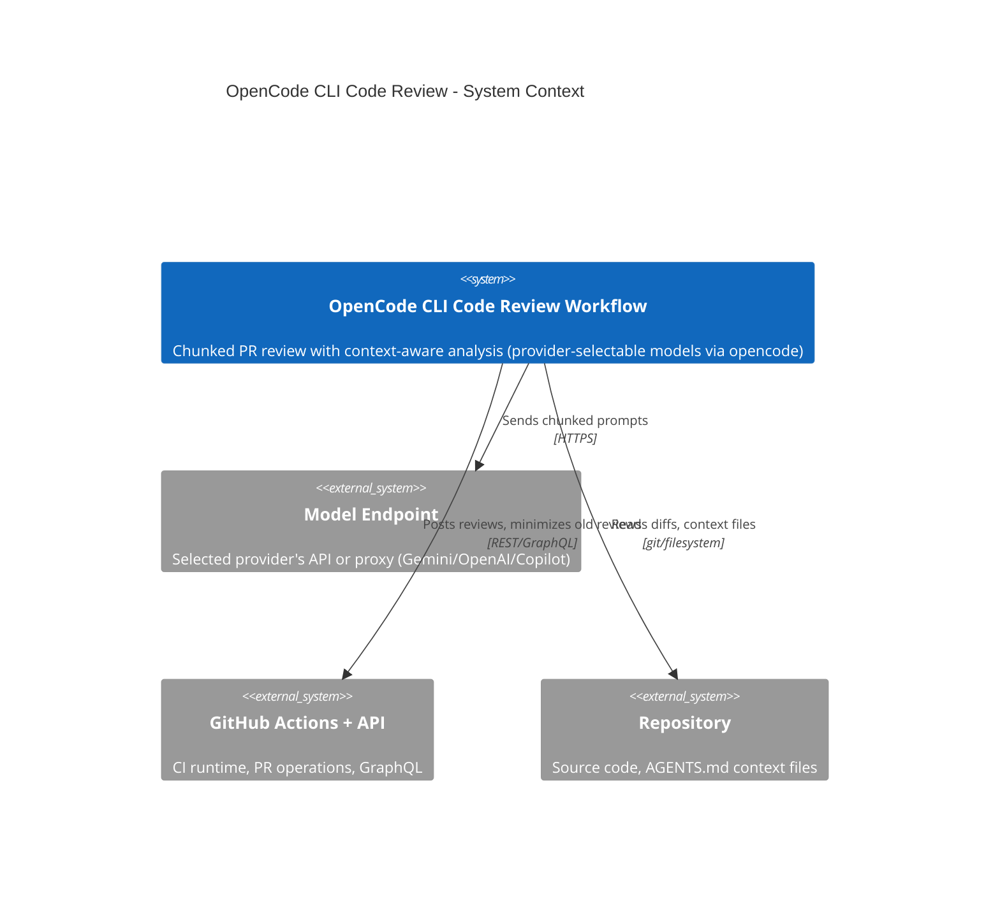

# OpenCode CLI Code Review

Automated PR code review using chunked processing, context-aware analysis, and provider-selectable models (Gemini / Copilot / OpenAI, chosen by `OPENCODE_PROVIDER`) served through the `opencode` CLI. Updated: 2026-06-06. Maintainer: Platform Engineering.

**Skill layout** (Agent Skills format — agentskills.io):
- `SKILL.md` — this file (current-state instructions + LADRs + Key Behaviors)
- `assets/opencode.json` — provider config (`gemini`, `github-copilot`, `openai`, `go-openai`, `go-anthropic`) installed into opencode's global scope at job start
- `assets/review-config.json` — file-exclusion patterns (lock files, generated code) consumed by `scripts/filter-excluded-files.sh`
- `scripts/` — CI shell scripts (`review-in-chunks.sh`, `aggregate-reviews.sh`, etc.)
- `scripts/lib/` — shared helpers (`resolve-provider.sh`, `opencode-with-fallback.sh`, `setup-opencode-config.sh`, `opencode-health.sh`)
- `references/CHANGELOG.md` — historical record (load only when updating this skill)
- `references/knowledge-conventional-contexts-quality.instructions.md` — bundled copy of the AGENTS.md quality standards the review/validation prompts apply

## Required Environment Variables

opencode reads these from the process environment via the `{env:…}` placeholders in `assets/opencode.json`. The config holds the provider *shape* only — never the secret values.

| Variable | Purpose | CI source | Local source |
|----------|---------|-----------|--------------|
| `OPENCODE_PROVIDER` | Selects the active provider: `GEMINI` (default), `COPILOT`, `OPENAI`, `OPENCODE-GO-OPENAI`, or `OPENCODE-GO-ANTHROPIC`. `lib/resolve-provider.sh` maps it to the provider-id + gateway creds | GitHub **Variable**, default `GEMINI` | `--provider` arg / shell, default `GEMINI` |
| `OPENCODE_GEMINI_URL` / `OPENCODE_GEMINI_API_KEY` | Gateway base URL + bearer token for the `gemini` provider | URL → GitHub **Variable**; key → **Secret** | exported in shell |
| `OPENCODE_COPILOT_URL` / `OPENCODE_COPILOT_API_KEY` | Gateway URL + key for the `github-copilot` provider | URL → **Variable**; key → **Secret** (only if used) | exported in shell |
| `OPENCODE_OPENAI_URL` / `OPENCODE_OPENAI_API_KEY` | Gateway URL + key for the `openai` provider | URL → **Variable**; key → **Secret** (only if used) | exported in shell |
| `OPENCODE_GO_OPENAI_API_KEY` | Key for the `go-openai` provider — OpenCode's [OpenCode Zen](https://opencode.ai/docs/go/) gateway, OpenAI-compatible surface (`@ai-sdk/openai-compatible`). Serves `deepseek-v4-flash`, `deepseek-v4-pro`, `glm-5.1`. **No URL var** — base `https://opencode.ai/zen/go/v1` is hardcoded in `opencode.json` (fixed public endpoint) | key → **Secret** (only if used) | exported in shell |
| `OPENCODE_GO_ANTHROPIC_API_KEY` | Key for the `go-anthropic` provider — same Zen gateway, Anthropic-compatible surface (`@ai-sdk/anthropic`). Serves `minimax-m2.7`, `qwen3.7-plus`, `qwen3.6-plus`. Same hardcoded base; same Zen key as the OpenAI surface works | key → **Secret** (only if used) | exported in shell |
| `OPENCODE_MODEL_PRIMARY_REVIEW` | Primary deep chunk-review model (LADR-002) | GitHub **Variable**, default `gemini-3.1-pro-preview`; `workflow_dispatch` input overrides | `--model` arg |
| `OPENCODE_MODEL_SECONDARY_REVIEW` | Second (and last) review model — fallback if primary fails | GitHub **Variable**, default `gemini-2.5-pro` | script default |
| `OPENCODE_MODEL_ORCHESTRATOR` | Cheap model for semantic grouping + aggregation + summary (LADR-022); falls back to the resolved review model | GitHub **Variable**, default `gemini-3-flash-preview` | script default |
| `OPENCODE_HEALTH_TIMEOUT` | Seconds `lib/opencode-health.sh` waits for `opencode serve` to come up + answer `/global/health` (default 30) | optional | optional |
| `OPENCODE_PROVIDER_ID` | **Derived** by `lib/resolve-provider.sh` — the opencode.json provider key the model is prefixed with (`gemini` / `github-copilot` / `openai` / `go-openai` / `go-anthropic`); consumed by `lib/opencode-with-fallback.sh` | resolver step → `$GITHUB_ENV` | exported by `local-review.sh` |
| `OPENCODE_GATEWAY_URL` / `OPENCODE_GATEWAY_API_KEY` | **Derived** — the selected provider's creds copied to generic names for the credential presence check (health is checked separately + provider-agnostically via the opencode server, so there is no per-provider gateway health URL/auth) | resolver / Install Dependencies → `$GITHUB_ENV` | exported by `local-review.sh` |
| `OPENCODE_REVIEW_REPORT_DISABLE_CLAUDE_CODE` | GitHub **Variable** — overrides the disable flag for Claude Code support. If unset/empty, defaults to `1` (disabled). Set to `0` to re-enable `.claude` support | GitHub **Variable** (default `1`) | shell export (default `1`) |
| `OPENCODE_DISABLE_CLAUDE_CODE` | Derived from `OPENCODE_REVIEW_REPORT_DISABLE_CLAUDE_CODE` (default `1`) — disables all `.claude` support in opencode to prevent conflicts with Claude Code's `.claude` directory features. Set in the workflow `env:` block and exported by `opencode-health.sh` / `opencode-with-fallback.sh` | derived | derived |

**Secrets vs Variables**: gateway **API keys** are credentials → **Secrets** (never Variables — those are plaintext and printable in logs). Gateway **URLs**, the provider selector, and model ids are non-sensitive config → **Variables**, so they can be retuned without editing the workflow. Each model `vars.*` has a literal default so an unset Variable never blanks the model.

**Non-GEMINI fail-fast**: the model-chain defaults are Gemini IDs. For any non-GEMINI provider you MUST set the three `OPENCODE_MODEL_*` to that provider's models — `gpt-5.5` / `gpt-5.4` / `gpt-5.4-mini` (Copilot/OpenAI), `deepseek-v4-pro` / `deepseek-v4-flash` / `glm-5.1` (`OPENCODE-GO-OPENAI`), or `qwen3.7-plus` / `minimax-m2.7` (`OPENCODE-GO-ANTHROPIC`); `lib/resolve-provider.sh` aborts the run if a `gemini*` model leaks through or the selected provider's creds are missing. (Also do not mix surfaces: an OpenAI-surface model id won't resolve on `go-anthropic` and vice-versa.)

**Local runs** use the same provider mechanism as CI. `local-review.sh` accepts `--provider`/`OPENCODE_PROVIDER`, harvests every provider's credentials from the shell rc files (URL + key for Gemini/Copilot/OpenAI; API key only for the two OpenCode Go surfaces, whose base URL is hardcoded) (so the non-interactive skill subagent sees them), sources `lib/resolve-provider.sh` to pick + validate the selected pair, and runs the provider-agnostic opencode health check (`lib/opencode-health.sh`: `opencode serve` + `/global/health`). GHA Variables are CI-only; locally the primary review model is the `--model` arg and the secondary/orchestrator fall back to script defaults (which must be overridden for non-GEMINI providers).

## TL;DR

GitHub Actions workflow that reviews PRs in chunks through the `opencode` CLI transport — provider-selectable via `OPENCODE_PROVIDER` (`GEMINI` / `COPILOT` / `OPENAI` / `OPENCODE-GO-OPENAI` / `OPENCODE-GO-ANTHROPIC`) — loads project-specific `*AGENTS.md` context files, and posts structured reviews with priority categorization — incremental reviews MUST never approve PRs (only full reviews can).

## Non-Negotiables

- **Incremental reviews MUST NEVER approve PRs** — only full reviews can approve (LADR-004, bug fix e33e84a)
- **Three-dot notation (`...`) for diffs** — symmetric difference, never two-dot
- **Never fetch or sync main branch** in the workflow
- **Context file updates must be atomic** — workflow YAML and this SKILL.md committed together
- **`ai-workflow-rules.instructions.md` is excluded from Gemini context** — that file is for coding AI (Claude Code), not review AI (Gemini)
- **Verify refactor suggestions are not already applied** — before recommending a syntactic refactor (primary constructor, record types, collection expressions `[...]`, `GetRequiredService<T>()` vs `GetService`, null-coalescing assignment, `using` declarations, file-scoped namespaces), check the current class/method signature or declaration line via `read_file`. Do NOT suggest a pattern already in use. Confirmed false positive: PR #4992 (BNKI-1066) suggested primary constructor for `BunkeringImportService` — class already used primary constructor syntax.
- **Source-of-truth precedence: diff + LADR/spec over PR-body intent** — when the PR description (including AI Review Notes "Focus Areas" / "Known Issues" wording) conflicts with the current diff against base or with an LADR / `*_AGENTS.md` in the loaded context, the diff and LADR are ground truth. PR-body text inevitably goes stale across follow-up commits and design changes. Do NOT mass-flag the code as wrong because it contradicts an outdated PR-body claim — flag the description as stale at **Low** instead. If an LADR documents the chosen approach (Decision / Alternatives Considered / Implementation notes), the implementation is by definition intentional — see DR-014 in `.agents/skills/code-review-standards/SKILL.md`. Confirmed false positive: PR #5258 (BNKI-1190) flagged `Secondary.Enabled: true` in prod as High×14 because the original AI Review Notes said "off in prod" — that wording was superseded by a later user decision (committed in `e7083c3`) and the kill-switch LADR-10 explicitly allows the flip; same review also flagged a Critical "missing type-name discriminator" using PR-body wording over LADR-10's chosen connection-string design.

## System Context

An automated code review system that reviews pull requests using the selected provider's models (Gemini / Copilot / OpenAI, via `OPENCODE_PROVIDER`) through the `opencode` CLI transport. Reviews are processed in chunks to avoid memory issues, with intelligent grouping by business context (semantic) or directory structure (fallback). Each chunk loads relevant `*AGENTS.md` context files from parent directories. Results are aggregated into a two-part output: executive summary (always visible) and detailed chunk analysis (collapsible).

## Architecture Decisions (Lightweight ADRs)

### LADR-001: Chunked Review Processing

- **Date**: 2025-10-28
- **Status**: Accepted
- **Context**: Large PRs caused JavaScript heap exhaustion and EventEmitter memory leaks in Gemini CLI
- **Decision**: Split diffs into chunks (<100KB each) grouped by directory, each as a separate Gemini API call, with final aggregation
- **Consequences**: Memory efficient and scalable; multiple API calls increase cost; needs cross-chunk holistic analysis

### LADR-002: Two-Tier Review Model Chain

- **Date**: 2025-12-19 (Updated: 2026-05-29)
- **Status**: Accepted
- **Context**: Gemini models may be unavailable due to quota exhaustion, rate limits, or regional issues. Deep chunk review needs a capable model; cheap orchestration (grouping/summary) is split out to its own model (LADR-022).
- **Decision**: Deep chunk-review chain is two-tier: `OPENCODE_MODEL_PRIMARY_REVIEW` (default `gemini-3.1-pro-preview`) → `OPENCODE_MODEL_SECONDARY_REVIEW` (default `gemini-2.5-pro`). No third tier — the old `auto`/Flash last-resort reviewer was removed; a degraded Flash review is worse than an honest "models down". If BOTH review models fail the startup probe, soft-fail per LADR-021. Models come from GitHub **Variables** (literal defaults); `workflow_dispatch` input overrides the primary. The startup probe tests only these two review models (the orchestrator is not probed — LADR-022). Error detection includes quota/rate-limit patterns.
- **Consequences**: High reliability for the substantive review; slightly longer startup due to model testing. Independent of the orchestrator tier, which can be retuned without touching the review chain.

### LADR-003: Context-Aware Review with On-Demand File Access

- **Date**: 2025-11-15
- **Status**: Accepted
- **Context**: Including full `*AGENTS.md` contents in prompts caused size bloat and false positives (Gemini flagged issues without seeing full context)
- **Decision**: Use `--yolo` flag for on-demand file system access. Pass file paths only, instruct Gemini to READ files before flagging Critical/High issues
- **Consequences**: No prompt size increase; reduced false positives; slightly slower when many files need verification

### LADR-004: Incremental Reviews Must Never Approve

- **Date**: 2025-11-20
- **Status**: Accepted
- **Context**: Bug where incremental reviews approved PRs, bypassing blocking states from full reviews (PR #3946)
- **Decision**: Incremental reviews MUST always use `--comment`, never `--approve`. Only full reviews can approve.
- **Consequences**: Prevents bypassing unresolved Critical/High issues; requires manual approval when incremental finds no new issues

### LADR-005: Two-Part Aggregation Output

- **Date**: 2025-11-28
- **Status**: Accepted
- **Context**: Single aggregation mixed executive summary with detailed analysis, creating visual clutter
- **Decision**: Split using `DETAILED_SECTION_MARKER` delimiter. Part 1 = executive summary (always visible). Part 2 = holistic cross-chunk analysis (collapsible with chunk details).
- **Consequences**: Clean overview for decision-makers; requires Gemini to follow two-part format

### LADR-006: Test File Pairing with Implementation Files

- **Date**: 2025-12-05
- **Status**: Accepted
- **Context**: Tests and implementation reviewed in separate chunks, making coverage verification difficult
- **Decision**: Map test files to implementation files (`.NET: *Test.cs→*.cs`, `Frontend: *.spec.ts→*.ts`) and group them in the same chunk
- **Consequences**: Tests reviewed alongside code they validate; slightly larger chunks

### LADR-007: Markdown-Based Separator Instead of JSON

- **Date**: 2025-12-01
- **Status**: Accepted
- **Context**: JSON output from Gemini frequently had schema violations (unescaped quotes, trailing commas)
- **Decision**: Use markdown with `DETAILED_SECTION_MARKER` delimiter, parsed with `sed`/`grep`
- **Consequences**: Reliable parsing; less structured than JSON but works well for LLM outputs

### LADR-008: Unified Concurrency Group (Superseded)

- **Date**: 2026-01-02
- **Status**: Superseded by LADR-009
- **Context**: Race condition where manual and automated reviews ran concurrently on same commit
- **Decision**: All events use same concurrency group
- **Why Superseded**: Caused `/ai-review` comments to cancel in-progress automated reviews

### LADR-009: Selective Concurrency

- **Date**: 2026-01-02
- **Status**: Accepted
- **Context**: LADR-008 caused reviews to be cancelled mid-execution
- **Decision**: Only `pull_request` events share concurrency group `ai-review-{pr_number}`. Other events (`issue_comment`, `workflow_dispatch`) use unique `{run_id}-{run_attempt}` per run. `pull_request_target` trigger was removed (caused duplicate runs on PR creation).
- **Consequences**: Automated reviews always complete; manual triggers run independently; rapid commits still cancel each other

### LADR-010: Adaptive Chunk Splitting by Directory Depth

- **Date**: 2026-02-17
- **Status**: Accepted
- **Context**: Large directories (e.g., ProsmarBunkering.Web with 13 files, ~130KB diff) exceeded Gemini API limits. `MAX_CHUNK_SIZE` was declared but never enforced.
- **Decision**: After initial grouping, calculate cumulative diff size per group. If exceeding 100KB, re-group by next directory level, up to 5 iterations. Single-file groups kept as-is.
- **Consequences**: Prevents API failures on large groups; uses natural directory structure; adds minor `git diff | wc -c` overhead

### LADR-011: Semantic Business Context Grouping via LLM

- **Date**: 2026-02-17
- **Status**: Accepted
- **Context**: Directory-based chunking splits cross-cutting features into isolated chunks (e.g., IMOS change across 3 directories reviewed separately)
- **Decision**: LLM pre-processing groups files by business context for PRs with 15+ files (threshold raised from 8 → 15 on 2026-05-28 after PR #5326 — 10 files — over-split into 6 chunks with tiny per-chunk output, hitting GitHub's 65KB review-body limit). 60-second timeout, strict validation (every file exactly once), falls back to directory grouping on failure. Includes "logic moved" detection: when code is removed from one file and similar code added in another, both are grouped together.
- **Consequences**: Cross-cutting features reviewed together for medium-to-large PRs; small PRs (<15 files) skip the extra semantic-grouping API call (~10-30s saved) and use cheaper directory grouping. Non-deterministic grouping above the threshold; LADR-010 applies as safety net

### LADR-013: Migration/Schema Chunk Detection

- **Date**: 2026-03-11
- **Status**: Accepted
- **Context**: EF Core migration files and raw SQL scripts have fundamentally different review concerns than application code (reversibility, existing data handling, nullable column safety, index locking) — but previously received the standard code review prompt, causing Gemini to focus on correctness and security instead of migration-specific risks.
- **Decision**: Detect chunks containing `*.sql`, `*_Migration.cs`, or `*/Migrations/*.cs` files and route them to a migration-focused prompt. Migration detection takes priority over doc-only detection in the three-way branch.
- **Consequences**: Migration PRs get actionable feedback on rollback paths and data safety. Standard code review items (performance, security, test coverage) are intentionally replaced — if a chunk mixes migration and application code, migration review applies. An AI reviewer is more useful flagging missing `Down()` methods than suggesting async patterns in a migration class.

### LADR-015: Strengthened Critical/High Verification and Diff Integrity Checks

- **Date**: 2026-03-23
- **Status**: Accepted
- **Context**: PR #4787 review produced false positives: (1) corrupted/large diff caused Gemini to flag "review blocked" as Critical, (2) Gemini flagged a symbol as still present despite it being removed in an earlier commit on the same branch — `read_file` would have shown its absence.
- **Decision**: Two changes: (a) Chunk prompt now requires Critical/High verification to confirm the flagged symbol exists in the **current file state** via `read_file`, not just in the diff hunk. (b) Per-file diff integrity check warns Gemini when a file's diff exceeds `MAX_CHUNK_SIZE`, instructing it not to raise Critical/High without `read_file` verification. Additionally, `/ai-review:analyse` auto-recommends skip for `[SPECULATIVE]`-tagged findings.
- **Consequences**: Reduces false positives from stale diff context and large/truncated diffs; adds minor per-file size check overhead; speculative findings no longer require manual triage

### LADR-012: Confidence Tagging and Verification-Incomplete Suppression

- **Date**: 2026-03-10
- **Status**: Accepted
- **Context**: Gemini frequently flagged test coverage or implementation concerns for files it never received in its chunk, producing false positives. Downstream tooling (`/ai-review:analyse`) had no way to distinguish verified findings from speculative ones.
- **Decision**: (1) Chunk prompts instruct Gemini to suppress findings for files not in the chunk at Critical/High/Medium — only Low (informational) allowed. (2) Every finding must be tagged `[VERIFIED]` (code seen in diff or via `read_file`) or `[SPECULATIVE]` (inferred from partial context). (3) Aggregation prompt preserves tags and prevents elevating speculative findings.
- **Consequences**: Reduces false positives from partial-context inference; enables downstream auto-downgrading of speculative findings; adds ~2 tokens per finding for the tag

### LADR-016: Release Branch Sync Review Mode

- **Date**: 2026-04-07
- **Status**: Accepted
- **Context**: Release branch sync PRs (`chore/bnk[uir]-001-sync-*`) aggregate already-reviewed code from multiple PRs. Standard review flagged style, test coverage, and performance on code that was already reviewed — generating noise and wasting reviewer time.
- **Decision**: Detect sync branches by head ref prefix (case-insensitive). Pass `REVIEW_MODE=sync` to chunk and aggregation scripts. Sync mode narrows chunk prompts to merge conflict errors, cross-PR breaking combinations, config drift, and migration ordering conflicts. Aggregation holistic analysis is similarly narrowed. Severity threshold raised: only Critical and High used, everything else is Low (informational).
- **Consequences**: Sync PRs get focused, actionable reviews instead of noise. Trade-off: genuine issues in already-reviewed code won't be caught (acceptable because original PR review should have caught them).

### LADR-017: Single-Chunk Aggregation Short-Circuit

- **Date**: 2026-05-12
- **Status**: Accepted
- **Context**: For PRs that produce a single chunk, the aggregation step still ran the full "Holistic Cross-Chunk Analysis" Gemini call — a Pro-tier model with `--yolo` `read_file` access and a ~430-line prompt template. Observed cost on PR #5179 (1 chunk): chunk review 8 min, aggregation 15 min (total 25 min). With one chunk there is by definition no *cross-chunk* surface to analyse, so the holistic pass is pure overhead and re-derives findings that already exist in the chunk review.
- **Decision**: When `TOTAL_CHUNKS=1`, skip the full Gemini holistic-aggregation call. Instead: (1) parse `🔴 [VERIFIED] Critical:` and `🟠 [VERIFIED] High Priority:` lines from the chunk review to determine the decision programmatically; (2) make one small targeted call on the ORCHESTRATOR model (LADR-022) — with a minimal prompt asking for 2-3 sentences describing what the PR changes and why. This fills `## 📋 Overall Summary` with a real narrative instead of a canned message. If the targeted call fails, fall back to the canned message. Placeholder filter uses case-insensitive regex that handles quoted, bolded, and period-terminated "None found" variants. Only `[VERIFIED]` findings can block — `[SPECULATIVE]` cannot promote to a blocking decision (consistent with LADR-012/LADR-015). LADR-004 enforcement preserved: incremental reviews always resolve to `COMMENT`, never `APPROVE`.
- **Consequences**: Eliminates the ~15-min holistic call for single-chunk PRs while preserving the readable summary. The targeted summary call completes in under 30 s on Flash. Cross-chunk analysis is not lost — it never existed for 1-chunk PRs. Holistic section shows "Not applicable" so the two-part output structure (LADR-005) is preserved.

### LADR-018: Flash Model for Aggregation Step

- **Date**: 2026-05-12
- **Status**: Superseded by LADR-022 (aggregation now uses the explicit `OPENCODE_MODEL_ORCHESTRATOR`)
- **Context**: LADR-002 specifies a Pro-tier model (`gemini-3.1-pro-preview`) for the review job. The same model was used for both chunk reviews (analytical) and the aggregation summary (summarisation). Aggregation is summarising chunk reviews into a PR-level overview and emitting a recommendation — not deep analysis. Pro-tier latency on the aggregation step (~15 min observed) is wasted on a task a Flash model can do in 2-3 min.
- **Decision**: Derive an `AGGREGATION_MODEL_ID` from `OPENCODE_MODEL_ID` inside `aggregate-reviews.sh`: `gemini-3*-pro*` → `gemini-3-flash-preview`, `gemini-2.5-pro*` → `gemini-2.5-flash`, anything else → pass-through. Chunk-review model selection (LADR-002 fallback chain) is unchanged. The `**Model:**` field in the posted review comment continues to show the chunk-review model (Pro), since chunk reviews drive the substantive findings — the Flash aggregation model is an implementation detail.
- **Consequences**: ~3-5× faster aggregation on multi-chunk PRs. No quality loss because aggregation is structured summarisation, not analysis. If the Flash variant is not available the LADR-002 fallback chain doesn't apply at the aggregation step (it only applies to the chunk-review startup test) — failure of the Flash call hits the existing `❌ Summary generation failed - using fallback` path, which writes a manual-review fallback summary. Acceptable: aggregation failure does not block the chunk review findings.

### LADR-019: No `read_file` Access at Aggregation Step

- **Date**: 2026-05-12
- **Status**: Accepted
- **Context**: LADR-003 grants `--yolo` `read_file` access to *all* Gemini calls. The aggregation prompt explicitly invited Gemini to `read_file` during the holistic pass to "verify concerns before flagging" and to "upgrade `[SPECULATIVE]` tags to `[VERIFIED]`". In practice this caused duplicate file reads: chunk reviews already performed `read_file` verification for every Critical/High finding (per Key Behavior "Critical/High symbol verification"), so the aggregation re-reads the same files to re-check the same findings. Multiple tool-call round-trips at Pro-tier latency contributed substantially to the 15-min aggregation time.
- **Decision**: Strip `read_file` invitations from the aggregation prompt template. The prompt instructs the model that file-system verification is not its job (the read tools the default agent exposes are simply left unused for the summary step). Confidence-tag promotion (`[SPECULATIVE]` → `[VERIFIED]`) is removed from the aggregation responsibilities — chunk reviews own it.
- **Consequences**: Fewer agentic round-trips at aggregation. Quality preserved because the *verification* layer is unchanged — chunk reviews still do the file-state checks per LADR-015. Trade-off: if a chunk review missed a verification opportunity, the aggregation can no longer rescue it. Acceptable: missing verification at chunk level is a chunk-review prompt bug to fix at that layer, not papered over downstream.

### LADR-021: All-Models-Failed Posts Request-Changes Instead of Failing Workflow

- **Date**: 2026-05-25
- **Status**: Accepted
- **Context**: When both review models (primary + secondary per LADR-002) failed during the startup probe — typically due to upstream token quota exhaustion, key/billing problems, or a regional outage — the workflow exited with `exit 1`. The resulting red ❌ "Gemini gate" check blocked merges even though the failure was infrastructure-side, not a code defect. Observed in run 26387093767: every model returned a quota/auth error and the job failed with no review posted.
- **Decision**: On all-models-failed, the model-test step sets `all_models_failed=true` (and `selected_model=none`) and completes successfully. A new step `Post Request Changes - All Gemini Models Failed`, gated on `steps.gemini_model_test.outputs.all_models_failed == 'true'`, posts a `--request-changes` review naming the failed models and pointing to the workflow logs. All downstream side-effect steps (Validate AGENTS.md, Block PR if AGENTS.md Validation Failed, Skip Review Due to Blocking Review, Review PR in Chunks, Aggregate Reviews, Minimize Previous Gemini Reviews, Post Review Comment, Post Error Comment) are gated with `steps.gemini_model_test.outputs.all_models_failed != 'true'` so they no-op on this path. The job exits green.
- **Consequences**: Quota / API-key incidents surface as a request-changes review (the existing "Failed → request-changes" branch of the decision matrix in Key Behaviors) rather than a red workflow check. Re-running once the upstream issue is resolved (via `/ai-review`) clears the request-changes state through a fresh full review. Trade-off: a green workflow check no longer guarantees a Gemini review ran — reviewers must read the posted review body to see whether substantive findings or an infrastructure failure produced the request-changes verdict. Acceptable because PR reviewers already inspect the review comment before merging.

### LADR-022: Explicit Orchestrator Model for Non-Analytical Calls

- **Date**: 2026-05-26 (Updated: 2026-05-29)
- **Status**: Accepted
- **Context**: Every PR runs two non-analytical calls — semantic grouping (`review-in-chunks.sh`) and aggregation/summary (`aggregate-reviews.sh`). Both are classification/summarisation, not code analysis, so they belong on a cheap model. The original design used an `auto` logical label derived from the review model via `get_aggregation_model()`, which hid the actual model behind proxy-router behaviour and coupled the cheap tier to the review tier.
- **Decision**: Replace the `auto` derivation with an explicit, independently-tunable `OPENCODE_MODEL_ORCHESTRATOR` (default `gemini-3-flash-preview`, a GitHub Variable). All non-chunk-review calls run on it. Its fallback is the **resolved review model** (the chunk chain's winner), so if the orchestrator is down the summary still runs on a known-healthy model. The orchestrator is intentionally **not** probed at startup (its fallback is already proven by the LADR-002 probe). Removed: the `auto` logical name, `resolve_model()`'s `auto`→flash mapping, and `get_aggregation_model()`.
- **Consequences**: Lower per-PR cost without changing review quality (analysis stays on the Pro review chain). The `**Model:**` field shows the resolved review model. Deterministic — no reliance on a proxy router to interpret `auto`. Orchestrator and review tiers tune independently. Supersedes LADR-018 (Flash for aggregation) and its derivation logic.

### LADR-024: Single Gateway Provider + Local Reachability Preflight

- **Date**: 2026-05-29
- **Status**: Partially superseded by LADR-026 (single-provider → env-based selection) and LADR-028 (the local gateway reachability preflight is replaced by the opencode-server health check). Only the `timeout`-shim part remains in force.
- **Context**: Both CI and local reviews run through the internal LiteLLM gateway (`litellm-gemini` provider) on `OPENCODE_GEMINI_URL` + `OPENCODE_GEMINI_API_KEY`. (An earlier same-day iteration added an `OPENCODE_PROVIDER` switch to opencode's built-in `google` provider for "use your own Gemini locally"; it was dropped — the only local Gemini access here is the gateway key, not a personal Google AI-Studio key, so the google path was dead weight.) The gateway is on a private network: off-VPN, every `opencode run` hung indefinitely (the macOS `timeout` shim killed only the bash wrapper, orphaning opencode) — a silent multi-minute "deadlock".
- **Decision**: One provider everywhere — `litellm-gemini`. `local-review.sh` (a) harvests `OPENCODE_GEMINI_*` from the shell rc files so the non-interactive skill subagent sees them, and (b) runs an 8s gateway `/health` **preflight** before any review work, aborting with a "connect to VPN" message if unreachable. The `timeout` shim was rewritten to run each call in its own process group and `kill -KILL` the group on expiry, so genuine hangs are bounded (60s grouping / 300s chunk) and no orphans leak.
- **Consequences**: Local runs need network access to the resolved endpoint. Off-VPN fails in ~8s with clear guidance instead of hanging. The `timeout`-shim fix is unconditional.
- **Why partially superseded**: the "one provider everywhere" stance was reversed by LADR-026 — the provider is now env-selectable and the endpoint can be a LiteLLM proxy *or* a provider's native API. The per-provider reachability preflight was itself later removed by LADR-028 in favour of the provider-agnostic opencode-server `/global/health` check.

### LADR-026: Env-Selected Provider (GEMINI / COPILOT / OPENAI)

- **Date**: 2026-06-06
- **Status**: Accepted (supersedes the single-provider stance of LADR-024)
- **Context**: `assets/opencode.json` already *declared* three providers (`litellm-gemini`, `github-copilot`, `openai`) but only `litellm-gemini` was ever routed to. Teams wanted to retarget the gate at Copilot/OpenAI gateways — or at a provider's native API rather than a LiteLLM proxy — without editing the workflow.
- **Decision**: Promote the providers from config-only to runtime-selectable via the `OPENCODE_PROVIDER` Variable (default `GEMINI`). `lib/resolve-provider.sh` is the single source of truth: it maps the selector → `OPENCODE_PROVIDER_ID` (the opencode provider key prefixed onto the model), copies the selected provider's URL/key into generic `OPENCODE_GATEWAY_URL`/`_API_KEY` (for the credential presence check), and **fails fast** when the selected provider's creds are missing or the `OPENCODE_MODEL_*` chain doesn't match the provider's model family (GEMINI → `gemini-*`, others → `gpt-*`). (Health checking was later moved out of the resolver to the provider-agnostic opencode server — LADR-028.) All call sites prefix `${OPENCODE_PROVIDER_ID}/<model>`; the workflow exports all three credential pairs at job scope; `local-review.sh` harvests all three pairs and sources the same resolver.
- **Consequences**: One gate, any of three providers, switchable by a Variable + that provider's URL/key/model Variables — no workflow edit. opencode is genuinely provider-agnostic transport: the endpoint may be a LiteLLM proxy or a native API. Trade-off: the model-chain defaults are Gemini IDs, so a non-GEMINI run MUST set `OPENCODE_MODEL_*` to that provider's models or the resolver aborts (intentional, prevents confusing downstream `opencode run` failures).

### LADR-027: OpenCode Go Providers — split by SDK surface (`go-openai` + `go-anthropic`)

- **Date**: 2026-06-06
- **Status**: Accepted (extends LADR-026)
- **Context**: LADR-026 made the provider env-selectable across `gemini` / `github-copilot` / `openai`. We additionally want to route the gate at OpenCode's own hosted gateway — [OpenCode Go / OpenCode Zen](https://opencode.ai/docs/go/) — which serves non-Google/non-OpenAI families (Qwen, DeepSeek, Kimi, GLM, MiniMax). The catch: OpenCode Go is **dual-surface**. Per the docs, some models speak the OpenAI Chat Completions API (`@ai-sdk/openai-compatible`, endpoint `https://opencode.ai/zen/go/v1/chat/completions`) and others speak the Anthropic Messages API (`@ai-sdk/anthropic`, endpoint `https://opencode.ai/zen/go/v1/messages`). A single `opencode.json` provider block can pin only one `npm`, so one block cannot serve both surfaces.
- **Decision**: Split OpenCode Go into **two** providers rather than one, each with its own `npm` + `baseURL` + credential namespace:
  - **`go-openai`** — `npm: "@ai-sdk/openai-compatible"`, `baseURL: "https://opencode.ai/zen/go/v1"` (hardcoded), `apiKey={env:OPENCODE_GO_OPENAI_API_KEY}`. Models: `deepseek-v4-flash`, `deepseek-v4-pro`, `glm-5.1`.
  - **`go-anthropic`** — `npm: "@ai-sdk/anthropic"`, `baseURL: "https://opencode.ai/zen/go/v1"` (hardcoded), `apiKey={env:OPENCODE_GO_ANTHROPIC_API_KEY}`. Models: `minimax-m2.7`, `qwen3.7-plus`, `qwen3.6-plus`.

  Both `baseURL`s are the shared base `https://opencode.ai/zen/go/v1` — the respective SDK appends `/chat/completions` vs `/messages` to reach the two documented endpoints. The base is a **fixed public endpoint, hardcoded** (not env-driven) — OpenCode Go is a single SaaS gateway with no per-deployment URL to retune, so there is **no `OPENCODE_GO_*_URL` Variable**; only the API key (Secret) is configurable, and the same OpenCode Zen key works for both surfaces. Two selectors map in: `OPENCODE_PROVIDER=OPENCODE-GO-OPENAI` → provider-id `go-openai`, `OPENCODE-GO-ANTHROPIC` → `go-anthropic` (resolved in `lib/resolve-provider.sh`, the workflow `OPENCODE_PROVIDER_ID` map + bootstrap creds case, `local-review.sh` cred harvest). `setup-opencode-config.sh`'s `is_ours` predicate widened to providers `["gemini","github-copilot","go-anthropic","go-openai","openai"]` (jq-sorted) and to accept the hardcoded `https://opencode.ai/zen/go/…` baseURL (the apiKey-is-`{env:…}` clause remains the managed-config discriminator). The model-family fail-fast still applies (non-GEMINI must not carry a `gemini*` id). (Health is checked provider-agnostically via the opencode server — LADR-028 — not per-surface.)
- **Consequences**: Two switchable providers covering both OpenCode Go surfaces; no workflow edit to enable (key = Secret, models = Variables — no URL to set). A run picks ONE surface — its model chain must be all-OpenAI-surface or all-Anthropic-surface ids (mixing won't resolve). Explicit `npm`/`baseURL` means we don't depend on opencode's catalog knowing the provider ids. Reaching usage beyond plan limits is handled OpenCode-side via the "Use balance" console toggle (Zen balance fallback) — not a pipeline concern.

### LADR-028: Health via the opencode server (`/global/health`), not per-provider gateway probes

- **Date**: 2026-06-06
- **Status**: Accepted (supersedes the per-provider health derivation in LADR-026 and the reachability-preflight half of LADR-024)
- **Context**: Health was checked by probing each provider's gateway endpoint — a per-surface path (`/v1/models`, `/v1beta/models`, `/models`, `<baseURL>/models`) with a per-surface auth header (Bearer vs `x-goog-api-key`), plus an `OPENCODE_API_HEALTH_OVERRIDE` escape hatch. That logic was duplicated in three places (the workflow's pre-checkout bootstrap, `lib/resolve-provider.sh`, and `local-review.sh`) and had to grow a new branch for every provider/surface added (it had just sprouted OpenCode Go branches). It was also brittle: a healthy `/models` on one surface didn't guarantee the surface opencode actually calls.
- **Decision**: Replace all per-provider gateway probes with a single provider-agnostic check against opencode itself. New `lib/opencode-health.sh` runs `opencode serve` (which prints `opencode server listening on http://127.0.0.1:<port>`), parses that URL, polls `<url>/global/health` until 200, then tears the server down. Identical for every provider, so `resolve-provider.sh` no longer derives `OPENCODE_GATEWAY_HEALTH_URL` / `OPENCODE_GATEWAY_AUTH_STYLE`, and `OPENCODE_API_HEALTH_OVERRIDE` is removed. Wired in: the workflow runs it as a non-blocking step (`|| true`) right after opencode is installed + configured; `local-review.sh` runs it (fatal) after `setup-opencode-config.sh`. The resolver still resolves + presence-checks the provider's URL/key (`OPENCODE_GATEWAY_URL`/`_API_KEY`).
- **Consequences**: One health path for all providers; adding a provider/surface needs no health-branch edit. Trade-off: `/global/health` confirms opencode is up but does NOT validate the upstream gateway's reachability or the API key — so (a) the local preflight no longer pre-empts a private-network/VPN hang (the process-group `timeout` shim still bounds hangs during real calls, LADR-024), and (b) a present-but-invalid key surfaces only at the real model call ("Assert Review Model Selection Works" in CI). Both are acceptable: the health step is a smoke test, and the functional model-call gate is unchanged.

### LADR-029: Run chunk review on a locked-down `review` agent (`--agent review`)

- **Date**: 2026-06-07
- **Status**: Accepted (realizes the read-only `review` agent anticipated by LADR-025; supersedes the "pass NO `--agent` flag" stance of LADR-023 and LADR-025)
- **Context**: On a PR that touched this gate's own files, chunk #2 (`.github/workflows/pipline-code-review-report.yml`, 1 file) came back as `## ⚠️ Review Failed` with **0 bytes** while chunks #0/#1 succeeded on the same model (`qwen3.7-plus`). The marker blamed "silent provider failure", but the chunk stderr told the real story: `> build · qwen3.7-plus` → `→ Skill "ai-review-report"` → `→ Read .github/workflows/pipline-code-review-report.yml` → end-of-turn, empty stdout. opencode's default **`build`** agent auto-discovers repo skills and exposes them as tools; the skill's own activation description ("use when modifying the `pipline-code-review-report` workflow") matched the chunk *being reviewed*, so the model **executed the skill instead of writing a review** and spent its turn on tool calls. This only bites when the gate reviews its own repo (or a repo that vendors this skill), but it forces a fail-closed REQUEST_CHANGES every time. Compounding it: `opencode-with-fallback.sh` keyed its fallback chain on exit code only — opencode exited 0 with empty output, so the secondary model was never tried.
- **Decision**: Stop using the default `build` agent for reviews. Define a custom **`review`** agent in `assets/opencode.json` (`mode: primary`, **no `model` field** so `--model` still wins — verified: `--agent review --model X` reports `> review · X`, the precedence trap LADR-023 hit with `build`'s pinned model does not apply) with `skill`/`task`/`edit`/`write`/`bash`/`webfetch`/`websearch` disabled (both via the deprecated `tools` map *and* `permission: deny`, belt-and-suspenders) and `read`/`grep`/`glob`/`list`/`external_directory` allowed (LADR-025 access preserved). `opencode-with-fallback.sh` now passes `--agent review` and, additionally, captures stdout and **returns non-zero when output is < 200 bytes**, so an exit-0-but-empty result advances the fallback chain (matching the empty-output floor in `review-in-chunks.sh`) instead of short-circuiting as a hollow success. The empty-chunk failure marker wording was corrected to name agent tool-misfire as a cause, not only provider failure.
- **Consequences**: The review model can no longer self-activate this (or any vendored) skill — the `.github` chunk reviews as text. Reviews remain read-only (no new write/bash/skill surface; arguably *tighter* than `build`). Aggregation also runs through `--agent review` (it only reads stdin + markdown). Trade-off: `assets/opencode.json` now carries a managed `agent` block — `setup-opencode-config.sh`'s `is_ours` self-heal predicate already keys on provider shape, so a personal config without `review` will be left intact with the standard warning (CI always overwrites). Reviewing this repo's own PRs is the canonical trigger, so keeping the `review` agent is required for the gate to certify its own changes.

### LADR-020: Skip Integration / DI / Test-Coverage Sections on Small PRs

- **Date**: 2026-05-12
- **Status**: Accepted
- **Context**: The holistic aggregation prompt unconditionally requested Integration, Dependency Injection Analysis, and Test Coverage Analysis sections for `full` reviews. These are intra-chunk concerns — chunk-review prompts already evaluate them per chunk for the changed files. Asking the aggregation model to re-derive them for 1-2 chunk PRs is duplicate work with low marginal value.
- **Decision**: Gate the Integration / DI / Test Coverage sections of the holistic prompt on `REVIEW_TYPE=full AND TOTAL_CHUNKS > 2`. Combined into a single guarded block (previously two adjacent `if` statements with identical condition).
- **Consequences**: Smaller prompt and faster aggregation on small PRs. For 3+ chunk PRs the sections still run, because cross-chunk integration/DI consistency is a genuine concern when changes span many files. No loss of coverage on 1-2 chunk PRs because the underlying chunk review already evaluated those concerns on the changed files.

### LADR-014: RTK Token Optimization for Gemini CLI

- **Date**: 2026-03-24
- **Status**: Superseded by LADR-023 (RTK Gemini hook is specific to `@google/gemini-cli`; opencode transport is incompatible with it)
- **Context**: Gemini CLI `--yolo` mode reads files via tool calls that return full uncompressed content, consuming tokens on large files (AGENTS.md, config files, source files). RTK proxies these tool outputs through intelligent filtering and compression.
- **Decision**: Install RTK in CI pipeline and configure the Gemini hook (`rtk init -g --gemini --auto-patch --hook-only`). RTK intercepts Gemini's `read_file` and shell tool calls, compressing outputs before they reach the model context.
- **Consequences**: 60-90% token reduction on tool outputs; adds ~5s install overhead; single Rust binary with zero runtime dependencies; transparent to review scripts (no code changes needed in review-in-chunks.sh or aggregate-reviews.sh)
- **Why Superseded**: After the LADR-023 transport migration the workflow no longer invokes `@google/gemini-cli`. RTK's Gemini hook only intercepts that binary's tool I/O — opencode handles its own tool calls outside RTK's interception path. The chunked architecture (LADR-001) already bounds prompt size to <100KB per chunk, which is what RTK's compression was protecting; per-PR token cost is monitored after the migration to confirm spend stays bounded.

### LADR-023: opencode as Transport for Gemini Models

- **Date**: 2026-05-28
- **Status**: Accepted
- **Context**: Google's public-tier Gemini CLI (`@google/gemini-cli`) stops serving Pro/Ultra/free accounts on 2026-06-18. Enterprise Gemini Code Assist licences are exempt; we use the public-tier endpoint behind an internal LiteLLM proxy (`OPENCODE_GEMINI_URL`), so the deadline applies to us. Antigravity CLI (Google's official replacement) is OAuth-only with no `--model` flag in print mode — not viable for headless CI on self-hosted runners. Pi (`@earendil-works/pi-coding-agent`) was viable but smaller ecosystem (57k stars). opencode (`opencode-ai`, MIT, 166k stars, 900 contributors) was chosen.
- **Decision**: Use `opencode` as the CLI transport. Gemini *models* unchanged — LADR-002 two-tier review chain (`gemini-3.1-pro-preview` → `gemini-2.5-pro`) and LADR-022 (explicit `OPENCODE_MODEL_ORCHESTRATOR` for non-analytical calls) preserved at the call-site level. The provider is always `litellm-gemini`, in CI and locally (LADR-024). Provider declared in `.agents/skills/ai-review-report/assets/opencode.json` as a custom `@ai-sdk/google` provider named `litellm-gemini`, with `baseURL={env:OPENCODE_GEMINI_URL}` (the LiteLLM proxy's Gemini-native endpoint — same URL the old `gemini-cli` used, so the auth path is already proven) and `apiKey={env:OPENCODE_GEMINI_API_KEY}`. The `@ai-sdk/google` choice follows upstream guidance for relayed Gemini setups (anomalyco/opencode#5777); the OpenAI-compat path returned 401 against our LiteLLM proxy. `lib/setup-opencode-config.sh` installs the config into `~/.config/opencode/opencode.json` (global scope, precedence 2 per opencode docs) at job start AFTER `actions/checkout`, so the provider resolves regardless of cwd. Invocations pass NO `--agent` flag — passing `--agent build` would override `--model` with build's pinned model (claude-opus-*) and silently no-op in CI. Without `--agent`, opencode uses its default agent, which respects `--model` AND exposes read/grep tools, so the prompt's `read_file` context-loading works (the diff is also inline as a fallback). **(Superseded by LADR-029**: reviews now pass `--agent review` — a custom agent with NO pinned `model`, so `--model` still wins, while skill/task/edit/bash are disabled to stop skill self-activation. The "no `--agent`" rule only ever existed to dodge `build`'s pinned-model override, which a model-less custom agent avoids.) The `litellm-gemini` provider registers four physical model ids (`gemini-3.1-pro-preview`, `gemini-2.5-pro`, `gemini-3-flash-preview`, `gemini-2.5-flash`). The old `auto` logical name and its `resolve_model()` mapping were removed (LADR-022) — every call site now passes an explicit model id.
- **Consequences**: Unblocks the 2026-06-18 EOL deadline. Posted review still surfaces the chunk-review Gemini model id in `**Model:**` (aggregation model remains an implementation detail per LADR-022). The workflow filename is `pipline-code-review-report.yml` (the comment trigger is `/ai-review`). LADR-015 file-state verification (the model calling `read_file` to confirm a flagged symbol still exists) works via the default agent's read tool. (Earlier this caveat noted opencode auto-rejecting reads outside the repo root, degrading chunks to diff-only context — **resolved by LADR-025**.)

### LADR-025: Allow `external_directory` reads (headless `--yolo` equivalent)

- **Date**: 2026-06-01
- **Status**: Accepted
- **Context**: Chunks intermittently failed with `## ⚠️ Review Failed for Chunk`. The chunk prompt lists context-file paths and instructs the model to `read_file` each (`review-in-chunks.sh`); context includes in-repo dot-paths (`.github/*AGENTS.md`, `.docs/nfr/*`, `.agents/rules-scoped/*`). opencode's `read` permission defaults to `allow`, but **`external_directory` defaults to `ask`** — and in non-interactive `opencode run` there is no responder, so opencode **auto-rejects** those reads → the model call errors/empties → the failure marker is written → the fail-closed net (LADR-022 multi-chunk / LADR-017 single-chunk) forces REQUEST_CHANGES even on clean PRs. The old `@google/gemini-cli` used `--yolo` (unconditional FS access) and had no such gate — this regressed in LADR-023.
- **Decision**: Add a top-level `"permission": { "external_directory": "allow" }` block to `assets/opencode.json` — the headless equivalent of `--yolo` for the one gate that was failing (`read`/`grep`/`glob` already default to `allow`). Applies to the default `build` agent used in `run` mode, so no `--agent` flag is introduced (avoids build's pinned-model override of `--model`). `setup-opencode-config.sh`'s self-heal `is_ours` predicate was widened to treat `permission` as part of our managed-config shape. The review pipeline only reads — never edits or runs bash — so allowing reads is safe.
- **Consequences**: Chunks reliably load context files; LADR-015 verification reads work; clean PRs can resolve to APPROVE again (as pre-migration). Trade-off: the model may read any in-repo path during a review — acceptable (same effective access as the prior `--yolo`).
- **Update (LADR-029)**: the "tighter scoping later" note below was realized — `external_directory: allow` is now ALSO set on a read-only `review` agent (`--agent review`) that additionally denies skill/task/edit/bash. The original suggested shape: move the permission under a read-only `review` agent (`{"agent":{"review":{"permission":{"external_directory":"allow","edit":"deny","bash":"deny"}}}}`) + `--agent review`.

## Key Behaviors

- **Review action decision matrix**: Full review + no issues → approve | Full + Critical/High → request-changes | Incremental + any result → comment (never approve) | Failed → request-changes
- **Context file discovery**: For each changed file, `find-context-files.sh` walks UP the directory tree collecting `*AGENTS.md` files (excluding `TEMPLATE_*`), then appends the explicit `MANDATORY_CONTEXT_FILES` list configured in the workflow `env:` (e.g. root `AGENTS.md`, `PROJECT_SETUP_AGENTS.md`, `code-review-standards/SKILL.md`, `TOOL_SETUP_AGENTS.md`, scoped backend rules). It does NOT auto-include arbitrary dot-prefixed paths (`.agents/rules/*`, `.docs/*`) — only discovered `*AGENTS.md` plus that explicit list. The per-chunk walk terminates before the repo root, so a root-level `AGENTS.md` is picked up only via `MANDATORY_CONTEXT_FILES`
- **File exclusion**: Auto-generated files (lock files, `*.Designer.cs`) filtered via `review-config.json` before chunking
- **Minimize previous reviews**: On full reviews only, uses GitHub GraphQL `minimizeComment` mutation to hide outdated Gemini reviews as "OUTDATED"
- **Blocking review detection**: Incremental reviews skip when `github-actions[bot]` has `CHANGES_REQUESTED`; full reviews always run (can clear blocking state)
- **Full review triggers**: PR comment `/ai-review` | commit message `/ai-review` | workflow dispatch | first review on PR
- **Draft PRs — automatic triggers skip, manual triggers allowed**: `pull_request` events on draft PRs are skipped via the job-level `github.event.pull_request.draft == false` guard. `ready_for_review` fires the review when the draft is marked ready. `/ai-review` comments and `workflow_dispatch` intentionally do NOT check draft state — they are explicit human overrides for early feedback on a draft. Do not extend the draft guard to those paths.
- **Machine-readable action**: Aggregation outputs `MACHINE_READABLE_ACTION:` field; fallback parses actual content from Critical/High sections filtering out "None found"
- **AGENTS.md drift detection (HIGH priority)**: When a PR modifies behavior documented in a nearby `*_AGENTS.md` file (Key Behaviors, Architecture Decisions, System Context diagrams, ER diagrams, sequence diagrams) but does NOT update the AGENTS.md, flag as HIGH. Stale context causes future AI agents to write code against outdated assumptions. Check: new external dependencies without C4Context update, changed handler flows without sequence diagram update, added/removed entity relationships without ER diagram update, modified key behaviors without Key Behaviors section update.
- **AGENTS.md template sections are optional**: Per `.agents/rules-scoped/_context-doc/knowledge-conventional-contexts-quality.instructions.md`, all sections except Changelog MUST be omitted if they would be empty or "N/A". Do NOT flag missing System Context, Quality Constraints, or Migration Plans — omission is intentional and correct. C4 diagrams are only required for services/workers with external integrations; libraries, config docs, and reference files correctly omit them.
- **Chunk review focus order (code chunks)**: Correctness/logic → Concurrency/thread-safety → Security → API contract breaking changes → Error handling → Performance → Test coverage → Readability → Clean Code principles → Project standards → Cross-file consistency
- **Migration/schema chunk detection**: Chunks containing `*.sql`, `*_Migration.cs`, or `*/Migrations/*.cs` files receive a migration-focused prompt (reversibility, existing data handling, nullable column safety, index impact, forward/backward compatibility, rollback strategy). Takes priority over doc-only detection. See LADR-013.
- **Documentation-only chunk detection**: Chunks containing only documentation files (`.md`, `.yml`, `.yaml`) receive a lighter review prompt focused on factual accuracy, template compliance, drift detection, and consistency — code review priorities (correctness, security, performance) are replaced. Severity threshold is raised: only factual inaccuracies that would cause incorrect AI-generated code warrant Critical/High.
- **Skip Areas enforcement**: Items listed under "Skip Areas" in PR author's AI Review Notes are out-of-scope for Critical, High, and Medium classifications — flag at Low Priority at most.
- **Diff + LADR/spec beats PR-body intent**: When PR description wording (Focus Areas, Known Issues, intent claims) conflicts with the current diff against base OR with an LADR / `*_AGENTS.md` in the loaded context, treat the diff and LADR as ground truth. PR-body text becomes stale across follow-up commits; do not mass-flag code as wrong because it contradicts an outdated description. Flag the description as stale at Low instead. If an LADR's Decision / Alternatives Considered / Implementation notes records the chosen approach, the implementation is by definition intentional — do not flag at Critical/High. Self-consistency check: if your own per-chunk review confirms an LADR is correct ("perfectly reflects the codebase", "documents this correctly"), you cannot raise the same chosen approach as Critical elsewhere in the same review. See DR-014 in `.agents/skills/code-review-standards/SKILL.md`. Confirmed false positives: PR #5258 (BNKI-1190) — High×14 on `Secondary.Enabled: true` because original AI Review Notes said "off in prod" (superseded by later commit `e7083c3`); Critical on "missing type-name discriminator" despite LADR-10 explicitly choosing connection-string discrimination and Chunk #2 confirming LADR correctness.
- **Confidence tagging**: Every finding must be tagged `[VERIFIED]` (reviewer saw code in chunk diff or via `read_file`) or `[SPECULATIVE]` (inferred from partial context). Tag is placed immediately after the priority emoji. Aggregation preserves tags and must not elevate `[SPECULATIVE]` findings to Critical/High. `/ai-review:analyse` auto-recommends skip for `[SPECULATIVE]`-tagged findings.
- **Critical/High symbol verification**: Before flagging a Critical or High issue, Gemini must use `read_file` to confirm the flagged symbol/pattern exists in the **current file state** — not just in the diff hunk. Multi-commit PRs may show removals in diff context that were already applied in earlier commits on the same branch.
- **Mode-aware regression analysis — trace pre-PR behaviour in every execution mode before flagging a deleted `throw`/guard as a regression**: When a PR deletes a `throw`, early-return, or guard clause that was conditional on a feature flag, configuration value, or mode selector, do NOT flag it as a regression without first tracing the pre-PR behaviour **in every execution mode the code supported**. If the deleted branch was already dead code (unreachable or bypassed) in the mode that survives the PR, there is no regression — the PR is simply removing dead code alongside the mode it belonged to. Signal: PR description mentions "remove mode", "deprecate flag", "single worker", or the diff deletes both a flag property AND the branches gated on it. Confirmed false positive: PR #4992 (BNKI-1066) flagged `FtpHelper.cs` "swallowed exceptions regression" after a `if (!config.ContinueWorking) throw;` gate was deleted alongside the `ContinueWorking` property — in continuous mode (the surviving mode), the throw was never reached pre-PR, so behaviour is identical. See DR-013 in `.agents/skills/code-review-standards/SKILL.md`.
- **EF Core expression tree navigation — do not flag NRE**: Navigation property access inside EF Core `.Select()`, `.Where()`, `.OrderBy()` lambdas is compiled into an expression tree and translated to SQL (LEFT/INNER JOIN with NULL propagation) — it is NOT executed as runtime C#. Do NOT flag NRE risk or suggest `?.` on navigation properties inside these lambdas. Signal: method returns `IQueryable<T>` or ends with `.ToListAsync()`. Materialized code (after `.ToList()`, `.FirstOrDefault()`, `.AsEnumerable()`) is runtime C# and NRE rules apply normally. Confirmed recurring false positive pattern (BNKI-780 rounds 1 and 2). See DR-012 in `.agents/skills/code-review-standards/SKILL.md`.
- **Diff integrity warning**: When a single file's diff exceeds `MAX_CHUNK_SIZE` (100KB), the prompt includes a warning instructing Gemini not to raise Critical/High issues for that file without `read_file` verification of current file state.
- **Verification-incomplete suppression**: If a file was not included in a review chunk (not in "Files in this chunk"), the reviewer must NOT flag concerns about that file at Critical/High/Medium. Only Low (informational) is allowed for unreviewed files.
- **Semantic grouping "logic moved" detection**: When semantic grouping detects code removed from one file and similar code added in another (e.g., validation moved from backend to frontend), both files are grouped in the same chunk for holistic review.
- **Prompt requirements**: PR metadata in expertise statement, AI Review Notes from PR description included, priority categorization mandatory, "None found" for empty categories, suggested fixes with before/after code
- **Runner requirement**: Runs on `ubuntu-latest` (GitHub-hosted). opencode is provider-agnostic transport, so this requires the selected provider's endpoint (`OPENCODE_<PROVIDER>_URL` — a LiteLLM proxy or a native API: Google Gemini, OpenAI, Copilot) to be reachable from GitHub-hosted runners — i.e. publicly routable over HTTPS, not private-network/VPN-only. If a private-network endpoint is ever used, switch `runs-on` back to `self-hosted` (the job is network-bound — chunked to <100KB/call — so plain `self-hosted` suffices, not `self-hosted-high-memory`). `gh` CLI is pre-installed on `ubuntu-latest` and must NOT be installed/updated in the workflow.
- **opencode transport (LADR-023/024/026/027)**: All model calls go through `opencode run --model ${OPENCODE_PROVIDER_ID}/<model>` (provider-id resolved by `lib/resolve-provider.sh` from `OPENCODE_PROVIDER`, default `gemini`; `OPENCODE-GO-OPENAI` → `go-openai`, `OPENCODE-GO-ANTHROPIC` → `go-anthropic`, e.g. `go-anthropic/qwen3.7-plus`) with NO `--agent` flag. Prompts are fed via stdin redirection (`< chunk_N_prompt.txt`). The `opencode-with-fallback.sh` helper takes an explicit chain per call site: chunk review = `PRIMARY_REVIEW → SECONDARY_REVIEW` (LADR-002); orchestrator (semantic grouping, aggregation) = `ORCHESTRATOR → resolved review model` (LADR-022). An empty fallback slot is skipped. The default agent exposes read/grep and `opencode.json` sets `permission.external_directory: allow` (LADR-025), so the prompt's `read_file` context-loading + LADR-015 verification reads of in-repo dot-paths succeed in headless mode (the diff is inline as a fallback). Empty/tiny chunk output (<200 bytes) is detected and replaced with a `## ⚠️ Review Failed for Chunk:` marker so silent opencode failures surface in the posted PR review body.
- **Release branch sync review mode**: Branches matching `chore/bnk[uir]-001-sync-*` (case-insensitive) trigger sync mode (`REVIEW_MODE=sync`). Chunk prompts focus on merge conflict errors, cross-PR breaking combinations, config/env drift, and migration ordering conflicts. Holistic aggregation is similarly narrowed. Style, test coverage, performance, and documentation issues are explicitly excluded. Severity threshold: only Critical, High, and Low (informational) — no Medium. See LADR-016.
- **Local CLI execution**: `local-review.sh` wraps the CI scripts for local use. Supports `--pr NUMBER` (fetches PR metadata via `gh`), `--base BRANCH`, `--model MODEL`, `--post` (posts review to PR). Uses the same provider mechanism as CI (LADR-026/027): accepts `--provider`/`OPENCODE_PROVIDER`, harvests every provider's credentials from the shell rc files (URL+key for Gemini/Copilot/OpenAI; API key only for the two OpenCode Go surfaces — their base URL is hardcoded) (so the non-interactive skill subagent sees them), resolves + validates the selected pair via `lib/resolve-provider.sh`, installs the config, and runs the provider-agnostic opencode health check (`lib/opencode-health.sh`: `opencode serve` + `/global/health`, LADR-028). NOTE: that health check confirms opencode is up but does NOT verify the upstream gateway is reachable, so it no longer pre-empts a private-network/VPN hang — the process-group `timeout` shim still bounds any hang during the actual model calls. Requires `opencode` CLI (LADR-023; install via `curl -fsSL https://opencode.ai/install | bash`) and `jq`. macOS users need `gsed` (`brew install gnu-sed`); a process-group-killing `timeout` shim is provided automatically. Output saved to `.context/ai-review/<timestamp>/final_review.md`.
- **Single-chunk aggregation short-circuit (LADR-017)**: When `TOTAL_CHUNKS=1` the full holistic aggregation call is skipped. Decision (approve/request-changes/comment) is built programmatically from the chunk's `[VERIFIED]` Critical/High lines. `## 📋 Overall Summary` is filled by one targeted ORCHESTRATOR-model call (LADR-022) asking for 2-3 sentences on what the PR changes and why. If the targeted call fails, a canned fallback message is used. Placeholder-strip regex is case-insensitive and handles quoted, bolded, and period-terminated "None found" variants (e.g. `"None found"`, `**None found**`, `None found.`). LADR-004 enforcement preserved: incremental reviews always resolve to `COMMENT`, never `APPROVE`.
- **Orchestrator model for non-analytical calls (LADR-022)**: Any call that is not a chunk review runs on `OPENCODE_MODEL_ORCHESTRATOR` (default `gemini-3-flash-preview`), falling back to the resolved review model if the orchestrator is down. Applies to: semantic grouping (`review-in-chunks.sh`) and aggregation summary (`aggregate-reviews.sh`, both single-chunk and multi-chunk paths). The orchestrator is an explicit, independently-tunable env var — the old `get_aggregation_model()` derivation and the `auto` logical name were removed. Chunk review keeps the two-tier review chain (LADR-002). The `**Model:**` field in the posted review shows the resolved review model — the orchestrator is an implementation detail. The orchestrator is not probed at startup (its fallback is already proven by the review probe). Supersedes LADR-018 Flash-tier derivation.
- **No `read_file` at aggregation (LADR-019)**: Aggregation prompt explicitly tells the model it does NOT have file-system access. Symbol verification belongs to the chunk-review step (per "Critical/High symbol verification" Key Behavior and LADR-015). Aggregation abstains by prompt instruction — the default agent's read tools are deliberately left unused for the summary step.
- **All-models-failed soft-fail (LADR-021)**: If the startup probe finds both review models unavailable (quota / API key / region — the orchestrator is not probed), the model-test step sets `all_models_failed=true` and completes successfully instead of `exit 1`. A dedicated step posts a `--request-changes` review identifying the failed models and linking the workflow logs, then the job exits green. All downstream review steps short-circuit via `steps.gemini_model_test.outputs.all_models_failed != 'true'`. Reviewers see the request-changes verdict on the PR (consistent with the "Failed → request-changes" branch of the decision matrix) rather than a red workflow check.
- **Trim holistic sections on small PRs (LADR-020)**: Integration / Dependency Injection / Test Coverage Analysis sections of the holistic prompt are only included when `REVIEW_TYPE=full AND TOTAL_CHUNKS > 2`. These are intra-chunk concerns — chunk reviews already evaluate them per chunk; re-asking the aggregation model on 1-2 chunk PRs is duplicate work.

## Changelog

> Historical record moved to `references/CHANGELOG.md` (per Agent Skills progressive-disclosure best practice — load only when updating this skill).
