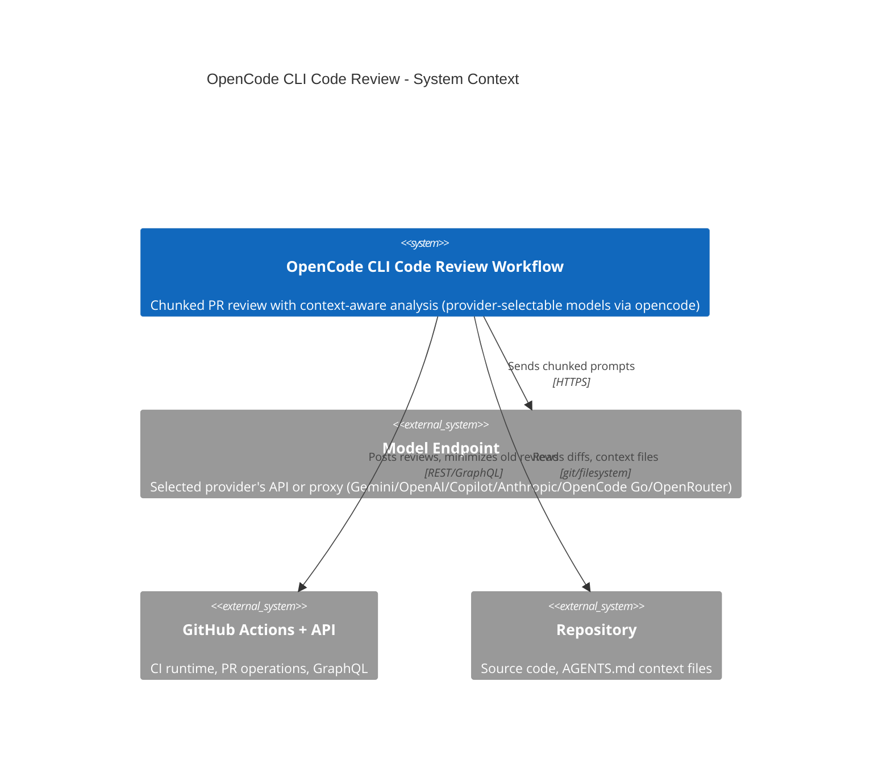

# OpenCode CLI Code Review

Automated PR code review using chunked processing, context-aware analysis, and provider-selectable models (Gemini / Copilot / OpenAI / Anthropic / OpenCode Go / OpenRouter, chosen by `OPENCODE_REVIEW_REPORT_PROVIDER`) served through the `opencode` CLI. Updated: 2026-07-04. Maintainer: Platform Engineering.

**This file is the runtime contract** — how to run a review, the configuration it reads, and the behaviour it must exhibit. Everything an AI coder needs to *maintain* the pipeline lives in the sibling **`AGENTS.md`**: all 54 LADRs in full, the editing-time Key Behaviors (script coupling, prompt-authoring rules, transport internals), env-var provenance, skill layout and the confirmed false-positive PR references. Load `AGENTS.md` before changing the workflow, the scripts or the prompts.

## Required Environment Variables

opencode reads these from the process environment via the `{env:…}` placeholders in `assets/opencode.json`. The config holds the provider *shape* only — never the secret values.

| Variable | Purpose | CI source | Local source |
|----------|---------|-----------|--------------|
| `OPENCODE_REVIEW_REPORT_PROVIDER` | Selects the active provider: `GEMINI` (default), `COPILOT`, `OPENAI`, `ANTHROPIC`, `OPENCODE-GO-OPENAI`, `OPENCODE-GO-ANTHROPIC`, or `OPEN_ROUTER`. `lib/resolve-provider.sh` maps it to the provider-id + gateway creds | GitHub **Variable**, default `GEMINI` | `--provider` arg / shell, default `GEMINI` |
| `OPENCODE_REVIEW_REPORT_GEMINI_URL` / `OPENCODE_GEMINI_API_KEY` | Gateway base URL + bearer token for the `gemini` provider | URL → GitHub **Variable**; key → **Secret** | exported in shell |
| `OPENCODE_REVIEW_REPORT_COPILOT_URL` / `OPENCODE_COPILOT_API_KEY` | Gateway URL + key for the `github-copilot` provider | URL → **Variable**; key → **Secret** (only if used) | exported in shell |
| `OPENCODE_REVIEW_REPORT_OPENAI_URL` / `OPENCODE_OPENAI_API_KEY` | Gateway URL + key for the `openai` provider | URL → **Variable**; key → **Secret** (only if used) | exported in shell |
| `OPENCODE_ANTHROPIC_API_KEY` | Key for the `anthropic` provider — direct Anthropic API (`@ai-sdk/anthropic`). Serves `claude-opus-4-8`, `claude-sonnet-4-6`, `claude-haiku-4-5`. **No URL var** — base `https://api.anthropic.com` is hardcoded in `opencode.json` (fixed public endpoint, LADR-040) | key → **Secret** (only if used) | exported in shell |
| `OPENCODE_GO_OPENAI_API_KEY` | Key for the `go-openai` provider — OpenCode's [OpenCode Zen](https://opencode.ai/docs/go/) gateway, OpenAI-compatible surface (`@ai-sdk/openai-compatible`). Serves `deepseek-v4-flash`, `deepseek-v4-pro`, `glm-5.1`. **No URL var** — base `https://opencode.ai/zen/go/v1` is hardcoded in `opencode.json` (fixed public endpoint) | key → **Secret** (only if used) | exported in shell |
| `OPENCODE_GO_ANTHROPIC_API_KEY` | Key for the `go-anthropic` provider — same Zen gateway, Anthropic-compatible surface (`@ai-sdk/anthropic`). Serves `minimax-m3`, `minimax-m2.7`, `qwen3.7-plus`, `qwen3.6-pro`. Same hardcoded base; same Zen key as the OpenAI surface works | key → **Secret** (only if used) | exported in shell |
| `OPENCODE_OPENROUTER_API_KEY` | Key for the `openrouter` provider — the OpenRouter aggregator (`@openrouter/ai-sdk-provider`). Serves vendor-prefixed slugs (`deepseek/deepseek-v4-pro`, `qwen/qwen3.7-plus`, `z-ai/glm-5.1`, `minimax/minimax-m3`, …; no Anthropic/OpenAI models). **No URL var** — base `https://openrouter.ai/api/v1` is hardcoded in `opencode.json` (fixed public endpoint, LADR-039) | key → **Secret** (only if used) | exported in shell |
| `OPENCODE_REVIEW_REPORT_MODEL_PRIMARY` | Primary deep chunk-review model (LADR-002) | GitHub **Variable**, default `gemini-3.1-pro-preview`; `workflow_dispatch` `model` input overrides, and the `model_preset` dropdown overrides everything (provider + all three tiers) | `--model` arg |
| `OPENCODE_REVIEW_REPORT_MODEL_SECONDARY` | Second (and last) review model — fallback if primary fails | GitHub **Variable**, default `gemini-2.5-pro` | script default |
| `OPENCODE_REVIEW_REPORT_MODEL_ORCHESTRATOR` | Cheap model for semantic grouping + aggregation + summary (LADR-022); falls back to the resolved review model | GitHub **Variable**, default `gemini-3-flash-preview` | script default |
| `OPENCODE_ANALYSE_*` | Eight Variables owned by the sibling `ai-analyse` skill and consumed only by `pipeline-ai-analyse.yml` — provider/model selection, the incremental cap, the test-in-the-loop switch and the test-gate knobs. Full table in `AGENTS.md`; behaviour in `ai-analyse/SKILL.md` | GitHub **Variables** | n/a |
| `OPENCODE_REVIEW_REPORT_HEALTH_TIMEOUT` | Seconds `lib/opencode-health.sh` waits for `opencode serve` to come up + answer `/global/health` (default 30) | optional | optional |
| `OPENCODE_REVIEW_REPORT_CHUNK_TIMEOUT` | Seconds per chunk review (default `450`). Wraps the **whole** model chain, so a timeout means the LADR-002 secondary never ran and the chunk fail-closes — budget generously. Invalid values fall back to 450 (`lib/validate-chunk-timeout.sh` owns the default and the accepted form) | GitHub **Variable**, default `450` | optional |
| `OPENCODE_REVIEW_REPORT_ERROR_LOG_LINES` | Tail lines of a failed chunk's stderr printed in the `::group::` diagnostic (default `40`); the full log is preserved regardless | optional | optional |
| `OPENCODE_REVIEW_REPORT_LOG_DIR` | Where preserved chunk-stderr logs are copied (default `ci_temp_logs`, deliberately a **sibling** of `ci_temp/` so the `if: always()` cleanup cannot delete them). Best-effort — an unwritable target is skipped silently | optional | optional |
| `OPENCODE_REVIEW_REPORT_MAX_FILE_COUNT` | Max changed-file count (post-exclusion) before the PR is blocked with a REQUEST_CHANGES "too many files" review instead of being reviewed (LADR-032); non-integer/≤0 falls back to 100 | GitHub **Variable**, default `100` | n/a (CI gate only) |
| `OPENCODE_REVIEW_REPORT_DISABLE_AGENTS_MD_CHECK` | Disables the full-review AGENTS.md / README.md / SKILL.md documentation validation gate when set to `1`/`true`/`yes` (case-insensitive); unset or `0` preserves the default validation | GitHub **Variable**, default `0`; `disable_agents_md_check` workflow input overrides | n/a (CI gate only) |
| `OPENCODE_REVIEW_REPORT_BYPASS_MANDATORY_CONTEXT_FILE` | When truthy (`1`/`true`/`yes`/`on`, case-insensitive), bypasses both the AGENTS.md validation checks and the mandatory context file loading (`MANDATORY_CONTEXT_FILES` are not injected, `validate-agents-md.sh` is skipped). Unset/empty/`0`/`false` preserves standard behaviour | GitHub **Variable**, default empty; `bypass_mandatory_context_file` workflow input overrides (when non-empty) | n/a (CI gate only) |
| `OPENCODE_REVIEW_REPORT_PROVIDER_ID` | **Derived** by `lib/resolve-provider.sh` — the opencode.json provider key the model is prefixed with (`gemini` / `github-copilot` / `openai` / `anthropic` / `go-openai` / `go-anthropic` / `openrouter`); consumed by `lib/opencode-with-fallback.sh` | resolver step → `$GITHUB_ENV` | exported by `local-review.sh` |
| `OPENCODE_REVIEW_REPORT_GATEWAY_URL` / `OPENCODE_GATEWAY_API_KEY` | **Derived** — the selected provider's creds copied to generic names for the credential presence check (health is checked separately + provider-agnostically via the opencode server, so there is no per-provider gateway health URL/auth) | resolver / Install Dependencies → `$GITHUB_ENV` | exported by `local-review.sh` |
| `OPENCODE_REVIEW_REPORT_DISABLE_CLAUDE_CODE` | GitHub **Variable** — overrides the disable flag for Claude Code support. If unset/empty, defaults to `1` (disabled). Set to `0` to re-enable `.claude` support | GitHub **Variable** (default `1`) | shell export (default `1`) |
| `OPENCODE_DISABLE_CLAUDE_CODE` | Derived from the above — keeps opencode's `.claude` support off so it cannot collide with Claude Code's own `.claude/` on the runner | derived | derived |
| `OPENCODE_REVIEW_REPORT_CONFIG` | Repo-relative path to a custom `opencode.json` in the repo under review, installed instead of the committed `assets/opencode.json` (LADR-047). Must keep the `{env:OPENCODE_*}` placeholders; `..` and absolute paths rejected; missing file → hard fail. Precedence: `opencode_config` input → this Variable → committed default | GitHub **Variable** (or `opencode_config` input), default unset | n/a (CI gate only) |
| `OPENCODE_REVIEW_REPORT_ENABLE_STRUCTURED_FINDINGS` | Enables the LADR-055 structured-findings sidecar (per-chunk JSON → dedup + confidence gate → rendered `## 🔍 Issues Summary` with a `### 📊 Coverage` block). Set falsy to revert the chunk prompt and summary to their pre-LADR-055 shape. Fully degradable: no sidecar / malformed JSON / partial coverage / missing Python all fall back | GitHub **Variable**, default `1` | n/a (CI gate only) |

**Secrets vs Variables**: gateway **API keys** are credentials → **Secrets** (never Variables — those are plaintext and printable in logs). Gateway **URLs**, the provider selector, and model ids are non-sensitive config → **Variables**, so they can be retuned without editing the workflow. Each model `vars.*` has a literal default so an unset Variable never blanks the model.

**Non-GEMINI fail-fast**: the model-chain defaults are Gemini IDs. For any non-GEMINI provider you MUST set the three `OPENCODE_REVIEW_REPORT_MODEL_*` to that provider's models — `gpt-5.5` / `gpt-5.4` / `gpt-5.4-mini` (Copilot/OpenAI), `claude-opus-4-8` / `claude-sonnet-4-6` / `claude-haiku-4-5` (Anthropic), `deepseek-v4-pro` / `deepseek-v4-flash` / `glm-5.1` (`OPENCODE-GO-OPENAI`), `qwen3.7-plus` / `minimax-m2.7` (`OPENCODE-GO-ANTHROPIC`), or the vendor-prefixed `deepseek/deepseek-v4-pro` / `qwen/qwen3.7-plus` / `z-ai/glm-5.1` (`OPEN_ROUTER`); `lib/resolve-provider.sh` aborts the run if a `gemini*` or `claude*` model leaks through to the wrong provider, or the selected provider's creds are missing. (Also do not mix surfaces — e.g. a `claude-*` model id on `OPENCODE-GO-OPENAI` returns a non-retryable 404, and an OpenAI-surface model id won't resolve on `go-anthropic` and vice-versa.)

**Local runs** use the same provider mechanism as CI. The skill-level `--local` switch selects this path and maps to `local-review.sh`; do not pass `--local` through to the script. Bare `--local` is fully specified: run `scripts/local-review.sh` with no extra arguments, reviewing HEAD/current branch against `main`, not posting to GitHub, using `OPENCODE_REVIEW_REPORT_PROVIDER` if set and otherwise `GEMINI`, and using script model defaults unless explicit `--model` / model env vars are supplied. Do NOT ask which PR, provider, post mode, or base to use unless the user explicitly requests a non-default. `local-review.sh` accepts `--provider`/`OPENCODE_REVIEW_REPORT_PROVIDER`, harvests every provider's credentials from the shell rc files (URL + key for Gemini/Copilot/OpenAI; API key only for Anthropic, the two OpenCode Go surfaces, and OpenRouter, whose base URLs are hardcoded) (so the non-interactive skill subagent sees them), sources `lib/resolve-provider.sh` to pick + validate the selected pair, and runs the provider-agnostic opencode health check (`lib/opencode-health.sh`: `opencode serve` + `/global/health`). GHA Variables are CI-only; locally the primary review model is the `--model` arg and the secondary/orchestrator fall back to script defaults (which must be overridden for non-GEMINI providers). If required provider credentials are unavailable, let the script fail with its actionable prerequisite error rather than asking preflight questions.

## TL;DR

GitHub Actions workflow that reviews PRs in chunks through the `opencode` CLI transport — provider-selectable via `OPENCODE_REVIEW_REPORT_PROVIDER` (`GEMINI` / `COPILOT` / `OPENAI` / `ANTHROPIC` / `OPENCODE-GO-OPENAI` / `OPENCODE-GO-ANTHROPIC` / `OPEN_ROUTER`) — loads project-specific `*AGENTS.md` context files, and posts structured reviews with priority categorization — incremental reviews MUST never approve PRs (only full reviews can).

## Non-Negotiables

- **Incremental reviews MUST NEVER approve PRs** — only full reviews can approve (LADR-004)
- **Three-dot notation (`...`) for diffs** — symmetric difference, never two-dot
- **Never fetch or sync main branch** in the workflow
- **Context file updates must be atomic** — workflow YAML and this SKILL.md committed together
- **`ai-workflow-rules.instructions.md` is excluded from Gemini context** — that file is for coding AI (Claude Code), not review AI (Gemini)
- **Verify refactor suggestions are not already applied** — before recommending a syntactic refactor (primary constructor, record types, collection expressions `[...]`, `GetRequiredService<T>()` vs `GetService`, null-coalescing assignment, `using` declarations, file-scoped namespaces), check the current class/method signature or declaration line via `read_file`. Do NOT suggest a pattern already in use.
- **Source-of-truth precedence: diff + LADR/spec over PR-body intent** — when the PR description (including AI Review Notes "Focus Areas" / "Known Issues" wording) conflicts with the current diff against base or with an LADR / `*_AGENTS.md` in the loaded context, the diff and LADR are ground truth. PR-body text inevitably goes stale across follow-up commits and design changes. Do NOT mass-flag the code as wrong because it contradicts an outdated PR-body claim — flag the description as stale at **Low** instead. If an LADR documents the chosen approach (Decision / Alternatives Considered / Implementation notes), the implementation is by definition intentional — see DR-014 in `.agents/skills/code-review-standards/SKILL.md`.

## System Context

An automated code review system that reviews pull requests using the selected provider's models (Gemini / Copilot / OpenAI / Anthropic / OpenCode Go / OpenRouter, via `OPENCODE_REVIEW_REPORT_PROVIDER`) through the `opencode` CLI transport. Reviews are processed in chunks to avoid memory issues, with intelligent grouping by business context (semantic) or directory structure (fallback). Each chunk loads relevant `*AGENTS.md` context files from parent directories. Results are aggregated into a two-part output: executive summary (always visible) and detailed chunk analysis (collapsible).

```mermaid
C4Context
    title OpenCode CLI Code Review - System Context

    System(review, "OpenCode CLI Code Review Workflow", "Chunked PR review with context-aware analysis (provider-selectable models via opencode)")
    System_Ext(gateway, "Model Endpoint", "Selected provider's API or proxy (Gemini/OpenAI/Copilot/Anthropic/OpenCode Go/OpenRouter)")
    System_Ext(github, "GitHub Actions + API", "CI runtime, PR operations, GraphQL")
    System_Ext(repo, "Repository", "Source code, AGENTS.md context files")

    Rel(review, gateway, "Sends chunked prompts", "HTTPS")
    Rel(review, github, "Posts reviews, minimizes old reviews", "REST/GraphQL")
    Rel(review, repo, "Reads diffs, context files", "git/filesystem")
```

## Architecture Decisions

The LADRs are **not** duplicated here. `AGENTS.md` (sibling file) carries all 54 of them with Date / Status / Context / Decision / Consequences / See-also and the supersede chains. The rules they impose at review time are stated as Key Behaviors below; load `AGENTS.md` when you need the reasoning, the alternatives, or the history behind one.

## Key Behaviors

- **Review action decision matrix**: Full review + no issues → approve | Full + Critical/High → request-changes | Incremental + any result → comment (never approve) | Failed → request-changes
- **Context file discovery**: For each changed file, `find-context-files.sh` walks UP the directory tree collecting `*AGENTS.md` files (excluding `TEMPLATE_*`), then appends the explicit `MANDATORY_CONTEXT_FILES` list configured in the workflow `env:` (e.g. root `AGENTS.md`, `PROJECT_SETUP_AGENTS.md`, `code-review-standards/SKILL.md`, `TOOL_SETUP_AGENTS.md`, scoped backend rules). It does NOT auto-include arbitrary dot-prefixed paths (`.agents/rules/*`, `.docs/*`) — only discovered `*AGENTS.md` plus that explicit list. The per-chunk walk terminates before the repo root, so a root-level `AGENTS.md` is picked up only via `MANDATORY_CONTEXT_FILES`
- **File exclusion**: Auto-generated files (lock files, `*.Designer.cs`) filtered via `review-config.json` before chunking
- **Minimize previous reviews**: On full reviews only, uses GitHub GraphQL `minimizeComment` mutation to hide outdated AI reviews as "OUTDATED"
- **Blocking review detection**: Incremental reviews skip when `github-actions[bot]` has `CHANGES_REQUESTED`; full reviews always run (can clear blocking state)
- **Full review triggers**: trusted PR comment `/ai-review` (`OWNER`/`MEMBER`/`COLLABORATOR`) | head commit message `/ai-review` | workflow dispatch | first review on PR. The commit trigger is intentionally head-only so an old trigger commit does not keep forcing full reviews after an `ai-analyse` follow-up commit.
- **Autonomous analyse trigger (LADR-042)**: `pipeline-ai-analyse.yml` is triggered by `workflow_run` after `OpenCode Review Report` completes successfully. It never touches fork PRs, selects the latest gate artifact from a descending PR-review + issue-comment timeline, skips when the latest artifact is a non-actionable skip-incremental comment, only processes trusted medium/low sections, and bounds the loop with the `OPENCODE_ANALYSE_MAX_INCREMENTAL` cap (no commit sentinel). If `OPENCODE_ANALYSE_MODEL` is set, `OPENCODE_ANALYSE_PROVIDER` is required and the analyse primary may run on a different provider than the review fallback chain. Auto-fix commits exclude workflow scratch/tooling paths, rebase onto the branch tip before pushing, and downgrade `.github/workflows/**` edits to `push_skipped` unless a working workflow-scoped `OPENCODE_ANALYSE_GH_TOKEN` is available.
- **Test in the loop (LADR-045)**: `pipeline-ai-analyse.yml` does not let the autonomous fixer edit tests or the test framework unless `OPENCODE_ANALYSE_ALLOW_TEST_SELF_FIX` is truthy. The Commit step runs `ai-analyse/scripts/lib/filter-test-self-fix.sh` before staging to revert any such edit, keeping the suite an independent oracle for the fix; reverted paths appear in the PR summary.
- **Passing checks are not review findings**: Chunk and aggregation prompts must not list "No issue", "consistent", "verified for consistency", or other pass confirmations under any Issues section or count them in the recommendation. Put useful confirmations in Positive Highlights or omit them.
- **Draft PRs — automatic triggers skip, manual triggers allowed**: `pull_request` events on draft PRs are skipped via the job-level `github.event.pull_request.draft == false` guard. `ready_for_review` fires the review when the draft is marked ready. `/ai-review` comments and `workflow_dispatch` intentionally do NOT check draft state — they are explicit human overrides for early feedback on a draft. Do not extend the draft guard to those paths.
- **`model_preset` dispatch dropdown (one-click provider+model switch)**: `workflow_dispatch` exposes a `model_preset` `choice` input (default `(repository default)` = no override). Twelve options each pin a provider + **all three** model tiers to one model, resolved in the job `env:` block: *Claude Opus 4.8 / Sonnet 4.6 / Haiku 4.5* → `ANTHROPIC`; *GPT-5.5* → `OPENAI`; *DeepSeek V4 Pro / GLM-5.1* → `OPENCODE-GO-OPENAI`; *MiniMax m3 / Qwen3.7 Plus* → `OPENCODE-GO-ANTHROPIC`; *OpenRouter DeepSeek V4 Pro / Qwen3.7 Plus / GLM-5.1 / MiniMax M3* → `OPEN_ROUTER` (vendor-prefixed slugs). A preset takes **precedence over** the free-text `model` input and the `OPENCODE_REVIEW_REPORT_*` Variables, and still requires that provider's API-key Secret. **The dropdown is intentionally not exhaustive** — every other model in `opencode.json` is reachable via the free-text `model` input or the `_MODEL_*` Variables.
- **Max-file-count gate (LADR-032)**: A PR whose post-exclusion changed-file count exceeds `OPENCODE_REVIEW_REPORT_MAX_FILE_COUNT` (default 100) is too large to review reliably. The **Block PR if Too Many Files Changed** step (right after **Generate PR Diff**) posts a `--request-changes` review asking the author to split the PR (or raise the Variable) and emits `exceeded=true`; the whole AI review chain short-circuits on that output. Do not attempt to review an oversized changeset.
- **Machine-readable action**: Aggregation outputs `MACHINE_READABLE_ACTION:` field; fallback parses actual content from Critical/High sections filtering out "None found"
- **Documentation drift detection (Medium priority, capped)**: When a PR modifies behavior documented in any nearby documentation file (AGENTS.md, README, HLDs, ADRs, LADRs, NFRs) but does NOT update that file, flag as Medium at most — never High or Critical. Stale context causes future AI agents to write code against outdated assumptions. Check: new external dependencies without C4Context update, changed handler flows without sequence diagram update, added/removed entity relationships without ER diagram update, modified key behaviors without documentation update. See LADR-046.
- **AGENTS.md template sections are optional**: Per `.agents/skills/ai-review-report/references/knowledge-conventional-contexts-quality.instructions.md`, all sections except Changelog MUST be omitted if they would be empty or "N/A". Do NOT flag missing System Context, Quality Constraints, or Migration Plans — omission is intentional and correct. C4 diagrams are only required for services/workers with external integrations; libraries, config docs, and reference files correctly omit them.
- **Chunk review focus order (code chunks)**: Correctness/logic → Concurrency/thread-safety → Security → API contract breaking changes → Error handling → Performance → Test coverage → Readability → Clean Code principles → Project standards → Cross-file consistency
- **Migration/schema chunk detection**: Chunks containing `*.sql`, `*_Migration.cs`, or `*/Migrations/*.cs` files receive a migration-focused prompt (reversibility, existing data handling, nullable column safety, index impact, forward/backward compatibility, rollback strategy). Takes priority over doc-only detection. See LADR-013.
- **Verification-mechanism chunk detection (LADR-060)**: Chunks containing CI/CD or gating configuration (`.github/workflows/**`, `.github/actions/**`, `.gitlab-ci.yml`, `azure-pipelines*.yml`, `Jenkinsfile`), skill scripts (`.agents/skills/*/scripts/**`), or test-harness config (`.pre-commit-config.yaml`, `codecov.yml`, `sonar-project.properties`, `jest`/`vitest`/`playwright` configs, `pytest.ini`, `conftest.py`, `*.runsettings`) receive a **fidelity-focused** prompt: the selection question is *"if this mechanism is wrong, does it fail loudly or silently pass?"*, and fidelity risk warrants full attention regardless of changed-line count. Fires on the *mechanism*, not on ordinary per-feature test assertions. **Evaluated after migration detection and before doc-only detection** — `*.yml`/`*.yaml` are in the doc-only allowlist, so behind it a workflow-only chunk would fall through to the documentation prompt and inherit the LADR-046 Medium drift cap. The drift cap explicitly does not apply to a verification chunk.
- **Documentation-only chunk detection**: Chunks containing only documentation files (`.md`, `.yml`, `.yaml`) receive a lighter review prompt focused on factual accuracy, template compliance, drift detection, and consistency — code review priorities (correctness, security, performance) are replaced. Severity threshold is raised: only factual inaccuracies that would cause incorrect AI-generated code warrant Critical/High. Documentation drift findings (AGENTS.md, README, HLDs, ADRs, LADRs, NFRs) are capped at Medium regardless of chunk type (LADR-046).
- **Skip Areas enforcement**: Items listed under "Skip Areas" in PR author's AI Review Notes are out-of-scope for Critical, High, and Medium classifications — flag at Low Priority at most.
- **Diff + LADR/spec beats PR-body intent**: When PR description wording (Focus Areas, Known Issues, intent claims) conflicts with the current diff against base OR with an LADR / `*_AGENTS.md` in the loaded context, treat the diff and LADR as ground truth. PR-body text becomes stale across follow-up commits; do not mass-flag code as wrong because it contradicts an outdated description. Flag the description as stale at Low instead. If an LADR's Decision / Alternatives Considered / Implementation notes records the chosen approach, the implementation is by definition intentional — do not flag at Critical/High. Self-consistency check: if your own per-chunk review confirms an LADR is correct ("perfectly reflects the codebase", "documents this correctly"), you cannot raise the same chosen approach as Critical elsewhere in the same review. See DR-014 in `.agents/skills/code-review-standards/SKILL.md`.
- **Confidence anchors (LADR-055)**: In addition to the `[VERIFIED]`/`[SPECULATIVE]` tag, every finding carries a discrete `confidence` anchor — exactly one of `0`, `25`, `50`, `75`, `100` — chosen by a **behavioural** criterion, not a feeling of certainty. `0`/`25` are never emitted. `50` is "verified real, but a nitpick, narrow edge case, or minimal impact" — style preferences land here. `75` requires naming a concrete observable consequence; the discriminator is *"will a user, caller, or operator concretely encounter this in normal usage, or is this my opinion about the code's quality?"* `100` is verifiable from the code alone. **Anchor and severity are independent axes**: a Medium can be anchor 100, a Critical can be anchor 50. The anchor decides *where* a finding surfaces; the severity orders it *within* the surfaced set. `[SPECULATIVE]` implies anchor ≤ 50. Suppression is mechanical (`< 75 and not critical → suppressed and counted`), not a taste request.
- **Item numbering namespaces (LADR-063)**: every item in the posted review carries an identifier, and each class has its own sequence — `#1`, `#2` findings; `#T1` testing gaps; `#R1` residual risks; `#P1` pre-existing; `#H1` holistic cross-chunk items. The sequences are independent by design: adding a finding must never renumber a residual risk, because a skip recorded in the PR body Skip Areas bullets on an earlier run is matched by identifier on the next one. Quote the identifier verbatim when accepting, fixing or skipping an item. Holistic numbers are assigned deterministically after aggregation, not by the model.
- **Quote-the-line gate (LADR-055)**: Before anchoring at `75` or `100`, the reviewer must quote the verbatim motivating line(s) with `file:line` as the first `evidence` item, mirrored into `first_evidence`. Cannot quote → step down to `50`. This is enforced after the fact, not trusted: `merge-findings.py` demotes any 75/100 finding with no `first_evidence` and reports the count in the posted Coverage block. **Framework carve-out**: when the symbol is generated by a metaclass, ORM configuration, decorator, source generator, or migration history (EF Core fluent config / `DbSet` / migration snapshots, Rails `has_many`/`scope`, Django `Meta`, SQLAlchemy `Column`, Prisma, TypeORM/Sequelize), quoting the *generating construct* satisfies the gate — **a failed `grep` for the literal name does not and is not evidence of absence**. Same principle as DR-012 seen from the evidence side. This closes the "symbol doesn't exist" false-positive class LADR-015 targets and DR-013/DR-015 keep patching.
- **Cross-chunk merge and stable numbering (LADR-055)**: Findings are deduplicated across chunks on `(file, line, title)` normalised, merged conservatively (most severe severity wins; `autofix_class`/`owner` take the more conservative value; `requires_verification` and `verified` OR; `pre_existing` survives only on unanimity), sorted deterministically and numbered `#1`, `#2`, … The posted Issues Summary is rendered from that merged set — **only when every non-failed chunk contributed a sidecar**; partial coverage falls back to the orchestrator's summary rather than silently dropping a chunk's findings. Every finding carries a chunk back-reference (`(chunk #3)` / `(chunks #2, #5)`) naming a `### Chunk #N` section in the collapsible detail. Part 2 stays verbatim per-chunk output — duplicates and suppressed findings included — so the two parts' counts are meant to differ.
- **Confidence tagging**: Every finding must be tagged `[VERIFIED]` (reviewer saw code in chunk diff or via `read_file`) or `[SPECULATIVE]` (inferred from partial context). Tag is placed immediately after the priority emoji. Aggregation preserves tags and must not elevate `[SPECULATIVE]` findings to Critical/High. `/ai-review:analyse` auto-recommends skip for `[SPECULATIVE]`-tagged findings. **Platform-behavior claims** — a finding that depends on a claim about how an external platform or framework behaves (GHA contexts/triggers, npm/registry, git, SDK contracts) — must verify that claim via `webfetch` of official docs or be tagged `[SPECULATIVE]`; seeing the code in the diff does NOT verify the platform claim. See DR-015.
- **Critical/High symbol verification**: Before flagging a Critical or High issue, the model must use `read_file` to confirm the flagged symbol/pattern exists in the **current file state** — not just in the diff hunk. Multi-commit PRs may show removals in diff context that were already applied in earlier commits on the same branch. For findings that rest on **platform behavior** (e.g. "this expression is empty in context X", "this trigger never fires"), the model must verify the behavior via `webfetch` of official docs before flagging Critical/High or downgrade to `[SPECULATIVE]`. See DR-015.
- **Mode-aware regression analysis — trace pre-PR behaviour in every execution mode before flagging a deleted `throw`/guard as a regression**: When a PR deletes a `throw`, early-return, or guard clause that was conditional on a feature flag, configuration value, or mode selector, do NOT flag it as a regression without first tracing the pre-PR behaviour **in every execution mode the code supported**. If the deleted branch was already dead code (unreachable or bypassed) in the mode that survives the PR, there is no regression — the PR is simply removing dead code alongside the mode it belonged to. Signal: PR description mentions "remove mode", "deprecate flag", "single worker", or the diff deletes both a flag property AND the branches gated on it. See DR-013 in `.agents/skills/code-review-standards/SKILL.md`.
- **EF Core expression tree navigation — do not flag NRE**: Navigation property access inside EF Core `.Select()`, `.Where()`, `.OrderBy()` lambdas is compiled into an expression tree and translated to SQL (LEFT/INNER JOIN with NULL propagation) — it is NOT executed as runtime C#. Do NOT flag NRE risk or suggest `?.` on navigation properties inside these lambdas. Signal: method returns `IQueryable<T>` or ends with `.ToListAsync()`. Materialized code (after `.ToList()`, `.FirstOrDefault()`, `.AsEnumerable()`) is runtime C# and NRE rules apply normally. See DR-012 in `.agents/skills/code-review-standards/SKILL.md`.
- **Diff integrity warning + hard truncation (LADR-015/035)**: When a single file's diff exceeds the effective per-file cap (`MAX_FILE_DIFF_SIZE` = 100KB, or whatever is left of the chunk's diff budget), the prompt includes the diff TRUNCATED to that cap plus a warning instructing the model not to raise Critical/High issues for that file without `read_file` verification of current file state, followed by an inline `[... diff truncated: N bytes omitted ...]` marker. Once the chunk's total diff budget (`MAX_PROMPT_DIFF_SIZE`, 200KB) is exhausted, remaining files get a `DIFF OMITTED` paragraph with the same `read_file` requirement instead of any diff. The diff is never appended unbounded.
- **Verification-incomplete suppression**: If a file was not included in a review chunk (not in "Files in this chunk"), the reviewer must NOT flag concerns about that file at Critical/High/Medium. Only Low (informational) is allowed for unreviewed files.
- **Semantic grouping "logic moved" detection**: When semantic grouping detects code removed from one file and similar code added in another (e.g., validation moved from backend to frontend), both files are grouped in the same chunk for holistic review.
- **Prompt requirements**: PR metadata in expertise statement, AI Review Notes from PR description included, priority categorization mandatory, "None found" for empty categories, suggested fixes with before/after code
- **Runner requirement**: Runs on `ubuntu-latest` (GitHub-hosted). opencode is provider-agnostic transport, so the selected provider endpoint must be reachable from GitHub-hosted runners — either an env-driven `OPENCODE_REVIEW_REPORT_
_URL` gateway for Gemini/Copilot/OpenAI, or the fixed public bases for Anthropic, OpenCode Go, and OpenRouter. It must be publicly routable over HTTPS, not private-network/VPN-only. If a private-network endpoint is ever used, switch `runs-on` back to `self-hosted` (the job is network-bound — chunked to <100KB/call — so plain `self-hosted` suffices, not `self-hosted-high-memory`). `gh` CLI is pre-installed on `ubuntu-latest` and must NOT be installed/updated in the workflow.
- **opencode transport**: every model call is `opencode run --agent review --model ${OPENCODE_REVIEW_REPORT_PROVIDER_ID}/<model>`, with the provider-id resolved by `lib/resolve-provider.sh` (`GEMINI`→`gemini`, `ANTHROPIC`→`anthropic`, `OPENCODE-GO-OPENAI`→`go-openai`, `OPENCODE-GO-ANTHROPIC`→`go-anthropic`, `OPEN_ROUTER`→`openrouter`; opencode splits on the first `/`, so a vendor-prefixed OpenRouter slug resolves intact). Prompts arrive on stdin. `opencode-with-fallback.sh` takes an explicit chain per call site: chunk review = primary→secondary (LADR-002), orchestrator calls = orchestrator→resolved review model (LADR-022). The `review` agent allows read/grep/glob/list/external_directory/webfetch/websearch and denies skill/task/edit/write/bash, so `read_file` verification works while a prompt-injected diff cannot run commands. Output under 200 bytes counts as a failure: the chunk gets a `## ⚠️ Review Failed for Chunk:` marker plus an out-of-band `chunk_<n>.failed` flag, and the flag — never the marker text — drives the fail-closed decision (LADR-031). Setting `OPENCODE_REVIEW_REPORT_
_URL` routes Gemini/Copilot/OpenAI through a gateway; Anthropic, both OpenCode Go surfaces and OpenRouter keep hardcoded bases.
- **Release branch sync review mode**: Branches matching `chore/bnk[uir]-001-sync-*` (case-insensitive) trigger sync mode (`REVIEW_MODE=sync`). Chunk prompts focus on merge conflict errors, cross-PR breaking combinations, config/env drift, and migration ordering conflicts. Holistic aggregation is similarly narrowed. Style, test coverage, performance, and documentation issues are explicitly excluded. Severity threshold: only Critical, High, and Low (informational) — no Medium. See LADR-016.
- **Local CLI execution**: `local-review.sh` wraps the CI scripts — same provider mechanism, same transport (see **Local runs** above for the `--local` contract). Flags: `--pr N` (fetches PR metadata via `gh`), `--base BRANCH`, `--model`, `--provider`, `--post` (requires `--pr`). Needs the `opencode` CLI and `jq`; macOS also needs `gsed`. Output lands in `.context/ai-review/<timestamp>/final_review.md`.
- **Holistic aggregation runs for every PR (LADR-030)**: The full holistic / high-level aggregation LLM call runs regardless of chunk count — single-chunk PRs are no longer short-circuited. Every PR gets the aggregated `## 📋 Overall Summary`, `## ✅ Positive Highlights`, `## 🔍 Issues Summary`, `## 📝 Suggested Fixes`, `## 🎯 Recommendation`, and `## 🔄 Holistic Cross-Chunk Analysis`. The prompt phrasing adapts to chunk count (a 1-chunk PR is described as "reviewed in a single chunk", not "multiple chunks"). The decision is the LLM's policy-driven recommendation (same path as multi-chunk PRs), and remains protected by the chunk-count-agnostic guards: the fail-closed net (out-of-band `chunk_<n>.failed` flag files, LADR-031), the workflow's incremental→`--comment`/never-`APPROVE` rule (LADR-004), and the empty/tiny-summary REQUEST_CHANGES fail-safe. LADR-020 still suppresses the Integration/DI/Test-Coverage holistic sub-sections when `TOTAL_CHUNKS <= 2`.
- **Review-coverage gaps never block (LADR-036)**: At aggregation, "a file was not included in any review chunk", "a chunk failed or timed out", and "I could not verify the author's focus area" are review-coverage gaps, not code defects — reported as 🔵 Low `[SPECULATIVE]` only, never listed under Critical/High/Medium, and never counted in the Recommendation's issue counts. Failed chunks are handled mechanically by the fail-closed net (LADR-031); a model-raised blocking finding for the same gap would double-count it. Applies even when the PR author's AI Review Notes ask for focus on the unverifiable file/area.
- **Fail-closed override is visible (LADR-036)**: When any `chunk_*.failed` flag exists, the posted body header carries a "⚠️ Review coverage incomplete: N of M chunks failed" banner explaining the review is posted as REQUEST CHANGES (fail-closed) regardless of the Recommendation section — the body and the posted state never contradict. The banner and the override read the same `FAILED_CHUNK_COUNT` (flag files only, never review-text grep — LADR-031). Do NOT weaken the override itself: any failed chunk still forces `request_changes`.
- **Orchestrator model for non-analytical calls (LADR-022)**: Any call that is not a chunk review runs on `OPENCODE_REVIEW_REPORT_MODEL_ORCHESTRATOR` (default `gemini-3-flash-preview`), falling back to the resolved review model if the orchestrator is down. Applies to: semantic grouping (`review-in-chunks.sh`) and the aggregation summary (`aggregate-reviews.sh`, which now runs for every PR per LADR-030). The orchestrator is an explicit, independently-tunable env var — the old `get_aggregation_model()` derivation and the `auto` logical name were removed. Chunk review keeps the two-tier review chain (LADR-002). The `**Model:**` field in the posted review shows the resolved review model — the orchestrator is an implementation detail. The orchestrator is not probed at startup (its fallback is already proven by the review probe). Supersedes LADR-018 Flash-tier derivation.
- **No `read_file` at aggregation (LADR-019)**: Aggregation prompt explicitly tells the model not to perform file-system verification. Symbol verification belongs to the chunk-review step (per "Critical/High symbol verification" Key Behavior and LADR-015). Aggregation abstains by prompt instruction — the default agent's read tools are deliberately left unused for the summary step.
- **All-models-failed soft-fail (LADR-021)**: If the startup probe finds both review models unavailable (quota / API key / region — the orchestrator is not probed), the model-test step sets `all_models_failed=true` and completes successfully instead of `exit 1`. A dedicated step posts a `--request-changes` review identifying the failed models and linking the workflow logs, then the job exits green. All downstream review steps short-circuit via `steps.gemini_model_test.outputs.all_models_failed != 'true'`. Reviewers see the request-changes verdict on the PR (consistent with the "Failed → request-changes" branch of the decision matrix) rather than a red workflow check.
- **Trim holistic sections on small PRs (LADR-020)**: Integration / Dependency Injection / Test Coverage Analysis sections of the holistic prompt are only included when `REVIEW_TYPE=full AND TOTAL_CHUNKS > 2`. These are intra-chunk concerns — chunk reviews already evaluate them per chunk; re-asking the aggregation model on 1-2 chunk PRs is duplicate work.

## Changelog

> Dated audit trail: `references/CHANGELOG.md`. LADR narratives and the editing-time Key Behaviors: `AGENTS.md`. Load either only when modifying this skill or its scripts.
