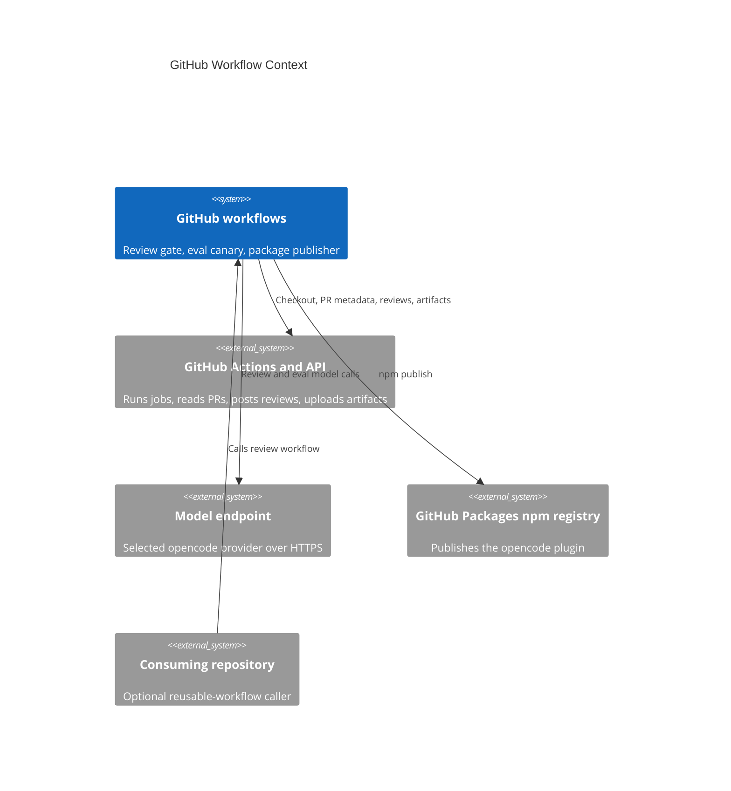

# GitHub Workflows

## TL;DR

GitHub Actions here are the product surface for the review gate, eval canary, and package publishing; edits must preserve cross-repo reuse, env-injected credentials, and script path coupling.

## Non-Negotiables

- Route review-gate script calls through `REVIEW_SKILL_DIR`. The literal `.agents/skills/ai-review-report` path is the copy-install rewrite anchor; reusable workflow mode must keep the `.smooth-ai-review-tools` side checkout path intact.
- Route analyse workflow calls through resolved skill dirs too: `REVIEW_SKILL_DIR` for shared opencode libs, `ANALYSE_SKILL_DIR` for `ai-analyse/SKILL.md`, and `AI_REVIEW_DIR` for `copilot-review.sh summary`.
- `pipeline-ai-analyse.yml` is name-coupled to `pipeline-code-review-report.yml`: `workflow_run.workflows` must equal the gate's `name: OpenCode Review Report`. A gate rename requires an analyse workflow edit and an actionlint pass in the same commit.
- Do not add `workflow_call` as a runtime `github.event_name` branch. In called workflows, the `github` context is the caller event context, so PR-triggered callers still see `pull_request`.
- Keep `model_preset` changes atomic across provider selection, provider-id selection, all three model-tier expressions, and the reusable caller template.
- API keys stay GitHub Secrets; provider selector, model ids, and configurable gateway URLs stay GitHub Variables. OpenCode Go and OpenRouter use fixed public base URLs and only expose API keys.
- The eval harness makes real paid model calls. Keep it off `pull_request`; only manual dispatch and the path-filtered post-merge canary should run it.
- The npm publish workflow must not gain a `paths:` filter. Non-tag publishes depend on `GITHUB_RUN_NUMBER`; semver tag publishes must keep checked-in package metadata unchanged.

## System Context

These workflows operate at the boundary between GitHub Actions, GitHub APIs, the selected model endpoint, and GitHub Packages. The review gate may run in this repo or as a reusable workflow in a consuming repo; in reusable mode it checks out this repo's tooling beside the caller checkout and still reviews the caller workspace. The eval harness reuses the same provider and opencode transport as the review gate, but scores a fixed corpus rather than the triggering PR. The package publish workflow ships the opencode plugin to GitHub Packages with the run-scoped `GITHUB_TOKEN`.

## Key Behaviors

- `pipeline-code-review-report.yml` has four entry paths: automatic PR review, `/ai-review` issue comments, manual dispatch, and reusable `workflow_call`. Manual/comment paths fetch PR metadata first because the event payload is not a PR payload.
- `pipeline-ai-analyse.yml` runs after the gate via `workflow_run`. Its guard skips fork PRs, skips `[ai-analyse]` loop commits, acts only when the latest gate-authored review has medium/low findings, and caps autonomous incremental cycles with `OPENCODE_ANALYSE_MAX_INCREMENTAL` (default `3`).
- Review script resolution is two-mode: use the in-repo skill when present; otherwise fetch `generic-automation-and-it/smooth-ai-report-review` at `inputs.tools_ref || github.workflow_sha || 'main'`.
- `MANDATORY_CONTEXT_FILES` and `AGENTS_MD_EXEMPT_PATHS` resolve against the repository being reviewed, not necessarily this repository.
- Full reviews may approve or request changes; incremental reviews must only comment. Missing aggregate output or missing `review_action` fails closed instead of approving.
- The eval harness defaults secondary and orchestrator models to blank so non-Gemini dispatches do not inherit Gemini literals; `run-evals.sh` maps blanks to the primary model.
- npm package and Claude plugin versions are lockstep. Non-tag publishes patch both manifests at runtime to `major.minor.${GITHUB_RUN_NUMBER}`; semver tag publishes require the tag, `package.json`, and `.claude-plugin/plugin.json` to match.

## Changelog

| Date | Change | Ref |
|------|--------|-----|
| 2026-06-30 | Added minimal workflow context for AI coding agents. | local |
| 2026-06-30 | Added autonomous `pipeline-ai-analyse.yml` workflow context and name-coupling guidance. | ai-analyse |
