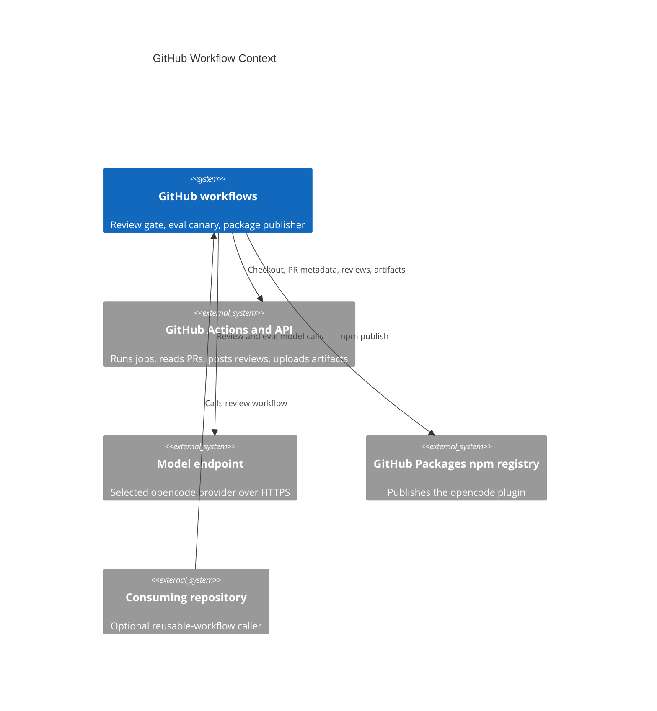

# GitHub Workflows

## TL;DR

GitHub Actions here are the product surface for the review gate, eval canary, and package publishing; edits must preserve cross-repo reuse, env-injected credentials, and script path coupling.

## Non-Negotiables

- Route review-gate script calls through `REVIEW_SKILL_DIR`. The literal `.agents/skills/ai-review-report` path is the copy-install rewrite anchor; reusable workflow mode must keep the `.smooth-ai-review-tools` side checkout path intact.
- Route analyse workflow calls through resolved skill dirs too: `REVIEW_SKILL_DIR` for shared opencode libs, `ANALYSE_SKILL_DIR` for `ai-analyse/SKILL.md`, and `AI_REVIEW_DIR` for `copilot-review.sh summary`.
- `pipeline-ai-analyse.yml` is name-coupled to `pipeline-code-review-report.yml`: `workflow_run.workflows` must equal the gate's `name: OpenCode Review Report`. A gate rename requires an analyse workflow edit and an actionlint pass in the same commit.
- Do not add `workflow_call` as a runtime `github.event_name` branch. In called workflows, the `github` context is the caller event context, so PR-triggered callers still see `pull_request`.
- Keep `model_preset` changes atomic across provider selection, provider-id selection, all three model-tier expressions, and the reusable caller template.
- API keys stay GitHub Secrets; provider selector, model ids, configurable gateway URLs, and review-gate behavior toggles stay GitHub Variables. `OPENCODE_ANALYSE_PROVIDER` is required only when `OPENCODE_ANALYSE_MODEL` is set; otherwise analyse inherits the review provider/model. OpenCode Go and OpenRouter use fixed public base URLs and only expose API keys.
- The eval harness makes real paid model calls. Keep it off `pull_request`; only manual dispatch and the path-filtered post-merge canary should run it.
- The npm publish workflow must not gain a `paths:` filter. Non-tag publishes depend on `GITHUB_RUN_NUMBER`; semver tag publishes must keep checked-in package metadata unchanged.

## System Context

These workflows operate at the boundary between GitHub Actions, GitHub APIs, the selected model endpoint, and GitHub Packages. The review gate may run in this repo or as a reusable workflow in a consuming repo; in reusable mode it checks out this repo's tooling beside the caller checkout and still reviews the caller workspace. The eval harness reuses the same provider and opencode transport as the review gate, but scores a fixed corpus rather than the triggering PR. The package publish workflow ships the opencode plugin to GitHub Packages with the run-scoped `GITHUB_TOKEN`.

```mermaid
C4Context
    title GitHub Workflow Context
    System(workflows, "GitHub workflows", "Review gate, eval canary, package publisher")
    System_Ext(github, "GitHub Actions and API", "Runs jobs, reads PRs, posts reviews, uploads artifacts")
    System_Ext(model, "Model endpoint", "Selected opencode provider over HTTPS")
    System_Ext(packages, "GitHub Packages npm registry", "Publishes the opencode plugin")
    System_Ext(caller, "Consuming repository", "Optional reusable-workflow caller")

    Rel(caller, workflows, "Calls review workflow")
    Rel(workflows, github, "Checkout, PR metadata, reviews, artifacts")
    Rel(workflows, model, "Review and eval model calls")
    Rel(workflows, packages, "npm publish")
```

## Key Behaviors

- `pipeline-code-review-report.yml` has four entry paths: automatic PR review, `/ai-review` issue comments, manual dispatch, and reusable `workflow_call`. Manual/comment paths fetch PR metadata first because the event payload is not a PR payload. The job body is a thin wrapper around `.agents/skills/ai-review-report/scripts/run-review.sh` — the same entrypoint the local-job packaging (`.docs/examples/code-review-local.yml`) invokes. The wrapper sets the env-var contract and resolves the script path (in-repo skill tree vs. `.smooth-ai-review-tools/` side checkout); all review logic — event parsing, provider resolution, opencode install + health, model-chain probes, diff generation, AGENTS.md validation, chunked review, aggregation, post — lives in `run-review.sh` and is shared verbatim with the local-job packaging.
- `pipeline-ai-analyse.yml` has two entry paths: automatic (`workflow_run` after the gate, only when that run's `conclusion == 'success'`) and manual (`workflow_dispatch` with a required `pr_number` and optional `max_incremental` override). Both go through the same guard, which derives the PR (dispatch input → `workflow_run` payload → head-SHA/branch lookup → triggering gate logs for `/ai-review` comment runs whose payload points at the repo's default branch), skips fork PRs, acts only when the latest gate-authored review has medium/low findings, and bounds the autonomous loop with `OPENCODE_ANALYSE_MAX_INCREMENTAL` (default `3`) consecutive incremental cycles since the last full review — there is no head-commit sentinel; a no-edit cycle ends the loop early. The log fallback requires `actions: read` and only parses known gate steps that print `PR_NUMBER`, `pr_number`, or `gh pr review <number>`. On the automatic path, the guard also verifies that the latest gate-authored review was posted **during** the triggering workflow run; if the run completed without producing a fresh review (e.g. "Skipping incremental review" because a blocking review exists, no changes, too many files, or all models failed), the latest review predates the run and ai-analyse skips instead of re-processing stale findings. The analyse job checks out the PR head for diff/context and resolves executable scripts the same way the gate does: same-repo PRs use the in-checkout skill tree when present, and fork PRs or callers without a local skill tree fetch pinned `.smooth-ai-review-tools`; no script is run from the PR-checkout path. If `OPENCODE_ANALYSE_MODEL` is configured, the workflow resolves `OPENCODE_ANALYSE_PROVIDER` separately and passes a provider-qualified analyse primary target while keeping review-provider fallbacks. Its deterministic push step is hardened:
  - Ignores workflow scratch/tooling paths (`ci_temp`, `.context`, `.smooth-ai-review-tools`) and commits only real repo edits.
  - Rebases onto `origin/<head_ref>` before pushing so branch advances do not cause a non-fast-forward failure; on rebase or fetch failure sets `skip_reason=rebase-conflict-or-fetch-failure` and skips the push instead of attempting a non-fast-forward update.
  - Floors analyse output at `OPENCODE_MIN_OUTPUT_BYTES=50` bytes (analyse output is a FIX/SKIP table, not a chunk review, so the gate's chunk-review floor does not apply).
  - Prefers the optional `OPENCODE_ANALYSE_GH_TOKEN` Secret, falls back to `GITHUB_TOKEN` for ordinary paths when that PAT is absent or rejected.
  - Emits `push_skipped=workflow-paths-require-pat-with-workflow-scope` when generated fixes touch `.github/workflows/**` without a working workflow-scoped PAT.
  - **Test in the loop (LADR-045):** before staging, runs `${ANALYSE_SKILL_DIR}/scripts/lib/filter-test-self-fix.sh`, which reverts any test / test-framework edit the model made unless the `OPENCODE_ANALYSE_ALLOW_TEST_SELF_FIX` Variable is truthy. Enforcement is deterministic in the workflow because the `analyse` agent is untrusted; the prompt also carries a soft off-limits instruction and the PR summary lists reverted paths.
- Review script resolution is two-mode: use the in-repo skill when present; otherwise fetch `generic-automation-and-it/smooth-ai-report-review` at `vars.SMOOTH_AI_REVIEW_TOOLS_REF || inputs.tools_ref || github.workflow_sha || 'v1'`.
- `MANDATORY_CONTEXT_FILES` and `AGENTS_MD_EXEMPT_PATHS` resolve against the repository being reviewed, not necessarily this repository.
- `OPENCODE_REVIEW_REPORT_DISABLE_AGENTS_MD_CHECK` is a default-off global bypass for the full-review documentation validation gate; prefer `AGENTS_MD_EXEMPT_PATHS` for path-scoped exceptions.
- `OPENCODE_REVIEW_REPORT_BYPASS_MANDATORY_CONTEXT_FILE` is a default-empty bypass that skips both the mandatory context file loading (`MANDATORY_CONTEXT_FILES` injection) and the AGENTS.md validation gate. The workflow input `bypass_mandatory_context_file` overrides the Variable when non-empty; the Variable is used when the input is null/empty. Accepts `1`/`true`/`yes`/`on` (case-insensitive) as truthy.
- Full reviews may approve or request changes; incremental reviews must only comment. Missing aggregate output or missing `review_action` fails closed instead of approving.
- `OPENCODE_DISABLE_CLAUDE_CODE` and `OPENCODE_REVIEW_REPORT_DISABLE_CLAUDE_CODE` are always set from the same expression and must stay in sync. The `disable_claude_code` workflow inputs are: dispatch — `type: choice`, default `'1'`, options `'1'`/`'0'` (always wins, so the Variable is unreachable on dispatch); call — `type: string`, default `''`, so a blank value falls through to the `OPENCODE_REVIEW_REPORT_DISABLE_CLAUDE_CODE` GitHub Variable, and both ultimately fall back to `'1'`. Do not set them independently.
- The `Run review gate` step must forward `GITHUB_TOKEN: ${{ secrets.GITHUB_TOKEN }}` in its `env:` block. Bare `run:` shells do not auto-inject GITHUB_TOKEN from the runner env; without the forward, the entrypoint's preflight `❌ GITHUB_TOKEN is not set` fires before any review logic runs (this was the failure observed on PR #86's CI run, not in production). The reusable workflow and the local-job caller (`.docs/examples/code-review-local.yml`) both set the forward — extend them together if a new caller packaging is added.
- `build-code-graph.sh` is the single install source of truth for `code-review-graph`. Every workflow and consumer-facing example that builds the code knowledge graph must delegate to `.agents/skills/ai-review-report/scripts/lib/build-code-graph.sh` — no inline `pip install code-review-graph` in any workflow YAML or example file. Mirrors the LADR-048 pattern for opencode. The script handles version pinning (`OPENCODE_REVIEW_REPORT_GRAPH_VERSION`), PEP 668-safe install via a dedicated `${HOME}/.crg-venv` venv, PATH repair (including `$GITHUB_PATH` propagation), and graph build/update. The companion `detect-changes-graph.sh` runs the analysis and produces the risk-scored output files. The gate's `actions/cache` step persists the graph DB between runs; the cache-step `if:` and the entrypoint's `case` MUST share the same truthy set (`1`/`true`/`yes`/`on`, case-insensitive) so a Variable value of `true`/`yes`/`on` doesn't silently skip the cache warm-up.
- `run-review.sh`'s post-install block must explicitly export `PATH="$HOME/.opencode/bin:$PATH"` after the opencode installer runs. The installer appends to `$GITHUB_PATH` (a GitHub Actions special: it appends to PATH of SUBSEQUENT steps, not the current shell), so `command -v opencode` in the same step would otherwise fail with `❌ opencode is not on PATH after install.` The post-install update also appends to `$GITHUB_PATH` for any later step that needs `opencode` on its PATH. (The installer also adds the binary to `$HOME/.bashrc`, but `bash` does not re-source `.bashrc` in the same process — the explicit `export PATH` is the actual fix, the `.bashrc` side-effect is documentation-noise only.)
- The eval harness defaults secondary and orchestrator models to blank so non-Gemini dispatches do not inherit Gemini literals; `run-evals.sh` maps blanks to the primary model.
- npm package and Claude plugin versions are lockstep. Non-tag publishes patch both manifests at runtime to `major.minor.${GITHUB_RUN_NUMBER}`; semver tag publishes require the tag, `package.json`, and `.claude-plugin/plugin.json` to match.

## Changelog

| Date | Change | Ref |
|------|--------|-----|
| 2026-07-31 | Opt-in code graph analysis (LADR-049, Phase 1). `pipeline-code-review-report.yml` and `.docs/examples/code-review-local.yml` each gain a `Cache code knowledge graph` step before `Run review gate`. Both gate the cache on `vars.OPENCODE_REVIEW_REPORT_ENABLE_GRAPH_ANALYSIS` with the same `1/true/yes/on` (case-insensitive) truthy set the entrypoint accepts (`contains('1 true yes on', (vars.X || '0') | lower)`) so a Variable value of `true`/`yes`/`on` doesn't silently skip the cache warm-up. Cache key now also includes source-tree hashes (the rebuild logic's correctness pivot is the source tree, not just lockfiles) plus a schema-versioned `-v1` suffix. `run-review.sh` Step 13.5 calls the new `scripts/lib/build-code-graph.sh` + `scripts/lib/detect-changes-graph.sh` shared libs (mirrors LADR-048's single-source-of-truth pattern — no inline `pip install code-review-graph`); graph DB persists via `actions/cache`, and any lib failure degrades gracefully. The new `build-code-graph.sh` is the single install source of truth for `code-review-graph`; it now uses a dedicated `${HOME}/.crg-venv` venv (PEP 668 safe on `ubuntu-latest` 24.04+), relaxed the version regex to ≥ 1 segment, and added a one-line CWD-dependence comment. | LADR-049 |
| 2026-07-30 | `pipeline-code-review-report.yml` job body refactored to a thin wrapper (Checkout PR head → Fetch review tooling → `run-review.sh`). The 32 inline workflow steps (28 `run:` blocks and 4 `uses:` invocations) are now collapsed to 5 steps; the gate logic lives in `.agents/skills/ai-review-report/scripts/run-review.sh`, driven entirely by env vars and `$GITHUB_EVENT_PATH` (no `inputs.*` / `steps.*.outputs` / expression interpolation), so the same code drives the new local-job packaging (`.docs/examples/code-review-local.yml`) for consumers under `allowed_actions: "selected"`. The `Run review gate` step now forwards `GITHUB_TOKEN: ${{ secrets.GITHUB_TOKEN }}` in its `env:` block (regression fix from PR #86's CI run, where the preflight fired because bare `run:` shells do not auto-inject GITHUB_TOKEN). | — |
| 2026-07-24 | `pipeline-ai-analyse.yml` no longer edits tests or the test framework by default: the Commit step reverts such edits via `ai-analyse/scripts/lib/filter-test-self-fix.sh` unless the new `OPENCODE_ANALYSE_ALLOW_TEST_SELF_FIX` Variable is truthy; the prompt and PR summary reflect the setting. | LADR-045 |
| 2026-07-05 | `pipeline-ai-analyse.yml` now downgrades workflow-path auto-fixes to `push_skipped` when no working workflow-scoped PAT is available, instead of retrying a `GITHUB_TOKEN` push GitHub will reject for `.github/workflows/**`. | local |
| 2026-07-05 | Hardened `pipeline-ai-analyse.yml` auto-fix commits: ignore scratch/tooling paths, require non-trivial analyse output, and rebase auto-fix commits onto the branch tip before pushing. | local |
| 2026-07-31 | Added `bypass_mandatory_context_file` input and `OPENCODE_REVIEW_REPORT_BYPASS_MANDATORY_CONTEXT_FILE` Variable. When truthy (`1`/`true`/`yes`/`on`), bypasses both AGENTS.md validation checks and mandatory context file loading. The workflow input overrides the Variable when non-empty; the Variable is used when the input is null/empty. Default: empty (no bypass). | local |
| 2026-07-05 | Aligned `disable_claude_code` input defaults: dispatch stays `choice` with default `'1'` (always wins, Variable unreachable on dispatch); the reusable call input is now `string` with default `''` so a blank value falls through to the `OPENCODE_REVIEW_REPORT_DISABLE_CLAUDE_CODE` Variable. **Behaviour change for reusable callers** that have set `OPENCODE_REVIEW_REPORT_DISABLE_CLAUDE_CODE=0` and previously omitted the input: Claude Code is now re-enabled by default for that run. | local |
| 2026-07-05 | `pipeline-ai-analyse.yml` now grants `actions: read` and recovers the PR number from known triggering gate-run log lines when `/ai-review` comment runs produce a `workflow_run` payload with no PR metadata. | local |
| 2026-07-05 | Removed unused `latest_review_id` guard job output (declaration, variable assignment, and `$GITHUB_OUTPUT` write) — no downstream job ever consumed it. | local |
| 2026-07-05 | Added `OPENCODE_ANALYSE_PROVIDER` wiring for custom analyse models; `pipeline-ai-analyse.yml` now resolves analyse and review providers separately and passes provider-qualified model targets. | ai-analyse |
| 2026-07-05 | `pipeline-ai-analyse.yml` guard now skips when the triggering gate run did not post a fresh review (blocking skip, no changes, too many files, all models failed), preventing stale findings from being re-processed as all-SKIP auto-fix runs. | local |
| 2026-07-04 | `pipeline-ai-analyse.yml` now prefers the optional `OPENCODE_ANALYSE_GH_TOKEN` Secret for its auto-fix push and falls back to `GITHUB_TOKEN` only when that PAT is unset. | local |
| 2026-07-03 | Added a `workflow_dispatch` manual entry path to `pipeline-ai-analyse.yml` (`pr_number` required, `max_incremental` optional); guard derives the PR from the input and the job `if:`/concurrency handle the dispatch event. | local |
| 2026-07-03 | Added `disable_agents_md_check` input and `OPENCODE_REVIEW_REPORT_DISABLE_AGENTS_MD_CHECK` Variable for opt-out AGENTS.md documentation validation. | local |
| 2026-06-30 | Added minimal workflow context for AI coding agents. | local |
| 2026-06-30 | Added autonomous `pipeline-ai-analyse.yml` workflow context and name-coupling guidance. | ai-analyse |
| 2026-06-30 | Added `disable_claude_code` input (default `'1'`); both `OPENCODE_DISABLE_CLAUDE_CODE` and `OPENCODE_REVIEW_REPORT_DISABLE_CLAUDE_CODE` now derive from the same expression. | PR #54 |
