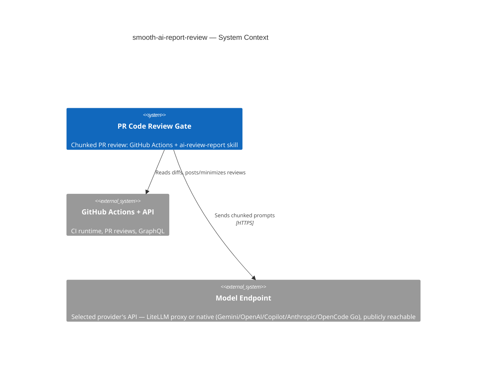

# smooth-ai-report-review

## TL;DR

Standalone (polyrepo) home for the automated PR code-review pipeline: a GitHub Actions gate (`.github/workflows/pipeline-code-review-report.yml`) that reviews PRs in chunks via opencode/Gemini, driven by the `ai-review-report` skill — plus the `ai-review` skill that applies a posted review's fix/skip decisions.

## Non-Negotiables

- **Workflow ↔ script paths are coupled.** Every script invocation in the gate goes through `$REVIEW_SKILL_DIR`, resolved by the "Locate review skill scripts" step: the literal `.agents/skills/ai-review-report` when the skill is present in the checkout (in-repo / copy-install — that literal is also the README installer's rewrite anchor), else a `.smooth-ai-review-tools/` side checkout of this repo (reusable-workflow mode, ref-locked via `github.workflow_sha` / `tools_ref`). Moving or renaming a script, or the skill folder, silently breaks the gate in all three modes. Change the workflow YAML and the scripts in the same commit.
- **The gate runs on `ubuntu-latest`.** opencode is provider-agnostic transport — it reaches the models over HTTPS at whatever endpoint the selected provider is configured with (`OPENCODE_REVIEW_REPORT_<PROVIDER>_URL`): a LiteLLM proxy, or the provider's native API (Google Gemini, OpenAI, Copilot, Anthropic). That endpoint **must be reachable from GitHub-hosted runners** — i.e. publicly routable, not VPN-only. If a private-network endpoint is ever used, switch the runner back to `self-hosted`.
- **Credentials are env-injected, never committed.** `.agents/skills/ai-review-report/assets/opencode.json` holds `{env:OPENCODE_<PROVIDER>_*}` placeholders only. Each provider's **API key** is a GitHub **Secret**; each gateway **URL**, the `OPENCODE_REVIEW_REPORT_PROVIDER` selector, and the `OPENCODE_REVIEW_REPORT_MODEL_*` ids are GitHub **Variables** (non-sensitive, retunable). Never store an API key as a Variable or hardcode any URL/key — the only exceptions are the three fixed public bases hardcoded in `opencode.json`: OpenCode Go's `https://opencode.ai/zen/go/v1` (LADR-027), OpenRouter's `https://openrouter.ai/api/v1` (LADR-039), and Anthropic's `https://api.anthropic.com` (LADR-040). All three are single SaaS endpoints with no per-deployment URL to retune, and their API keys remain env-injected Secrets.

## System Context

This repo's deliverable is the review gate itself, not application code. The gate sends chunked PR diffs to the selected provider's models (GEMINI / COPILOT / OPENAI / ANTHROPIC / OPENCODE-GO-OPENAI / OPENCODE-GO-ANTHROPIC / OPEN_ROUTER, via `OPENCODE_REVIEW_REPORT_PROVIDER`) through a gateway and posts structured reviews back to GitHub. Pipeline internals (provider selection, chunking, the two-tier model chain, orchestrator model, false-positive rules, LADR-001…040) live in `.agents/skills/ai-review-report/SKILL.md` — that file is the source of truth; do not restate it here.

## Key Behaviors

- **Two skills, opposite directions.** `ai-review-report` *generates* the review (CI gate, or locally via `scripts/local-review.sh`). `ai-review` (invoked `/ai-review`) *consumes* a posted review and applies fix/skip decisions back to the PR. Don't conflate them or merge their scripts.
- **Everything lives under `.agents/`, never `.ai/`.** This repo standardizes on `.agents/` for skills, rules, and context (the skill's origin used `.ai/`; all internal references, the workflow, and `MANDATORY_CONTEXT_FILES` were rewritten). Any new path reference — including ones aimed at a consuming repo — must use the `.agents/` prefix.
- **Most `MANDATORY_CONTEXT_FILES` resolve against the repo being reviewed, not this one.** The workflow lists context paths (`.agents/rules-scoped/…`, `.agents/skills/code-review-standards/…`, `.docs/nfr/…`) that exist in a consuming product repo, not here. They warn-and-skip when absent; do not "fix" them by deleting or repointing — they are intentional for cross-repo reuse.
- **The root `AGENTS.md` is loaded only via `MANDATORY_CONTEXT_FILES`.** `find-context-files.sh`'s per-chunk walk stops one level *above* nothing — its loop terminates before reaching `.`, so it never discovers a repo-root file. This root doc is loaded only because it is listed in the workflow's `MANDATORY_CONTEXT_FILES`. Keep that entry if this repo's own PRs should be reviewed with this context.
- **Four distribution channels, one source of truth.** Consumers get the gate via the README copy-installer or via `workflow_call` (`uses: …/pipeline-code-review-report.yml@v1` — scripts fetched into `.smooth-ai-review-tools/` at run time), and get the skills via the Claude Code plugin `smooth-ai-review` (`.claude-plugin/` manifests; skills loaded straight from `.agents/skills/` via the plugin manifest's `skills` field — no root symlink) or via the npm opencode plugin `@generic-automation-and-it/smooth-ai-review` (root `package.json` + `opencode-plugin.js`: links the skills minus `scripts/eval/` into the consumer's `.agents/skills/` at opencode startup, never overwrites real directories, excludes via `.git/info/exclude`). The package lives on the **GitHub Packages npm registry** (`publishConfig` + root `.npmrc`; `npm-publish.yml` authenticates with the run-scoped `GITHUB_TOKEN` — no npm.com org or `NPM_TOKEN`), which means consumers need a one-time `read:packages` PAT in their user `~/.npmrc` even though the package is public; after the first publish, flip the package visibility to public in the org Packages settings. Neither plugin installs the CI gate. Versions are lockstep: `package.json` == `.claude-plugin/plugin.json`; semver tag releases additionally require the `vX.Y.Z` tag to match. `npm-publish.yml` runs on every push to `main`, manual dispatch, and matching semver tags (no `paths` filter); non-tag runs patch the runtime package/plugin version to `major.minor.${GITHUB_RUN_NUMBER}` so each publish is immutable and unique, while semver tags publish the exact checked-in/tagged version. The caller template `.docs/examples/code-review-caller.yml` duplicates the `model_preset` dropdown — extend it together with the workflow's preset mapping.
- **`.agents/skills/ai-review-report/assets/` is runtime config, `.agents/skills/ai-review-report/references/` is edit-time docs.** `assets/` holds `opencode.json` and `review-config.json` (the latter loaded by `filter-excluded-files.sh`). `references/` holds `CHANGELOG.md` and the AGENTS.md quality standards — read only when editing the skill, not during a review. (Both live under the skill folder, not the repo root.)

## Changelog

Full dated audit trail: `.agents/skills/ai-review-report/references/CHANGELOG.md`. LADR narratives live in `.agents/skills/ai-review-report/AGENTS.md` — do not re-inline them here.
