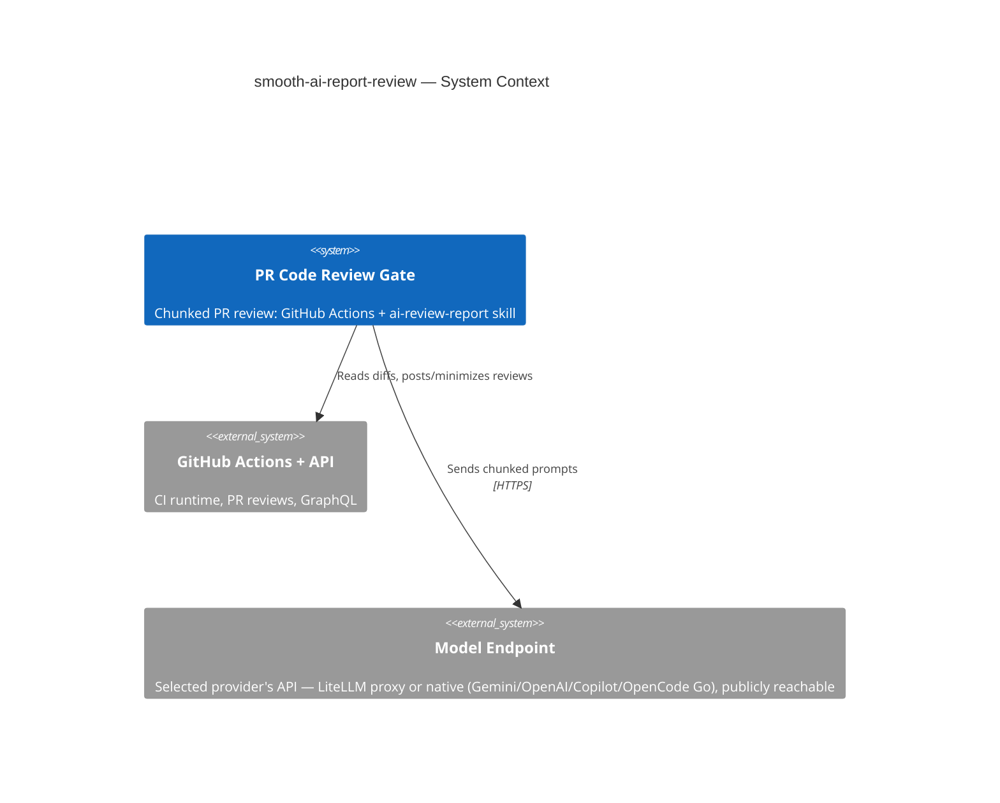

# smooth-ai-report-review

## TL;DR

Standalone (polyrepo) home for the automated PR code-review pipeline: a GitHub Actions gate (`.github/workflows/pipline-code-review-report.yml`) that reviews PRs in chunks via opencode/Gemini, driven by the `ai-review-report` skill — plus the `ai-review` skill that applies a posted review's fix/skip decisions.

## Non-Negotiables

- **Workflow ↔ script paths are coupled.** The gate invokes skill scripts by hardcoded path (`.agents/skills/ai-review-report/scripts/…`). Moving or renaming a script, or the skill folder, silently breaks the gate. Change the workflow YAML and the scripts in the same commit.
- **The gate runs on `ubuntu-latest`.** opencode is provider-agnostic transport — it reaches the models over HTTPS at whatever endpoint the selected provider is configured with (`OPENCODE_<PROVIDER>_URL`): a LiteLLM proxy, or the provider's native API (Google Gemini, OpenAI, Copilot). That endpoint **must be reachable from GitHub-hosted runners** — i.e. publicly routable, not VPN-only. If a private-network endpoint is ever used, switch the runner back to `self-hosted`.
- **Credentials are env-injected, never committed.** `.agents/skills/ai-review-report/assets/opencode.json` holds `{env:OPENCODE_<PROVIDER>_*}` placeholders only. Each provider's **API key** is a GitHub **Secret**; each gateway **URL**, the `OPENCODE_PROVIDER` selector, and the `OPENCODE_MODEL_*` ids are GitHub **Variables** (non-sensitive, retunable). Never store an API key as a Variable or hardcode any URL/key — the sole exception is OpenCode Go's fixed public base `https://opencode.ai/zen/go/v1`, hardcoded in `opencode.json` (LADR-027): it has no per-deployment URL to retune, and its API keys remain env-injected Secrets.

## System Context

This repo's deliverable is the review gate itself, not application code. The gate sends chunked PR diffs to the selected provider's models (GEMINI / COPILOT / OPENAI / OPENCODE-GO-OPENAI / OPENCODE-GO-ANTHROPIC, via `OPENCODE_PROVIDER`) through a gateway and posts structured reviews back to GitHub. Pipeline internals (provider selection, chunking, the two-tier model chain, orchestrator model, false-positive rules, LADR-001…029) live in `.agents/skills/ai-review-report/SKILL.md` — that file is the source of truth; do not restate it here.

## Key Behaviors

- **Two skills, opposite directions.** `ai-review-report` *generates* the review (CI gate, or locally via `scripts/local-review.sh`). `ai-review` (invoked `/ai-review`) *consumes* a posted review and applies fix/skip decisions back to the PR. Don't conflate them or merge their scripts.
- **Everything lives under `.agents/`, never `.ai/`.** This repo standardizes on `.agents/` for skills, rules, and context (the skill's origin used `.ai/`; all internal references, the workflow, and `MANDATORY_CONTEXT_FILES` were rewritten). Any new path reference — including ones aimed at a consuming repo — must use the `.agents/` prefix.
- **Most `MANDATORY_CONTEXT_FILES` resolve against the repo being reviewed, not this one.** The workflow lists context paths (`.agents/rules-scoped/…`, `.agents/skills/code-review-standards/…`, `.docs/nfr/…`) that exist in a consuming product repo, not here. They warn-and-skip when absent; do not "fix" them by deleting or repointing — they are intentional for cross-repo reuse.
- **The root `AGENTS.md` is loaded only via `MANDATORY_CONTEXT_FILES`.** `find-context-files.sh`'s per-chunk walk stops one level *above* nothing — its loop terminates before reaching `.`, so it never discovers a repo-root file. This root doc is loaded only because it is listed in the workflow's `MANDATORY_CONTEXT_FILES`. Keep that entry if this repo's own PRs should be reviewed with this context.
- **`.agents/skills/ai-review-report/assets/` is runtime config, `.agents/skills/ai-review-report/references/` is edit-time docs.** `assets/` holds `opencode.json` and `review-config.json` (the latter loaded by `filter-excluded-files.sh`). `references/` holds `CHANGELOG.md` and the AGENTS.md quality standards — read only when editing the skill, not during a review. (Both live under the skill folder, not the repo root.)

## Changelog

| Date | Change | Ref |
|:-----|:-------|:----|
| 2026-06-01 | Seeded repo with the `ai-review-report` + `ai-review` skills and the `pipline-code-review-report` gate; replaced the SKILL.md symlink with a real root AGENTS.md authored to the quality standards. | — |
| 2026-06-06 | Replaced per-provider gateway health probes with a single provider-agnostic check: `lib/opencode-health.sh` runs `opencode serve` and polls its `/global/health`. Removed `OPENCODE_GATEWAY_HEALTH_URL`, `OPENCODE_GATEWAY_AUTH_STYLE`, and the `OPENCODE_API_HEALTH_OVERRIDE` Variable; resolver no longer derives a health URL; workflow runs the check (non-blocking) after opencode install; `local-review.sh` runs it in place of the gateway preflight (LADR-028). | — |
| 2026-06-06 | Added OpenCode Go (OpenCode Zen) as **two** selectable providers split by SDK surface: `go-openai` (`@ai-sdk/openai-compatible`, selector `OPENCODE-GO-OPENAI`; deepseek-v4-flash, deepseek-v4-pro, glm-5.1) and `go-anthropic` (`@ai-sdk/anthropic`, selector `OPENCODE-GO-ANTHROPIC`; minimax-m2.7, qwen3.7-plus, qwen3.6-plus). Shared base `https://opencode.ai/zen/go/v1` hardcoded in `opencode.json` (fixed public Zen endpoint — no URL Variable); per-surface API-key Secrets `OPENCODE_GO_OPENAI_API_KEY` / `OPENCODE_GO_ANTHROPIC_API_KEY` only. Wired through `opencode.json`, `resolve-provider.sh`, the gate's env/provider-id/health probe, `setup-opencode-config.sh`, `local-review.sh`, README + SKILL.md (LADR-027). | — |
| 2026-06-07 | Chunk review now runs on a locked-down `review` opencode agent (`--agent review`, no pinned model so `--model` still wins) with skill/task/edit/write/bash disabled — stops the review model from self-activating this repo's own `ai-review-report` skill when the chunk under review is the gate's workflow/skill files (the `.github` chunk was returning 0 bytes → fail-closed REQUEST_CHANGES). Also made `opencode-with-fallback.sh` treat exit-0-but-empty (<200 bytes) output as failure so the fallback model is actually tried, and corrected the empty-chunk marker wording. Wired through `opencode.json` (new `agent` block), `opencode-with-fallback.sh`, `review-in-chunks.sh`, SKILL.md (LADR-029; supersedes the "no `--agent`" stance of LADR-023/025). | — |
