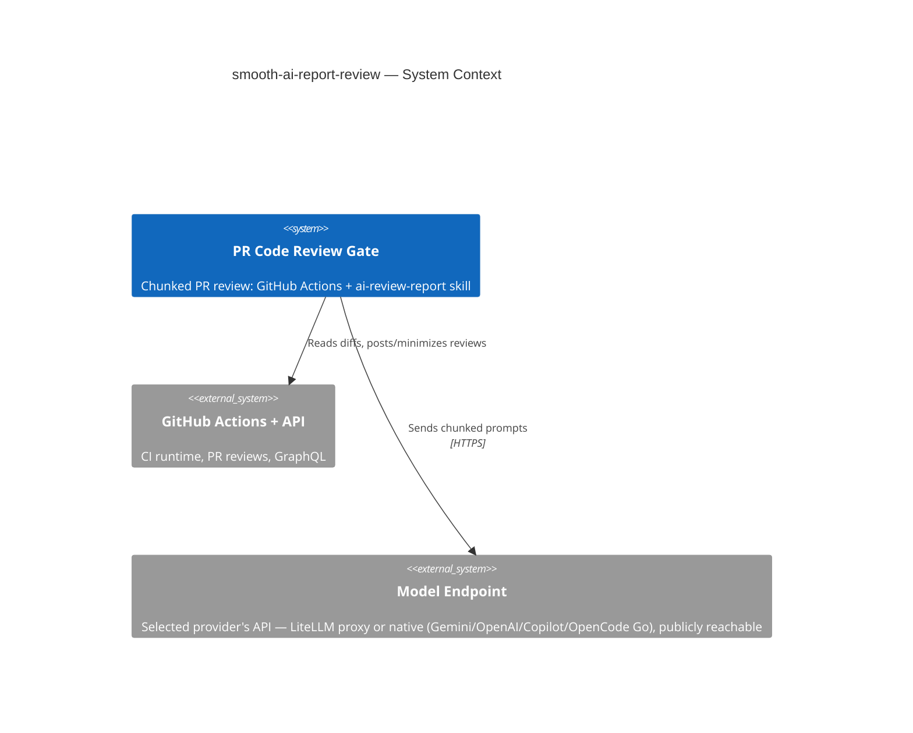

# smooth-ai-report-review

## TL;DR

Standalone (polyrepo) home for the automated PR code-review pipeline: a GitHub Actions gate (`.github/workflows/pipeline-code-review-report.yml`) that reviews PRs in chunks via opencode/Gemini, driven by the `ai-review-report` skill — plus the `ai-review` skill that applies a posted review's fix/skip decisions.

## Non-Negotiables

- **Workflow ↔ script paths are coupled.** Every script invocation in the gate goes through `$REVIEW_SKILL_DIR`, resolved by the "Locate review skill scripts" step: the literal `.agents/skills/ai-review-report` when the skill is present in the checkout (in-repo / copy-install — that literal is also the README installer's rewrite anchor), else a `.smooth-ai-review-tools/` side checkout of this repo (reusable-workflow mode, ref-locked via `github.workflow_sha` / `tools_ref`). Moving or renaming a script, or the skill folder, silently breaks the gate in all three modes. Change the workflow YAML and the scripts in the same commit.
- **The gate runs on `ubuntu-latest`.** opencode is provider-agnostic transport — it reaches the models over HTTPS at whatever endpoint the selected provider is configured with (`OPENCODE_REVIEW_REPORT_<PROVIDER>_URL`): a LiteLLM proxy, or the provider's native API (Google Gemini, OpenAI, Copilot). That endpoint **must be reachable from GitHub-hosted runners** — i.e. publicly routable, not VPN-only. If a private-network endpoint is ever used, switch the runner back to `self-hosted`.
- **Credentials are env-injected, never committed.** `.agents/skills/ai-review-report/assets/opencode.json` holds `{env:OPENCODE_<PROVIDER>_*}` placeholders only. Each provider's **API key** is a GitHub **Secret**; each gateway **URL**, the `OPENCODE_REVIEW_REPORT_PROVIDER` selector, and the `OPENCODE_REVIEW_REPORT_MODEL_*` ids are GitHub **Variables** (non-sensitive, retunable). Never store an API key as a Variable or hardcode any URL/key — the sole exception is OpenCode Go's fixed public base `https://opencode.ai/zen/go/v1`, hardcoded in `opencode.json` (LADR-027): it has no per-deployment URL to retune, and its API keys remain env-injected Secrets.

## System Context

This repo's deliverable is the review gate itself, not application code. The gate sends chunked PR diffs to the selected provider's models (GEMINI / COPILOT / OPENAI / OPENCODE-GO-OPENAI / OPENCODE-GO-ANTHROPIC, via `OPENCODE_REVIEW_REPORT_PROVIDER`) through a gateway and posts structured reviews back to GitHub. Pipeline internals (provider selection, chunking, the two-tier model chain, orchestrator model, false-positive rules, LADR-001…038) live in `.agents/skills/ai-review-report/SKILL.md` — that file is the source of truth; do not restate it here.

## Key Behaviors

- **Two skills, opposite directions.** `ai-review-report` *generates* the review (CI gate, or locally via `scripts/local-review.sh`). `ai-review` (invoked `/ai-review`) *consumes* a posted review and applies fix/skip decisions back to the PR. Don't conflate them or merge their scripts.
- **Everything lives under `.agents/`, never `.ai/`.** This repo standardizes on `.agents/` for skills, rules, and context (the skill's origin used `.ai/`; all internal references, the workflow, and `MANDATORY_CONTEXT_FILES` were rewritten). Any new path reference — including ones aimed at a consuming repo — must use the `.agents/` prefix.
- **Most `MANDATORY_CONTEXT_FILES` resolve against the repo being reviewed, not this one.** The workflow lists context paths (`.agents/rules-scoped/…`, `.agents/skills/code-review-standards/…`, `.docs/nfr/…`) that exist in a consuming product repo, not here. They warn-and-skip when absent; do not "fix" them by deleting or repointing — they are intentional for cross-repo reuse.
- **The root `AGENTS.md` is loaded only via `MANDATORY_CONTEXT_FILES`.** `find-context-files.sh`'s per-chunk walk stops one level *above* nothing — its loop terminates before reaching `.`, so it never discovers a repo-root file. This root doc is loaded only because it is listed in the workflow's `MANDATORY_CONTEXT_FILES`. Keep that entry if this repo's own PRs should be reviewed with this context.
- **Four distribution channels, one source of truth.** Consumers get the gate via the README copy-installer or via `workflow_call` (`uses: …/pipeline-code-review-report.yml@v1` — scripts fetched into `.smooth-ai-review-tools/` at run time), and get the skills via the Claude Code plugin `smooth-ai-review` (`.claude-plugin/` manifests; skills loaded straight from `.agents/skills/` via the plugin manifest's `skills` field — no root symlink) or via the npm opencode plugin `@generic-automation-and-it/smooth-ai-review` (root `package.json` + `opencode-plugin.js`: links the skills minus `scripts/eval/` into the consumer's `.agents/skills/` at opencode startup, never overwrites real directories, excludes via `.git/info/exclude`). The package lives on the **GitHub Packages npm registry** (`publishConfig` + root `.npmrc`; `npm-publish.yml` authenticates with the run-scoped `GITHUB_TOKEN` — no npm.com org or `NPM_TOKEN`), which means consumers need a one-time `read:packages` PAT in their user `~/.npmrc` even though the package is public; after the first publish, flip the package visibility to public in the org Packages settings. Neither plugin installs the CI gate. Versions are lockstep: `package.json` == `.claude-plugin/plugin.json`; semver tag releases additionally require the `vX.Y.Z` tag to match. `npm-publish.yml` runs on every push to `main`, manual dispatch, and matching semver tags (no `paths` filter); non-tag runs patch the runtime package/plugin version to `major.minor.${GITHUB_RUN_NUMBER}` so each publish is immutable and unique, while semver tags publish the exact checked-in/tagged version. The caller template `.docs/examples/code-review-caller.yml` duplicates the `model_preset` dropdown — extend it together with the workflow's preset mapping.
- **`.agents/skills/ai-review-report/assets/` is runtime config, `.agents/skills/ai-review-report/references/` is edit-time docs.** `assets/` holds `opencode.json` and `review-config.json` (the latter loaded by `filter-excluded-files.sh`). `references/` holds `CHANGELOG.md` and the AGENTS.md quality standards — read only when editing the skill, not during a review. (Both live under the skill folder, not the repo root.)

## Changelog

> One-line rows only. Full narratives (root causes, wiring lists, run/review provenance) live in `.agents/skills/ai-review-report/references/CHANGELOG.md` (dated audit trail) and the skill `AGENTS.md` LADRs — do not re-inline them here.

| Date | Change | Ref |
|:-----|:-------|:----|
| 2026-06-11 | Review gate hardened against platform-semantics hallucinations (PR #36 review 4473891333 — new FP class): two prompt edits in `review-in-chunks.sh` (platform-behavior claims must be verified via `webfetch` or tagged `[SPECULATIVE]`; new MANDATORY WORKFLOW step 4 listing the `workflow_call` context + glob-filter traps), new **DR-015** rule + must-not-flag fixture, LADR-015 narrative extended (claim-correctness in scope). | — |
| 2026-06-01 | Seeded repo with the `ai-review-report` + `ai-review` skills and the review gate; origin used `.ai/`, this repo standardizes on `.agents/`. | — |
| 2026-06-06 | Health check is provider-agnostic via `opencode serve` + `/global/health`; per-provider gateway probes and `OPENCODE_API_HEALTH_OVERRIDE` removed. | LADR-028 |
| 2026-06-06 | OpenCode Go added as **two** providers split by SDK surface (`go-openai`/`go-anthropic`); Zen base hardcoded (no URL Variable), keys stay Secrets. | LADR-027 |
| 2026-06-07 | Chunk-failure signal moved out-of-band to `chunk_<n>.failed` flag files — never grep review text (quoted markers false-matched on PR #15). | LADR-031 |
| 2026-06-07 | Holistic aggregation runs for every PR, incl. single-chunk (supersedes LADR-017's short-circuit). | LADR-030 |
| 2026-06-07 | Chunk review runs on the locked-down `review` agent (no pinned model, skill/task/edit/write denied) — stops skill self-activation; exit-0-but-empty output now advances the fallback chain. | LADR-029 |
| 2026-06-07 | Max-file-count gate + env prefix rename `OPENCODE_*` → `OPENCODE_REVIEW_REPORT_*`; API-key Secrets keep their names, repo/org GitHub Variables must be renamed to match. | LADR-032, #6 |
| 2026-06-07 | Opt-in LLM eval harness (`scripts/eval/`): precision vs DR-001…014 + recall vs seeded defects, driving the real `review-in-chunks.sh`; follow-up added the `EVAL_ARTIFACT_DIR` triage archive, DR-001/006 fixture hygiene, and the post-merge path-filtered canary. | LADR-033 |
| 2026-06-07 | `workflow_dispatch` `model_preset` dropdown — a preset wins over the `model` input and Variables; the options list and the five `env:` expressions are coupled (edit together). | — |
| 2026-06-08 | Installer targets one skills dir by priority (no per-agent symlinks); gate renamed `pipline-…` → `pipeline-code-review-report.yml` (DR-010 deleted) — installer migrates legacy-named installs and carries over `runs-on`. | — |
| 2026-06-09 | Per-provider gateway `baseURL` injected at install time from `OPENCODE_REVIEW_REPORT_
_URL`; committed `opencode.json` stays `baseURL`-free by design. | LADR-034 |
| 2026-06-09 | `review` agent `bash` denied (prompt-injection hardening); `OPENCODE_GATEWAY_API_KEY` no longer written to `$GITHUB_ENV`; `actions/cache` SHA-pinned. | LADR-029 |
| 2026-06-09 | SKILL.md trimmed to the runtime contract — LADR history, supersede chains, and FP provenance live only in the skill `AGENTS.md`. | — |
| 2026-06-10 | Hard chunk-prompt bounding (single-directory halving, 100KB per-file truncation, 200KB prompt diff budget) + coverage gaps never block at aggregation + visible fail-closed banner; new `test-chunk-prompt-budget.sh`. | LADR-035/036 |
| 2026-06-10 | Gate callable as a reusable workflow (`workflow_call` + `$REVIEW_SKILL_DIR` indirection + `.smooth-ai-review-tools/` fetch); caller template in `examples/`; installer perl gains the side-checkout guard. | LADR-037 |
| 2026-06-10 | Claude Code plugin `smooth-ai-review` (all three skills) — `.claude-plugin/` manifests + root `skills` symlink; repo doubles as its marketplace. | — |
| 2026-06-11 | README install runbook defaults to the new channels: Step 1 fetches the reusable-workflow caller, Step 2 enables the plugin at **project scope** (`.claude/settings.json` `extraKnownMarketplaces`/`enabledPlugins`); the copy-installer moved to a "Copy-install (vendor everything)" alternative, Steps 3–4 (provider config, repo settings) shared by both paths. | — |
| 2026-06-11 | npm opencode plugin `@generic-automation-and-it/smooth-ai-review` (root `package.json` + `opencode-plugin.js`) links skills into the consumer's `.agents/skills/` at startup; `npm-publish.yml` has a version-lockstep guard and publishes to GitHub Packages via `GITHUB_TOKEN` (consumers need a `read:packages` PAT). | LADR-038 |
| 2026-06-11 | Root `skills` symlink removed — the Claude Code plugin loads skills via `plugin.json` `"skills": ["./.agents/skills/"]`; plugin-mode script paths are `${CLAUDE_PLUGIN_ROOT}/.agents/skills/<skill>`. | — |
| 2026-06-11 | Posted review bodies fence-balanced (`lib/balance-fences.sh` + `test-balance-fences.sh`): model-nested code fences flipped GFM parity and swallowed the `
` section (PR #36 review 4474042824); every model-generated piece is balanced before assembly. | — |
| 2026-06-13 | `npm-publish.yml` publishes on every push to `main`, manual dispatch, and semver tags; non-tag runs patch the runtime version to `major.minor.${GITHUB_RUN_NUMBER}` so repeated `1.0.0` publishes become unique, while tags keep the exact semver. | LADR-038 |
