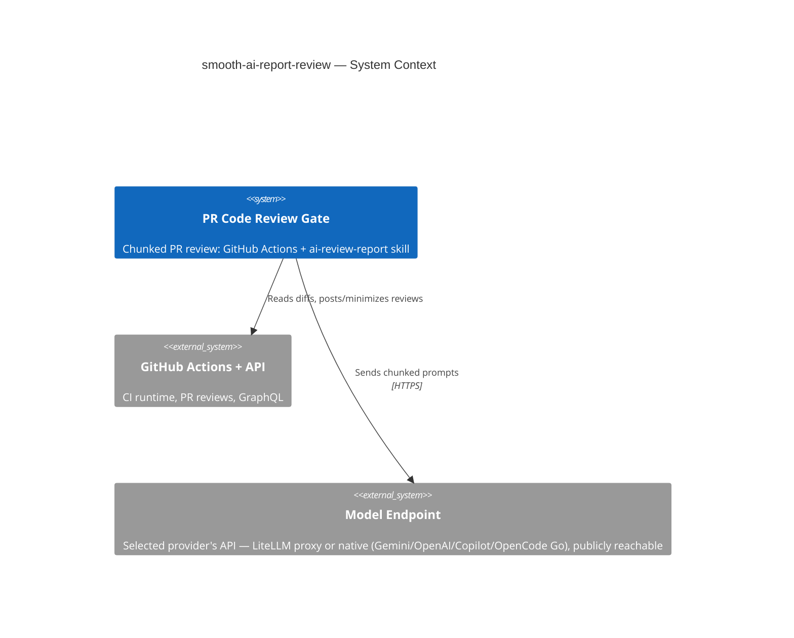

# smooth-ai-report-review

## TL;DR

Standalone (polyrepo) home for the automated PR code-review pipeline: a GitHub Actions gate (`.github/workflows/pipeline-code-review-report.yml`) that reviews PRs in chunks via opencode/Gemini, driven by the `ai-review-report` skill — plus the `ai-review` skill that applies a posted review's fix/skip decisions.

## Non-Negotiables

- **Workflow ↔ script paths are coupled.** The gate invokes skill scripts by hardcoded path (`.agents/skills/ai-review-report/scripts/…`). Moving or renaming a script, or the skill folder, silently breaks the gate. Change the workflow YAML and the scripts in the same commit.
- **The gate runs on `ubuntu-latest`.** opencode is provider-agnostic transport — it reaches the models over HTTPS at whatever endpoint the selected provider is configured with (`OPENCODE_REVIEW_REPORT_<PROVIDER>_URL`): a LiteLLM proxy, or the provider's native API (Google Gemini, OpenAI, Copilot). That endpoint **must be reachable from GitHub-hosted runners** — i.e. publicly routable, not VPN-only. If a private-network endpoint is ever used, switch the runner back to `self-hosted`.
- **Credentials are env-injected, never committed.** `.agents/skills/ai-review-report/assets/opencode.json` holds `{env:OPENCODE_<PROVIDER>_*}` placeholders only. Each provider's **API key** is a GitHub **Secret**; each gateway **URL**, the `OPENCODE_REVIEW_REPORT_PROVIDER` selector, and the `OPENCODE_REVIEW_REPORT_MODEL_*` ids are GitHub **Variables** (non-sensitive, retunable). Never store an API key as a Variable or hardcode any URL/key — the sole exception is OpenCode Go's fixed public base `https://opencode.ai/zen/go/v1`, hardcoded in `opencode.json` (LADR-027): it has no per-deployment URL to retune, and its API keys remain env-injected Secrets.

## System Context

This repo's deliverable is the review gate itself, not application code. The gate sends chunked PR diffs to the selected provider's models (GEMINI / COPILOT / OPENAI / OPENCODE-GO-OPENAI / OPENCODE-GO-ANTHROPIC, via `OPENCODE_REVIEW_REPORT_PROVIDER`) through a gateway and posts structured reviews back to GitHub. Pipeline internals (provider selection, chunking, the two-tier model chain, orchestrator model, false-positive rules, LADR-001…033) live in `.agents/skills/ai-review-report/SKILL.md` — that file is the source of truth; do not restate it here.

## Key Behaviors

- **Two skills, opposite directions.** `ai-review-report` *generates* the review (CI gate, or locally via `scripts/local-review.sh`). `ai-review` (invoked `/ai-review`) *consumes* a posted review and applies fix/skip decisions back to the PR. Don't conflate them or merge their scripts.
- **Everything lives under `.agents/`, never `.ai/`.** This repo standardizes on `.agents/` for skills, rules, and context (the skill's origin used `.ai/`; all internal references, the workflow, and `MANDATORY_CONTEXT_FILES` were rewritten). Any new path reference — including ones aimed at a consuming repo — must use the `.agents/` prefix.
- **Most `MANDATORY_CONTEXT_FILES` resolve against the repo being reviewed, not this one.** The workflow lists context paths (`.agents/rules-scoped/…`, `.agents/skills/code-review-standards/…`, `.docs/nfr/…`) that exist in a consuming product repo, not here. They warn-and-skip when absent; do not "fix" them by deleting or repointing — they are intentional for cross-repo reuse.
- **The root `AGENTS.md` is loaded only via `MANDATORY_CONTEXT_FILES`.** `find-context-files.sh`'s per-chunk walk stops one level *above* nothing — its loop terminates before reaching `.`, so it never discovers a repo-root file. This root doc is loaded only because it is listed in the workflow's `MANDATORY_CONTEXT_FILES`. Keep that entry if this repo's own PRs should be reviewed with this context.
- **`.agents/skills/ai-review-report/assets/` is runtime config, `.agents/skills/ai-review-report/references/` is edit-time docs.** `assets/` holds `opencode.json` and `review-config.json` (the latter loaded by `filter-excluded-files.sh`). `references/` holds `CHANGELOG.md` and the AGENTS.md quality standards — read only when editing the skill, not during a review. (Both live under the skill folder, not the repo root.)

## Changelog

| Date | Change | Ref |
|:-----|:-------|:----|
| 2026-06-01 | Seeded repo with the `ai-review-report` + `ai-review` skills and the `pipline-code-review-report` gate; replaced the SKILL.md symlink with a real root AGENTS.md authored to the quality standards. | — |
| 2026-06-06 | Replaced per-provider gateway health probes with a single provider-agnostic check: `lib/opencode-health.sh` runs `opencode serve` and polls its `/global/health`. Removed `OPENCODE_GATEWAY_HEALTH_URL`, `OPENCODE_GATEWAY_AUTH_STYLE`, and the `OPENCODE_API_HEALTH_OVERRIDE` Variable; resolver no longer derives a health URL; workflow runs the check (non-blocking) after opencode install; `local-review.sh` runs it in place of the gateway preflight (LADR-028). | — |
| 2026-06-06 | Added OpenCode Go (OpenCode Zen) as **two** selectable providers split by SDK surface: `go-openai` (`@ai-sdk/openai-compatible`, selector `OPENCODE-GO-OPENAI`; deepseek-v4-flash, deepseek-v4-pro, glm-5.1) and `go-anthropic` (`@ai-sdk/anthropic`, selector `OPENCODE-GO-ANTHROPIC`; minimax-m2.7, qwen3.7-plus, qwen3.6-plus). Shared base `https://opencode.ai/zen/go/v1` hardcoded in `opencode.json` (fixed public Zen endpoint — no URL Variable); per-surface API-key Secrets `OPENCODE_GO_OPENAI_API_KEY` / `OPENCODE_GO_ANTHROPIC_API_KEY` only. Wired through `opencode.json`, `resolve-provider.sh`, the gate's env/provider-id/health probe, `setup-opencode-config.sh`, `local-review.sh`, README + SKILL.md (LADR-027). | — |
| 2026-06-07 | Chunk-failure signal moved **out-of-band** to per-chunk flag files (LADR-031). The fail-closed net used to `grep "## ⚠️ Review Failed"` in the combined review text; because that marker is documented in this repo's own files, the gate reviewing its own docs caused the chunk model to **quote the marker**, which the grep false-matched → overrode a clean `APPROVE` to `CHANGES_REQUESTED` (observed on PR #15, blocking it). Fix: `review-in-chunks.sh` drops a `ci_temp/reviews/chunk_<n>.failed` flag at each failure site; `aggregate-reviews.sh` fail-closes on flag-file existence, never on review text. Visible `## ⚠️ Review Failed for Chunk:` marker retained for humans. Same self-referential class as LADR-029. Wired through `review-in-chunks.sh`, `aggregate-reviews.sh`, SKILL.md (LADR-031), references/CHANGELOG.md. | — |
| 2026-06-07 | Holistic/high-level aggregation now runs for **every** PR, including single-chunk ones (LADR-030, supersedes LADR-017). Removed the `TOTAL_CHUNKS=1` short-circuit in `aggregate-reviews.sh` that emitted "No cross-chunk aggregation applies … reviewed as a single unit" / "Holistic Cross-Chunk Analysis: Not applicable" and built the decision programmatically — small/single-chunk PRs (the common case under the default 10-file chunking threshold) now get the full aggregated Overall Summary / Issues Summary / Suggested Fixes / Recommendation. Cost premise was stale (LADR-022 already moved aggregation onto the cheap orchestrator/Flash model). Fail-closed (`## ⚠️ Review Failed`) and incremental→COMMENT (LADR-004) guards unchanged — both already downstream and chunk-count-agnostic. Prompt phrasing made chunk-count-honest. Wired through `aggregate-reviews.sh`, SKILL.md (LADR-030 + Key Behavior), references/CHANGELOG.md. | — |
| 2026-06-07 | Chunk review now runs on a locked-down `review` opencode agent (`--agent review`, no pinned model so `--model` still wins) with skill/task/edit/write/bash disabled — stops the review model from self-activating this repo's own `ai-review-report` skill when the chunk under review is the gate's workflow/skill files (the `.github` chunk was returning 0 bytes → fail-closed REQUEST_CHANGES). Also made `opencode-with-fallback.sh` treat exit-0-but-empty (<200 bytes) output as failure so the fallback model is actually tried, and corrected the empty-chunk marker wording. Wired through `opencode.json` (new `agent` block), `opencode-with-fallback.sh`, `review-in-chunks.sh`, SKILL.md (LADR-029; supersedes the "no `--agent`" stance of LADR-023/025). | — |
| 2026-06-07 | Added a **max-file-count gate** and renamed the config env-var prefix `OPENCODE_*` → `OPENCODE_REVIEW_REPORT_*` (issue #6, LADR-032). A PR exceeding `OPENCODE_REVIEW_REPORT_MAX_FILE_COUNT` (Variable, default 100) is blocked with a REQUEST_CHANGES "too many files to review" via the new **Block PR if Too Many Files Changed** step, which short-circuits the review chain. All non-key config vars (provider selector, model chain, gateway URLs, CLI version, health timeout, chunking threshold, derived provider-id/gateway-url) were renamed; **API-key Secrets keep their `OPENCODE_*_API_KEY` names**. Repo/org GitHub **Variables** must be renamed to match. Wired through the workflow, all `scripts/`+`scripts/lib/` shell, README, SKILL.md, CLAUDE.md. | #6 |
| 2026-06-07 | **Eval harness triage archive + fixture hygiene** (follow-up to LADR-033). First real `llm-eval-harness.yml` run failed precision 8/14 (recall 6/6); triage showed two of the six must-not-flag FAILs were fixture defects, not model regressions — **DR-001** set get-only auto-props via an object initializer (won't compile, CS0200 → switched to `{ get; init; }`), and **DR-006** was the only fixture lacking the inline "do NOT flag" steering comment (added it; kept `@v4` to preserve the targeted hallucination, so a legitimate SHA-pinning suggestion no longer reads as a DR-006 re-raise). The other four (DR-003/007/012/013) are clean fixtures = genuine reviewer precision regressions. Added a triage archive (`EVAL_ARTIFACT_DIR` → per-fixture `<id>.review.md` + infra `.lastlog`, uploaded via `actions/upload-artifact@ea165f8 # v4` with `if: always()`) since the sandbox is wiped on exit and a precision FAIL otherwise left no record of what was flagged; documented that the eval's Crit/High/**Med** precision bar is intentionally stricter than the gate's Crit/High blocking. Self-test 17/17 green; archiving gated on `EVAL_ARTIFACT_DIR` + skipped under `EVAL_SELFTEST`. Also added a **post-merge canary**: the harness now runs on `push` to `main` path-filtered to the review-pipeline files (`.agents/skills/ai-review-report/**`, `.github/instructions/code-review-standards.instructions.md`, `.github/workflows/llm-eval-harness.yml`), alongside `workflow_dispatch` — a non-blocking regression alert, still never `pull_request`, never paid on PRs that don't touch the reviewer. Wired through `scripts/eval/run-evals.sh`, the two corpus fixtures, `llm-eval-harness.yml`, SKILL.md LADR-033, references/CHANGELOG.md. | — |
| 2026-06-07 | Added an opt-in **LLM eval harness** for the chunk-review model under `.agents/skills/ai-review-report/scripts/eval/` (LADR-033): scores precision (must-NOT-flag = one+ fixture per DR-001…014, zero-tolerance) + recall (must-catch = 6 synthesized seeded-defect fixtures, configurable catch-rate threshold) by driving the **real** `review-in-chunks.sh` per fixture and reusing the CI transport (`resolve-provider`/`setup-opencode-config`/`opencode-health`/two-tier `opencode-with-fallback`) — no new transport. Real paid calls are opt-in: `eval/local-evals.sh` or the new `workflow_dispatch`-only `.github/workflows/llm-eval-harness.yml`; the default-path-safe test is `eval/test-evals.sh` (stubbed via `EVAL_SELFTEST`). Workflow↔script path coupling now also covers `scripts/eval/`. SKILL.md LADR-033 + Key Behavior. | — |
| 2026-06-07 | Added a `workflow_dispatch` **`model_preset` dropdown** + the `minimax-m3` model. The `choice` input (default `(repository default)` = no override) offers five presets — *OpenAI GPT-5.5*, *OpenCode DeepSeek V4 Pro*, *OpenCode GLM-5.1*, *OpenCode MiniMax m3*, *OpenCode Qwen3.7 Plus* — each resolved in the job `env:` block (highest precedence, wins over the free-text `model` input and the `OPENCODE_REVIEW_REPORT_*` Variables) to set the provider + provider-id and pin **all three** model tiers (primary/secondary/orchestrator) to the one selected model. `go-anthropic` model registry in `opencode.json` also updated: added `minimax-m3` ("MiniMax M3") and `qwen3.6-pro` ("Qwen3.6 Pro"), removed `qwen3.6-plus`. No new step or LADR — `resolve-provider.sh` and all consumers read the resulting job-scope env vars. Options↔`env:` expressions are coupled (edit both together). Wired through `opencode.json`, the workflow, README, SKILL.md, references/CHANGELOG.md. | — |
| 2026-06-08 | **Installer (README) now targets one skills dir by priority — no per-agent symlinks.** The Step-1 copy block unconditionally created `.cursor`/`.claude`/`.codex` symlinks → `.agents` (despite an "OPTIONAL" comment and conditional prose), so an AI agent running it verbatim produced unwanted symlinks. Replaced with: detect `DEST` = first existing of `.agents`/`.ai`/`.claude`/`.codex` (`$d/skills`), else `.agents`; copy **both** skills into `$DEST/skills` only; and when `DEST≠.agents`, `perl`-repoint the gate's hardcoded self-paths (the workflow's `.agents/skills/ai-review…` refs + `setup-opencode-config.sh`'s opencode.json path) at `$DEST` — scoped to the literal `.agents/skills/ai-review`, so target-repo context paths (`.agents/rules/…`, `.docs/…`, `code-review-standards`) and the relatively-resolved sibling-script calls are left untouched. `.cursor` intentionally omitted for now. The reported "missing" `OPENCODE_REVIEW_REPORT_MODEL_*`/`_PROVIDER` vars were a non-issue: those are defaulted to Gemini IDs in the workflow `env:` block and only mandatory for non-Gemini providers — a Gemini install correctly needs only the API-key Secret. README-only change (Step 1 block + "what gets installed" list + install note). | — |
| 2026-06-08 | **Renamed the gate `pipline-code-review-report.yml` → `pipeline-code-review-report.yml` (typo fixed); installer gained update-mode delta handling.** Reverses DR-010 (which declared the `pipline` typo "load-bearing"): `git mv` the workflow + replaced every **live** `pipline` ref (5 script comments, SKILL.md, the skill's AGENTS.md incl. the Non-Negotiable/Key-Behavior load-bearing bullets, MINIMIZE_REVIEWS.md, root TL;DR) — **past dated changelog rows left intact** as historical record. Deleted **DR-010** from `code-review-standards.instructions.md` (hardlinked into both `.agents/rules/` and `.github/instructions/`) and removed its eval fixture `must-not-flag/DR-010-pipline-typo-filename/` (the eval harness auto-globs fixtures, so no count breaks). Installer now: detects a prior gate under **either** the canonical `pipeline-…` or legacy `pipline-…` name, copies the canonical name and deletes the legacy one, **carries over the previous `runs-on`** (e.g. `self-hosted`) into the fresh workflow, and prints an old→new `diff -u` for the agent to render as an `id \| change` table and ask the operator which prior customizations to re-introduce. Wired through the renamed workflow, README (Step 1 block + intro + update message), the 8 doc/script files above, root AGENTS.md. | — |
| 2026-06-09 | Fixed Gemini-via-LiteLLM routing on installed deployments (LADR-034). The 2026-06-06 baseURL-removal left the env-driven providers with no gateway `baseURL`, so a proxy-fronted Gemini (`OPENCODE_REVIEW_REPORT_GEMINI_URL` + a LiteLLM proxy key) hit Google's native endpoint and failed every review with an API-key error → all-models-failed REQUEST_CHANGES (run 27186819544). `lib/setup-opencode-config.sh` now injects each env-driven provider's `options.baseURL` into the installed `opencode.json` from `OPENCODE_REVIEW_REPORT_
_URL` when non-empty (`gemini`/`github-copilot`/`openai`; the two OpenCode Go providers keep their hardcoded Zen base) — dynamic, not a static `{env:}` placeholder; empty/unset → native base. `is_ours` self-heal widened to accept injected `http(s)://` baseURLs. No `opencode.json` edit or Secret/Variable rename needed. Wired through `setup-opencode-config.sh`, SKILL.md (LADR-034 + transport Key Behavior), DR-009 reworded, references/CHANGELOG.md. | — |
| 2026-06-09 | Hardened the `review` agent and applied the valid findings from the bunker-procurement install review (PR #5419). Disabled `bash` on the review agent (`opencode.json` `tools.bash:false`/`permission.bash:deny` + LADR-029) so a prompt-injected PR diff can't run arbitrary commands on the runner — closing a config↔doc drift the gate flagged Critical (bash/web were enabled while LADR-029 claimed them disabled); `webfetch`/`websearch` kept enabled by design (the model verifies references). Stopped exporting `OPENCODE_GATEWAY_API_KEY` to `$GITHUB_ENV` (`resolve-provider.sh` + workflow); SHA-pinned `actions/cache` restore+save (`@v4` → `5a3ec84 # v4.2.3`); added `--paginate` + `-F`→`-f` fixes to `ai-review/scripts/copilot-review.sh`. Skipped as false-positives/copy-artifacts here: blanket `set -euo pipefail`, static `baseURL` (runtime-injected per LADR-034), stale `DR-010`/`-v2` refs, and `applyTo` frontmatter. | — |
| 2026-06-09 | Trimmed `ai-review-report/SKILL.md` to the runtime contract — relocated editor-context to the skill's `AGENTS.md` (where it already lived): removed the duplicate Skill-layout inventory, the two confirmed-FP PR citations (#4992/#5258), and the LADR history/supersede narratives (LADR-002/009/011/021/022/023/025 + supersede `Status` lines on 023/026/027). Also corrected a stale `baseURL={env:…GEMINI_URL}` claim in LADR-023 (contradicted LADR-034/DR-009) in both files. | — |
| 2026-06-10 | **Hard chunk-prompt bounding + coverage gaps never block (LADR-035/036).** A 17-file single-directory chunk on a consuming repo (bunker-procurement PR #5404, run 27259917266) built a **90MB prompt** → 300s timeout → fail-closed REQUEST_CHANGES on every run, then two follow-on false-block mechanisms fired: the aggregation model promoted a review-coverage gap ("file not present in any review chunk") to blocking High (review 4465417128), and a clean APPROVE-worded body was posted as unexplained CHANGES_REQUESTED by the fail-closed override (review 4465489664). Fix 1 (`review-in-chunks.sh`, LADR-035): the adaptive split now **halves** a group into `${group}@1`/`@2` when the deeper-directory regroup is a no-op (single directory / single semantic group); per-file diffs **truncate** at `MAX_FILE_DIFF_SIZE` (=100KB, reworded LADR-015 warning + inline omitted-bytes marker); a 200KB `MAX_PROMPT_DIFF_SIZE` budget per chunk prompt — past it, files get a DIFF OMITTED + `read_file` paragraph instead of a diff. Fix 2 (`aggregate-reviews.sh`, LADR-036): MANDATORY aggregation-prompt rule that coverage gaps (unchunked file / failed chunk / unverifiable author focus area) are 🔵 Low `[SPECULATIVE]` only and never counted in the decision; the FULL-review "Missing implementations" bullet scoped to diffs actually seen; and a "Review coverage incomplete: N of M chunks failed … posted as REQUEST CHANGES (fail-closed)" banner in the posted body whenever ≥1 chunk failed — `FAILED_CHUNK_COUNT` from the LADR-031 flag files (never review-text grep), reused by the override, **override semantics unchanged**. New regression harness `scripts/test-chunk-prompt-budget.sh`; threshold/minimize/eval self-tests all green. Wired through both scripts, SKILL.md (LADR-035/036 + Key Behaviors), skill AGENTS.md, references/CHANGELOG.md. | — |
