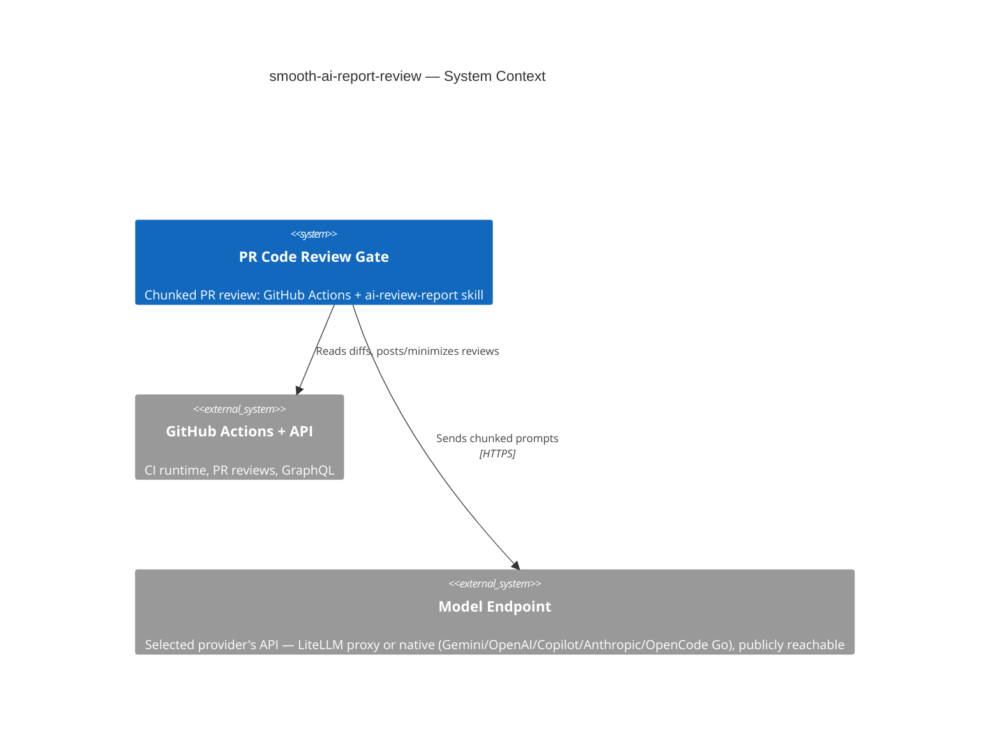

# smooth-ai-report-review

## TL;DR

Standalone (polyrepo) home for the automated PR code-review pipeline: a GitHub Actions gate (`.github/workflows/pipeline-code-review-report.yml`) that reviews PRs in chunks via opencode/Gemini, driven by the `ai-review-report` skill — plus `ai-review` for human-selected fix/skip decisions and `ai-analyse` for autonomous low/medium auto-fixes. The gate has **two packagings** sharing a single `run-review.sh` entrypoint (`.agents/skills/ai-review-report/scripts/run-review.sh`): the reusable workflow (default, gated by `uses:`) and a local-job caller (`.docs/examples/code-review-local.yml`) for consumers under `allowed_actions: "selected"` whose cross-org reusable-workflow call is refused.

## Non-Negotiables

- **Workflow ↔ script paths are coupled.** Every script invocation in the gate goes through `$REVIEW_SKILL_DIR`, resolved by the "Locate review skill scripts" step: the literal `.agents/skills/ai-review-report` when the skill is present in the checkout (in-repo / copy-install — that literal is also the README installer's rewrite anchor), else a `.smooth-ai-review-tools/` side checkout of this repo (reusable-workflow mode, ref-locked via `github.workflow_sha` / `tools_ref`). The local-job packaging (`.docs/examples/code-review-local.yml`) is a third mode: it hard-codes `REVIEW_SKILL_DIR: .review-tools/.agents/skills/ai-review-report` directly in its `env:` block rather than going through the two-mode resolution above — see the Non-Negotiable below on `run-review.sh` as the single source of truth. The analyse workflow also resolves `$ANALYSE_SKILL_DIR` and `$AI_REVIEW_DIR` (in addition to the shared `$REVIEW_SKILL_DIR` it reuses for the opencode libs) before invoking `ai-analyse` or summary plumbing. Moving or renaming a script, workflow, or skill folder silently breaks the gate in all modes. Change workflow YAML and scripts in the same commit.
- **The analyse workflow is name-coupled to the gate.** `.github/workflows/pipeline-ai-analyse.yml` uses `workflow_run.workflows: ["OpenCode Review Report"]`, which matches the gate's `name:` field, not its filename. Renaming the gate requires editing the analyse workflow in the same commit.
- **The gate runs on `ubuntu-latest`.** opencode is provider-agnostic transport — it reaches the models over HTTPS at whatever endpoint the selected provider is configured with (`OPENCODE_REVIEW_REPORT_<PROVIDER>_URL`): a LiteLLM proxy, or the provider's native API (Google Gemini, OpenAI, Copilot, Anthropic). That endpoint **must be reachable from GitHub-hosted runners** — i.e. publicly routable, not VPN-only. If a private-network endpoint is ever used, switch the runner back to `self-hosted`.
- **`/ai-review execute` MUST include `/ai-review` in every fix commit message AND make a final empty commit when any 🔴 Critical or 🟠 High finding is present — no exceptions.** Each fix commit's body must end with `/ai-review` as the last line, so whichever commit is HEAD when pushed triggers a full review immediately (the workflow checks only the HEAD commit's message; with chunked commits any one could be HEAD). The final empty commit (`ci: /ai-review — processed review responses`) is still required as a re-verification safety net after routing edits. This applies whether those findings were fixed or skipped. Never omit the empty commit, never fold it into a fix commit. Only omit for medium/low-only reviews.
- **`/ai-review execute` MUST write every skipped finding into the PR description's "Skip Areas / Known Issues" bullets — not just the fix/skip summary table — when routing through the Non-Copilot flow.** The chunked review gate reads those bullets, not the table, to decide whether a previously-raised finding is intentional. A skip whose rationale sits only in the summary table is a no-op: the same Critical/High finding will be re-raised on the next run (this was the failure observed on PR #86's CI run, not in production). The skill must also **verify** the bullets are present in the live PR body after `gh pr edit` and retry rather than declare success if any are missing. The table remains, as a human-facing artifact; the bullets are the load-bearing routing channel.
- **Credentials are env-injected, never committed.** `.agents/skills/ai-review-report/assets/opencode.json` holds `{env:OPENCODE_<PROVIDER>_*}` placeholders only. Each provider's **API key** is a GitHub **Secret**; each gateway **URL**, the `OPENCODE_REVIEW_REPORT_PROVIDER` / `OPENCODE_ANALYSE_PROVIDER` selectors, and model ids are GitHub **Variables** (non-sensitive, retunable). `OPENCODE_ANALYSE_PROVIDER` is required only when `OPENCODE_ANALYSE_MODEL` is set; otherwise analyse inherits the review provider/model. Never store an API key as a Variable or hardcode any URL/key — the only exceptions are the three fixed public bases hardcoded in `opencode.json`: OpenCode Go's `https://opencode.ai/zen/go/v1` (LADR-027), OpenRouter's `https://openrouter.ai/api/v1` (LADR-039), and Anthropic's `https://api.anthropic.com` (LADR-040). All three are single SaaS endpoints with no per-deployment URL to retune, and their API keys remain env-injected Secrets.
- **`run-review.sh` is the gate's single source of truth — both packagings invoke it.** `.agents/skills/ai-review-report/scripts/run-review.sh` encapsulates the full review gate (event parsing, provider resolution, opencode install + health probe, model-chain probes, PR diff generation, AGENTS.md validation, chunked review, aggregation, post) and is driven entirely by environment variables and `$GITHUB_EVENT_PATH` — it must NOT read `inputs.*`, `steps.*.outputs`, or expression interpolation. The reusable workflow's job body is now a thin wrapper that sets the env vars and calls `run-review.sh`; the local-job packaging (`.docs/examples/code-review-local.yml`) does the same without the wrapper. Adding **review** behaviour to the gate means editing `run-review.sh`; the workflow and the local-job caller only change when the env-var contract changes, when the error-comment / temp-cleanup plumbing moves, or when the hardcoded skill-path lookup in the wrapper (the two-path `[ -f ... ]` dispatch — see `pipeline-code-review-report.yml`'s "Run review gate" step) needs updating. Note: `$REVIEW_SKILL_DIR` is the script's own contract (see `run-review.sh`'s `resolve_skill_dir`), consumed by callers like the local-job packaging that invoke `run-review.sh` from outside the wrapper's two-path checkout shape — the wrapper itself does not set or read it. Any new env var the entrypoint reads must be added to **both** the workflow's `env:` block and the local-job caller's `env:` block in the same commit. **In particular, the `Run review gate` step must forward `GITHUB_TOKEN: ${{ secrets.GITHUB_TOKEN }}` in its `env:` block** — bare `run:` shells do not auto-inject GITHUB_TOKEN from the runner, so without the forward the entrypoint's preflight `❌ GITHUB_TOKEN is not set` fires before any review logic runs (this was the failure observed on PR #86's CI run, not in production).
- **`install-opencode.sh` is the single install source of truth.** Every workflow and consumer-facing example that installs opencode must delegate to `.agents/skills/ai-review-report/scripts/lib/install-opencode.sh` — no inline `curl -fsSL https://opencode.ai/install | bash` in any workflow YAML or example file. Adding a new install path means wiring it through the shared lib; duplicating the install block silently reintroduces the pin-parity gap closed by LADR-048 (the analyse workflow always installed `latest` regardless of `OPENCODE_REVIEW_REPORT_CLI_VERSION`, and the npm consumer template had no pin at all).
- **`build-code-graph.sh` is the single install source of truth for code-review-graph.** Every workflow and consumer-facing example that builds the code knowledge graph must delegate to `.agents/skills/ai-review-report/scripts/lib/build-code-graph.sh` — no inline `pip install code-review-graph` in any workflow YAML or example file. This mirrors the LADR-048 pattern for opencode. The script handles version pinning (`OPENCODE_REVIEW_REPORT_GRAPH_VERSION`), PATH repair, and graph build/update. The companion `detect-changes-graph.sh` runs the analysis and produces the risk-scored output files.

## System Context

This repo's deliverable is the review gate itself, not application code. The gate sends chunked PR diffs to the selected provider's models (GEMINI / COPILOT / OPENAI / ANTHROPIC / OPENCODE-GO-OPENAI / OPENCODE-GO-ANTHROPIC / OPEN_ROUTER, via `OPENCODE_REVIEW_REPORT_PROVIDER`) through a gateway and posts structured reviews back to GitHub. Pipeline internals (provider selection, chunking, the two-tier model chain, orchestrator model, false-positive rules, LADR-001…047) live in `.agents/skills/ai-review-report/SKILL.md` — that file is the source of truth; do not restate it here.

```mermaid
C4Context
    title smooth-ai-report-review — System Context
    System(gate, "PR Code Review Gate", "Chunked PR review: GitHub Actions + ai-review-report skill")
    System_Ext(github, "GitHub Actions + API", "CI runtime, PR reviews, GraphQL")
    System_Ext(gateway, "Model Endpoint", "Selected provider's API — LiteLLM proxy or native (Gemini/OpenAI/Copilot/Anthropic/OpenCode Go), publicly reachable")
    Rel(gate, github, "Reads diffs, posts/minimizes reviews")
    Rel(gate, gateway, "Sends chunked prompts", "HTTPS")
```

## Key Behaviors

- **Four skills, distinct directions.** `ai-review-report` *generates* the review (CI gate, or locally via `scripts/local-review.sh`). `ai-review` (invoked `/ai-review`) lets a human consume a posted review and apply fix/skip decisions. `ai-analyse` is the autonomous CI sibling that consumes only low/medium findings and edits without committing. `git-commit-review-push` is the commit-and-push wrapper: it formats the commit as conventional, appends `/ai-review` as the last line of the commit body, and pushes — so the pushed HEAD triggers a full gate review on the receiving end. Don't conflate them or merge their scripts.
- **`ai-review` has two routing channels in execute; the propagation channel differs.** Copilot flow → per-thread reply + resolve + summary comment. Non-Copilot flow → summary table appended to the PR description's AI Review Notes **plus** (mandatory) skip bullets written into the PR description's "Skip Areas / Known Issues" section. The gate reads the bullets to avoid re-flagging intentional decisions; the table is for humans. If a Non-Copilot execute run leaves the skip rationale only in the table, it has silently failed — see the Non-Negotiable above.
- **`ai-analyse` never edits tests by default ("test in the loop").** Autonomous self-fixes may not modify tests (unit/component/integration/e2e) or the test framework unless the `OPENCODE_ANALYSE_ALLOW_TEST_SELF_FIX` Variable is truthy — the suite must stay an independent oracle that proves the fix did not break anything. Enforcement is deterministic in `pipeline-ai-analyse.yml` (it reverts such edits via `.agents/skills/ai-analyse/scripts/lib/filter-test-self-fix.sh` before committing), not model-trusted. Mechanism and matcher: LADR-045 in the skill docs — don't restate them here.
- **Everything lives under `.agents/`, never `.ai/`.** This repo standardizes on `.agents/` for skills, rules, and context (the skill's origin used `.ai/`; all internal references, the workflow, and `MANDATORY_CONTEXT_FILES` were rewritten). Any new path reference — including ones aimed at a consuming repo — must use the `.agents/` prefix.
- **Most `MANDATORY_CONTEXT_FILES` resolve against the repo being reviewed, not this one.** The workflow lists context paths (`.agents/rules-scoped/…`, `.agents/skills/code-review-standards/…`, `.docs/nfr/…`) that exist in a consuming product repo, not here. They warn-and-skip when absent; do not "fix" them by deleting or repointing — they are intentional for cross-repo reuse.
- **The root `AGENTS.md` is loaded only via `MANDATORY_CONTEXT_FILES`.** `find-context-files.sh`'s per-chunk walk stops one level *above* nothing — its loop terminates before reaching `.`, so it never discovers a repo-root file. This root doc is loaded only because it is listed in the workflow's `MANDATORY_CONTEXT_FILES`. Keep that entry if this repo's own PRs should be reviewed with this context.
- **Five consumption paths, one source of truth.** Consumers get the gate via the README copy-installer or via `workflow_call` (`uses: …/pipeline-code-review-report.yml@v1` — scripts fetched into `.smooth-ai-review-tools/` at run time; the floating major tag, e.g. `v1`/`v2`, is maintained by `.github/workflows/update-major-tag.yml` on merges to `main` or manual dispatch, with the tag name derived automatically from `package.json`'s major version), and get the skills via the Claude Code marketplace entries in `.claude-plugin/marketplace.json`: `smooth-ai-review` is the default/core plugin (`ai-review` + `git-commit-review-push`), while `smooth-ai-review-report` and `smooth-ai-analyse` are separate optional installs. Those marketplace entries load the canonical skill folders straight from `.agents/skills/` via explicit `skills` paths — no root symlink. Consumers can also use the npm opencode plugin `@generic-automation-and-it/smooth-ai-review` (root `package.json` + `opencode-plugin.js`: links all four skills minus `scripts/eval/` into the consumer's `.agents/skills/` at opencode startup, never overwrites real directories, excludes via `.git/info/exclude`). That **same** npm package doubles as the fifth path — `npm install`ed in a GitHub Actions job and run from `node_modules/` (example: `.docs/examples/npm-review-report-gha.yml`); because `local-review.sh` derives the repo-under-review from its script location, that path sets `OPENCODE_REVIEW_REPORT_REPO_ROOT=$GITHUB_WORKSPACE` (the only supported override of that math). This npm-in-CI path is consumer-facing only — it does **not** replace the gate/analyse workflows' side-checkout resolution, which stays load-bearing per the Non-Negotiables. The package lives on the **GitHub Packages npm registry** (`publishConfig` + root `.npmrc`; `npm-publish.yml` authenticates with the run-scoped `GITHUB_TOKEN` — no npm.com org or `NPM_TOKEN`), which means consumers need a one-time `read:packages` PAT in their user `~/.npmrc` even though the package is public; after the first publish, flip the package visibility to public in the org Packages settings. Neither plugin installs the CI gate. Versions are lockstep: `package.json` == `.claude-plugin/plugin.json`; semver tag releases additionally require the `vX.Y.Z` tag to match. `npm-publish.yml` runs on every push to `main`, manual dispatch, and matching semver tags (no `paths` filter); non-tag runs patch the runtime package/plugin version to `major.minor.${GITHUB_RUN_NUMBER}` so each publish is immutable and unique, while semver tags publish the exact checked-in/tagged version. The caller template `.docs/examples/code-review-caller.yml` duplicates the `model_preset` dropdown — extend it together with the workflow's preset mapping.
- **Four workflow inputs shape the gate at dispatch or reusable-call.** `model_preset` (choice dropdown) maps to provider + model id via the workflow's preset table; the caller template `.docs/examples/code-review-caller.yml` duplicates the dropdown — extend both together. `disable_claude_code` (choice `1`/`0`, default `1`) keeps opencode's `.opencode/` from colliding with Claude Code's `.claude/` on the runner — dispatch always supplies `1` or `0` (the `OPENCODE_REVIEW_REPORT_DISABLE_CLAUDE_CODE` Variable is unreachable on dispatch); reusable-call input defaults to blank and falls through to the Variable. `disable_agents_md_check` (choice `0`/`1`, default `0`) skips the AGENTS.md validation step — use only when the reviewed repo has no AGENTS.md and the gate's warn-and-skip is insufficient. `bypass_mandatory_context_file` (choice `0`/`1`, default `0`) bypasses both the AGENTS.md checks and the mandatory context file loading — when truthy, skips `MANDATORY_CONTEXT_FILES` injection and `validate-agents-md.sh`; the Variable `OPENCODE_REVIEW_REPORT_BYPASS_MANDATORY_CONTEXT_FILE` is used when the input is null/empty. `opencode_config` (string, default blank) is a repo-relative path to a custom `opencode.json` inside the repo under review (LADR-047); blank falls through to `vars.OPENCODE_REVIEW_REPORT_CONFIG` then to the built-in `.agents/skills/ai-review-report/assets/opencode.json`. Any override **must** keep the `{env:OPENCODE_*}` placeholders — never commit real keys.
- **`.agents/skills/ai-review-report/assets/` is runtime config, `.agents/skills/ai-review-report/references/` is edit-time docs.** `assets/` holds `opencode.json` and `review-config.json` (the latter loaded by `filter-excluded-files.sh`). `references/` holds `CHANGELOG.md` and the AGENTS.md quality standards — read only when editing the skill, not during a review. (Both live under the skill folder, not the repo root.)
- **Code graph analysis is opt-in (LADR-049).** When `OPENCODE_REVIEW_REPORT_ENABLE_GRAPH_ANALYSIS` is truthy (`1`/`true`/`yes`/`on`), the gate builds a Tree-sitter-based SQLite knowledge graph of the repo via `code-review-graph` (PyPI package) and runs `detect-changes` to produce risk-scored function-level analysis. The graph DB is cached between CI runs via `actions/cache` (keyed on lockfile hashes + schema version). Phase 1 (this implementation) builds the graph and produces `ci_temp/graph_detect_changes.json`, `ci_temp/graph_risk_summary.md`, and `ci_temp/graph_file_risks.txt`. Phases 2-4 (LADR-050/051/052) will consume these for per-chunk context injection, graph-aware chunk grouping, and aggregation enrichment. The graph build is delegated to `scripts/lib/build-code-graph.sh` (mirrors the `install-opencode.sh` pattern from LADR-048); the analysis is in `scripts/lib/detect-changes-graph.sh`. Both scripts degrade gracefully on failure — the review proceeds without graph enrichment. `OPENCODE_REVIEW_REPORT_GRAPH_VERSION` pins the `code-review-graph` package version for supply-chain hygiene (mirrors `OPENCODE_REVIEW_REPORT_CLI_VERSION` for opencode). The graph analysis step runs in `run-review.sh` Step 13.5, between context file discovery (Step 13) and AGENTS.md validation (Step 14).

## Changelog

Full dated audit trail: `.agents/skills/ai-review-report/references/CHANGELOG.md`. LADR narratives live in `.agents/skills/ai-review-report/AGENTS.md` — do not re-inline them here.
