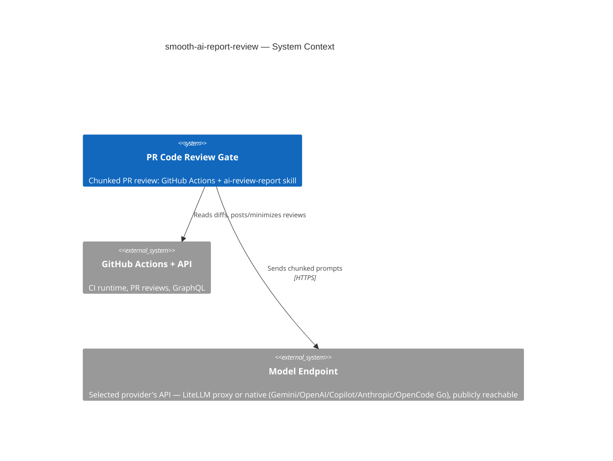

# smooth-ai-report-review

## TL;DR

Standalone home for the automated PR code-review gate (`.github/workflows/pipeline-code-review-report.yml`, chunked review via opencode, driven by the `ai-review-report` skill) plus the `ai-review` (read-only analysis by default; explicit per-item decisions or `--fix` apply fix/skip) and `ai-analyse` (autonomous Low/Medium fixes) skills. The gate has **two packagings** sharing one entrypoint, `.agents/skills/ai-review-report/scripts/run-review.sh`: the reusable workflow (default, `uses:`) and a local-job caller (`.docs/examples/code-review-local.yml`) for consumers under `allowed_actions: "selected"` whose cross-org reusable-workflow call is refused.

## Non-Negotiables

- **Workflow ↔ script paths are coupled.** The gate's "Run review gate" step runs `run-review.sh` from the literal `.agents/skills/ai-review-report` when the skill is in the checkout (in-repo / copy-install — that literal is also the README installer's rewrite anchor), else from the `.smooth-ai-review-tools/` side checkout that "Fetch review tooling" ref-locks via `github.job_workflow_sha` / `tools_ref` — **never** `github.workflow_sha` (in a reusable call that is the caller's commit, which does not exist here). `$REVIEW_SKILL_DIR` is `run-review.sh`'s own contract (`resolve_skill_dir`) for callers outside that shape: the local-job packaging, a third mode, hard-codes `REVIEW_SKILL_DIR: .review-tools/.agents/skills/ai-review-report` in its `env:` block. The analyse workflow's "Locate review/analyse tooling" steps set `$REVIEW_SKILL_DIR` (for the opencode libs), `$ANALYSE_SKILL_DIR` and `$AI_REVIEW_DIR`. Moving or renaming a script, workflow or skill folder silently breaks the gate in all modes — change workflow YAML and scripts in the same commit.
- **The analyse workflow is name-coupled to the gate.** `pipeline-ai-analyse.yml`'s `workflow_run.workflows: ["OpenCode Review Report"]` matches the gate's `name:` field, not its filename. Renaming the gate means editing the analyse workflow in the same commit.
- **The gate runs on `ubuntu-latest`.** opencode reaches models over HTTPS at the selected provider's endpoint (`OPENCODE_REVIEW_REPORT_<PROVIDER>_URL` — LiteLLM proxy or native API). That endpoint **must be reachable from GitHub-hosted runners** (publicly routable, not VPN-only); if a private-network endpoint is ever used, switch the runner back to `self-hosted`.
- **`/ai-review execute` MUST put `/ai-review` in every fix commit AND make a final empty commit when any 🔴 Critical or 🟠 High finding is present — no exceptions.** Each fix commit body ends with `/ai-review` as its last line, because the workflow checks only the HEAD commit's message and with chunked commits any one could be HEAD. The final empty commit `ci: /ai-review — processed review responses` is still required as a re-verification safety net, whether those findings were fixed or skipped. Never omit it, never fold it into a fix commit; omit only for Medium/Low-only reviews.
- **`/ai-review execute` (Non-Copilot flow) MUST write every skipped finding into the PR description's "Skip Areas / Known Issues" bullets — not only the fix/skip summary table.** The gate reads the bullets, not the table, to recognise an intentional skip; a table-only skip is a no-op and the same Critical/High finding is re-raised next run. After `gh pr edit`, **verify** the bullets are in the live PR body and retry rather than declare success. The table stays as the human-facing artifact.
- **Credentials are env-injected, never committed.** `assets/opencode.json` holds `{env:OPENCODE_<PROVIDER>_*}` placeholders only. API keys are GitHub **Secrets**; gateway URLs, the `OPENCODE_REVIEW_REPORT_PROVIDER` / `OPENCODE_ANALYSE_PROVIDER` selectors and model ids are GitHub **Variables**. `OPENCODE_ANALYSE_PROVIDER` is required only when `OPENCODE_ANALYSE_MODEL` is set; otherwise analyse inherits the review provider/model. Never store a key as a Variable or hardcode any URL/key — except five fixed public SaaS bases: in `opencode.json`, OpenCode Go `https://opencode.ai/zen/go/v1` (LADR-027), OpenRouter `https://openrouter.ai/api/v1` (LADR-039), Anthropic `https://api.anthropic.com` (LADR-040); in `lib/resolve-provider.sh`'s `decisions` scope (raw-HTTP targets, never opencode providers), `https://opencode.ai/zen/v1/systemone` and `https://openrouter.ai/api/alpha/decisions` (LADR-093). Their keys stay env-injected Secrets; the decision providers reuse `OPENCODE_GO_OPENAI_API_KEY` / `OPENCODE_OPENROUTER_API_KEY` and add no Secret. Secret-handling rules (env → script → tool, never a literal) and the checklist are in `.github/instructions/skills/skill-secret-handling.instructions.md`; check its Current Status gap list before adding a secret consumer or widening what the model process can reach.
- **`run-review.sh` is the gate's single source of truth — both packagings invoke it.** It runs the whole gate from environment variables and `$GITHUB_EVENT_PATH` only — it must NOT read `inputs.*`, `steps.*.outputs` or expression interpolation. New **review** behaviour goes in `run-review.sh`; the workflow and the local-job caller change only for the env-var contract, the error-comment / temp-cleanup plumbing, or the wrapper's two-path `[ -f ... ]` skill lookup in the "Run review gate" step. `$REVIEW_SKILL_DIR` is the script's own contract (`resolve_skill_dir`) for callers outside the wrapper's checkout shape; the wrapper neither sets nor reads it. Any new env var the entrypoint reads goes into **both** the workflow's and the local-job caller's `env:` blocks in the same commit. **The `Run review gate` step must forward `GITHUB_TOKEN: ${{ secrets.GITHUB_TOKEN }}`** — bare `run:` shells do not auto-inject it, and the preflight then fails with `❌ GITHUB_TOKEN is not set`.
- **`install-opencode.sh` is the single install source of truth.** Every workflow and consumer-facing example installing OpenCode v2 delegates to `scripts/lib/install-opencode.sh` — no inline `curl -fsSL https://opencode.ai/v2/install | bash`. An explicit `OPENCODE_CLI_VERSION` must be `2.x` and a v1 binary is always rejected; a blank pin means "any v2" (reuse an existing v2, install latest only when none). New install paths go through the lib (LADR-048).
- **`build-code-graph.sh` is the single install source of truth for code-review-graph.** Every workflow and example building the graph delegates to `scripts/lib/build-code-graph.sh` — no inline `pip install code-review-graph`. It owns the `OPENCODE_TOOL_CODE_REVIEW_GRAPH_VERSION` pin, PATH repair and build/update; `detect-changes-graph.sh` runs the analysis.

## System Context

The deliverable is the review gate itself, not application code: it sends chunked PR diffs to the selected provider (GEMINI / COPILOT / OPENAI / ANTHROPIC / OPENCODE-GO-OPENAI / OPENCODE-GO-ANTHROPIC / OPENCODE-GO-RESPONSES / OPEN_ROUTER) and posts structured reviews to GitHub. Pipeline internals and all LADRs live in `.agents/skills/ai-review-report/SKILL.md` and its `AGENTS.md`.

```mermaid
C4Context
    title smooth-ai-report-review — System Context
    System(gate, "PR Code Review Gate", "Chunked PR review: GitHub Actions + ai-review-report skill")
    System_Ext(github, "GitHub Actions + API", "CI runtime, PR reviews, GraphQL")
    System_Ext(gateway, "Model Endpoint", "Selected provider's API — LiteLLM proxy or native (Gemini/OpenAI/Copilot/Anthropic/OpenCode Go), publicly reachable")
    Rel(gate, github, "Reads diffs, posts/minimizes reviews")
    Rel(gate, gateway, "Sends chunked prompts", "HTTPS")
```

## Key Behaviors

LADR numbers refer to `.agents/skills/ai-review-report/AGENTS.md`; read the LADR before changing the behaviour.

- **Four skills, distinct directions — don't conflate them or merge their scripts.** `ai-review-report` generates the review (CI gate, or locally via `scripts/local-review.sh`); `ai-review` (`/ai-review`) analyses a posted review read-only by default, and explicit per-item decisions or `--fix` opt into applying fix/skip decisions; `ai-analyse` autonomously fixes only Low/Medium findings and edits without committing; `git-commit-review-push` makes a conventional commit and pushes with `/ai-review` in the final commit — anywhere in the message (the gate greps the whole HEAD message) but before any trailer block, so `Co-authored-by:` / `Signed-off-by:` still parse.
- **`ai-review` execute routes by review source.** Copilot flow: per-thread reply + resolve + summary comment. Non-Copilot flow: summary table in the PR description's AI Review Notes **plus** the mandatory Skip Areas bullets (Non-Negotiable above), which the gate feeds to the model (LADR-083). R/T skip bullets match across rounds by their area and summary text, not their per-run numbers (LADR-101). Skip rationale left only in the table is a silent failure.
- **`ai-analyse` never edits tests or evals by default (LADR-045).** No tests of any tier, test framework, or anything under `eval/` / `evals/` unless `OPENCODE_ANALYSE_ALLOW_TEST_SELF_FIX` is truthy — off by default and must stay off, so the suite remains an independent oracle. Enforcement is deterministic (`filter-test-self-fix.sh` reverts such edits in `pipeline-ai-analyse.yml` before commit), never model-trusted. T gaps are pre-decided SKIP while that flag is off, and a deterministic completeness pass surfaces unanswered in-scope items (LADR-101).
- **`ai-analyse` must not make a failing test green (LADR-056).** A red test is a human decision: never edit production code to satisfy a stale test, never fix a finding whose basis is a failing test. `filter-failing-test-findings.sh` removes such findings before the model sees them; the prompt rule reinforces it unconditionally.
- **Everything lives under `.agents/`, never `.ai/`** — including any new path aimed at a consuming repo.
- **Most `MANDATORY_CONTEXT_FILES` resolve against the reviewed repo, not this one.** Paths such as `.agents/rules-scoped/…`, `.agents/skills/code-review-standards/…`, `.docs/nfr/…` warn-and-skip here by design — don't delete or repoint them. Consumers override with the `mandatory_context_files` input (`workflow_call` + `workflow_dispatch`; deliberately no Variable fallback in the reusable workflow; the local-job packaging reads a same-named Variable). `none` as the whole value means no mandatory files; blank always means the built-in list; unset at `find-context-files.sh` fails closed.
- **Exact `AGENTS.md` files belong to OpenCode v2 (LADR-087).** v2 loads the root and nested `AGENTS.md` natively, so `find-context-files.sh` excludes every exact `AGENTS.md` basename (even one listed in `MANDATORY_CONTEXT_FILES`) to avoid double injection, while still walking ancestors for custom `*_AGENTS.md` and enumerating `.github/instructions/**/*.instructions.md`.
- **Five consumption paths, one source of truth (LADR-037, LADR-038).** README copy-installer; `workflow_call` (`…/pipeline-code-review-report.yml@v2`, scripts side-checked into `.smooth-ai-review-tools/`; `update-major-tag.yml` moves the major tag from `package.json`); Claude Code marketplace (`.claude-plugin/marketplace.json`: core `smooth-ai-review` = `ai-review` + `git-commit-review-push`, optional `smooth-ai-review-report` / `smooth-ai-analyse`, loaded from `.agents/skills/` via explicit `skills` paths — no root symlink); the npm OpenCode v2 plugin `@generic-automation-and-it/smooth-ai-review` (GitHub Packages; consumers need a `read:packages` PAT even when public); and that same package run from `node_modules/` in CI (`.docs/examples/npm-review-report-gha.yml`), setting `OPENCODE_REVIEW_REPORT_REPO_ROOT=$GITHUB_WORKSPACE` — the only supported override of `local-review.sh`'s repo-root derivation; this path is consumer-facing and does not replace the workflows' side-checkout resolution. The npm entry **must** be `index.js` (v2 ignores `main`/`exports` and silently skips the plugin), the package **must stay dependency-free**, and it links the skills (minus `scripts/eval/`) without overwriting real directories, excluded via `.git/info/exclude`. Neither plugin installs the CI gate. Versions are lockstep: `package.json` == `.claude-plugin/plugin.json` == semver tag; non-tag publishes use `major.minor.${GITHUB_RUN_NUMBER}`.
- **Workflow inputs have couplings (LADR-047 for `opencode_config`).** `model_preset`'s dropdown is duplicated in `.docs/examples/code-review-caller.yml` — extend both with the preset mapping. `run_on_draft` (blank → `OPENCODE_REVIEW_REPORT_RUN_ON_DRAFT` → `false`): its job-level draft guard is duplicated in all three packagings (`pipeline-code-review-report.yml`, `code-review-local.yml`, `code-review-caller.yml`) — extend them together, or a caller's own `if:` skips the job and the opt-in is inert; `pipeline-ai-analyse.yml` keeps an independent `OPENCODE_ANALYSE_RUN_ON_DRAFT`, because reviewing a draft and auto-committing to one are separate risk decisions. Dispatch always supplies `disable_claude_code`, so its Variable is reached only by a reusable call with the input blank. `bypass_mandatory_context_file` skips both context injection and `validate-agents-md.sh`; `disable_agents_md_check` skips only the latter and is for repos with no AGENTS.md. An `opencode_config` override (repo-relative, blank → `vars.OPENCODE_REVIEW_REPORT_CONFIG` → built-in) **must** keep the `{env:OPENCODE_*}` placeholders.
- **`assets/` is runtime config, `references/` is edit-time docs** (both under the skill folder). `assets/` holds `opencode.json` and `findings-schema.json` (LADR-055); generated-file exclusions are caller-provided, not an asset. `references/` is never read during a review.
- **v2 does not resolve the config `instructions` array; `find-context-files.sh` is the working channel (LADR-080, LADR-087).** `opencode.json` declares `.agents/rules/*.md` and `.github/instructions/*.instructions.md` (each with a `**` companion — a v1 glob artifact); `.agents/rules-scoped/**` is deliberately not declared (it arrives via `MANDATORY_CONTEXT_FILES`). The declared list and the finder's enumeration **move together** — `test-find-context-files.sh` derives its list from `opencode.json`; keep it derived. `prepare-opencode-config.sh` warns the field is inert. The config reaches opencode as a per-run copy at `OPENCODE_CONFIG` (LADR-071); its V1-shaped blocks are intentionally supported.
- **OpenCode v2 traps (LADR-087).** v1 and v2 share the `opencode` command name, so `install-opencode.sh` requires major ≥ 2 both for a cached binary and after installing. `--log-level` values must be lowercase. A v2 background service binds `OPENCODE_CONFIG` when it starts, so every CI entrypoint runs `opencode service stop` after preparing the config; `lib/opencode-health.sh` exits **3** when the managed config is not confirmed loaded (foreign or unreadable) — fatal in both CI entrypoints — while a liveness-only failure stays exit 1 and advisory. Liveness is recorded, never acted on early (so it cannot skip the binding check); an unreadable binding plus a failed probe is one fault and stays advisory.
- **Context rules are filtered by their own declared scope, and every uncertain case fails open (LADR-089).** `lib/filter-context-scope.sh` + `lib/context-scope-filter.py` read `applyTo:` / `alwaysApply:`. Do not level the asymmetry: no/unparseable frontmatter, no scope key, `alwaysApply: true`, an untranslatable glob, no Python, and anything in `MANDATORY_CONTEXT_FILES` are all **kept**. Brace `{a,b}` and class `[abc]` globs must stay translated, never escaped.
- **Project rules reach the model as a generated per-chunk `AGENTS.md`, selected by cwd (LADR-090).** `lib/build-runtime-agents.sh` concatenates the scoped set's content into `ci_temp/chunk_<n>/AGENTS.md` (aggregation: `ci_temp/orch/AGENTS.md`) and opencode runs there via `OPENCODE_RUN_CWD` (`lib/opencode-with-fallback.sh` absolutizes the prompt path). No CLI flag or config key loads an instructions file by path (a v2 plugin context hook could; deliberately not taken). Never concatenate exact `AGENTS.md` basenames, always strip leading YAML frontmatter, and keep the prompt's `read_file` guidance **absolute-only** (the cwd is not the repo root). Verify only inside a git repo — without one v2 does no walk-up.
- **Code graph analysis is on by default and never blocks (LADR-049).** Falsy `OPENCODE_REVIEW_REPORT_ENABLE_GRAPH_ANALYSIS` disables it. It runs in `run-review.sh` Step 13.5 (after context discovery, before AGENTS.md validation), is cached via `actions/cache`, and degrades to a review without graph enrichment on any failure. Its `ci_temp/graph_*` outputs are for the planned LADR-050–052 phases.
- **Version notices are best-effort (LADR-053, LADR-087).** `lib/check-versions.sh` checks OpenCode v2's `https://opencode.ai/update/api/latest/cli/npm`, PyPI (`code-review-graph`) and GitHub Releases (RTK) with `curl -sf --max-time 5` and never blocks. It is sourced after Step 13.5's graph analysis and RTK install so installed versions are real. Do not restore the retired v1 `opencode-ai` npm lookup; while RTK lacks `--opencode-v2` its line must report the bypass, never a false ✅.
- **RTK stays installed, its plugin bypassed on v2 (LADR-054, LADR-087).** `OPENCODE_REVIEW_REPORT_ENABLE_RTK` defaults on. `install-rtk.sh` probes `rtk init --help` — `--opencode` on v1, `--opencode-v2` when advertised — and otherwise warns, skips only initialization and exits 0, so a future compatible RTK activates without a gate change.
- **The review agent has no web access by default (LADR-094).** The `review` agent denies `webfetch`, `websearch` **and `execute`** (v2 Code Mode carries its own `fetch`, so denying `webfetch` alone leaves a network path); `analyse` denies `execute` too. `review-in-chunks.sh` generates the web-dependent prompt lines from the resolved config, so a custom config that re-allows `webfetch` gets the docs-verification wording back. Don't casually re-enable web in the shipped config: web calls failed often and slowed chunks.
- **Structured findings are a second transport alongside the markdown, never a replacement (LADR-055).**
  - `extract-findings-json.sh` strips the sentinel range from `chunk_<n>.md` inclusive, parsed or not, anchored on the **last complete** begin…end pair (END prefix-matched, BEGIN exact — LADR-079); an unterminated `begin` stays (a stray JSON block beats a truncated review). The sidecar must **never** write `chunk_<n>.failed` (LADR-031 owns that channel).
  - `merge-findings.py` demotes confidence ≥ 75 that failed quote-the-line and suppresses non-`critical` below 75. `residual_risks` / `testing_gaps` render as 🟡 Medium bullets **without** `[VERIFIED]`, outside `score-review.sh`'s zero-tolerance count.
  - Partial coverage is rendered **loudly** (LADR-064): coverage is `merge-findings.py`'s `merged_chunks`, never sidecar files on disk, and every missing chunk is named atop the Coverage block. Don't re-tighten to all-or-nothing without fixing what truncates the sidecar.
  - Escalation from merged findings is one-directional (may force `request_changes`, never soften). The only softening path is the Recommendation sync (`lib/sync-recommendation-from-findings.sh`), fenced by full sidecar coverage and no unresolved chunk failure when the summary also failed (LADR-085); it never turns a deliberate `COMMENT` into `APPROVE`, and failed chunks still block.
  - `finding N` references in Suggested Fixes are repointed from the ``### `file:line` `` anchor, never the prose; one survivor → rewrite, several → untouched, none → reworded without a number; a reference naming several findings is never rewritten (LADR-088).
  - Falsy `OPENCODE_REVIEW_REPORT_ENABLE_STRUCTURED_FINDINGS` reverts to the pre-LADR-055 shape; Python is a soft dependency.
- **An optional decision model judges the merged findings; it never replaces them and never softens alone (LADR-093, LADR-096–098).**
  - `OPENCODE_REVIEW_REPORT_ENABLE_DECISIONS` (default `0`) runs `lib/score-findings-decisions.sh` at Step 17.6 (after merge, before aggregation; mirrored in `local-review.sh`). It is the gate's only model call outside opencode (curl + jq), so the decision selectors (`OPENCODE-GO-DECISIONS`, `OPENROUTER-DECISIONS`) stay out of `opencode.json` and `model_target()`. It never rewrites `severity` / `confidence` / `verified`, never writes `chunk_<n>.failed`, never changes the exit code. A preflight/config failure leaves the merged document byte-identical; a single failed response leaves only that finding unscored.
  - `annotate` (default) is display-only — `(decision score 91%)`, no colon or second severity word so `score-review.sh` counts unchanged — and every rendered piece re-checks the enable flag. `filter` (suppresses non-critical findings below `OPENCODE_REVIEW_REPORT_DECISIONS_MIN_PROBABILITY`) softens, so it is fenced exactly like the Recommendation sync, degrades to `annotate` outside it, and must not default on until the DR eval corpus has measured it (issue #156).
  - The seven `OPENCODE_REVIEW_REPORT_*DECISIONS*` Variables (incl. `_DECISIONS_CODE_CONTEXT`) go in **both** packagings' `env:` blocks.
  - The judge's `rule-allowed` / `previously skipped` scores are display-only in every mode. Human `/ai-review execute` decisions become labels (LADR-096); a `skip deferred` or doubtful skip is never a label, and neither is any model output (`ai-analyse`, FIX/SKIP recommendations).
  - FIX/SKIP recommendations for `/ai-review --usedecisions` and `pipeline-ai-analyse.yml` (LADR-097) are built from the **posted body** (`lib/review-findings-to-json.sh`); the run artifact may only add quoted evidence on a number+file+title match. `OPENCODE_ANALYSE_ENABLE_DECISIONS` is never inherited from the gate; the cloned `OPENCODE_ANALYSE_DECISIONS_*` PROVIDER/TIMEOUT fall back to the gate's, MODEL only together with the provider. For the fixer they are one-directional: they may withhold findings (reported in the summary comment), never add one or turn a SKIP into a FIX; unscored findings are untouched.
  - LADR-098: the gate asks `fix_skip` itself, optionally (an unusable answer never unscores a finding); consumers **reuse** it while the Skip Areas the gate judged against (`decision_skip_areas.md` in the run artifact) and the provider and requested model still match (never the provider's dated snapshot name), and re-score the rest with the artifact's `rules/chunk_<n>/AGENTS.md`. When the reviewed commit is known, consumers judge **its** diff (`lib/review-diff.sh`) and give no recommendations if that diff is unavailable — never the current diff instead. `code_context` stays centred on the finding, shrinks then drops before the hunk is trimmed, and never includes secret-looking paths. The gate writes `<!-- ai-review-report run-id=N -->` only when `run-review.sh` uploads an artifact — a different key from the label marker `run=`.
- **Nothing that reaches a posted body may contain `#` followed by digits (LADR-067, LADR-068).** GitHub autolinks it (even inside `**`), spamming cross-references on the reviewed repo and erasing the identifiers Skip Areas bullets and `ai-analyse`'s FIX/SKIP table match on. Findings are a plain ordered list (`1.`), safe only because `merge-findings.py` numbers in severity order; the other classes are **bolded** `R1)`, `T1)`, `P1)` (`H1)` only in reviews before LADR-100) (unbolded, `- 1) foo` parses as a nested list); back-references are `(chunk 3)` / `### Chunk 3`. This binds every skill that writes review output.
- **Trivial-PR skip fails open (LADR-059).** `OPENCODE_REVIEW_REPORT_ENABLE_TRIVIAL_SKIP` (default on), Step 12.5: one changed file outside the lockfile/manifest allowlist disqualifies before any model is asked; anything but an explicit orchestrator `yes` (timeout, exhausted chain) runs the full review. Never fires for `/ai-review` comments or `workflow_dispatch` (`force_full_review`). A skip posts a comment and exits green; `ai-analyse` declines the stale prior review via its `artifact_ts < run_created_at` guard.
- **Every run leaves an uploaded artifact, including skipped and failed ones (LADR-062).** `ci_temp/run/` is assembled by an EXIT trap in `run-review.sh` — keep it a trap, since five exits never reach aggregation — and uploaded by both packagings between the gate and cleanup steps. `OPENCODE_REVIEW_REPORT_ENABLE_RUN_ARTIFACTS` (default on) is declared in **both** packagings. The decision paths (`/ai-review --usedecisions`, `ai-analyse`'s decision step, via the `run-id=` marker — present on aggregated reviews; an early exit such as all models failing uploads an artifact without it) and the eval harvester (via `run=`) download it; `select-ai-analyse-artifact.sh` still reads the PR timeline.
- **The diff base is a resolved ancestor or the run stops — never a guess (LADR-075).** All resolution goes through `lib/resolve-diff-base.sh`. Never `git fetch --depth=1` a ref you need ancestry from (it grafts the `fetch-depth: 0` checkout shallow and `merge-base` fails), and never fall back to the base tip in a two-dot range (it silently reviews commits the base gained since the branch point). A plain re-fetch does not un-shallow (only `--unshallow` / `--deepen`); three-dot is not a safe fallback (it errors on a shallow repo and `pr_diff.txt`'s `|| true` turns that into an empty review that still posts). No merge-base → fail loudly.
- **Every GitHub call that can abort the run gets exactly one bounded retry (LADR-078).** Via `lib/gh-retry.sh`: attempt, fixed **30 s** wait (a constant, not a Variable), one retry, then fail as before — no exponential backoff. It is an **allowlist**: only HTTP-status phrasing and network signatures retry; no bare numerics (a literal `500` matches the gate's own `per_page=500`). Writes verify before retrying by a **count delta** of gate-authored reviews/comments, and the counters fail toward retrying (a duplicate review is cosmetic and minimized next run; a missing one is silent). The lib must not use the name `_rc` (owned by `run-review.sh`'s EXIT trap) or `${v,,}` (macOS Bash 3.2 in `local-review.sh` → "bad substitution", silently disabling retry). `minimize-previous-reviews.sh` is not retried (tolerant by design).
- **Version-pin Variable naming.** `OPENCODE_CLI_VERSION` (no `REVIEW_REPORT_`) pins the opencode core the gate runs; `OPENCODE_TOOL_<NAME>_VERSION` pins ancillary tools (`OPENCODE_TOOL_CODE_REVIEW_GRAPH_VERSION`, `OPENCODE_TOOL_RTK_VERSION`, future additions), and other tool variables use the same `OPENCODE_TOOL_*` shape. Behaviour toggles (`OPENCODE_REVIEW_REPORT_ENABLE_RTK`, `_ENABLE_GRAPH_ANALYSIS`) stay in the gate's `OPENCODE_REVIEW_REPORT_*` namespace.

## Changelog

Full dated audit trail: `.agents/skills/ai-review-report/references/CHANGELOG.md`. LADR narratives live in `.agents/skills/ai-review-report/AGENTS.md` — do not re-inline them here.
