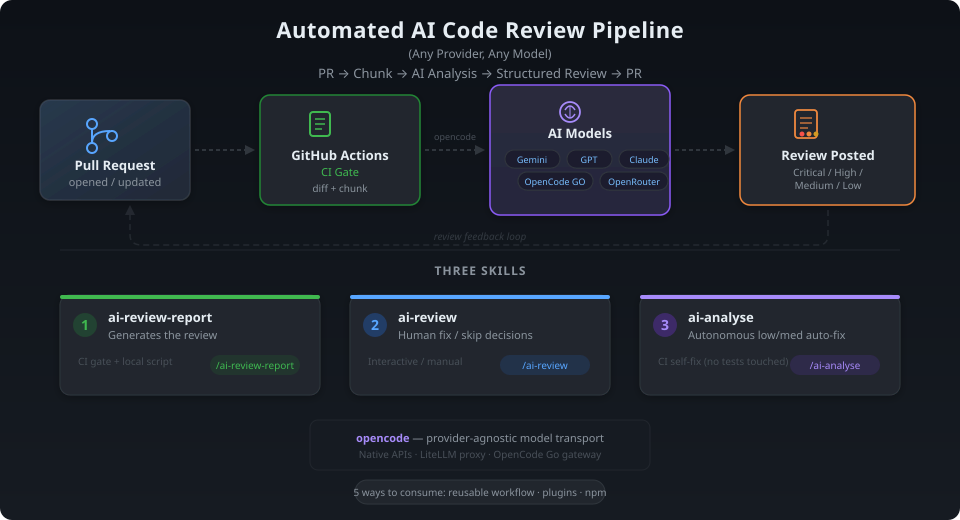

# AI Review Report

## TL;DR

Automated, AI-driven pull-request code review. A GitHub Actions gate diffs each PR, splits the changes into context-aware chunks, and runs them through the [OpenCode](https://opencode.ai/) CLI — the provider-agnostic model transport — which calls the configured LLM at whatever endpoint the selected provider points to: a LiteLLM proxy, a provider's native API (Google Gemini, OpenAI, Anthropic), or OpenCode's own gateway (OpenCode Go). The gate then posts one consolidated review back to the PR — an executive summary plus collapsible per-chunk detail, with findings categorized by priority (Critical / High / Medium / Low). Runs automatically on PRs and on demand via `/ai-review`.

Three review skills back it:
- **`ai-review-report`** — generates the review (the CI gate; also runnable locally).
- **`ai-review`** — consumes a posted review and applies fix/skip decisions (`/ai-review`).
- **`ai-analyse`** — autonomous CI fixer for gate-authored low/medium findings (`/ai-analyse` when used interactively).

Implementation details and decisions live in [`.agents/skills/ai-review-report/SKILL.md`](.agents/skills/ai-review-report/SKILL.md).

<p align="center">
  
</p>

## Five ways to consume this repo

| Channel | What you get | Best for |
|---|---|---|
| [Reusable workflow](#use-as-a-reusable-workflow) | The CI gate via a ~80-line caller workflow; scripts fetched at run time, version-pinned | Repos that want the gate with minimal footprint and easy upgrades (`@v1`) |
| [Local-job packaging](#local-job-packaging-allowed-actions-restricted-consumers) | A consumer-side job whose only `uses:` entries are `actions/checkout`; the gate's code is fetched at a pinned SHA. Same behavior as the reusable workflow. | Repos under `allowed_actions: "selected"` whose `generic-automation-and-it` is not on the allow-list |
| [Claude Code plugins](#install-as-a-claude-code-plugin) | A core plugin (`ai-review`, `git-commit-review-push`) plus optional plugins for `ai-review-report` and `ai-analyse` — **not** the CI gate | Developers who want the follow-up workflows by default and can opt into the heavier report/analyse skills only when needed |
| [opencode plugin (npm)](#install-as-an-opencode-plugin-npm) | The same four skills for **opencode** users — linked into `.agents/skills/` at startup, nothing vendored (GitHub Packages registry: needs a one-time `read:packages` PAT per developer) | Repos/developers driving the skills from opencode instead of Claude Code |
| [npm package in GitHub Actions](#use-in-github-actions-via-npm) | The **same npm package**, but `npm install`ed in a GHA job and run straight from `node_modules/` (no vendoring, no side checkout) | Repos that want to run the review generator in CI pinned via a package manager / lockfile |
| [Copy-install](#copy-install-vendor-everything) | Workflow + skills copied into the repo; everything editable in place | Repos that customize the gate or vendor everything |

The channels coexist: a repo can use the reusable workflow for CI while developers install the plugin for `/ai-review`. To set up a repo end-to-end (gate + skills + credentials), follow [Install into another repo (AI-agent driven)](#install-into-another-repo-ai-agent-driven) — its default path is the reusable workflow + the plugin at project scope.

## Use as a reusable workflow

Instead of copy-installing the 1,400-line gate, call it as a [reusable workflow](https://docs.github.com/en/actions/using-workflows/reusing-workflows). Copy [`.docs/examples/code-review-caller.yml`](.docs/examples/code-review-caller.yml) into your repo as `.github/workflows/pipeline-code-review-report.yml` — it carries the triggers, permissions, concurrency, and the `model_preset` dispatch dropdown, and delegates the job:

```yaml
jobs:
  review:
    uses: generic-automation-and-it/smooth-ai-report-review/.github/workflows/pipeline-code-review-report.yml@v1
    with:
      pr_number: ${{ inputs.pr_number || '' }}
      model: ${{ inputs.model || '' }}
      model_preset: ${{ inputs.model_preset || '(repository default)' }}
      disable_claude_code: ${{ inputs.disable_claude_code || vars.OPENCODE_REVIEW_REPORT_DISABLE_CLAUDE_CODE || '1' }}
      disable_agents_md_check: ${{ inputs.disable_agents_md_check || vars.OPENCODE_REVIEW_REPORT_DISABLE_AGENTS_MD_CHECK || '0' }}
      bypass_mandatory_context_file: ${{ inputs.bypass_mandatory_context_file || vars.OPENCODE_REVIEW_REPORT_BYPASS_MANDATORY_CONTEXT_FILE || '' }}
    # Explicit mapping works same-org AND cross-org. The template lists all seven keys;
    # only the selected provider's needs to exist. Same-org callers may instead use
    # `secrets: inherit`, but that fails at startup when the gate is in another org.
    secrets:
      OPENCODE_GEMINI_API_KEY: ${{ secrets.OPENCODE_GEMINI_API_KEY }}
      # … plus the other provider keys (see code-review-caller.yml)
```

How it works:
- **Scripts are fetched, not installed.** The called workflow detects that your repo has no `ai-review-report` skill and checks out this repo into a `.smooth-ai-review-tools/` side path, locked by default to the exact commit of the workflow file you called (`github.job_workflow_sha`). If your repo *does* have the skill installed (copy-install), the local copy wins — no fetch.
- **Overriding the tooling ref.** Use the `tools_ref` input or the `SMOOTH_AI_REVIEW_TOOLS_REF` Variable, and give it one of two things: a **full commit SHA** if you want supply-chain pinning, or a **trusted floating ref** (`main`, `latest`, or a version tag like `v1`) if you want to track releases. Pointing it at a branch is not supported.
- **Secrets**: map the provider keys explicitly under `secrets:` (the [caller template](.docs/examples/code-review-caller.yml) lists all seven `OPENCODE_*_API_KEY` names; only the selected provider's must exist). The explicit form works whether your repo is in the **same** org as the gate or a **different** one. `secrets: inherit` is a shorter shortcut but GitHub only honors it **same-org/enterprise** — a cross-org caller using `inherit` fails immediately with a "workflow file issue" startup error.
- **Variables**: `vars.OPENCODE_REVIEW_REPORT_*` resolve against **your** repo/org automatically — configure them exactly as in [GitHub configuration](#github-configuration); Steps 3–4 of the installer section apply unchanged. If you also copy in the optional autonomous analyse workflow, it reads `OPENCODE_ANALYSE_PROVIDER`, `OPENCODE_ANALYSE_MODEL`, `OPENCODE_ANALYSE_MAX_INCREMENTAL`, and `OPENCODE_ANALYSE_ALLOW_TEST_SELF_FIX` from the consuming repo too.
- **Inputs**: `runner` (default `ubuntu-latest`; set `self-hosted` for private-network gateways), `tools_ref`, `mandatory_context_files` / `agents_md_exempt_paths` (override the context lists without editing any workflow), `disable_claude_code`, `disable_agents_md_check`, `bypass_mandatory_context_file`, plus the dispatch passthroughs `pr_number` / `model` / `model_preset`.
- **Versioning**: pin `@v1` (floating major) or an exact tag/SHA. The source repo maintains the floating major tag (e.g. `v1`, `v2`) via `.github/workflows/update-major-tag.yml` on every merge to `main` (and via manual dispatch when a repair/repoint is needed) — the tag name is derived automatically from the major component of `package.json`'s version, so bumping the major version produces a new floating tag on the next merge. The `model_preset` dropdown options in your caller must match the preset mapping in the called workflow — when a release adds presets, update your caller to expose them.

## Local-job packaging (allowed-actions-restricted consumers)

Some consumers cannot call the reusable workflow. GitHub Actions has two orthogonal third-party controls: an **allow-list** (`allowed_actions: "selected"`) that names which `actions/*`, `github/*`, composite, and reusable-workflow `uses:` refs are accepted, and **SHA pinning** (`sha_pinning_required: true`) that constrains the ref format. A cross-org reusable-workflow call must satisfy *both*. The allow-list is evaluated per owner/repo — `generic-automation-and-it/smooth-ai-report-review` is third-party by default, and an org admin must explicitly add it to the allow-list. A consumer that runs under `allowed_actions: "selected"` with `generic-automation-and-it` not on its list sees `startup_failure` (0 jobs) for every cross-org reusable-workflow call, even when SHA-pinning is satisfied — the two checks are independent.

If your org admin has refused or stalled the request to add `generic-automation-and-it/smooth-ai-report-review@*` to the allow-list, you need a **local-job** caller. The example [`.docs/examples/code-review-local.yml`](.docs/examples/code-review-local.yml) is a consumer-side workflow whose only `uses:` entries are `actions/checkout@<sha>` (already allow-listed by every org with `github_owned_allowed: true`), and which checks out this repo at a pinned SHA into `.review-tools/` before invoking the same [`run-review.sh`](.agents/skills/ai-review-report/scripts/run-review.sh) entrypoint the reusable-workflow packaging uses. The job body:

```yaml
jobs:
  review:
    # See the full gating in .docs/examples/code-review-local.yml
    # (dependabot + draft + /ai-review on PR + OWNER/MEMBER/COLLABORATOR).
    # This inline snippet omits the `if:` block for brevity — copy the
    # full `if:` expression from that example rather than from here.
    runs-on: ubuntu-latest
    steps:
      - uses: actions/checkout@<sha>            # the PR
      - uses: actions/checkout@<sha>            # the gate, pinned SHA
        with:
          repository: generic-automation-and-it/smooth-ai-report-review
          ref: <pinned-sha>
          path: .review-tools
      - name: Run review gate
        env:
          REVIEW_SKILL_DIR: .review-tools/.agents/skills/ai-review-report
          GITHUB_TOKEN: ${{ secrets.GITHUB_TOKEN }}     # required — bare run: shells do not auto-inject
          # OPENCODE_REVIEW_REPORT_PROVIDER, the seven OPENCODE_*_API_KEY Secrets,
          # the per-provider URL Variables, OPENCODE_REVIEW_REPORT_MODEL_{PRIMARY,
          # SECONDARY,ORCHESTRATOR} — model IDs, one per tier. The reusable
          # caller's model_preset dropdown is not available here; set the IDs
          # directly as Variables (see Environment variables below).
          # MANDATORY_CONTEXT_FILES, AGENTS_MD_EXEMPT_PATHS,
          # OPENCODE_REVIEW_REPORT_DISABLE_CLAUDE_CODE,
          # OPENCODE_REVIEW_REPORT_DISABLE_AGENTS_MD_CHECK,
          # OPENCODE_REVIEW_REPORT_BYPASS_MANDATORY_CONTEXT_FILE,
          # OPENCODE_REVIEW_REPORT_MAX_FILE_COUNT,
          # OPENCODE_CLI_VERSION,
          # OPENCODE_TOOL_CODE_REVIEW_GRAPH_VERSION,
          # OPENCODE_TOOL_RTK_VERSION,
          # OPENCODE_REVIEW_REPORT_CONFIG (LADR-047). See the full env:
          # block in .docs/examples/code-review-local.yml.
        run: bash "$REVIEW_SKILL_DIR/scripts/run-review.sh"
```

How it works:
- **Same behaviour, two packagings.** `run-review.sh` is the gate's single source of truth. The reusable workflow's job body is now a thin wrapper around it (checkout PR head → fetch review tooling into `.smooth-ai-review-tools/` → call `run-review.sh`). The local-job caller is the same wrapper minus the wrapping — both resolve the same env-var contract and post the same reviews.
- **`uses:` level only.** The allow-list checks `uses:` references (not the git URLs a script subsequently `git clone`s, and not action inputs). The two `actions/checkout` steps pass the allow-list; the gate's own code arrives via the second `actions/checkout`'s `ref:` (the SHA you pin) — exactly the supply-chain surface the policy is meant to govern.
- **SHA-pin everything.** The whole point of the local-job packaging is to preserve the supply-chain guarantee. Pin both `actions/checkout@<sha>` and the upstream `ref: <pinned-sha>`. The example pins the upstream ref to a specific commit; bump it in lockstep with upstream releases you want to consume. **Do not use a floating tag (`@v1`) here** — that would defeat the point.
- **Same config as the reusable caller.** `OPENCODE_REVIEW_REPORT_PROVIDER`, the seven `OPENCODE_*_API_KEY` Secrets, the per-provider URL Variables, the `OPENCODE_REVIEW_REPORT_MODEL_{PRIMARY,SECONDARY,ORCHESTRATOR}` Variables, `MANDATORY_CONTEXT_FILES`, `AGENTS_MD_EXEMPT_PATHS`, `OPENCODE_REVIEW_REPORT_DISABLE_CLAUDE_CODE`, `OPENCODE_REVIEW_REPORT_DISABLE_AGENTS_MD_CHECK`, `OPENCODE_REVIEW_REPORT_BYPASS_MANDATORY_CONTEXT_FILE`, `OPENCODE_REVIEW_REPORT_MAX_FILE_COUNT`, `OPENCODE_CLI_VERSION`, `OPENCODE_TOOL_CODE_REVIEW_GRAPH_VERSION`, `OPENCODE_TOOL_RTK_VERSION`, and `OPENCODE_REVIEW_REPORT_CONFIG` (LADR-047) are all set in the job `env:` block the same way as the reusable-workflow caller. The reusable-workflow `runner`, `tools_ref`, `mandatory_context_files`, `agents_md_exempt_paths`, and `opencode_config` inputs map to the same names as Variables — set the corresponding GitHub Variables (see [Environment variables](#environment-variables) for the full reference, e.g. `OPENCODE_REVIEW_REPORT_DISABLE_AGENTS_MD_CHECK`) in your repo/org; the local-job caller has no `inputs:` contract for them.
- **Three trigger shapes still supported.** The entrypoint reads `$GITHUB_EVENT_PATH` (a JSON payload GitHub writes automatically) rather than from expression interpolation, so `pull_request`, `issue_comment` with `/ai-review`, and `workflow_dispatch` all work the same way as in the reusable workflow.

### ⚠️ Security sign-off required

The local-job packaging is **technically compliant** with `allowed_actions: "selected"` and `sha_pinning_required: true` — the `uses:` references are `actions/checkout` and the third-party code is fetched at a pinned SHA. But the policy's *purpose* is to make third-party code reviewable, and a local job that fetches the same third-party code via an allow-listed `actions/checkout` step runs exactly what the policy meant to gate. The local-job packaging is **contrary to the spirit of the allow-list policy**, even though it passes the letter. Before adopting it:

- Confirm with your org/enterprise admin that adding `generic-automation-and-it/smooth-ai-report-review@*` to the allow-list is not an option (the allow-list exists for reviewability; this packaging opts out of that reviewability).
- Document the deviation in your security sign-off: the upstream repo, the pinned SHA, the audit trail for the pin choice, and the monitoring story for upstream changes.
- Pin the upstream `ref:` to a **specific commit SHA**, not a tag — and bump it as a deliberate, reviewable change rather than auto-updating.

If your org admin can add the allow-list entry, prefer the [reusable workflow](#use-as-a-reusable-workflow) — it is materially easier to audit (one `uses:` line, one org-level review) and matches the policy's intent.

## Install as a Claude Code plugin

This repo's Claude marketplace is intentionally split:
- **`smooth-ai-review`** is the default/core plugin and includes `ai-review` plus `git-commit-review-push`.
- **`smooth-ai-review-report`** is an optional add-on for the review generator / local driver.
- **`smooth-ai-analyse`** is an optional add-on for the autonomous low/medium fixer.

Install the marketplace, then install the core plugin:

```
/plugin marketplace add generic-automation-and-it/smooth-ai-report-review
/plugin install smooth-ai-review@smooth-ai-report-review
```

Optional installs when you want the heavier review-generator skills inside Claude Code too:

```bash
/plugin install smooth-ai-review-report@smooth-ai-report-review
/plugin install smooth-ai-analyse@smooth-ai-report-review
```

That installs at **user scope** (your machine, all repos). To tie the default follow-up skills to one repo for every collaborator instead, enable the core plugin at **project scope** in that repo's `.claude/settings.json` — see [Step 2 of the installer](#step-2--enable-the-skills-repo-locally-plugin-project-scope). Add the optional plugins there too only if that repo wants local report generation and/or `/ai-analyse`.

Notes:
- The plugin installs **skills only** — it does **not** install the CI gate. Pair it with the [reusable workflow](#use-as-a-reusable-workflow) (or the copy-installer) for PR-gate coverage.
- When running from the plugin, skill scripts live under the plugin install dir: substitute `${CLAUDE_PLUGIN_ROOT}/.agents/skills/<skill>` wherever a skill doc says `.agents/skills/<skill>` (the `ai-review` skill documents this in its SKILL.md).
- The marketplace entries load skills straight from `.agents/skills/` (the canonical location) via explicit `skills` paths in `.claude-plugin/marketplace.json` — no `skills/` symlink involved, so the plugin install works on Windows without symlink support.

## Install as an opencode plugin (npm)

opencode has no skill marketplace — it discovers skills only from fixed directories (`.agents/skills/`, `.claude/skills/`, `.opencode/skills/`) — but it auto-installs npm plugins. The package **`@generic-automation-and-it/smooth-ai-review`** uses that: at every opencode startup it links the four skills into your repo's `.agents/skills/`, so opencode's native discovery (and every `.agents/skills/...` path the skill docs reference) just works, with nothing vendored.

The package is hosted on the **GitHub Packages npm registry**, which [requires authentication even for public packages](https://docs.github.com/en/packages/working-with-a-github-packages-registry/working-with-the-npm-registry) — each developer needs a one-time setup:

1. Create a GitHub personal access token (classic) with the **`read:packages`** scope.
2. Add the registry mapping + token to your **user** `~/.npmrc` (not the repo's — the token must never be committed):

   ```ini
   @generic-automation-and-it:registry=https://npm.pkg.github.com
   //npm.pkg.github.com/:_authToken=ghp_YOUR_TOKEN
   ```

Then add one line to the consuming repo's `opencode.json`:

```json
{ "plugin": ["@generic-automation-and-it/smooth-ai-review"] }
```

How it works:
- opencode `bun install`s the package at startup (cached in `~/.cache/opencode/`) — Bun honors the `~/.npmrc` registry + token mapping. The plugin then creates `.agents/skills/{ai-review-report,ai-review,ai-analyse,git-commit-review-push}` as directory links into that cache (junction links — no admin rights needed on Windows).
- **Vendored copies always win**: if a skill already exists as a real directory (copy-install), the plugin never touches it. Stale links (e.g. after a package update moved the cache) are re-pointed automatically.
- Your `git status` stays clean: the link paths are appended to `.git/info/exclude` (local-only — your `.gitignore` is never edited).
- The package ships the skills **without** the eval harness (`scripts/eval/` is excluded).
- Like the Claude Code plugin, this installs **skills only** — pair it with the [reusable workflow](#use-as-a-reusable-workflow) for the CI gate (the gate itself never needs this plugin; in reusable mode it fetches its own scripts).
- If the skills don't appear in the very first session after install, restart opencode once — the links are created at session init.

## Use in GitHub Actions via npm

The [opencode plugin package](#install-as-an-opencode-plugin-npm) `@generic-automation-and-it/smooth-ai-review` ships the full skill trees (`.agents/skills/…`, minus the eval harness) in its tarball — not just the opencode startup hook. That means you can `npm install` it in a GitHub Actions job and run the review scripts straight out of `node_modules/`, with **nothing vendored** into your repo and **no side checkout**. This is a distinct consumption path from the [reusable workflow](#use-as-a-reusable-workflow) (which fetches scripts into `.smooth-ai-review-tools/` at run time); the reusable workflow stays the recommended default and needs no registry auth.

Ready-to-copy workflow: [`.docs/examples/npm-review-report-gha.yml`](.docs/examples/npm-review-report-gha.yml). It installs the package + the opencode CLI, then runs the `ai-review-report` generator (`local-review.sh --pr <n> --post`) against the PR.

Key points specific to the npm-in-CI path:
- **Registry auth.** The package lives on the GitHub Packages npm registry, which requires a token even though it's public. Same-org runs can use the run-scoped `GITHUB_TOKEN` (grant `packages: read` in the workflow's `permissions:`). Cross-org runs must supply a classic PAT with the `read:packages` scope as a secret — the example reads `PACKAGES_READ_TOKEN` and falls back to `GITHUB_TOKEN`.
- **Repo-root override.** The scripts normally derive the repo under review from their own location. Run from `node_modules/`, that would point at the package, so set **`OPENCODE_REVIEW_REPORT_REPO_ROOT: ${{ github.workspace }}`** (see the [Environment variables](#environment-variables) table). The example does this.
- **Prerequisites** match [Using Local Report](#using-local-report): the opencode CLI (`curl -fsSL https://opencode.ai/install | bash`), `jq` and `gh` (both preinstalled on `ubuntu-latest`), and the selected provider's credentials/model vars — configure them exactly as for the gate.
- **Versioning.** Pin an exact version (`npm i @generic-automation-and-it/smooth-ai-review@1.2.3`) for reproducible reviews; the runtime publish numbering makes every published version immutable.
- **`ai-analyse`** ships in the same tarball (its `SKILL.md`/`AGENTS.md` plus the shared `ai-review-report/scripts/lib/` helpers it reuses — it has no standalone scripts of its own). Its autonomous fix loop is orchestrated by `.github/workflows/pipeline-ai-analyse.yml`, so consume it by copy-installing that workflow rather than a single CLI entrypoint.
- Like the plugins, this installs **review tooling only** — it does not register the `/ai-review` or `/ai-analyse` skills into Claude Code/opencode; use the plugin channels for that.

## Install into another repo (AI-agent driven)

These steps are written for an **AI coding agent running in the _target_ repo**. Point it at this README — best via the **raw** URL (`https://raw.githubusercontent.com/generic-automation-and-it/smooth-ai-report-review/main/README.md`), which returns clean Markdown; a `blob/…#install-into-another-repo-ai-agent-driven` link also works but serves HTML.

The default install vendors **nothing**: the CI gate comes in as a thin [reusable-workflow](#use-as-a-reusable-workflow) caller, and the skills come in as the [Claude Code plugin](#install-as-a-claude-code-plugin) enabled **repo-locally** (project scope — the skills follow the repo for every collaborator, not one developer's machine). To copy the full workflow and skill trees into the repo instead, use [Copy-install (vendor everything)](#copy-install-vendor-everything).

> **If you are that AI agent and the operator said "install this":** execute Steps 1–2 below **now**, in the current repository — do not merely summarize them. Run them from the repo root. Do **not** enter any API key yourself: stop at Step 3, ask the operator which provider to use, and output the exact Secret/Variable names for them to set.

**Source repo:** `generic-automation-and-it/smooth-ai-report-review` (branch `main`).

**What gets installed:**
1. **Remote report**: a ~80-line caller workflow → `.github/workflows/pipeline-code-review-report.yml`, delegating to this repo's reusable gate at `@v1` (the floating major tag is maintained from this repo's `main` branch; review scripts are fetched at run time — no skill trees land in the repo).
2. **Local follow-up tooling**: the `smooth-ai-review` plugin (the core `ai-review` + `git-commit-review-push` skills) enabled at **project scope** in `.claude/settings.json` — collaborators who trust the repo folder are prompted to install it automatically.
3. **Optional local extras**: if the repo also wants the local review generator and/or autonomous fixer in Claude Code, enable `smooth-ai-review-report` and/or `smooth-ai-analyse` from the same marketplace.

### Step 1 — install the review gate (reusable-workflow caller)

Run this **from the target repo's root**. If a previous **copy-installed** gate exists (the full 1,400-line workflow), it is stashed for diffing and replaced by the caller:

```bash
set -e
command -v git >/dev/null || { echo "✗ git not found"; exit 1; }
ROOT="$(git rev-parse --show-toplevel 2>/dev/null)" || { echo "✗ run this inside the target git repository"; exit 1; }
cd "$ROOT"

WF=".github/workflows/pipeline-code-review-report.yml"

# Stash any prior gate (copy-installed or older caller) for delta analysis and
# remember its runs-on so a self-hosted runner choice survives the migration.
PREV_SAVE="$(git rev-parse --git-dir)/ci-prev-workflow.yml"
OLD_RO=""
if [ -f "$WF" ]; then
  cp "$WF" "$PREV_SAVE"
  OLD_RO="$(grep -m1 -E '^[[:space:]]*runs-on:' "$PREV_SAVE" | sed -E 's/^[[:space:]]*runs-on:[[:space:]]*//')"
fi

mkdir -p .github/workflows
curl -fsSL "https://raw.githubusercontent.com/generic-automation-and-it/smooth-ai-report-review/main/.docs/examples/code-review-caller.yml" -o "$WF"

grep -q 'smooth-ai-report-review/.github/workflows/pipeline-code-review-report.yml@' "$WF" \
  && echo "✓ caller workflow installed at $WF" \
  || { echo "✗ caller download failed or incomplete"; exit 1; }

case "$OLD_RO" in
  ''|ubuntu-latest|*'{{'*) ;;  # nothing to carry over
  *) echo "↻ previous gate ran on '$OLD_RO' — set \"runner: $OLD_RO\" under the caller's with: block" ;;
esac
```

**If `$PREV_SAVE` was created**, the repo is migrating from a copy-install: show the operator `diff -u "$PREV_SAVE" "$WF"`, re-express any prior workflow customizations as caller inputs (`runner`, `tools_ref`, `mandatory_context_files`, `agents_md_exempt_paths`, `disable_agents_md_check`, `bypass_mandatory_context_file`), and offer to delete the now-redundant vendored skill trees (`<skills-dir>/ai-review-report` and `<skills-dir>/ai-review`) — the reusable gate fetches its own scripts. Leaving them in place also works: same-repo PRs prefer a local skill tree over the fetched one, while fork PRs force pinned fetched tooling. The same local-then-fetched precedence applies to `pipeline-ai-analyse.yml` when it is copied into the consumer repo.

### Step 2 — enable the skills repo-locally (plugin, project scope)

Register the marketplace and enable the plugin in the target repo's `.claude/settings.json` so the skills are tied to the repo — every collaborator who trusts the folder is prompted to install them:

```bash
set -e
command -v jq >/dev/null || { echo "✗ jq needed to merge .claude/settings.json"; exit 1; }
mkdir -p .claude
SETTINGS=.claude/settings.json
[ -f "$SETTINGS" ] || echo '{}' > "$SETTINGS"
jq '.extraKnownMarketplaces["smooth-ai-report-review"] =
      {"source":{"source":"github","repo":"generic-automation-and-it/smooth-ai-report-review"}}
    | .enabledPlugins["smooth-ai-review@smooth-ai-report-review"] = true' \
  "$SETTINGS" > "$SETTINGS.tmp" && mv "$SETTINGS.tmp" "$SETTINGS"
echo "✓ smooth-ai-review plugin enabled at project scope ($SETTINGS)"
```

Notes:
- Interactive equivalent (from inside Claude Code in the repo): `/plugin marketplace add generic-automation-and-it/smooth-ai-report-review`, then `claude plugin install smooth-ai-review@smooth-ai-report-review --scope project`.
- Optional project-scope add-ons: `claude plugin install smooth-ai-review-report@smooth-ai-report-review --scope project` and `claude plugin install smooth-ai-analyse@smooth-ai-report-review --scope project`.
- For a **global** (all-repos, single-developer) install use user scope instead — see [Install as a Claude Code plugin](#install-as-a-claude-code-plugin). Project scope is the default here because the review skills belong with the repo.
- Commit both artifacts: the caller workflow and `.claude/settings.json`.

### Step 2b — local report behavior for AI agents

This is the local counterpart to the remote CI report. The generator is **`ai-review-report`**, not `/ai-review` (which consumes an already-posted review).

If the operator asks for a local/localized report, invoke:

```text
ai-review-report --local
```

Bare `--local` is fully specified. Do **not** ask for a PR number, provider, post mode, or base branch unless the operator explicitly asks for a non-default. It means:
- review HEAD/current branch against `main`
- do not post back to GitHub
- use `OPENCODE_REVIEW_REPORT_PROVIDER` from the shell if set, otherwise `GEMINI`
- use the local runner's model defaults unless `--model` or model env vars are supplied

For direct shell execution in a copy-installed repo, the equivalent is:

```bash
.agents/skills/ai-review-report/scripts/local-review.sh
```

Local reports need local credentials and tools. At minimum for the default Gemini provider:

```bash
export OPENCODE_GEMINI_API_KEY="..."
# optional — only when overriding the default gateway URL:
# export OPENCODE_REVIEW_REPORT_GEMINI_URL="https://generativelanguage.googleapis.com/v1beta/openai"
```

Also ensure `opencode` and `jq` are installed locally. `gh` is only needed for local `--pr NUMBER` metadata fetches or `--post`.

For a non-Gemini local provider, export the same provider selector, API-key, optional gateway URL, and three model variables listed in [Step 3](#step-3--ask-which-provider-then-output-the-config-to-add), but as shell environment variables instead of GitHub Secrets/Variables.

### Copy-install (vendor everything)

Use this **instead of Steps 1–2** only when the target repo must edit the gate or skills in place. It copies the full workflows plus the three review skills out of this repo; Steps 3–4 below apply afterwards exactly the same.

**What gets installed:**
1. The gate workflow → `.github/workflows/pipeline-code-review-report.yml`.
2. The autonomous analyse workflow → `.github/workflows/pipeline-ai-analyse.yml`.
3. The `ai-review-report` skill → `<skills-dir>/ai-review-report/`, **excluding `scripts/eval/`** (the eval harness is for developing this skill, not for running the gate).
4. The `ai-review` skill → `<skills-dir>/ai-review/` (the local `/ai-review` companion that **consumes** a posted review and applies fix/skip decisions).
5. The `ai-analyse` skill → `<skills-dir>/ai-analyse/` (the autonomous low/medium fixer used by the analyse workflow and discoverable as `/ai-analyse`).

> **One skills dir, no per-agent copies or symlinks.** All review skills install into a single `<skills-dir>`, chosen by priority — the first existing of `.agents/skills`, `.ai/skills`, `.claude/skills`, `.codex/skills`; if none exist, `.agents/skills`. Because the workflows call scripts by path, when `<skills-dir>` is **not** `.agents/skills` the script repoints hardcoded `.agents/skills/ai-review…` and `.agents/skills/ai-analyse…` references to the chosen dir; target-repo context paths (`.agents/rules/…`, `.docs/…`, `code-review-standards`) are left untouched. The scripts find their own siblings by relative path, so they work unchanged from any of these dirs.

Run this **from the target repo's root**. It refuses to run anywhere else, detects whether the gate already exists (→ `update`) or not (→ `install`), copies the files, and verifies the result — failing loudly on a partial copy. On **update** it finds a prior gate under either the canonical `pipeline-…` or the legacy `pipline-…` filename, carries over your existing `runs-on`, replaces the legacy name with the canonical one, and prints the old→new workflow diff for review.

```bash
set -e

# Preflight: must be inside the target git repo, with git available.
command -v git >/dev/null || { echo "✗ git not found"; exit 1; }
ROOT="$(git rev-parse --show-toplevel 2>/dev/null)" || { echo "✗ run this inside the target git repository"; exit 1; }
cd "$ROOT"

WF=".github/workflows/pipeline-code-review-report.yml"    # canonical gate name
ANALYSE_WF=".github/workflows/pipeline-ai-analyse.yml"    # autonomous low/medium fixer
WF_OLD=".github/workflows/pipline-code-review-report.yml" # legacy typo'd name from older installs

# Pick the ONE skills dir to install into, by priority: the first that already
# exists, else .agents. No per-agent copies or symlinks are created.
DEST=".agents"
for d in .agents .ai .claude .codex; do
  if [ -d "$d/skills" ]; then DEST="$d"; break; fi
done
echo "Skills dir: $DEST/skills"

# Find an existing gate (canonical OR legacy name) and stash it for delta analysis.
PREV=""
for w in "$WF" "$WF_OLD"; do [ -f "$w" ] && { PREV="$w"; break; }; done
PREV_SAVE="$(git rev-parse --git-dir)/ci-prev-workflow.yml"
[ -n "$PREV" ] && cp "$PREV" "$PREV_SAVE"

# Detect install vs update: update if a prior gate OR skill tree exists.
if [ -n "$PREV" ] || [ -d "$DEST/skills/ai-review-report" ] || [ -d "$DEST/skills/ai-review" ] || [ -d "$DEST/skills/ai-analyse" ]; then
  MODE="update"
else
  MODE="install"
fi
echo "Mode: $MODE"

# Fetch the source (public repo; --depth 1 is enough).
SRC="$(mktemp -d)"
git clone --depth 1 https://github.com/generic-automation-and-it/smooth-ai-report-review.git "$SRC"

# On update, remove existing skill trees first so files deleted upstream don't linger.
if [ "$MODE" = update ]; then
  rm -rf "$DEST/skills/ai-review-report" "$DEST/skills/ai-review" "$DEST/skills/ai-analyse"
fi

# 1) workflows → canonical names; drop any legacy typo'd gate so there's exactly one gate.
mkdir -p .github/workflows
cp "$SRC/$WF" "$WF"
cp "$SRC/$ANALYSE_WF" "$ANALYSE_WF"
[ -f "$WF_OLD" ] && rm -f "$WF_OLD"

# 2) the three review skills — into the chosen dir
mkdir -p "$DEST/skills"
cp -R "$SRC/.agents/skills/ai-review-report" "$DEST/skills/"
cp -R "$SRC/.agents/skills/ai-review"        "$DEST/skills/"
cp -R "$SRC/.agents/skills/ai-analyse"       "$DEST/skills/"

# exclude the eval harness — not needed to run the gate
rm -rf "$DEST/skills/ai-review-report/scripts/eval"

# 3) when NOT installing under .agents, repoint the gate's hardcoded skill paths
#    (the workflow's refs + setup-opencode-config.sh's opencode.json path) at $DEST.
#    Scoped to the literal '.agents/skills/ai-review' so target-repo context paths
#    (.agents/rules/…, .docs/…, code-review-standards) are left untouched.
if [ "$DEST" != ".agents" ]; then
  command -v perl >/dev/null || { echo "✗ perl needed to repoint paths for $DEST/skills"; exit 1; }
  # The 'unless' guard skips the workflow's reusable-mode lines (the
  # .smooth-ai-review-tools side-checkout path) — dead code in a copy-install,
  # and rewriting them would corrupt the fetched-tooling path.
  find "$WF" "$ANALYSE_WF" "$DEST/skills/ai-review-report" "$DEST/skills/ai-review" "$DEST/skills/ai-analyse" -type f \
    -exec perl -i -pe "unless (m{\.smooth-ai-review-tools}) { s{\.agents/skills/ai-review}{$DEST/skills/ai-review}g; s{\.agents/skills/ai-analyse}{$DEST/skills/ai-analyse}g; }" {} +
fi

# 4) update only: carry over the previous gate's runs-on (e.g. self-hosted) and show the delta
#    so the agent can ask the operator which other prior customizations to re-introduce.
if [ "$MODE" = update ] && [ -n "$PREV" ]; then
  command -v perl >/dev/null || { echo "✗ perl needed to preserve runs-on"; exit 1; }
  OLD_RO="$(grep -m1 -E '^[[:space:]]*runs-on:' "$PREV_SAVE" | sed -E 's/^[[:space:]]*runs-on:[[:space:]]*//')"
  if [ -n "$OLD_RO" ]; then
    OLD_RO="$OLD_RO" perl -i -pe 'if(!$d && /^(\s*)runs-on:/){$_="$1runs-on: $ENV{OLD_RO}\n";$d=1}' "$WF"
    echo "↻ carried over previous runs-on: $OLD_RO"
  fi
  echo "=== Δ previous gate ($PREV) → new gate (runs-on already merged) ==="
  diff -u "$PREV_SAVE" "$WF" || true
  echo "(previous workflow saved at $PREV_SAVE)"
fi

rm -rf "$SRC"

# Verify — fail loudly on a partial copy instead of reporting success.
# Assert a deep runtime script too (not just SKILL.md): the gate's first call is
# setup-opencode-config.sh, so a truncated copy must fail HERE, not on the runner.
test -f "$WF" \
 && test -f "$ANALYSE_WF" \
 && test -f "$DEST/skills/ai-review-report/SKILL.md" \
 && test -f "$DEST/skills/ai-review/SKILL.md" \
 && test -f "$DEST/skills/ai-analyse/SKILL.md" \
 && test -f "$DEST/skills/ai-review-report/scripts/lib/setup-opencode-config.sh" \
 && test ! -e "$DEST/skills/ai-review-report/scripts/eval" \
 && echo "✓ $MODE complete ($DEST/skills)" || { echo "✗ install incomplete — check output above"; exit 1; }
```

**Then message the operator using `$MODE`:**
- `install` → "**Installed** the AI review gate and analyse workflow (`ai-review-report`, `ai-review`, and `ai-analyse` under `$DEST/skills`)."
- `update` → "**Updated** the existing AI review gate." The block printed an old→new workflow **diff** and already carried over your previous `runs-on`. **Present that diff to the operator as a table** — columns `id | change` — and **ask which of the remaining old customizations to re-introduce** into the new workflow before committing (the freshly-copied file is canonical otherwise; a legacy `pipline-…` gate is replaced by the canonical `pipeline-…` name). Then have them review `git diff` before committing — an update can change workflow steps, scripts, or the `opencode.json` provider config.

> The workflow's `MANDATORY_CONTEXT_FILES` list points at product-repo paths (e.g. `.docs/nfr/…`, `.agents/rules-scoped/backend/…`). Any that don't exist in the target **warn-and-skip** — the gate still runs. Trim that `env:` list in the workflow to the target repo's real context files when convenient.

### Step 3 — ask which provider, then output the config to add

Applies to both the default install and the copy-install. **Ask the operator which model provider to use**, then tell them exactly which GitHub **Secrets** and **Variables** to add under **Settings → Secrets and variables → Actions**. Resolve their answer against this matrix:

| Provider chosen | Add Secret (API key) | Add Variables |
|---|---|---|
| **Gemini** _(default)_ | `OPENCODE_GEMINI_API_KEY` | *(none required)* — optional: `OPENCODE_REVIEW_REPORT_GEMINI_URL` (default `https://generativelanguage.googleapis.com/v1beta/openai`) |
| **OpenAI** | `OPENCODE_OPENAI_API_KEY` | `OPENCODE_REVIEW_REPORT_PROVIDER=OPENAI`; `OPENCODE_REVIEW_REPORT_MODEL_PRIMARY=gpt-5.5`; `OPENCODE_REVIEW_REPORT_MODEL_SECONDARY=gpt-5.4`; `OPENCODE_REVIEW_REPORT_MODEL_ORCHESTRATOR=gpt-5.4-mini`; optional `OPENCODE_REVIEW_REPORT_OPENAI_URL` (default `https://api.openai.com/v1`) |
| **Anthropic** | `OPENCODE_ANTHROPIC_API_KEY` | `OPENCODE_REVIEW_REPORT_PROVIDER=ANTHROPIC`; `OPENCODE_REVIEW_REPORT_MODEL_PRIMARY=claude-opus-4-8`; `OPENCODE_REVIEW_REPORT_MODEL_SECONDARY=claude-sonnet-4-6`; `OPENCODE_REVIEW_REPORT_MODEL_ORCHESTRATOR=claude-haiku-4-5` — **no URL Variable** (base URL hardcoded) |
| **OpenCode Go — OpenAI** | `OPENCODE_GO_OPENAI_API_KEY` | `OPENCODE_REVIEW_REPORT_PROVIDER=OPENCODE-GO-OPENAI`; `OPENCODE_REVIEW_REPORT_MODEL_PRIMARY=deepseek-v4-pro`; `OPENCODE_REVIEW_REPORT_MODEL_SECONDARY=deepseek-v4-flash`; `OPENCODE_REVIEW_REPORT_MODEL_ORCHESTRATOR=glm-5.1` — **no URL Variable** (base URL hardcoded) |
| **OpenCode Go — Anthropic** | `OPENCODE_GO_ANTHROPIC_API_KEY` | `OPENCODE_REVIEW_REPORT_PROVIDER=OPENCODE-GO-ANTHROPIC`; `OPENCODE_REVIEW_REPORT_MODEL_PRIMARY=qwen3.7-plus`; `OPENCODE_REVIEW_REPORT_MODEL_SECONDARY=minimax-m2.7`; `OPENCODE_REVIEW_REPORT_MODEL_ORCHESTRATOR=minimax-m3` — **no URL Variable** (base URL hardcoded) |
| **OpenRouter** | `OPENCODE_OPENROUTER_API_KEY` | `OPENCODE_REVIEW_REPORT_PROVIDER=OPEN_ROUTER`; `OPENCODE_REVIEW_REPORT_MODEL_PRIMARY=deepseek/deepseek-v4-pro`; `OPENCODE_REVIEW_REPORT_MODEL_SECONDARY=qwen/qwen3.7-plus`; `OPENCODE_REVIEW_REPORT_MODEL_ORCHESTRATOR=deepseek/deepseek-v4-flash` — **no URL Variable** (base URL hardcoded). Models use a `vendor/` prefix; no Anthropic/OpenAI models declared. |

The agent must state these rules when emitting the config:
- **API keys are Secrets; everything else is a Variable.** Never store a key as a Variable (Variables are plaintext and printable in logs).
- **Any non-Gemini provider MUST set all three `OPENCODE_REVIEW_REPORT_MODEL_*` Variables.** The defaults are Gemini model IDs and the run **fails fast** if a `gemini*` model is left on another provider.
- Offer the equivalent `gh` commands rather than only describing the UI — copy-paste blocks per provider below (run inside the target repo, or add `--repo <owner>/<repo>`; `gh secret set` without a value prompts for it).

  **Gemini** _(default)_
  ```bash
  gh secret set OPENCODE_GEMINI_API_KEY
  # optional — only when overriding the default gateway URL:
  # gh variable set OPENCODE_REVIEW_REPORT_GEMINI_URL --body "https://generativelanguage.googleapis.com/v1beta/openai"
  ```

  **OpenAI**
  ```bash
  gh secret set OPENCODE_OPENAI_API_KEY
  gh variable set OPENCODE_REVIEW_REPORT_PROVIDER --body OPENAI
  gh variable set OPENCODE_REVIEW_REPORT_MODEL_PRIMARY --body gpt-5.5
  gh variable set OPENCODE_REVIEW_REPORT_MODEL_SECONDARY --body gpt-5.4
  gh variable set OPENCODE_REVIEW_REPORT_MODEL_ORCHESTRATOR --body gpt-5.4-mini
  # optional — only when overriding the default gateway URL:
  # gh variable set OPENCODE_REVIEW_REPORT_OPENAI_URL --body "https://api.openai.com/v1"
  ```

  **Anthropic**
  ```bash
  gh secret set OPENCODE_ANTHROPIC_API_KEY
  gh variable set OPENCODE_REVIEW_REPORT_PROVIDER --body ANTHROPIC
  gh variable set OPENCODE_REVIEW_REPORT_MODEL_PRIMARY --body claude-opus-4-8
  gh variable set OPENCODE_REVIEW_REPORT_MODEL_SECONDARY --body claude-sonnet-4-6
  gh variable set OPENCODE_REVIEW_REPORT_MODEL_ORCHESTRATOR --body claude-haiku-4-5
  # no URL Variable — the Anthropic base URL is hardcoded
  ```

  **OpenCode Go — OpenAI**
  ```bash
  gh secret set OPENCODE_GO_OPENAI_API_KEY
  gh variable set OPENCODE_REVIEW_REPORT_PROVIDER --body OPENCODE-GO-OPENAI
  gh variable set OPENCODE_REVIEW_REPORT_MODEL_PRIMARY --body deepseek-v4-pro
  gh variable set OPENCODE_REVIEW_REPORT_MODEL_SECONDARY --body deepseek-v4-flash
  gh variable set OPENCODE_REVIEW_REPORT_MODEL_ORCHESTRATOR --body glm-5.1
  # no URL Variable — the Zen base URL is hardcoded
  ```

  **OpenCode Go — Anthropic**
  ```bash
  gh secret set OPENCODE_GO_ANTHROPIC_API_KEY
  gh variable set OPENCODE_REVIEW_REPORT_PROVIDER --body OPENCODE-GO-ANTHROPIC
  gh variable set OPENCODE_REVIEW_REPORT_MODEL_PRIMARY --body qwen3.7-plus
  gh variable set OPENCODE_REVIEW_REPORT_MODEL_SECONDARY --body minimax-m2.7
  gh variable set OPENCODE_REVIEW_REPORT_MODEL_ORCHESTRATOR --body minimax-m3
  # no URL Variable — the Zen base URL is hardcoded
  ```

  **OpenRouter**
  ```bash
  gh secret set OPENCODE_OPENROUTER_API_KEY
  gh variable set OPENCODE_REVIEW_REPORT_PROVIDER --body OPEN_ROUTER
  gh variable set OPENCODE_REVIEW_REPORT_MODEL_PRIMARY --body deepseek/deepseek-v4-pro
  gh variable set OPENCODE_REVIEW_REPORT_MODEL_SECONDARY --body qwen/qwen3.7-plus
  gh variable set OPENCODE_REVIEW_REPORT_MODEL_ORCHESTRATOR --body deepseek/deepseek-v4-flash
  # no URL Variable — the OpenRouter base URL is hardcoded
  ```

### Step 4 — repo settings (one-time)

- **Settings → Actions → General → Workflow permissions → enable "Allow GitHub Actions to create and approve pull requests."** Without it, a clean full review fails when the gate tries to approve. (An org-level policy can force this off and override the repo toggle.)
- The chosen provider's gateway must be **reachable from GitHub-hosted `ubuntu-latest`** — publicly routable, not VPN-only. For a private-network gateway, use a `self-hosted` runner: the caller's `runner:` input (default install) or the workflow's `runs-on` (copy-install).

Then open a PR (or comment `/ai-review` on one) to trigger the gate. Full variable reference is in [Environment variables](#environment-variables); per-provider detail in [Providers](#providers).

## Review states

| State | When it happens | Outcome |
|---|---|---|
| **Full review** | First review on a PR, an `/ai-review` comment, a re-requested review, or a manual dispatch | Reviews the entire diff against the merge base. Can **approve**, **request changes**, or comment — and clears any prior blocking state. |
| **Incremental review** | Later pushes to an already-reviewed PR | Reviews only the new commits since the last reviewed commit. **Never approves** — posts comments only. |
| **Full review blocked — documentation gate failed** | A full-review PR adds/modifies **no** `*AGENTS.md`, `README.md`, or `SKILL.md`, or introduces a new `*AGENTS.md` that fails the naming/template rules (all changed files exempt-path is excused) | The gate blocks instead of reviewing and posts guidance describing the missing or invalid documentation. |
| **Review bypassed — changes already requested** | The bot already has an open *changes requested* review | Incremental reviews skip (the existing block stands until addressed). A new **full** review still runs and can clear it. |

## Requirements

- A GitHub-hosted `ubuntu-latest` runner. The model gateway for the selected provider (e.g. `OPENCODE_REVIEW_REPORT_GEMINI_URL`) must be reachable from GitHub-hosted runners — i.e. publicly routable, not VPN-only. (If the gateway is private-network only, switch the workflow's `runs-on` back to `self-hosted`.)
- **Allow GitHub Actions to approve PRs.** Enable repo (or org) **Settings → Actions → General → Workflow permissions → "Allow GitHub Actions to create and approve pull requests."** Without it, a clean full review fails when the gate tries to approve (`GitHub Actions is not permitted to approve pull requests`). An org-level policy can force this off and overrides the repo toggle.
- Gateway config for the selected provider (default `GEMINI`): the API key as a GitHub **Secret** (`OPENCODE_GEMINI_API_KEY`) and the gateway URL as a **Variable** (`OPENCODE_REVIEW_REPORT_GEMINI_URL`); optional **Variables** `OPENCODE_REVIEW_REPORT_PROVIDER` (to switch provider), `OPENCODE_REVIEW_REPORT_MODEL_*` (to retune the model chain), and `OPENCODE_CLI_VERSION` (pin OPENCODE CLI; unset = latest) without editing the workflow. See [Environment variables](#environment-variables) for the complete list and [Providers](#providers) for the per-provider breakdown.

> **Recommended: pin the opencode version.** Set the `OPENCODE_CLI_VERSION` repo/org Variable to a specific release (e.g. `1.x.y`). Without a pin, every CI run installs `latest`, which exposes you to silent behavior drift and upstream-supply-chain risk with no reproducibility. All four install paths — the gate, `ai-analyse`, the eval harness, and the npm consumer template — honor the pin through a single shared installer ([`lib/install-opencode.sh`](.agents/skills/ai-review-report/scripts/lib/install-opencode.sh) — see LADR-048). The `OPENCODE_TOOL_CODE_REVIEW_GRAPH_VERSION` and `OPENCODE_TOOL_RTK_VERSION` Variables (LADR-049 / LADR-054) are equally recommended for supply-chain hygiene and reproducibility — `latest` for those tools is also a silent-behavior-drift risk. See [Environment variables](#environment-variables) for the full reference.

> **Version-pin Variable naming convention.** `OPENCODE_CLI_VERSION` (no `REVIEW_REPORT_` prefix) pins the opencode core binary the gate actually runs. `OPENCODE_TOOL_<NAME>_VERSION` pins ancillary tools the gate installs alongside it — `OPENCODE_TOOL_CODE_REVIEW_GRAPH_VERSION` (LADR-049), `OPENCODE_TOOL_RTK_VERSION` (LADR-054), future additions. Behaviour toggles like `OPENCODE_REVIEW_REPORT_ENABLE_RTK` stay in the gate-level `OPENCODE_REVIEW_REPORT_*` namespace — they are review-gate config, not tool pins.

## Providers

OpenCode is provider-agnostic — the committed config ([`.agents/skills/ai-review-report/assets/opencode.json`](.agents/skills/ai-review-report/assets/opencode.json)) defines the providers OpenCode can route to. Each provider reads its gateway URL and API key from environment variables (`{env:...}` substitution), so credentials never live in the repo.

| Provider | Status | Models | Env vars (gateway URL + key) |
|---|---|---|---|
| **Gemini** (`gemini`, `@ai-sdk/google`) | Default — the model chain points here | `gemini-3.1-pro-preview`, `gemini-2.5-pro`, `gemini-3-flash-preview`, `gemini-2.5-flash` | `OPENCODE_REVIEW_REPORT_GEMINI_URL`, `OPENCODE_GEMINI_API_KEY` |
| **OpenAI** (`openai`, `@ai-sdk/openai`) | Optional | `gpt-5.5`, `gpt-5.4`, `gpt-5.4-mini` | `OPENCODE_REVIEW_REPORT_OPENAI_URL`, `OPENCODE_OPENAI_API_KEY` |
| **Anthropic** (`anthropic`, `@ai-sdk/anthropic`) | Optional — direct Anthropic API (Claude models) | `claude-opus-4-8`, `claude-sonnet-4-6`, `claude-haiku-4-5` | `OPENCODE_ANTHROPIC_API_KEY` (base URL hardcoded) |
| **OpenCode Go — OpenAI** (`go-openai`, `@ai-sdk/openai-compatible`) | Optional — [OpenCode's own gateway](https://opencode.ai/docs/go/) (OpenCode Zen), OpenAI-compatible surface | `deepseek-v4-flash`, `deepseek-v4-pro`, `glm-5.1` | `OPENCODE_GO_OPENAI_API_KEY` (base URL hardcoded) |
| **OpenCode Go — Anthropic** (`go-anthropic`, `@ai-sdk/anthropic`) | Optional — same gateway, Anthropic-compatible surface | `minimax-m3`, `minimax-m2.7`, `qwen3.7-plus`, `qwen3.6-pro` | `OPENCODE_GO_ANTHROPIC_API_KEY` (base URL hardcoded) |
| **OpenRouter** (`openrouter`, `@openrouter/ai-sdk-provider`) | Optional — the [OpenRouter](https://openrouter.ai/) model aggregator (one key, many vendors) | `deepseek/deepseek-v4-pro`, `deepseek/deepseek-v4-flash`, `deepseek/deepseek-v3.2`, `qwen/qwen3.7-plus`, `qwen/qwen3.7-max`, `qwen/qwen3.6-max-preview`, `z-ai/glm-5.1`, `minimax/minimax-m3`, `minimax/minimax-m2.7`, `xiaomi/mimo-v2.5`, `tencent/hy3-preview`, `stepfun/step-3.7-flash`, `nvidia/nemotron-3-ultra-550b-a55b` | `OPENCODE_OPENROUTER_API_KEY` (base URL hardcoded) |

> **OpenCode Go is two providers.** Its Zen gateway exposes two SDK surfaces under one base (`https://opencode.ai/zen/go/v1`, hardcoded in `opencode.json`): an OpenAI-compatible one (`/chat/completions`, serving DeepSeek/GLM) and an Anthropic-compatible one (`/messages`, serving MiniMax/Qwen). A single opencode.json provider block can pin only one `npm`, so the surfaces are split into `go-openai` and `go-anthropic`, selected by `OPENCODE-GO-OPENAI` / `OPENCODE-GO-ANTHROPIC`. The base URL is a fixed public endpoint so there's **no URL Variable** — only the API key Secret. The same Zen API key works for both surfaces.

> **Anthropic is a direct provider with a fixed base.** Selected by `OPENCODE_REVIEW_REPORT_PROVIDER=ANTHROPIC`, it routes directly to Anthropic's API at `https://api.anthropic.com` (hardcoded in `opencode.json`, like OpenCode Go and OpenRouter) — so there's **no URL Variable**, only the `OPENCODE_ANTHROPIC_API_KEY` Secret. Models are Claude-family ids (`claude-opus-4-8`, `claude-sonnet-4-6`, `claude-haiku-4-5`). Use this when you want real Claude models rather than the OpenCode Go Zen gateway's Anthropic-surface models (MiniMax/Qwen).

> **OpenRouter is an aggregator with a fixed base.** Selected by `OPENCODE_REVIEW_REPORT_PROVIDER=OPEN_ROUTER`, it routes through the single public endpoint `https://openrouter.ai/api/v1` (hardcoded in `opencode.json`, like OpenCode Go) — so there's **no URL Variable**, only the `OPENCODE_OPENROUTER_API_KEY` Secret. Its model ids carry a `vendor/` prefix (`deepseek/deepseek-v4-pro`, `z-ai/glm-5.1`, …); opencode prefixes the provider-id and routes `openrouter/<vendor>/<model>` correctly. Anthropic and OpenAI models are intentionally **not** declared here — use the dedicated providers for those. The API key is supplied the same way as every other provider (the `{env:…}` placeholder in `opencode.json`); OpenCode's `/connect`/`auth.json` flow is not used.

The active provider is chosen by the **`OPENCODE_REVIEW_REPORT_PROVIDER`** Variable (`GEMINI` | `OPENAI` | `ANTHROPIC` | `OPENCODE-GO-OPENAI` | `OPENCODE-GO-ANTHROPIC` | `OPEN_ROUTER`, default `GEMINI`). The pipeline resolves it to the matching opencode provider-id and gateway credentials, then prefixes every model with that id (`<provider-id>/<model>`) when invoking OpenCode. Optional providers can be left unconfigured: you only need credentials for the provider `OPENCODE_REVIEW_REPORT_PROVIDER` actually selects.

### GitHub configuration

Set these under repo (or org) **Settings → Secrets and variables → Actions**. The workflow exports each value into the job env so OpenCode's `{env:...}` substitution resolves at runtime.

**Secrets** (API keys only — sensitive):

| Secret | For | Required? |
|---|---|---|
| `OPENCODE_GEMINI_API_KEY` | Gemini gateway API key | Required (default provider) |
| `OPENCODE_OPENAI_API_KEY` | OpenAI gateway API key | Only if using OpenAI models |
| `OPENCODE_ANTHROPIC_API_KEY` | Anthropic (Claude) API key | Only if using `ANTHROPIC` |
| `OPENCODE_GO_OPENAI_API_KEY` | OpenCode Go (OpenAI surface) API key | Only if using `OPENCODE-GO-OPENAI` |
| `OPENCODE_GO_ANTHROPIC_API_KEY` | OpenCode Go (Anthropic surface) API key | Only if using `OPENCODE-GO-ANTHROPIC` |
| `OPENCODE_OPENROUTER_API_KEY` | OpenRouter aggregator API key | Only if using `OPEN_ROUTER` |

**Variables** (non-sensitive — gateway URLs, provider selector, model chain; switch provider / retune without editing the workflow; each falls back to a literal default if unset):

| Variable | Default | Role |
|---|---|---|
| `OPENCODE_REVIEW_REPORT_PROVIDER` | `GEMINI` | Selects the active provider: `GEMINI`, `OPENAI`, `ANTHROPIC`, `OPENCODE-GO-OPENAI`, `OPENCODE-GO-ANTHROPIC`, or `OPEN_ROUTER` |
| `OPENCODE_REVIEW_REPORT_GEMINI_URL` | `https://generativelanguage.googleapis.com/v1beta/openai` | Gemini gateway base URL (default provider, OpenAI-compatible). Unset → `@ai-sdk/google`'s native Gemini API base. Point at a LiteLLM proxy to relay instead. |
| `OPENCODE_REVIEW_REPORT_OPENAI_URL` | `https://api.openai.com/v1` | OpenAI gateway base URL (only if using OpenAI models). Unset → `@ai-sdk/openai`'s native API base. |
| `OPENCODE_CLI_VERSION` | _(unset)_ | OPENCODE CLI version pin (recommended — see callout above). Unset = latest, which is the weak default: every run pulls whatever is current upstream with no reproducibility. Set to a specific release like `1.x.y`. |
| `OPENCODE_TOOL_CODE_REVIEW_GRAPH_VERSION` | _(unset)_ | `code-review-graph` package version pin (LADR-049, recommended for supply-chain hygiene). Unset = latest. |
| `OPENCODE_TOOL_RTK_VERSION` | _(unset)_ | rtk-ai/rtk binary version pin (LADR-054, recommended for reproducibility). Unset = latest. |
| `OPENCODE_REVIEW_REPORT_MODEL_PRIMARY` | `gemini-3.1-pro-preview` | Primary deep chunk-review model |
| `OPENCODE_REVIEW_REPORT_MODEL_SECONDARY` | `gemini-2.5-pro` | Secondary review model (two-tier chain) |
| `OPENCODE_REVIEW_REPORT_MODEL_ORCHESTRATOR` | `gemini-3-flash-preview` | Cheap model for grouping, aggregation, and summary |
| `OPENCODE_ANALYSE_PROVIDER` | _(unset)_ | Optional provider selector for the autonomous analyse primary model. Required when `OPENCODE_ANALYSE_MODEL` is set; unset means analyse inherits the review provider/model. |
| `OPENCODE_ANALYSE_MODEL` | _(unset)_ | Optional model used by `pipeline-ai-analyse.yml` for autonomous low/medium fixes. When set, it runs on `OPENCODE_ANALYSE_PROVIDER`; fallbacks stay on the review provider/model chain. |
| `OPENCODE_ANALYSE_ALLOW_TEST_SELF_FIX` | _(unset — off)_ | "Test in the loop" switch. Off by default: autonomous fixes may **not** edit tests (unit/component/integration/e2e) or test-framework/config files, so the suite stays an independent oracle for the fix; any such edit is reverted before commit. Set truthy (`1`/`true`/`yes`/`on`) to allow test + test-framework self-fixes. |
| `OPENCODE_REVIEW_REPORT_MIN_FILE_COUNT_BEFORE_CHUNCKING` | `10` | If changed file count is this value or lower, review as a single chunk. Above it, use normal chunking flow. |
| `OPENCODE_REVIEW_REPORT_MAX_FILE_COUNT` | `100` | Upper bound on changed files. If a PR exceeds it, the gate posts REQUEST_CHANGES ("too many files to review") and skips the AI review entirely. Raise it for unavoidably large changesets. |

> **Switching provider:** set `OPENCODE_REVIEW_REPORT_PROVIDER` to `OPENAI`, `ANTHROPIC`, `OPENCODE-GO-OPENAI`, `OPENCODE-GO-ANTHROPIC`, or `OPEN_ROUTER`, supply that provider's `OPENCODE_<P>_API_KEY` (Secret) — and, for the gateway-relayed providers, its `OPENCODE_REVIEW_REPORT_<P>_URL` (Variable); the two OpenCode Go surfaces, Anthropic, and OpenRouter need no URL Variable (base URL hardcoded) — **and** set the three `OPENCODE_REVIEW_REPORT_MODEL_*` Variables to that provider's model IDs (e.g. `gpt-5.5` / `gpt-5.4` / `gpt-5.4-mini` for OpenAI, `claude-opus-4-8` / `claude-sonnet-4-6` / `claude-haiku-4-5` for Anthropic, `deepseek-v4-pro` / `deepseek-v4-flash` / `glm-5.1` for `OPENCODE-GO-OPENAI`, `qwen3.7-plus` / `minimax-m2.7` for `OPENCODE-GO-ANTHROPIC`, or `deepseek/deepseek-v4-pro` / `qwen/qwen3.7-plus` / `deepseek/deepseek-v4-flash` for `OPEN_ROUTER`). The model-chain defaults are Gemini IDs, which don't resolve on the other gateways — the run **fails fast** (in [`lib/resolve-provider.sh`](.agents/skills/ai-review-report/scripts/lib/resolve-provider.sh)) if a `gemini*` or `claude*` model is left in place for the wrong provider. All provider credentials are wired into the workflow's `env:` block, so no workflow edit is needed to enable a provider — only its key (+ URL for the relayed providers) + model Variables.

> **One-click manual switch (no Variables to change):** a `workflow_dispatch` (manual) run also offers a **model preset** dropdown. Picking *Anthropic Claude Opus 4.8*, *Anthropic Claude Sonnet 4.6*, *Anthropic Claude Haiku 4.5*, *OpenAI GPT-5.5*, *OpenCode DeepSeek V4 Pro*, *OpenCode GLM-5.1*, *OpenCode MiniMax m3*, *OpenCode Qwen3.7 Plus*, *OpenRouter DeepSeek V4 Pro*, *OpenRouter Qwen3.7 Plus*, *OpenRouter GLM-5.1*, or *OpenRouter MiniMax M3* overrides the provider **and** all three model tiers (primary/secondary/orchestrator) with that single model for that one run — taking precedence over both the free-text `model` input and the `OPENCODE_REVIEW_REPORT_*` Variables. The preset still needs the matching provider's API-key Secret configured. Leave the dropdown on *(repository default)* to use the configured Variables.

## Environment variables

Complete reference for every environment variable the pipeline reads. **Selector + credentials + model chain** are what you configure; **derived** vars are computed at runtime by [`lib/resolve-provider.sh`](.agents/skills/ai-review-report/scripts/lib/resolve-provider.sh) (CI: written to `$GITHUB_ENV`; local: exported by `local-review.sh`) — you never set them by hand.

| Variable | Set by | Purpose |
|---|---|---|
| `OPENCODE_REVIEW_REPORT_PROVIDER` | GitHub **Variable** / `--provider` / shell (default `GEMINI`) | Selects the active provider: `GEMINI`, `OPENAI`, `ANTHROPIC`, `OPENCODE-GO-OPENAI`, `OPENCODE-GO-ANTHROPIC`, or `OPEN_ROUTER`. |
| `OPENCODE_REVIEW_REPORT_GEMINI_URL` (**Variable**) / `OPENCODE_GEMINI_API_KEY` (**Secret**) | GitHub / shell export | Gemini gateway base URL + API key (`gemini` provider). |
| `OPENCODE_REVIEW_REPORT_OPENAI_URL` (**Variable**) / `OPENCODE_OPENAI_API_KEY` (**Secret**) | GitHub / shell export | OpenAI gateway base URL + API key (`openai` provider). |
| `OPENCODE_ANTHROPIC_API_KEY` (**Secret**) | GitHub / shell export | Anthropic (Claude) API key (`anthropic` provider). Base URL `https://api.anthropic.com` is hardcoded — no URL Variable. |
| `OPENCODE_GO_OPENAI_API_KEY` (**Secret**) | GitHub / shell export | OpenCode Go OpenAI-compatible API key (`go-openai` provider). Base URL is hardcoded (`https://opencode.ai/zen/go/v1`) — no URL Variable. |
| `OPENCODE_GO_ANTHROPIC_API_KEY` (**Secret**) | GitHub / shell export | OpenCode Go Anthropic-compatible API key (`go-anthropic` provider). Base URL is hardcoded — no URL Variable. |
| `OPENCODE_OPENROUTER_API_KEY` (**Secret**) | GitHub / shell export | OpenRouter aggregator API key (`openrouter` provider). Base URL `https://openrouter.ai/api/v1` is hardcoded — no URL Variable. |
| `OPENCODE_CLI_VERSION` | GitHub **Variable** / shell (default unset) | OPENCODE CLI version pin (recommended — see callout above). Unset = latest, which is the weak default: every run pulls whatever is current upstream with no reproducibility. Set to a specific release like `1.x.y`. |
| `OPENCODE_TOOL_CODE_REVIEW_GRAPH_VERSION` | GitHub **Variable** / shell (default unset) | `code-review-graph` package version pin (LADR-049, recommended for supply-chain hygiene). Unset = latest. |
| `OPENCODE_TOOL_RTK_VERSION` | GitHub **Variable** / shell (default unset) | rtk-ai/rtk binary version pin (LADR-054, recommended for reproducibility). Unset = latest. |
| `OPENCODE_REVIEW_REPORT_MODEL_PRIMARY` | GitHub **Variable** / `--model` / shell (default `gemini-3.1-pro-preview`) | Primary deep chunk-review model. The `workflow_dispatch` `model` input overrides it. |
| `OPENCODE_REVIEW_REPORT_MODEL_SECONDARY` | GitHub **Variable** / shell (default `gemini-2.5-pro`) | Secondary review model (two-tier fallback chain). |
| `OPENCODE_REVIEW_REPORT_MODEL_ORCHESTRATOR` | GitHub **Variable** / shell (default `gemini-3-flash-preview`) | Cheap model for semantic grouping, aggregation, and summary. |
| `OPENCODE_ANALYSE_PROVIDER` | GitHub **Variable** (default unset) | Optional provider selector for `pipeline-ai-analyse.yml`'s primary autonomous-fix model: same allowed values as `OPENCODE_REVIEW_REPORT_PROVIDER`. Required when `OPENCODE_ANALYSE_MODEL` is set. |
| `OPENCODE_ANALYSE_MODEL` | GitHub **Variable** (default unset; unset inherits `OPENCODE_REVIEW_REPORT_MODEL_PRIMARY`) | Optional model used by `pipeline-ai-analyse.yml` for autonomous low/medium fixes. When set, it runs on `OPENCODE_ANALYSE_PROVIDER`; the fallback chain remains `OPENCODE_REVIEW_REPORT_MODEL_PRIMARY` → `_SECONDARY` on `OPENCODE_REVIEW_REPORT_PROVIDER`. |
| `OPENCODE_ANALYSE_MAX_INCREMENTAL` | GitHub **Variable** (default `3`) | Max consecutive incremental gate reviews since the latest full review before autonomous fixes stop and a limit comment is posted. |
| `OPENCODE_ANALYSE_ALLOW_TEST_SELF_FIX` | GitHub **Variable** (default unset — off) | "Test in the loop" switch for `pipeline-ai-analyse.yml`. Off by default, the autonomous fixer may not modify tests (unit/component/integration/e2e) or test-framework/config files: `.agents/skills/ai-analyse/scripts/lib/filter-test-self-fix.sh` reverts any such edit before the commit step, so the suite stays an independent oracle that proves the fix did not break anything. Set truthy (`1`/`true`/`yes`/`on`) to allow test + test-framework self-fixes; reverted paths are listed in the PR auto-fix summary. |
| `OPENCODE_ANALYSE_GH_TOKEN` | GitHub **Secret** (optional) | PAT preferred by `pipeline-ai-analyse.yml` for auto-fix pushes so the follow-up push is attributed to a user rather than the repository `GITHUB_TOKEN` (the commit author remains `github-actions[bot]`). If `ai-analyse` stages changes under `.github/workflows/**`, this PAT also needs `workflow` scope; otherwise the run emits `push_skipped=workflow-paths-require-pat-with-workflow-scope` instead of retrying a `GITHUB_TOKEN` push GitHub will reject for that path. For non-workflow changes, the workflow falls back to `GITHUB_TOKEN` when this Secret is unset or rejected. |
| `OPENCODE_REVIEW_REPORT_MIN_FILE_COUNT_BEFORE_CHUNCKING` | GitHub **Variable** / shell (default `10`) | If changed file count is this value or lower, review as a single chunk. Above it, the standard chunking flow runs. |
| `OPENCODE_REVIEW_REPORT_MAX_FILE_COUNT` | GitHub **Variable** / shell (default `100`) | Max changed files the gate will review. If a PR exceeds it, the gate blocks the PR with REQUEST_CHANGES instead of attempting a low-quality review of an oversized changeset. |
| `MANDATORY_CONTEXT_FILES` | Workflow `env:` (space-separated) | Context files loaded into every review (coding standards, language/tool setup, review guidelines). |
| `AGENTS_MD_EXEMPT_PATHS` | Workflow `env:` (pipe-separated) | Paths exempt from the `*_AGENTS.md` validation requirement. |
| `OPENCODE_REVIEW_REPORT_DISABLE_AGENTS_MD_CHECK` | GitHub **Variable** (default `0`) / workflow input | Disables the full-review AGENTS.md / README.md / SKILL.md documentation validation when set to `1`. Leave unset or `0` to keep the gate enabled. |
| `OPENCODE_REVIEW_REPORT_BYPASS_MANDATORY_CONTEXT_FILE` | GitHub **Variable** (default empty) / workflow input | When truthy (`1`/`true`), bypasses both the AGENTS.md validation checks and the mandatory context file loading. Leave unset/empty or `0`/`false` to keep the standard behaviour. The workflow input overrides the Variable when non-empty; the Variable is used when the input is null/empty. |
| `OPENCODE_REVIEW_REPORT_ENABLE_STRUCTURED_FINDINGS` | GitHub **Variable** / shell (default `1` — on) | Structured findings (LADR-055). When on, each chunk review emits a machine-readable JSON sidecar alongside its markdown; the sidecars are deduplicated across chunks, a finding claiming confidence ≥ 75 without quoting its motivating line is demoted, findings below the actionable anchor are suppressed and counted, and the posted **Issues Summary** is rendered from the merged result with stable `#` numbers and a chunk back-reference per finding. The markdown grammar (severity headers, emoji, `[VERIFIED]`/`[SPECULATIVE]`) is identical either way, so nothing downstream changes shape. Set to a falsy value (`0`/`false`/`no`/`off`) to revert the chunk prompt and the summary to their pre-LADR-055 behaviour. Requires nothing extra to be installed — Python is used if present and skipped gracefully if not. |
| `OPENCODE_REVIEW_REPORT_CHUNK_TIMEOUT` | GitHub **Variable** / shell (default `450`) | Seconds a single chunk review may take. The budget wraps the entire model chain, so when it fires the fallback model is never reached and the chunk fail-closes to REQUEST_CHANGES — raise it rather than lowering it. Raised from a hardcoded 300 after structured findings (LADR-055) roughly tripled per-chunk model output. |
| `GITHUB_TOKEN` | GitHub Actions (or `gh auth` locally) | Posting reviews/comments and reading PR metadata. |
| `OPENCODE_REVIEW_REPORT_REPO_ROOT` | shell / workflow `env:` (default: derived from script location) | Overrides the repo `local-review.sh` reviews. Only needed when the script runs from outside its skill tree — e.g. the [npm-in-GitHub-Actions](#use-in-github-actions-via-npm) path, where you set it to `${{ github.workspace }}`. |
| `OPENCODE_REVIEW_REPORT_PROVIDER_ID` | **Derived** | The opencode.json provider KEY the model is prefixed with: `gemini` / `openai` / `anthropic` / `go-openai` / `go-anthropic` / `openrouter`. |
| `OPENCODE_ANALYSE_PROVIDER_ID` / `OPENCODE_ANALYSE_GATEWAY_URL` | **Derived** | Analyse-only provider id + gateway URL, computed only when `OPENCODE_ANALYSE_MODEL` is set. The analyse API key stays in its provider-specific Secret and is not written to `$GITHUB_ENV`. |
| `OPENCODE_REVIEW_REPORT_GATEWAY_URL` / `OPENCODE_GATEWAY_API_KEY` | **Derived** | The selected provider's URL + key, copied to generic names for the credential presence check. (Health is checked separately and provider-agnostically via the opencode server — `lib/opencode-health.sh` — so there is no derived per-provider health URL.) |
| `OPENCODE_REVIEW_REPORT_DISABLE_CLAUDE_CODE` | GitHub **Variable** (default `1`) | Controls whether `.claude` support is disabled in opencode. If unset or empty, defaults to `1` (disabled). Set to `0` to re-enable Claude Code integration. |
| `OPENCODE_DISABLE_CLAUDE_CODE` | **Derived** from `OPENCODE_REVIEW_REPORT_DISABLE_CLAUDE_CODE` | Disables all `.claude` support in opencode to prevent conflicts with Claude Code's `.claude` directory features. |

## Using Local Report

Use **`ai-review-report --local`** to generate a review report locally. This is the same review generator as the CI gate, wrapped for local execution.

Bare `--local` reviews HEAD/current branch against `main`, does not post to GitHub, uses `OPENCODE_REVIEW_REPORT_PROVIDER` from your shell if set (otherwise `GEMINI`), and uses local runner model defaults unless you pass overrides. It should not prompt for PR number, provider, post mode, or base branch.

If the skill is copy-installed and you want to run the script directly:

```bash
.agents/skills/ai-review-report/scripts/local-review.sh
```

Optional local overrides:

```bash
.agents/skills/ai-review-report/scripts/local-review.sh --base develop
.agents/skills/ai-review-report/scripts/local-review.sh --provider OPENAI --model gpt-5.5
.agents/skills/ai-review-report/scripts/local-review.sh --pr 48 --post
```

Local prerequisites: `opencode`, `jq`, and shell-exported provider credentials. `gh` is required only for `--pr` or `--post`.

## Using `/ai-review`

`/ai-review` is the companion skill that **consumes** a posted review and applies fix/skip decisions back to the PR. It is invoked locally inside Claude Code after the CI gate has posted a review.

### Two modes

| Mode | When to use | Invocation |
|---|---|---|
| **Analyse** | Fetch a posted review and get a recommended fix/skip table | `/ai-review <pr>` |
| **Execute** | Apply the fix/skip decisions from an analyse run | `/ai-review <pr> 1=fix 2=skip …` |

Modes are auto-detected: if any argument matches `<N>=fix` or `<N>=skip`, execute mode is used; otherwise analyse.

### Quick examples

```bash
# Analyse PR 48 — fetches the latest AI review and outputs a fix/skip recommendation table
/ai-review 48

# Execute decisions from the analyse output
/ai-review 48 1=fix 2=skip 3=fix

# Force a specific review source (auto-detected by default)
/ai-review analyse 48 --source=copilot
/ai-review execute 48 1=fix --source=other
```

### Result routing

- **GitHub Copilot review** — replies to and resolves each inline review thread per decision, then posts a summary comment on the PR.
- **Other review** (OpenCode/Gemini/generic) — appends the fix/skip table to the PR description's **AI Review Notes** section.

Source is auto-detected by scanning the PR's reviews for the Copilot bot. Override with `--source=copilot` or `--source=other`.

### Guardrails

- Analyse **always stops** — execute is never triggered automatically.
- Fixes are scoped to selected items only; unrelated threads are never resolved.
- Non-Copilot flow appends to AI Review Notes — it never overwrites existing content.

Full spec: [`.agents/skills/ai-review/SKILL.md`](.agents/skills/ai-review/SKILL.md)
